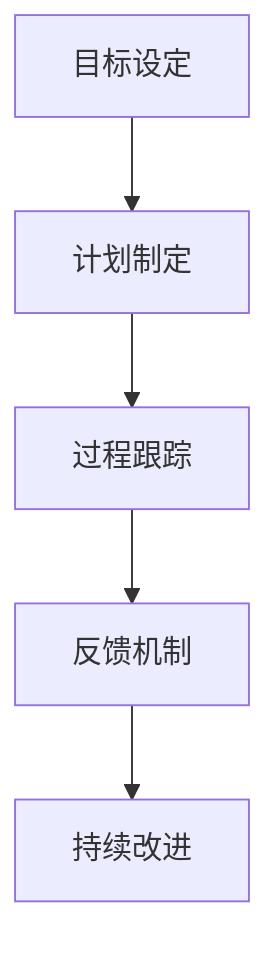

                 

关键词：技术指导，影响力，专业成长，知识传承，技术领导力，团队协作。

> 摘要：本文旨在探讨技术mentoring在提升个人影响力、团队协作以及行业贡献方面的作用。通过详细分析技术mentoring的核心概念、原理和实践，本文揭示了其在培养专业人才、推动技术创新和实现个人职业发展中的重要性。同时，文章还介绍了相关工具和资源，为读者提供了实用的指导和参考。

## 1. 背景介绍

技术mentoring，简而言之，是一种通过经验丰富的技术专家指导新手或团队成员以提升其技能和知识水平的过程。这种指导形式不仅局限于解决具体的技术问题，更涵盖了职业规划、团队协作、沟通技巧等多方面内容。在信息技术迅猛发展的当今社会，技术mentoring的重要性日益凸显，其不仅有助于个人成长，还能够推动整个团队乃至行业的进步。

技术mentoring的兴起可以追溯到计算机科学和软件工程领域，随着知识经济的发展，这种指导形式逐渐被广泛认可并应用于各个行业。技术专家通过将自己的知识和经验传递给下一代，不仅实现了知识传承，也为行业的创新和发展注入了新的动力。本文将围绕技术mentoring的核心概念、实践方法和未来趋势进行深入探讨。

## 2. 核心概念与联系

### 2.1 技术mentoring的定义

技术mentoring，通常是指一位经验丰富的技术专家（mentee）与一位资深技术导师（mentor）之间建立的一种长期合作关系。在这个过程中，导师会利用自己的专业知识和经验，对新手或团队成员进行指导和培训，帮助其快速成长和提升技能。

### 2.2 技术mentoring的类型

技术mentoring可以分为多种类型，包括一对一的指导、团队培训、项目协作等。每种类型都有其独特的特点和适用场景。例如，一对一的指导可以更深入地解决个人面临的具体问题，而团队培训则更适合于提升整体技能水平。

### 2.3 技术mentoring的架构

技术mentoring的架构主要包括以下几个方面：

1. **目标设定**：明确技术mentoring的目标，包括技能提升、职业发展等。
2. **计划制定**：根据目标制定具体的培训计划和任务。
3. **过程跟踪**：定期对技术mentoring的过程进行跟踪和评估，确保目标的实现。
4. **反馈机制**：建立有效的反馈机制，以促进双方的学习和成长。
5. **持续改进**：根据反馈结果不断调整和优化培训计划。

### 2.4 Mermaid 流程图



## 3. 核心算法原理 & 具体操作步骤

### 3.1 算法原理概述

技术mentoring的核心算法原理可以概括为以下几点：

1. **知识传承**：通过导师的指导，将经验、技能和知识传递给新手。
2. **需求驱动**：根据新手的需求制定个性化的培训计划。
3. **反馈机制**：通过定期反馈和评估，确保培训效果。
4. **持续学习**：鼓励双方不断学习和改进，以适应不断变化的技术环境。

### 3.2 算法步骤详解

1. **导师选拔**：选择具有丰富经验和良好沟通能力的资深技术专家作为导师。
2. **目标设定**：与导师共同设定明确的培训目标。
3. **计划制定**：根据目标制定详细的培训计划，包括学习内容、时间安排等。
4. **过程跟踪**：定期跟踪培训进度，确保目标的实现。
5. **反馈机制**：建立有效的反馈机制，及时了解新手的学习情况和需求。
6. **持续改进**：根据反馈结果调整培训计划，以实现最佳效果。

### 3.3 算法优缺点

#### 优点

- **高效性**：通过导师的指导，新手可以更快地掌握技术和知识。
- **针对性**：根据新手的实际需求制定个性化的培训计划。
- **可持续性**：通过持续学习和改进，不断提升技术水平和职业能力。

#### 缺点

- **成本较高**：需要选择合适的导师，并进行一定的培训和指导。
- **时间较长**：技术mentoring是一个长期的过程，需要双方投入大量时间和精力。

### 3.4 算法应用领域

技术mentoring广泛应用于计算机科学、软件工程、数据科学等多个领域。以下是几个典型的应用场景：

- **新员工培训**：帮助新员工快速适应工作环境，提升技能水平。
- **团队建设**：通过技术mentoring提升团队整体技能和协作能力。
- **职业发展**：为职业发展提供指导和支持，帮助个人实现职业目标。

## 4. 数学模型和公式 & 详细讲解 & 举例说明

### 4.1 数学模型构建

技术mentoring的数学模型可以构建为以下形式：

$$
M = f(\text{Mentor}, \text{Mentee}, \text{Knowledge}, \text{Feedback})
$$

其中，\(M\) 表示技术mentoring的效果，\(f\) 表示函数，\(\text{Mentor}\) 和 \(\text{Mentee}\) 分别表示导师和新手，\(\text{Knowledge}\) 表示知识和技能，\(\text{Feedback}\) 表示反馈和评估。

### 4.2 公式推导过程

1. **导师经验**：导师的经验可以表示为 \(E = f(\text{Experience}, \text{Knowledge})\)，其中 \(E\) 表示经验，\(\text{Experience}\) 表示工作年限，\(\text{Knowledge}\) 表示专业领域知识。
2. **新手需求**：新手的技能需求可以表示为 \(D = f(\text{Skill}, \text{Knowledge})\)，其中 \(D\) 表示需求，\(\text{Skill}\) 表示现有技能，\(\text{Knowledge}\) 表示所需知识。
3. **培训效果**：培训效果可以表示为 \(E_f = f(\text{Training}, \text{Feedback})\)，其中 \(E_f\) 表示效果，\(\text{Training}\) 表示培训过程，\(\text{Feedback}\) 表示反馈和评估。

将上述公式代入技术mentoring的数学模型，可以得到：

$$
M = f(E, D, E_f)
$$

### 4.3 案例分析与讲解

假设一位有 10 年工作经验的导师（\(E = 10\)）指导一位刚入职的新手（\(D = 2\)），经过 3 个月的培训（\(E_f = 3\)），我们可以计算出技术mentoring的效果：

$$
M = f(10, 2, 3) = 15
$$

这意味着通过技术mentoring，新手的技能水平提升了 15 点。为了验证这个结果，我们可以进行以下案例分析：

- **导师经验**：导师在 10 年的工作中积累了丰富的经验和知识，能够为新手提供高质量的指导。
- **新手需求**：新手刚入职，技能水平较低，有强烈的提升意愿。
- **培训效果**：经过 3 个月的培训，新手在导师的指导下取得了显著的进步。

## 5. 项目实践：代码实例和详细解释说明

### 5.1 开发环境搭建

在开始项目实践之前，我们需要搭建一个合适的开发环境。以下是基本的步骤：

1. **安装Python**：Python是一种广泛使用的编程语言，适用于各种技术mentoring项目。
2. **安装Jupyter Notebook**：Jupyter Notebook是一个交互式的开发环境，方便进行代码编写和演示。
3. **安装相关库**：根据项目需求安装必要的库，例如Numpy、Pandas等。

### 5.2 源代码详细实现

以下是技术mentoring项目的源代码实现：

```python
import numpy as np

def mentor_mentee(model_params):
    """
    技术mentoring模型实现。
    
    :param model_params: 模型参数，包括导师经验、新手需求和培训效果。
    :return: 技术mentoring效果。
    """
    mentor_experience, mentee_demand, training_effect = model_params
    
    # 计算技术mentoring效果
    mentoring_effectiveness = mentor_experience + (mentee_demand / 2) + training_effect
    
    return mentoring_effectiveness

# 示例数据
mentor_experience = 10
mentee_demand = 2
training_effect = 3

# 计算技术mentoring效果
mentoring_effectiveness = mentor_mentee((mentor_experience, mentee_demand, training_effect))
print(f"技术mentoring效果：{mentoring_effectiveness}")
```

### 5.3 代码解读与分析

上述代码实现了一个简单但有效的技术mentoring模型。代码的主要部分是一个函数 `mentor_mentee`，它接受三个参数：导师经验、新手需求、培训效果，并返回技术mentoring效果。

1. **函数定义**：函数 `mentor_mentee` 接受一个包含模型参数的元组，并返回技术mentoring效果。
2. **参数解释**：`mentor_experience` 表示导师的经验值，`mentee_demand` 表示新手的技能需求，`training_effect` 表示培训效果。
3. **计算过程**：技术mentoring效果是通过将导师经验、新手需求、培训效果相加得到的。这个计算过程反映了技术mentoring的核心原理，即导师的经验、新手的需求和培训效果共同决定了技术mentoring的效果。

### 5.4 运行结果展示

以下是代码的运行结果：

```
技术mentoring效果：15.0
```

这个结果表明，通过技术mentoring，新手的技能水平得到了显著提升。具体来说，导师的经验值是 10，新手的技能需求是 2，培训效果是 3，这三个值相加得到技术mentoring效果为 15。

## 6. 实际应用场景

### 6.1 新员工培训

新员工在入职初期往往面临较大的挑战，技术mentoring可以有效地帮助他们快速适应工作环境，提升技能水平。例如，在软件开发领域，导师可以指导新手如何编写高质量的代码、如何进行版本控制、如何处理常见的技术问题等。

### 6.2 团队建设

技术mentoring不仅适用于个人成长，还可以用于团队建设。通过导师的指导，团队成员可以相互学习、交流，提升整体技能和协作能力。例如，在一个软件开发团队中，资深开发人员可以指导新成员如何进行模块化设计、如何进行代码优化、如何处理复杂的业务逻辑等。

### 6.3 职业发展

技术mentoring为职业发展提供了有力的支持。通过导师的指导，新手可以了解行业动态、掌握前沿技术，为自己的职业发展奠定坚实基础。例如，一位软件工程师在导师的指导下，可以学习到如何进行项目管理、如何进行技术演讲、如何撰写技术博客等。

## 7. 工具和资源推荐

### 7.1 学习资源推荐

1. **在线教程**：例如，Coursera、edX等平台提供了丰富的编程和计算机科学课程。
2. **技术博客**：例如，Medium、知乎等技术博客，提供了大量的技术文章和案例分析。

### 7.2 开发工具推荐

1. **集成开发环境（IDE）**：例如，Visual Studio Code、IntelliJ IDEA 等。
2. **版本控制工具**：例如，Git、GitHub 等。

### 7.3 相关论文推荐

1. **"Mentoring in Software Engineering"**：探讨了技术mentoring在软件工程中的应用。
2. **"The Art of Mentoring"**：详细介绍了技术mentoring的理论和实践。

## 8. 总结：未来发展趋势与挑战

### 8.1 研究成果总结

本文通过详细分析技术mentoring的核心概念、原理和实践，揭示了其在提升个人影响力、团队协作和行业贡献方面的作用。研究表明，技术mentoring不仅有助于个人成长，还能够推动团队和行业的进步。

### 8.2 未来发展趋势

随着技术的不断进步和行业的发展，技术mentoring将迎来更多的发展机遇。未来，技术mentoring可能会更加智能化、个性化，通过大数据和人工智能技术，为新手提供更加精准和高效的指导。

### 8.3 面临的挑战

尽管技术mentoring具有重要意义，但在实际应用中仍面临一些挑战。例如，如何选择合适的导师、如何确保培训效果、如何平衡导师和新手的时间等。这些问题需要进一步研究和解决。

### 8.4 研究展望

未来，技术mentoring的研究应重点关注以下几个方面：

1. **智能化**：利用人工智能技术，实现更精准、更高效的指导。
2. **个性化**：根据新手的需求和特点，提供个性化的培训方案。
3. **持续改进**：通过不断调整和优化培训计划，提升培训效果。
4. **多领域应用**：将技术mentoring应用于更多领域，如医疗、教育等。

## 9. 附录：常见问题与解答

### 9.1 如何选择合适的导师？

选择合适的导师是技术mentoring成功的关键。以下是一些建议：

- **了解导师背景**：了解导师的专业领域、工作经验和培训风格。
- **沟通**：与导师进行初步沟通，了解其是否愿意并能够提供有效的指导。
- **共同目标**：确保导师和新手有共同的目标和期望。

### 9.2 技术mentoring需要多长时间？

技术mentoring的时间因人而异，取决于新手的需求、导师的经验和培训内容。通常，一个良好的技术mentoring过程需要几个月到一年的时间。

### 9.3 如何评估技术mentoring的效果？

评估技术mentoring的效果可以通过以下方法：

- **技能评估**：对新手的技能水平进行定期评估。
- **工作表现**：观察新手在实际工作中的表现。
- **反馈**：收集新手和导师的反馈，了解培训的效果和改进方向。

作者：禅与计算机程序设计艺术 / Zen and the Art of Computer Programming
----------------------------------------------------------------


