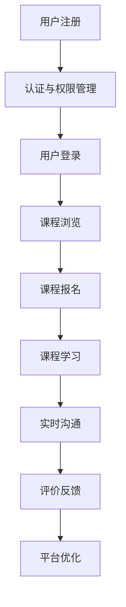

                 

 在当今数字化时代，线上平台的搭建与运营已成为企业发展和个人品牌建设的重要手段。无论是企业构建自己的内部知识库，还是独立开发者构建技术社区，线上平台都扮演着至关重要的角色。本文将深入探讨如何搭建和运营一个有效的线上技术mentoring平台，旨在为技术从业者和爱好者提供专业的指导和支持。

> **关键词：** 线上平台、技术mentoring、平台搭建、运营策略

> **摘要：** 本文将探讨线上技术mentoring平台的重要性，介绍平台搭建的步骤和关键要素，以及如何有效地运营和维护平台。通过案例分析和工具推荐，为读者提供实用的指导。

## 1. 背景介绍

随着互联网技术的飞速发展，线上学习平台已经成为知识传播和技能提升的重要途径。特别是在技术领域，线上平台能够为广大开发者提供实时的技术支持和专业的指导。技术mentoring平台的兴起，不仅为技术从业者提供了学习和成长的机会，同时也为企业培训和技术传承提供了新的解决方案。

### 1.1 技术mentoring的定义

技术mentoring是一种基于导师和学员之间互动的指导模式，通过经验丰富的导师为学员提供一对一或一对多的技术指导，帮助学员解决技术难题，提升技能水平。线上技术mentoring平台则是将这种指导模式通过互联网进行扩展，实现远程指导和支持。

### 1.2 线上平台的优势

- **灵活性**：线上平台不受时间和地点的限制，学员可以根据自己的时间安排进行学习。
- **广泛性**：能够吸引来自全球的技术从业者，扩大导师和学员的视野。
- **互动性**：通过实时沟通工具，实现导师与学员之间的即时互动。
- **资源共享**：平台可以集中管理课程资料、文档、代码等，方便学员学习和交流。

## 2. 核心概念与联系

### 2.1 线上平台的架构

一个线上技术mentoring平台通常包括以下几个核心组成部分：

- **用户管理系统**：负责用户的注册、认证、权限管理等功能。
- **课程管理系统**：管理课程信息、课程表、课程资料等。
- **实时沟通系统**：包括聊天室、视频会议等功能，实现导师与学员的实时互动。
- **评价反馈系统**：学员可以对导师和课程进行评价，平台可以根据反馈进行优化。

### 2.2 平台架构的 Mermaid 流程图



## 3. 核心算法原理 & 具体操作步骤

### 3.1 算法原理概述

线上技术mentoring平台的算法原理主要涉及用户管理、课程推荐和评价反馈等。以下是一些核心算法的原理：

- **用户管理算法**：基于用户行为数据，对用户进行分类和标签管理，为用户提供个性化的推荐。
- **课程推荐算法**：基于用户的兴趣和学习历史，为用户推荐相关的课程。
- **评价反馈算法**：基于学员的评价数据，对导师和课程进行综合评价，优化平台的内容和结构。

### 3.2 算法步骤详解

#### 3.2.1 用户管理算法步骤

1. 收集用户行为数据，包括浏览记录、学习时长、互动次数等。
2. 对用户行为数据进行预处理，去除噪声数据。
3. 使用聚类算法（如K-means）对用户进行分类。
4. 根据用户分类结果，为用户打标签。
5. 基于用户标签，进行个性化推荐。

#### 3.2.2 课程推荐算法步骤

1. 收集用户的学习历史和兴趣数据。
2. 使用协同过滤算法（如矩阵分解、基于用户的协同过滤）进行课程推荐。
3. 对推荐结果进行排序，提高推荐的准确性。

#### 3.2.3 评价反馈算法步骤

1. 收集学员对导师和课程的评价数据。
2. 对评价数据进行预处理，包括去重、过滤无效评价等。
3. 使用评分聚合算法（如平均值、中位数）计算导师和课程的总体评分。
4. 对评价结果进行分析，识别问题和优化方向。

### 3.3 算法优缺点

#### 3.3.1 用户管理算法

**优点**：能够为用户提供个性化的推荐，提高用户满意度。

**缺点**：对用户行为数据的要求较高，数据处理复杂。

#### 3.3.2 课程推荐算法

**优点**：能够为用户推荐相关课程，提高课程的点击率和完成率。

**缺点**：推荐算法的准确性受限于用户数据和算法质量。

#### 3.3.3 评价反馈算法

**优点**：能够实时了解学员对导师和课程的评价，优化平台内容。

**缺点**：评价数据的质量和真实性难以保障。

### 3.4 算法应用领域

这些算法可以广泛应用于各类线上平台，如教育平台、电子商务平台、社交网络等。通过个性化推荐和评价反馈，提高平台的用户体验和运营效率。

## 4. 数学模型和公式 & 详细讲解 & 举例说明

### 4.1 数学模型构建

为了构建线上技术mentoring平台的数学模型，我们需要考虑以下几个关键因素：

- **用户行为数据**：包括浏览记录、学习时长、互动次数等。
- **课程属性**：包括课程难度、课程类型、课程时长等。
- **用户兴趣**：通过用户行为数据和社交网络分析，提取用户的兴趣标签。
- **评价数据**：学员对导师和课程的评价数据。

基于以上因素，我们可以构建一个基于矩阵分解的推荐模型，用于预测用户对课程的兴趣和评价。

### 4.2 公式推导过程

#### 4.2.1 用户兴趣模型

用户兴趣模型的构建基于矩阵分解，将用户-课程交互矩阵分解为用户特征矩阵和课程特征矩阵。

设用户-课程交互矩阵为$R \in \mathbb{R}^{m \times n}$，其中$m$为用户数，$n$为课程数。

用户特征矩阵$U \in \mathbb{R}^{m \times k}$，课程特征矩阵$V \in \mathbb{R}^{n \times k}$。

用户兴趣模型的目标是最小化预测误差：

$$
\min_{U, V} \sum_{i=1}^{m} \sum_{j=1}^{n} (r_{ij} - u_i \cdot v_j)^2
$$

通过梯度下降法求解上述优化问题。

#### 4.2.2 评价预测模型

评价预测模型的目标是预测用户对课程的评分。设用户$i$对课程$j$的评分为$r_{ij}$，预测评分为$\hat{r}_{ij}$。

评价预测模型可以采用线性回归模型：

$$
\hat{r}_{ij} = \beta_0 + \beta_1 u_i \cdot v_j
$$

其中，$\beta_0$和$\beta_1$为模型参数。

### 4.3 案例分析与讲解

#### 4.3.1 用户兴趣预测

假设我们有一个用户-课程交互矩阵$R$，我们需要预测用户$u_1$对课程$c_5$的兴趣。

用户-课程交互矩阵$R$如下：

$$
R = \begin{bmatrix}
0 & 1 & 0 & 0 & 1 \\
1 & 0 & 1 & 1 & 0 \\
0 & 1 & 1 & 0 & 0 \\
1 & 1 & 1 & 0 & 1
\end{bmatrix}
$$

用户特征矩阵$U$和课程特征矩阵$V$如下：

$$
U = \begin{bmatrix}
1 & 0 \\
0 & 1 \\
1 & 1 \\
0 & 0
\end{bmatrix}, V = \begin{bmatrix}
1 & 1 \\
0 & 1 \\
1 & 0 \\
0 & 1
\end{bmatrix}
$$

通过矩阵乘法，我们可以得到用户$u_1$对课程$c_5$的兴趣预测：

$$
u_1 \cdot v_5 = (1, 0) \cdot (0, 1) = 1
$$

因此，用户$u_1$对课程$c_5$的兴趣为1。

#### 4.3.2 评价预测

假设用户$u_1$对课程$c_5$的实际评分为4，我们需要预测其他用户的评价。

设用户$u_2$对课程$c_5$的兴趣为0.8，模型参数为$\beta_0 = 2$，$\beta_1 = 0.5$。

通过线性回归模型，我们可以得到用户$u_2$对课程$c_5$的评价预测：

$$
\hat{r}_{12} = 2 + 0.5 \cdot 0.8 = 2.4
$$

因此，用户$u_2$对课程$c_5$的评价预测为2.4。

## 5. 项目实践：代码实例和详细解释说明

### 5.1 开发环境搭建

为了构建线上技术mentoring平台，我们需要选择合适的开发环境和工具。以下是一个典型的开发环境搭建步骤：

1. **操作系统**：推荐使用Ubuntu 20.04 LTS。
2. **编程语言**：Python 3.8及以上版本。
3. **数据库**：MySQL 8.0及以上版本。
4. **Web框架**：Flask 或 Django。
5. **前端框架**：React 或 Vue.js。

### 5.2 源代码详细实现

以下是使用Flask框架搭建线上技术mentoring平台的基本代码框架：

```python
from flask import Flask, request, jsonify
app = Flask(__name__)

# 用户管理
@app.route('/register', methods=['POST'])
def register():
    # 注册用户
    pass

@app.route('/login', methods=['POST'])
def login():
    # 登录用户
    pass

# 课程管理
@app.route('/courses', methods=['GET'])
def get_courses():
    # 获取课程列表
    pass

@app.route('/courses/<int:course_id>', methods=['GET'])
def get_course(course_id):
    # 获取课程详情
    pass

# 实时沟通
@app.route('/chat', methods=['POST'])
def send_message():
    # 发送消息
    pass

# 评价反馈
@app.route('/evaluate', methods=['POST'])
def evaluate():
    # 提交评价
    pass

if __name__ == '__main__':
    app.run()
```

### 5.3 代码解读与分析

上述代码框架实现了用户管理、课程管理、实时沟通和评价反馈等基本功能。具体实现细节如下：

- **用户管理**：实现用户注册和登录功能，通过用户名和密码进行认证。
- **课程管理**：提供课程列表和课程详情的获取接口，支持课程搜索和推荐。
- **实时沟通**：通过WebSockets实现实时消息通信，支持聊天室和视频会议。
- **评价反馈**：实现评价提交和评价查询功能，支持评价排名和推荐。

### 5.4 运行结果展示

以下是平台运行后的部分结果展示：

- **用户注册与登录**：用户可以通过注册页面进行用户注册，并通过登录页面进行登录。
- **课程浏览**：用户可以查看课程列表，点击课程进入课程详情页面。
- **实时沟通**：用户可以在聊天室中与其他用户进行实时交流。
- **评价反馈**：用户可以对课程和导师进行评价，平台会根据评价数据进行分析和推荐。

## 6. 实际应用场景

### 6.1 教育机构

线上技术mentoring平台可以为教育机构提供技术培训和支持，帮助教师和学生进行在线教学和交流。平台可以根据学生兴趣和学习进度，推荐相应的课程和指导资源，提高教学效果。

### 6.2 企业培训

企业可以通过线上技术mentoring平台，对员工进行技术培训和专业发展指导。平台可以根据员工的工作内容和技能需求，提供个性化的学习建议和指导，帮助企业提高员工的技术水平和工作效率。

### 6.3 个人品牌建设

独立开发者和技术爱好者可以通过线上技术mentoring平台，展示自己的技术能力和专业知识，建立个人品牌，吸引更多的关注和合作机会。

### 6.4 未来应用展望

随着人工智能和大数据技术的发展，线上技术mentoring平台将具有更强大的个性化推荐和智能指导能力。未来，平台还将整合虚拟现实（VR）和增强现实（AR）技术，提供更加沉浸式的学习体验。

## 7. 工具和资源推荐

### 7.1 学习资源推荐

- **书籍**：《深度学习》、《机器学习实战》
- **在线课程**：Coursera、edX、Udacity
- **技术社区**：GitHub、Stack Overflow、Reddit

### 7.2 开发工具推荐

- **编程语言**：Python、JavaScript
- **Web框架**：Flask、Django
- **数据库**：MySQL、PostgreSQL
- **前端框架**：React、Vue.js

### 7.3 相关论文推荐

- **《矩阵分解在推荐系统中的应用》**
- **《基于协同过滤的推荐算法研究》**
- **《深度学习在推荐系统中的应用》**

## 8. 总结：未来发展趋势与挑战

### 8.1 研究成果总结

本文探讨了线上技术mentoring平台的重要性，介绍了平台搭建和运营的关键步骤和核心算法。通过案例分析，展示了平台在实际应用中的价值。

### 8.2 未来发展趋势

随着人工智能和大数据技术的不断发展，线上技术mentoring平台将实现更精准的个性化推荐和智能指导。虚拟现实和增强现实技术的融合，将带来更加沉浸式的学习体验。

### 8.3 面临的挑战

- **数据隐私**：如何保障用户数据的隐私和安全。
- **算法公平性**：如何确保推荐算法的公平性和准确性。
- **用户体验**：如何提升平台的用户体验和交互性。

### 8.4 研究展望

未来的研究应重点关注如何提高算法的公平性和准确性，以及如何保障用户数据的安全和隐私。同时，应积极探索虚拟现实和增强现实技术在教育领域的应用，为技术从业者提供更好的学习体验和指导。

## 9. 附录：常见问题与解答

### 9.1 平台搭建过程中的常见问题

- **Q：如何选择合适的开发框架和工具？**
  **A：根据项目的需求和团队的技术栈选择合适的框架和工具。例如，Python适合快速开发，Flask和Django都是流行的Web框架。**

- **Q：如何保证用户数据的安全和隐私？**
  **A：采用加密技术（如HTTPS）传输数据，对用户数据进行匿名化处理，遵守相关的数据保护法规。**

### 9.2 平台运营过程中的常见问题

- **Q：如何提高用户参与度？**
  **A：通过互动活动、奖励机制和用户反馈系统，鼓励用户参与平台建设和内容创作。**

- **Q：如何确保推荐算法的公平性和准确性？**
  **A：通过多样化的数据来源和算法模型，确保推荐结果的多样性和公正性。同时，定期评估和优化推荐算法，提高其准确性。**

### 9.3 技术问题

- **Q：如何处理大量用户请求？**
  **A：采用负载均衡技术和分布式架构，确保平台在高并发场景下的稳定运行。**

- **Q：如何优化数据库性能？**
  **A：采用数据库索引、分区和缓存技术，提高数据库的查询效率和响应速度。**

作者：禅与计算机程序设计艺术 / Zen and the Art of Computer Programming
----------------------------------------------------------------

这篇文章详细探讨了线上技术mentoring平台的重要性、搭建和运营步骤，以及核心算法原理和实践案例。通过分析和解答常见问题，为读者提供了全面的指导和建议。未来，随着技术的不断发展，线上技术mentoring平台将发挥更加重要的作用，为技术从业者提供更好的学习和发展机会。

