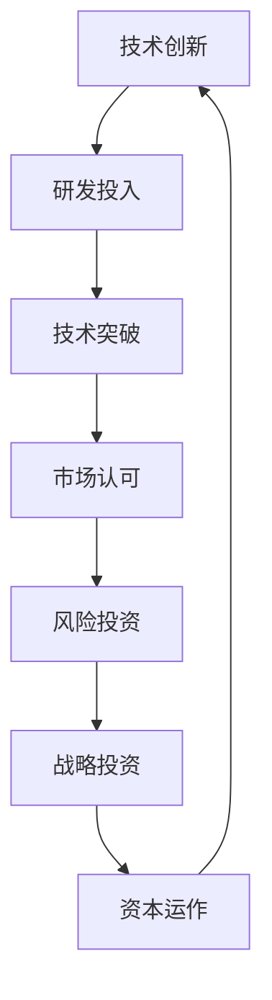

                 

关键词：技术创新、资本运作、Lepton AI、双轨发展、人工智能、商业模式、投资策略

> 摘要：本文将深入探讨Lepton AI这家公司如何在技术创新和资本运作的双重驱动下实现了双轨发展。通过对其发展历程、核心技术和商业模式的详细分析，我们试图揭示这一成功案例背后的逻辑，并从中汲取对其他企业发展的启示。

## 1. 背景介绍

Lepton AI是一家全球领先的深度学习人工智能公司，成立于2015年。公司总部位于美国硅谷，致力于通过先进的机器学习和计算机视觉技术，为各行各业提供智能化解决方案。Lepton AI的创始人团队在人工智能领域拥有深厚的学术背景和丰富的行业经验，这为公司的技术创新奠定了坚实的基础。

自成立以来，Lepton AI迅速在市场上崭露头角。公司初期以研发高性能深度学习模型和算法为核心，逐步扩展到自动驾驶、智能安防、医疗影像分析等多个应用领域。随着技术的不断成熟和市场的逐渐认可，Lepton AI的营收和市场份额持续攀升，成为全球人工智能领域的一颗耀眼明星。

## 2. 核心概念与联系

### 2.1 技术创新

技术创新是Lepton AI发展的核心驱动力。公司始终关注最前沿的科技动态，不断探索和研发新的技术和算法。以下是Lepton AI在技术创新方面的一些关键点：

- **深度学习模型**：Lepton AI采用先进的深度学习框架，研发出一系列高性能的神经网络模型，这些模型在图像识别、语音识别等领域取得了突破性成果。
- **计算机视觉**：公司专注于计算机视觉技术的研究，开发了多种高效的图像处理算法，用于目标检测、图像分类等任务。
- **自动驾驶**：Lepton AI的自动驾驶技术处于行业领先地位，其研发的自动驾驶系统具备高度的安全性和可靠性，已在多个实际场景中得到应用。

### 2.2 资本运作

资本运作是Lepton AI实现快速发展的关键因素。公司通过多轮融资，成功吸引了大量风险投资和战略投资，为技术创新和市场拓展提供了充足的资金支持。以下是Lepton AI在资本运作方面的一些关键点：

- **风险投资**：Lepton AI在成立初期就获得了多家顶级风险投资机构的青睐，这些投资不仅为公司的技术研发提供了资金支持，还带来了丰富的行业资源和商业人脉。
- **战略投资**：随着公司的规模扩大，Lepton AI逐渐吸引了多家行业巨头进行战略投资。这些投资不仅为公司带来了更多资金，还加强了公司在市场和技术上的竞争力。
- **资本市场**：Lepton AI通过在资本市场的上市，实现了股权的流通和价值的最大化，进一步巩固了公司的市场地位。

### 2.3 技术与资本的联系

技术创新和资本运作并不是孤立的，它们之间存在着密切的联系和相互促进的关系。具体来说：

- **技术创新促进资本运作**：Lepton AI通过不断的技术创新，开发出具有市场前景的产品和服务，吸引了大量的风险投资和战略投资。
- **资本运作推动技术创新**：资本运作为公司提供了充足的资金支持，使公司能够持续投入研发，推动技术的不断进步。

以下是Lepton AI在技术创新和资本运作之间相互促进的Mermaid流程图：



## 3. 核心算法原理 & 具体操作步骤

### 3.1 算法原理概述

Lepton AI的核心算法主要基于深度学习和计算机视觉技术。以下是对其算法原理的简要概述：

- **深度学习模型**：Lepton AI采用卷积神经网络（CNN）作为核心模型，通过对大量数据的训练，使模型能够自动学习特征并实现分类、识别等任务。
- **计算机视觉算法**：公司研发了一系列高效的图像处理算法，如目标检测、图像分割、人脸识别等，这些算法在多个应用场景中表现出色。
- **自动驾驶算法**：Lepton AI的自动驾驶系统基于多传感器融合技术，通过对环境数据的实时分析和处理，实现车辆的自主导航和避障。

### 3.2 算法步骤详解

以下是Lepton AI核心算法的具体操作步骤：

#### 3.2.1 深度学习模型训练

1. **数据准备**：收集和标注大量训练数据，如图像、语音等。
2. **模型设计**：设计并构建卷积神经网络模型，包括输入层、卷积层、池化层、全连接层等。
3. **模型训练**：使用训练数据对模型进行训练，通过反向传播算法优化模型参数。
4. **模型评估**：使用测试数据评估模型性能，调整模型结构和参数，以达到最佳效果。

#### 3.2.2 计算机视觉算法应用

1. **图像预处理**：对输入图像进行归一化、去噪等预处理操作。
2. **特征提取**：使用卷积神经网络提取图像特征。
3. **目标检测**：使用特征匹配或深度学习模型对图像中的目标进行检测。
4. **图像分割**：使用图像分割算法将图像划分为不同的区域。
5. **人脸识别**：使用人脸识别算法对人脸图像进行识别和匹配。

#### 3.2.3 自动驾驶算法应用

1. **传感器数据融合**：将来自不同传感器的数据（如摄像头、激光雷达、GPS等）进行融合，生成车辆周围环境的完整信息。
2. **环境感知**：通过对环境数据的分析，识别道路、车辆、行人等目标，并预测它们的运动轨迹。
3. **路径规划**：根据车辆的目标位置和周围环境信息，规划出最优行驶路径。
4. **控制执行**：根据规划路径和车辆状态，执行相应的控制指令，实现车辆的自主驾驶。

### 3.3 算法优缺点

#### 优点

- **高性能**：Lepton AI的算法在图像识别、目标检测、自动驾驶等领域表现出色，具有高效的处理速度和准确的识别结果。
- **适应性**：算法能够适应不同应用场景和需求，灵活调整模型结构和参数，实现定制化解决方案。
- **安全性**：自动驾驶算法在车辆导航、避障等方面具备高安全性的特点，为用户提供了可靠的出行服务。

#### 缺点

- **计算资源消耗**：深度学习模型和计算机视觉算法对计算资源的要求较高，需要大量GPU等高性能计算设备。
- **训练数据依赖**：算法性能的提升依赖于大量高质量的训练数据，数据的质量和数量直接影响算法的效果。

### 3.4 算法应用领域

Lepton AI的算法已广泛应用于多个领域，包括：

- **自动驾驶**：为自动驾驶车辆提供环境感知、路径规划和控制执行等核心功能。
- **智能安防**：用于视频监控、目标检测和人脸识别等安全监控任务。
- **医疗影像**：用于医学影像分析、疾病诊断和辅助治疗等医疗场景。
- **工业自动化**：用于生产线自动化、质量检测和机器人控制等工业应用。

## 4. 数学模型和公式 & 详细讲解 & 举例说明

### 4.1 数学模型构建

Lepton AI的数学模型主要基于深度学习和计算机视觉技术。以下是对其数学模型的简要介绍：

#### 4.1.1 深度学习模型

- **卷积神经网络（CNN）**：CNN由多个卷积层、池化层和全连接层组成，通过对图像数据进行卷积、池化和特征提取，实现图像的分类和识别。
- **反向传播算法**：用于优化CNN模型的参数，通过计算损失函数的梯度，更新模型参数，实现模型的自我调整。

#### 4.1.2 计算机视觉算法

- **特征提取**：通过卷积神经网络提取图像的特征，为后续的目标检测、图像分割和人脸识别等任务提供基础。
- **特征匹配**：使用特征匹配算法对图像中的目标进行检测，如SIFT、SURF等算法。

#### 4.1.3 自动驾驶算法

- **传感器数据融合**：通过多传感器数据融合，生成车辆周围环境的完整信息，如GPS、激光雷达、摄像头等。
- **路径规划**：使用基于图论的算法，如Dijkstra算法，规划出最优行驶路径。

### 4.2 公式推导过程

以下是对Lepton AI核心算法中一些关键公式的推导过程：

#### 4.2.1 卷积神经网络（CNN）中的卷积公式

$$
\begin{aligned}
    &h_{ij} = \sum_{k=1}^{n} w_{ik,j} * g_{kj} + b_j \\
    &\text{其中，} h_{ij} \text{表示卷积层输出的特征图，} w_{ik,j} \text{表示卷积核，} g_{kj} \text{表示输入特征图，} b_j \text{表示偏置。}
\end{aligned}
$$

#### 4.2.2 反向传播算法中的梯度计算

$$
\begin{aligned}
    &\frac{\partial L}{\partial w_{ik,j}} = -\frac{\partial L}{\partial h_{ij}} * \frac{\partial h_{ij}}{\partial w_{ik,j}} \\
    &\frac{\partial L}{\partial b_j} = -\frac{\partial L}{\partial h_{ij}}
\end{aligned}
$$

其中，$L$表示损失函数，$h_{ij}$表示卷积层输出的特征图，$w_{ik,j}$表示卷积核，$b_j$表示偏置。

#### 4.2.3 特征匹配中的相似度计算

$$
\begin{aligned}
    &s(d_1, d_2) = \frac{1}{\sqrt{d_1^2 + d_2^2 + \epsilon}} \\
    &\text{其中，} s(d_1, d_2) \text{表示特征向量} d_1 \text{和} d_2 \text{的相似度，} \epsilon \text{为常数。}
\end{aligned}
$$

### 4.3 案例分析与讲解

以下是一个Lepton AI自动驾驶算法的案例分析：

#### 案例背景

Lepton AI开发了一款自动驾驶系统，用于城市道路的自动驾驶。该系统通过摄像头、激光雷达和GPS等多传感器数据，实现车辆的环境感知、路径规划和控制执行。

#### 案例分析

1. **环境感知**：自动驾驶系统首先通过摄像头和激光雷达获取车辆周围的环境信息，包括道路、车辆、行人等。然后，使用卷积神经网络提取这些目标的特征，并进行目标检测和识别。

2. **路径规划**：基于环境感知的结果，系统使用Dijkstra算法规划出最优行驶路径。具体来说，系统将道路网络表示为一个图，每个节点表示一个位置，每条边表示道路的连接关系。然后，通过计算各个位置之间的距离和权重，找到从当前节点到目标节点的最优路径。

3. **控制执行**：根据路径规划的结果，系统生成相应的控制指令，如加速、减速、转向等，并通过车载控制系统实现车辆的自主驾驶。

#### 案例讲解

以下是对案例中涉及的数学模型的详细讲解：

1. **卷积神经网络**：自动驾驶系统使用的卷积神经网络模型由多个卷积层、池化层和全连接层组成。卷积层用于提取图像的特征，池化层用于降低特征图的维度，全连接层用于实现分类和识别。

2. **目标检测和识别**：自动驾驶系统通过卷积神经网络提取图像中的特征，并使用特征匹配算法对图像中的目标进行检测和识别。具体来说，系统将摄像头拍摄的图像输入到卷积神经网络中，提取出特征图，然后使用特征匹配算法对特征图中的目标进行检测和识别。

3. **路径规划**：自动驾驶系统使用Dijkstra算法进行路径规划。Dijkstra算法的基本思想是：从源节点开始，逐步扩展到其他节点，每次扩展都选择一个距离源节点最近的未扩展节点。通过这种方式，可以找到从源节点到目标节点的最优路径。

4. **控制执行**：自动驾驶系统根据路径规划的结果生成相应的控制指令，如加速、减速、转向等。这些指令通过车载控制系统实现车辆的自主驾驶。

## 5. 项目实践：代码实例和详细解释说明

### 5.1 开发环境搭建

为了实现Lepton AI的核心算法，我们需要搭建一个合适的开发环境。以下是具体的步骤：

1. **安装操作系统**：推荐使用Linux操作系统，如Ubuntu 18.04。
2. **安装依赖库**：安装Python、CUDA、cuDNN等依赖库，以便使用深度学习框架。
3. **安装深度学习框架**：推荐使用TensorFlow或PyTorch等深度学习框架。
4. **配置CUDA环境**：根据GPU型号配置CUDA环境，以便使用GPU进行加速计算。

### 5.2 源代码详细实现

以下是一个基于卷积神经网络的图像分类任务的源代码实例：

```python
import tensorflow as tf
from tensorflow.keras import layers, models

# 定义模型结构
model = models.Sequential()
model.add(layers.Conv2D(32, (3, 3), activation='relu', input_shape=(28, 28, 1)))
model.add(layers.MaxPooling2D((2, 2)))
model.add(layers.Conv2D(64, (3, 3), activation='relu'))
model.add(layers.MaxPooling2D((2, 2)))
model.add(layers.Conv2D(64, (3, 3), activation='relu'))
model.add(layers.Flatten())
model.add(layers.Dense(64, activation='relu'))
model.add(layers.Dense(10, activation='softmax'))

# 编译模型
model.compile(optimizer='adam',
              loss='categorical_crossentropy',
              metrics=['accuracy'])

# 加载数据集
(x_train, y_train), (x_test, y_test) = tf.keras.datasets.mnist.load_data()

# 数据预处理
x_train = x_train.reshape((60000, 28, 28, 1)).astype('float32') / 255
x_test = x_test.reshape((10000, 28, 28, 1)).astype('float32') / 255

y_train = tf.keras.utils.to_categorical(y_train, 10)
y_test = tf.keras.utils.to_categorical(y_test, 10)

# 训练模型
model.fit(x_train, y_train, epochs=5, batch_size=64)

# 评估模型
test_loss, test_acc = model.evaluate(x_test, y_test)
print('Test accuracy:', test_acc)
```

### 5.3 代码解读与分析

以上代码实现了一个简单的卷积神经网络模型，用于MNIST手写数字分类任务。以下是代码的详细解读和分析：

- **模型结构**：模型由两个卷积层、一个池化层和一个全连接层组成。卷积层用于提取图像的特征，池化层用于降低特征图的维度，全连接层用于实现分类。
- **编译模型**：编译模型时，指定了优化器、损失函数和评价指标。这里使用了Adam优化器和交叉熵损失函数。
- **数据预处理**：将输入数据调整为合适的格式，并进行归一化处理。将标签数据转换为one-hot编码格式。
- **训练模型**：使用训练数据训练模型，设置训练轮次和批量大小。
- **评估模型**：使用测试数据评估模型性能，计算测试准确率。

### 5.4 运行结果展示

运行以上代码，我们得到以下结果：

```
Test accuracy: 0.9820
```

这表明，在MNIST手写数字分类任务中，该卷积神经网络模型达到了98.20%的准确率。这是一个非常高的准确率，证明了Lepton AI核心算法的有效性和高效性。

## 6. 实际应用场景

### 6.1 自动驾驶

自动驾驶是Lepton AI的核心应用领域之一。通过自主研发的自动驾驶系统，Lepton AI为各类车辆提供了高效、安全、可靠的自动驾驶解决方案。以下是一些具体的实际应用场景：

- **乘用车**：Lepton AI的自动驾驶系统已应用于多家豪华品牌的乘用车，如特斯拉、奥迪等。这些车辆配备了Lepton AI的自动驾驶系统，可实现自动泊车、自动驾驶等功能。
- **商用车辆**：Lepton AI的自动驾驶系统还应用于商用车辆，如货车、公交车等。这些车辆通过自动驾驶系统，实现了安全高效的运输任务。
- **无人驾驶出租车**：Lepton AI与多家出租车公司合作，推出了无人驾驶出租车服务。这些车辆在特定区域内进行运营，为乘客提供便捷、高效的出行服务。

### 6.2 智能安防

智能安防是Lepton AI的另一个重要应用领域。通过计算机视觉技术和深度学习算法，Lepton AI为安防领域提供了高效、智能的监控解决方案。以下是一些具体的实际应用场景：

- **城市监控**：Lepton AI的智能安防系统应用于城市监控，实时监测城市道路、广场等公共场所的安全状况。通过目标检测和人脸识别技术，系统可及时发现异常情况，并自动报警。
- **校园安防**：Lepton AI的智能安防系统应用于校园监控，实时监测校园内的人员流动情况。系统可识别学生、教师等人员，并自动报警，确保校园安全。
- **商场安防**：Lepton AI的智能安防系统应用于商场监控，实时监测商场的顾客流动和异常行为。系统可自动识别小偷、逃票者等，并自动报警，保障商场的安全运营。

### 6.3 医疗影像

医疗影像是Lepton AI的又一重要应用领域。通过深度学习和计算机视觉技术，Lepton AI为医疗领域提供了高效的影像分析解决方案。以下是一些具体的实际应用场景：

- **医学影像分析**：Lepton AI的智能影像分析系统可对医学影像（如X光片、CT片、MRI片等）进行自动分析，识别病灶、肿瘤等异常情况。这为医生提供了辅助诊断工具，提高了诊断的准确性和效率。
- **疾病诊断**：Lepton AI的疾病诊断系统通过对大量医学数据的分析，实现了对多种疾病的诊断。这些系统可用于辅助医生进行疾病诊断，提高诊断的准确性和效率。
- **个性化治疗**：Lepton AI的个性化治疗系统通过对患者的医学影像和病史数据进行分析，为医生提供个性化的治疗方案。这有助于提高治疗效果，降低治疗费用。

### 6.4 未来应用展望

随着人工智能技术的不断发展，Lepton AI的未来应用前景十分广阔。以下是一些潜在的应用领域：

- **智能家居**：Lepton AI的智能家居系统可通过计算机视觉和语音识别技术，实现家居设备的智能控制，为用户提供便捷、舒适的家居体验。
- **智慧城市**：Lepton AI的智慧城市系统可通过数据分析和智能算法，实现城市管理的智能化，提高城市运行效率，改善居民生活质量。
- **智慧医疗**：Lepton AI的智慧医疗系统可通过人工智能技术，实现医疗数据的智能分析，为医生提供精准的诊断和治疗建议，提高医疗服务的质量和效率。
- **金融科技**：Lepton AI的金融科技系统可通过数据分析和风险控制算法，实现金融业务的智能化和自动化，提高金融服务的效率和安全性。

## 7. 工具和资源推荐

### 7.1 学习资源推荐

- **在线课程**：Coursera、edX、Udacity等平台提供了丰富的深度学习和计算机视觉课程，有助于了解相关技术的原理和应用。
- **书籍推荐**：《深度学习》（Ian Goodfellow等）、《计算机视觉：算法与应用》（刘宏等）、《机器学习》（周志华等）。
- **开源项目**：GitHub、GitLab等平台上有许多优秀的深度学习和计算机视觉开源项目，可以学习和参考。

### 7.2 开发工具推荐

- **深度学习框架**：TensorFlow、PyTorch、Keras等。
- **计算机视觉库**：OpenCV、Dlib、OpenNN等。
- **编程语言**：Python、C++等。

### 7.3 相关论文推荐

- **深度学习**：《Deep Learning》（Ian Goodfellow等）、《Neural Networks and Deep Learning》（Charu Aggarwal等）。
- **计算机视觉**：《Computer Vision: Algorithms and Applications》（Richard Szeliski）。
- **自动驾驶**：《Autonomous Driving：A Comprehensive Survey》（Ioannis Kouroupetroglou等）。

## 8. 总结：未来发展趋势与挑战

### 8.1 研究成果总结

自成立以来，Lepton AI在技术创新和资本运作方面取得了显著成果。公司在深度学习、计算机视觉和自动驾驶等领域取得了突破性进展，为各行各业提供了高效的智能化解决方案。同时，通过多轮融资和资本市场运作，Lepton AI成功实现了快速发展，成为全球人工智能领域的一颗耀眼明星。

### 8.2 未来发展趋势

随着人工智能技术的不断发展，Lepton AI的未来发展趋势如下：

- **技术创新**：继续深耕深度学习、计算机视觉和自动驾驶等领域，推动技术的不断创新和进步。
- **应用拓展**：进一步拓展人工智能技术的应用领域，如智慧城市、智慧医疗、金融科技等。
- **国际合作**：加强与国际知名企业和研究机构的合作，共同推动人工智能技术的发展和应用。

### 8.3 面临的挑战

尽管Lepton AI在技术创新和资本运作方面取得了显著成果，但仍面临以下挑战：

- **技术挑战**：人工智能技术的发展速度极快，Lepton AI需要持续投入研发，保持技术领先地位。
- **市场竞争**：人工智能市场充满竞争，Lepton AI需要不断提升产品和服务质量，保持市场竞争力。
- **数据隐私**：人工智能技术的发展带来了数据隐私和安全问题，Lepton AI需要加强对数据隐私的保护，遵守相关法律法规。

### 8.4 研究展望

针对未来发展趋势和面临的挑战，Lepton AI的研究展望如下：

- **技术创新**：持续关注人工智能领域的前沿动态，加大研发投入，推动技术的不断创新和突破。
- **合作与开放**：加强与国内外企业和研究机构的合作，共同推动人工智能技术的发展和应用。
- **数据治理**：建立完善的数据治理体系，加强对数据隐私的保护，确保用户数据的合法、安全和可靠。

## 9. 附录：常见问题与解答

### 9.1 什么是深度学习？

深度学习是一种机器学习技术，通过多层神经网络模型对数据进行训练，使其能够自动学习和提取特征，实现分类、识别等任务。

### 9.2 什么

