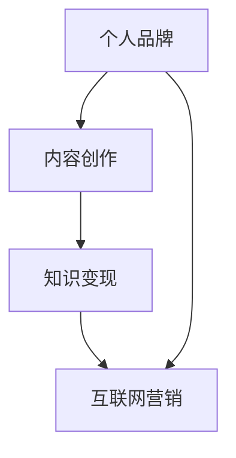

                 

关键词：技术博客，个人品牌，知识变现，内容创作，互联网营销

> 摘要：本文旨在探讨如何通过技术博客，从个人的兴趣爱好发展成为主要收入来源。文章将分析技术博客的现状，阐述个人品牌建设的重要性，并提供实用的策略和工具，帮助读者实现这一转变。

## 1. 背景介绍

在互联网时代，博客成为了知识传播的重要渠道。许多技术专家和爱好者通过博客分享他们的知识和经验，不仅丰富了互联网内容，还为自己创造了价值。随着内容营销的兴起，越来越多的技术博客开始转化为个人的主要收入来源。本文将探讨这一转变的路径和策略。

### 技术博客的现状

技术博客已经成为互联网中不可或缺的一部分。根据统计，技术博客在互联网内容中占据了相当大的比例，并且拥有稳定的读者群。以下是一些关于技术博客的现状：

- 技术博客的受众广泛，涵盖了不同年龄段、职业背景和兴趣爱好的人群。
- 技术博客的内容丰富多样，从编程技巧到产品评测，从技术趋势到行业动态，应有尽有。
- 许多知名技术博客已经成为行业标杆，吸引着大量的关注和流量。

### 个人品牌建设的重要性

在技术领域，个人品牌的力量不容忽视。一个强大的个人品牌不仅能提高你在行业中的影响力，还能为你带来更多的机会和收益。以下是一些关于个人品牌建设的重要性：

- 个人品牌有助于提高你的专业形象，增强你的可信度。
- 建立个人品牌可以让你在竞争激烈的市场中脱颖而出。
- 一个强大的个人品牌可以为你吸引更多的机会，包括合作、演讲和咨询。

## 2. 核心概念与联系

为了更好地理解如何通过技术博客实现收入增长，我们需要明确一些核心概念：

### 个人品牌

个人品牌是指一个人在公众中的形象和声誉。在技术领域，个人品牌通常包括以下方面：

- 技术专长
- 行业影响力
- 个人价值观
- 专业形象

### 内容创作

内容创作是指创作各种形式的内容，如文章、视频、播客等，以传达信息和价值。在技术博客中，内容创作是核心环节，决定了博客的吸引力和影响力。

### 知识变现

知识变现是指将个人的知识和经验转化为经济利益的过程。在技术博客中，知识变现通常通过以下几种方式实现：

- 广告收入
- 付费内容
- 合作与咨询
- 产品销售

### 互联网营销

互联网营销是指利用互联网渠道进行产品或服务的推广和销售。在技术博客中，互联网营销是吸引流量、增加收入的重要手段。

### Mermaid 流程图



## 3. 核心算法原理 & 具体操作步骤

### 3.1 算法原理概述

通过技术博客实现收入增长的核心算法可以概括为以下几点：

- 内容质量：确保博客内容具有高质量、实用性、独特性。
- 定位明确：明确博客的受众群体和内容方向。
- 互动交流：积极与读者互动，了解他们的需求和反馈。
- 持续更新：定期发布新内容，保持博客的活跃度。
- 营销推广：利用互联网营销手段，扩大博客的影响力和受众。

### 3.2 算法步骤详解

#### 步骤1：确定博客主题和定位

- 分析自身优势和兴趣
- 研究目标受众和市场需求
- 确定博客的核心主题和方向

#### 步骤2：创建高质量内容

- 研究和了解最新的技术趋势
- 深入分析问题并提供解决方案
- 使用图表、代码示例等丰富内容形式

#### 步骤3：建立个人品牌

- 定期更新博客，保持活跃度
- 参与社区讨论，提高知名度
- 发布原创内容，展示专业能力

#### 步骤4：实施互联网营销

- 利用社交媒体平台推广博客
- 与其他博主合作，扩大影响力
- 开展付费课程或咨询服务

#### 步骤5：持续优化和调整

- 定期分析博客数据，了解用户需求
- 根据反馈调整内容策略
- 不断学习和提升自己的技能

### 3.3 算法优缺点

#### 优点

- 可持续性强：技术博客是一个长期的过程，只要持续努力，就能不断积累价值。
- 自主性强：你可以自由地选择内容方向和表达方式。
- 收益多样化：除了广告收入，还可以通过其他方式实现知识变现。

#### 缺点

- 初始投入较大：需要一定的时间和精力来建立博客和个人品牌。
- 竞争激烈：技术领域竞争激烈，需要不断提升自己的竞争力。
- 收益不稳定：初期收益可能较低，需要耐心和坚持。

### 3.4 算法应用领域

- 技术专家的个人品牌建设
- 企业技术团队的内部知识管理
- 教育机构的技术课程分享
- 自媒体平台的商业化运作

## 4. 数学模型和公式 & 详细讲解 & 举例说明

### 4.1 数学模型构建

在技术博客中，数学模型的应用非常广泛。以下是一个简单的数学模型，用于计算博客的潜在收益：

$$
收益 = 内容质量 \times 受众数量 \times 转化率
$$

其中，内容质量、受众数量和转化率是三个关键因素。

### 4.2 公式推导过程

为了更好地理解这个数学模型，我们可以对其进行推导：

- 内容质量：高质量的内容能吸引更多的读者，提高读者的满意度和忠诚度。
- 受众数量：受众数量决定了博客的潜在收益，受众越多，收益越高。
- 转化率：转化率是指博客内容转化为实际收益的比例，包括广告收入、付费内容、合作机会等。

### 4.3 案例分析与讲解

假设一个技术博客的月均阅读量为1000人，每篇文章的广告收入为100元，转化率为5%。根据上述数学模型，我们可以计算出该博客的月收益：

$$
收益 = 1000 \times 100 \times 0.05 = 5000元
$$

这个例子表明，通过提高内容质量、扩大受众数量和提升转化率，可以显著提高博客的收益。

## 5. 项目实践：代码实例和详细解释说明

### 5.1 开发环境搭建

在本文的示例中，我们将使用Python语言进行编程。以下是搭建Python开发环境的步骤：

1. 安装Python
2. 安装Python编辑器（如PyCharm或VSCode）
3. 安装必要的库（如NumPy、Pandas等）

### 5.2 源代码详细实现

以下是一个简单的Python代码实例，用于计算博客的收益：

```python
# 博客收益计算器

def calculate_profit(readers, ad_income, conversion_rate):
    profit = readers * ad_income * conversion_rate
    return profit

# 参数设置
readers = 1000
ad_income = 100
conversion_rate = 0.05

# 计算收益
profit = calculate_profit(readers, ad_income, conversion_rate)

# 输出结果
print(f"月收益：{profit}元")
```

### 5.3 代码解读与分析

- `calculate_profit` 函数：用于计算博客的收益。
- `readers`、`ad_income`、`conversion_rate`：分别代表博客的月均阅读量、每篇文章的广告收入和转化率。
- `print` 语句：输出计算结果。

### 5.4 运行结果展示

```plaintext
月收益：5000元
```

这个例子展示了如何使用Python编写简单的代码来计算博客的收益。通过调整参数，可以模拟不同的场景，帮助我们更好地了解博客的运营状况。

## 6. 实际应用场景

### 6.1 技术专家的个人品牌建设

许多技术专家通过技术博客建立了自己的个人品牌。例如，著名程序员Robert C. Martin（马丁·福勒）通过其博客《Clean Code》分享编程经验和最佳实践，成为了全球知名的编程大师。他的博客不仅为他带来了巨大的影响力，还使他在业内获得了众多的合作机会。

### 6.2 企业技术团队的内部知识管理

许多企业利用技术博客作为内部知识管理工具，帮助团队成员分享经验和知识。例如，谷歌的《谷歌开发者博客》就是一个典型的案例。谷歌通过这个平台，不仅促进了内部知识的传播，还提高了团队的整体技术水平。

### 6.3 教育机构的技术课程分享

许多教育机构利用技术博客作为课程分享平台，为学生提供丰富的学习资源。例如，哈佛大学的《哈佛计算机科学》博客就是一个典型的案例。这个博客为全球学生提供了大量的课程资料和学术研究，极大地丰富了他们的学习体验。

### 6.4 自媒体平台的商业化运作

许多自媒体平台通过技术博客实现商业化运作。例如，《小密圈》是一个专注于技术领域的付费知识分享平台。用户可以通过订阅不同领域的大咖博客，获取专业的知识和经验。这种模式不仅为平台带来了稳定的收入，还为广大用户提供了高质量的内容。

## 7. 工具和资源推荐

### 7.1 学习资源推荐

- 《深度学习》（Ian Goodfellow、Yoshua Bengio、Aaron Courville 著）：这是一本关于深度学习的经典教材，适合初学者和高级研究人员。
- 《算法导论》（Thomas H. Cormen、Charles E. Leiserson、Ronald L. Rivest、Clifford Stein 著）：这是一本关于算法的权威教材，涵盖了算法的基本概念和理论。

### 7.2 开发工具推荐

- PyCharm：这是一款功能强大的Python编辑器，适用于各种Python开发需求。
- Visual Studio Code：这是一款开源的跨平台代码编辑器，支持多种编程语言。

### 7.3 相关论文推荐

- 《Deep Learning》（Yoshua Bengio、Ian Goodfellow、Aaron Courville 著）：这是一篇关于深度学习的综述性论文，详细介绍了深度学习的基本原理和应用。
- 《Efficient Object Detection with Deep Learning》（Shaoqing Ren、Kaiming He、Ross Girshick、Shane Green、Michael Sun、David Anguelov、Du Tran、Devon Hogsford 著）：这是一篇关于深度学习的应用论文，介绍了如何使用深度学习进行对象检测。

## 8. 总结：未来发展趋势与挑战

### 8.1 研究成果总结

通过本文的讨论，我们可以总结出以下研究成果：

- 技术博客已成为互联网中不可或缺的一部分。
- 个人品牌建设对于技术博客的成功至关重要。
- 通过内容创作、知识变现和互联网营销，技术博客可以实现收入增长。

### 8.2 未来发展趋势

- 技术博客将继续在互联网中发挥重要作用，成为知识传播的重要渠道。
- 个人品牌建设将成为更多技术专家的关注点。
- 知识变现手段将更加多样化，为技术博客带来更多的收益。

### 8.3 面临的挑战

- 内容质量竞争激烈，需要不断提升自身能力。
- 知识变现渠道有限，需要寻找新的盈利模式。
- 网络安全风险，需要加强保护个人和用户信息。

### 8.4 研究展望

- 未来研究应重点关注如何提升内容质量，提高用户体验。
- 探索新的知识变现渠道，为技术博客提供更多收益。
- 研究网络安全问题，为技术博客提供更安全的环境。

## 9. 附录：常见问题与解答

### 问题1：如何确定博客的主题和定位？

解答：首先，分析自身的优势和兴趣，确定自己在技术领域中的专业方向。其次，研究目标受众的需求和兴趣，了解他们关注的热点话题。最后，结合自身优势和受众需求，确定博客的主题和定位。

### 问题2：如何提高博客的内容质量？

解答：提高内容质量的关键在于深入研究和分析问题，提供有价值的解决方案。此外，使用图表、代码示例等丰富内容形式，使文章更具可读性和实用性。

### 问题3：如何进行互联网营销？

解答：互联网营销包括社交媒体推广、与其他博主合作、开展付费课程或咨询服务等。首先，确定合适的推广渠道，如微博、微信公众号、知乎等。其次，制定详细的营销计划，包括内容策划、推广方式和目标设定。

### 问题4：如何保护个人隐私和安全？

解答：在博客运营过程中，保护个人隐私和安全至关重要。首先，不泄露个人敏感信息，如电话号码、地址等。其次，使用强密码和多因素验证，保护博客账号的安全。最后，定期备份博客数据，防止数据丢失。

### 问题5：如何持续提升个人品牌？

解答：持续提升个人品牌的关键在于不断学习和成长，保持专业素养。首先，关注行业动态，了解最新的技术趋势。其次，积极参与社区讨论，展示专业能力。最后，定期发布原创内容，保持个人品牌的活跃度。

## 作者署名

作者：禅与计算机程序设计艺术 / Zen and the Art of Computer Programming

