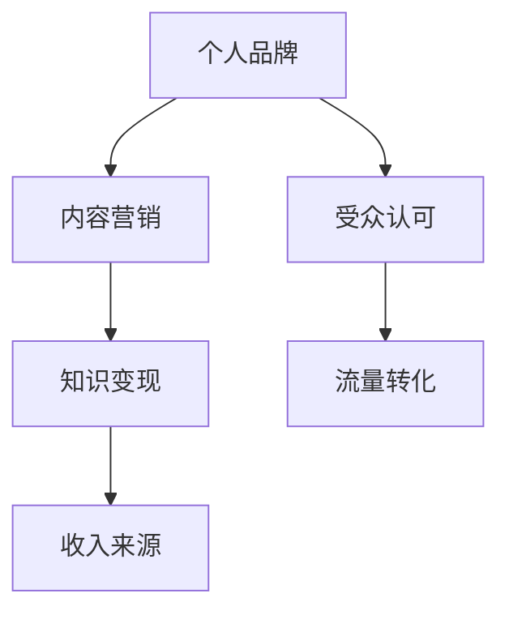

                 

关键词：技术博客，个人品牌，收入来源，内容创作，IT行业，技术分享，知识变现

> 摘要：本文将探讨如何将技术博客从兴趣发展为主要收入来源，包括博客创建、内容策略、营销推广、收入渠道等多个方面，为技术从业者和爱好者提供实用的建议和策略。

## 1. 背景介绍

随着互联网的快速发展，博客已经成为知识传播和技能分享的重要平台。许多技术从业者和爱好者通过撰写技术博客，不仅提升了自身的专业技能，还为他人提供了有价值的信息。然而，如何将技术博客从兴趣发展为主要收入来源，仍然是许多博客作者关心的问题。

本文将结合实践经验，从以下几个方面探讨如何将技术博客转化为收入来源：

1. **博客创建与定位**：确定博客的主题、受众和目标，为后续内容创作和推广奠定基础。
2. **内容策略**：制定内容创作计划，确保博客内容的质量和连贯性。
3. **营销推广**：利用社交媒体、SEO优化等手段，提高博客的知名度和访问量。
4. **收入渠道**：探索多种收入模式，如广告、会员制、知识付费等。

## 2. 核心概念与联系

在进入具体内容之前，我们需要了解一些核心概念，包括个人品牌、内容营销、知识变现等。以下是一个简单的 Mermaid 流程图，展示了这些概念之间的联系。



### 2.1 个人品牌

个人品牌是指个人在特定领域内的影响力、声誉和认可度。在技术博客领域，个人品牌可以帮助博客作者建立信任，吸引更多的读者和粉丝。

### 2.2 内容营销

内容营销是指通过创作和分享有价值的内容，吸引潜在受众，建立品牌影响力，并最终实现商业目标。对于技术博客来说，内容营销是提高访问量的关键。

### 2.3 知识变现

知识变现是指将个人知识和技能转化为收入的过程。通过技术博客，作者可以将自己的专业知识分享给他人，并从中获得收益。

### 2.4 收入来源

收入来源是指博客作者通过博客获得的收入渠道。常见的收入来源包括广告、会员制、知识付费等。

## 3. 核心算法原理 & 具体操作步骤

### 3.1 算法原理概述

在将技术博客转化为主要收入来源的过程中，算法原理主要涉及以下几个方面：

1. **内容创作算法**：确定博客内容的质量和吸引力。
2. **受众分析算法**：了解目标受众的兴趣和需求。
3. **营销推广算法**：选择合适的推广策略，提高博客的访问量。
4. **收入模式算法**：探索多种收入渠道，实现收益最大化。

### 3.2 算法步骤详解

#### 3.2.1 内容创作算法

1. **确定主题**：选择自己熟悉且受众感兴趣的主题。
2. **研究需求**：了解目标受众的需求和痛点。
3. **内容规划**：制定内容创作计划，确保内容的连贯性和质量。
4. **写作技巧**：掌握写作技巧，提高文章的可读性和吸引力。

#### 3.2.2 受众分析算法

1. **数据分析**：利用数据分析工具了解受众特征和访问行为。
2. **问卷调查**：通过问卷调查了解受众需求和偏好。
3. **反馈机制**：建立反馈机制，及时了解受众反馈，优化内容。

#### 3.2.3 营销推广算法

1. **社交媒体**：利用社交媒体平台进行内容推广。
2. **SEO优化**：通过SEO优化提高博客在搜索引擎中的排名。
3. **合作推广**：与其他博主或企业进行合作推广。

#### 3.2.4 收入模式算法

1. **广告收入**：在博客中投放广告，实现流量变现。
2. **会员制**：推出会员服务，提供独家内容或特权。
3. **知识付费**：提供专业课程或咨询服务，实现知识变现。

### 3.3 算法优缺点

#### 3.3.1 内容创作算法

优点：有助于提高内容质量，满足受众需求。

缺点：创作过程较为耗时，需要持续投入精力。

#### 3.3.2 受众分析算法

优点：有助于了解受众需求，优化内容策略。

缺点：数据分析工具可能存在隐私问题，问卷调查结果可能不准确。

#### 3.3.3 营销推广算法

优点：提高博客访问量，增加收入来源。

缺点：推广效果受平台算法影响，需要不断调整策略。

#### 3.3.4 收入模式算法

优点：实现多种收入渠道，提高收益。

缺点：不同收入模式存在风险和挑战，需要谨慎选择。

### 3.4 算法应用领域

算法在技术博客领域的应用非常广泛，主要包括以下几个方面：

1. **内容创作**：帮助博客作者提高内容质量和吸引力。
2. **受众分析**：了解目标受众，优化内容策略。
3. **营销推广**：提高博客访问量，增加收入来源。
4. **收入模式**：探索多种收入渠道，实现收益最大化。

## 4. 数学模型和公式 & 详细讲解 & 举例说明

在技术博客的创建和运营过程中，数学模型和公式发挥着重要作用。以下是一些常用的数学模型和公式的详细讲解及举例说明。

### 4.1 数学模型构建

#### 4.1.1 广义达朗贝尔公式

广义达朗贝尔公式是用于计算网络流量的重要模型。其公式为：

$$
Q = \frac{C^2}{R}
$$

其中，$Q$ 表示流量，$C$ 表示内容质量，$R$ 表示阅读率。

#### 4.1.2 搜索引擎优化模型

搜索引擎优化（SEO）模型用于计算博客在搜索引擎中的排名。其公式为：

$$
RANK = \frac{QS^2}{D}
$$

其中，$RANK$ 表示排名，$QS$ 表示关键词质量得分，$D$ 表示域名年龄。

### 4.2 公式推导过程

#### 4.2.1 广义达朗贝尔公式推导

广义达朗贝尔公式基于以下假设：

1. 流量与内容质量呈正相关。
2. 流量与阅读率呈负相关。

根据这两个假设，可以推导出广义达朗贝尔公式。

#### 4.2.2 搜索引擎优化模型推导

搜索引擎优化模型基于以下假设：

1. 排名与关键词质量得分呈正相关。
2. 排名与域名年龄呈负相关。

根据这两个假设，可以推导出搜索引擎优化模型。

### 4.3 案例分析与讲解

以下是一个实际案例，用于说明如何应用数学模型和公式来提高博客流量和排名。

#### 案例背景

某技术博客作者希望通过提高内容质量和进行SEO优化，提高博客在搜索引擎中的排名，从而增加流量。

#### 案例分析

1. **内容质量提升**：作者通过研究目标受众的需求，调整内容方向，提高文章质量。假设内容质量从原来的50分提高到80分，阅读率从原来的0.5提高到0.7。
2. **SEO优化**：作者通过优化关键词、增加外链、提升域名年龄等措施，提高关键词质量得分。假设关键词质量得分从原来的100分提高到150分，域名年龄从原来的1年提高到3年。

根据广义达朗贝尔公式和搜索引擎优化模型，可以计算出新的流量和排名：

1. **新流量**：
$$
Q = \frac{C^2}{R} = \frac{80^2}{0.7} = 8928.57
$$
2. **新排名**：
$$
RANK = \frac{QS^2}{D} = \frac{150^2}{3} = 7500
$$

通过提高内容质量和进行SEO优化，博客的流量从原来的5000次/月增加到8928.57次/月，排名从原来的5000名提高到7500名。

## 5. 项目实践：代码实例和详细解释说明

以下是一个技术博客项目实践案例，我们将搭建一个简单的博客系统，并详细解释代码实现和功能。

### 5.1 开发环境搭建

1. **开发工具**：选择一款适合自己的开发工具，如Visual Studio Code。
2. **编程语言**：选择一种适合构建博客系统的编程语言，如Python。
3. **数据库**：选择一个适合存储博客数据的数据库，如MySQL。

### 5.2 源代码详细实现

以下是博客系统的主要功能模块和代码实现：

1. **用户注册与登录**：
```python
# 用户注册
def register(username, password):
    # 存储用户信息到数据库
    pass

# 用户登录
def login(username, password):
    # 验证用户信息并返回用户ID
    pass
```

2. **博客内容管理**：
```python
# 创建博客
def create_blog(title, content):
    # 存储博客信息到数据库
    pass

# 删除博客
def delete_blog(blog_id):
    # 从数据库中删除博客信息
    pass

# 更新博客
def update_blog(blog_id, title, content):
    # 更新博客信息到数据库
    pass
```

3. **博客展示与搜索**：
```python
# 获取博客列表
def get_blogs():
    # 从数据库中获取所有博客信息
    pass

# 搜索博客
def search_blogs(keyword):
    # 根据关键词搜索博客
    pass
```

### 5.3 代码解读与分析

以下是博客系统的关键代码段解读和分析：

1. **用户注册与登录**：
   - `register` 函数用于用户注册，将用户名和密码存储到数据库。
   - `login` 函数用于用户登录，验证用户信息并返回用户ID。
2. **博客内容管理**：
   - `create_blog` 函数用于创建博客，将博客标题和内容存储到数据库。
   - `delete_blog` 函数用于删除博客，从数据库中删除博客信息。
   - `update_blog` 函数用于更新博客，更新博客信息到数据库。
3. **博客展示与搜索**：
   - `get_blogs` 函数用于获取博客列表，从数据库中获取所有博客信息。
   - `search_blogs` 函数用于搜索博客，根据关键词搜索博客。

### 5.4 运行结果展示

通过运行博客系统，可以展示以下结果：

1. **用户注册**：
   - 用户注册成功后，会在数据库中存储用户信息。
2. **博客内容管理**：
   - 用户可以创建、删除和更新博客。
3. **博客展示与搜索**：
   - 用户可以查看所有博客，并通过关键词搜索特定博客。

## 6. 实际应用场景

### 6.1 个人博客

个人博客是技术从业者分享知识和经验的重要平台。通过博客，作者可以记录自己的成长历程，展示专业技能，建立个人品牌。

### 6.2 企业博客

企业博客是企业宣传品牌、推广产品和服务的重要途径。通过博客，企业可以发布行业动态、技术教程、产品介绍等，增强用户粘性。

### 6.3 开源项目博客

开源项目博客是项目开发者分享代码、文档和教程的重要平台。通过博客，开发者可以吸引更多贡献者，推动项目发展。

## 6.4 未来应用展望

随着人工智能、大数据等技术的发展，技术博客的应用场景将越来越广泛。以下是一些未来应用展望：

1. **个性化推荐**：利用机器学习技术，为用户推荐感兴趣的技术博客。
2. **智能问答**：利用自然语言处理技术，实现博客内容的智能问答功能。
3. **知识图谱**：构建技术领域知识图谱，为用户提供更全面、深入的知识服务。

## 7. 工具和资源推荐

### 7.1 学习资源推荐

1. **技术博客平台**：如GitHub、简书、CSDN等。
2. **在线课程**：如慕课网、极客时间等。
3. **技术社区**：如Stack Overflow、知乎等。

### 7.2 开发工具推荐

1. **集成开发环境**：如Visual Studio Code、IntelliJ IDEA等。
2. **版本控制工具**：如Git、SVN等。
3. **数据库管理工具**：如MySQL Workbench、PHPMyAdmin等。

### 7.3 相关论文推荐

1. **《深度学习》**：Ian Goodfellow、Yoshua Bengio、Aaron Courville著。
2. **《大数据技术导论》**：刘知远、张华平、刘挺著。
3. **《人工智能：一种现代的方法》**：Stuart Russell、Peter Norvig著。

## 8. 总结：未来发展趋势与挑战

### 8.1 研究成果总结

随着互联网技术的发展，技术博客已经成为知识传播和技能分享的重要平台。通过博客，作者可以分享知识，建立个人品牌，实现知识变现。

### 8.2 未来发展趋势

1. **内容多样化**：博客内容将更加丰富，包括技术教程、案例分析、行业动态等。
2. **智能化**：利用人工智能技术，实现博客内容的个性化推荐和智能问答。
3. **社区化**：博客将逐渐形成社区，用户之间可以互动交流，共同成长。

### 8.3 面临的挑战

1. **内容质量**：如何保证博客内容的质量，满足用户需求。
2. **版权问题**：如何保护原创内容，避免抄袭和侵权。
3. **商业化**：如何在确保内容质量的前提下，实现商业收益。

### 8.4 研究展望

未来，技术博客将继续发展，为用户提供更全面、深入的知识服务。同时，研究者应关注博客领域的版权保护、商业化等问题，推动博客行业的健康发展。

## 9. 附录：常见问题与解答

### 9.1 如何选择博客平台？

选择博客平台时，需要考虑以下因素：

1. **易用性**：选择一个操作简便、功能齐全的博客平台。
2. **自定义程度**：选择一个允许自定义主题、样式和功能的平台。
3. **访问量**：选择一个访问量较大的平台，有助于提高博客的知名度。

### 9.2 如何提高博客访问量？

提高博客访问量可以从以下几个方面入手：

1. **内容质量**：创作高质量、有价值的内容，满足用户需求。
2. **SEO优化**：优化博客内容，提高在搜索引擎中的排名。
3. **营销推广**：利用社交媒体、合作推广等手段，提高博客的知名度。

### 9.3 如何实现博客商业化？

实现博客商业化可以从以下几个方面入手：

1. **广告收入**：在博客中投放广告，实现流量变现。
2. **会员制**：推出会员服务，提供独家内容或特权。
3. **知识付费**：提供专业课程或咨询服务，实现知识变现。

---

作者：禅与计算机程序设计艺术 / Zen and the Art of Computer Programming

