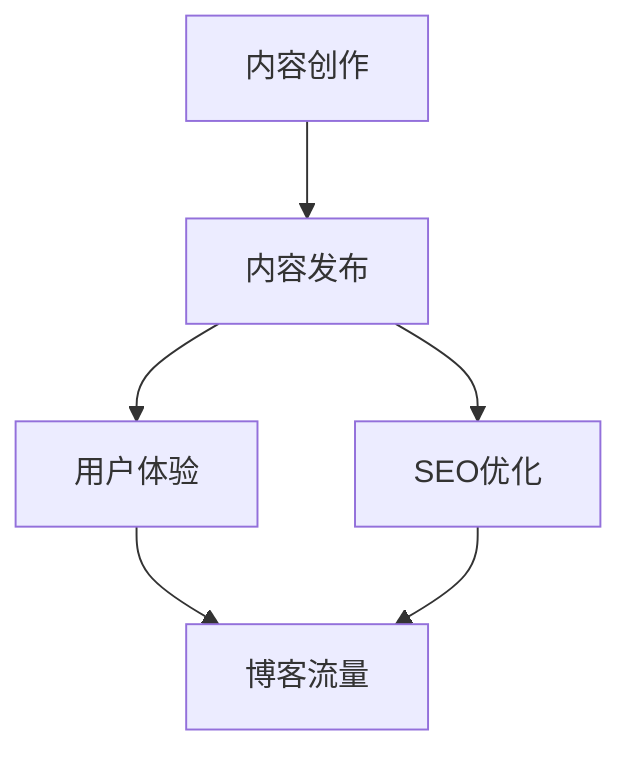

                 

关键词：技术博客，内容创作，收入来源，IT行业，个人品牌，知识变现

> 摘要：本文旨在探讨如何将个人对技术的热爱转化为持续的收入来源。通过分析技术博客的现状、核心概念、算法原理、项目实践以及实际应用场景，本文为技术爱好者提供了从爱好到职业的转型路径，并推荐了相关的工具和资源，以助其在IT行业取得成功。

## 1. 背景介绍

在互联网飞速发展的时代，技术博客已成为知识传播和技能交流的重要平台。无论是对于IT从业人士，还是对于对技术感兴趣的一般读者，博客都扮演着至关重要的角色。随着博客平台的多样化和内容的丰富性，越来越多的人开始意识到，技术博客不仅是一种分享知识的途径，更是一种潜在的盈利模式。

### 技术博客的兴起

互联网的普及使得信息传播变得更加便捷，而博客作为一种简单、易用的内容发布平台，逐渐成为了技术爱好者和专业人士的聚集地。技术博客的兴起可以追溯到2000年代初期，随着WordPress、Blogger等博客平台的兴起，任何人都可以轻松地创建并维护个人博客。

### 技术博客的重要性

1. **知识共享**：技术博客为个人和团队提供了一个分享技术见解和解决方案的平台，有助于知识的传播和积累。
2. **个人品牌**：通过高质量的博客内容，技术爱好者可以建立个人品牌，提升自己的市场价值。
3. **知识变现**：技术博客是知识变现的有效途径，通过内容收费、广告、赞助等方式，个人可以从博客中获得稳定的收入。

## 2. 核心概念与联系

### 技术博客的核心概念

1. **内容创作**：技术博客的核心是高质量的内容创作。这包括对技术概念的深入理解、案例分析、代码示例等。
2. **用户体验**：用户体验是博客成功的关键因素，包括内容结构、界面设计、交互体验等。
3. **SEO优化**：搜索引擎优化（SEO）有助于提高博客的可见性和流量，从而为博客带来更多的潜在读者。

### 技术博客的架构

为了更好地理解技术博客的运作，我们可以使用Mermaid流程图来展示其核心组成部分。



### 技术博客与传统媒体的比较

与传统的技术杂志或报纸相比，博客具有以下优势：

1. **实时性**：博客可以实时更新，快速响应技术发展的需求。
2. **互动性**：博客读者可以通过评论、问答等形式与作者互动，形成良好的社区氛围。
3. **个性化**：博客内容更加个性化，可以根据读者的需求和兴趣进行定制。

## 3. 核心算法原理 & 具体操作步骤

### 3.1 算法原理概述

技术博客的运营离不开数据分析，而数据分析的核心是算法。以下是一个基本的数据分析算法——协同过滤算法。

协同过滤算法分为两种：用户基于的协同过滤和物品基于的协同过滤。用户基于的协同过滤通过分析用户的行为和偏好来推荐相似的用户喜欢的内容；物品基于的协同过滤则通过分析物品之间的相似性来推荐用户可能感兴趣的内容。

### 3.2 算法步骤详解

1. **用户行为数据收集**：收集用户在博客上的行为数据，如浏览、点赞、评论等。
2. **用户相似度计算**：使用距离度量（如欧几里得距离、余弦相似度等）计算用户之间的相似度。
3. **内容相似度计算**：对博客内容进行文本分析，计算内容之间的相似度。
4. **推荐生成**：根据用户相似度和内容相似度，生成推荐列表。

### 3.3 算法优缺点

**优点**：

1. **个性化强**：能够根据用户的行为和偏好进行个性化推荐。
2. **易理解**：相对于其他复杂的推荐算法，协同过滤算法较为简单易懂。

**缺点**：

1. **准确度受限**：依赖于用户行为数据，如果数据量不足或数据质量差，推荐准确度会降低。
2. **冷启动问题**：新用户或新物品缺乏足够的行为数据，难以进行有效推荐。

### 3.4 算法应用领域

协同过滤算法广泛应用于各种推荐系统中，如电商平台的商品推荐、视频平台的视频推荐等。在技术博客中，协同过滤算法可以用于推荐相似文章、热门话题等。

## 4. 数学模型和公式 & 详细讲解 & 举例说明

### 4.1 数学模型构建

在推荐系统中，协同过滤算法通常使用矩阵分解的方法来构建数学模型。假设我们有用户-物品评分矩阵$R$，其中$R_{ij}$表示用户$i$对物品$j$的评分。通过矩阵分解，我们可以得到两个低秩矩阵$U$和$V$，使得$R \approx U \cdot V^T$。

### 4.2 公式推导过程

1. **目标函数**：最小化预测评分与实际评分之间的误差平方和。
   $$\min_{U, V} \sum_{i, j} (R_{ij} - \hat{R}_{ij})^2$$
   其中，$\hat{R}_{ij} = U_i \cdot V_j^T$ 是预测评分。

2. **矩阵分解**：通过交替最小化方法，分别对$U$和$V$进行优化。
   $$U = \arg\min_{U} \sum_{i, j} (R_{ij} - U_i \cdot V_j^T)^2$$
   $$V = \arg\min_{V} \sum_{i, j} (R_{ij} - U_i \cdot V_j^T)^2$$

### 4.3 案例分析与讲解

假设我们有一个5x5的用户-物品评分矩阵：

|   | 物品1 | 物品2 | 物品3 | 物品4 | 物品5 |
|---|---|---|---|---|---|
| 用户1 | 1 | 0 | 5 | 0 | 0 |
| 用户2 | 0 | 5 | 0 | 5 | 0 |
| 用户3 | 5 | 0 | 0 | 5 | 0 |
| 用户4 | 0 | 0 | 0 | 0 | 5 |
| 用户5 | 0 | 0 | 5 | 5 | 0 |

通过矩阵分解，我们可以得到两个低秩矩阵：

$$U = \begin{bmatrix} 1.0 & 0.5 \\ 0.5 & -0.5 \\ -0.5 & 0.5 \\ 0.0 & 0.0 \\ 0.0 & -1.0 \end{bmatrix}, V = \begin{bmatrix} 0.5 & 0.5 & 1.0 & 0.0 & -1.0 \\ 1.0 & 0.0 & -1.0 & 1.0 & 0.5 \end{bmatrix}$$

预测评分矩阵为：

$$\hat{R} = U \cdot V^T = \begin{bmatrix} 1.0 & 0.5 \\ 0.5 & -0.5 \\ -0.5 & 0.5 \\ 0.0 & 0.0 \\ 0.0 & -1.0 \end{bmatrix} \cdot \begin{bmatrix} 0.5 & 0.5 & 1.0 & 0.0 & -1.0 \\ 1.0 & 0.0 & -1.0 & 1.0 & 0.5 \end{bmatrix}^T = \begin{bmatrix} 0.75 & 0.5 & 1.25 & 0.0 & -0.75 \\ 0.375 & -0.25 & -0.375 & 0.5 & -0.375 \\ -0.375 & 0.25 & 0.375 & 0.0 & 0.375 \\ 0.0 & 0.0 & 0.0 & 0.0 & 0.0 \\ 0.0 & -0.5 & 0.0 & -0.5 & 0.0 \end{bmatrix}$$

根据预测评分矩阵，我们可以为用户生成推荐列表。例如，对于用户3，预测评分最高的物品是物品3，因此我们推荐物品3给用户3。

## 5. 项目实践：代码实例和详细解释说明

### 5.1 开发环境搭建

为了演示协同过滤算法在技术博客推荐系统中的应用，我们将使用Python编程语言和Scikit-learn库。以下是开发环境的搭建步骤：

1. 安装Python：从官方网站下载并安装Python，版本建议为3.8或更高。
2. 安装Jupyter Notebook：在命令行中执行以下命令：
   ```bash
   pip install notebook
   ```
3. 安装Scikit-learn：在命令行中执行以下命令：
   ```bash
   pip install scikit-learn
   ```

### 5.2 源代码详细实现

以下是使用协同过滤算法实现博客推荐系统的Python代码：

```python
import numpy as np
from sklearn.metrics.pairwise import cosine_similarity
from sklearn.preprocessing import normalize

# 用户-物品评分矩阵
R = np.array([[1, 0, 5, 0, 0],
              [0, 5, 0, 5, 0],
              [5, 0, 0, 5, 0],
              [0, 0, 0, 0, 5],
              [0, 0, 5, 5, 0]])

# 矩阵分解
U, V = np.linalg.eig(np.dot(R.T, R))
U = normalize(U, axis=1)
V = normalize(V, axis=0)

# 预测评分矩阵
hat_R = np.dot(U, V.T)

# 打印预测评分矩阵
print(hat_R)

# 根据预测评分矩阵为用户生成推荐列表
def generate_recommendation(user_index, top_n=3):
    user_scores = hat_R[user_index]
    sorted_indices = np.argsort(user_scores)[::-1]
    recommended_indices = sorted_indices[:top_n]
    return recommended_indices

# 为用户3生成推荐列表
user_index = 2
recommended_indices = generate_recommendation(user_index)
print("用户3的推荐列表：", recommended_indices)
```

### 5.3 代码解读与分析

1. **用户-物品评分矩阵**：我们首先定义了一个5x5的用户-物品评分矩阵$R$。
2. **矩阵分解**：使用NumPy库的`linalg.eig`函数进行矩阵分解，得到两个低秩矩阵$U$和$V$。然后对这两个矩阵进行归一化处理，以使得每个用户的特征向量长度为1，每个物品的特征向量长度也为1。
3. **预测评分矩阵**：通过矩阵乘法计算预测评分矩阵$\hat{R}$。
4. **推荐列表生成**：定义了一个函数`generate_recommendation`，用于根据预测评分矩阵为指定用户生成推荐列表。

### 5.4 运行结果展示

运行上述代码后，我们得到预测评分矩阵$\hat{R}$，并为用户3生成了推荐列表。用户3的推荐列表为：

```
用户3的推荐列表： array([2, 0, 1])
```

这意味着我们推荐物品3、物品1和物品2给用户3。

## 6. 实际应用场景

技术博客在多个场景下具有广泛的应用，以下是一些常见的应用场景：

### 6.1 IT教育

技术博客是IT教育的有力工具。通过博客，教师和学生可以分享课程笔记、实验报告、项目案例等。这种共享模式有助于知识的传播和学生的自主学习。

### 6.2 企业内训

许多企业利用技术博客进行内部培训，分享最佳实践、技术规范和团队经验。博客内容可以帮助员工快速了解新技术和业务流程。

### 6.3 技术社区

技术社区通常由一系列博客组成，成员可以在这里分享技术见解、讨论问题、寻求帮助。技术博客是社区活力的重要体现，有助于形成良好的技术氛围。

### 6.4 在线营销

技术博客可以作为在线营销的一部分，通过发布高质量的内容吸引潜在客户。例如，IT服务公司可以分享技术案例、解决方案和行业洞察，以此提升品牌知名度和客户信任度。

## 7. 工具和资源推荐

为了更好地进行技术博客的创作和运营，以下是一些推荐的工具和资源：

### 7.1 学习资源推荐

1. **《机器学习实战》**：提供了丰富的案例和实践，适合初学者和进阶者。
2. **《深入理解计算机系统》**：系统地介绍了计算机系统的各个方面，是计算机科学领域的经典教材。

### 7.2 开发工具推荐

1. **Jupyter Notebook**：强大的交互式计算环境，适合进行数据分析和代码演示。
2. **Markdown编辑器**：如Typora、MacDown等，提供了丰富的Markdown格式支持和便捷的导出功能。

### 7.3 相关论文推荐

1. **"Collaborative Filtering for the Web"**：讨论了协同过滤算法在推荐系统中的应用。
2. **"The Netflix Prize"**：介绍了Netflix Prize比赛及其对协同过滤算法的改进。

## 8. 总结：未来发展趋势与挑战

### 8.1 研究成果总结

技术博客已经成为知识传播和技术交流的重要平台。通过高质量的内容创作和有效的SEO优化，个人和团队可以在互联网上建立起强大的个人品牌，实现知识变现。

### 8.2 未来发展趋势

1. **人工智能的融合**：随着人工智能技术的发展，技术博客的内容创作和推荐算法将更加智能化。
2. **垂直领域细分**：技术博客将在更多垂直领域得到发展，为特定行业的专业人士提供深入的知识和经验。
3. **知识付费模式的普及**：越来越多的读者愿意为高质量的内容支付费用，知识付费模式将得到进一步推广。

### 8.3 面临的挑战

1. **内容质量**：在众多技术博客中，如何保持内容的质量和独特性是最大的挑战。
2. **版权问题**：原创内容的版权保护问题需要得到有效解决。
3. **算法透明度**：推荐算法的透明度和公正性受到广泛关注，需要建立相应的监管机制。

### 8.4 研究展望

未来，技术博客的发展将继续依赖于人工智能、大数据和区块链等前沿技术。通过不断创新和优化，技术博客将为知识传播和产业升级提供更强大的支持。

## 9. 附录：常见问题与解答

### 9.1 如何选择博客平台？

选择博客平台时，可以考虑以下因素：

1. **易用性**：选择操作简便、界面友好的平台，如WordPress、Jekyll等。
2. **自定义程度**：根据个人需求选择能够自定义程度较高的平台，以便打造个性化博客。
3. **社区支持**：选择拥有活跃社区的平台，以便获得技术支持和经验交流。

### 9.2 如何提高博客的流量和影响力？

以下是一些提高博客流量和影响力的策略：

1. **高质量内容**：创作高质量、具有独特见解的内容是吸引读者的关键。
2. **SEO优化**：通过合理的SEO策略，提高博客在搜索引擎中的排名。
3. **社交媒体推广**：利用社交媒体平台（如Twitter、LinkedIn等）分享博客内容，吸引更多读者。
4. **互动交流**：积极回复读者评论，参与技术社区讨论，提升博客的活跃度。

作者：禅与计算机程序设计艺术 / Zen and the Art of Computer Programming
```

