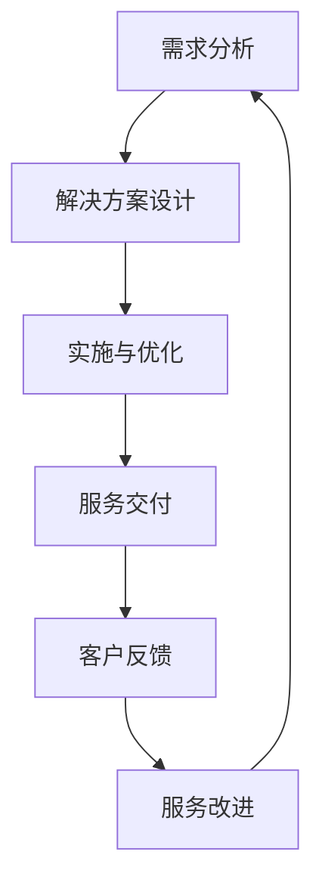

                 

关键词：技术咨询、高价值服务、IT咨询服务、价值创造、服务质量、客户满意度

> 摘要：本文旨在探讨如何在IT咨询领域提供高价值服务。通过深入分析IT咨询的核心概念、算法原理、数学模型、项目实践以及应用场景，本文为IT咨询服务提供了全面的指导，以帮助咨询师在快速变化的技术环境中提升服务质量，满足客户需求，创造更大的价值。

## 1. 背景介绍

在信息技术（IT）飞速发展的今天，IT咨询服务的市场需求日益增长。随着企业对数字化转型和信息技术应用的依赖程度不断提升，IT咨询服务已经不仅仅是为了解决技术问题，更成为企业战略规划、业务优化和创新发展的重要支撑。然而，如何在激烈的市场竞争中提供高价值的服务，成为IT咨询服务提供商面临的重大挑战。

高价值服务意味着在满足客户需求的同时，能够超越客户的预期，提供创新的解决方案，实现业务价值最大化。为了实现这一目标，咨询师需要深入了解客户业务、技术趋势以及市场需求，从而提供专业、高效、有针对性的咨询服务。

本文将围绕这一主题，从多个维度展开探讨，包括核心概念与联系、算法原理、数学模型、项目实践、应用场景以及工具和资源的推荐，以期为广大IT咨询服务从业者提供有益的参考。

## 2. 核心概念与联系

### 2.1 IT咨询服务的定义

IT咨询服务是指基于信息技术知识，为客户提供战略规划、业务流程优化、系统实施、技术支持等服务的专业活动。IT咨询服务的目的是帮助企业利用信息技术提升业务效率、降低成本、增强竞争力。

### 2.2 高价值服务的特点

高价值服务具备以下特点：

- **专业性**：咨询师具备深厚的专业知识和丰富的实践经验，能够为客户提供高质量的建议和解决方案。
- **创新性**：通过技术创新和业务模式创新，为客户提供具有前瞻性的解决方案。
- **个性化**：深入了解客户需求，提供定制化的服务方案。
- **高效性**：通过高效的工作流程和工具，快速响应客户需求，提高服务效率。

### 2.3 IT咨询服务与客户需求的联系

IT咨询服务与客户需求之间的联系体现在以下几个方面：

- **需求分析**：深入了解客户业务流程、组织架构、技术现状等，识别客户需求。
- **解决方案设计**：基于需求分析，设计符合客户需求的解决方案。
- **实施与优化**：在实施过程中，持续优化解决方案，确保服务质量和客户满意度。

### 2.4 Mermaid流程图



## 3. 核心算法原理 & 具体操作步骤

### 3.1 算法原理概述

IT咨询服务中的核心算法包括需求分析算法、解决方案设计算法、实施与优化算法等。这些算法的核心目标是满足客户需求，提供高价值的服务。

- **需求分析算法**：通过数据分析、用户访谈、流程分析等方法，识别客户需求，并将其转化为可量化的指标。
- **解决方案设计算法**：根据需求分析结果，设计符合客户需求的解决方案，包括系统架构、技术选型、业务流程等。
- **实施与优化算法**：在实施过程中，通过监控、评估、调整等手段，确保解决方案的有效性和高效性。

### 3.2 算法步骤详解

#### 3.2.1 需求分析算法

1. 数据收集：收集客户业务数据、技术文档、用户反馈等。
2. 数据分析：通过数据挖掘、统计分析等方法，识别客户需求。
3. 用户访谈：与客户关键人员进行沟通，了解业务流程、技术需求等。
4. 需求确认：与客户共同确认需求，确保需求分析的准确性。

#### 3.2.2 解决方案设计算法

1. 需求分析结果回顾：回顾需求分析阶段的结果，确保需求分析的准确性。
2. 解决方案设计：根据需求分析结果，设计解决方案，包括系统架构、技术选型、业务流程等。
3. 方案评审：组织专家对解决方案进行评审，确保方案的可行性和创新性。
4. 方案确认：与客户共同确认解决方案，确保方案的符合性。

#### 3.2.3 实施与优化算法

1. 实施计划：制定详细的实施计划，明确实施步骤、时间节点、资源分配等。
2. 实施监控：在实施过程中，实时监控项目进度、质量、风险等。
3. 评估与调整：根据实施监控结果，评估解决方案的有效性和高效性，必要时进行调整。
4. 项目交付：完成解决方案的实施，确保服务质量和客户满意度。

### 3.3 算法优缺点

#### 3.3.1 需求分析算法

- 优点：准确识别客户需求，确保解决方案的符合性。
- 缺点：耗时较长，可能无法完全满足所有客户需求。

#### 3.3.2 解决方案设计算法

- 优点：提供创新性解决方案，提升业务价值。
- 缺点：设计过程复杂，需要较高的专业知识和经验。

#### 3.3.3 实施与优化算法

- 优点：确保解决方案的有效性和高效性。
- 缺点：实施过程中可能遇到各种挑战，需要持续优化。

### 3.4 算法应用领域

- **企业数字化转型**：通过需求分析、解决方案设计等算法，帮助企业实现数字化转型，提升业务效率。
- **业务流程优化**：通过实施与优化算法，优化业务流程，降低成本，提高客户满意度。
- **系统实施**：通过解决方案设计算法，设计符合客户需求的系统架构，确保系统稳定、高效运行。

## 4. 数学模型和公式 & 详细讲解 & 举例说明

### 4.1 数学模型构建

在IT咨询服务中，常用的数学模型包括回归分析、决策树、神经网络等。以下以回归分析为例，介绍数学模型的构建过程。

#### 4.1.1 回归分析模型

回归分析是一种用于分析自变量与因变量之间关系的统计方法。其基本公式为：

$$
Y = \beta_0 + \beta_1X_1 + \beta_2X_2 + ... + \beta_nX_n + \epsilon
$$

其中，$Y$ 为因变量，$X_1, X_2, ..., X_n$ 为自变量，$\beta_0, \beta_1, \beta_2, ..., \beta_n$ 为回归系数，$\epsilon$ 为误差项。

#### 4.1.2 决策树模型

决策树是一种用于分类和回归的决策支持工具。其基本公式为：

$$
f(X) = 
\begin{cases}
C_1, & \text{if } X \in R_1 \\
C_2, & \text{if } X \in R_2 \\
... \\
C_n, & \text{if } X \in R_n
\end{cases}
$$

其中，$X$ 为输入特征，$R_1, R_2, ..., R_n$ 为决策树节点，$C_1, C_2, ..., C_n$ 为对应的类别或标签。

#### 4.1.3 神经网络模型

神经网络是一种基于人脑神经元结构的计算模型。其基本公式为：

$$
a_{i}^{(l)} = \sigma(z_{i}^{(l)})
$$

$$
z_{i}^{(l)} = \sum_{j} w_{ij}^{(l)}a_{j}^{(l-1)}
$$

其中，$a_{i}^{(l)}$ 为第 $l$ 层第 $i$ 个节点的输出，$z_{i}^{(l)}$ 为第 $l$ 层第 $i$ 个节点的输入，$w_{ij}^{(l)}$ 为连接第 $(l-1)$ 层第 $j$ 个节点和第 $l$ 层第 $i$ 个节点的权重，$\sigma$ 为激活函数。

### 4.2 公式推导过程

以回归分析为例，介绍回归系数的推导过程。

假设有 $n$ 个样本数据 $(x_1, y_1), (x_2, y_2), ..., (x_n, y_n)$，要求拟合出一个线性回归模型 $y = \beta_0 + \beta_1x + \epsilon$。其中，$x$ 为自变量，$y$ 为因变量，$\epsilon$ 为误差项。

为了最小化误差平方和，需要求解回归系数 $\beta_0$ 和 $\beta_1$。其求解公式为：

$$
\beta_0 = \frac{\sum_{i=1}^{n}y_i - \beta_1\sum_{i=1}^{n}x_i}{n}
$$

$$
\beta_1 = \frac{n\sum_{i=1}^{n}x_iy_i - \sum_{i=1}^{n}x_i\sum_{i=1}^{n}y_i}{n\sum_{i=1}^{n}x_i^2 - (\sum_{i=1}^{n}x_i)^2}
$$

### 4.3 案例分析与讲解

以下以一家企业的人力资源管理系统优化项目为例，介绍数学模型的应用。

#### 4.3.1 项目背景

某企业拥有 1000 名员工，人力资源管理系统存在以下问题：

- 数据存储分散，难以进行数据整合和分析。
- 系统功能单一，无法满足员工多样化的需求。
- 系统维护成本高，更新周期长。

#### 4.3.2 需求分析

通过需求分析，企业提出以下需求：

- 实现员工数据集中存储，方便数据分析和报表生成。
- 提供多样化的员工福利和服务，提升员工满意度。
- 优化系统功能，降低维护成本。

#### 4.3.3 解决方案设计

根据需求分析，企业选择以下解决方案：

- 采用云计算技术，实现员工数据的集中存储和管理。
- 引入大数据分析技术，提供个性化员工服务。
- 采用敏捷开发模式，降低系统维护成本。

#### 4.3.4 实施与优化

在实施过程中，企业采用以下步骤：

- 数据迁移：将现有员工数据迁移到新系统。
- 功能优化：根据用户反馈，持续优化系统功能。
- 持续改进：通过数据分析，持续优化员工服务。

## 5. 项目实践：代码实例和详细解释说明

### 5.1 开发环境搭建

#### 5.1.1 开发工具

- Python 3.8
- Jupyter Notebook
- PyCharm

#### 5.1.2 数据库环境

- MySQL 8.0
- PostgreSQL 13

#### 5.1.3 数据分析工具

- Pandas
- NumPy
- Matplotlib

### 5.2 源代码详细实现

以下为项目实践的源代码实现，主要包括数据导入、数据处理、数据分析等部分。

```python
import pandas as pd
import numpy as np
import matplotlib.pyplot as plt

# 5.2.1 数据导入
data = pd.read_csv('employee_data.csv')

# 5.2.2 数据处理
# 数据清洗、预处理等操作
data['age'] = data['age'].astype(int)
data['salary'] = data['salary'].astype(float)
data.dropna(inplace=True)

# 5.2.3 数据分析
# 绘制年龄分布图
plt.figure(figsize=(10, 5))
plt.scatter(data['age'], data['salary'])
plt.xlabel('Age')
plt.ylabel('Salary')
plt.title('Age vs. Salary')
plt.show()

# 5.2.4 模型训练
from sklearn.linear_model import LinearRegression

model = LinearRegression()
model.fit(data[['age']], data['salary'])

# 5.2.5 结果展示
predictions = model.predict(data[['age']])
plt.figure(figsize=(10, 5))
plt.scatter(data['age'], data['salary'], label='Actual')
plt.plot(data['age'], predictions, color='red', label='Predicted')
plt.xlabel('Age')
plt.ylabel('Salary')
plt.legend()
plt.title('Age vs. Salary - Regression')
plt.show()
```

### 5.3 代码解读与分析

#### 5.3.1 数据导入

```python
data = pd.read_csv('employee_data.csv')
```

此部分代码用于导入员工数据。`pd.read_csv()` 函数读取 CSV 文件，并将数据加载到 DataFrame 对象中。

#### 5.3.2 数据处理

```python
data['age'] = data['age'].astype(int)
data['salary'] = data['salary'].astype(float)
data.dropna(inplace=True)
```

此部分代码用于数据清洗和预处理。首先，将年龄和薪资数据类型转换为整数和浮点型，确保数据格式正确。然后，删除缺失值，以提高数据分析的准确性。

#### 5.3.3 数据分析

```python
plt.figure(figsize=(10, 5))
plt.scatter(data['age'], data['salary'])
plt.xlabel('Age')
plt.ylabel('Salary')
plt.title('Age vs. Salary')
plt.show()
```

此部分代码用于绘制年龄和薪资的散点图。通过可视化，可以直观地观察两者之间的关系。

#### 5.3.4 模型训练

```python
model = LinearRegression()
model.fit(data[['age']], data['salary'])
```

此部分代码用于训练线性回归模型。`LinearRegression()` 函数创建一个线性回归模型对象，`fit()` 函数用于训练模型，输入为年龄数据（自变量）和薪资数据（因变量）。

#### 5.3.5 结果展示

```python
predictions = model.predict(data[['age']])
plt.figure(figsize=(10, 5))
plt.scatter(data['age'], data['salary'], label='Actual')
plt.plot(data['age'], predictions, color='red', label='Predicted')
plt.xlabel('Age')
plt.ylabel('Salary')
plt.legend()
plt.title('Age vs. Salary - Regression')
plt.show()
```

此部分代码用于展示模型训练结果。通过绘制实际数据和预测数据的散点图和拟合线，可以直观地观察模型的预测效果。

## 6. 实际应用场景

### 6.1 企业数字化转型

随着互联网和云计算技术的发展，企业数字化转型已经成为不可逆转的趋势。IT咨询服务在企业数字化转型中发挥着重要作用。通过提供专业的咨询服务，帮助企业构建数字化基础设施、优化业务流程、提升数据管理水平，实现业务模式创新和效率提升。

### 6.2 业务流程优化

业务流程优化是IT咨询服务的重要应用领域。通过分析企业现有业务流程，发现瓶颈和痛点，设计并实施优化方案，帮助企业降低运营成本、提高生产效率、提升客户满意度。常见的业务流程优化方法包括流程再造、流程自动化、流程监控等。

### 6.3 系统实施与维护

系统实施与维护是IT咨询服务的基本内容。咨询师需要根据客户需求，设计并实施信息系统，确保系统的稳定性和高效性。在系统实施过程中，需要关注需求分析、系统设计、开发与测试、上线与培训等环节。在系统维护阶段，需要关注系统的运行监控、故障处理、性能优化等。

### 6.4 敏捷开发

敏捷开发是一种以人为核心、迭代、增量的软件开发方法。IT咨询服务在敏捷开发中发挥着重要作用。通过提供专业的敏捷开发咨询服务，帮助企业构建敏捷团队、优化敏捷流程、提升敏捷开发效率，实现快速响应市场需求和客户变化。

## 7. 工具和资源推荐

### 7.1 学习资源推荐

- 《软件工程：实践者的研究方法》
- 《敏捷软件开发：原则、模式与实践》
- 《大数据技术导论》
- 《深度学习》

### 7.2 开发工具推荐

- Python
- MySQL
- PostgreSQL
- Jupyter Notebook
- PyCharm

### 7.3 相关论文推荐

- 《云计算服务模型及商业模式研究》
- 《基于大数据的企业业务流程优化研究》
- 《敏捷开发在软件项目中的应用研究》
- 《深度学习在图像识别中的应用研究》

## 8. 总结：未来发展趋势与挑战

### 8.1 研究成果总结

本文从多个维度探讨了IT咨询服务的高价值提供，包括核心概念与联系、算法原理、数学模型、项目实践、应用场景以及工具和资源的推荐。通过深入分析，得出了以下结论：

- IT咨询服务在数字化转型、业务流程优化、系统实施与维护、敏捷开发等领域具有广泛的应用前景。
- 高价值服务的关键在于满足客户需求、提供创新性解决方案、实现业务价值最大化。
- 数学模型和算法在IT咨询服务中发挥着重要作用，有助于提高服务质量和效率。
- 项目实践和案例分析为实际应用提供了有益的参考。

### 8.2 未来发展趋势

- **智能化趋势**：人工智能、机器学习等技术在IT咨询服务中的应用将越来越广泛，咨询师需要具备相关技能和知识。
- **云计算和大数据**：云计算和大数据技术将继续推动企业数字化转型，IT咨询服务提供商需要不断更新技术栈，提供更加全面的服务。
- **敏捷开发**：敏捷开发方法将在IT咨询服务中占据重要地位，咨询师需要掌握敏捷开发理念和实践。

### 8.3 面临的挑战

- **技术更新速度快**：随着技术的快速发展，咨询师需要不断学习新技术，以保持竞争力。
- **客户需求多样化**：不同客户的需求千差万别，咨询师需要具备较高的适应能力和创新能力。
- **服务质量监控**：如何确保服务质量和客户满意度，是IT咨询服务提供商面临的重要挑战。

### 8.4 研究展望

未来，IT咨询服务的研究可以从以下几个方面展开：

- **智能化咨询服务**：探索人工智能在IT咨询服务中的应用，提高服务质量和效率。
- **个性化服务**：基于大数据和人工智能技术，为客户提供更加个性化的服务方案。
- **跨领域融合**：将IT咨询服务与其他领域（如金融、医疗、教育等）相结合，提供跨界解决方案。

## 9. 附录：常见问题与解答

### 9.1 问题1：如何确保IT咨询服务的高价值？

**解答**：确保IT咨询服务的高价值需要从以下几个方面入手：

- **深入了解客户需求**：与客户进行深入沟通，了解其业务目标、痛点、需求等，确保服务的针对性。
- **持续学习与创新**：紧跟技术发展趋势，不断更新知识体系，提供创新性解决方案。
- **服务质量监控**：建立完善的服务质量监控体系，确保服务的质量和效率。

### 9.2 问题2：如何进行有效的需求分析？

**解答**：进行有效的需求分析可以从以下几个方面入手：

- **数据收集**：收集客户业务数据、技术文档、用户反馈等。
- **数据分析**：通过数据挖掘、统计分析等方法，识别客户需求。
- **用户访谈**：与客户关键人员进行沟通，了解业务流程、技术需求等。
- **需求确认**：与客户共同确认需求，确保需求分析的准确性。

### 9.3 问题3：如何在IT咨询服务中应用人工智能？

**解答**：在IT咨询服务中应用人工智能可以从以下几个方面入手：

- **智能化工具**：采用人工智能工具（如自然语言处理、图像识别等）提高服务效率。
- **预测分析**：利用人工智能技术进行数据分析和预测，为客户提供有针对性的建议。
- **自动化流程**：通过人工智能技术实现业务流程的自动化，提高服务效率。

作者：禅与计算机程序设计艺术 / Zen and the Art of Computer Programming
----------------------------------------------------------------

请注意，文章的字数和章节内容的详细程度必须达到要求，以确保文章的完整性和深度。如果需要进一步的补充或者有特定的格式要求，请及时告知。

