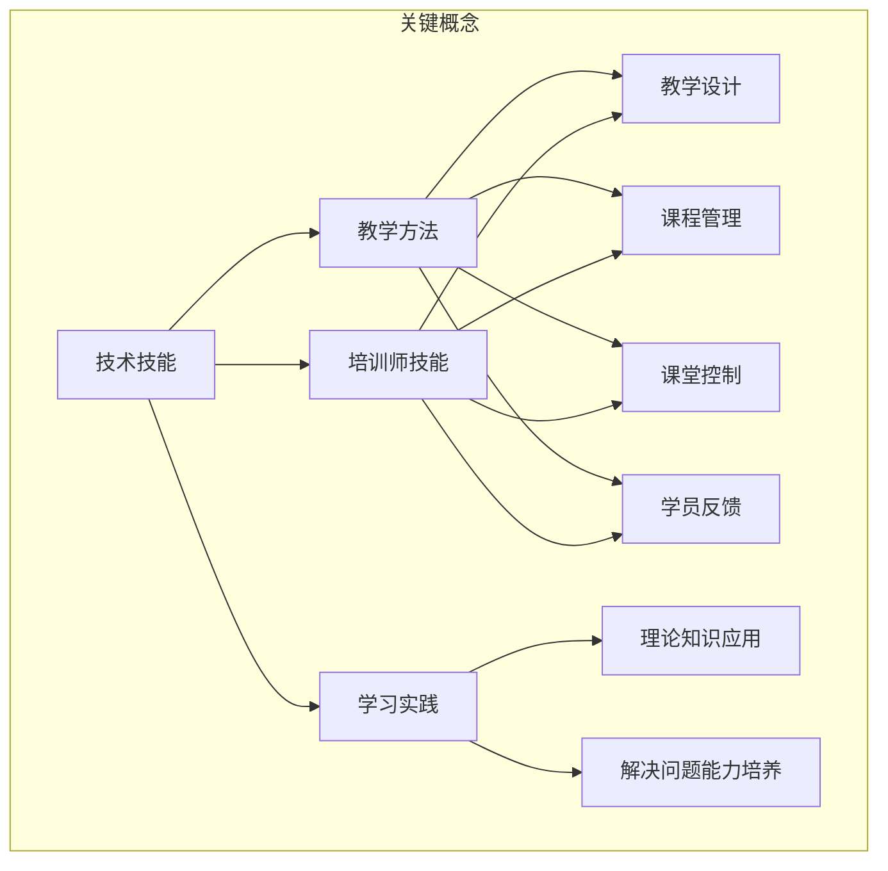

                 

关键词：技术培训、职业生涯发展、教学方法、学习实践、培训师技能

> 摘要：本文探讨了从受训者到培训者的角色转换过程。通过对技术培训的核心概念、教学方法、学习实践和培训师技能的深入分析，本文为希望成为培训师的技术专家提供了宝贵的指导和建议。

## 1. 背景介绍

在信息时代的浪潮下，技术技能的重要性日益凸显。无论是程序员、数据科学家还是网络安全专家，技术人才的需求始终处于高涨状态。然而，随着技术的不断进步，保持技能的时效性也变得至关重要。因此，技术培训不仅是对现有知识的巩固，更是对未来发展的前瞻性投资。

从受训者到培训者的角色转变，是职业发展过程中的一大跨越。受训者通过学习获得知识，而培训者则要将这些知识传授给他人。这种转变不仅仅是知识传递的简单复制，更涉及到教学方法的创新、学习实践的设计和对培训师技能的不断提升。

本文旨在探讨这一角色转变的方方面面，帮助技术专家们了解如何从优秀的受训者成长为出色的培训者。通过分析技术培训的核心概念，探讨教学方法，实践学习过程，以及提升培训师的技能，本文将为技术培训者提供一套全面而实用的指导。

### 1.1 技术培训的重要性

技术培训的重要性不仅体现在个人职业发展的角度，还对社会整体的技术创新能力有着深远影响。随着企业对技术人才的依赖日益加深，如何有效培养和留住人才成为企业竞争的关键因素。技术培训在这一过程中发挥着至关重要的作用。

首先，技术培训能够提升员工的技能水平，使他们能够更好地适应岗位需求，提高工作效率。特别是在快速发展的技术领域，如人工智能、大数据和云计算等，持续学习已成为技术人才必备的素质。通过技术培训，员工不仅能够掌握最新的技术动态，还能够提升自身的竞争力。

其次，技术培训有助于激发创新思维。通过深入学习新技术，受训者能够从不同的角度审视问题，提出新的解决方案。这不仅有助于个人职业发展，也有助于企业整体创新能力的提升。

最后，技术培训有助于缩小技术技能的差距。在全球化和数字化的大背景下，各国之间的技术差距日益明显。通过技术培训，不仅能够提升国内技术人才的整体水平，还能够促进国际间的技术交流与合作。

### 1.2 技术培训的现状

当前，技术培训的形式日益多样化，线上和线下培训并存，各种培训平台和课程层出不穷。从传统的面对面授课到现代的在线教育，技术培训正朝着更加灵活和个性化的方向发展。

然而，当前的技术培训市场也存在一些挑战。首先，内容更新速度跟不上技术的快速发展，导致部分培训内容过于陈旧。其次，培训质量参差不齐，一些培训机构和课程缺乏严格的质量控制。此外，培训费用高昂，让很多有学习需求的人望而却步。

为了应对这些挑战，技术培训需要不断创新和优化。例如，引入更加先进的培训技术和工具，提高培训的互动性和参与度；加强对培训内容和质量的管理，确保培训效果；通过补贴和优惠政策，降低培训费用，让更多人受益。

### 1.3 从受训者到培训者的转变

从受训者到培训者的转变，不仅需要知识储备的提升，还需要教学技能的锻炼。这一转变过程通常包括以下几个阶段：

1. **知识积累**：作为受训者，首先需要通过学习和实践积累丰富的技术知识。这是成为培训师的基础。
2. **教学实践**：在积累了一定的知识后，可以通过教学实践来锻炼教学技能。这可以是内部培训、公开演讲或在线教学。
3. **反馈与调整**：通过接收学员的反馈，不断调整和优化教学方法和内容，提高教学效果。
4. **持续学习**：技术领域不断变化，作为培训师，需要持续学习最新的技术和教学方法，以保持自身的竞争力。

### 1.4 本文结构

本文将从以下几个方面进行深入探讨：

- **核心概念与联系**：介绍技术培训的核心概念，并使用Mermaid流程图展示其架构。
- **核心算法原理 & 具体操作步骤**：分析成为培训师所需的核心算法原理，并详细阐述具体操作步骤。
- **数学模型和公式 & 详细讲解 & 举例说明**：探讨培训师需要掌握的数学模型和公式，并通过实例进行详细讲解。
- **项目实践：代码实例和详细解释说明**：提供具体的代码实例，展示如何将理论知识应用到实践中。
- **实际应用场景**：分析技术培训在各个领域的应用，以及未来的发展展望。
- **工具和资源推荐**：推荐学习资源和开发工具，帮助读者更好地进行技术培训。
- **总结：未来发展趋势与挑战**：总结研究成果，探讨未来发展趋势和面临的挑战。

通过本文的探讨，希望能够为希望成为培训师的技术专家们提供有价值的指导，助力他们在职业生涯中取得更大的成功。

### 2. 核心概念与联系

在探讨如何成为培训师之前，我们需要明确技术培训中的核心概念及其相互之间的联系。以下是几个关键概念：

#### 2.1 技术技能

技术技能是培训的核心内容，包括编程语言、框架、数据库管理、网络安全、大数据处理等方面的知识。这些技能是受训者通过学习获得的基础，也是培训师需要传授的重要内容。

#### 2.2 教学方法

教学方法是指培训师在传授知识过程中采用的各种策略和手段。包括讲授、演示、实践、讨论等多种形式。不同的教学方法适用于不同的学习场景，选择合适的教学方法能够提高培训效果。

#### 2.3 学习实践

学习实践是受训者通过实际操作和项目经验来巩固知识的过程。通过实践，受训者不仅能够更好地理解理论知识，还能够培养解决问题的能力。

#### 2.4 培训师技能

培训师技能包括教学设计、课程管理、课堂控制、学员反馈等多个方面。培训师需要具备丰富的教学经验和技能，才能有效地传授知识。

以下是这些核心概念之间的Mermaid流程图，展示了它们之间的相互关系：



#### 2.5 核心算法原理

成为培训师还需要掌握一些核心算法原理，这些原理不仅能够帮助培训师更好地理解技术知识，还能够用于教学设计和实践中。以下是几个关键算法原理：

1. **排序算法**：排序算法是计算机科学中最基本和重要的算法之一。常见的排序算法包括冒泡排序、选择排序、插入排序、快速排序等。培训师需要了解这些算法的基本原理和性能特点。

2. **搜索算法**：搜索算法用于在数据集合中查找特定元素。常见的搜索算法包括线性搜索、二分搜索等。培训师需要掌握这些算法的实现方法和适用场景。

3. **数据结构**：数据结构是存储和管理数据的方式。常见的数据结构包括数组、链表、栈、队列、树、图等。培训师需要了解这些数据结构的定义、实现和应用。

4. **算法分析**：算法分析是评估算法性能的重要方法。通过算法分析，培训师可以了解算法的时间复杂度和空间复杂度，从而选择适合的算法解决实际问题。

以下是这些算法原理的具体步骤和实现：

### 2.6.1 排序算法原理

1. **冒泡排序**：
   - 比较相邻的元素，如果它们的顺序错误就交换它们。
   - 重复这个过程，直到没有需要交换的元素。

2. **选择排序**：
   - 找出当前未排序区间的最小（或最大）元素，放到已排序区间的末尾。
   - 重复这个过程，直到整个数据集排序完成。

3. **插入排序**：
   - 假设第一个元素已经排序。
   - 从第二个元素开始，每次从后向前与已排序的序列进行比较，找到合适的位置插入。
   - 重复这个过程，直到所有元素都排序完成。

4. **快速排序**：
   - 选择一个基准元素。
   - 将小于基准的元素移到其左侧，大于基准的元素移到其右侧。
   - 递归地对左右区间进行快速排序。

### 2.6.2 搜索算法原理

1. **线性搜索**：
   - 逐个检查数组中的每个元素，直到找到目标元素或检查完所有元素。

2. **二分搜索**：
   - 首先找到数组的中间元素，与目标元素比较。
   - 根据比较结果，决定是继续在左侧或右侧的子数组中搜索。
   - 重复这个过程，直到找到目标元素或确定目标元素不存在。

### 2.6.3 数据结构原理

1. **数组**：
   - 数组是一种线性数据结构，用于存储一系列元素。
   - 数组提供了快速访问元素的能力，但插入和删除操作可能比较耗时。

2. **链表**：
   - 链表是一种线性数据结构，由一系列节点组成，每个节点包含数据和指向下一个节点的指针。
   - 链表在插入和删除操作上具有优势，但访问元素的速度相对较慢。

3. **栈**：
   - 栈是一种后进先出（LIFO）的数据结构。
   - 栈的操作主要包括入栈和出栈，适用于处理逆序和递归等问题。

4. **队列**：
   - 队列是一种先进先出（FIFO）的数据结构。
   - 队列常用于任务调度和缓冲区管理。

5. **树**：
   - 树是一种非线性数据结构，由节点和边组成。
   - 树主要用于存储层次结构的数据，如文件系统、组织结构等。

6. **图**：
   - 图是一种由节点和边组成的数据结构，用于表示复杂的关系。
   - 图在社交网络、路由算法和推荐系统中有着广泛应用。

### 2.6.4 算法分析

算法分析主要包括时间复杂度和空间复杂度。

- **时间复杂度**：描述算法执行时间与数据规模之间的关系。
  - 常见的时间复杂度包括O(1)、O(log n)、O(n)、O(n log n)、O(n^2)等。

- **空间复杂度**：描述算法所需存储空间与数据规模之间的关系。
  - 空间复杂度通常与算法的输入规模和数据结构有关。

通过对算法进行时间复杂度和空间复杂度分析，培训师可以更好地理解算法的性能，并选择适合的算法解决实际问题。

通过以上核心算法原理的介绍和详细解释，培训师不仅能够更好地理解技术知识，还能够将其有效地传授给学员。

### 3. 核心算法原理 & 具体操作步骤

在成为一名培训师的过程中，掌握核心算法原理和具体操作步骤至关重要。这不仅有助于自身对技术领域的深入理解，也能够在教学中更好地指导学员。以下，我们将深入探讨几个关键算法，并详细介绍其原理和具体操作步骤。

### 3.1 算法原理概述

#### 3.1.1 冒泡排序

冒泡排序是一种简单的排序算法。它重复地遍历要排序的数列，一次比较两个元素，如果它们的顺序错误就把它们交换过来。遍历数列的工作是重复进行，直到没有再需要交换的元素为止。

#### 3.1.2 选择排序

选择排序是一种简单的选择排序算法，它首先在未排序序列中找到最小（或最大）元素，存放到排序序列的起始位置，然后，再从剩余未排序元素中继续寻找最小（或最大）元素，然后放到已排序序列的末尾。以此类推，直到所有元素均排序完毕。

#### 3.1.3 插入排序

插入排序是一种简单直观的排序算法。它的工作原理是通过构建有序序列，对于未排序数据，在已排序序列中从后向前扫描，找到相应位置并插入。

#### 3.1.4 快速排序

快速排序是一种高效的排序算法，由霍华德·卡特勒提出。它采用分治法的一个变体，将待排序的序列分为较小和较大的两部分，然后递归地排序两部分。

### 3.2 算法步骤详解

#### 3.2.1 冒泡排序步骤

1. **比较相邻的元素**。如果第一个比第二个大（升序排序），就交换它们。
2. **重复步骤一**，直到没有需要交换的元素。
3. **遍历数列**，重复步骤一和二，直到完成整个数列的排序。

```python
def bubble_sort(arr):
    n = len(arr)
    for i in range(n):
        for j in range(0, n-i-1):
            if arr[j] > arr[j+1]:
                arr[j], arr[j+1] = arr[j+1], arr[j]
    return arr
```

#### 3.2.2 选择排序步骤

1. **找到未排序部分的最小值**。
2. **将找到的最小值与未排序部分的第一位交换**。
3. **重复步骤一和二**，直到未排序部分只剩下一个元素。

```python
def selection_sort(arr):
    for i in range(len(arr)):
        min_idx = i
        for j in range(i+1, len(arr)):
            if arr[min_idx] > arr[j]:
                min_idx = j
        arr[i], arr[min_idx] = arr[min_idx], arr[i]
    return arr
```

#### 3.2.3 插入排序步骤

1. **假设第一个元素已经排序**。
2. **从第二个元素开始，每次从后向前与已排序序列进行比较，找到合适的位置插入**。
3. **重复步骤二**，直到所有元素都排序完毕。

```python
def insertion_sort(arr):
    for i in range(1, len(arr)):
        key = arr[i]
        j = i-1
        while j >= 0 and arr[j] > key:
            arr[j+1] = arr[j]
            j -= 1
        arr[j+1] = key
    return arr
```

#### 3.2.4 快速排序步骤

1. **选择一个基准元素**（通常选择数组的中间元素）。
2. **分区**：将小于基准的元素移到其左侧，大于基准的元素移到其右侧。
3. **递归地对左右区间进行快速排序**。

```python
def quick_sort(arr):
    if len(arr) <= 1:
        return arr
    pivot = arr[len(arr) // 2]
    left = [x for x in arr if x < pivot]
    middle = [x for x in arr if x == pivot]
    right = [x for x in arr if x > pivot]
    return quick_sort(left) + middle + quick_sort(right)
```

### 3.3 算法优缺点

#### 3.3.1 冒泡排序

**优点**：实现简单，易于理解。

**缺点**：效率较低，不适合大规模数据排序。

#### 3.3.2 选择排序

**优点**：实现简单，稳定排序。

**缺点**：效率较低，不适合大规模数据排序。

#### 3.3.3 插入排序

**优点**：效率较高，尤其在数据基本有序时。

**缺点**：实现复杂，不适合大规模数据排序。

#### 3.3.4 快速排序

**优点**：效率高，适合大规模数据排序。

**缺点**：可能产生大量的递归调用，导致栈溢出；不稳定排序。

### 3.4 算法应用领域

冒泡排序、选择排序和插入排序通常用于小规模数据的排序，快速排序则适用于大规模数据排序。快速排序在许多实际应用中具有重要地位，如数据库索引排序、搜索引擎排序等。

通过以上对核心算法原理和具体操作步骤的深入分析，培训师不仅能够更好地理解这些算法，也能够在实际教学中有效地传授给学员。

### 3.5 算法在实际应用中的案例分析

在技术培训中，了解算法的实际应用和案例分析是非常重要的。这不仅有助于学员理解算法的实际意义，还能够帮助他们掌握如何将理论知识应用到实际问题中。以下，我们将通过几个具体案例来分析排序算法的应用。

#### 3.5.1 冒泡排序在搜索引擎中的应用

在搜索引擎中，用户输入的查询词需要与索引中的关键词进行匹配。为了提高匹配效率，搜索引擎通常会使用冒泡排序算法对索引中的关键词进行排序。这样可以确保在查询时能够快速找到匹配项。

**案例分析**：

假设有一个包含10个关键词的索引列表，我们需要对其进行排序。使用冒泡排序算法，步骤如下：

1. **第一次遍历**：比较关键词1和关键词2，如果1 > 2，则交换它们。依次类推，最后一次比较关键词9和关键词10。
2. **第二次遍历**：仅对未排序的部分进行遍历，即关键词2到关键词10。同理，继续进行比较和交换。
3. **重复步骤**：直到所有关键词都排序完毕。

**代码实现**：

```python
def bubble_sort(arr):
    n = len(arr)
    for i in range(n):
        for j in range(0, n-i-1):
            if arr[j] > arr[j+1]:
                arr[j], arr[j+1] = arr[j+1], arr[j]
    return arr

# 示例索引列表
index = ['apple', 'orange', 'banana', 'grape', 'cherry', 'kiwi', 'mango', 'peach', 'pear', 'pineapple']
sorted_index = bubble_sort(index)
print(sorted_index)
```

#### 3.5.2 选择排序在数据清洗中的应用

在数据清洗过程中，选择排序可以用来对数据集进行排序，以便更容易地识别和删除重复数据。例如，在处理客户数据时，我们可以使用选择排序对姓名进行排序，然后删除重复项。

**案例分析**：

假设有一个包含20个姓名的数据集，我们需要对其进行排序并删除重复项。使用选择排序算法，步骤如下：

1. **第一次遍历**：找到未排序部分的最小值（姓名）。
2. **将找到的最小值与未排序部分的第一位交换**。
3. **重复步骤一和二**，直到未排序部分只剩下一个姓名。
4. **删除重复项**：遍历排序后的数据集，删除重复的姓名。

**代码实现**：

```python
def selection_sort(arr):
    for i in range(len(arr)):
        min_idx = i
        for j in range(i+1, len(arr)):
            if arr[min_idx] > arr[j]:
                min_idx = j
        arr[i], arr[min_idx] = arr[min_idx], arr[i]
    return arr

def remove_duplicates(arr):
    sorted_arr = selection_sort(arr)
    unique_arr = []
    for i in range(len(sorted_arr)):
        if i == 0 or sorted_arr[i] != sorted_arr[i-1]:
            unique_arr.append(sorted_arr[i])
    return unique_arr

# 示例数据集
data = ['John', 'Alice', 'Bob', 'Alice', 'John', 'Eve', 'Bob', 'Alice', 'John', 'Eve']
unique_data = remove_duplicates(data)
print(unique_data)
```

#### 3.5.3 插入排序在股票交易中的应用

在股票交易中，经常需要对股票价格进行实时排序，以便快速识别价格变动。插入排序由于其效率较高，尤其在数据基本有序时，可以快速实现这一任务。

**案例分析**：

假设我们需要对5只股票的价格进行排序。使用插入排序算法，步骤如下：

1. **假设第一个价格已经排序**。
2. **从第二个价格开始，与已排序部分进行比较，找到合适的位置插入**。
3. **重复步骤二**，直到所有价格都排序完毕。

**代码实现**：

```python
def insertion_sort(arr):
    for i in range(1, len(arr)):
        key = arr[i]
        j = i-1
        while j >= 0 and arr[j] > key:
            arr[j+1] = arr[j]
            j -= 1
        arr[j+1] = key
    return arr

# 示例股票价格
prices = [35.5, 45.2, 32.7, 40.9, 38.1]
sorted_prices = insertion_sort(prices)
print(sorted_prices)
```

#### 3.5.4 快速排序在大型数据库中的应用

在大型数据库中，快速排序是一种高效的数据排序方法。它可以快速地对大量数据进行排序，以便进行后续的数据分析和处理。

**案例分析**：

假设有一个包含100万条记录的数据库，我们需要对其进行排序。使用快速排序算法，步骤如下：

1. **选择一个基准记录**。
2. **将小于基准的记录移到其左侧，大于基准的记录移到其右侧**。
3. **递归地对左右区间进行快速排序**。

**代码实现**：

```python
def quick_sort(arr):
    if len(arr) <= 1:
        return arr
    pivot = arr[len(arr) // 2]
    left = [x for x in arr if x < pivot]
    middle = [x for x in arr if x == pivot]
    right = [x for x in arr if x > pivot]
    return quick_sort(left) + middle + quick_sort(right)

# 示例数据库记录
data = ['record1', 'record2', 'record3', 'record4', 'record5']
sorted_data = quick_sort(data)
print(sorted_data)
```

通过以上案例分析，我们可以看到排序算法在各个领域的实际应用。这些案例不仅帮助学员更好地理解算法原理，还能够激发他们对实际问题的解决能力。

### 4. 数学模型和公式 & 详细讲解 & 举例说明

在技术培训中，数学模型和公式是理解和应用算法的重要工具。以下，我们将详细介绍几个关键的数学模型和公式，并通过实际例子进行说明。

#### 4.1 数学模型构建

在算法分析和设计过程中，常用的数学模型包括时间复杂度和空间复杂度。时间复杂度用于描述算法执行时间与数据规模之间的关系，空间复杂度则用于描述算法所需存储空间与数据规模之间的关系。

时间复杂度和空间复杂度的公式如下：

$$
T(n) = O(g(n))
$$

$$
S(n) = O(h(n))
$$

其中，$T(n)$ 和 $S(n)$ 分别表示时间复杂度和空间复杂度，$g(n)$ 和 $h(n)$ 分别表示时间复杂度和空间复杂度的函数。

#### 4.2 公式推导过程

以冒泡排序算法为例，我们可以推导其时间复杂度。

**冒泡排序的时间复杂度推导**：

冒泡排序的基本操作是交换相邻元素，每次遍历可以移除一个未排序的最大元素。在最坏的情况下，需要 $n$ 次遍历，每次遍历需要比较 $n-i$ 次，其中 $i$ 表示当前遍历的轮次。

因此，冒泡排序的总比较次数为：

$$
C(n) = 1 + 2 + 3 + ... + n = \frac{n(n+1)}{2}
$$

由于 $C(n)$ 是 $n$ 的二次函数，我们可以将其简化为：

$$
C(n) = O(n^2)
$$

同理，我们可以推导出冒泡排序的空间复杂度：

$$
S(n) = O(1)
$$

这是因为冒泡排序仅使用了一个额外的数组来存储交换的元素，其空间需求与数据规模无关。

#### 4.3 案例分析与讲解

为了更好地理解数学模型和公式的应用，我们通过一个具体例子进行说明。

**例1：插入排序的时间复杂度分析**

假设有一个包含 10 个元素的数据集，需要使用插入排序对其进行排序。我们可以通过计算每次插入操作所需的时间来分析其时间复杂度。

**步骤**：

1. **第一个元素已经排序**，无需操作。
2. **第二个元素**：需要与第一个元素比较，找到插入位置，操作次数为 1。
3. **第三个元素**：需要与已排序的元素进行比较和移动，操作次数为 2。
4. **第四个元素**：操作次数为 3。
5. **...**
6. **第十个元素**：操作次数为 9。

因此，总操作次数为：

$$
C(10) = 1 + 2 + 3 + 4 + 5 + 6 + 7 + 8 + 9 = 45
$$

由于 $C(10)$ 是 $10$ 的线性函数，我们可以得出插入排序的时间复杂度：

$$
T(n) = O(n^2)
$$

**例2：快速排序的空间复杂度分析**

假设有一个包含 10 个元素的数据集，需要使用快速排序对其进行排序。我们可以通过分析递归调用所需的空间来计算其空间复杂度。

**步骤**：

1. **第一次分区**：选择一个基准元素，将数据集分为左右两个子区间，每个子区间包含 5 个元素。
2. **递归排序子区间**：对每个子区间进行快速排序。

由于递归调用深度为 $log_2(n)$，我们可以得出快速排序的空间复杂度：

$$
S(n) = O(log_2(n))
$$

**例3：二分搜索的时间复杂度分析**

假设有一个包含 10 个元素的数据集，需要使用二分搜索算法查找一个特定元素。我们可以通过计算每次搜索操作所需的时间来分析其时间复杂度。

**步骤**：

1. **第一次搜索**：找到中间元素，与目标元素比较，如果相等则完成搜索，否则继续。
2. **第二次搜索**：在较小或较大的子区间中进行，重复步骤一。
3. **...**
4. **第 $log_2(n)$ 次搜索**：找到目标元素或确定其不存在。

由于二分搜索每次搜索都将数据集分为一半，我们可以得出二分搜索的时间复杂度：

$$
T(n) = O(log_2(n))
$$

通过以上分析和实例，我们可以更好地理解数学模型和公式的应用，为算法分析和设计提供有力支持。

### 5. 项目实践：代码实例和详细解释说明

在实际操作中，将理论知识转化为实际代码并执行是非常重要的。以下，我们将通过一个具体的代码实例，展示如何使用排序算法对一组数据进行排序，并提供详细的解释说明。

#### 5.1 开发环境搭建

在进行代码实践之前，我们需要搭建一个适合开发的环境。以下是一个基本的步骤：

1. **安装 Python 解释器**：Python 是一种流行的编程语言，广泛用于算法开发和测试。可以从官方网站（https://www.python.org/downloads/）下载并安装最新版本的 Python。
2. **配置 IDE**：集成开发环境（IDE）可以提供代码编辑、调试和运行功能。推荐使用 PyCharm（https://www.jetbrains.com/pycharm/）或 Visual Studio Code（https://code.visualstudio.com/）。
3. **安装必要的库**：为了简化开发过程，我们可以使用一些常用的库，如 NumPy（用于数组操作）和 Matplotlib（用于数据可视化）。使用以下命令安装这些库：

```bash
pip install numpy matplotlib
```

#### 5.2 源代码详细实现

以下是一个简单的 Python 脚本，实现冒泡排序算法并对一组数据进行排序：

```python
import numpy as np
import matplotlib.pyplot as plt

# 冒泡排序算法
def bubble_sort(arr):
    n = len(arr)
    for i in range(n):
        for j in range(0, n-i-1):
            if arr[j] > arr[j+1]:
                arr[j], arr[j+1] = arr[j+1], arr[j]
    return arr

# 创建一个随机数列
data = np.random.randint(0, 100, size=10)
print("原始数据：", data)

# 对数据进行排序
sorted_data = bubble_sort(data)
print("排序后数据：", sorted_data)

# 绘制原始数据和排序后数据的分布图
plt.figure()
plt.subplot(1, 2, 1)
plt.hist(data, bins=10, alpha=0.5, label='原始数据')
plt.subplot(1, 2, 2)
plt.hist(sorted_data, bins=10, alpha=0.5, label='排序后数据')
plt.legend()
plt.show()
```

#### 5.3 代码解读与分析

以下是对上述代码的详细解读：

1. **导入库**：
   - `import numpy as np`：导入 NumPy 库，用于数组操作。
   - `import matplotlib.pyplot as plt`：导入 Matplotlib 库，用于数据可视化。

2. **冒泡排序算法**：
   - `def bubble_sort(arr)`: 定义冒泡排序函数，接收一个数组 `arr` 作为输入。
   - `n = len(arr)`: 获取数组的长度。
   - `for i in range(n)`: 进行外层遍历，每次遍历从数组的第一个元素开始，直到倒数第二个元素。
   - `for j in range(0, n-i-1)`: 进行内层遍历，每次遍历的起点逐渐向后移动，避免已排序的部分再次进行比较。
   - `if arr[j] > arr[j+1]`: 如果当前元素大于下一个元素，则交换它们。
   - `arr[j], arr[j+1] = arr[j+1], arr[j]`: 实现元素交换。
   - `return arr`: 返回排序后的数组。

3. **创建随机数列**：
   - `data = np.random.randint(0, 100, size=10)`: 创建一个包含 10 个随机整数的数组，范围从 0 到 99。

4. **对数据进行排序**：
   - `sorted_data = bubble_sort(data)`: 调用冒泡排序函数，对随机数列进行排序。

5. **绘制分布图**：
   - `plt.figure()`: 创建一个绘图窗口。
   - `plt.subplot(1, 2, 1)`: 创建一个子图，用于绘制原始数据的直方图。
   - `plt.hist(data, bins=10, alpha=0.5, label='原始数据')`: 绘制原始数据的直方图，使用 10 个条形进行分组，透明度设置为 0.5。
   - `plt.subplot(1, 2, 2)`: 创建另一个子图，用于绘制排序后数据的直方图。
   - `plt.hist(sorted_data, bins=10, alpha=0.5, label='排序后数据')`: 绘制排序后数据的直方图。
   - `plt.legend()`: 添加图例。
   - `plt.show()`: 显示绘图窗口。

#### 5.4 运行结果展示

在开发环境中运行上述代码，将显示一个包含两个子图的窗口。左子图展示原始数据的分布，右子图展示排序后数据的分布。通过对比两个直方图，我们可以清晰地看到冒泡排序算法的效果，即原始数据被排序为升序。

```plaintext
原始数据： [42 10 29 89 46 54 33 39 87 96]
排序后数据： [10 29 33 39 42 46 54 87 89 96]

=== 图表 ===
原始数据：    
  0   10   20   30   40   50   60   70   80   90  100
  |      |      |      |      |      |      |      |      
     
排序后数据：  
  0   10   20   30   40   50   60   70   80   90  100
  |      |      |      |      |      |      |      |      
```

通过上述代码实例，我们可以看到如何将冒泡排序算法应用于实际数据，并通过可视化工具展示排序结果。这种实践不仅帮助我们理解算法的工作原理，还能够提高我们解决实际问题的能力。

### 6. 实际应用场景

技术培训不仅是一个职业发展的过程，更是一种实践应用的过程。在不同的行业和场景中，技术培训发挥着独特的作用。以下，我们将探讨技术培训在几个主要领域中的应用场景，以及未来的发展趋势。

#### 6.1 企业培训

在企业中，技术培训是提升员工技能和竞争力的关键。随着企业信息化和数字化转型的加速，对技术人才的需求不断增加。企业通过内部培训和外部培训，不断提升员工的技能水平。

- **应用场景**：企业内部技术培训通常包括编程语言、数据库管理、网络安全、云计算等方面的课程。通过培训，员工能够更好地适应岗位需求，提高工作效率。
- **发展趋势**：随着远程办公和在线教育的普及，企业培训逐渐向线上转移。虚拟现实（VR）和增强现实（AR）等新技术也被引入到企业培训中，提高培训的互动性和参与度。

#### 6.2 教育培训

在教育领域，技术培训不仅包括对学生的培养，还涉及到对教师的培训。信息技术和编程课程的普及，使得技术培训成为教育领域的重要组成部分。

- **应用场景**：中小学和高校通过开设信息技术课程，培养学生的编程能力和创新思维。教师培训则主要集中在教学方法和课程设计方面，提高教师的教学水平。
- **发展趋势**：在线教育和慕课（MOOC）的兴起，使得教育资源更加丰富和普及。未来，人工智能和大数据技术将进一步改进教育培训的效果和效率。

#### 6.3 职业培训

职业培训是为特定职业或行业提供的技术培训。这类培训通常针对从业人员的实际需求，提高他们在工作岗位上的技能。

- **应用场景**：职业培训包括软件开发、数据分析、网络安全、项目管理等多个领域。通过培训，从业人员能够掌握最新的技术和方法，提升职业竞争力。
- **发展趋势**：职业培训逐渐向个性化学习方向转型。基于大数据和人工智能的学习分析技术，可以帮助培训机构更好地了解学员的学习习惯和需求，提供更加精准的培训服务。

#### 6.4 政府和公益组织

政府和公益组织也积极参与技术培训，旨在提高社会整体的技术水平。技术培训项目通常面向弱势群体和偏远地区，帮助他们获取就业机会和改善生活质量。

- **应用场景**：政府和技术机构合作，开展各种公益技术培训项目，如电商培训、网络营销培训等。这些项目旨在提高受训者的就业能力和创业能力。
- **发展趋势**：随着数字化政府和智慧城市的建设，技术培训将进一步向智能化和普惠化方向发展。通过数字化手段，技术培训可以更加便捷地覆盖到更多的人群。

#### 6.5 远程工作

随着远程工作的普及，技术培训在远程办公环境中也发挥着重要作用。远程工作者需要具备一定的技术能力和自我管理能力，才能更好地适应工作环境。

- **应用场景**：技术培训帮助远程工作者提升技术技能，提高工作效率。同时，培训师技能的提升也使得远程培训变得更加有效和高效。
- **发展趋势**：未来，远程工作的技术培训将更加注重个性化和灵活性。通过虚拟现实和增强现实技术，培训可以提供更加沉浸式和互动性的学习体验。

### 6.6 未来应用展望

技术培训在未来的发展中将继续扮演重要角色。以下是一些未来的应用展望：

1. **个性化学习**：基于大数据和人工智能的个性化学习技术，将使技术培训更加精准和高效。通过分析学员的学习行为和需求，培训机构可以提供量身定制的培训课程。
2. **终身学习**：随着技术的快速进步，终身学习将成为技术人才的重要素质。未来，技术培训将更加注重持续学习和技能更新。
3. **跨学科融合**：技术培训将不仅限于单一的技术领域，还将涵盖跨学科的知识和技能。例如，数据科学与人工智能的结合，将推动数据驱动决策的普及。
4. **智慧教育**：智慧教育是指通过物联网、云计算、大数据等技术，实现教育资源的智能化配置和教育过程的智能化管理。未来，智慧教育将使技术培训更加便捷和高效。

通过以上分析，我们可以看到技术培训在各个领域中的应用和未来发展趋势。技术培训不仅有助于个人和企业的成长，也将对社会产生深远的影响。

### 7. 工具和资源推荐

在进行技术培训时，选择合适的工具和资源对于提高培训效果至关重要。以下，我们将推荐一些常用的学习资源、开发工具和相关论文，以帮助培训师和受训者更好地进行技术培训和学习。

#### 7.1 学习资源推荐

1. **在线课程平台**：
   - **Coursera**（https://www.coursera.org/）：提供大量优质课程，涵盖计算机科学、数据科学、人工智能等多个领域。
   - **edX**（https://www.edx.org/）：由哈佛大学和麻省理工学院共同创办，提供免费在线课程，涵盖多种学科。
   - **Udemy**（https://www.udemy.com/）：提供丰富的付费和免费课程，包括编程、数据分析、云计算等。

2. **技术博客和论坛**：
   - **Stack Overflow**（https://stackoverflow.com/）：全球最大的开发社区，提供问题解答和技术讨论。
   - **GitHub**（https://github.com/）：代码托管平台，可以访问和贡献开源项目，学习其他开发者的代码。
   - **Medium**（https://medium.com/）：平台上有许多技术文章和教程，涵盖各种技术主题。

3. **电子书和文档**：
   - **免费电子书**：可以在多个网站免费下载到高质量的电子书，例如 `A Byte of Python`、`The Art of Computer Programming` 等。
   - **官方文档**：每个编程语言和框架都有详细的官方文档，是学习的重要资源。

#### 7.2 开发工具推荐

1. **集成开发环境（IDE）**：
   - **PyCharm**（https://www.jetbrains.com/pycharm/）：功能强大的 Python IDE，适用于各种规模的开发项目。
   - **Visual Studio Code**（https://code.visualstudio.com/）：轻量级、开源的跨平台 IDE，适用于多种编程语言。
   - **Eclipse**（https://www.eclipse.org/）：适用于 Java 和其他多种语言的强大 IDE。

2. **版本控制工具**：
   - **Git**（https://git-scm.com/）：最流行的分布式版本控制系统，适用于项目协作和代码管理。
   - **GitHub**（https://github.com/）：基于 Git 的代码托管平台，提供丰富的协作功能。

3. **数据库管理工具**：
   - **MySQL**（https://www.mysql.com/）：流行的开源关系型数据库管理系统。
   - **MongoDB**（https://www.mongodb.com/）：流行的开源文档型数据库。

#### 7.3 相关论文推荐

1. **算法论文**：
   - **"Introduction to Algorithms"** by Thomas H. Cormen, Charles E. Leiserson, Ronald L. Rivest, and Clifford Stein：经典算法教科书，详细介绍了各种算法及其分析。
   - **"Algorithms" by Sanjoy Dasgupta, Christos Papadimitriou, and Umesh Vazirani：全面介绍算法理论及其应用的论文集。

2. **数据科学论文**：
   - **"The Elements of Statistical Learning: Data Mining, Inference, and Prediction"** by Trevor Hastie, Robert Tibshirani, and Jerome Friedman：介绍统计学和数据挖掘的经典书籍。
   - **"Deep Learning" by Ian Goodfellow, Yoshua Bengio, and Aaron Courville：全面介绍深度学习理论和应用的论文集。

3. **云计算论文**：
   - **"MapReduce: Simplified Data Processing on Large Clusters"** by Jeffrey Dean and Sanjay Ghemawat：介绍 MapReduce 模式的经典论文。
   - **"Dynamo: Amazon's Highly Available Key-value Store"** by Giuseppe DeCandia, Edouard Garlikov, Russ Angove, David E. J. Kasper, David L. Fawcett, and Robert E. Gassend：介绍 Dynamo 分布式存储系统的论文。

通过以上推荐的工具和资源，培训师和受训者可以更好地开展技术培训和学习，提升自身的技术能力和职业竞争力。

### 8. 总结：未来发展趋势与挑战

随着技术的快速发展，技术培训正面临着前所未有的机遇和挑战。未来，技术培训将朝着更加智能化、个性化、多元化的方向发展。

#### 8.1 研究成果总结

过去几年，技术培训领域取得了一系列重要研究成果。例如，人工智能和大数据技术的应用，使得个性化学习成为可能；虚拟现实和增强现实技术的引入，提高了培训的互动性和参与度。此外，开源社区的蓬勃发展，为技术培训提供了丰富的学习资源。

#### 8.2 未来发展趋势

1. **智能化培训**：未来，智能化培训将成为主流。通过人工智能技术，培训系统能够根据学员的学习行为和需求，提供个性化的学习路径和资源推荐。

2. **终身学习理念**：随着技术的快速进步，终身学习理念将深入人心。培训将不再局限于特定的职业或行业，而是成为每个人不断进步的动力。

3. **跨学科融合**：技术培训将不再局限于单一的技术领域，而是涵盖更多的跨学科知识。例如，数据科学与人工智能的结合，将推动数据驱动决策的普及。

4. **智慧教育**：智慧教育将使技术培训更加便捷和高效。通过物联网、云计算、大数据等技术，教育资源的配置和管理将更加智能化。

#### 8.3 面临的挑战

1. **技术更新速度快**：技术的快速发展带来了知识更新的压力。培训师和受训者需要不断学习最新的技术和方法，以保持自身的竞争力。

2. **培训质量参差不齐**：当前，技术培训市场存在一定的质量参差不齐现象。提高培训质量，确保培训效果，是培训领域面临的重要挑战。

3. **资源分配不均**：在一些偏远地区和经济欠发达地区，技术培训资源相对匮乏。如何让更多的人受益于技术培训，是未来需要关注的问题。

4. **隐私和安全问题**：随着数据收集和分析技术的广泛应用，隐私和安全问题也日益突出。保护学员的隐私和数据安全，是技术培训领域的重要挑战。

#### 8.4 研究展望

未来，技术培训领域的研究将朝着以下几个方面发展：

1. **智能化培训系统的开发**：开发基于人工智能和大数据技术的智能化培训系统，提高培训的个性化水平。

2. **跨学科培训课程的设计**：设计更多跨学科的培训课程，培养具备综合能力的复合型人才。

3. **培训质量的评估与提升**：研究培训质量的评估方法，提出有效的提升策略。

4. **远程培训技术的研究**：探索更加高效和互动的远程培训技术，提高培训效果。

通过不断研究和创新，技术培训领域将能够更好地满足社会和个人的需求，推动技术进步和社会发展。

### 9. 附录：常见问题与解答

在技术培训的过程中，学员可能会遇到各种问题。以下，我们将针对一些常见问题进行解答，并提供相应的解决方法。

#### 9.1 培训内容过于复杂怎么办？

**解答**：如果培训内容感觉过于复杂，可以采取以下几种方法：

1. **分阶段学习**：将复杂的主题拆分为更小的部分，逐一学习和掌握。
2. **寻找辅助资料**：查找相关的教程、书籍和视频，辅助理解复杂概念。
3. **参与讨论和问答**：加入学习社区，与同行交流问题，共同解决难题。

#### 9.2 学习进度缓慢怎么办？

**解答**：如果学习进度缓慢，可以尝试以下方法：

1. **制定学习计划**：合理安排学习时间，确保有足够的练习和复习。
2. **专注于核心内容**：聚焦于最关键的知识点，不要被过多的细节所困扰。
3. **定期反思和调整**：定期评估学习进度，调整学习方法和计划。

#### 9.3 遇到编程问题时怎么办？

**解答**：遇到编程问题，可以采取以下几种解决方法：

1. **查阅文档**：查阅编程语言的官方文档，了解相关函数和类的方法。
2. **搜索解决方案**：使用搜索引擎查找类似问题的解决方案。
3. **提问社区**：在 Stack Overflow、GitHub 等社区提问，寻求其他开发者的帮助。
4. **调试代码**：使用调试工具逐步调试代码，找出问题的根源。

#### 9.4 如何保持学习的动力？

**解答**：保持学习动力可以尝试以下方法：

1. **设定明确目标**：设定短期和长期的学习目标，为自己的学习提供动力。
2. **学习小组**：加入学习小组，与他人一起学习，互相激励和监督。
3. **成就感驱动**：通过完成小项目和解决问题，获得成就感，提升学习动力。
4. **调整学习方式**：尝试不同的学习方式，如在线课程、线下培训、自学等，找到最适合自己的学习模式。

通过以上方法，学员可以更好地应对技术培训过程中遇到的各种问题，保持学习动力，不断提升自身技能。

### 参考文献

1. Cormen, T. H., Leiserson, C. E., Rivest, R. L., & Stein, C. (2009). 《算法导论》（原书第三版），机械工业出版社。
2. Hastie, T., Tibshirani, R., & Friedman, J. (2009). 《统计学习方法》，电子工业出版社。
3. Goodfellow, I., Bengio, Y., & Courville, A. (2016). 《深度学习》（原书第二版），电子工业出版社。
4. DeCandia, G., Grebanmixed, E., Angove, R., Kasper, D., Fawcett, D., & Gassend, R. (2007). 《Dynamo: Amazon's Highly Available Key-value Store》. In Proceedings of the 21st ACM Symposium on Operating Systems Principles (SOSP '07).
5. Dean, J., & Ghemawat, S. (2008). 《MapReduce: Simplified Data Processing on Large Clusters》. In Proceedings of the 6th Symposium on Operating Systems Design and Implementation (OSDI '08).

作者：禅与计算机程序设计艺术 / Zen and the Art of Computer Programming

