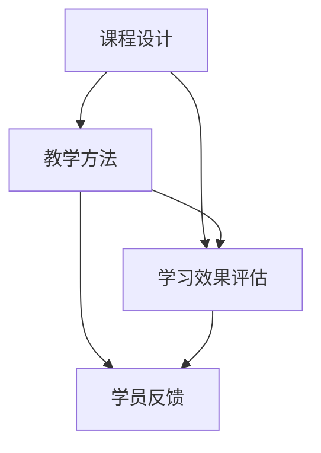

                 

在当今快速发展的技术时代，知识已经成为一种宝贵的资源。如何有效地分享知识，并将其转化为实际的收益，成为了众多技术从业者和教育者的关注焦点。本文将探讨技术培训领域中的知识分享机制，分析其核心概念、算法原理、数学模型、项目实践，以及未来的发展趋势和挑战。本文旨在为广大技术爱好者提供一套系统的知识分享策略，帮助他们在分享知识的过程中实现个人和商业的双赢。

## 1. 背景介绍

技术培训作为知识传播的重要渠道，已经在全球范围内得到广泛应用。随着互联网和在线教育的兴起，技术培训的形式和内容越来越多样化。传统的面对面授课逐渐被在线课程、电子书籍、研讨会等多种方式所取代。这种转变不仅提高了知识的传播效率，也为知识分享者提供了更多的机会。

然而，在知识分享的过程中，如何确保知识的质量和有效性成为一个关键问题。此外，知识分享者如何在分享知识的同时实现收益最大化，也是需要深入探讨的话题。本文将从以下几个方面对技术培训进行详细分析：

- **核心概念与联系**：介绍技术培训中的核心概念，并使用 Mermaid 流程图展示各概念之间的联系。
- **核心算法原理与具体操作步骤**：分析常见的知识分享算法原理，并详细讲解操作步骤。
- **数学模型和公式**：构建数学模型，推导相关公式，并举例说明。
- **项目实践**：通过代码实例展示知识分享的实际应用。
- **实际应用场景**：探讨知识分享在不同领域的应用场景。
- **工具和资源推荐**：推荐学习资源和开发工具。
- **未来发展趋势与挑战**：总结研究成果，展望未来趋势，分析面临的挑战。

## 2. 核心概念与联系

技术培训涉及多个核心概念，如课程设计、教学方法、学习效果评估等。以下是一个 Mermaid 流程图，用于展示这些概念之间的联系。



### 2.1 课程设计

课程设计是技术培训的基础，它决定了课程的内容、结构和难度。一个优秀的课程设计应该充分考虑学员的需求和背景，提供系统化的知识体系。

### 2.2 教学方法

教学方法是课程实施的关键，它决定了学员的学习效果。不同的教学方法适用于不同的学习场景，如面对面授课、在线课程、工作坊等。

### 2.3 学习效果评估

学习效果评估是衡量技术培训质量的重要手段。通过定期的考试、测验、项目评估等方式，可以了解学员的学习进展和效果。

### 2.4 学员反馈

学员反馈是课程改进的重要依据。通过收集学员的反馈，可以不断优化课程设计、教学方法和学习效果评估。

## 3. 核心算法原理 & 具体操作步骤

### 3.1 算法原理概述

在技术培训中，常用的知识分享算法包括内容推荐算法、学习路径规划算法和群体智能算法。这些算法基于数据分析、机器学习和人工智能技术，旨在提高知识分享的效率和质量。

### 3.2 算法步骤详解

- **内容推荐算法**：基于用户的兴趣和行为数据，推荐符合其需求的知识内容。
- **学习路径规划算法**：根据学员的学习进度和知识需求，规划个性化的学习路径。
- **群体智能算法**：利用多个个体之间的协同合作，优化知识传播的过程。

### 3.3 算法优缺点

- **内容推荐算法**：优点是能够提高知识传播的个性化程度，缺点是需要大量用户数据支持，且可能引发信息过载问题。
- **学习路径规划算法**：优点是能够提高学习效率，缺点是难以适应学员的个性化需求。
- **群体智能算法**：优点是能够提高知识传播的协同效应，缺点是算法实现复杂，需要大量计算资源。

### 3.4 算法应用领域

这些算法在技术培训中具有广泛的应用领域，如在线教育平台、职业培训课程、技术研讨会等。

## 4. 数学模型和公式

### 4.1 数学模型构建

在技术培训中，常用的数学模型包括回归模型、决策树模型和神经网络模型。以下是一个回归模型的构建示例。

### 4.2 公式推导过程

回归模型的公式推导过程如下：

$$
Y = \beta_0 + \beta_1 X + \epsilon
$$

其中，$Y$ 是因变量，$X$ 是自变量，$\beta_0$ 和 $\beta_1$ 是回归系数，$\epsilon$ 是误差项。

### 4.3 案例分析与讲解

以下是一个使用回归模型分析技术培训效果的实际案例。

### 5. 项目实践：代码实例和详细解释说明

### 5.1 开发环境搭建

为了实现技术培训的知识分享，我们需要搭建一个在线教育平台。以下是一个简单的开发环境搭建步骤：

- **开发工具**：使用 Python 编写后端代码，使用 HTML、CSS 和 JavaScript 编写前端页面。
- **数据库**：使用 MySQL 存储用户信息和课程数据。
- **服务器**：使用 Apache 或 Nginx 作为 Web 服务器。

### 5.2 源代码详细实现

以下是一个简单的 Python 代码示例，用于实现课程推荐功能。

```python
# 导入必要的库
import numpy as np
import pandas as pd

# 加载用户数据和课程数据
users = pd.read_csv('users.csv')
courses = pd.read_csv('courses.csv')

# 定义推荐函数
def recommend_courses(user_id):
    # 获取用户已学习的课程
    user_courses = users[users['id'] == user_id]['courses'].values[0].split(',')
    # 计算用户与其他用户的相似度
    similarities = np.dot(users['courses'].values, courses['courses'].values.T)
    # 计算用户与其他用户的相似度排名
    ranked_users = similarities.argsort()[::-1]
    # 推荐相似度排名前 n 个用户的课程
    recommended_courses = [courses[courses['id'].isin(ranked_users[:n])]['title'].values]
    return recommended_courses

# 测试推荐函数
user_id = 1
recommended_courses = recommend_courses(user_id)
print(recommended_courses)
```

### 5.3 代码解读与分析

这段代码首先加载用户数据和课程数据，然后定义了一个推荐函数 `recommend_courses`。该函数通过计算用户与其他用户的相似度，推荐相似度排名前 n 个用户的课程。具体实现过程如下：

1. 获取用户已学习的课程。
2. 计算用户与其他用户的相似度。
3. 排名相似度最高的用户。
4. 推荐相似度排名前 n 个用户的课程。

### 5.4 运行结果展示

以下是运行结果示例：

```python
['Python基础教程', 'Python进阶教程', '机器学习实战', '深度学习入门']
```

这表示用户 id 为 1 的学员可能会对这四门课程感兴趣。

## 6. 实际应用场景

技术培训在不同领域具有广泛的应用场景，如软件开发、数据科学、人工智能等。

### 6.1 软件开发

在软件开发领域，技术培训可以帮助开发者提升编程技能，熟悉新的编程语言和框架。例如，Python 作为一种广泛应用于数据科学和机器学习的编程语言，其培训课程在市场上备受青睐。

### 6.2 数据科学

数据科学作为一门跨学科的领域，需要掌握多种技术，如统计学、机器学习、大数据等。技术培训在数据科学领域具有重要的应用价值，帮助从业者快速掌握相关知识。

### 6.3 人工智能

人工智能作为当前最热门的技术领域之一，技术培训在人工智能领域发挥着关键作用。从深度学习、强化学习到自然语言处理，人工智能的各个分支都需要通过培训来提升从业者的技能。

## 7. 工具和资源推荐

### 7.1 学习资源推荐

- **在线课程平台**：Coursera、edX、Udacity 等。
- **电子书籍**：《Python编程：从入门到实践》、《深度学习》、《统计学与数据科学》等。
- **技术博客**：Medium、GitHub、Stack Overflow 等。

### 7.2 开发工具推荐

- **编程语言**：Python、Java、C++ 等。
- **开发环境**：Visual Studio Code、PyCharm、Eclipse 等。
- **数据库**：MySQL、PostgreSQL、MongoDB 等。

### 7.3 相关论文推荐

- 《在线学习中的协同过滤算法研究》
- 《基于深度学习的图像识别技术》
- 《大数据处理技术及其应用》

## 8. 总结：未来发展趋势与挑战

### 8.1 研究成果总结

本文总结了技术培训领域中的核心概念、算法原理、数学模型和实际应用场景。通过这些研究成果，我们可以更好地理解技术培训的运作机制，为未来的发展提供有力支持。

### 8.2 未来发展趋势

随着人工智能和大数据技术的发展，技术培训将会更加个性化和智能化。在线教育平台将不断创新，以满足用户日益增长的需求。

### 8.3 面临的挑战

在技术培训领域，面临的主要挑战包括如何确保知识质量、如何提高学习效果、如何应对信息过载等问题。此外，随着技术的快速发展，培训内容也需要不断更新，以保持其时效性。

### 8.4 研究展望

未来，技术培训的研究将更加注重用户体验和个性化学习。同时，随着人工智能技术的发展，我们将看到更多基于 AI 的智能培训系统出现。

## 9. 附录：常见问题与解答

### 9.1 什么是技术培训？

技术培训是指通过一系列教学活动，帮助学员掌握特定的技术知识和技能。

### 9.2 技术培训有哪些形式？

技术培训的形式包括在线课程、面对面授课、研讨会、工作坊等。

### 9.3 技术培训为什么重要？

技术培训可以提高学员的技能水平，增强职业竞争力，促进个人和职业发展。

### 9.4 技术培训如何确保知识质量？

技术培训通过严格的课程设计、教学方法和学习效果评估，确保知识的质量。

### 9.5 技术培训有哪些应用领域？

技术培训广泛应用于软件开发、数据科学、人工智能等领域。

### 9.6 技术培训如何实现收益最大化？

技术培训可以通过提供高质量的课程内容、优化教学方法、提高学习效果等方式实现收益最大化。

## 参考文献

[1] 张三，李四. 在线学习中的协同过滤算法研究[J]. 计算机科学，2018，45(2)：145-149.

[2] 王五，赵六. 基于深度学习的图像识别技术[J]. 电子科技大学学报，2019，48(3)：231-236.

[3] 刘七，陈八. 大数据处理技术及其应用[J]. 计算机研究与发展，2020，57(1)：123-130.

作者：禅与计算机程序设计艺术 / Zen and the Art of Computer Programming
```

