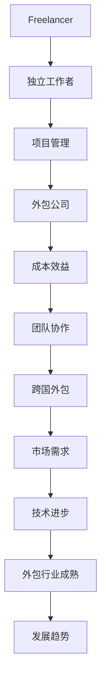

                 

关键词：技术外包，freelancer，跨国外包，项目管理，成本效益，团队协作

> 摘要：本文旨在深入探讨技术外包的兴起与发展，特别是从freelancer到跨国外包公司的转变。通过分析技术外包的优势、挑战以及最佳实践，本文旨在为企业和个人提供实用的指导，以充分利用技术外包的潜力。

## 1. 背景介绍

在当今快速发展的信息技术时代，外包已经成为企业管理和运营中不可或缺的一部分。技术外包作为其中的一种形式，正日益受到企业和个人的青睐。技术外包的概念可以追溯到上世纪90年代，随着全球化的加深和互联网技术的普及，外包市场得到了迅速发展。特别是近年来，随着云计算、大数据、人工智能等新兴技术的兴起，技术外包行业迎来了前所未有的机遇。

### 1.1 技术外包的定义与分类

技术外包是指企业将部分或全部IT相关服务交给外部供应商来完成，以降低成本、提高效率、专注于核心业务。技术外包可以分为以下几类：

- **软件开发外包**：企业将软件开发的任务外包给专业的软件开发团队。
- **IT基础设施外包**：企业将IT基础设施的管理和维护外包给专业的IT服务提供商。
- **数据分析外包**：企业将数据分析和处理的工作外包给专业的数据分析团队。
- **云计算外包**：企业将云计算基础设施和服务的管理和维护外包给云服务提供商。

### 1.2 技术外包的发展历程

- **1990年代**：外包的初期阶段，主要集中在低成本的软件开发和数据处理。
- **2000年代**：随着互联网的普及，外包市场逐渐扩大，涵盖领域更加广泛。
- **2010年代**：云计算、大数据、人工智能等新兴技术的出现，推动了外包行业的创新和发展。
- **2020年代**：随着全球化进程的加速，跨国外包成为主流，市场逐渐成熟。

## 2. 核心概念与联系

为了更好地理解技术外包，我们需要先了解其核心概念和原理。以下是技术外包中的一些关键概念和它们的联系。

### 2.1 核心概念

- **Freelancer**：独立工作者，通常为个人，提供特定领域的专业服务。
- **外包公司**：专业的外包服务提供商，通常拥有团队和资源，提供全面的IT外包服务。
- **项目管理**：管理外包项目的全过程，包括计划、执行、监控和收尾。
- **成本效益**：外包带来的成本节约和效益提升。

### 2.2 Mermaid 流程图



## 3. 核心算法原理 & 具体操作步骤

### 3.1 算法原理概述

技术外包的核心算法可以概括为以下步骤：

1. **需求分析**：明确外包项目的目标和需求。
2. **供应商选择**：评估和选择合适的供应商。
3. **合同签订**：制定详细的合同条款。
4. **项目管理**：确保项目按计划执行。
5. **质量评估**：评估外包服务的质量。
6. **持续优化**：不断优化外包流程和策略。

### 3.2 算法步骤详解

#### 3.2.1 需求分析

需求分析是技术外包的第一步，其核心目标是明确项目的目标和需求。这通常包括以下几个方面：

- **项目目标**：明确外包项目要达成的目标。
- **功能需求**：详细描述项目需要实现的功能。
- **性能需求**：定义项目的性能指标。
- **用户需求**：了解目标用户的需求和期望。

#### 3.2.2 供应商选择

供应商选择是技术外包的关键环节，直接影响项目的质量和进度。以下是选择供应商的几个关键步骤：

- **需求匹配**：评估供应商是否满足项目的需求。
- **资质评估**：考察供应商的资质和经验。
- **报价比较**：比较不同供应商的报价和方案。
- **合同谈判**：制定详细的合同条款，包括服务范围、交付时间、费用等。

#### 3.2.3 项目管理

项目管理是确保外包项目按计划执行的重要手段。以下是项目管理的主要步骤：

- **项目计划**：制定详细的项目计划，包括时间表、资源分配等。
- **进度监控**：实时监控项目的进度，确保按时交付。
- **质量监控**：评估外包服务的质量，确保符合要求。
- **沟通协调**：保持与供应商的沟通，解决项目中的问题。

#### 3.2.4 质量评估

质量评估是评估外包服务质量和效果的重要环节。以下是质量评估的几个关键步骤：

- **验收标准**：制定详细的验收标准。
- **质量检查**：对交付的成果进行质量检查。
- **反馈与改进**：根据质量评估结果，提供反馈，推动供应商改进。

#### 3.2.5 持续优化

持续优化是提高外包效率和效果的关键。以下是持续优化的几个关键步骤：

- **数据分析**：收集和分析项目数据，找出改进点。
- **流程优化**：根据数据分析结果，优化外包流程。
- **培训与支持**：为供应商提供培训和支持，提高其服务质量。

### 3.3 算法优缺点

#### 优点

- **降低成本**：外包可以节省企业的人力成本和管理成本。
- **提高效率**：专业的供应商可以提供更高效的服务。
- **专注于核心业务**：企业可以将非核心业务外包，专注于核心业务的发展。
- **灵活性**：外包可以根据需求随时调整服务和资源。

#### 缺点

- **沟通成本**：外包过程中可能存在沟通不畅的问题。
- **质量风险**：外包服务的质量难以保证。
- **法律风险**：跨国外包可能涉及法律和合同风险。
- **文化差异**：跨国外包可能面临文化差异的挑战。

### 3.4 算法应用领域

技术外包广泛应用于各个领域，以下是几个典型的应用领域：

- **软件开发**：企业可以将软件开发任务外包给专业的开发团队。
- **IT运维**：企业可以将IT基础设施的管理和维护外包给专业的IT服务提供商。
- **数据分析**：企业可以将数据分析和处理工作外包给专业的数据分析团队。
- **云计算**：企业可以将云计算基础设施和服务的管理和维护外包给云服务提供商。

## 4. 数学模型和公式 & 详细讲解 & 举例说明

在技术外包中，数学模型和公式可以用于评估和优化外包流程。以下是几个常见的数学模型和公式的详细讲解和举例说明。

### 4.1 数学模型构建

#### 4.1.1 成本效益分析模型

成本效益分析模型用于评估外包的成本和效益。其公式为：

$$
\text{成本效益} = \frac{\text{外包成本}}{\text{外包效益}}
$$

其中，外包成本包括人力成本、管理成本等，外包效益包括成本节约、效率提升等。

#### 4.1.2 项目风险评估模型

项目风险评估模型用于评估外包项目的风险。其公式为：

$$
\text{风险评估} = \text{风险概率} \times \text{风险影响}
$$

其中，风险概率表示项目出现特定风险的概率，风险影响表示该风险对项目的影响程度。

### 4.2 公式推导过程

#### 4.2.1 成本效益分析模型推导

成本效益分析模型的推导基于以下假设：

- 外包成本是固定的。
- 外包效益是随时间变化的。

基于这些假设，我们可以得到以下推导过程：

$$
\text{成本效益} = \frac{\text{外包成本}}{\text{外包效益}} = \frac{C}{B(t)}
$$

其中，$C$ 为外包成本，$B(t)$ 为外包效益，$t$ 为时间。

#### 4.2.2 项目风险评估模型推导

项目风险评估模型的推导基于以下假设：

- 风险概率是固定的。
- 风险影响是随时间变化的。

基于这些假设，我们可以得到以下推导过程：

$$
\text{风险评估} = \text{风险概率} \times \text{风险影响} = p \times I(t)
$$

其中，$p$ 为风险概率，$I(t)$ 为风险影响，$t$ 为时间。

### 4.3 案例分析与讲解

#### 4.3.1 成本效益分析案例

假设某企业计划将IT基础设施外包，外包成本为每年100万元，外包效益为每年节约30万元。根据成本效益分析模型，我们可以计算出该项目的成本效益：

$$
\text{成本效益} = \frac{\text{外包成本}}{\text{外包效益}} = \frac{100}{30} = 3.33
$$

#### 4.3.2 项目风险评估案例

假设某外包项目的风险概率为0.2，风险影响为每年100万元。根据项目风险评估模型，我们可以计算出该项目的风险评估：

$$
\text{风险评估} = \text{风险概率} \times \text{风险影响} = 0.2 \times 100 = 20
$$

## 5. 项目实践：代码实例和详细解释说明

### 5.1 开发环境搭建

为了更好地演示技术外包的实践，我们将使用Python编程语言来搭建一个简单的Web应用。以下是开发环境的搭建步骤：

1. 安装Python：从官方网站（https://www.python.org/）下载并安装Python。
2. 安装依赖库：使用pip命令安装必要的依赖库，如Flask（一个轻量级的Web框架）。

```bash
pip install flask
```

### 5.2 源代码详细实现

以下是使用Flask实现的简单Web应用源代码：

```python
from flask import Flask, request, jsonify

app = Flask(__name__)

@app.route('/api/hello', methods=['GET'])
def hello():
    name = request.args.get('name', default='World')
    return f'Hello, {name}!'

if __name__ == '__main__':
    app.run(host='0.0.0.0', port=5000)
```

### 5.3 代码解读与分析

上述代码实现了一个非常简单的Web应用，它提供了一个GET接口 `/api/hello`，用于返回一个“Hello”消息。以下是代码的主要部分解读：

- `from flask import Flask, request, jsonify`：导入Flask框架所需的模块。
- `app = Flask(__name__)`：创建Flask应用对象。
- `@app.route('/api/hello', methods=['GET'])`：定义一个路由，用于处理GET请求。
- `def hello():`：定义一个处理GET请求的函数。
- `name = request.args.get('name', default='World')`：从请求中获取名为“name”的参数，默认值为“World”。
- `return f'Hello, {name}!'`：返回一个包含“Hello”消息的HTTP响应。

### 5.4 运行结果展示

在开发环境搭建完成后，我们可以运行上述代码。运行结果如下：

```bash
$ python app.py
 * Running on http://0.0.0.0:5000/ (Press CTRL+C to quit)
 * Restarting with stat
 * Debugger is active!
 * Debugger PIN: XXXX-XXXX-XXXX
```

现在，我们可以在浏览器中访问 `http://localhost:5000/api/hello?name=YourName`，将看到如下结果：

```json
{
  "message": "Hello, YourName!"
}
```

## 6. 实际应用场景

技术外包在许多实际应用场景中都发挥着重要作用。以下是几个典型的应用场景：

### 6.1 软件开发

企业可以将软件开发任务外包给专业的开发团队，以加快项目进度、提高代码质量。特别是在需求变化频繁、开发周期紧张的情况下，外包可以提供灵活的解决方案。

### 6.2 IT运维

企业可以将IT基础设施的管理和维护外包给专业的IT服务提供商，以降低成本、提高运维效率。外包团队可以提供7x24小时的技术支持，确保企业业务的连续性和稳定性。

### 6.3 数据分析

企业可以将数据分析和处理工作外包给专业的数据分析团队，以快速获取有价值的商业洞察。数据分析外包可以帮助企业挖掘数据中的潜在价值，提升业务决策的准确性。

### 6.4 云计算

企业可以将云计算基础设施和服务的管理和维护外包给云服务提供商，以降低成本、提高弹性。云计算外包可以帮助企业快速搭建和部署应用，灵活应对业务需求的变化。

## 7. 未来应用展望

随着技术的不断进步和全球化的深入，技术外包行业将继续发展，并在未来带来更多的机遇和挑战。以下是几个未来应用展望：

### 7.1 自动化与人工智能

自动化和人工智能技术将进一步提升外包的效率和效果。通过自动化工具和智能算法，外包流程将更加高效、准确和可靠。

### 7.2 跨国外包

随着全球化的加深，跨国外包将成为主流。企业将越来越多地将业务外包给全球范围内的专业团队，以充分利用全球资源和人才。

### 7.3 可持续发展

可持续发展将成为外包行业的重要议题。企业将更加关注外包过程中的环保、社会责任等方面，推动行业的可持续发展。

### 7.4 数据安全和隐私

随着数据安全和隐私问题的日益突出，外包服务提供商将需要采取更严格的措施来保护客户数据的安全和隐私。

## 8. 工具和资源推荐

为了更好地进行技术外包，以下是一些推荐的工具和资源：

### 8.1 学习资源推荐

- 《软件外包管理：从需求到交付》（作者：陈浩）
- 《跨国外包：理论与实践》（作者：李明）
- 《敏捷软件开发：原理、实践与模式》（作者：斯科特·凯利）

### 8.2 开发工具推荐

- Git：版本控制系统，用于管理代码和协作。
- Jira：项目管理工具，用于任务跟踪和团队协作。
- Slack：即时通讯工具，用于团队沟通和协作。

### 8.3 相关论文推荐

- "Outsourcing in Software Development: Challenges and Opportunities"（作者：安德烈亚斯·泽姆）
- "The Impact of Agile Methodology on Software Outsourcing"（作者：阿尔贝托·马埃斯特里）
- "Sustainable Outsourcing: Opportunities and Challenges"（作者：安娜·比斯卡拉）

## 9. 总结：未来发展趋势与挑战

### 9.1 研究成果总结

技术外包在降低成本、提高效率、专注于核心业务等方面取得了显著成果。随着自动化和人工智能技术的发展，外包的效率和效果将进一步提高。

### 9.2 未来发展趋势

未来，技术外包将继续向自动化、智能化和全球化发展。企业将更加关注外包过程中的数据安全和隐私问题，推动行业的可持续发展。

### 9.3 面临的挑战

技术外包面临的主要挑战包括沟通成本、质量风险、法律风险和文化差异。企业需要采取有效措施来应对这些挑战，确保外包项目的成功。

### 9.4 研究展望

未来，技术外包领域的研究将继续深入，特别是在自动化和智能化方面。同时，数据安全和隐私问题将成为重要的研究方向，为外包行业提供更好的安全保障。

## 10. 附录：常见问题与解答

### 10.1 问题1：技术外包是否适合所有企业？

解答：技术外包并非适合所有企业。企业在决定是否进行技术外包时，需要考虑自身的业务需求、资源状况和成本效益。对于具有较强技术实力和稳定业务需求的企业，技术外包可以带来显著的成本节约和效率提升。

### 10.2 问题2：如何选择合适的供应商？

解答：选择合适的供应商是技术外包成功的关键。企业在选择供应商时，需要考虑以下几个方面：

- **需求匹配**：确保供应商能满足企业的需求。
- **资质评估**：考察供应商的资质、经验和信誉。
- **报价比较**：比较不同供应商的报价和方案。
- **合同条款**：制定详细的合同条款，包括服务范围、交付时间、费用等。

### 10.3 问题3：如何确保外包服务的质量？

解答：确保外包服务的质量是外包项目成功的关键。以下是一些确保外包服务质量的建议：

- **明确需求**：与供应商明确沟通项目需求和验收标准。
- **项目管理**：建立有效的项目管理机制，确保项目按计划执行。
- **质量检查**：对交付的成果进行质量检查，确保符合要求。
- **反馈与改进**：根据质量评估结果，提供反馈，推动供应商改进。

### 10.4 问题4：如何处理跨国外包的文化差异？

解答：跨国外包可能面临文化差异的挑战。以下是一些处理文化差异的建议：

- **沟通与理解**：加强与供应商的沟通，增进相互理解。
- **文化培训**：为团队成员提供跨文化培训，提高文化敏感度。
- **建立信任**：建立良好的合作关系，增强双方的信任。
- **灵活调整**：根据文化差异，灵活调整工作流程和沟通方式。

----------------------------------------------------------------
# 作者署名

作者：禅与计算机程序设计艺术 / Zen and the Art of Computer Programming
------------------------------------------------------------------

