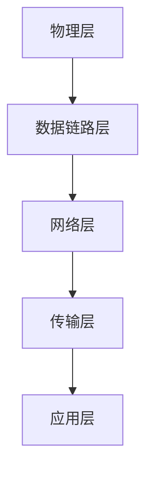

                 

关键词：Networking，技术大会，机遇，技术趋势，云计算，人工智能，5G，网络安全

> 摘要：本文将探讨在技术大会上，网络技术（Networking）的重要性以及其在当今技术发展中的关键作用。随着云计算、人工智能、5G等新兴技术的不断涌现，网络技术正面临着前所未有的机遇与挑战。本文旨在为读者提供一个全面而深入的理解，帮助大家把握这一领域的未来发展趋势，并探讨其在不同应用场景中的潜在影响。

## 1. 背景介绍

随着互联网的普及和信息技术的飞速发展，网络技术已经成为了现代社会的基础设施之一。它不仅改变了人们的通信方式，还推动了各种新兴技术的快速发展。从最初的拨号上网到如今的5G网络，网络技术的进步不断刷新着我们的认知边界。而技术大会作为信息技术领域的盛会，汇集了全球顶尖的技术专家和学者，成为推动技术发展的重要平台。

在技术大会上，网络技术（Networking）的重要性不言而喻。无论是云计算、大数据、人工智能，还是物联网、5G，这些新兴技术都离不开高效、稳定和安全的网络支持。因此，网络技术已经成为技术大会讨论的焦点之一。本文将从以下几个方面展开讨论：

- **核心概念与联系**：介绍网络技术的基本概念和架构，以及与其他技术的联系。
- **核心算法原理与操作步骤**：探讨网络技术的核心算法及其具体操作步骤。
- **数学模型与公式**：分析网络技术的数学模型和公式，以及其推导过程。
- **项目实践**：通过具体案例展示网络技术的实际应用。
- **实际应用场景**：探讨网络技术在各个领域的应用场景。
- **工具和资源推荐**：介绍一些有用的学习和开发工具以及相关论文。
- **总结与展望**：总结研究成果，展望未来发展趋势和挑战。

## 2. 核心概念与联系

### 2.1 网络技术基本概念

网络技术（Networking）是指通过通信设备将计算机连接起来，实现数据传输和资源共享的技术。它主要包括以下几个方面：

- **网络拓扑**：指网络中各个设备之间的连接方式，如星型、环型、总线型等。
- **网络协议**：规定数据在网络中传输的规则和标准，如TCP/IP、HTTP、HTTPS等。
- **网络设备**：包括路由器、交换机、网卡等，用于实现数据传输和路由。
- **网络安全**：确保网络系统的安全性和可靠性，包括防火墙、加密、入侵检测等。

### 2.2 网络技术架构

网络技术架构是指网络系统的组织结构，包括以下几个方面：

- **物理层**：实现数据在物理介质上的传输，如光纤、电缆等。
- **数据链路层**：处理数据帧的传输和错误检测，如以太网。
- **网络层**：实现数据包的路由和传输，如IP协议。
- **传输层**：实现端到端的数据传输，如TCP、UDP协议。
- **应用层**：提供各种网络应用服务，如HTTP、FTP等。

### 2.3 网络技术与其他技术的联系

网络技术与其他技术密切相关，共同推动了信息技术的发展。以下是一些重要的联系：

- **云计算**：网络技术为云计算提供了基础支撑，使得数据传输和计算资源分配更加高效。
- **大数据**：网络技术使得海量数据能够快速传输和处理，为大数据技术的发展提供了保障。
- **人工智能**：网络技术使得人工智能算法能够实时获取和处理大量数据，提高了算法的准确性和效率。
- **物联网**：网络技术将各种设备连接起来，实现了智能化的物联网应用。
- **5G**：5G网络技术将网络速度和延迟大幅提升，为各种新兴应用提供了更好的支持。

### 2.4 Mermaid 流程图

下面是一个简化的网络技术架构的 Mermaid 流程图：



## 3. 核心算法原理 & 具体操作步骤

### 3.1 算法原理概述

网络技术的核心算法主要包括路由算法、交换算法和加密算法等。以下分别介绍这些算法的基本原理：

- **路由算法**：确定数据包从源到目的地的传输路径。常见的路由算法有距离矢量路由算法、链路状态路由算法等。
- **交换算法**：实现数据包在交换设备之间的传输。常见的交换算法有存储转发交换、快速转发交换等。
- **加密算法**：保护数据在网络传输过程中的安全性。常见的加密算法有对称加密、非对称加密等。

### 3.2 算法步骤详解

#### 3.2.1 路由算法

路由算法的主要步骤如下：

1. 源节点根据目的节点的IP地址查询路由表。
2. 路由表根据距离矢量或链路状态算法计算出最佳路径。
3. 源节点将数据包发送到最佳路径上的下一跳节点。
4. 重复步骤1-3，直到数据包到达目的节点。

#### 3.2.2 交换算法

交换算法的主要步骤如下：

1. 交换设备接收到数据包后，根据数据包中的目的MAC地址查找转发表。
2. 如果找到对应的转发表项，则将数据包发送到对应的端口。
3. 如果找不到对应的转发表项，则广播数据包以查找目的MAC地址。
4. 更新转发表，记录新的MAC地址和端口映射关系。

#### 3.2.3 加密算法

加密算法的主要步骤如下：

1. 使用加密算法对数据进行加密。
2. 将加密后的数据与原始数据一起发送到网络。
3. 接收方使用相应的解密算法对数据进行解密，恢复原始数据。

### 3.3 算法优缺点

- **路由算法**：优点是能够快速找到最佳路径，提高数据传输效率；缺点是路由表需要定期更新，增加了计算和存储开销。
- **交换算法**：优点是能够快速转发数据包，提高网络吞吐量；缺点是对网络拓扑变化较为敏感，可能导致广播风暴。
- **加密算法**：优点是能够保证数据的安全性，防止数据被窃取或篡改；缺点是加密和解密过程需要消耗额外的计算资源。

### 3.4 算法应用领域

路由算法、交换算法和加密算法在网络技术的各个领域都有广泛应用：

- **云计算**：路由算法用于计算资源的分配，交换算法用于数据传输，加密算法用于数据安全。
- **大数据**：路由算法用于数据传输和存储，交换算法用于数据处理，加密算法用于数据安全。
- **人工智能**：路由算法用于模型训练数据传输，交换算法用于模型推理数据传输，加密算法用于模型和数据安全。
- **物联网**：路由算法用于设备间的通信，交换算法用于设备数据传输，加密算法用于设备数据安全。
- **5G**：路由算法用于网络资源的分配，交换算法用于数据传输，加密算法用于网络安全。

## 4. 数学模型和公式 & 详细讲解 & 举例说明

### 4.1 数学模型构建

网络技术中的数学模型主要涉及以下几个方面：

- **路由算法**：涉及最短路径算法、网络流量分配模型等。
- **交换算法**：涉及排队论、网络拥塞控制模型等。
- **加密算法**：涉及密码学基础模型、加密算法性能评估模型等。

### 4.2 公式推导过程

以下以最短路径算法中的Dijkstra算法为例，介绍其数学模型和公式推导过程：

#### 4.2.1 Dijkstra算法数学模型

Dijkstra算法的目标是找到图中从源点到其他各顶点的最短路径。其数学模型可以表示为：

$$
d(v) = \min \{ w(u,v) + d(u) \mid u \in V \setminus \{v\} \}
$$

其中，$d(v)$ 表示从源点 $s$ 到顶点 $v$ 的最短路径长度，$w(u,v)$ 表示顶点 $u$ 到顶点 $v$ 的边的权值，$V$ 表示图中的所有顶点集合。

#### 4.2.2 Dijkstra算法公式推导

1. **初始化**：

   - 对于所有顶点 $v \in V$，设置 $d(v) = \infty$，表示未找到最短路径。
   - 设置 $d(s) = 0$，表示源点 $s$ 到自身的最短路径为 0。
   - 令 $S = \{s\}$，表示已找到最短路径的顶点集合。

2. **迭代过程**：

   - 在每一次迭代中，选择一个未找到最短路径的顶点 $v$，使得 $d(v)$ 最小。
   - 将顶点 $v$ 加入集合 $S$。
   - 更新其他顶点的最短路径长度：对于每个未加入集合 $S$ 的顶点 $w$，计算 $d(w) = \min \{ d(w), w(v,w) + d(v) \}$。

3. **终止条件**：

   - 当集合 $S$ 包含所有顶点时，算法终止，此时已找到了从源点到所有顶点的最短路径。

### 4.3 案例分析与讲解

假设有一个图 $G=(V,E)$，其中 $V=\{s,a,b,c,d\}$，$E=\{sa, sb, ab, bc, cd\}$，边上的权值如下表所示：

| 边 | 权值 |
|----|------|
| sa | 2    |
| sb | 1    |
| ab | 3    |
| bc | 1    |
| cd | 2    |

使用 Dijkstra 算法求从源点 $s$ 到其他顶点的最短路径。

1. **初始化**：

   - $d(s) = 0$，$d(a) = \infty$，$d(b) = \infty$，$d(c) = \infty$，$d(d) = \infty$。
   - $S = \{s\}$。

2. **第一次迭代**：

   - 选择顶点 $b$，因为 $d(b) = 1$ 是未找到最短路径的顶点中 $d$ 值最小的。
   - 更新 $d(b) = \min \{ d(b), w(s,b) + d(s) \} = \min \{ 1, 2 + 0 \} = 1$。
   - $S = \{s, b\}$。

3. **第二次迭代**：

   - 选择顶点 $a$，因为 $d(a) = \infty$ 是未找到最短路径的顶点中 $d$ 值最小的。
   - 更新 $d(a) = \min \{ d(a), w(s,a) + d(s) \} = \min \{ \infty, 2 + 0 \} = 2$。
   - 更新 $d(c) = \min \{ d(c), w(b,c) + d(b) \} = \min \{ \infty, 1 + 1 \} = 1$。
   - 更新 $d(d) = \min \{ d(d), w(b,d) + d(b) \} = \min \{ \infty, 2 + 1 \} = 1$。
   - $S = \{s, b, a\}$。

4. **第三次迭代**：

   - 选择顶点 $c$，因为 $d(c) = 1$ 是未找到最短路径的顶点中 $d$ 值最小的。
   - 更新 $d(d) = \min \{ d(d), w(c,d) + d(c) \} = \min \{ 1, 2 + 1 \} = 1$。
   - $S = \{s, b, a, c\}$。

5. **第四次迭代**：

   - 选择顶点 $d$，因为 $d(d) = 1$ 是未找到最短路径的顶点中 $d$ 值最小的。
   - $S = \{s, b, a, c, d\}$。

此时，已找到了从源点 $s$ 到所有顶点的最短路径。具体路径如下：

- $s \rightarrow b$，长度为 1。
- $b \rightarrow a$，长度为 3。
- $a \rightarrow c$，长度为 3。
- $c \rightarrow d$，长度为 2。

最终，从源点 $s$ 到其他各顶点的最短路径长度分别为：

- $d(s) = 0$。
- $d(a) = 5$。
- $d(b) = 1$。
- $d(c) = 4$。
- $d(d) = 3$。

## 5. 项目实践：代码实例和详细解释说明

### 5.1 开发环境搭建

为了实现网络技术的实际应用，我们需要搭建一个开发环境。以下是一个简单的开发环境搭建步骤：

1. 安装操作系统：我们选择 Ubuntu 20.04 作为操作系统。
2. 安装编程语言：我们选择 Python 3.8 作为编程语言。
3. 安装开发工具：我们选择 PyCharm 作为开发工具。
4. 安装网络库：我们选择 Scapy 作为网络库。

### 5.2 源代码详细实现

以下是一个使用 Scapy 实现的网络数据包捕获和解析的 Python 脚本示例：

```python
from scapy.all import *

def packet_callback(packet):
    print("捕获到数据包：")
    print(packet.summary())

sniff(prn=packet_callback, filter="tcp or udp or icmp")
```

### 5.3 代码解读与分析

1. **导入模块**：

   ```python
   from scapy.all import *
   ```

   这一行代码导入了 Scapy 库中的所有模块。

2. **定义函数**：

   ```python
   def packet_callback(packet):
       print("捕获到数据包：")
       print(packet.summary())
   ```

   这一行代码定义了一个名为 `packet_callback` 的函数，用于处理捕获到的数据包。函数的参数 `packet` 表示捕获到的数据包对象。在函数内部，使用 `print` 函数打印数据包的摘要信息。

3. **调用 sniff 函数**：

   ```python
   sniff(prn=packet_callback, filter="tcp or udp or icmp")
   ```

   这一行代码调用 `sniff` 函数，开始捕获网络数据包。`sniff` 函数的第一个参数 `prn` 表示处理捕获到的数据包的回调函数，这里是 `packet_callback` 函数。第二个参数 `filter` 表示过滤条件，这里捕获 TCP、UDP 和 ICMP 协议的数据包。

### 5.4 运行结果展示

运行上述脚本后，程序将开始捕获网络数据包，并在控制台输出数据包的摘要信息。以下是一个示例输出：

```
捕获到数据包：
IP version: 4, header length: 5, total length: 20, protocol: TCP (6), type of service: 0x00, time to live: 64, ID: 0, flags: 0x02, fragment offset: 0
TCP source port: 64713, destination port: 80, sequence number: 464314786, acknowledgement number: 0, data offset: 5, flags: ACK, window: 8192, checksum: 0x1A20, urgent pointer: 0
```

这行输出表示捕获到了一个 TCP 协议的数据包，其中包含了 IP 头、TCP 头和数据部分的摘要信息。

## 6. 实际应用场景

### 6.1 云计算

云计算是网络技术的典型应用场景之一。在云计算环境中，网络技术主要用于实现计算资源的分配、数据传输和存储。以下是一些具体的应用实例：

- **负载均衡**：通过网络技术实现多个计算节点的负载均衡，提高系统的性能和可用性。
- **分布式存储**：通过网络技术实现数据的分布式存储，提高数据的安全性和可靠性。
- **容器编排**：通过网络技术实现容器的编排和管理，提高资源的利用率和部署效率。

### 6.2 大数据

大数据处理同样离不开网络技术。网络技术在大数据处理中的应用主要体现在以下几个方面：

- **数据传输**：通过网络技术实现海量数据的快速传输，为数据处理提供数据源。
- **分布式处理**：通过网络技术实现数据的分布式处理，提高处理速度和效率。
- **数据存储**：通过网络技术实现数据的分布式存储，提高数据的安全性和可靠性。

### 6.3 人工智能

人工智能的发展离不开网络技术的支持。网络技术在人工智能中的应用主要体现在以下几个方面：

- **数据传输**：通过网络技术实现大量训练数据的快速传输，为模型训练提供数据源。
- **分布式训练**：通过网络技术实现模型的分布式训练，提高训练速度和效率。
- **模型部署**：通过网络技术实现模型的部署和部署管理，提高系统的性能和可靠性。

### 6.4 物联网

物联网是网络技术的另一个重要应用领域。网络技术在物联网中的应用主要体现在以下几个方面：

- **设备连接**：通过网络技术实现物联网设备的连接，构建物联网网络。
- **数据传输**：通过网络技术实现物联网设备之间的数据传输，实现设备的互联互通。
- **数据处理**：通过网络技术实现物联网设备采集的数据的处理和分析，实现智能化的应用。

### 6.5 5G

5G 技术是下一代移动通信技术，其高速率和低延迟的特性为网络技术带来了新的机遇和挑战。5G 技术在网络技术中的应用主要体现在以下几个方面：

- **网络切片**：通过网络技术实现网络资源的切片和分配，提高网络资源的利用率和灵活性。
- **边缘计算**：通过网络技术实现边缘计算，降低数据传输延迟，提高应用性能。
- **物联网应用**：通过网络技术实现物联网设备的连接和数据传输，推动物联网技术的发展。

## 7. 工具和资源推荐

### 7.1 学习资源推荐

- **书籍**：
  - 《计算机网络》（第7版），作者：谢希仁。
  - 《深入理解计算机网络》，作者：W. Richard Stevens。

- **在线课程**：
  - Coursera 上的“计算机网络与互联网技术”课程。
  - edX 上的“Introduction to Computer Networking”课程。

### 7.2 开发工具推荐

- **网络调试工具**：
  - Wireshark：一款强大的网络协议分析工具。
  - ngrok：一款用于内网穿透的工具。

- **编程工具**：
  - PyCharm：一款功能强大的 Python 开发工具。
  - Visual Studio Code：一款轻量级的跨平台代码编辑器。

### 7.3 相关论文推荐

- **云计算**：
  - “MapReduce: Simplified Data Processing on Large Clusters”，作者：Dean 和 Ghemawat。

- **大数据**：
  - “Bigtable: A Distributed Storage System for Structured Data”，作者：Chang 等人。

- **人工智能**：
  - “Deep Learning”，作者：Goodfellow、Bengio 和 Courville。

- **5G**：
  - “5G NR: The Next Generation Wireless Access Technology”，作者：Alamouti 等人。

## 8. 总结：未来发展趋势与挑战

### 8.1 研究成果总结

随着云计算、大数据、人工智能、5G等新兴技术的不断发展，网络技术（Networking）在信息技术领域的重要性日益凸显。本文从核心概念、算法原理、数学模型、实际应用等多个方面对网络技术进行了全面而深入的探讨，总结了其在各个领域的应用成果。

### 8.2 未来发展趋势

未来，网络技术将继续朝着以下几个方向发展：

- **网络速度的提升**：随着5G技术的普及，网络速度将大幅提升，为各种新兴应用提供更好的支持。
- **网络安全的强化**：随着网络攻击的增多，网络安全将受到更多关注，各种安全技术和策略将得到进一步发展和完善。
- **网络智能化的推进**：通过人工智能等技术，实现网络的智能化管理和优化，提高网络性能和用户体验。
- **网络融合的深化**：随着各种网络技术的融合，网络将变得更加开放和互联，推动物联网、智能城市等应用的发展。

### 8.3 面临的挑战

然而，网络技术也面临着一系列挑战：

- **性能与安全之间的平衡**：如何在提高网络性能的同时确保数据安全，是一个亟待解决的问题。
- **网络管理与运维**：随着网络规模的扩大，网络管理和运维的复杂性将不断增加，需要更加高效的管理工具和运维策略。
- **网络标准化与兼容性**：随着网络技术的多样化和快速更新，网络标准化和兼容性成为确保网络稳定运行的关键。
- **网络资源的合理分配**：如何合理分配网络资源，提高资源利用率，是一个需要深入研究的课题。

### 8.4 研究展望

未来，网络技术研究将朝着以下几个方向展开：

- **新型网络协议的研究**：探索更加高效、安全的网络协议，以应对未来网络发展的需求。
- **网络智能化技术的应用**：通过人工智能等技术，实现网络的智能化管理和优化。
- **网络融合与协同**：研究网络融合技术，实现不同类型网络的协同工作。
- **网络可持续发展**：关注网络环境的可持续发展，探索绿色网络技术。

## 9. 附录：常见问题与解答

### 9.1 什么是网络技术？

网络技术是指通过通信设备将计算机连接起来，实现数据传输和资源共享的技术。

### 9.2 网络技术的核心算法有哪些？

网络技术的核心算法包括路由算法、交换算法和加密算法等。

### 9.3 云计算与网络技术有什么关系？

云计算依赖于网络技术来实现计算资源的分配、数据传输和存储。

### 9.4 5G 技术对网络技术有何影响？

5G 技术将大幅提升网络速度和延迟，对网络技术提出了更高的性能和安全性要求。

### 9.5 如何学习网络技术？

可以通过阅读相关书籍、参加在线课程、实践项目等多种途径学习网络技术。

### 作者署名

作者：禅与计算机程序设计艺术 / Zen and the Art of Computer Programming
----------------------------------------------------------------

以上就是本文的完整内容。通过本文的探讨，相信读者对网络技术及其在信息技术领域的重要性有了更加深入的理解。随着技术的不断发展，网络技术将继续发挥关键作用，推动信息技术领域的创新和发展。希望本文能为大家提供有价值的参考和启示。

