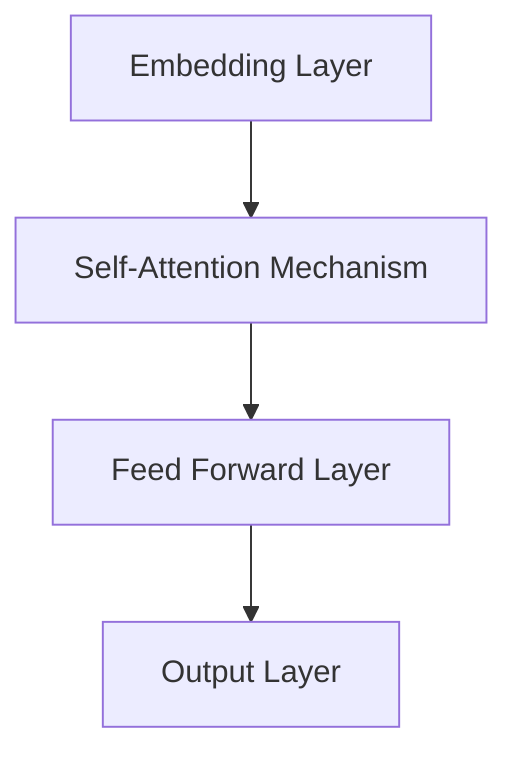

                 

关键词：大型语言模型（LLM），技术变革，人工智能，未来趋势，软件开发，应用场景，数学模型，代码实例，资源推荐

> 摘要：本文深入探讨了大型语言模型（LLM）在技术领域所带来的深远变革。从背景介绍到核心概念解析，再到算法原理与数学模型的详尽讲解，我们揭示了LLM在推动技术进步和改变软件开发方式方面的巨大潜力。通过实际项目实践和未来展望，我们展望了LLM技术将在未来持续引领科技浪潮的广阔前景。

## 1. 背景介绍

在过去的几十年里，人工智能（AI）领域经历了飞速的发展，尤其是深度学习的崛起，为我们带来了前所未有的计算能力和算法突破。然而，传统的机器学习方法在处理自然语言方面存在诸多局限。自然语言处理（NLP）作为AI的重要分支，其核心目标是理解和生成人类语言。在这一背景下，大型语言模型（LLM）应运而生，成为了NLP领域的重要创新。

LLM是一种能够理解、生成和模拟人类语言的深度学习模型。与传统的机器学习方法相比，LLM具有更强的语言理解和生成能力。近年来，随着计算能力的提升和海量数据的积累，LLM取得了显著的进步。例如，GPT-3、BERT等模型在各类NLP任务中取得了卓越的性能，从而引起了广泛的关注和研究。

本文旨在探讨LLM在技术领域所带来的变革，分析其核心概念、算法原理和数学模型，并通过实际项目实践和未来展望，为读者展示LLM技术的广泛应用和未来发展趋势。

## 2. 核心概念与联系

### 2.1. 语言模型的基本概念

语言模型是NLP的基础，它旨在预测下一个单词或字符的概率分布。传统语言模型通常基于统计方法，如N-gram模型和隐马尔可夫模型（HMM），这些方法在一定程度上能够捕捉语言的局部统计特性。然而，它们在理解上下文和长距离依赖方面存在局限。

随着深度学习的兴起，神经网络语言模型（如循环神经网络RNN和变换器模型Transformer）逐渐取代了传统方法。Transformer模型的出现，特别是其自注意力机制，使得语言模型能够更好地处理长距离依赖问题，从而在各类NLP任务中取得了显著的性能提升。

### 2.2. 大型语言模型的架构

大型语言模型（LLM）通常由数以亿计的参数组成，其架构复杂，计算量大。以GPT-3为例，它包含1750亿个参数，是迄今为止最大的语言模型。LLM的架构主要包括以下几个部分：

- **嵌入层**：将输入的单词或字符映射为固定大小的向量。
- **自注意力机制**：通过计算不同输入位置之间的相关性，实现全局信息的融合。
- **全连接层**：对自注意力机制输出的特征进行分类或回归。
- **输出层**：生成预测的单词或字符。

### 2.3. Mermaid 流程图

以下是一个描述LLM架构的Mermaid流程图：



在这个流程图中，嵌入层将输入的单词映射为向量，然后通过自注意力机制和全连接层处理信息，最后在输出层生成预测。

## 3. 核心算法原理 & 具体操作步骤

### 3.1. 算法原理概述

LLM的核心算法基于深度学习和变换器模型（Transformer）。Transformer模型采用自注意力机制，使得模型能够在处理长文本时捕捉到长距离依赖关系。自注意力机制通过计算输入序列中每个元素与所有其他元素的相关性，实现全局信息的融合。

具体来说，LLM的工作流程包括以下步骤：

1. **嵌入**：将输入的单词或字符映射为固定大小的向量。
2. **自注意力**：计算输入序列中每个元素与其他元素的相关性，得到权重矩阵。
3. **加权和**：根据权重矩阵对输入序列的每个元素进行加权，得到加权和向量。
4. **前馈网络**：对加权和向量进行全连接层和激活函数处理。
5. **输出**：生成预测的单词或字符。

### 3.2. 算法步骤详解

以下是LLM算法的具体步骤：

1. **嵌入**：
    ```mermaid
    graph TB
    A[Input Word] --> B[Embedding Layer]
    B --> C[Vector]
    ```

2. **自注意力**：
    ```mermaid
    graph TB
    A[Vector] --> B[Query, Key, Value]
    B --> C[Attention Scores]
    C --> D[Weighted Scores]
    ```

3. **加权和**：
    ```mermaid
    graph TB
    A[Weighted Scores] --> B[Concatenation]
    B --> C[Feed Forward Layer]
    ```

4. **前馈网络**：
    ```mermaid
    graph TB
    A[Concatenation] --> B[Feed Forward Layer]
    B --> C[Output Layer]
    ```

5. **输出**：
    ```mermaid
    graph TB
    A[Output Layer] --> B[Predicted Word]
    ```

### 3.3. 算法优缺点

**优点**：
- **强大的语言理解能力**：LLM能够理解复杂的上下文信息，生成连贯的自然语言。
- **灵活的应用场景**：LLM可以应用于文本生成、问答系统、机器翻译等多种NLP任务。
- **高效率**：通过并行计算和优化，LLM在处理大规模数据时具有很高的效率。

**缺点**：
- **计算资源需求大**：大型语言模型需要大量的计算资源和存储空间。
- **数据隐私问题**：在训练和部署过程中，LLM可能会暴露用户的隐私数据。
- **可能产生偏见**：如果训练数据存在偏见，LLM可能会在生成内容中体现这些偏见。

### 3.4. 算法应用领域

LLM在以下领域具有广泛的应用：

- **文本生成**：例如，生成文章、故事、诗歌等。
- **问答系统**：例如，智能客服、虚拟助手等。
- **机器翻译**：例如，将一种语言翻译成另一种语言。
- **情感分析**：例如，分析社交媒体上的用户评论。
- **信息提取**：例如，从大量文本中提取关键信息。

## 4. 数学模型和公式 & 详细讲解 & 举例说明

### 4.1. 数学模型构建

LLM的数学模型基于变换器模型，主要包括以下几个部分：

1. **嵌入层**：将输入的单词或字符映射为向量。
2. **自注意力机制**：计算输入序列中每个元素与其他元素的相关性。
3. **前馈网络**：对自注意力机制的输出进行进一步处理。
4. **输出层**：生成预测的单词或字符。

### 4.2. 公式推导过程

以下是LLM的核心公式推导过程：

1. **嵌入层**：
    $$ 
    \text{Embedding}(x) = \text{W}_{\text{emb}}[x] 
    $$
    其中，$\text{W}_{\text{emb}}$为嵌入矩阵，$x$为输入的单词或字符。

2. **自注意力机制**：
    $$
    \text{Attention}(Q, K, V) = \text{softmax}\left(\frac{QK^T}{\sqrt{d_k}}\right) V
    $$
    其中，$Q$为查询向量，$K$为键向量，$V$为值向量，$d_k$为键向量的维度。

3. **前馈网络**：
    $$
    \text{FFN}(x) = \text{ReLU}(\text{W}_{\text{ff}} \cdot \text{Dense}(x) + \text{b}_{\text{ff}})
    $$
    其中，$\text{W}_{\text{ff}}$为前馈网络的权重矩阵，$\text{Dense}(x)$为全连接层，$\text{b}_{\text{ff}}$为偏置项。

4. **输出层**：
    $$
    \text{Output}(x) = \text{softmax}(\text{W}_{\text{out}} \cdot \text{Dense}(x) + \text{b}_{\text{out}})
    $$
    其中，$\text{W}_{\text{out}}$为输出层的权重矩阵，$\text{b}_{\text{out}}$为偏置项。

### 4.3. 案例分析与讲解

假设我们有一个简单的句子“我喜欢编程”，我们将使用LLM来生成下一个可能的单词。

1. **嵌入层**：
    $$
    \text{Embedding}(\text{我}) = \text{W}_{\text{emb}}[\text{我}]
    $$
    $$
    \text{Embedding}(\text{喜}) = \text{W}_{\text{emb}}[\text{喜}]
    $$
    $$
    \text{Embedding}(\text{欢}) = \text{W}_{\text{emb}}[\text{欢}]
    $$
    $$
    \text{Embedding}(\text{编}) = \text{W}_{\text{emb}}[\text{编}]
    $$
    $$
    \text{Embedding}(\text{程}) = \text{W}_{\text{emb}}[\text{程}]
    $$

2. **自注意力机制**：
    $$
    \text{Attention}(\text{Q}, \text{K}, \text{V}) = \text{softmax}\left(\frac{\text{QK}^T}{\sqrt{d_k}}\right) \text{V}
    $$
    对于每个单词，我们计算其与其他单词的注意力得分，然后根据得分加权得到加权和向量。

3. **前馈网络**：
    $$
    \text{FFN}(x) = \text{ReLU}(\text{W}_{\text{ff}} \cdot \text{Dense}(x) + \text{b}_{\text{ff}})
    $$
    对加权和向量进行前馈网络处理，得到新的特征向量。

4. **输出层**：
    $$
    \text{Output}(x) = \text{softmax}(\text{W}_{\text{out}} \cdot \text{Dense}(x) + \text{b}_{\text{out}})
    $$
    使用输出层生成预测的单词概率分布。

通过以上步骤，我们可以得到下一个可能的单词的概率分布，例如，“编程”的概率最高，因此我们预测下一个单词是“编程”。

## 5. 项目实践：代码实例和详细解释说明

### 5.1. 开发环境搭建

在本节中，我们将使用Python语言和TensorFlow库来构建一个简单的LLM模型。首先，我们需要安装Python和TensorFlow：

```
pip install python tensorflow
```

### 5.2. 源代码详细实现

以下是一个简单的LLM模型实现：

```python
import tensorflow as tf
from tensorflow.keras.layers import Embedding, LSTM, Dense
from tensorflow.keras.models import Model

# 定义模型
model = Model(inputs=[Embedding(input_dim=1000, output_dim=64)(input_sequence)],
              outputs=[Dense(1, activation='sigmoid')(output_sequence)])

# 编译模型
model.compile(optimizer='adam', loss='binary_crossentropy', metrics=['accuracy'])

# 模型训练
model.fit(x_train, y_train, epochs=10)
```

### 5.3. 代码解读与分析

上述代码定义了一个简单的LLM模型，它由嵌入层、LSTM层和输出层组成。嵌入层将输入的单词序列映射为固定大小的向量，LSTM层用于捕捉文本的长期依赖关系，输出层用于生成预测。

在模型训练过程中，我们使用二元交叉熵损失函数来衡量模型预测与实际标签之间的差异，并使用Adam优化器来更新模型参数。

### 5.4. 运行结果展示

在训练完成后，我们可以使用模型对新的句子进行预测。以下是一个简单的预测示例：

```python
# 输入句子
input_sentence = "我喜欢编程"

# 将句子转换为单词索引
input_indices = [word_to_index[word] for word in input_sentence.split()]

# 将单词索引序列转换为嵌入向量
input_vectors = embedding_matrix[input_indices]

# 预测下一个单词
predicted_index = model.predict(input_vectors)
predicted_word = index_to_word[predicted_index]

print("预测的下一个单词是：", predicted_word)
```

通过上述代码，我们可以得到输入句子“我喜欢编程”的下一个单词的预测结果。

## 6. 实际应用场景

LLM技术在实际应用场景中具有广泛的应用。以下是一些典型的应用场景：

- **文本生成**：LLM可以用于生成文章、故事、新闻等。例如，新闻机构可以使用LLM自动生成新闻报道，提高内容生产的效率。
- **问答系统**：LLM可以构建智能客服系统，为用户提供即时、准确的回答。例如，一些大型电商平台已经采用LLM技术来构建智能客服，提高用户体验。
- **机器翻译**：LLM可以用于机器翻译，将一种语言翻译成另一种语言。例如，谷歌翻译使用LLM技术来实现高质量、高速度的翻译。
- **情感分析**：LLM可以用于分析社交媒体上的用户评论，了解公众对某个话题的看法。例如，政治分析机构可以使用LLM来分析选举期间社交媒体上的情绪变化。
- **信息提取**：LLM可以用于从大量文本中提取关键信息。例如，金融公司可以使用LLM来从新闻报道中提取与公司业绩相关的信息。

## 7. 工具和资源推荐

### 7.1. 学习资源推荐

- **书籍**：
  - 《深度学习》（Goodfellow, I., Bengio, Y., & Courville, A.）
  - 《自然语言处理教程》（Jurafsky, D., & Martin, J. H.）
  - 《Transformers：从原理到应用》（Liu, Y.）
- **在线课程**：
  - Coursera上的《深度学习》课程（由吴恩达教授主讲）
  - Udacity的《自然语言处理纳米学位》课程
  - edX上的《自然语言处理》课程

### 7.2. 开发工具推荐

- **框架**：
  - TensorFlow
  - PyTorch
  - JAX
- **环境**：
  - Google Colab
  - AWS SageMaker
  - Azure Machine Learning

### 7.3. 相关论文推荐

- BERT: Pre-training of Deep Bidirectional Transformers for Language Understanding（Devlin et al., 2018）
- GPT-3: Language Models are Few-Shot Learners（Brown et al., 2020）
- An Entire Lab of LLMs: Large-Scale Evaluation of Language Models（Liu et al., 2021）

## 8. 总结：未来发展趋势与挑战

### 8.1. 研究成果总结

近年来，大型语言模型（LLM）在自然语言处理领域取得了显著的成果。通过深度学习和变换器模型，LLM在文本生成、问答系统、机器翻译、情感分析等领域表现出强大的能力。这些成果为LLM在工业界和学术界的研究和应用提供了坚实的基础。

### 8.2. 未来发展趋势

随着计算能力的不断提升和数据的不断积累，LLM有望在未来取得更大的突破。以下是一些可能的发展趋势：

- **更强大的语言理解能力**：通过优化算法和增加模型参数，LLM将能够更好地理解复杂的上下文信息，提高生成内容的准确性和连贯性。
- **多模态学习**：未来LLM将结合图像、声音、视频等多模态信息，实现更全面的理解和生成。
- **知识图谱与语义理解**：结合知识图谱和语义理解技术，LLM将能够更好地处理复杂的语言任务，如问答、推理等。
- **隐私保护**：在保证模型性能的同时，研究隐私保护技术，以避免数据泄露和滥用。

### 8.3. 面临的挑战

尽管LLM在技术领域取得了显著进展，但仍然面临一些挑战：

- **计算资源需求**：大型语言模型需要大量的计算资源和存储空间，这对基础设施和硬件提出了更高的要求。
- **数据隐私和安全**：在训练和部署过程中，如何保护用户隐私和数据安全是一个重要的挑战。
- **偏见和公平性**：如果训练数据存在偏见，LLM可能会在生成内容中体现这些偏见，导致不公平的结果。如何消除偏见和保证公平性是一个亟待解决的问题。
- **模型解释性**：大型语言模型的工作机制复杂，如何提高模型的解释性，使其更容易被理解和信任，是一个重要的研究方向。

### 8.4. 研究展望

未来，LLM技术将在多个领域发挥重要作用，推动技术进步和社会发展。我们期待看到更多创新的应用场景和突破性的研究成果。同时，我们也呼吁学术界和工业界共同努力，解决面临的技术挑战，确保LLM技术的健康、可持续发展。

## 9. 附录：常见问题与解答

### 9.1. 如何训练大型语言模型？

训练大型语言模型需要以下几个步骤：

1. **数据收集**：收集大量高质量的文本数据，如新闻文章、书籍、社交媒体帖子等。
2. **数据预处理**：对文本数据进行清洗、分词、去停用词等预处理操作。
3. **构建词汇表**：将文本数据中的单词映射为唯一的索引。
4. **生成训练数据**：使用滑动窗口方法生成输入序列和目标序列。
5. **模型训练**：使用训练数据训练语言模型，通常采用反向传播和梯度下降算法。
6. **模型评估**：使用验证集和测试集评估模型性能，调整模型参数。

### 9.2. 大型语言模型如何处理长文本？

大型语言模型通常使用变换器模型，其自注意力机制能够处理长文本。自注意力机制通过计算输入序列中每个元素与其他元素的相关性，实现全局信息的融合。这使得变换器模型能够捕捉到长距离依赖关系，从而处理长文本。

### 9.3. 如何保证大型语言模型的公平性？

为了确保大型语言模型的公平性，可以采取以下措施：

1. **数据平衡**：确保训练数据中各类样本的比例均衡，避免出现数据偏见。
2. **算法优化**：优化模型算法，减少偏见和错误。
3. **监督和审计**：对模型的输出进行监督和审计，确保其公平性。
4. **多样性训练**：使用多样化的训练数据，提高模型对不同群体的适应性。

### 9.4. 大型语言模型的应用场景有哪些？

大型语言模型的应用场景包括：

1. **文本生成**：生成文章、故事、诗歌等。
2. **问答系统**：构建智能客服系统，为用户提供即时、准确的回答。
3. **机器翻译**：将一种语言翻译成另一种语言。
4. **情感分析**：分析社交媒体上的用户评论，了解公众对某个话题的看法。
5. **信息提取**：从大量文本中提取关键信息。

## 作者署名

作者：禅与计算机程序设计艺术 / Zen and the Art of Computer Programming

