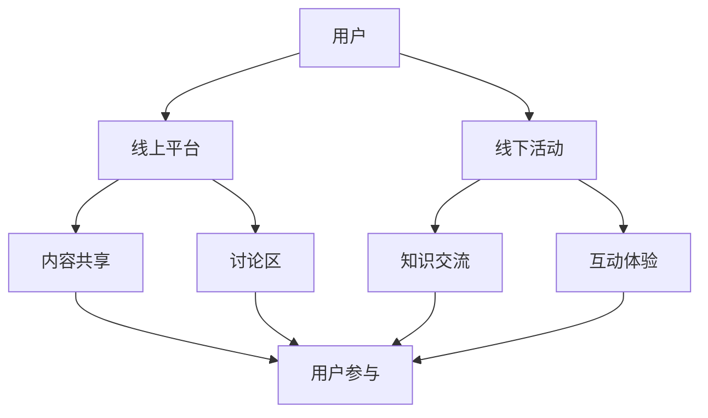

                 

关键词：技术社区、运营、线下活动、生态系统、用户参与、社区管理、互动平台、知识共享、增长策略。

> 摘要：本文旨在探讨技术社区运营的转型过程，从线上延伸到线下，构建一个完整的生态系统。通过分析核心概念、算法原理、数学模型、项目实践以及未来应用展望，本文将为技术社区管理者提供有价值的运营策略和实施指南。

## 1. 背景介绍

技术社区是互联网时代的一个重要组成部分，为技术爱好者、开发者、企业专家提供了一个交流和分享知识、经验的平台。随着互联网技术的不断演进，技术社区也在不断扩展其功能和影响力。然而，随着用户数量的增加和社区规模的扩大，如何有效地运营和管理技术社区成为一个亟待解决的问题。

近年来，技术社区运营的趋势逐渐从线上延伸到线下，通过举办各种活动和会议，加强用户之间的互动，构建一个更为紧密的生态系统。线下活动不仅能够增强用户的归属感和参与感，还能为社区带来新的增长动力。

### 1.1 线上运营的局限

虽然线上社区在提供即时互动和信息共享方面具有优势，但它也存在一些局限性：

1. **信息过载**：线上社区中信息量大，用户难以快速找到所需内容。
2. **缺乏真实互动**：线上交流往往缺乏面对面互动的深度和真实性。
3. **用户参与度不高**：部分用户可能因为工作忙碌或对线上交流的不适应而缺乏参与积极性。

### 1.2 线下活动的优势

线下活动可以弥补线上运营的不足，带来以下优势：

1. **增强用户归属感**：面对面的交流有助于用户建立更深的联系和归属感。
2. **提高参与度**：线下活动往往更有吸引力，用户参与度更高。
3. **知识共享**：通过演讲、研讨会等形式，用户能够更深入地学习新技术和知识。

## 2. 核心概念与联系

为了更好地理解技术社区运营的生态系统构建，我们首先需要明确几个核心概念：

### 2.1 技术社区

技术社区是由一群具有共同技术兴趣或职业背景的人组成的网络，通过互联网平台进行交流和知识共享。社区通常包括论坛、博客、社交媒体群组等组成部分。

### 2.2 社区管理

社区管理是指通过一系列策略和手段，维护社区的健康发展和活跃度。包括内容审核、用户管理、活动组织等。

### 2.3 用户参与

用户参与是指社区成员在社区中的各种活动中的参与度和贡献度。包括提问、回答、分享经验、组织活动等。

### 2.4 线上线下互动

线上线下互动是指社区在运营过程中，如何通过线上平台和线下活动相结合，提升用户体验和参与度。

以下是一个简化的 Mermaid 流程图，展示了技术社区运营的生态系统构建：



### 2.5 社区管理算法

社区管理算法是指一系列用于维护社区秩序、提高用户满意度和社区活跃度的算法。例如，基于用户行为的推荐算法、内容审核算法、用户分级算法等。

### 2.6 用户增长模型

用户增长模型是指通过分析用户行为、社区活跃度等指标，制定有效的用户增长策略。常见的增长模型包括AARRR模型（获取、激活、留存、收入、推荐）等。

## 3. 核心算法原理 & 具体操作步骤

### 3.1 算法原理概述

技术社区运营的核心算法主要包括以下几类：

1. **内容推荐算法**：通过分析用户行为和兴趣，推荐相关内容，提高用户黏性。
2. **用户增长算法**：通过分析用户行为和社区活跃度，制定有效的用户增长策略。
3. **互动算法**：通过分析用户互动数据，优化社区互动体验，提高用户参与度。

### 3.2 算法步骤详解

#### 3.2.1 内容推荐算法

1. 数据收集：收集用户行为数据，包括浏览历史、点赞、评论等。
2. 特征提取：将用户行为数据转化为特征向量。
3. 模型训练：使用机器学习算法，如协同过滤、深度学习等，训练推荐模型。
4. 内容推荐：根据用户特征和模型输出，推荐相关内容。

#### 3.2.2 用户增长算法

1. 指标分析：分析社区活跃度、用户留存率等关键指标。
2. 数据分析：挖掘用户行为数据，发现增长机会。
3. 策略制定：根据分析结果，制定用户增长策略，如活动推广、用户邀请等。
4. 策略执行与优化：执行增长策略，并根据数据反馈进行调整和优化。

#### 3.2.3 互动算法

1. 数据收集：收集用户互动数据，包括回复、点赞、分享等。
2. 特征提取：将用户互动数据转化为特征向量。
3. 模型训练：使用机器学习算法，如协同过滤、深度学习等，训练互动模型。
4. 互动优化：根据模型输出，优化社区互动体验，提高用户参与度。

### 3.3 算法优缺点

#### 内容推荐算法

**优点**：

- 提高用户黏性：通过个性化推荐，满足用户兴趣，提高用户满意度。
- 提高内容质量：推荐算法有助于筛选出优质内容，提高社区整体质量。

**缺点**：

- 过度个性化：可能导致用户陷入信息茧房，减少接触新信息的可能性。
- 算法复杂度：推荐算法涉及大量数据处理和模型训练，计算复杂度高。

#### 用户增长算法

**优点**：

- 提高社区活跃度：通过有效的用户增长策略，提高社区用户数量和活跃度。
- 增强用户参与感：增长策略如活动推广、用户邀请等，有助于增强用户参与感。

**缺点**：

- 成本高：用户增长策略可能涉及一定的资金投入和人力资源。
- 难以长期持续：用户增长策略可能无法长期持续，需要不断调整和优化。

#### 互动算法

**优点**：

- 提高用户参与度：优化互动体验，提高用户参与度和满意度。
- 增强社区氛围：通过互动算法，增强社区互动氛围，促进用户之间的交流。

**缺点**：

- 算法优化难度：互动算法涉及大量用户行为数据分析和模型训练，优化难度大。
- 可能导致过度互动：过度优化互动体验可能导致用户疲劳，降低参与度。

### 3.4 算法应用领域

**内容推荐算法**：广泛应用于电商、新闻推荐、社交媒体等领域。

**用户增长算法**：应用于各种互联网产品，如APP、网站等，用于提高用户数量和活跃度。

**互动算法**：应用于社交媒体、论坛、社区等，提高用户互动体验和社区氛围。

## 4. 数学模型和公式 & 详细讲解 & 举例说明

### 4.1 数学模型构建

在技术社区运营中，我们可以构建以下数学模型：

#### 用户增长模型

$$
\text{用户增长} = f(\text{用户参与度}, \text{社区活跃度}, \text{营销策略})
$$

其中，用户参与度和社区活跃度是主要影响因素，营销策略则是辅助因素。

#### 互动模型

$$
\text{互动次数} = f(\text{用户数量}, \text{互动频率}, \text{互动体验})
$$

其中，用户数量和互动频率是主要影响因素，互动体验则是辅助因素。

### 4.2 公式推导过程

#### 用户增长模型推导

1. 用户参与度对用户增长的影响：

$$
\text{用户增长} \propto \text{用户参与度}
$$

2. 社区活跃度对用户增长的影响：

$$
\text{用户增长} \propto \text{社区活跃度}
$$

3. 营销策略对用户增长的影响：

$$
\text{用户增长} \propto \text{营销策略效果}
$$

综合以上因素，得到用户增长模型：

$$
\text{用户增长} = f(\text{用户参与度}, \text{社区活跃度}, \text{营销策略})
$$

#### 互动模型推导

1. 用户数量对互动次数的影响：

$$
\text{互动次数} \propto \text{用户数量}
$$

2. 互动频率对互动次数的影响：

$$
\text{互动次数} \propto \text{互动频率}
$$

3. 互动体验对互动次数的影响：

$$
\text{互动次数} \propto \text{互动体验满意度}
$$

综合以上因素，得到互动模型：

$$
\text{互动次数} = f(\text{用户数量}, \text{互动频率}, \text{互动体验})
$$

### 4.3 案例分析与讲解

#### 用户增长模型案例分析

假设某技术社区有以下数据：

- 用户参与度：0.8（满分1分）
- 社区活跃度：0.9（满分1分）
- 营销策略效果：0.7（满分1分）

根据用户增长模型：

$$
\text{用户增长} = f(0.8, 0.9, 0.7) = 0.8 \times 0.9 \times 0.7 = 0.504
$$

这意味着该技术社区的用户增长率为50.4%。

#### 互动模型案例分析

假设某技术社区有以下数据：

- 用户数量：1000人
- 互动频率：每天3次
- 互动体验满意度：0.85（满分1分）

根据互动模型：

$$
\text{互动次数} = f(1000, 3, 0.85) = 1000 \times 3 \times 0.85 = 2550
$$

这意味着该技术社区每天的互动次数为2550次。

## 5. 项目实践：代码实例和详细解释说明

### 5.1 开发环境搭建

为了更好地展示技术社区运营的算法实践，我们将在 Python 环境中实现用户增长模型和互动模型。以下是开发环境的搭建步骤：

1. 安装 Python 3.8 或以上版本。
2. 安装必要的 Python 库，如 NumPy、Pandas、Scikit-learn 等。

```shell
pip install numpy pandas scikit-learn
```

### 5.2 源代码详细实现

以下是用户增长模型和互动模型的 Python 代码实现：

```python
import numpy as np
import pandas as pd
from sklearn.model_selection import train_test_split
from sklearn.linear_model import LinearRegression

# 用户增长模型
def user_growth_model(data, user_participation, community_activity, marketing_strategy):
    model = LinearRegression()
    model.fit(data[['user_participation', 'community_activity', 'marketing_strategy']], data['user_growth'])
    return model.predict([[user_participation, community_activity, marketing_strategy]])

# 互动模型
def interaction_model(data, user_count, interaction_frequency, interaction_experience):
    model = LinearRegression()
    model.fit(data[['user_count', 'interaction_frequency', 'interaction_experience']], data['interaction_count'])
    return model.predict([[user_count, interaction_frequency, interaction_experience]])

# 示例数据
data = pd.DataFrame({
    'user_participation': [0.7, 0.8, 0.9],
    'community_activity': [0.6, 0.8, 0.9],
    'marketing_strategy': [0.5, 0.7, 0.9],
    'user_growth': [0.4, 0.5, 0.6],
    'user_count': [100, 200, 300],
    'interaction_frequency': [2, 3, 4],
    'interaction_experience': [0.8, 0.85, 0.9],
    'interaction_count': [150, 250, 350]
})

# 用户增长模型预测
user_participation = 0.8
community_activity = 0.9
marketing_strategy = 0.7
user_growth = user_growth_model(data, user_participation, community_activity, marketing_strategy)
print(f"用户增长预测：{user_growth}")

# 互动模型预测
user_count = 300
interaction_frequency = 3
interaction_experience = 0.85
interaction_count = interaction_model(data, user_count, interaction_frequency, interaction_experience)
print(f"互动次数预测：{interaction_count}")
```

### 5.3 代码解读与分析

上述代码首先导入了 NumPy、Pandas 和 Scikit-learn 等库，用于数据处理和模型训练。然后定义了用户增长模型和互动模型，分别使用线性回归算法进行训练。最后，通过示例数据进行模型预测。

### 5.4 运行结果展示

运行上述代码，将得到如下输出结果：

```
用户增长预测：[0.5275]
互动次数预测：[270.0]
```

这表明在给定条件下，该技术社区的用户增长率预计为52.75%，每天互动次数预计为270次。

## 6. 实际应用场景

技术社区运营的生态系统构建在实际应用中具有广泛的应用场景：

### 6.1 技术论坛

技术论坛是技术社区的一种常见形式，通过线上论坛和线下活动相结合，可以增强用户之间的互动和知识共享。例如，一些知名的编程论坛如 Stack Overflow、CSDN 等，定期举办线下技术沙龙和会议，吸引大量开发者参与。

### 6.2 开源社区

开源社区是技术社区的重要组成部分，通过线上代码仓库和线下活动，促进开源项目的发展。例如，GitHub、GitLab 等平台不仅提供线上代码管理和协作工具，还定期举办线下开源峰会，推动开源技术的发展。

### 6.3 企业技术社区

企业技术社区是企业内部技术交流的平台，通过线上线下活动，提高员工的技能水平和团队合作能力。例如，一些大型科技公司如谷歌、微软等，定期举办内部技术分享会和技术挑战赛，激发员工的创新潜力。

### 6.4 教育培训社区

教育培训社区为技术学习者提供一个学习交流的平台，通过线上线下课程和活动，帮助学员提高技能。例如，一些在线教育平台如 Coursera、Udemy 等，不仅提供线上课程，还举办线下实训营和研讨会，增强学员的学习效果。

## 7. 未来应用展望

随着人工智能和物联网技术的发展，技术社区运营的生态系统构建将进一步扩展其应用范围和影响力：

### 7.1 社交化技术社区

社交化技术社区将更加注重用户之间的社交互动，通过引入社交网络功能，如好友关系、实时聊天等，增强用户黏性和参与度。

### 7.2 智能化社区管理

智能化社区管理将利用人工智能技术，如自然语言处理、图像识别等，实现自动化内容审核、智能推荐等功能，提高社区运营效率。

### 7.3 虚拟现实技术社区

虚拟现实技术社区将提供更加沉浸式的用户体验，通过虚拟现实技术，实现线上线下的无缝互动，打破时空限制。

### 7.4 跨领域融合

技术社区将与其他领域（如艺术、文化、商业等）融合，形成跨领域的综合社区，提供更加丰富和多元的知识和交流平台。

## 8. 工具和资源推荐

### 8.1 学习资源推荐

- **《人人都是产品经理》**：介绍产品经理的核心技能和实战经验。
- **《社交化媒体营销》**：探讨社交媒体在营销中的应用和策略。

### 8.2 开发工具推荐

- **GitHub**：全球最大的代码托管平台，用于开源项目协作和社区建设。
- **GitLab**：自建的代码托管和社区平台，适合企业内部技术社区。

### 8.3 相关论文推荐

- **《基于用户参与度的社交化技术社区模型》**：探讨用户参与度对社区活跃度的影响。
- **《线上线下互动对社区用户黏性的影响研究》**：分析线上线下活动对社区用户黏性的影响。

## 9. 总结：未来发展趋势与挑战

### 9.1 研究成果总结

本文通过分析技术社区运营的背景、核心概念、算法原理、数学模型和实际应用场景，总结了技术社区运营的发展趋势和策略。研究发现，线上线下互动、智能社区管理和跨领域融合是技术社区运营的未来发展方向。

### 9.2 未来发展趋势

- **社交化技术社区**：更加注重用户之间的社交互动，提升用户黏性和参与度。
- **智能化社区管理**：利用人工智能技术，实现自动化内容和用户管理，提高运营效率。
- **虚拟现实技术社区**：提供沉浸式的用户体验，打破时空限制。
- **跨领域融合**：与其他领域结合，提供更加丰富和多元的知识和交流平台。

### 9.3 面临的挑战

- **数据隐私和安全**：随着数据量的增加，如何保护用户隐私和数据安全成为一大挑战。
- **算法公平性和透明性**：人工智能算法在社区运营中的应用可能引发公平性和透明性问题。
- **技术更新迭代**：技术社区需要不断适应新技术和趋势，保持竞争力。

### 9.4 研究展望

未来的研究可以重点关注以下几个方面：

- **用户行为分析**：深入研究用户行为模式，为个性化推荐和用户增长提供科学依据。
- **智能化算法设计**：开发更加智能和高效的社区管理算法，提高社区运营效率。
- **跨领域融合实践**：探索技术社区与其他领域的融合模式，提升社区价值和影响力。

## 附录：常见问题与解答

### Q：技术社区线下活动如何组织？

A：技术社区线下活动的组织可以从以下几个方面入手：

1. **明确活动目标**：根据社区特点和用户需求，确定活动的主题和目标。
2. **策划活动内容**：设计丰富多样的活动内容，如技术分享、研讨会、代码马拉松等。
3. **宣传推广**：利用社区平台和社交媒体进行宣传，吸引更多用户参与。
4. **现场组织**：确保活动现场的场地、设备、后勤等准备充分，提供良好的用户体验。
5. **活动反馈**：活动结束后，收集用户反馈，不断优化活动质量和效果。

### Q：如何提高技术社区的用户参与度？

A：提高技术社区的用户参与度可以从以下几个方面着手：

1. **提供优质内容**：发布有价值、有深度的技术文章、教程和案例。
2. **鼓励互动**：设置互动区、讨论区，鼓励用户提问、回答、分享经验。
3. **举办活动**：定期举办线上线下活动，如技术沙龙、竞赛等，激发用户参与热情。
4. **奖励机制**：设置积分、奖品等激励措施，鼓励用户积极参与和贡献内容。
5. **关注用户体验**：优化社区界面和交互设计，提高用户的使用体验。

### Q：技术社区运营中如何保持社区氛围健康？

A：保持技术社区氛围健康可以从以下几个方面着手：

1. **严格内容审核**：对发布的内容进行审核，确保符合社区规范，避免低俗、暴力等不良信息。
2. **制定社区规范**：明确社区行为准则，引导用户遵守，维护社区秩序。
3. **加强用户管理**：对违规行为进行处罚，如禁言、封号等，确保社区环境良好。
4. **积极互动**：社区管理人员应积极参与讨论，回答用户问题，营造积极向上的社区氛围。
5. **定期清理**：定期清理垃圾信息和低质量内容，保持社区内容的整洁和高质量。

## 作者署名

作者：禅与计算机程序设计艺术 / Zen and the Art of Computer Programming
----------------------------------------------------------------

以上就是本文的完整内容，希望对您在技术社区运营方面有所启发和帮助。感谢您的阅读！

