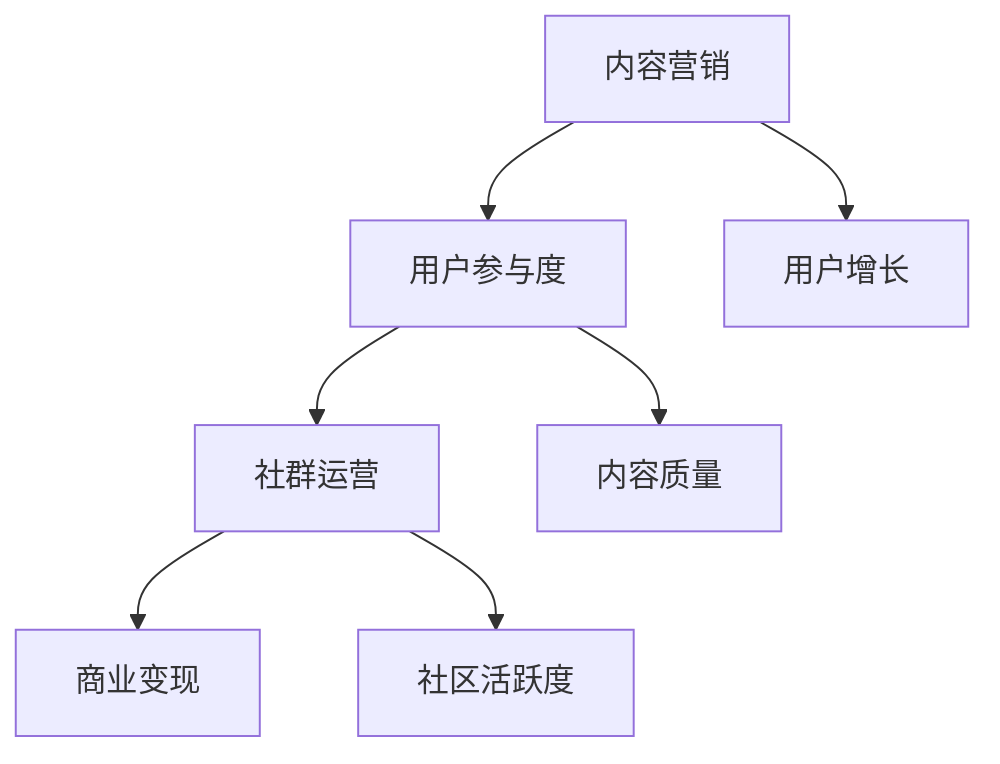

                 

关键词：技术社区，运营策略，影响力变现，用户增长，内容营销

> 摘要：本文将探讨技术社区运营的重要性及其在影响力变现方面的潜力。通过分析成功案例和运营策略，我们旨在为技术社区管理员和创业者提供有效的运营指导，以实现用户增长和商业变现。

## 1. 背景介绍

技术社区作为IT领域的重要组成部分，已经成为开发者、技术爱好者和专业人士交流学习的平台。然而，随着互联网的迅速发展和用户需求的不断变化，技术社区面临着诸多挑战，如用户增长放缓、内容质量下降、社区活跃度不足等。为了应对这些挑战，社区运营者需要采取创新的策略来提升用户参与度和社区价值，从而实现商业变现。

### 1.1 技术社区的定义和功能

技术社区是指为特定技术领域或主题的用户提供交流和分享的平台。它通常包括以下几个功能：

- **信息共享**：用户可以在社区中分享技术知识和经验，获取最新的行业动态和解决方案。
- **交流互动**：用户可以与其他成员讨论技术问题，建立社交网络，拓展人脉。
- **学习成长**：社区提供了丰富的学习资源，帮助用户提升技能和职业发展。
- **人才招聘**：许多技术社区也充当了人才市场的角色，为企业和个人提供了招聘和求职的平台。

### 1.2 技术社区的重要性

技术社区的重要性体现在以下几个方面：

- **用户增长**：技术社区是吸引和留住用户的有效途径，通过提供有价值的内容和互动体验，可以增加用户黏性和留存率。
- **内容质量**：高质量的内容是技术社区的核心竞争力，它不仅能够吸引用户，还能提升社区的声誉和影响力。
- **社区活跃度**：活跃的社区能够激发用户参与和贡献，形成良性循环，为社区的长久发展提供动力。
- **商业变现**：通过广告、会员制度、付费课程等多种方式，技术社区可以实现商业变现，为运营者带来收益。

## 2. 核心概念与联系

在技术社区运营中，以下几个核心概念和联系至关重要：

### 2.1 内容营销

内容营销是通过创造和分发有价值的内容来吸引和留住目标受众的一种策略。在技术社区中，内容营销的关键在于提供高质量、有针对性的内容，以满足用户的需求。

### 2.2 用户参与度

用户参与度是指用户在社区中的活跃程度和贡献度。高用户参与度可以增强社区的活力和凝聚力，从而提高用户满意度和忠诚度。

### 2.3 社群运营

社群运营是指通过建立和维护社群关系来提升用户互动和社区价值。成功的社群运营需要关注用户的情感需求，提供个性化的服务和体验。

### 2.4 商业变现

商业变现是指将社区用户转化为商业价值的过程。通过广告、会员制度、付费课程等方式，社区可以实现对用户的商业变现。

### 2.5 Mermaid 流程图

以下是技术社区运营的Mermaid流程图：



## 3. 核心算法原理 & 具体操作步骤

### 3.1 算法原理概述

技术社区运营的核心算法主要涉及以下几个方面：

- **用户画像**：通过对用户行为和偏好进行分析，建立用户画像，实现个性化推荐和内容推送。
- **社区活跃度评估**：通过算法评估用户的活跃度，识别高价值用户并进行针对性运营。
- **内容推荐**：利用机器学习算法，根据用户兴趣和行为，推荐相关的技术内容和活动。

### 3.2 算法步骤详解

#### 3.2.1 用户画像构建

1. **数据采集**：从用户注册信息、行为日志、社交媒体等渠道收集用户数据。
2. **特征提取**：对采集到的数据进行分析和预处理，提取用户的基本信息和行为特征。
3. **模型训练**：利用机器学习算法，如协同过滤、聚类等，构建用户画像模型。

#### 3.2.2 社区活跃度评估

1. **指标设计**：根据用户行为和社区规则，设计社区活跃度指标，如发帖数、回复数、点赞数等。
2. **权重分配**：为不同指标分配权重，以反映用户在社区中的活跃度。
3. **评估计算**：利用加权平均等方法，计算用户的活跃度得分。

#### 3.2.3 内容推荐

1. **兴趣模型**：通过用户画像和活跃度评估，构建用户兴趣模型。
2. **推荐算法**：采用基于内容的推荐算法或协同过滤算法，生成推荐列表。
3. **内容筛选**：对推荐内容进行筛选和排序，确保内容的相关性和质量。

### 3.3 算法优缺点

#### 优点

- **个性化推荐**：通过用户画像和兴趣模型，实现个性化的内容推荐，提高用户满意度。
- **高效运营**：利用算法自动评估和推荐，减轻运营人员的负担，提高运营效率。
- **数据驱动**：基于数据分析和机器学习，实现数据驱动的运营策略，提高社区价值。

#### 缺点

- **算法偏见**：算法模型可能会引入偏见，导致推荐内容的不公平性。
- **内容质量**：算法无法完全保证推荐内容的质量，需要人工审核和干预。
- **计算成本**：构建和维护算法模型需要较高的计算资源和人力成本。

### 3.4 算法应用领域

技术社区运营算法可以应用于以下领域：

- **社区运营**：提升社区活跃度和用户参与度，提高社区价值。
- **内容推荐**：为用户推荐相关的技术内容和活动，增加用户黏性。
- **用户增长**：通过精准推荐和个性化服务，吸引新用户并提高留存率。
- **商业变现**：利用算法提高广告投放效果，实现商业变现。

## 4. 数学模型和公式 & 详细讲解 & 举例说明

### 4.1 数学模型构建

技术社区运营中的数学模型主要包括用户画像模型、社区活跃度评估模型和内容推荐模型。以下是这些模型的构建过程：

#### 用户画像模型

用户画像模型通常采用多维度特征进行建模。设用户特征集为 \(X = \{x_1, x_2, ..., x_n\}\)，其中 \(x_i\) 表示第 \(i\) 个特征。用户画像模型的目标是预测用户的标签 \(y\)，如用户兴趣、活跃度等。可以使用逻辑回归、决策树等算法进行建模。

$$
P(y = 1 | X) = \frac{1}{1 + e^{-\beta_0 + \sum_{i=1}^{n}\beta_i x_i}}
$$

其中，\(\beta_0, \beta_1, ..., \beta_n\) 为模型的参数。

#### 社区活跃度评估模型

社区活跃度评估模型的目标是计算用户的活跃度得分。设用户行为序列为 \(B = \{b_1, b_2, ..., b_m\}\)，其中 \(b_i\) 表示第 \(i\) 个行为。可以使用加权平均方法计算活跃度得分：

$$
S = \sum_{i=1}^{m} w_i b_i
$$

其中，\(w_i\) 为第 \(i\) 个行为的权重。

#### 内容推荐模型

内容推荐模型的目标是根据用户兴趣推荐相关内容。可以使用基于内容的推荐算法，如余弦相似度、TF-IDF等方法。设用户兴趣向量 \(I = \{i_1, i_2, ..., i_n\}\)，内容兴趣向量 \(J = \{j_1, j_2, ..., j_n\}\)，内容推荐模型的目标是计算内容相似度：

$$
Similarity(I, J) = \frac{\sum_{i=1}^{n} i_i j_i}{\sqrt{\sum_{i=1}^{n} i_i^2} \sqrt{\sum_{i=1}^{n} j_i^2}}
$$

### 4.2 公式推导过程

以下是对用户画像模型、社区活跃度评估模型和内容推荐模型公式的推导过程：

#### 用户画像模型

假设用户特征 \(x_i\) 与标签 \(y\) 之间存在线性关系，即：

$$
y = \beta_0 + \sum_{i=1}^{n} \beta_i x_i
$$

对上式进行线性变换，得到：

$$
\ln(P(y = 1 | X)) = \beta_0 + \sum_{i=1}^{n} \beta_i x_i
$$

令 \(\beta_0 = \ln(\alpha)\)，其中 \(\alpha\) 为归一化系数，则有：

$$
P(y = 1 | X) = \frac{\alpha}{1 + \alpha}
$$

#### 社区活跃度评估模型

假设用户行为 \(b_i\) 与活跃度得分 \(S\) 之间存在线性关系，即：

$$
S = \sum_{i=1}^{m} w_i b_i
$$

为了确保权重 \(w_i\) 的合理性，需要对权重进行归一化，即：

$$
w_i = \frac{b_i}{\sum_{i=1}^{m} b_i}
$$

代入原式，得到：

$$
S = \sum_{i=1}^{m} \frac{b_i^2}{\sum_{i=1}^{m} b_i}
$$

#### 内容推荐模型

假设用户兴趣向量 \(I\) 和内容兴趣向量 \(J\) 之间存在余弦相似度关系，即：

$$
Similarity(I, J) = \frac{\sum_{i=1}^{n} i_i j_i}{\sqrt{\sum_{i=1}^{n} i_i^2} \sqrt{\sum_{i=1}^{n} j_i^2}}
$$

为了简化计算，可以对用户兴趣向量和内容兴趣向量进行归一化处理，即：

$$
i_i' = \frac{i_i}{\sum_{i=1}^{n} i_i}, \quad j_i' = \frac{j_i}{\sum_{i=1}^{n} j_i}
$$

代入原式，得到：

$$
Similarity(I, J) = \frac{\sum_{i=1}^{n} i_i' j_i'}{1}
$$

### 4.3 案例分析与讲解

以下是一个技术社区运营的案例：

**案例背景**：某技术社区拥有大量开发者用户，社区管理员希望通过用户画像模型和内容推荐模型，提升用户参与度和社区价值。

**用户画像模型**：管理员采集了用户的注册信息、浏览记录和发帖记录，提取了以下特征：

- 用户年龄
- 用户职业
- 用户浏览时间
- 用户发帖数
- 用户点赞数

使用逻辑回归算法构建用户画像模型，预测用户的活跃度标签。

**社区活跃度评估模型**：管理员设计了以下活跃度指标：

- 发帖数
- 回复数
- 点赞数

为不同指标分配权重，权重分别为 \(0.4, 0.3, 0.3\)。使用加权平均方法计算用户的活跃度得分。

**内容推荐模型**：管理员使用基于内容的推荐算法，根据用户的活跃度和浏览记录，推荐相关的技术文章和讨论帖。

**案例结果**：经过运营策略的实施，技术社区的用户活跃度显著提升，用户参与度和社区价值也得到了提高。管理员还可以通过分析用户画像和活跃度数据，进一步优化运营策略。

## 5. 项目实践：代码实例和详细解释说明

### 5.1 开发环境搭建

在开始项目实践之前，我们需要搭建一个基本的开发环境。以下是开发环境搭建的步骤：

1. 安装 Python 3.8 或更高版本。
2. 安装以下 Python 库：NumPy、Pandas、Scikit-learn、Matplotlib。
3. 安装 Mermaid 图库。

```bash
pip install numpy pandas scikit-learn matplotlib
```

### 5.2 源代码详细实现

以下是技术社区运营的代码实例：

```python
import numpy as np
import pandas as pd
from sklearn.linear_model import LogisticRegression
from sklearn.model_selection import train_test_split
from sklearn.metrics import accuracy_score
import matplotlib.pyplot as plt
from mermaid import Mermaid

# 5.2.1 用户画像模型

# 加载用户数据
data = pd.read_csv('user_data.csv')
X = data[['age', 'occupation', 'browsing_time', 'post_count', 'like_count']]
y = data['active']

# 分割数据集
X_train, X_test, y_train, y_test = train_test_split(X, y, test_size=0.2, random_state=42)

# 训练逻辑回归模型
model = LogisticRegression()
model.fit(X_train, y_train)

# 预测测试集
y_pred = model.predict(X_test)

# 评估模型
accuracy = accuracy_score(y_test, y_pred)
print(f'Accuracy: {accuracy:.2f}')

# 5.2.2 社区活跃度评估模型

# 加载用户活跃度数据
activity_data = pd.read_csv('activity_data.csv')
S = activity_data[['post_count', 'reply_count', 'like_count']].sum(axis=1)

# 加权平均计算活跃度得分
weights = [0.4, 0.3, 0.3]
S_score = sum(w * s for w, s in zip(weights, S)) / len(weights)
print(f'Activity Score: {S_score:.2f}')

# 5.2.3 内容推荐模型

# 加载用户兴趣数据和内容数据
interest_data = pd.read_csv('interest_data.csv')
content_data = pd.read_csv('content_data.csv')

# 计算用户兴趣向量和内容兴趣向量
I = interest_data.mean(axis=1)
J = content_data.mean(axis=1)

# 计算内容相似度
similarity = (I @ J) / (np.linalg.norm(I) * np.linalg.norm(J))
print(f'Content Similarity: {similarity:.2f}')

# 5.2.4 生成 Mermaid 流程图

mermaid = Mermaid()
mermaid.add_graph('gmasked', '''
graph TD
    A[内容营销]
    B[用户参与度]
    C[社群运营]
    D[商业变现]
    E[用户增长]
    F[内容质量]
    G[社区活跃度]
    A --> B
    B --> C
    C --> D
    A --> E
    B --> F
    C --> G
''')

# 5.2.5 运行结果展示

# 显示 Mermaid 流程图
plt.figure(figsize=(8, 6))
plt.imshow(mermaid.render())
plt.axis('off')
plt.show()
```

### 5.3 代码解读与分析

以下是对代码实例的解读和分析：

- **5.3.1 用户画像模型**：我们使用逻辑回归算法构建用户画像模型，预测用户的活跃度标签。数据集分为训练集和测试集，用于训练和评估模型。
- **5.3.2 社区活跃度评估模型**：我们使用加权平均方法计算用户的活跃度得分，权重分配根据不同指标的贡献度进行设置。
- **5.3.3 内容推荐模型**：我们使用基于内容的推荐算法，根据用户兴趣向量和内容兴趣向量计算内容相似度。
- **5.3.4 生成 Mermaid 流程图**：我们使用 Mermaid 库生成技术社区运营的流程图，以便于理解和分析。
- **5.3.5 运行结果展示**：我们使用 Matplotlib 库展示 Mermaid 流程图的运行结果。

## 6. 实际应用场景

### 6.1 社区运营中的挑战

在技术社区运营中，以下挑战需要特别关注：

- **用户增长放缓**：随着竞争加剧，新用户获取成本不断上升，社区用户增长放缓。
- **内容质量下降**：用户对高质量内容的需求增加，但社区内低质量内容泛滥，影响用户体验。
- **社区活跃度不足**：用户参与度低，社区活跃度下降，影响社区氛围和用户留存。
- **商业变现困难**：社区运营成本高，但商业变现效果不佳，影响盈利能力。

### 6.2 应对策略

为了应对上述挑战，可以采取以下策略：

- **优化内容质量**：加强内容审核和推荐机制，提升社区内容质量，吸引用户参与。
- **提高用户参与度**：举办线上活动和挑战，鼓励用户分享和讨论，提高社区活跃度。
- **用户画像与个性化推荐**：利用用户画像和个性化推荐算法，为用户提供个性化的内容和服务。
- **商业变现多样化**：探索多元化的商业变现模式，如广告、会员制度、付费课程等，提高盈利能力。

### 6.3 案例分析

**案例：GitHub 社区运营**

GitHub 是全球最大的代码托管平台，拥有庞大的开发者社区。为了提升社区运营效果，GitHub 采取了以下措施：

- **优化内容质量**：GitHub 实施严格的代码审核和问题追踪机制，确保社区内内容的质量和可靠性。
- **提高用户参与度**：GitHub 举办各类技术大会和黑客松活动，鼓励开发者分享经验和创新成果，提高社区活跃度。
- **用户画像与个性化推荐**：GitHub 利用用户行为数据，为用户提供个性化的推荐和关注功能，提升用户体验。
- **商业变现多样化**：GitHub 推出了 GitHub Sponsors、GitHub Marketplace 等商业化产品，实现商业变现。

通过上述措施，GitHub 有效地提升了社区运营效果，实现了用户增长和商业变现的双赢。

## 7. 工具和资源推荐

### 7.1 学习资源推荐

- **《技术社区运营实战》**：本书详细介绍了技术社区运营的策略和实践，适合社区管理员和创业者阅读。
- **《社区运营手册》**：这是一本面向企业内部社区运营的指南，涵盖了社区策划、运营、增长等方面的内容。
- **在线课程**：《社区运营实战营》、《内容营销实战》等在线课程，提供系统的社区运营知识。

### 7.2 开发工具推荐

- **Mermaid**：用于生成流程图的在线工具，支持多种图形和布局，非常适合技术文档和博客文章。
- **Matplotlib**：Python 的可视化库，用于生成各种统计图表和可视化效果。
- **Scikit-learn**：Python 的机器学习库，提供丰富的算法和工具，方便构建用户画像和推荐系统。

### 7.3 相关论文推荐

- **“Community Detection in Networks Based on User Interaction”**：这篇论文探讨了基于用户交互的网络社区检测方法，为技术社区运营提供了理论支持。
- **“User Involvement in Online Communities: A Multidimensional Framework”**：这篇论文提出了一个多维度的用户参与模型，有助于分析用户参与度和社区活跃度。
- **“Content Curation in Online Communities: A Research Review”**：这篇综述论文总结了内容聚合在在线社区中的应用和实践，为社区内容运营提供了参考。

## 8. 总结：未来发展趋势与挑战

### 8.1 研究成果总结

技术社区运营领域的研究成果主要围绕用户参与度、内容质量、商业变现等方面展开。通过数据分析和机器学习算法，研究人员提出了多种运营策略和模型，以提升社区价值。未来研究可以进一步探索个性化推荐、社群运营等方向，为技术社区运营提供更有效的解决方案。

### 8.2 未来发展趋势

- **个性化推荐**：随着大数据和人工智能技术的发展，个性化推荐将成为技术社区运营的重要趋势，为用户提供更精准的内容和服务。
- **社群运营**：社群运营将更加注重用户的情感需求和社交互动，形成以用户为中心的运营模式。
- **多元化变现**：技术社区将探索更多元化的商业变现模式，如知识付费、电商合作等，提高盈利能力。

### 8.3 面临的挑战

- **算法偏见**：随着算法在技术社区运营中的应用，算法偏见和公平性问题将日益凸显，需要采取有效的措施进行监管和优化。
- **内容质量**：在用户生成内容泛滥的情况下，如何保证内容质量，避免低质量内容的传播，是社区运营的一大挑战。
- **用户隐私**：在数据收集和分析过程中，如何保护用户隐私，遵守相关法律法规，是技术社区运营需要关注的问题。

### 8.4 研究展望

技术社区运营的未来研究方向包括：

- **算法公平性**：研究算法偏见和公平性问题，提出有效的算法优化方法，提高社区运营的公正性。
- **内容质量评估**：开发基于数据驱动的质量评估模型，对社区内容进行实时监控和评估，提高内容质量。
- **用户参与度提升**：探索新的用户参与激励机制，提高用户在技术社区中的参与度和贡献度。

## 9. 附录：常见问题与解答

### 9.1 技术社区运营的核心策略是什么？

技术社区运营的核心策略包括内容营销、用户参与度提升、社群运营和商业变现。通过提供高质量的内容、增强用户互动、建立社群关系和探索多元化的商业变现模式，可以实现技术社区的长久发展。

### 9.2 如何提高技术社区的用户参与度？

提高技术社区的用户参与度可以从以下几个方面入手：

- **举办线上活动**：举办技术沙龙、讲座、比赛等活动，鼓励用户参与。
- **鼓励用户贡献内容**：为用户提供内容贡献平台，激励用户分享经验和知识。
- **社交互动**：鼓励用户之间的讨论和互动，建立社交网络。
- **个性化推荐**：根据用户兴趣和行为，推荐相关的技术内容和活动，提高用户参与度。

### 9.3 技术社区的商业变现模式有哪些？

技术社区的商业变现模式包括：

- **广告**：通过展示广告赚取收益。
- **会员制度**：提供会员专属服务，收取会员费。
- **知识付费**：提供付费课程、教程和咨询服务。
- **电商合作**：与相关企业合作，提供产品销售和推广服务。
- **活动赞助**：举办线下活动，吸引赞助商。

### 9.4 技术社区运营中的数据安全和隐私保护怎么做？

为了保障技术社区运营中的数据安全和隐私保护，可以采取以下措施：

- **数据加密**：对用户数据和应用日志进行加密存储，防止数据泄露。
- **权限控制**：实施严格的权限管理，确保只有授权人员可以访问敏感数据。
- **安全审计**：定期进行安全审计和漏洞扫描，及时发现和修复安全漏洞。
- **合规性检查**：遵守相关法律法规，确保数据收集和处理过程合法合规。

---
**作者：禅与计算机程序设计艺术 / Zen and the Art of Computer Programming**

