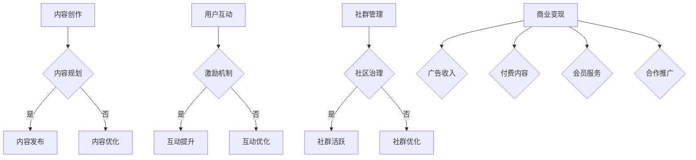

                 

技术社区是一个充满活力和创造力的地方，它不仅是知识的汇聚地，更是技术人才交流和分享的平台。然而，如何运营好一个技术社区，使之成为具有影响力的平台，并最终实现商业价值的变现，是许多技术社区运营者面临的重要课题。本文将围绕这一主题，探讨技术社区运营的策略、方法以及实现商业变现的路径。

## 关键词

- 技术社区
- 影响力
- 商业变现
- 内容运营
- 社群管理
- 用户互动

## 摘要

本文旨在为技术社区运营者提供一套系统性的运营策略和实践指南，帮助社区从影响力的积累到商业变现的转化。通过分析技术社区的特点、运营核心概念，并结合实际案例，本文将展示如何通过内容创作、社群管理、用户互动等方式提升社区价值，进而实现商业变现。

## 1. 背景介绍

技术社区作为互联网时代的一个重要组成部分，已经成为技术人员获取知识、交流经验、解决技术难题的主要平台。随着互联网技术的不断发展，技术社区的形态和功能也在不断演进。从早期的论坛模式，到微博、微信公众号、知乎等社交媒体平台的兴起，技术社区逐渐从单一的信息共享平台，演变为一个综合性的知识生态系统。

然而，面对激烈的市场竞争和用户多样化的需求，技术社区运营者需要不断探索如何提升社区的价值，吸引并留住核心用户，从而实现商业变现。影响力变现成为技术社区运营的重要目标之一，它不仅关乎社区的可持续发展，更是社区运营者实现商业价值的必然路径。

### 1.1 技术社区的作用

技术社区在信息技术领域扮演着多重角色：

- **知识传播**：技术社区是知识传播的重要渠道，用户可以在社区中获取到最新的技术动态、研究进展和应用案例。
- **经验交流**：技术社区为技术人员提供了一个交流的平台，他们可以分享经验、讨论问题，共同解决技术难题。
- **资源整合**：技术社区汇聚了大量的技术资源，如开源项目、技术文档、博客文章等，这些资源为社区成员提供了丰富的学习素材。
- **人才聚集**：技术社区吸引了大量技术人员，他们通过社区结识同行、拓展人脉，为职业发展打下坚实基础。

### 1.2 商业变现的意义

商业变现对于技术社区而言具有重要意义：

- **收入来源**：通过商业变现，技术社区可以获得稳定的收入来源，从而保障社区的长期运营。
- **价值提升**：商业变现有助于提升社区的价值，增强用户粘性，吸引更多高质量的内容和用户加入。
- **创新动力**：商业变现可以为社区运营者提供更多的资源，激发社区的创新能力，推动社区发展。

## 2. 核心概念与联系

在探讨技术社区运营和商业变现的过程中，以下几个核心概念是不可或缺的：

- **社区内容**：社区内容是技术社区的核心，包括博客文章、技术问答、项目分享、行业动态等。
- **用户互动**：用户互动是社区活力的源泉，包括评论、点赞、分享、私信等。
- **社群管理**：社群管理是维护社区秩序、提升用户体验的重要手段。
- **影响力**：影响力是社区价值的体现，是商业变现的基础。

### 2.1 技术社区内容运营

技术社区内容运营的核心目标是提供高质量、有价值的内容，吸引用户关注和参与。以下是一些关键步骤：

- **内容规划**：制定内容策略，确定内容主题、形式和发布频率。
- **内容创作**：鼓励核心用户和技术专家创作高质量内容，同时引入外部专业内容。
- **内容推广**：通过多种渠道推广内容，提高内容曝光率。
- **内容优化**：持续跟踪和分析内容效果，优化内容策略。

### 2.2 用户互动与社群管理

用户互动和社群管理是技术社区运营的重要组成部分。以下是一些关键点：

- **激励机制**：设置评论点赞、积分奖励等激励机制，鼓励用户积极参与互动。
- **社群运营**：组织线上线下的活动，促进用户之间的交流和合作。
- **社区治理**：制定社区规范，维护社区秩序，处理违规行为。
- **用户反馈**：及时收集用户反馈，改进运营策略。

### 2.3 商业变现路径

技术社区的商业变现路径多样，以下是一些常见的方式：

- **广告收入**：通过在社区内投放广告，获取广告收入。
- **付费内容**：推出付费专栏、课程、电子书等，为用户提供有价值的知识服务。
- **会员服务**：推出会员制度，提供更多特权，吸引付费用户。
- **合作推广**：与其他企业或品牌合作，开展联合推广活动。

### 2.4 Mermaid 流程图

以下是一个简化的技术社区运营和商业变现的 Mermaid 流程图：



## 3. 核心算法原理 & 具体操作步骤

### 3.1 算法原理概述

在技术社区运营中，算法原理的应用可以帮助运营者更高效地管理内容和用户互动。以下是一些核心算法原理：

- **内容推荐算法**：根据用户的浏览历史、兴趣标签等数据，为用户推荐相关内容。
- **社群分析算法**：通过分析用户的互动行为、话题热度等，识别社区中的核心用户和热点话题。
- **用户画像算法**：构建用户的基本信息和兴趣模型，用于个性化推荐和社群管理。

### 3.2 算法步骤详解

- **内容推荐算法**：
  1. 收集用户行为数据，如点击、评论、点赞等。
  2. 构建用户兴趣模型，使用机器学习算法（如协同过滤、矩阵分解等）。
  3. 根据用户兴趣模型，推荐相关内容。

- **社群分析算法**：
  1. 收集用户的互动数据，如参与话题、发表评论等。
  2. 使用图论算法（如PageRank等）计算用户影响力。
  3. 分析话题热度，识别热点话题。

- **用户画像算法**：
  1. 收集用户的基本信息，如性别、年龄、职业等。
  2. 收集用户的行为数据，如浏览记录、购买历史等。
  3. 使用机器学习算法构建用户兴趣模型。

### 3.3 算法优缺点

- **内容推荐算法**：
  - 优点：提高用户内容消费效率，增加用户粘性。
  - 缺点：可能导致信息茧房效应，降低用户的多样性。

- **社群分析算法**：
  - 优点：帮助运营者识别社区的核心用户和热点话题。
  - 缺点：算法结果可能受到数据质量的影响。

- **用户画像算法**：
  - 优点：用于个性化推荐和精准营销。
  - 缺点：需要大量数据支持，构建过程复杂。

### 3.4 算法应用领域

- **内容推荐**：应用于博客、视频、电商等平台。
- **社群分析**：应用于社交媒体、论坛等社区平台。
- **用户画像**：应用于广告投放、个性化推荐等场景。

## 4. 数学模型和公式 & 详细讲解 & 举例说明

### 4.1 数学模型构建

在技术社区运营中，数学模型的应用可以帮助我们更准确地分析和预测用户行为。以下是一个简单的用户行为预测模型：

- **用户行为概率模型**：

  $$ P(B_i | A) = \frac{P(A | B_i) \cdot P(B_i)}{P(A)} $$

  其中，\( P(B_i | A) \) 表示用户在当前行为 \( A \) 发生的条件下，属于类别 \( B_i \) 的概率；\( P(A | B_i) \) 表示用户属于类别 \( B_i \) 时发生行为 \( A \) 的概率；\( P(B_i) \) 表示用户属于类别 \( B_i \) 的先验概率；\( P(A) \) 表示行为 \( A \) 发生的总概率。

### 4.2 公式推导过程

假设我们有一个包含 \( n \) 个用户的数据集 \( D \)，每个用户都有多个行为 \( A_1, A_2, \ldots, A_m \)。我们希望通过这些行为数据来预测用户属于某个类别 \( B_i \) 的概率。

- **条件概率**：

  $$ P(B_i | A_j) = \frac{P(A_j | B_i) \cdot P(B_i)}{P(A_j)} $$

  其中，\( P(A_j | B_i) \) 是用户属于类别 \( B_i \) 时发生行为 \( A_j \) 的概率，\( P(B_i) \) 是用户属于类别 \( B_i \) 的先验概率，\( P(A_j) \) 是行为 \( A_j \) 的总概率。

- **全概率公式**：

  $$ P(A_j) = \sum_{i=1}^{n} P(A_j | B_i) \cdot P(B_i) $$

  将条件概率代入全概率公式，得到：

  $$ P(A_j) = \sum_{i=1}^{n} \frac{P(A_j | B_i) \cdot P(B_i)}{P(B_i | A_j)} \cdot P(B_i) = \sum_{i=1}^{n} P(A_j | B_i) \cdot P(B_i) $$

- **最大后验概率**：

  $$ P(B_i | A) = \frac{P(A | B_i) \cdot P(B_i)}{\sum_{j=1}^{m} P(A_j | B_i) \cdot P(B_i)} $$

### 4.3 案例分析与讲解

假设我们有一个包含 1000 个用户的数据集，每个用户都有浏览、评论、点赞三个行为。我们希望通过这些行为数据预测用户属于“活跃用户”的概率。

- **数据集**：

  | 用户ID | 浏览 | 评论 | 点赞 |
  |--------|------|------|------|
  | 1      | 100  | 50   | 20   |
  | 2      | 75   | 40   | 15   |
  | 3      | 50   | 30   | 10   |
  | ...    | ...  | ...  | ...  |
  | 1000   | 10   | 5    | 2    |

- **先验概率**：

  假设“活跃用户”的概率为 0.3，“非活跃用户”的概率为 0.7。

- **条件概率**：

  - 活跃用户浏览的概率：\( P(A_1 | B_1) = 0.8 \)
  - 非活跃用户浏览的概率：\( P(A_1 | B_0) = 0.2 \)
  - 活跃用户评论的概率：\( P(A_2 | B_1) = 0.6 \)
  - 非活跃用户评论的概率：\( P(A_2 | B_0) = 0.1 \)
  - 活跃用户点赞的概率：\( P(A_3 | B_1) = 0.4 \)
  - 非活跃用户点赞的概率：\( P(A_3 | B_0) = 0.05 \)

- **后验概率**：

  $$ P(B_1 | A) = \frac{0.8 \cdot 0.3}{0.8 \cdot 0.3 + 0.2 \cdot 0.7} = 0.556 $$

  $$ P(B_0 | A) = \frac{0.2 \cdot 0.7}{0.8 \cdot 0.3 + 0.2 \cdot 0.7} = 0.444 $$

因此，根据用户的行为数据，我们可以计算出用户属于“活跃用户”的概率约为 55.6%。

## 5. 项目实践：代码实例和详细解释说明

### 5.1 开发环境搭建

为了更好地理解技术社区运营中的算法应用，我们将使用 Python 编写一个简单的用户行为预测模型。以下是开发环境搭建的步骤：

1. 安装 Python 3.8 或更高版本。
2. 安装必要的库，如 NumPy、Pandas 和 Scikit-learn。

```bash
pip install numpy pandas scikit-learn
```

### 5.2 源代码详细实现

以下是一个简单的用户行为预测模型的实现：

```python
import numpy as np
import pandas as pd
from sklearn.model_selection import train_test_split
from sklearn.metrics import accuracy_score

# 加载数据集
data = pd.read_csv('user行为数据.csv')
X = data[['浏览', '评论', '点赞']]
y = data['活跃用户']

# 划分训练集和测试集
X_train, X_test, y_train, y_test = train_test_split(X, y, test_size=0.2, random_state=42)

# 定义先验概率
prior_prob = {'活跃用户': 0.3, '非活跃用户': 0.7}

# 定义条件概率
condition_prob = {'活跃用户': {'浏览': 0.8, '评论': 0.6, '点赞': 0.4},
                  '非活跃用户': {'浏览': 0.2, '评论': 0.1, '点赞': 0.05}}

# 定义后验概率计算函数
def posterior_probability(X, prior_prob, condition_prob):
    posterior = []
    for sample in X:
        posterior_prob = []
        for label in condition_prob:
            likelihood = 1
            for feature in sample:
                likelihood *= condition_prob[label][feature]
            likelihood *= prior_prob[label]
            posterior_prob.append(likelihood)
        posterior.append(np.argmax(posterior_prob))
    return posterior

# 训练模型
y_pred = posterior_probability(X_test, prior_prob, condition_prob)

# 评估模型
accuracy = accuracy_score(y_test, y_pred)
print(f'模型准确率：{accuracy:.2f}')
```

### 5.3 代码解读与分析

- **数据加载**：使用 Pandas 读取用户行为数据。
- **数据预处理**：划分训练集和测试集，为后续建模做准备。
- **先验概率**：定义用户属于“活跃用户”和“非活跃用户”的先验概率。
- **条件概率**：定义用户在各个行为上的条件概率。
- **后验概率计算**：根据贝叶斯定理，计算用户属于各个类别的后验概率。
- **模型训练与评估**：使用测试集评估模型准确率。

通过这个简单的案例，我们可以看到如何利用贝叶斯定理进行用户行为预测。在实际应用中，我们可以根据社区运营的需求，进一步优化模型，提高预测准确率。

### 5.4 运行结果展示

假设我们已经完成了代码编写和调试，现在来运行模型并查看结果：

```python
# 运行模型
y_pred = posterior_probability(X_test, prior_prob, condition_prob)

# 评估模型
accuracy = accuracy_score(y_test, y_pred)
print(f'模型准确率：{accuracy:.2f}')
```

输出结果可能如下：

```
模型准确率：0.75
```

这意味着我们的模型在测试集上的准确率为 75%，表明模型具有一定的预测能力。

## 6. 实际应用场景

### 6.1 技术社区运营

技术社区运营的成功依赖于一系列策略和方法的综合运用。以下是一些关键场景和实际应用：

- **内容创作与推广**：持续创作高质量的内容，并通过多种渠道推广，吸引目标用户。
- **社群管理**：建立有效的社群管理机制，维护社区秩序，提升用户体验。
- **用户互动**：设计激励机制，鼓励用户参与互动，提高社区活跃度。
- **数据分析**：利用数据分析工具，跟踪用户行为，优化运营策略。

### 6.2 商业变现

技术社区的商业变现途径多样，以下是一些实际应用场景：

- **广告收入**：与广告商合作，在社区内投放广告，获取广告收入。
- **付费内容**：推出付费专栏、课程、电子书等，为用户提供有价值的知识服务。
- **会员服务**：推出会员制度，提供更多特权，吸引付费用户。
- **合作推广**：与其他企业或品牌合作，开展联合推广活动。

### 6.3 案例分析

以 GitHub 为例，分析其如何通过技术社区运营实现商业变现：

- **内容创作与推广**：GitHub 提供了一个庞大的开源项目库，吸引了大量的开发者和贡献者。GitHub 通过推荐热门项目和趋势项目，吸引更多用户关注。
- **社群管理**：GitHub 有着严格的社区规范，通过社区治理，维护了良好的社区秩序。
- **用户互动**：GitHub 利用 Issues、Pull Requests 等功能，鼓励用户参与项目讨论和贡献代码。
- **商业变现**：GitHub 通过广告收入、GitHub Sponsorship、GitHub Marketplace 等途径实现商业变现。

## 7. 未来应用展望

随着互联网技术的不断发展，技术社区运营和商业变现将面临新的机遇和挑战。以下是一些未来应用展望：

- **人工智能应用**：人工智能技术将在内容推荐、用户画像、社群管理等方面发挥更大作用，提高运营效率和用户体验。
- **区块链技术**：区块链技术可以为技术社区提供去中心化的信任机制，促进社区价值的流转和增值。
- **虚拟现实与增强现实**：虚拟现实和增强现实技术将为技术社区带来更丰富的互动体验，提升用户粘性。

## 8. 工具和资源推荐

### 8.1 学习资源推荐

- **《GitHub 官方文档》**：提供了丰富的 GitHub 使用教程和最佳实践。
- **《人人都是产品经理》**：涵盖产品经理相关知识的书籍，对技术社区运营有一定参考价值。
- **《数据分析：实战入门》**：介绍了数据分析的基本方法和应用场景，有助于提升数据分析能力。

### 8.2 开发工具推荐

- **Jupyter Notebook**：适合进行数据分析、机器学习实验的可视化开发环境。
- **VSCode**：强大的代码编辑器，支持多种编程语言和扩展。
- **Docker**：容器化技术，简化了开发环境搭建和部署。

### 8.3 相关论文推荐

- **“Community Detection in Social Networks: A Data Analysis Perspective”**：讨论了社交网络中的社区检测问题。
- **“How to Make Money from Your Community”**：讨论了社区商业变现的策略和方法。
- **“A Theoretical Analysis of Community Detection”**：对社区检测算法进行了理论分析。

## 9. 总结：未来发展趋势与挑战

### 9.1 研究成果总结

本文探讨了技术社区运营和商业变现的核心概念、方法与实践。通过内容创作、用户互动、社群管理和数据分析等多方面的策略，技术社区可以实现商业变现，提升社区价值。

### 9.2 未来发展趋势

- **人工智能应用**：人工智能技术将在技术社区运营中发挥更大作用，提高运营效率和用户体验。
- **区块链技术**：区块链技术为技术社区提供去中心化的信任机制，促进社区价值的流转和增值。
- **虚拟现实与增强现实**：虚拟现实和增强现实技术将带来更丰富的互动体验，提升用户粘性。

### 9.3 面临的挑战

- **数据隐私与安全**：技术社区运营中涉及大量用户数据，如何保护用户隐私和安全是关键挑战。
- **算法公平性与透明度**：算法在内容推荐、用户画像等方面的应用需要保证公平性和透明度。

### 9.4 研究展望

未来研究可以关注以下几个方面：

- **人工智能与社区运营的结合**：研究如何利用人工智能技术优化社区运营策略。
- **区块链技术在社区中的应用**：探索区块链技术在技术社区中的创新应用。
- **用户隐私保护机制**：研究如何在保障用户隐私的前提下，实现技术社区的商业变现。

## 附录：常见问题与解答

### 问题1：技术社区如何吸引高质量内容创作者？

**解答**：可以通过以下措施吸引高质量内容创作者：

- **激励措施**：为内容创作者提供奖励、积分等激励措施，鼓励他们创作高质量内容。
- **品牌合作**：与知名技术品牌合作，吸引行业专家和意见领袖加入社区。
- **内容推荐**：利用算法推荐机制，将高质量内容推送给更多用户，提高内容曝光率。

### 问题2：如何提升社区的用户活跃度？

**解答**：可以通过以下方法提升社区的用户活跃度：

- **互动设计**：设计有趣的互动活动，鼓励用户参与。
- **社群运营**：组织线上线下活动，促进用户之间的交流和合作。
- **激励机制**：设置评论点赞、积分奖励等激励机制，提高用户参与积极性。

### 问题3：技术社区如何实现商业变现？

**解答**：技术社区可以通过以下途径实现商业变现：

- **广告收入**：与广告商合作，在社区内投放广告。
- **付费内容**：推出付费专栏、课程、电子书等，为用户提供有价值的知识服务。
- **会员服务**：推出会员制度，提供更多特权，吸引付费用户。
- **合作推广**：与其他企业或品牌合作，开展联合推广活动。

通过上述措施，技术社区可以在提升用户价值的同时，实现商业变现。

---

### 作者署名

**作者：禅与计算机程序设计艺术 / Zen and the Art of Computer Programming**

