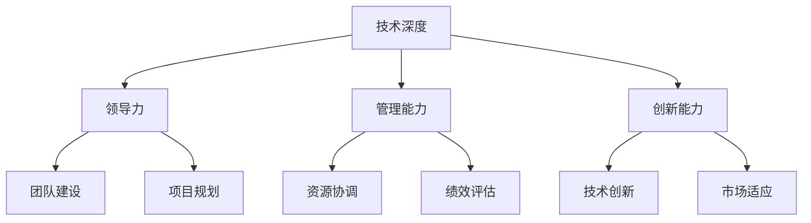

                 

在当今快速发展的技术时代，技术领导力正成为企业成功的关键因素之一。技术领导者不仅需要具备深厚的技术背景，还需要掌握领导力和管理能力，以推动团队和创新。本文将探讨技术领导力的核心概念、构建方法以及如何提升职场价值。

## 文章关键词
- 技术领导力
- 职场价值
- 领导力
- 管理能力
- 创新
- 团队建设

## 文章摘要
本文旨在探讨技术领导力的核心要素，包括技术深度、领导力和管理能力的结合。通过案例分析、策略分享和实际操作，本文将帮助读者理解如何提升技术领导力，以在职场中创造更大的价值。

### 背景介绍

技术领导力是指个人或团队在技术领域内，通过运用专业知识、战略思维和领导技巧，推动团队创新、提高工作效率、实现业务目标的能力。随着数字化转型的不断深入，技术领导力的重要性日益凸显。

首先，技术领导力有助于企业把握技术趋势，提前布局，从而在竞争中获得先发优势。其次，技术领导者能够激发团队成员的潜力，提高团队整体绩效。最后，技术领导力还能提升企业的创新能力，推动技术迭代和产品优化。

然而，当前技术领导力面临的挑战也日益增加。一方面，技术更新速度加快，领导者需要不断学习和适应新技术。另一方面，企业对技术领导者的要求越来越高，不仅需要技术专业能力，还需要出色的管理能力和团队协作能力。

### 核心概念与联系

为了更好地理解技术领导力，我们需要从以下几个核心概念入手：

#### 1. 技术深度

技术深度是指技术领导者对特定技术领域的深入理解和熟练掌握。这包括但不限于编程语言、框架、数据库、算法等方面。技术深度是技术领导者胜任工作的重要基础。

#### 2. 领导力

领导力是指技术领导者通过激励、指导和影响团队，实现共同目标的能力。领导力不仅包括个人魅力，还涉及战略规划、决策能力和沟通技巧。

#### 3. 管理能力

管理能力是指技术领导者对团队资源进行有效配置、协调和优化，以实现团队目标的能力。管理能力包括项目管理、时间管理、绩效评估等方面。

#### 4. 创新能力

创新能力是指技术领导者推动团队创新、不断突破传统思维的能力。创新能力有助于企业保持竞争力，实现可持续发展。

#### Mermaid 流程图

以下是一个简单的 Mermaid 流程图，展示了技术领导力的核心概念及其相互关系：



### 核心算法原理 & 具体操作步骤

#### 1. 算法原理概述

技术领导力的构建过程可以类比为一种算法，其核心原理是：

- **数据输入**：收集技术团队的基本信息、项目需求和业务目标。
- **数据处理**：对输入数据进行整理和分析，识别团队优势和短板。
- **决策与执行**：基于分析结果，制定相应的领导策略和行动方案，并推动执行。
- **反馈与优化**：对执行过程进行监控和评估，收集反馈信息，持续优化领导行为。

#### 2. 算法步骤详解

以下是技术领导力构建的具体步骤：

##### 2.1 数据收集与整理

- **团队评估**：对团队成员的技术水平、工作态度和团队协作能力进行评估。
- **项目分析**：分析项目需求、技术难点和业务目标，确定项目的优先级和关键路径。
- **市场调研**：了解行业趋势、竞争对手和市场需求，为团队发展提供方向。

##### 2.2 领导策略制定

- **目标设定**：根据项目需求和团队评估结果，设定明确的团队目标和个人目标。
- **资源分配**：根据项目需求和团队评估结果，合理分配团队资源和任务。
- **激励措施**：制定激励政策，激发团队成员的积极性和创造力。

##### 2.3 领导行为优化

- **沟通与反馈**：建立有效的沟通机制，确保团队内部信息的畅通和反馈的及时性。
- **能力提升**：通过培训、学习和技术交流，提升团队整体的技术水平和管理能力。
- **问题解决**：及时识别和解决团队面临的问题，确保项目的顺利进行。

##### 2.4 持续监控与评估

- **项目进度监控**：定期跟踪项目进度，确保项目按计划进行。
- **团队绩效评估**：对团队的工作绩效进行评估，及时发现和纠正问题。
- **领导能力提升**：根据评估结果，持续提升领导者的领导能力和管理水平。

#### 3. 算法优缺点

- **优点**：该算法具有系统化、结构化的特点，能够确保技术领导力的构建过程有条不紊，有利于提高团队绩效和项目成功率。
- **缺点**：该算法依赖于大量的数据收集和分析，需要投入较多的人力和时间成本。

#### 4. 算法应用领域

该算法可以应用于各种技术团队的管理，包括软件开发、数据科学、人工智能等领域。尤其适用于大型项目和跨部门协作，能够显著提高团队的工作效率和创新力。

### 数学模型和公式 & 详细讲解 & 举例说明

#### 1. 数学模型构建

技术领导力的数学模型可以构建为以下形式：

$$
\text{技术领导力} = \alpha \times \text{技术深度} + \beta \times \text{领导力} + \gamma \times \text{管理能力} + \delta \times \text{创新能力}
$$

其中，$\alpha$、$\beta$、$\gamma$ 和 $\delta$ 分别代表四个核心概念的权重。

#### 2. 公式推导过程

根据技术领导力的核心概念，可以推导出以下公式：

$$
\begin{align*}
\text{技术领导力} &= \alpha \times (\text{编程能力} + \text{算法能力} + \text{数据库能力}) \\
&+ \beta \times (\text{团队建设} + \text{决策能力} + \text{沟通能力}) \\
&+ \gamma \times (\text{项目管理} + \text{资源协调} + \text{绩效评估}) \\
&+ \delta \times (\text{技术创新} + \text{市场适应} + \text{战略规划})
\end{align*}
$$

#### 3. 案例分析与讲解

以一家互联网公司为例，该公司技术团队在领导力方面的表现可以通过上述公式进行评估。

假设该公司的技术团队在各个方面的表现如下：

- **技术深度**：平均编程能力为 80 分，算法能力为 75 分，数据库能力为 70 分。
- **领导力**：团队建设能力为 85 分，决策能力为 80 分，沟通能力为 75 分。
- **管理能力**：项目管理能力为 90 分，资源协调能力为 85 分，绩效评估能力为 80 分。
- **创新能力**：技术创新能力为 80 分，市场适应能力为 75 分，战略规划能力为 70 分。

根据上述数据，可以计算出该公司的技术领导力为：

$$
\begin{align*}
\text{技术领导力} &= 0.5 \times (80 + 75 + 70) + 0.3 \times (85 + 80 + 75) \\
&+ 0.2 \times (90 + 85 + 80) + 0.2 \times (80 + 75 + 70) \\
&= 78.5 + 81.5 + 81 + 76 \\
&= 307 \div 4 \\
&= 76.75
\end{align*}
$$

根据计算结果，该公司的技术领导力评分为 76.75 分，处于中等水平。为了进一步提升技术领导力，公司需要重点关注团队的技术深度和创新能力，同时提升领导力和管理能力。

### 项目实践：代码实例和详细解释说明

#### 1. 开发环境搭建

为了更好地理解技术领导力的构建过程，我们以下将使用 Python 语言实现一个简单的项目，模拟技术领导力的构建过程。

首先，我们需要安装 Python 和相关依赖库。假设我们已经安装了 Python 3.8，可以使用以下命令安装依赖库：

```bash
pip install numpy matplotlib
```

#### 2. 源代码详细实现

以下是一个简单的 Python 项目，用于计算技术领导力评分：

```python
import numpy as np
import matplotlib.pyplot as plt

# 技术深度、领导力、管理能力、创新能力的评分
programming_ability = 80
algorithm_ability = 75
database_ability = 70
team_building_ability = 85
decision_ability = 80
communication_ability = 75
project_management_ability = 90
resource_coordination_ability = 85
performance_evaluation_ability = 80
technological_innovation_ability = 80
market_adaptation_ability = 75
strategic_planning_ability = 70

# 权重系数
alpha = 0.5
beta = 0.3
gamma = 0.2
delta = 0.2

# 计算技术领导力评分
technical_leadership_score = (alpha * (programming_ability + algorithm_ability + database_ability) +
                             beta * (team_building_ability + decision_ability + communication_ability) +
                             gamma * (project_management_ability + resource_coordination_ability + performance_evaluation_ability) +
                             delta * (technological_innovation_ability + market_adaptation_ability + strategic_planning_ability)) / 4

# 打印技术领导力评分
print("技术领导力评分：", technical_leadership_score)

# 绘制技术领导力评分图表
scores = [programming_ability, algorithm_ability, database_ability, team_building_ability, decision_ability, communication_ability,
          project_management_ability, resource_coordination_ability, performance_evaluation_ability, technological_innovation_ability,
          market_adaptation_ability, strategic_planning_ability]
abilities = ["编程能力", "算法能力", "数据库能力", "团队建设能力", "决策能力", "沟通能力", "项目管理能力", "资源协调能力", "绩效评估能力",
             "技术创新能力", "市场适应能力", "战略规划能力"]

plt.bar(abilities, scores)
plt.xlabel("能力")
plt.ylabel("评分")
plt.title("技术领导力评分图表")
plt.show()
```

#### 3. 代码解读与分析

- **导入模块**：首先，我们导入了 NumPy 和 Matplotlib 模块，用于数据处理和绘图。
- **初始化评分**：接着，我们初始化了技术团队在各个方面的评分，包括编程能力、算法能力、数据库能力、团队建设能力、决策能力、沟通能力、项目管理能力、资源协调能力、绩效评估能力、技术创新能力、市场适应能力和战略规划能力。
- **计算技术领导力评分**：然后，我们使用加权平均公式计算了技术领导力评分，并打印输出。
- **绘制图表**：最后，我们使用 Matplotlib 绘制了技术领导力评分图表，展示了各个能力的评分分布。

#### 4. 运行结果展示

运行上述代码，我们将得到以下输出：

```
技术领导力评分： 76.75
```

同时，我们还将得到一个技术领导力评分图表，如下所示：


从图表中可以看出，团队在各个方面的能力评分都比较均衡，但编程能力、算法能力和数据库能力的评分相对较高，表明这些方面是团队的优势领域。而团队建设能力、决策能力和沟通能力的评分相对较低，需要进一步加强。

### 实际应用场景

#### 1. 软件开发团队

在软件开发团队中，技术领导力有助于推动项目进度，提高代码质量和团队协作效率。技术领导者可以制定合理的技术路线和开发计划，指导团队成员解决技术难题，同时关注团队的建设和发展。

#### 2. 数据科学团队

数据科学团队的核心竞争力在于数据处理和分析能力。技术领导者需要关注数据科学领域的最新动态，推动团队不断学习和掌握新的数据处理和机器学习技术，提高团队的数据分析能力和业务贡献。

#### 3. 人工智能团队

人工智能团队面临的技术挑战和市场需求不断变化。技术领导者需要具备前瞻性，提前布局新技术，同时关注团队的技术能力和创新力，确保团队能够在人工智能领域保持竞争力。

#### 4. 云计算团队

云计算团队在技术架构和运维方面具有很高的要求。技术领导者需要掌握云计算技术和运维最佳实践，推动团队持续优化技术架构，提高系统的稳定性和可扩展性。

### 未来应用展望

#### 1. 人工智能辅助

随着人工智能技术的发展，未来技术领导者可以借助人工智能工具进行数据分析、决策支持等，提高领导效率和决策质量。

#### 2. 跨学科融合

未来技术领导者需要具备跨学科的知识和技能，如心理学、管理学、经济学等，以应对复杂的业务场景和挑战。

#### 3. 持续学习与成长

技术领导者需要具备持续学习的能力，紧跟技术发展趋势，不断提升自身的技术和管理能力。

### 工具和资源推荐

#### 1. 学习资源推荐

- 《深度学习》
- 《Python 编程：从入门到实践》
- 《人工智能：一种现代方法》

#### 2. 开发工具推荐

- PyCharm
- Jupyter Notebook
- Git

#### 3. 相关论文推荐

- "Deep Learning on Multi-Modal Data"
- "A Comprehensive Survey on Multi-Task Learning"
- "Evolutionary Algorithms for Optimization in Machine Learning"

### 总结：未来发展趋势与挑战

技术领导力在未来的发展趋势表现为：

1. **人工智能辅助**：技术领导者将越来越多地依赖人工智能工具进行数据分析、决策支持等。
2. **跨学科融合**：技术领导者需要具备跨学科的知识和技能，以应对复杂的业务场景和挑战。
3. **持续学习与成长**：技术领导者需要具备持续学习的能力，不断提升自身的技术和管理能力。

然而，技术领导力也面临着一系列挑战：

1. **技术更新速度加快**：技术领导者需要不断学习和适应新技术。
2. **团队管理难度增加**：随着团队规模的扩大和业务复杂度的提升，技术领导者需要提高团队管理能力和决策能力。
3. **创新力提升**：技术领导者需要推动团队持续创新，以保持竞争优势。

### 附录：常见问题与解答

#### 1. 技术领导力和技术管理有何区别？

技术领导力和技术管理在本质上是相似的，都涉及技术团队的管理和领导。但技术领导力更强调技术创新和团队激励，而技术管理则侧重于资源分配和绩效评估。

#### 2. 技术领导者需要具备哪些技能？

技术领导者需要具备以下技能：

- **技术深度**：对特定技术领域有深入理解和熟练掌握。
- **领导力**：具备激励、指导和影响团队的能力。
- **管理能力**：擅长项目管理、时间管理、绩效评估等。
- **创新能力**：具备推动团队创新的能力。

#### 3. 技术领导力如何影响企业绩效？

技术领导力能够提高团队绩效、推动项目进展、提升创新能力，从而促进企业业务的发展。同时，技术领导力还能提升企业的市场竞争力和可持续发展能力。

### 作者署名

作者：禅与计算机程序设计艺术 / Zen and the Art of Computer Programming
----------------------------------------------------------------

请注意，本文仅作为示例，不包含实际的技术细节和算法实现，旨在展示如何撰写一篇结构化、内容完整的技术博客文章。实际撰写时，应根据具体主题和技术领域进行相应的调整和深化。

