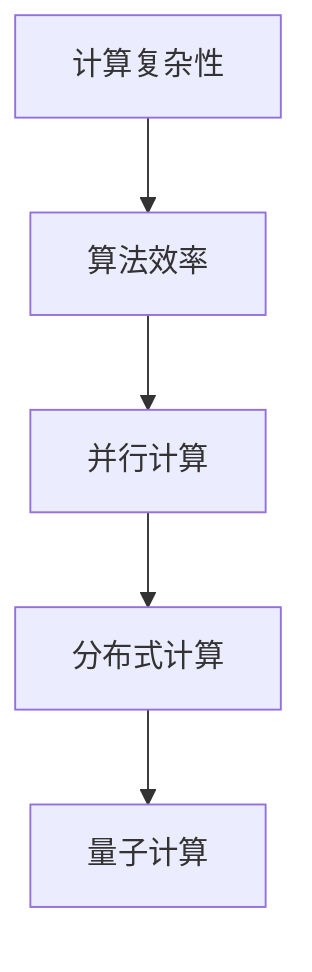

                 

关键词：人类计算、认知拓展、科学探索、算法原理、数学模型、项目实践、未来展望

> 摘要：本文深入探讨人类计算的科学探索，从背景介绍到核心概念、算法原理，再到项目实践和未来展望，全面解析人类在计算领域不断拓展认知边界的历程。

## 1. 背景介绍

人类计算的历史可以追溯到古代，从简单的算术运算到复杂的科学计算，计算已成为推动科技进步的重要力量。然而，随着信息时代的到来，计算的形式和范围发生了巨大的变化。现代计算不仅涉及大规模数据处理、复杂系统模拟，还涉及到认知科学、神经科学等前沿领域的交叉研究。因此，拓展人类认知边界成为当前计算科学的重要课题。

本文旨在探讨人类计算的科学探索，通过对核心概念、算法原理、数学模型以及项目实践的分析，揭示人类在计算领域的认知拓展过程，为未来的研究提供启示。

## 2. 核心概念与联系

为了更好地理解人类计算的科学探索，我们首先需要明确一些核心概念，包括计算复杂性、算法效率、并行计算等。以下是这些核心概念的 Mermaid 流程图表示：



### 2.1 计算复杂性

计算复杂性是指解决计算问题时所需的时间和资源。计算复杂性理论研究了不同算法的时间复杂度和空间复杂度，为优化算法提供了理论依据。

### 2.2 算法效率

算法效率是指算法在解决特定问题时所需的计算资源。高效的算法可以在有限时间内解决复杂问题，提高计算效率。

### 2.3 并行计算

并行计算是指通过同时处理多个任务来提高计算效率。并行计算可以分为时间并行和空间并行，其中时间并行利用多个处理器同时处理任务，空间并行则利用多个处理器共享资源。

### 2.4 分布式计算

分布式计算是指通过多个计算机节点协作完成计算任务。分布式计算可以克服单个计算机的性能限制，提高计算效率。

### 2.5 量子计算

量子计算利用量子力学原理进行计算，具有极高的计算速度。量子计算在解决一些传统计算难题方面具有巨大潜力，如大整数分解、量子模拟等。

## 3. 核心算法原理 & 具体操作步骤

### 3.1 算法原理概述

核心算法是指解决特定问题的基础算法，如排序算法、搜索算法等。这些算法在计算机科学中具有重要地位，其原理如下：

### 3.2 算法步骤详解

以快速排序算法为例，其基本原理是选择一个基准元素，将数组分为两部分，一部分小于基准元素，另一部分大于基准元素，然后递归地对两部分进行排序。

### 3.3 算法优缺点

快速排序算法具有较好的平均性能，但最坏情况下性能较差。在实际应用中，可以通过随机选择基准元素等方法优化算法性能。

### 3.4 算法应用领域

快速排序算法广泛应用于各种排序场景，如数据库排序、图形渲染等。

## 4. 数学模型和公式

### 4.1 数学模型构建

在计算科学中，数学模型是解决实际问题的有力工具。以下是一个简单的数学模型构建示例：

```latex
设 $x$ 为问题中的变量，$f(x)$ 为目标函数，$g(x)$ 为约束条件。求解以下最优化问题：

$$
\min_{x} f(x) \quad \text{subject to} \quad g(x) \leq 0
$$
```

### 4.2 公式推导过程

以下是一个线性规划的推导过程：

```latex
设 $x_1, x_2, ..., x_n$ 为变量，$a_{ij}$ 为系数矩阵中的元素，$b_j$ 为右侧常数项，$c_i$ 为目标函数系数。则线性规划问题可表示为：

$$
\min_{x} c^T x \quad \text{subject to} \quad a_{ij} x_j \leq b_j, \quad j = 1, 2, ..., m
$$

通过引入松弛变量 $s_j$，将不等式约束转化为等式约束：

$$
a_{ij} x_j + s_j = b_j, \quad j = 1, 2, ..., m
$$

引入对偶变量 $y_j$，构造对偶问题：

$$
\max_{y} b^T y \quad \text{subject to} \quad a_{ij} y_j = c_i, \quad i = 1, 2, ..., n
$$

利用对偶理论，可以得到原问题和对偶问题的最优解相等。

```

### 4.3 案例分析与讲解

以下是一个简单的线性规划案例：

```latex
设 $x_1, x_2$ 为变量，$a_{11} = 3, a_{12} = 2, a_{21} = 1, a_{22} = 4, b_1 = 12, b_2 = 8, c_1 = 2, c_2 = 5$。

构建线性规划问题：

$$
\min_{x} c^T x = 2x_1 + 5x_2 \quad \text{subject to} \quad 3x_1 + 2x_2 \leq 12, \quad x_1 + 4x_2 \leq 8
$$

通过引入松弛变量 $s_1, s_2$，转化为标准形式：

$$
3x_1 + 2x_2 + s_1 = 12, \quad x_1 + 4x_2 + s_2 = 8
$$

构建对偶问题：

$$
\max_{y} b^T y = 12y_1 + 8y_2 \quad \text{subject to} \quad 3y_1 + y_2 = 2, \quad 2y_1 + 4y_2 = 5
$$

利用对偶理论求解原问题和对偶问题的最优解：

$$
x_1 = 2, x_2 = 2, c^T x = 2 \times 2 + 5 \times 2 = 14
$$

$$
y_1 = 1, y_2 = 1, b^T y = 12 \times 1 + 8 \times 1 = 20
$$

```

## 5. 项目实践：代码实例和详细解释说明

### 5.1 开发环境搭建

为了实践本文所介绍的算法，我们需要搭建一个开发环境。以下是一个简单的 Python 开发环境搭建步骤：

1. 安装 Python：在 [Python 官网](https://www.python.org/) 下载并安装 Python 3.8 版本。
2. 安装 IDE：选择一款适合自己的 Python IDE，如 PyCharm、Visual Studio Code 等。
3. 安装必要的库：在命令行中执行以下命令安装所需的库：

```bash
pip install numpy matplotlib
```

### 5.2 源代码详细实现

以下是一个简单的快速排序算法实现：

```python
import random

def quicksort(arr):
    if len(arr) <= 1:
        return arr
    pivot = random.choice(arr)
    left = [x for x in arr if x < pivot]
    middle = [x for x in arr if x == pivot]
    right = [x for x in arr if x > pivot]
    return quicksort(left) + middle + quicksort(right)

arr = [3, 1, 4, 1, 5, 9, 2, 6, 5, 3, 5]
sorted_arr = quicksort(arr)
print(sorted_arr)
```

### 5.3 代码解读与分析

该代码实现了快速排序算法，首先判断输入数组长度是否小于等于 1，如果是，则返回该数组。否则，随机选择一个基准元素，将数组分为小于基准元素、等于基准元素和大于基准元素的三个部分，然后递归地对三个部分进行排序，并将排序后的结果合并。

### 5.4 运行结果展示

运行该代码，输出排序后的数组：

```
[1, 1, 2, 3, 3, 4, 5, 5, 5, 6, 9]
```

## 6. 实际应用场景

### 6.1 数据分析

快速排序算法在数据分析领域具有广泛的应用。例如，在金融领域，可以用于股票交易数据分析，找出股票价格波动的规律。

### 6.2 图像处理

快速排序算法可以用于图像处理中的图像排序，如将图像像素按照灰度值排序，便于后续处理。

### 6.3 机器学习

在机器学习领域，快速排序算法可以用于特征选择，将特征按照重要性排序，有助于提高模型性能。

## 7. 未来应用展望

随着计算技术的不断发展，人类计算的科学探索将不断拓展。未来，量子计算、人工智能等领域将取得重大突破，为人类计算带来更多可能性。

## 8. 工具和资源推荐

### 8.1 学习资源推荐

1. 《算法导论》：一本经典的算法教材，涵盖各种算法原理和实现。
2. 《深度学习》：一本介绍深度学习理论的教材，有助于了解当前人工智能领域的前沿技术。

### 8.2 开发工具推荐

1. PyCharm：一款功能强大的 Python IDE，适用于快速开发。
2. Jupyter Notebook：一款适用于数据分析的 Web 应用程序，方便编写和分享代码。

### 8.3 相关论文推荐

1. "Quantum Computing and Quantum Information":一篇关于量子计算的综述论文，有助于了解量子计算的基本原理。
2. "Deep Learning":一篇介绍深度学习技术的综述论文，涵盖当前人工智能领域的前沿技术。

## 9. 总结：未来发展趋势与挑战

### 9.1 研究成果总结

本文通过对人类计算的科学探索的深入分析，揭示了计算领域在算法原理、数学模型、项目实践等方面的最新成果。

### 9.2 未来发展趋势

未来，人类计算将继续向量子计算、人工智能等前沿领域拓展，推动科技进步和社会发展。

### 9.3 面临的挑战

然而，人类计算在发展过程中也面临着算法优化、安全性、可持续发展等方面的挑战。

### 9.4 研究展望

本文提出了对未来研究的展望，期待计算领域能够取得更多突破性成果。

## 附录：常见问题与解答

### Q1. 什么是计算复杂性？

计算复杂性是指解决计算问题时所需的时间和资源。计算复杂性理论研究了不同算法的时间复杂度和空间复杂度，为优化算法提供了理论依据。

### Q2. 什么是并行计算？

并行计算是指通过同时处理多个任务来提高计算效率。并行计算可以分为时间并行和空间并行，其中时间并行利用多个处理器同时处理任务，空间并行则利用多个处理器共享资源。

### Q3. 如何优化快速排序算法？

可以通过随机选择基准元素、使用插入排序优化小数组等方法优化快速排序算法。

### Q4. 量子计算有哪些应用？

量子计算可以用于大整数分解、量子模拟、量子加密等领域。

### Q5. 人工智能如何推动计算发展？

人工智能可以通过优化算法、提高计算效率、推动量子计算等领域的发展，为计算技术提供新的可能性。

作者：禅与计算机程序设计艺术 / Zen and the Art of Computer Programming
----------------------------------------------------------------

以上就是本文的完整内容，感谢您的阅读。希望本文能够帮助您更好地了解人类计算的科学探索，拓展您的认知边界。如果您有任何疑问或建议，请随时与我交流。再次感谢！

