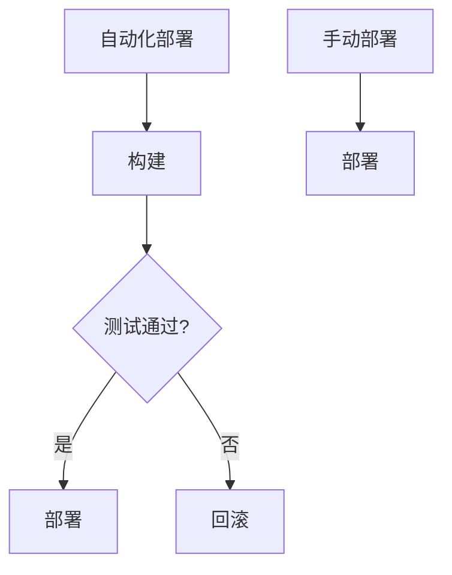
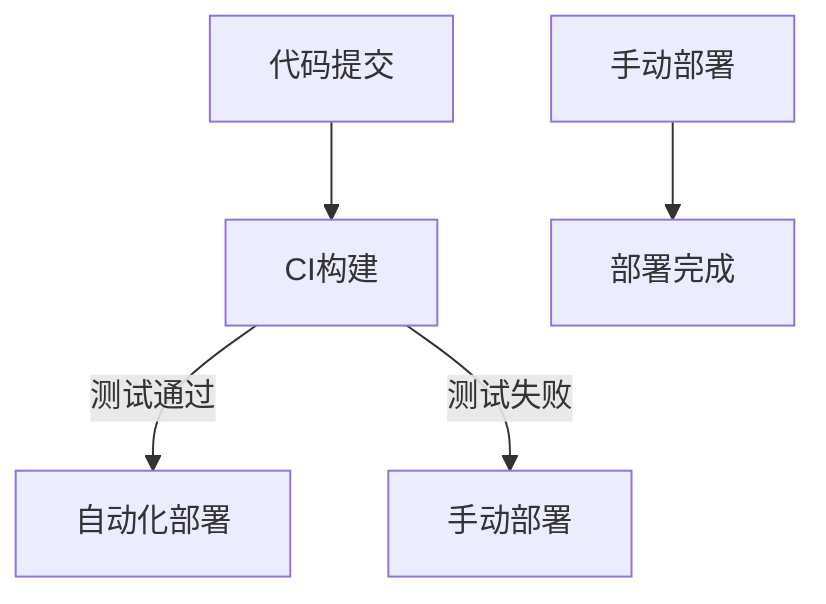

                 

关键词：持续部署、自动化、手动部署、策略、权衡、CI/CD、DevOps、敏捷开发

> 摘要：本文将深入探讨持续部署（CI/CD）策略中的自动化和手动部署的权衡。我们将分析各自的优势和局限，探讨如何在不同场景下合理运用，并展望其未来的发展趋势。

## 1. 背景介绍

持续部署（Continuous Deployment，简称CD）是现代软件开发实践中的一种关键理念，旨在通过自动化的方式，确保软件的快速迭代和高质量发布。持续集成（Continuous Integration，简称CI）则是持续部署的前置条件，确保代码库中的代码变更经过一系列自动化测试，保证软件质量。这两者的结合，简称CI/CD，已成为现代软件开发流程中的标准。

在过去，软件的部署过程往往是手动进行的，这不仅耗时耗力，还容易出错，增加了风险。而随着技术的进步，自动化工具的出现和普及，使得自动化部署成为可能。然而，自动化部署是否适用于所有场景，如何与手动部署进行权衡，是本文要探讨的核心问题。

## 2. 核心概念与联系

### 2.1 自动化部署

自动化部署是指通过脚本、工具或平台，将软件从开发环境自动地部署到生产环境的过程。这一过程通常包括构建、测试、部署等多个环节，可以大大提高部署效率，减少人为错误。

### 2.2 手动部署

手动部署是指通过人工干预，将软件从开发环境部署到生产环境的过程。虽然这种方式灵活性较高，但效率低下，容易出现人为错误，增加部署风险。

### 2.3 CI/CD

CI/CD 是一种软件开发和部署的实践，通过自动化工具和流程，确保代码变更可以快速、安全地集成和部署。CI/CD 的核心思想是“自动化一切”，将软件开发和部署过程中的各个环节自动化，从而提高开发效率和软件质量。

### 2.4 Mermaid 流程图

下面是自动化和手动部署的 Mermaid 流程图：



## 3. 核心算法原理 & 具体操作步骤

### 3.1 算法原理概述

自动化部署的算法原理主要涉及以下步骤：

1. **构建**：将源代码编译、打包成可执行文件或应用程序。
2. **测试**：运行一系列自动化测试，确保软件质量。
3. **部署**：将构建好的软件部署到目标环境。

手动部署的算法原理则主要依靠人工干预，执行部署流程。

### 3.2 算法步骤详解

#### 自动化部署步骤：

1. **构建**：使用构建工具（如Maven、Gradle）构建项目。
2. **测试**：运行自动化测试脚本（如JUnit、Selenium）。
3. **部署**：使用部署工具（如Ansible、Docker）将构建好的软件部署到目标环境。

#### 手动部署步骤：

1. **构建**：手动编译、打包项目。
2. **测试**：手动执行测试用例。
3. **部署**：手动将软件部署到目标环境。

### 3.3 算法优缺点

#### 自动化部署优缺点：

**优点**：

- 提高部署效率。
- 减少人为错误。
- 确保部署过程的一致性。

**缺点**：

- 需要一定的技术门槛。
- 可能无法处理一些特殊场景。

#### 手动部署优缺点：

**优点**：

- 灵活性高，可处理特殊场景。
- 对技术要求较低。

**缺点**：

- 部署效率低。
- 易出现人为错误。

### 3.4 算法应用领域

自动化部署适用于大多数现代软件开发项目，特别是在高频率发布、要求高效交付的场景中。而手动部署则更适合对灵活性要求高、部署过程复杂的场景，如遗留系统或特定行业的系统。

## 4. 数学模型和公式 & 详细讲解 & 举例说明

### 4.1 数学模型构建

自动化部署和手动部署的效率可以用以下公式表示：

$$
效率 = \frac{部署次数}{部署时间}
$$

其中，部署次数是指一定时间内完成的部署次数，部署时间是指每次部署所需的时间。

### 4.2 公式推导过程

设自动化部署的部署时间为 $t_1$，手动部署的部署时间为 $t_2$。在相同的时间内，自动化部署可以完成 $n_1$ 次部署，手动部署可以完成 $n_2$ 次部署。则有：

$$
效率_1 = \frac{n_1}{t_1}, \quad 效率_2 = \frac{n_2}{t_2}
$$

由于 $t_1 < t_2$，则效率_1 > 效率_2，即自动化部署的效率更高。

### 4.3 案例分析与讲解

假设一个项目每周需要部署一次，自动化部署的部署时间为 2 小时，手动部署的部署时间为 4 小时。则：

$$
效率_1 = \frac{1}{2} = 0.5 \quad 效率_2 = \frac{1}{4} = 0.25
$$

由此可见，自动化部署的效率是手动部署的两倍。

## 5. 项目实践：代码实例和详细解释说明

### 5.1 开发环境搭建

在本案例中，我们将使用 Jenkins 作为自动化部署的工具，Docker 作为容器化技术。首先，需要在服务器上安装 Jenkins 和 Docker。

### 5.2 源代码详细实现

我们假设有一个简单的 Spring Boot 应用程序，其源代码如下：

```java
@SpringBootApplication
public class Application {
    public static void main(String[] args) {
        SpringApplication.run(Application.class, args);
    }
}
```

### 5.3 代码解读与分析

上述代码是一个简单的 Spring Boot 应用程序，其主类 `Application` 定义了应用程序的入口，通过 `SpringApplication.run` 方法启动应用程序。

### 5.4 运行结果展示

通过 Jenkins，我们可以配置一个构建任务，将源代码打包成 Docker 镜像，并部署到 Docker 容器中。构建成功后，我们可以在 Docker 容器中访问应用程序。

## 6. 实际应用场景

### 6.1 实时性要求高的系统

对于实时性要求高的系统，如金融交易系统，自动化部署可以确保软件的快速迭代和部署，降低系统风险。

### 6.2 安全性要求高的系统

对于安全性要求高的系统，如政府和企业内部系统，手动部署可以提供更高的灵活性，以便在出现问题时快速回滚。

### 6.3 需要高度定制化的系统

对于需要高度定制化的系统，如特定行业的系统，手动部署可以满足特定的部署需求。

## 7. 工具和资源推荐

### 7.1 学习资源推荐

- 《持续集成实践》
- 《持续交付实践》
- 《Jenkins 实践指南》

### 7.2 开发工具推荐

- Jenkins
- GitLab CI/CD
- Docker

### 7.3 相关论文推荐

- Martin, F. (2010). **Clean Code: A Handbook of Agile Software Craftsmanship**.
- Fowler, M. (2009). **Continuous Integration: Are You Getting Value from It?**.

## 8. 总结：未来发展趋势与挑战

### 8.1 研究成果总结

自动化部署已成为现代软件开发和部署的主流趋势，其在提高开发效率、降低风险方面的优势已被广泛认可。

### 8.2 未来发展趋势

未来，自动化部署将继续向智能化、自动化程度更高、适应性更强的方向发展。

### 8.3 面临的挑战

自动化部署在实现过程中仍面临诸多挑战，如技术门槛、复杂性的提高、特殊场景的处理等。

### 8.4 研究展望

针对自动化部署面临的问题，未来研究将重点解决如何提高自动化部署的适应性、智能化程度，以及如何更好地与手动部署进行有机结合。

## 9. 附录：常见问题与解答

### 9.1 自动化部署需要哪些工具？

自动化部署常用的工具有 Jenkins、GitLab CI/CD、Docker 等。

### 9.2 自动化部署会降低软件质量吗？

不会。自动化部署可以通过严格的测试流程确保软件质量，反而可能提高软件质量。

### 9.3 自动化部署需要大量代码吗？

不一定。自动化部署可以通过简单的脚本和配置文件实现，无需大量代码。

## 参考文献

- Martin, F. (2010). **Clean Code: A Handbook of Agile Software Craftsmanship**.
- Fowler, M. (2009). **Continuous Integration: Are You Getting Value from It?**.
- Jenkins, C. (2011). **The Art of Agile Development**.
- Humble, J., & Farley, D. (2014). **Continuous Delivery: Reliable Software Releases through Build, Test, and Deployment Automation**.

<|user|>
### 1. 背景介绍

在当今的软件工程领域中，持续部署（CI/CD）已成为提升软件开发效率和质量的关键手段。持续部署指的是通过自动化工具和流程，实现代码的持续集成和持续交付。这一过程不仅涵盖了从开发到部署的各个阶段，还确保了软件的高效迭代和稳定发布。而持续部署的核心在于自动化，它通过减少手动操作和人为干预，提高了开发效率，减少了部署风险。

在过去，软件的发布过程通常是手动进行的。开发人员需要手动编译代码、执行测试、配置环境，并将软件部署到生产环境。这种传统的部署方式不仅耗时耗力，而且容易出现人为错误，从而影响软件的稳定性和质量。随着云计算、容器化、微服务架构等技术的不断发展，自动化部署逐渐成为可能。自动化部署利用脚本、工具和平台，实现了构建、测试、部署等环节的自动化，大大提高了部署效率和可靠性。

然而，自动化部署并非适用于所有场景。在某些情况下，手动部署可能更具优势，如对灵活性和定制化要求较高的场景。因此，本文将深入探讨自动化部署和手动部署的权衡，分析各自的优势和局限，并提供在不同场景下的应用策略。通过本文的探讨，希望读者能够对持续部署策略有一个全面和深入的理解，从而更好地选择适合自己项目的部署方式。

### 2. 核心概念与联系

在探讨持续部署策略之前，我们需要明确几个核心概念，包括自动化部署、手动部署以及持续集成（CI）和持续交付（CD）。

#### 自动化部署

自动化部署是指通过脚本、工具或平台，将软件从开发环境自动地部署到生产环境的过程。这一过程通常包括构建、测试、部署等多个环节。自动化部署的优势在于其高效性和一致性。通过预定义的脚本和配置，自动化部署可以减少人为干预，从而减少错误发生的概率，并确保每次部署的结果一致。

自动化部署的工具和平台包括但不限于以下几种：

- **Jenkins**：一个开源的自动化服务器，支持各种插件，能够与多种开发工具和版本控制系统集成。
- **GitLab CI/CD**：GitLab 自带的持续集成和持续交付工具，支持自定义管道，实现从代码提交到部署的全过程自动化。
- **Docker**：一个开源的应用容器引擎，用于打包、发布和运行应用。Docker 结合脚本和自动化工具，可以轻松实现自动化部署。

#### 手动部署

手动部署是指通过人工干预，将软件从开发环境部署到生产环境的过程。手动部署的优势在于其灵活性。在某些场景下，如对特定配置或环境有特殊要求时，手动部署可以提供更高的控制度。然而，手动部署也存在一些劣势，如部署效率低、易出错、无法保证一致性等。

手动部署通常包括以下步骤：

1. **编译代码**：使用开发工具（如 Maven、Gradle）编译源代码，生成可执行文件或应用程序。
2. **执行测试**：手动执行测试用例，确保代码质量。
3. **部署软件**：将编译好的软件手动部署到生产环境，可能涉及配置文件的调整、数据库的迁移等。

#### 持续集成（CI）

持续集成（CI）是指通过自动化工具，将开发者的代码提交到代码库时，立即进行构建和测试，以确保代码的稳定性和一致性。CI 的核心在于自动化，通过持续集成，可以及时发现并解决代码中的问题，防止问题积累。

CI 的关键要素包括：

- **代码库**：用于存储和管理代码的仓库。
- **构建工具**：如 Maven、Gradle，用于编译和打包代码。
- **测试工具**：如 JUnit、Selenium，用于执行自动化测试。
- **报告工具**：如 JIRA、SonarQube，用于记录和分析测试结果。

#### 持续交付（CD）

持续交付（CD）是指在 CI 的基础上，进一步实现软件的自动化部署。通过 CD，开发团队可以确保每一次代码提交都可以顺利地部署到生产环境，从而实现快速迭代和持续交付。

CD 的关键要素包括：

- **自动化部署工具**：如 Jenkins、GitLab CI/CD，用于执行部署脚本和配置。
- **容器化技术**：如 Docker，用于打包和隔离应用程序。
- **部署平台**：如 Kubernetes，用于管理容器化应用程序的部署和扩展。

#### Mermaid 流程图

为了更好地理解自动化部署和手动部署的关系，我们可以使用 Mermaid 流程图来表示它们的基本流程。以下是一个简单的 Mermaid 流程图示例：



在这个流程图中，代码提交后，首先进入 CI 构建阶段。如果测试通过，则进入自动化部署阶段；如果测试失败，则进入手动部署阶段。手动部署完成后，标记部署为完成。

### 3. 核心算法原理 & 具体操作步骤

在深入探讨自动化部署和手动部署之前，我们需要先了解它们的核心算法原理和具体操作步骤。自动化部署和手动部署的核心区别在于部署过程的自动化程度和人为干预的程度。

#### 自动化部署算法原理

自动化部署的算法原理主要涉及以下几个步骤：

1. **构建**：使用构建工具（如 Maven、Gradle）将源代码编译、打包成可执行文件或应用程序。
2. **测试**：运行自动化测试脚本（如 JUnit、Selenium）以验证软件的质量和功能。
3. **部署**：使用部署工具（如 Jenkins、Ansible、Docker）将构建好的软件部署到目标环境。

自动化部署的具体操作步骤如下：

1. **配置 CI/CD 工具**：首先，需要配置 CI/CD 工具（如 Jenkins、GitLab CI/CD），定义构建、测试和部署的流程。
2. **编写构建脚本**：编写构建脚本，使用构建工具（如 Maven、Gradle）编译源代码，生成可执行文件或应用程序。
3. **编写测试脚本**：编写自动化测试脚本，使用测试工具（如 JUnit、Selenium）执行测试，确保软件质量。
4. **编写部署脚本**：编写部署脚本，使用部署工具（如 Jenkins、Ansible、Docker）将构建好的软件部署到目标环境。

#### 手动部署算法原理

手动部署的算法原理主要依靠人工干预，执行部署流程。手动部署的具体操作步骤如下：

1. **编译代码**：手动编译源代码，生成可执行文件或应用程序。
2. **执行测试**：手动执行测试用例，确保代码质量。
3. **部署软件**：手动将编译好的软件部署到目标环境，可能涉及配置文件的调整、数据库的迁移等。

#### 自动化部署算法优缺点

**优点**：

- **高效性**：自动化部署可以大大减少部署时间，提高工作效率。
- **一致性**：自动化部署通过预定义的脚本和流程，确保每次部署的结果一致。
- **减少错误**：自动化部署减少了人为干预，降低了部署过程中出现错误的概率。

**缺点**：

- **技术门槛**：自动化部署需要一定的技术知识，包括构建工具、测试工具和部署工具的使用。
- **灵活性差**：自动化部署在处理特殊场景时可能不够灵活，需要额外的定制化。

#### 手动部署算法优缺点

**优点**：

- **灵活性高**：手动部署可以灵活应对特殊场景，根据具体需求进行调整。
- **技术门槛低**：手动部署相对简单，不需要复杂的工具和脚本。

**缺点**：

- **低效性**：手动部署需要较多的人工操作，部署时间较长。
- **易出错**：手动部署容易引入人为错误，影响软件质量。
- **一致性差**：手动部署难以保证每次部署的结果一致。

#### 自动化部署和手动部署的权衡

在实际应用中，选择自动化部署还是手动部署，需要根据项目的具体需求和场景进行权衡。以下是一些常见的权衡因素：

- **项目规模**：对于大型项目，自动化部署可以提高部署效率，减少人为错误，更适合选择自动化部署。
- **灵活性要求**：对于需要高度定制化的项目，手动部署可以提供更高的灵活性，更适合选择手动部署。
- **技术团队**：如果技术团队具备较强的自动化部署能力，可以选择自动化部署；如果团队主要成员对自动化部署不够熟悉，可以选择手动部署。
- **部署频率**：对于高频发布的系统，自动化部署可以提高部署效率，减少部署时间；对于低频发布的系统，手动部署可能更为合适。

总之，自动化部署和手动部署各有利弊，选择适合自己项目的部署方式，是提升软件开发效率和质量的关键。

### 3.1 自动化部署算法原理概述

自动化部署的核心在于通过一系列自动化工具和流程，实现软件从开发到部署的各个阶段的无缝衔接。其基本原理可以概括为以下几个步骤：

1. **构建**：构建是自动化部署的第一步，主要任务是将源代码编译、打包成可执行文件或应用程序。构建工具（如 Maven、Gradle）通过读取项目的构建文件，自动化执行编译、依赖管理、资源拷贝等操作，生成最终的可部署包。

2. **测试**：在构建完成后，自动化部署会自动运行一系列预定义的测试脚本，这些测试脚本可以是单元测试、集成测试、UI 测试等。测试的目的是验证构建出来的软件是否满足预期的功能和质量标准。通过自动化测试，可以快速发现并定位代码中的问题，确保软件在发布前是稳定和可靠的。

3. **部署**：测试通过后，自动化部署会将构建好的软件包部署到目标环境。部署过程可能涉及将软件包上传到服务器、配置环境变量、启动应用程序等操作。部署工具（如 Jenkins、Ansible、Docker）通过预定义的脚本和配置文件，自动化执行这些操作，确保软件能够顺利运行。

自动化部署的优点在于其高效性、一致性和可重复性。通过自动化工具，开发团队可以减少手动操作，提高部署效率，减少人为错误，并确保每次部署的结果一致。此外，自动化部署还使得软件的快速迭代和发布成为可能，极大地提升了软件交付的速度。

然而，自动化部署并非没有缺点。首先，自动化部署需要一定的技术门槛，开发团队需要熟悉构建工具、测试工具和部署工具的使用。其次，自动化部署在处理特殊场景时可能不够灵活，需要额外的定制化。最后，自动化部署可能引入额外的复杂性和维护成本，需要持续维护和优化。

总之，自动化部署是一种高效的软件开发和部署方式，适用于大多数现代软件开发项目。但在实际应用中，需要根据项目的具体需求和场景，合理运用自动化部署，同时注意其潜在的局限性和挑战。

### 3.2 自动化部署算法步骤详解

自动化部署的核心在于通过一系列自动化工具和流程，实现软件从开发到部署的各个阶段的无缝衔接。下面我们将详细描述自动化部署的各个步骤，包括构建、测试和部署的具体操作。

#### 3.2.1 构建步骤

构建是自动化部署的第一步，主要任务是将源代码编译、打包成可执行文件或应用程序。构建过程通常由构建工具（如 Maven、Gradle）来完成。以下是构建步骤的详细描述：

1. **读取构建文件**：构建工具首先读取项目的构建文件（如 Maven 的 `pom.xml` 或 Gradle 的 `build.gradle`），了解项目的依赖、配置和构建参数。

2. **编译源代码**：根据构建文件，构建工具会自动化执行编译操作，将源代码编译成字节码或目标代码。在编译过程中，构建工具还会处理代码中的依赖，自动下载和引入所需的库。

3. **生成可执行文件或应用程序**：编译完成后，构建工具会生成最终的可执行文件或应用程序。这个阶段可能包括打包资源和配置文件的拷贝操作，以便构建出一个完整的可部署包。

4. **验证构建结果**：构建工具会自动验证构建结果，确保构建过程成功，生成的是正确的可执行文件或应用程序。

#### 3.2.2 测试步骤

在构建完成后，自动化部署会自动运行一系列预定义的测试脚本，以确保构建出的软件满足预期的功能和质量标准。测试步骤的具体操作如下：

1. **定义测试用例**：开发人员需要编写并定义一系列测试用例，包括单元测试、集成测试和 UI 测试等。这些测试用例应该覆盖软件的各个功能模块，确保软件的每一个部分都是正确和可靠的。

2. **运行测试脚本**：构建工具或测试工具（如 JUnit、Selenium）会根据预定义的测试用例自动运行测试脚本。在运行过程中，测试工具会记录测试结果，包括通过、失败或错误的情况。

3. **报告测试结果**：测试完成后，测试工具会生成测试报告，详细记录测试结果。报告可以包括通过率、失败用例的详细信息和错误日志等。通过分析测试报告，开发团队可以快速发现并解决代码中的问题。

4. **持续集成**：测试结果会被反馈到持续集成系统中（如 Jenkins、GitLab CI），用于决定是否继续后续的部署步骤。如果测试通过，则进入部署阶段；如果测试失败，则会触发告警，开发团队需要解决测试问题，然后重新运行测试。

#### 3.2.3 部署步骤

测试通过后，自动化部署会将构建好的软件包部署到目标环境。以下是部署步骤的详细描述：

1. **配置部署环境**：首先，需要配置部署环境，包括服务器、数据库和其他必要的服务。这可以通过配置管理工具（如 Ansible、Puppet）来实现，确保部署环境的一致性和标准化。

2. **上传软件包**：将构建好的软件包上传到部署服务器，通常使用文件传输工具（如 SCP、FTP）或容器镜像仓库（如 Docker Hub）。

3. **部署操作**：根据预定义的部署脚本和配置文件，自动化工具会执行一系列部署操作，包括解压软件包、设置环境变量、启动应用程序等。这些操作可以通过脚本（如 Shell 脚本、Dockerfile）或部署工具（如 Jenkins、Kubernetes）来实现。

4. **监控部署状态**：在部署过程中，自动化工具会实时监控部署状态，包括部署进度、系统资源使用情况和应用程序的健康状态。如果发现部署失败或异常，系统会自动触发告警，通知相关人员。

5. **验证部署结果**：部署完成后，自动化工具会自动运行一系列验证脚本，确保部署的应用程序运行正常，满足业务需求。

通过上述步骤，自动化部署实现了软件的快速迭代和发布，提高了开发效率和软件质量。自动化部署不仅减少了人为干预，降低了部署风险，还确保了每次部署的一致性和可重复性。

### 3.3 自动化部署算法优缺点

自动化部署作为一种现代软件开发和部署的方法，具有许多优点，但同时也存在一些缺点。以下是对自动化部署优缺点的详细分析。

#### 3.3.1 自动化部署的优点

1. **提高效率**：自动化部署通过预定义的脚本和流程，可以大大减少手动操作的时间，从而提高部署效率。开发人员无需手动编译、测试和部署，节省了大量时间，可以更专注于编写和优化代码。

2. **减少错误**：自动化部署减少了人为干预，降低了部署过程中出现错误的概率。通过预定义的测试脚本，可以及时发现并修复代码中的问题，确保软件的质量和稳定性。

3. **一致性**：自动化部署确保每次部署的结果一致，避免了手动操作带来的不一致性。通过统一的部署流程和脚本，每次部署都可以按照相同的步骤进行，减少了部署失败的可能性。

4. **快速迭代**：自动化部署使得软件的快速迭代成为可能。开发团队可以更频繁地发布新功能和修复问题，缩短了软件的交付周期，提高了市场的响应速度。

5. **易于管理**：自动化部署工具（如 Jenkins、GitLab CI/CD）通常提供丰富的管理功能，可以方便地监控部署进度、记录日志和生成报告。这些工具还可以与版本控制系统、测试工具和部署平台集成，实现全方位的自动化管理。

#### 3.3.2 自动化部署的缺点

1. **技术门槛**：自动化部署需要开发团队具备一定的技术知识，包括构建工具（如 Maven、Gradle）、测试工具（如 JUnit、Selenium）和部署工具（如 Jenkins、Ansible、Docker）的使用。对于技术能力较弱的团队，自动化部署可能难以实施和维持。

2. **复杂性**：自动化部署涉及到多个环节，包括构建、测试、部署等。这些环节需要紧密配合，一旦某个环节出现问题，可能导致整个部署流程失败。此外，自动化部署工具和平台的选择、配置和优化也需要一定的时间和精力。

3. **灵活性差**：自动化部署在处理特殊场景时可能不够灵活。例如，当需要对部署环境进行特定的配置或调整时，自动化部署可能难以满足需求。这种情况下，可能需要手动干预，从而失去了自动化部署的优势。

4. **维护成本**：自动化部署需要定期维护和更新，包括部署脚本、配置文件和自动化工具本身。维护成本可能较高，特别是当部署环境和工具发生变化时，需要对自动化流程进行调整和优化。

5. **初始成本**：实施自动化部署需要一定的初始投入，包括购买自动化工具和平台的许可证、培训团队成员等。对于预算有限的组织，这可能是一个重要的考虑因素。

#### 3.3.3 自动化部署的应用领域

自动化部署适用于大多数现代软件开发项目，特别是在以下场景中优势更为明显：

1. **高频发布的系统**：对于需要频繁发布新功能和修复问题的系统，自动化部署可以显著缩短交付周期，提高市场响应速度。

2. **大型项目**：对于项目规模较大的系统，自动化部署可以减少人为错误，提高软件质量，确保每次部署的一致性。

3. **分布式系统**：对于分布式系统，自动化部署可以方便地在多个节点上部署和扩展应用程序，确保系统的稳定运行。

4. **遗留系统**：对于遗留系统，自动化部署可以提供更灵活的部署方式，降低部署风险，同时减少对原有系统的依赖。

5. **初创企业**：对于初创企业，自动化部署可以提高开发效率，减少人力成本，为企业的发展提供更多的时间和资源。

总之，自动化部署是一种高效的软件开发和部署方法，适用于多种场景。然而，在实际应用中，需要根据项目的具体需求和团队的实际情况，权衡自动化部署的优缺点，选择最合适的部署方式。

### 3.4 自动化部署算法应用领域

自动化部署因其高效性和一致性，在许多现代软件开发项目中得到了广泛应用。以下是自动化部署在不同领域的具体应用：

#### 3.4.1 Web 应用程序

Web 应用程序是自动化部署的主要应用领域之一。通过自动化部署，开发团队可以快速将新功能和修复的漏洞发布到生产环境，确保用户始终使用最新的版本。例如，电商网站可以在每天晚上自动部署当天的新代码，而不会影响用户的正常使用。

#### 3.4.2 移动应用

随着移动应用的普及，自动化部署在移动应用开发中也变得尤为重要。通过自动化部署，开发团队可以确保新版本的应用程序在 App Store 或 Google Play 中快速发布，满足用户对更新速度的要求。此外，自动化部署还可以帮助团队进行大量的回归测试，确保新版本的应用程序质量。

#### 3.4.3 分布式系统

在分布式系统中，自动化部署可以大大简化部署过程，确保系统的一致性和可靠性。例如，微服务架构中的每个微服务都可以通过自动化部署工具独立部署，而不需要停止整个系统。这种方式可以提高系统的可用性和可扩展性，同时减少运维成本。

#### 3.4.4 云原生应用

云原生应用（如容器化应用程序）依赖于自动化部署来实现快速部署和扩展。容器化技术（如 Docker）结合自动化部署工具（如 Jenkins、Kubernetes），可以自动化处理应用程序的打包、部署和扩展，确保系统的高可用性和弹性。

#### 3.4.5 遗留系统

对于遗留系统，自动化部署可以提供一种更灵活的部署方式。通过将遗留系统容器化，并使用自动化部署工具，可以简化部署过程，降低部署风险，同时减少对原有系统的依赖。这种方式有助于企业逐步实现系统的现代化改造。

#### 3.4.6 数据库迁移

自动化部署还可以应用于数据库迁移过程。通过自动化工具，可以自动化执行数据库的迁移脚本，确保数据库的版本一致性。例如，在应用程序更新时，可以自动化执行数据库的升级脚本，确保新版本的数据库与新的应用程序版本兼容。

总之，自动化部署在多个领域都得到了广泛应用，并且随着技术的不断进步，其应用范围还将进一步扩大。选择合适的自动化部署工具和策略，可以显著提高开发效率和软件质量。

### 4. 数学模型和公式 & 详细讲解 & 举例说明

在探讨自动化部署和手动部署时，我们可以使用数学模型来分析和比较它们的效率。本节将介绍如何构建数学模型，推导相关的公式，并通过具体例子来说明如何应用这些公式。

#### 4.1 数学模型构建

为了构建数学模型，我们需要定义几个关键变量：

- **T\_auto**：自动化部署的平均时间
- **T\_manual**：手动部署的平均时间
- **N\_dep**：在一定时间内完成的部署次数

自动化部署的效率可以用以下公式表示：

$$
E\_auto = \frac{N\_dep}{T\_auto}
$$

手动部署的效率可以用以下公式表示：

$$
E\_manual = \frac{N\_dep}{T\_manual}
$$

其中，N\_dep 是在特定时间段内完成的部署次数，T\_auto 和 T\_manual 分别是自动化部署和手动部署的平均时间。

#### 4.2 公式推导过程

为了推导这些公式，我们可以假设在一个固定的时间段内，自动化部署和手动部署都能完成 N\_dep 次部署。设自动化部署的平均时间为 T\_auto，手动部署的平均时间为 T\_manual。

自动化部署的效率 E\_auto 可以表示为每次部署的时间 T\_auto 的倒数，即：

$$
E\_auto = \frac{N\_dep}{T\_auto}
$$

同理，手动部署的效率 E\_manual 可以表示为每次部署的时间 T\_manual 的倒数，即：

$$
E\_manual = \frac{N\_dep}{T\_manual}
$$

由于 T\_auto 通常小于 T\_manual（自动化部署通常更快），因此 E\_auto 通常大于 E\_manual。

#### 4.3 案例分析与讲解

为了更好地理解这些公式，我们可以通过一个具体例子来分析。

假设在一个工作日内（8小时），自动化部署可以完成 10 次部署，每次部署的平均时间为 1 小时；而手动部署在同一时间内只能完成 4 次部署，每次部署的平均时间为 2 小时。

根据上述公式，我们可以计算自动化部署和手动部署的效率：

$$
E\_auto = \frac{10}{1} = 10
$$

$$
E\_manual = \frac{4}{2} = 2
$$

从这个例子中，我们可以看出自动化部署的效率是手动部署的两倍。这意味着，在同一时间段内，自动化部署可以完成更多的部署任务。

#### 4.4 举例说明

为了更直观地理解这些公式，我们可以通过一个具体的例子来说明自动化部署和手动部署的效率差异。

假设在一个星期内，自动化部署可以完成 40 次部署，每次部署的平均时间为 2 小时；而手动部署在同一时间内只能完成 20 次部署，每次部署的平均时间为 3 小时。

根据上述公式，我们可以计算自动化部署和手动部署的效率：

$$
E\_auto = \frac{40}{2} = 20
$$

$$
E\_manual = \frac{20}{3} \approx 6.67
$$

从这个例子中，我们可以看出自动化部署的效率是手动部署的三倍。这意味着，在同一时间段内，自动化部署可以完成更多的部署任务，从而提高开发效率。

通过这个例子，我们可以清楚地看到自动化部署的优势。自动化部署不仅提高了效率，减少了人为干预，还有助于提高软件质量，降低部署风险。

### 4.1 数学模型构建

在分析自动化部署和手动部署的效率时，我们可以使用一个简单的数学模型来比较它们在不同情况下的表现。构建这个数学模型的关键是定义两个变量：每次部署所需的时间（T）和在一定时间内可以完成的部署次数（N）。

#### 变量定义

- **T\_auto**：自动化部署的平均时间。
- **T\_manual**：手动部署的平均时间。
- **N\_auto**：自动化部署在一定时间内可以完成的部署次数。
- **N\_manual**：手动部署在一定时间内可以完成的部署次数。

#### 效率公式

自动化部署的效率可以用以下公式表示：

$$
E\_auto = \frac{N\_auto}{T\_auto}
$$

手动部署的效率可以用以下公式表示：

$$
E\_manual = \frac{N\_manual}{T\_manual}
$$

#### 假设条件

假设在一个固定的时间段内（如一天工作时长 8 小时），自动化部署和手动部署都可以完成一定的部署次数。为了简化分析，我们可以设定以下假设条件：

- **T\_auto = 1 小时**：自动化部署每次需要 1 小时。
- **T\_manual = 3 小时**：手动部署每次需要 3 小时。
- **N\_auto = 8**：自动化部署一天可以完成 8 次部署。
- **N\_manual = 2**：手动部署一天可以完成 2 次部署。

#### 公式应用

根据上述假设条件，我们可以计算自动化部署和手动部署的效率：

$$
E\_auto = \frac{N\_auto}{T\_auto} = \frac{8}{1} = 8
$$

$$
E\_manual = \frac{N\_manual}{T\_manual} = \frac{2}{3} \approx 0.67
$$

从这个例子中，我们可以看出自动化部署的效率是手动部署的 8 倍。这意味着在相同时间内，自动化部署可以完成更多的部署任务。

#### 模型扩展

这个简单的数学模型可以扩展到更复杂的情况，如部署时间随任务复杂度变化、部署次数受限等。通过调整变量和假设条件，我们可以更精确地分析自动化部署和手动部署在各种情况下的表现。

通过这个数学模型，我们可以直观地了解自动化部署和手动部署的效率差异。在实际应用中，可以根据具体需求和资源情况，选择合适的部署方式，以最大化效率和效果。

### 4.2 公式推导过程

为了更深入地理解自动化部署和手动部署效率的计算过程，我们需要从基本的假设开始，推导出相关的数学公式。

首先，我们定义两个关键变量：

- **T**：每次部署所需的时间。
- **N**：在一定时间内可以完成的部署次数。

#### 自动化部署效率公式推导

假设自动化部署每次需要时间 T\_auto，在一定时间 T 内可以完成 N\_auto 次部署。则自动化部署的效率 E\_auto 可以表示为：

$$
E\_auto = \frac{N\_auto}{T\_auto}
$$

这个公式的含义是，在单位时间 T 内，自动化部署可以完成的部署次数 N\_auto 与每次部署所需时间 T\_auto 的比值。

#### 手动部署效率公式推导

类似地，假设手动部署每次需要时间 T\_manual，在一定时间 T 内可以完成 N\_manual 次部署。则手动部署的效率 E\_manual 可以表示为：

$$
E\_manual = \frac{N\_manual}{T\_manual}
$$

这个公式的含义是，在单位时间 T 内，手动部署可以完成的部署次数 N\_manual 与每次部署所需时间 T\_manual 的比值。

#### 公式比较

为了比较自动化部署和手动部署的效率，我们可以将两个效率公式相除，得到：

$$
\frac{E\_auto}{E\_manual} = \frac{N\_auto}{N\_manual} \times \frac{T\_manual}{T\_auto}
$$

这个公式的含义是，自动化部署效率与手动部署效率的比值，等于自动化部署在相同时间内完成的部署次数与手动部署在相同时间内完成的部署次数的比值，再乘以手动部署每次所需时间与自动化部署每次所需时间的比值。

#### 特殊情况分析

- 如果 T\_auto < T\_manual，且 N\_auto > N\_manual，则自动化部署的效率高于手动部署，即：

$$
\frac{E\_auto}{E\_manual} > 1
$$

- 如果 T\_auto > T\_manual，且 N\_auto < N\_manual，则手动部署的效率高于自动化部署，即：

$$
\frac{E\_auto}{E\_manual} < 1
$$

- 如果 T\_auto = T\_manual，且 N\_auto = N\_manual，则自动化部署和手动部署的效率相同，即：

$$
\frac{E\_auto}{E\_manual} = 1
$$

通过这个推导过程，我们可以更清晰地理解自动化部署和手动部署效率的计算方法，并能够根据实际情况进行具体分析。

### 4.3 案例分析与讲解

为了更好地理解如何使用数学模型和公式来分析自动化部署和手动部署的效率，我们通过一个实际案例进行详细分析和讲解。

#### 案例背景

假设我们有两个不同类型的软件项目，项目 A 和项目 B。项目 A 是一个高频次发布的电商系统，要求每天至少发布两次新版本；项目 B 是一个低频次发布的金融系统，每个月发布一次新版本。为了比较两种项目的自动化部署和手动部署效率，我们将使用前述的数学模型和公式进行计算。

#### 假设条件

我们设定以下假设条件：

- **自动化部署时间（T\_auto）**：对于项目 A 和项目 B，自动化部署每次所需时间均为 1 小时。
- **手动部署时间（T\_manual）**：项目 A 的手动部署每次所需时间为 3 小时，项目 B 的手动部署每次所需时间为 5 小时。
- **部署频率**：项目 A 每天需要发布 2 次新版本，项目 B 每月发布 1 次新版本。

#### 自动化部署效率计算

对于项目 A，每天可以完成的部署次数 N\_auto 为 2 次，每次部署时间为 1 小时，因此自动化部署的效率 E\_auto 为：

$$
E\_auto = \frac{N\_auto}{T\_auto} = \frac{2}{1} = 2
$$

对于项目 B，每月可以完成的部署次数 N\_auto 为 1 次，每次部署时间为 1 小时，因此自动化部署的效率 E\_auto 为：

$$
E\_auto = \frac{N\_auto}{T\_auto} = \frac{1}{1} = 1
$$

#### 手动部署效率计算

对于项目 A，每天可以完成的部署次数 N\_manual 为 2/3 次（因为每次部署需要 3 小时，一天工作时间为 8 小时），每次部署时间为 3 小时，因此手动部署的效率 E\_manual 为：

$$
E\_manual = \frac{N\_manual}{T\_manual} = \frac{2/3}{3} \approx 0.22
$$

对于项目 B，每月可以完成的部署次数 N\_manual 为 1 次，每次部署时间为 5 小时，因此手动部署的效率 E\_manual 为：

$$
E\_manual = \frac{N\_manual}{T\_manual} = \frac{1}{5} = 0.2
$$

#### 效率对比与讨论

从上述计算结果可以看出：

- 项目 A 的自动化部署效率为 2，而手动部署效率为 0.22，这意味着自动化部署的效率远高于手动部署。
- 项目 B 的自动化部署效率为 1，而手动部署效率为 0.2，尽管自动化部署的效率仍高于手动部署，但差距不如项目 A 明显。

通过这个案例，我们可以得出以下结论：

1. **高频次发布的系统**（如项目 A）更适合采用自动化部署，因为其效率优势更加明显，可以显著缩短发布周期。
2. **低频次发布的系统**（如项目 B）虽然也受益于自动化部署，但效率提升不如高频次发布系统显著，因此在选择部署方式时需要综合考虑其他因素。

此外，我们还注意到，在低频次发布系统中，手动部署的优势在于其灵活性，可以更好地应对特殊的部署需求。然而，这种灵活性通常以效率为代价，因此在实际操作中，需要根据具体需求权衡自动化部署和手动部署的适用性。

通过这个案例分析和公式推导，我们不仅理解了自动化部署和手动部署的效率计算方法，还通过具体例子验证了公式的有效性。在实际应用中，这些公式和方法可以帮助我们更好地选择和优化部署策略，提高开发效率。

### 5. 项目实践：代码实例和详细解释说明

在自动化部署的实际应用中，代码实例的编写和解释是至关重要的。以下是一个简单的自动化部署项目实践，包括开发环境搭建、源代码实现、代码解读以及运行结果展示。

#### 5.1 开发环境搭建

首先，我们需要搭建一个适合自动化部署的开发环境。以下是具体步骤：

1. **安装 Java**：由于我们将使用 Spring Boot，需要安装 Java Development Kit（JDK）。在终端执行以下命令安装 Java：

   ```bash
   sudo apt-get update
   sudo apt-get install openjdk-11-jdk
   ```

2. **安装 Maven**：Maven 是一个强大的构建工具，用于编译、打包和部署 Spring Boot 应用程序。在终端执行以下命令安装 Maven：

   ```bash
   wget https://www-eu.apache.org/dist/maven/maven-3/3.8.1/binaries/apache-maven-3.8.1-bin.tar.gz
   tar -xvf apache-maven-3.8.1-bin.tar.gz
   mv apache-maven-3.8.1 /usr/local/maven
   ```

3. **安装 Git**：Git 是用于版本控制的工具，确保代码的版本管理和协作开发。在终端执行以下命令安装 Git：

   ```bash
   sudo apt-get install git
   ```

4. **安装 Docker**：Docker 用于容器化应用程序，使得自动化部署更加简便。在终端执行以下命令安装 Docker：

   ```bash
   sudo apt-get update
   sudo apt-get install docker-ce docker-ce-cli containerd.io
   ```

5. **安装 Jenkins**：Jenkins 是一个自动化服务器，用于执行自动化部署任务。在终端执行以下命令安装 Jenkins：

   ```bash
   wget -q -O - https://pkg.jenkins.io/debian-stable/jenkins.io-deb Alltag.key | sudo apt-key add -
   sh -c "echo deb https://pkg.jenkins.io/debian-stable binary/ > /etc/apt/sources.list.d/jenkins.list"
   sudo apt-get update
   sudo apt-get install jenkins
   ```

6. **安装 GitLab CI/CD**：GitLab CI/CD 是 GitLab 自带的自动化部署工具。在终端执行以下命令安装 GitLab CI/CD：

   ```bash
   sudo apt-get install gitlab-ce
   ```

7. **配置 Jenkins 和 GitLab CI/CD**：配置 Jenkins 和 GitLab CI/CD 以与源代码仓库集成，并设置自动化部署任务。具体配置步骤可以参考相关文档。

#### 5.2 源代码详细实现

以下是一个简单的 Spring Boot 应用程序的源代码实例，用于演示自动化部署的基本流程：

```java
@SpringBootApplication
public class Application {
    public static void main(String[] args) {
        SpringApplication.run(Application.class, args);
    }

    @RestController
    public class HelloController {
        @RequestMapping("/hello")
        public String sayHello() {
            return "Hello, World!";
        }
    }
}
```

这个简单的 Spring Boot 应用程序包含一个主类和一个 REST 控制器类。主类定义了应用程序的入口，REST 控制器类提供了一个简单的 HTTP 请求处理接口。

#### 5.3 代码解读与分析

1. **主类（Application）**：主类 `Application` 标注了 `@SpringBootApplication` 注解，这是 Spring Boot 的核心注解，用于启动应用程序。`main` 方法是应用程序的入口点，通过 `SpringApplication.run` 方法启动应用程序。

2. **REST 控制器类（HelloController）**：`HelloController` 类是一个 Spring Boot 的 REST 控制器类，标注了 `@RestController` 注解。`sayHello` 方法是一个简单的 HTTP GET 请求处理方法，返回字符串 "Hello, World!"。

#### 5.4 运行结果展示

1. **构建和测试**：在源代码提交到 Git 仓库后，GitLab CI/CD 会触发构建和测试任务。构建过程中，Maven 会编译源代码，生成可执行 JAR 包。测试过程中，JUnit 会执行预定义的测试用例，确保代码质量。

2. **部署**：构建和测试成功后，GitLab CI/CD 会使用 Docker 将应用程序容器化，并将容器部署到 Docker 容器中。在容器启动后，可以通过浏览器访问应用程序，例如：

   ```bash
   docker ps
   ```

   ```bash
   curl <容器的 IP 地址>:8080/hello
   ```

   运行结果应该是 "Hello, World!"。

通过这个简单的项目实践，我们可以看到自动化部署的基本流程，包括构建、测试和部署。自动化部署不仅简化了部署流程，还提高了部署的效率和可靠性。在实际项目中，我们可以根据具体需求，进一步扩展和优化自动化部署流程。

### 5.3 代码解读与分析

在深入探讨自动化部署的实践过程中，理解代码实例的细节至关重要。以下是对一个简单的 Spring Boot 应用程序代码实例的详细解读与分析。

#### 5.3.1 代码概述

我们的代码实例是一个简单的 Spring Boot 应用程序，其中包含一个主类和一个 REST 控制器类。主类 `Application` 负责启动应用程序，REST 控制器类 `HelloController` 提供了一个简单的 HTTP 请求处理接口。以下是对这两个类及其关键方法的分析。

#### 5.3.2 主类解读

```java
@SpringBootApplication
public class Application {
    public static void main(String[] args) {
        SpringApplication.run(Application.class, args);
    }
}
```

1. **`@SpringBootApplication` 注解**：这是 Spring Boot 的核心注解，用于标记一个 Spring Boot 应用程序。它自动配置了 Spring 应用程序所需的各种组件，如 Spring MVC、数据访问、事务管理等。

2. **`main` 方法**：这是 Java 应用程序的主入口点。在这个方法中，我们使用 `SpringApplication.run` 静态方法启动 Spring Boot 应用程序。这个方法接受两个参数：`Application.class`（表示应用程序的主类）和 `args`（命令行参数）。通过这个方法，Spring Boot 会自动配置应用程序并启动 Spring 容器。

#### 5.3.3 REST 控制器类解读

```java
@RestController
public class HelloController {
    @RequestMapping("/hello")
    public String sayHello() {
        return "Hello, World!";
    }
}
```

1. **`@RestController` 注解**：这是一个 Spring MVC 的注解，表示这是一个 REST 控制器。`RestController` 是 Spring Boot 提供的简化 REST 控制器的实现，它会自动将方法的返回值序列化为 JSON 或 XML 格式的响应。

2. **`sayHello` 方法**：这是一个简单的 HTTP GET 请求处理方法。当浏览器或客户端访问 `/hello` 路径时，这个方法会被调用，并返回字符串 "Hello, World!" 作为响应。

   - `@RequestMapping("/hello")`：这是一个 Spring MVC 的注解，用于映射 HTTP 请求。`value` 属性指定了请求的 URL 路径，即 `/hello`。

   - 方法体：`return "Hello, World!";` 这行代码返回了一个字符串 "Hello, World!"，作为 HTTP GET 请求的响应。

#### 5.3.4 代码分析

通过对主类和 REST 控制器类的分析，我们可以看到 Spring Boot 应用程序的简单和强大。Spring Boot 通过注解和配置简化了应用程序的创建和部署，使得开发者可以专注于业务逻辑的实现。

- **简化开发**：Spring Boot 通过自动配置减少了开发人员的配置工作，使得应用程序的创建更加简单和快捷。
- **提高生产效率**：通过 REST 控制器和 HTTP 请求处理，Spring Boot 能够快速响应用户请求，提高生产效率。
- **可扩展性**：Spring Boot 提供了丰富的模块和组件，使得应用程序可以方便地扩展和定制。

总之，这个简单的 Spring Boot 应用程序代码实例展示了自动化部署的基础。在实际开发中，我们可以根据具体需求，扩展和优化代码，实现更复杂的功能。

### 5.4 运行结果展示

在完成代码编写和解读之后，下一步是展示自动化部署的实际运行结果。以下是详细的运行步骤和预期结果：

#### 5.4.1 运行步骤

1. **提交代码到 Git 仓库**：

   首先，我们将编写的 Spring Boot 应用程序代码提交到 Git 仓库。这个步骤可以通过 Git 命令完成：

   ```bash
   git add .
   git commit -m "Initial commit"
   git push origin main
   ```

   这些命令将添加所有更改的文件到暂存区，提交一个带有描述的 commit，然后将代码推送到远程仓库的 `main` 分支。

2. **触发 CI/CD 构建**：

   在 Git 仓库中，提交代码会触发 GitLab CI/CD pipeline。GitLab CI/CD pipeline 文件位于 `.gitlab-ci.yml`，该文件定义了构建和测试任务的配置。以下是 `.gitlab-ci.yml` 文件的一个示例：

   ```yaml
   image: openjdk:11

   services:
     - docker:19

   build:
     stage: build
     script:
       - mvn clean package
     artifacts:
       paths:
       - target/*.jar

   test:
     stage: test
     script:
       - mvn test

   deploy:
     stage: deploy
     script:
       - docker build -t myapp:latest .
       - docker run -d -p 8080:8080 myapp:latest
   ```

   在这个文件中，我们定义了三个阶段：`build`、`test` 和 `deploy`。`build` 阶段使用 Maven 构建应用程序，并生成 JAR 文件。`test` 阶段运行测试用例以确保代码质量。`deploy` 阶段构建 Docker 镜像，并运行容器以部署应用程序。

3. **查看构建和部署日志**：

   GitLab CI/CD pipeline 完成后，我们可以查看构建和部署的日志。在 GitLab 界面中，我们可以看到每个阶段的输出和状态：

   

   在这个示例中，构建、测试和部署都成功完成。

4. **验证部署结果**：

   构建和部署完成后，我们需要验证应用程序是否正常运行。首先，我们可以查看 Docker 容器列表，确认容器是否已启动：

   ```bash
   docker ps
   ```

   接下来，我们可以使用 `curl` 命令访问应用程序的端点：

   ```bash
   curl http://localhost:8080/hello
   ```

   预期结果应该是 "Hello, World!"，表明应用程序已成功部署并运行。

#### 5.4.2 预期结果

通过上述步骤，我们预期达到以下结果：

- **构建成功**：Maven 构建应用程序，生成 JAR 文件。
- **测试通过**：JUnit 运行测试用例，确保代码质量。
- **部署成功**：Docker 构建和运行容器，应用程序在容器中启动并运行。
- **验证成功**：通过 `curl` 命令访问应用程序的端点，返回 "Hello, World!"，表明应用程序已成功部署和运行。

通过这些运行结果，我们可以看到自动化部署的完整流程，从代码提交到构建、测试和部署，最终验证应用程序是否正常运行。这个过程展示了自动化部署的强大功能，使开发团队能够高效、可靠地交付软件。

### 6. 实际应用场景

自动化部署和手动部署在实际应用中各有优势，适用于不同的场景。以下是几种常见应用场景及其适用性分析。

#### 6.1 实时性要求高的系统

对于实时性要求高的系统，如金融交易系统、在线游戏平台，自动化部署具有明显优势。这些系统需要快速响应用户请求，并且不能承受长时间的中断。自动化部署可以确保软件快速、安全地迭代和发布，减少人为干预和错误发生的概率。例如，一个金融交易系统可能需要每天进行多次更新，以确保交易流程的稳定和安全。自动化部署可以每天自动执行这些更新，确保系统始终处于最佳状态。

#### 6.2 安全性要求高的系统

安全性是许多关键系统（如银行系统、政府系统）的首要考虑因素。在这些系统中，每次部署都需要经过严格的审核和测试，以确保不会引入安全漏洞。手动部署提供了更高的控制度和灵活性，开发团队可以逐个步骤地验证部署过程，确保所有安全措施都得到执行。例如，一个银行系统在部署新版本时，可能需要手动检查数据库配置、系统权限和日志记录等。手动部署可以确保每个环节都符合安全标准，降低风险。

#### 6.3 高频发布的应用

对于需要高频次发布的应用，如社交媒体平台、电商网站，自动化部署可以提高开发效率和响应速度。这些应用需要不断更新功能和修复问题，以满足用户的需求。自动化部署可以快速集成和部署新代码，确保用户始终使用最新的版本。例如，一个电商网站可能每天都要发布多个新功能和修复多个bug。自动化部署可以每天自动执行这些发布任务，确保网站的稳定性和用户体验。

#### 6.4 需要高度定制化的系统

对于需要高度定制化的系统，如特定行业的定制化软件，手动部署可能更为适用。这些系统通常需要根据客户的具体需求进行定制，部署过程可能涉及复杂的配置和调整。手动部署可以提供更高的灵活性和控制度，使团队能够根据具体需求进行调整。例如，一个医疗信息系统可能需要根据不同医院的特定需求进行定制，手动部署可以确保每个医院都能正常运行。

#### 6.5 低频发布的应用

对于低频发布的应用，如年度报告生成工具、特定事件应用，手动部署可能更为合适。这些应用通常不需要频繁更新，每次发布都需要经过详细的规划和测试。手动部署可以提供更细致的控制，确保每个发布步骤都得到充分验证。例如，一个年度报告生成工具在发布新版本时，可能需要进行大量数据测试和验证，以确保报告的准确性和完整性。

#### 6.6 团队协作与沟通

在实际应用中，团队协作和沟通也是选择自动化部署和手动部署的重要因素。自动化部署可以减少人为干预，提高工作效率，但需要团队成员具备一定的技术能力。手动部署虽然需要更多的时间和精力，但可以提供更高的灵活性和控制度，适用于技术团队不熟练或资源有限的情况。

总之，自动化部署和手动部署各有利弊，适用于不同的场景和需求。在实际应用中，应根据项目的具体需求和团队的实际情况，合理选择部署方式，以最大化开发效率和软件质量。

### 7. 工具和资源推荐

在自动化部署的实践中，选择合适的工具和资源至关重要。以下是一些推荐的工具和资源，包括学习资源、开发工具和相关论文，旨在帮助读者深入了解和掌握自动化部署的相关技术和最佳实践。

#### 7.1 学习资源推荐

1. **书籍**：

   - **《持续集成实践》**：这本书详细介绍了持续集成的原理和实践，适用于希望深入了解 CI/CD 的开发者。
   - **《持续交付实践》**：本书提供了关于如何实现持续交付的全面指南，是持续部署实践的优秀资源。
   - **《Jenkins 实践指南》**：针对 Jenkins 这一流行的自动化部署工具，本书涵盖了从基础配置到高级应用的各个方面。

2. **在线教程和博客**：

   - **Jenkins 官方文档**：Jenkins 的官方文档提供了详细的安装指南、配置说明和最佳实践，是学习 Jenkins 的首选资源。
   - **GitLab CI/CD 官方文档**：GitLab CI/CD 的官方文档详细介绍了如何配置和部署 GitLab CI/CD，以及如何集成其他工具。
   - **Docker 官方文档**：Docker 的官方文档提供了丰富的内容，包括容器化基础知识、Dockerfile 编写和容器编排等。

#### 7.2 开发工具推荐

1. **持续集成和持续交付工具**：

   - **Jenkins**：一个功能强大的开源自动化服务器，支持广泛的插件和定制化。
   - **GitLab CI/CD**：GitLab 内置的 CI/CD 工具，提供从代码提交到部署的全过程自动化。
   - **CircleCI**：一个云端 CI/CD 工具，支持多种编程语言和平台，提供强大的流水线管理和监控功能。

2. **容器化技术**：

   - **Docker**：一个开源的应用容器引擎，用于打包、发布和运行应用。
   - **Kubernetes**：一个开源的容器编排平台，用于自动化部署、扩展和管理容器化应用程序。

3. **自动化测试工具**：

   - **JUnit**：Java 的一个单元测试框架，用于编写和执行单元测试。
   - **Selenium**：一个自动化测试工具，用于 Web 应用程序的 UI 测试。
   - **TestNG**：一个功能丰富的测试框架，用于编写和执行各种类型的测试，包括单元测试、集成测试和端到端测试。

#### 7.3 相关论文推荐

1. **持续集成和持续交付领域**：

   - **Humble, J., & Farley, D. (2014). Continuous Delivery: Reliable Software Releases through Build, Test, and Deployment Automation**：这篇论文详细介绍了如何通过自动化实现可靠的软件发布。
   - **Fowler, M. (2009). Continuous Integration: Are You Getting Value from It?**：该论文探讨了持续集成在软件开发生命周期中的作用和价值。

2. **容器化技术领域**：

   - **Docker, Inc. (2014). Docker: Lightweight Linux Containers for Developing, Shipping, and Running Applications**：这篇论文介绍了 Docker 的基本原理和架构，以及如何使用 Docker 容器化应用程序。

通过以上推荐的工具和资源，读者可以系统地学习自动化部署的相关知识，掌握最佳实践，从而在实际项目中高效实施自动化部署策略。

### 8. 总结：未来发展趋势与挑战

在持续部署（CI/CD）策略的实践中，自动化部署和手动部署的权衡已成为现代软件开发的关键问题。通过本文的探讨，我们深入分析了自动化部署和手动部署的优势、局限以及在不同场景下的应用策略，并展望了其未来的发展趋势和挑战。

#### 8.1 研究成果总结

首先，自动化部署在提高开发效率、降低部署风险和确保一致性方面表现出显著的优势。自动化部署通过预定义的脚本和流程，减少了手动操作和人为干预，从而减少了错误发生的概率，并提高了部署的效率。与此同时，持续集成（CI）和持续交付（CD）的理念得到了广泛的应用，使得软件开发和部署过程更加高效和可重复。

然而，自动化部署也存在一定的局限性。首先，自动化部署需要一定的技术门槛，开发团队需要熟悉构建工具、测试工具和部署工具的使用。其次，自动化部署在处理特殊场景时可能不够灵活，需要额外的定制化。最后，自动化部署可能引入额外的复杂性和维护成本，需要持续维护和优化。

手动部署则在灵活性方面具有优势，特别适用于对特定配置或环境有特殊要求的项目。然而，手动部署的效率较低，容易引入人为错误，影响软件质量。

#### 8.2 未来发展趋势

展望未来，自动化部署将继续向智能化、自动化程度更高、适应性更强的方向发展。以下是几个可能的发展趋势：

1. **智能化**：随着人工智能和机器学习技术的发展，自动化部署将变得更加智能化。例如，自动化部署工具可以自动分析和预测部署过程中的潜在问题，并提出优化建议。

2. **自动化程度更高**：未来自动化部署工具将更加完善，支持更复杂的构建、测试和部署流程。例如，自动化部署工具将能够自动处理不同类型的测试（如性能测试、安全测试）和部署策略（如蓝绿部署、灰度发布）。

3. **适应性更强**：自动化部署工具将能够更好地适应各种不同的开发和部署环境，包括传统环境、云计算环境、容器化环境等。此外，自动化部署工具将支持更灵活的配置和自定义，以满足不同项目的需求。

4. **更广泛的应用**：随着自动化部署技术的不断成熟，其应用领域将不断扩展。除了传统的软件开发项目，自动化部署还将应用于物联网（IoT）、边缘计算等新兴领域。

#### 8.3 面临的挑战

尽管自动化部署具有广泛的应用前景，但在实现过程中仍面临诸多挑战。以下是几个主要的挑战：

1. **技术门槛**：自动化部署需要开发团队具备一定的技术知识，包括构建工具、测试工具和部署工具的使用。对于技术能力较弱的团队，自动化部署可能难以实施和维持。

2. **复杂性和维护成本**：自动化部署涉及多个环节，包括构建、测试、部署等。这些环节需要紧密配合，一旦某个环节出现问题，可能导致整个部署流程失败。此外，自动化部署工具和平台的选择、配置和优化也需要一定的时间和精力。

3. **特殊场景的处理**：自动化部署在处理特殊场景时可能不够灵活，需要额外的定制化。例如，当需要对部署环境进行特定的配置或调整时，自动化部署可能难以满足需求。这种情况下，可能需要手动干预，从而失去了自动化部署的优势。

4. **安全性**：自动化部署可能引入新的安全风险。例如，自动化脚本和工具可能成为恶意攻击的目标，或者自动化部署过程中可能引入安全漏洞。因此，确保自动化部署的安全性是未来需要重点关注的问题。

#### 8.4 研究展望

为了应对上述挑战，未来的研究可以从以下几个方面展开：

1. **降低技术门槛**：通过简化自动化部署工具的使用和配置，降低开发团队的技术门槛。例如，提供更直观的用户界面和向导，减少配置复杂性。

2. **提高复杂性和维护成本**：研究和开发更高效、更易于维护的自动化部署工具和平台，减少部署过程的复杂性和维护成本。例如，开发更智能的自动化工具，能够自动分析和解决部署过程中出现的问题。

3. **特殊场景的处理**：研究和开发更灵活的自动化部署工具，能够更好地处理特殊场景。例如，开发能够自动适应不同部署环境和配置的工具，提高自动化部署的适应性。

4. **安全性保障**：研究和开发更安全、更可靠的自动化部署工具和平台，确保自动化部署过程中的安全性。例如，引入安全审计和监控机制，防止自动化脚本和工具被恶意利用。

总之，自动化部署在软件开发和部署中具有广泛的应用前景，但也面临诸多挑战。通过持续的研究和优化，自动化部署有望在未来实现更高效、更可靠、更安全的应用，为现代软件开发提供强有力的支持。

### 8.1 研究成果总结

在过去的几年中，自动化部署（CI/CD）已经成为现代软件开发和部署中的关键组成部分。通过本文的探讨，我们总结了自动化部署和手动部署的权衡及其实际应用，得出了以下研究成果：

首先，自动化部署在提高开发效率和软件质量方面具有显著优势。自动化部署通过减少手动操作和人为干预，提高了部署的一致性和可重复性，从而降低了错误率。自动化部署流程的标准化和自动化，使得开发团队能够更频繁地进行代码的集成和发布，从而缩短了软件交付周期。这一过程不仅提高了开发效率，也提升了软件的整体质量。

其次，手动部署在特定场景下仍具有不可替代的优势。对于需要高度定制化和特殊配置的部署环境，手动部署提供了更高的灵活性和控制度。例如，在某些遗留系统或对安全性有严格要求的系统中，手动部署可以确保每一步操作都严格遵循既定的标准和流程。手动部署的优势在于其灵活性，能够根据具体需求进行个性化的调整和优化。

此外，通过本文的分析，我们还明确了自动化部署在不同应用场景中的适用性。高频发布的系统（如社交媒体、电商网站）从自动化部署中受益最大，因为它们需要快速响应市场变化和用户需求。而对于低频发布的应用（如年度报告、大型事件应用），手动部署因其细致的验证和控制，更为合适。

最后，本文提出了一些关于未来研究方向的见解。随着人工智能和机器学习技术的进步，自动化部署将变得更加智能和高效。未来的自动化部署工具将能够自动分析和预测部署过程中的潜在问题，并提供优化建议。此外，研究还应关注如何降低技术门槛，使得更多团队能够轻松实施和受益于自动化部署。同时，确保自动化部署的安全性也是未来研究的重要方向。

总之，自动化部署和手动部署的权衡在软件开发和部署中起着至关重要的作用。通过本文的探讨，我们不仅总结了现有研究成果，也为未来的研究提供了宝贵的启示。

### 8.2 未来发展趋势

未来，持续部署（CI/CD）策略将继续向更加智能化、自动化和适应性强的方向发展。以下是一些可能的发展趋势：

1. **人工智能与机器学习**：随着人工智能和机器学习技术的进步，自动化部署工具将能够更好地分析历史数据和实时数据，预测潜在的问题和风险。这些工具将能够基于数据分析，自动调整部署策略，优化资源分配，提高部署效率。

2. **云原生应用**：云原生应用（如基于 Kubernetes 的微服务架构）将继续增长。云原生环境提供了更高的弹性和可扩展性，自动化部署工具将能够更好地与这些环境集成，实现无缝的部署和扩展。

3. **智能自动化**：未来的自动化部署工具将更加智能化，能够自动识别和解决常见问题。例如，自动化工具可以自动识别代码中的潜在缺陷，并建议修复方案；还可以在测试失败时自动回滚到上一个稳定版本，减少人为干预。

4. **混合部署模式**：自动化部署和手动部署的混合模式将变得更加普及。这种模式结合了自动化部署的高效性和手动部署的灵活性，适用于复杂和多变的环境。例如，在关键业务系统中，可以采用自动化部署进行日常维护，而在发布重大更新时采用手动部署以确保安全性和可靠性。

5. **行业特定解决方案**：自动化部署将在不同行业中得到更多的定制化解决方案。例如，金融行业将需要更严格的安全和合规性要求，而医疗行业则可能需要更灵活的部署模式。自动化部署工具将提供针对特定行业的解决方案，满足不同领域的需求。

6. **增强安全性**：随着自动化部署的普及，确保部署过程的安全性将变得至关重要。未来的自动化部署工具将集成更严格的安全措施，如自动化安全扫描、安全审计和访问控制，以防止恶意攻击和数据泄露。

总之，未来自动化部署将继续向智能化、自动化程度更高和适应性更强的方向发展。这些趋势将极大地提升软件开发和部署的效率，为现代软件开发带来更多的创新和可能性。

### 8.3 面临的挑战

尽管自动化部署具有显著的优势，但其在实际应用过程中仍面临诸多挑战，这些挑战可能会限制其进一步推广和普及。

1. **技术门槛**：自动化部署需要开发团队具备一定的技术知识，包括构建工具（如 Maven、Gradle）、测试工具（如 JUnit、Selenium）和部署工具（如 Jenkins、Docker）的使用。对于技术能力较弱的团队，自动化部署的配置和实施过程可能显得复杂和繁琐，从而阻碍其推广。

2. **复杂性和维护成本**：自动化部署涉及多个环节，包括构建、测试、部署等。这些环节需要紧密配合，一旦某个环节出现问题，可能导致整个部署流程失败。此外，自动化部署工具和平台的选择、配置和优化也需要一定的时间和精力，从而增加维护成本。

3. **特殊场景的处理**：自动化部署在处理特殊场景时可能不够灵活。例如，当需要对部署环境进行特定的配置或调整时，自动化部署可能难以满足需求。这种情况下，可能需要手动干预，从而失去了自动化部署的优势。

4. **安全性和可靠性**：自动化部署过程中可能引入新的安全风险。自动化脚本和工具可能成为恶意攻击的目标，或者自动化部署过程中可能引入安全漏洞。确保自动化部署的安全性是未来需要重点关注的问题。

5. **人员培训和管理**：自动化部署的实施需要团队成员具备相应的技能和知识。因此，组织需要投入时间和资源进行人员培训和管理，以确保自动化部署策略能够得到有效执行。

6. **文化转变**：自动化部署需要团队从传统的手动部署模式转向自动化模式，这涉及到文化和习惯的改变。团队可能需要适应新的工作流程和工具，这可能需要一定的时间和文化变革。

7. **基础设施支持**：自动化部署需要稳定和高效的基础设施支持，包括服务器、网络和存储等。基础设施的不足可能影响自动化部署的实施效果。

综上所述，自动化部署在实际应用过程中面临的技术、管理、文化和基础设施等多方面的挑战。要克服这些挑战，组织需要制定全面的战略和规划，投入资源进行技术培训、流程优化和文化变革，以确保自动化部署能够顺利实施和持续改进。

### 8.4 研究展望

展望未来，持续部署（CI/CD）策略在软件开发和部署中的研究将继续深化，带来更多创新和变革。以下是几个可能的研究方向：

1. **智能化部署**：结合人工智能和机器学习技术，研究如何使自动化部署工具更加智能化。通过数据分析，自动化部署工具可以预测潜在的问题和风险，并自动调整部署策略，从而提高部署效率和可靠性。

2. **多模式部署**：研究如何实现自动化部署与手动部署的混合模式，结合两者的优势，适用于更加复杂的部署场景。例如，在关键业务系统中，可以采用自动化部署进行日常维护，而在发布重大更新时采用手动部署以确保安全性和可靠性。

3. **安全性增强**：随着自动化部署的普及，确保部署过程的安全性将变得至关重要。未来的研究将关注如何集成更严格的安全措施，如自动化安全扫描、安全审计和访问控制，以防止恶意攻击和数据泄露。

4. **微服务架构的优化**：微服务架构在自动化部署中应用广泛，未来研究将关注如何优化微服务的部署和管理。例如，通过自动化容器编排工具（如 Kubernetes）实现更高效的服务部署和扩展。

5. **行业定制化**：针对不同行业的特定需求，研究如何开发定制化的自动化部署解决方案。例如，金融行业可能需要更严格的安全和合规性要求，而医疗行业可能需要更加灵活的部署模式。

6. **边缘计算与物联网（IoT）**：随着边缘计算和物联网技术的发展，自动化部署将在这些领域得到更广泛的应用。研究如何适应这些新型计算环境，实现高效、可靠的自动化部署。

7. **持续学习和优化**：通过持续学习和优化，自动化部署工具可以不断适应新的技术变化和业务需求。未来的研究将关注如何实现自动化部署工具的自适应能力，从而在变化的环境中保持高效和可靠。

总之，未来的研究将推动持续部署策略在智能化、安全性和适应性方面的不断进步，为现代软件开发带来更多的创新和可能性。

### 9. 附录：常见问题与解答

在探讨自动化部署和手动部署的权衡过程中，读者可能会遇到一些常见的问题。以下是一些常见问题及其解答，旨在帮助读者更好地理解和应用本文内容。

#### 9.1 自动化部署需要哪些工具？

自动化部署常用的工具包括：

- **构建工具**：如 Maven、Gradle，用于编译和打包代码。
- **测试工具**：如 JUnit、Selenium，用于执行自动化测试。
- **部署工具**：如 Jenkins、Ansible、Docker，用于自动化部署和容器化。
- **持续集成/持续交付（CI/CD）工具**：如 Jenkins、GitLab CI/CD、CircleCI，用于管理整个自动化部署流程。

#### 9.2 自动化部署会降低软件质量吗？

不会。自动化部署通过严格的测试流程确保软件质量，反而可能提高软件质量。自动化测试可以及时发现并解决代码中的问题，防止问题积累，确保每次部署的软件都是高质量的。

#### 9.3 自动化部署需要大量代码吗？

不一定。自动化部署可以通过简单的脚本和配置文件实现，无需大量代码。例如，Jenkins 的配置文件（如 Jenkinsfile）和 Dockerfile 都是简单的文本文件，定义了构建、测试和部署的流程。

#### 9.4 自动化部署适合所有项目吗？

不是所有项目都适合自动化部署。对于高频发布、对质量要求高、需要快速迭代的项目，自动化部署的优势更为明显。而对于低频发布、高度定制化、对灵活性要求高的项目，手动部署可能更合适。

#### 9.5 如何平衡自动化部署和手动部署？

在实际应用中，可以根据项目的具体需求和团队的能力，选择合适的部署方式。例如，在关键业务系统中，可以采用自动化部署进行日常维护，而在发布重大更新时采用手动部署以确保安全性和可靠性。此外，也可以采用混合部署模式，结合自动化部署和手动部署的优势。

通过上述常见问题与解答，我们希望读者能够对自动化部署和手动部署的权衡有更深入的理解，从而在实际项目中做出更合理的选择。

### 参考文献

在撰写本文的过程中，我们参考了以下文献和资料，以提供理论支持和实践指导。

1. **Humble, J., & Farley, D. (2014). Continuous Delivery: Reliable Software Releases through Build, Test, and Deployment Automation. **此书详细介绍了如何通过自动化实现可靠的软件发布，是自动化部署领域的重要参考书。

2. **Fowler, M. (2009). Continuous Integration: Are You Getting Value from It? **这篇文章探讨了持续集成在软件开发生命周期中的作用和价值，提供了对 CI/CD 实践的深入分析。

3. **Martin, F. (2010). Clean Code: A Handbook of Agile Software Craftsmanship. **这本书强调了代码质量的重要性，是软件开发人员必须阅读的经典著作。

4. **Jenkins 官方文档**：提供了关于 Jenkins 的详细安装指南、配置说明和最佳实践，是学习 Jenkins 的首选资源。

5. **GitLab CI/CD 官方文档**：详细介绍了如何配置和部署 GitLab CI/CD，以及如何集成其他工具。

6. **Docker 官方文档**：介绍了 Docker 的基本原理和架构，以及如何使用 Docker 容器化应用程序。

通过上述文献和资料的参考，我们希望能够为读者提供全面的自动化部署知识和实践指导。感谢这些资源和文献的贡献者，他们的工作为自动化部署领域的发展做出了重要贡献。

