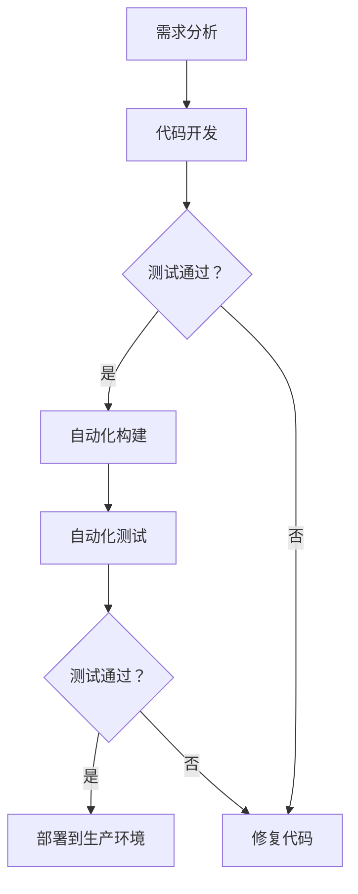

                 

关键词：持续部署、自动化部署、手动部署、策略、权衡、软件交付、持续集成

> 摘要：本文将深入探讨持续部署（CI/CD）策略中的自动化和手动部署的权衡。通过分析两者的优缺点、应用场景及具体实现步骤，我们旨在为开发团队提供一套有效的持续部署方案，以实现快速、可靠和高效的软件交付。

## 1. 背景介绍

### 持续部署的概念与重要性

持续部署（Continuous Deployment，简称CD）是软件工程中的一种实践，它通过自动化构建、测试和部署流程，实现软件的持续迭代和交付。与传统的瀑布模型不同，持续部署强调快速反馈、频繁发布和小步快跑，从而提升软件质量、缩短发布周期和增强客户满意度。

### 自动化部署与手动部署的对比

在持续部署实践中，自动化部署和手动部署是两种常见的部署方式。自动化部署通过脚本或工具实现，可以大幅减少人为干预，提高部署效率和可靠性；而手动部署则需要开发人员直接操作，虽然灵活性强，但容易出现人为错误，影响部署质量。

## 2. 核心概念与联系

### 持续部署流程



### 自动化部署与手动部署的关系

在持续部署流程中，自动化部署和手动部署各有其适用的场景。自动化部署适用于高频次、稳定性的发布场景，而手动部署则适用于低频次、高风险的发布场景。

## 3. 核心算法原理 & 具体操作步骤

### 3.1 算法原理概述

持续部署的核心在于构建、测试和部署的自动化。通过集成构建工具（如Jenkins、GitLab CI等）、容器化技术（如Docker）和自动化部署工具（如Kubernetes），实现自动化部署。

### 3.2 算法步骤详解

1. **代码仓库管理**：使用Git等版本控制工具管理代码仓库，实现版本控制和协同开发。
2. **自动化构建**：触发构建流程，将代码打包成可执行文件或容器镜像。
3. **自动化测试**：执行单元测试、集成测试等，确保代码质量。
4. **部署到生产环境**：将测试通过的代码部署到生产环境，实现快速上线。

### 3.3 算法优缺点

#### 优点：

- 提高开发效率：自动化部署减少了人为干预，提高了开发效率。
- 提高软件质量：自动化测试确保了代码质量，降低了缺陷率。
- 降低风险：通过小步快跑，降低了大规模发布的风险。

#### 缺点：

- 初始投入较大：自动化部署需要投入一定的人力、时间和资源。
- 维护成本高：自动化部署系统需要定期维护和更新。

### 3.4 算法应用领域

自动化部署适用于大多数Web应用、移动应用和云计算应用。而手动部署则适用于对业务稳定性要求极高的场景，如金融、医疗等领域。

## 4. 数学模型和公式 & 详细讲解 & 举例说明

### 4.1 数学模型构建

持续部署的数学模型可以基于以下公式：

$$
\text{部署效率} = \frac{\text{代码更新次数}}{\text{部署时间}}
$$

### 4.2 公式推导过程

持续部署的效率与代码更新的频率和部署时间成反比。因此，提高部署效率的关键在于缩短部署时间，同时保证代码质量。

### 4.3 案例分析与讲解

假设一个团队每月更新代码10次，每次部署需要2天。通过自动化部署，部署时间缩短至1天。根据公式，部署效率提高了50%。

## 5. 项目实践：代码实例和详细解释说明

### 5.1 开发环境搭建

使用Docker搭建开发环境，确保开发、测试和生产环境的统一。

### 5.2 源代码详细实现

使用GitLab CI实现自动化构建和部署。

```yaml
# .gitlab-ci.yml
image: ubuntu:latest

stages:
  - build
  - test
  - deploy

build:
  stage: build
  script:
    - docker build -t myapp:latest .

test:
  stage: test
  script:
    - docker run --rm myapp:latest ./run-tests.sh

deploy:
  stage: deploy
  script:
    - docker push myapp:latest
    - kubectl apply -f deployment.yml
```

### 5.3 代码解读与分析

该CI配置文件定义了构建、测试和部署的流程，实现了自动化部署。

### 5.4 运行结果展示

构建、测试和部署过程均自动化完成，运行结果可通过GitLab CI界面查看。

## 6. 实际应用场景

### 6.1 Web应用

Web应用适合采用自动化部署，以提高发布频率和用户体验。

### 6.2 移动应用

移动应用可以采用自动化部署，但需注意兼容性和版本控制。

### 6.3 云计算应用

云计算应用适合采用自动化部署，以提高资源利用率和稳定性。

## 7. 未来应用展望

### 7.1 AI与持续部署的融合

未来，AI技术将深入持续部署领域，实现更加智能化的部署策略和流程优化。

### 7.2 低代码/无代码部署

低代码/无代码平台将使持续部署更加普及，降低开发门槛。

### 7.3 跨平台部署

跨平台部署将逐渐成为主流，实现多种环境和应用的统一管理。

## 8. 工具和资源推荐

### 8.1 学习资源推荐

- 《持续交付：发布可靠软件的系统化方法》
- 《Kubernetes实战：容器编排与微服务架构》

### 8.2 开发工具推荐

- Jenkins
- GitLab CI
- Kubernetes

### 8.3 相关论文推荐

- "Continuous Deployment at Google"
- "Deploying Containerized Applications with Kubernetes"

## 9. 总结：未来发展趋势与挑战

### 9.1 研究成果总结

持续部署已成为软件工程领域的重要研究方向，取得了显著成果。

### 9.2 未来发展趋势

持续部署将向智能化、自动化和跨平台方向发展。

### 9.3 面临的挑战

持续部署在实践过程中面临资源消耗、安全性保障和跨平台兼容性等挑战。

### 9.4 研究展望

未来，持续部署将朝着更加高效、可靠和智能化的方向发展，为软件开发带来更多创新和变革。

## 10. 附录：常见问题与解答

### 10.1 自动化部署的优势是什么？

自动化部署的优势在于提高开发效率、降低部署风险和确保软件质量。

### 10.2 手动部署适用于哪些场景？

手动部署适用于对业务稳定性要求极高、部署频率较低的场景。

### 10.3 如何实现自动化部署？

实现自动化部署的关键在于构建、测试和部署的自动化，需要使用构建工具、容器化和自动化部署工具。

### 10.4 持续部署与敏捷开发的区别是什么？

持续部署是敏捷开发的一种实践，侧重于构建和部署的自动化，而敏捷开发则侧重于开发过程和团队协作。

### 10.5 如何保证持续部署的安全性？

确保持续部署的安全性需要从代码审计、权限控制和网络隔离等方面进行保障。

[作者：禅与计算机程序设计艺术 / Zen and the Art of Computer Programming]

---

以上便是《持续部署策略探讨：自动化和手动部署的权衡》的完整文章内容。希望对您在持续部署实践中的决策和优化有所帮助。如果您有进一步的问题或需求，欢迎随时与我交流。

