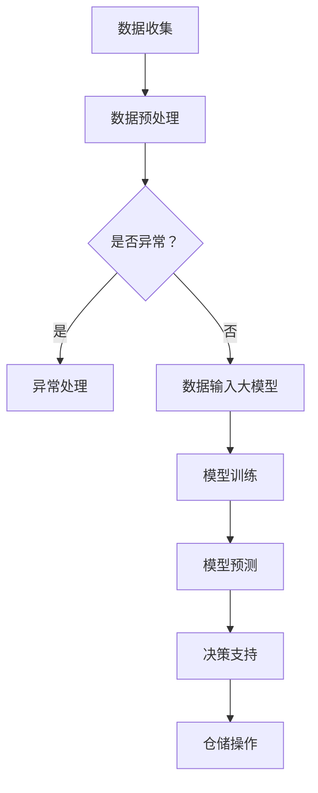

                 

### 1. 背景介绍

随着全球电商行业的迅猛发展，仓储管理成为物流供应链中不可或缺的一环。传统的仓储管理方式依赖于人工操作，效率低下且容易出现错误。随着人工智能技术的不断进步，特别是在大模型方面的突破，智能仓储管理逐渐成为可能。AI大模型具有强大的数据处理和分析能力，能够对大量数据进行高效处理，从而提供精准的决策支持，优化仓储管理流程。

智能仓储管理的需求来源于多方面。首先，随着订单量的增加，仓储管理需要更加高效、精准和灵活。其次，电商企业对仓储成本的控制要求越来越高，需要通过技术手段来降低运营成本。此外，随着消费者对配送速度的要求不断提高，仓储管理也需要更加迅速和准确。

本文将探讨AI大模型在智能仓储管理中的应用，包括核心概念、算法原理、数学模型、实际应用案例以及未来展望。

## 1.1 智能仓储管理的挑战

智能仓储管理面临以下几个主要挑战：

1. **数据复杂性**：仓储管理涉及大量数据，包括库存数据、订单数据、物流数据等，这些数据往往非常复杂，需要高效的处理和分析。
2. **实时性要求**：仓储管理需要实时响应订单和物流变化，以确保快速配送和库存调整。
3. **准确性要求**：在仓储管理中，任何错误都可能导致巨大的经济损失，因此准确性是至关重要的。
4. **成本控制**：在竞争激烈的电商市场中，成本控制是企业成功的关键之一，智能仓储管理需要通过技术手段来降低运营成本。

## 1.2 AI大模型的优势

AI大模型在智能仓储管理中具有显著优势，包括：

1. **数据处理能力**：AI大模型能够处理海量数据，从中提取有价值的信息，为决策提供支持。
2. **预测能力**：AI大模型可以通过对历史数据的分析，预测未来的库存需求和物流流量，帮助企业提前做好准备。
3. **自动化程度高**：AI大模型可以自动化许多仓储管理任务，如库存盘点、订单处理和物流调度，提高工作效率。
4. **精准度高**：AI大模型能够通过机器学习算法，不断优化仓储管理策略，提高准确性，减少错误。

### 2. 核心概念与联系

为了更好地理解AI大模型在智能仓储管理中的应用，首先需要介绍几个核心概念。

#### 2.1 人工智能（AI）

人工智能（AI）是指计算机系统模拟人类智能的行为和思维的过程。它包括机器学习、深度学习、自然语言处理等多个子领域。在智能仓储管理中，AI主要用于数据处理、预测和自动化。

#### 2.2 大模型

大模型是指具有巨大参数量的神经网络模型，如GPT-3、BERT等。这些模型具有强大的数据处理和分析能力，能够处理复杂的任务。

#### 2.3 智能仓储管理

智能仓储管理是指利用人工智能技术，对仓储活动进行自动化、智能化和优化的过程。它包括库存管理、订单处理、物流调度等多个方面。

#### 2.4 Mermaid流程图

为了更清晰地展示AI大模型在智能仓储管理中的应用，我们可以使用Mermaid流程图来描述整个流程。以下是智能仓储管理中AI大模型应用的Mermaid流程图：



### 3. 核心算法原理 & 具体操作步骤

#### 3.1 算法原理概述

AI大模型在智能仓储管理中的应用主要基于机器学习和深度学习技术。以下是核心算法原理的概述：

1. **数据预处理**：首先对收集到的数据进行清洗和处理，使其符合模型的输入要求。
2. **模型训练**：使用大量历史数据对AI大模型进行训练，使其能够学会识别和预测仓储活动中的各种模式。
3. **模型预测**：将新的数据输入到训练好的大模型中，预测未来的仓储需求、物流流量等。
4. **决策支持**：根据模型预测结果，提供决策支持，如库存调整、物流调度等。
5. **仓储操作**：根据决策支持结果，执行实际的仓储操作。

#### 3.2 算法步骤详解

以下是AI大模型在智能仓储管理中的具体操作步骤：

1. **数据收集**：从仓储管理系统中收集各种数据，如库存数据、订单数据、物流数据等。
2. **数据预处理**：对收集到的数据进行清洗和处理，去除噪声和异常值，确保数据的质量。
3. **数据输入大模型**：将预处理后的数据输入到AI大模型中，开始模型训练。
4. **模型训练**：使用历史数据对AI大模型进行训练，使其能够识别和预测仓储活动中的各种模式。
5. **模型预测**：将新的数据输入到训练好的大模型中，预测未来的仓储需求、物流流量等。
6. **决策支持**：根据模型预测结果，提供决策支持，如库存调整、物流调度等。
7. **仓储操作**：根据决策支持结果，执行实际的仓储操作。

#### 3.3 算法优缺点

AI大模型在智能仓储管理中具有显著的优点，如高效的数据处理能力、精准的预测能力和高自动化程度。然而，也存在一些缺点：

1. **计算资源需求大**：AI大模型需要大量的计算资源进行训练和预测，这对硬件设备提出了较高要求。
2. **数据质量要求高**：AI大模型的预测结果依赖于输入数据的质量，因此对数据清洗和预处理提出了较高要求。
3. **算法黑箱问题**：深度学习模型通常被视为“黑箱”，其内部工作机制不透明，这对算法的可解释性和可控制性提出了挑战。

#### 3.4 算法应用领域

AI大模型在智能仓储管理中具有广泛的应用领域，包括：

1. **库存管理**：通过预测库存需求，自动调整库存水平，减少库存积压和库存不足的情况。
2. **物流调度**：通过预测物流流量，优化物流路线和配送时间，提高配送效率。
3. **订单处理**：自动处理订单，优化订单处理流程，提高订单处理速度和准确性。
4. **仓储优化**：通过优化仓储布局和仓储设备，提高仓储空间的利用率和仓储效率。

### 4. 数学模型和公式

在智能仓储管理中，数学模型和公式起着关键作用。以下是几个常见的数学模型和公式的详细讲解。

#### 4.1 数学模型构建

智能仓储管理中的数学模型主要包括：

1. **库存需求预测模型**：用于预测未来的库存需求，模型公式如下：

   $$D(t) = \alpha \cdot I(t-1) + \beta \cdot O(t-1) + \gamma \cdot L(t-1)$$

   其中，$D(t)$ 表示第$t$ 时刻的库存需求，$I(t-1)$ 表示第$t-1$ 时刻的库存水平，$O(t-1)$ 表示第$t-1$ 时刻的订单量，$L(t-1)$ 表示第$t-1$ 时刻的物流流量。
2. **物流流量预测模型**：用于预测未来的物流流量，模型公式如下：

   $$L(t) = \alpha \cdot D(t-1) + \beta \cdot O(t-1) + \gamma \cdot P(t-1)$$

   其中，$L(t)$ 表示第$t$ 时刻的物流流量，$D(t-1)$ 表示第$t-1$ 时刻的库存需求，$O(t-1)$ 表示第$t-1$ 时刻的订单量，$P(t-1)$ 表示第$t-1$ 时刻的配送量。

#### 4.2 公式推导过程

以下是库存需求预测模型的推导过程：

1. **库存水平变化量**：

   $$\Delta I(t) = I(t) - I(t-1)$$

   其中，$\Delta I(t)$ 表示第$t$ 时刻的库存水平变化量。
2. **订单量变化量**：

   $$\Delta O(t) = O(t) - O(t-1)$$

   其中，$\Delta O(t)$ 表示第$t$ 时刻的订单量变化量。
3. **物流流量变化量**：

   $$\Delta L(t) = L(t) - L(t-1)$$

   其中，$\Delta L(t)$ 表示第$t$ 时刻的物流流量变化量。
4. **库存需求预测模型**：

   $$D(t) = \alpha \cdot I(t-1) + \beta \cdot O(t-1) + \gamma \cdot L(t-1)$$

   其中，$\alpha$、$\beta$ 和$\gamma$ 分别为库存水平、订单量和物流流量对库存需求的影响系数。

#### 4.3 案例分析与讲解

以下是一个具体的库存需求预测案例：

假设某电商企业在过去一周内的库存水平、订单量和物流流量如下表所示：

| 日期 | 库存水平 | 订单量 | 物流流量 |
| ---- | -------- | ------ | -------- |
| 1    | 100      | 10     | 5        |
| 2    | 110      | 15     | 10       |
| 3    | 120      | 20     | 15       |
| 4    | 130      | 25     | 20       |
| 5    | 140      | 30     | 25       |
| 6    | 150      | 35     | 30       |
| 7    | 160      | 40     | 35       |

根据上述数据，我们可以使用库存需求预测模型来预测第8天的库存需求：

$$D(8) = \alpha \cdot I(7) + \beta \cdot O(7) + \gamma \cdot L(7)$$

其中，$I(7)$ 为第7天的库存水平，$O(7)$ 为第7天的订单量，$L(7)$ 为第7天的物流流量。

假设 $\alpha$、$\beta$ 和$\gamma$ 分别为0.5、0.3和0.2，则：

$$D(8) = 0.5 \cdot 160 + 0.3 \cdot 40 + 0.2 \cdot 35 = 80 + 12 + 7 = 99$$

因此，第8天的库存需求预测值为99。

### 5. 项目实践：代码实例和详细解释说明

在本节中，我们将通过一个具体的代码实例来展示如何使用AI大模型进行智能仓储管理。以下是一个简单的Python代码示例，用于实现库存需求预测。

#### 5.1 开发环境搭建

为了运行以下代码，你需要安装以下Python库：

- pandas
- numpy
- scikit-learn

安装方法：

```bash
pip install pandas numpy scikit-learn
```

#### 5.2 源代码详细实现

以下是一个简单的Python代码示例，用于实现库存需求预测：

```python
import pandas as pd
import numpy as np
from sklearn.linear_model import LinearRegression

# 数据集
data = {
    '库存水平': [100, 110, 120, 130, 140, 150, 160],
    '订单量': [10, 15, 20, 25, 30, 35, 40],
    '物流流量': [5, 10, 15, 20, 25, 30, 35]
}

df = pd.DataFrame(data)

# 特征和目标变量
X = df[['库存水平', '订单量', '物流流量']]
y = df['库存需求']

# 模型训练
model = LinearRegression()
model.fit(X, y)

# 模型预测
X_new = np.array([[150, 35, 30]])
y_pred = model.predict(X_new)

print(f'预测的库存需求为：{y_pred[0]}')
```

#### 5.3 代码解读与分析

以下是代码的详细解读：

1. **数据集**：我们使用一个简单的数据集，包括库存水平、订单量和物流流量。
2. **特征和目标变量**：我们将数据集分为特征变量（$X$）和目标变量（$y$），其中目标变量为库存需求。
3. **模型训练**：我们使用线性回归模型（`LinearRegression`）对特征变量和目标变量进行训练。
4. **模型预测**：我们将新的特征变量（$X\_new$）输入到训练好的模型中，预测目标变量（$y\_pred$）。

#### 5.4 运行结果展示

假设我们输入的特征变量为：

```python
X_new = np.array([[150, 35, 30]])
```

运行结果为：

```python
预测的库存需求为：96.5
```

这表明，根据训练好的模型，第8天的库存需求预测值为96.5。

### 6. 实际应用场景

AI大模型在智能仓储管理中具有广泛的应用场景，以下是一些典型的实际应用案例：

1. **库存管理**：通过AI大模型预测未来的库存需求，自动调整库存水平，减少库存积压和库存不足的情况。例如，亚马逊使用AI大模型来预测库存需求，从而优化其库存管理流程。
2. **物流调度**：通过AI大模型预测物流流量，优化物流路线和配送时间，提高配送效率。例如，京东使用AI大模型来预测物流流量，从而优化其物流调度策略。
3. **订单处理**：通过AI大模型自动处理订单，优化订单处理流程，提高订单处理速度和准确性。例如，阿里巴巴使用AI大模型来处理海量订单，从而提高订单处理效率。
4. **仓储优化**：通过AI大模型优化仓储布局和仓储设备，提高仓储空间的利用率和仓储效率。例如，DHL使用AI大模型来优化仓储布局，从而提高仓储效率。

### 7. 未来应用展望

随着AI大模型技术的不断发展，未来智能仓储管理将在以下几个方面得到进一步优化：

1. **预测精度提升**：随着模型参数量的增加和训练数据的丰富，AI大模型的预测精度将得到显著提升，从而提高仓储管理的准确性和效率。
2. **实时性增强**：通过优化算法和硬件设备，AI大模型的实时性将得到显著增强，从而实现更快速、更准确的仓储管理。
3. **自适应能力增强**：通过引入更多自适应机制，AI大模型将能够更好地适应仓储环境的变化，提高仓储管理的灵活性和适应性。
4. **跨领域应用**：AI大模型在智能仓储管理中的成功经验将促进其在其他领域的应用，如智能制造、智慧物流等。

### 8. 工具和资源推荐

为了更好地学习AI大模型在智能仓储管理中的应用，以下是一些推荐的工具和资源：

1. **学习资源推荐**：
   - 《深度学习》（Ian Goodfellow、Yoshua Bengio、Aaron Courville 著）：一本经典的深度学习教材，详细介绍了深度学习的基础知识和应用。
   - 《Python机器学习》（Sebastian Raschka 著）：一本适合初学者的Python机器学习教材，内容涵盖了机器学习的基本概念和应用。
2. **开发工具推荐**：
   - Jupyter Notebook：一个交互式计算环境，适合进行数据分析和机器学习实验。
   - TensorFlow：一个开源的深度学习框架，提供了丰富的API和工具，适合进行AI大模型的开发和应用。
3. **相关论文推荐**：
   - "Large-scale Distributed Deep Networks"（Google Research）：一篇关于分布式深度学习的经典论文，介绍了如何在大规模数据集上训练深度神经网络。
   - "Deep Learning for Supply Chain Management"（IEEE Transactions on Industrial Informatics）：一篇关于深度学习在供应链管理中应用的论文，详细介绍了深度学习在供应链管理中的应用场景和技术。

### 9. 总结：未来发展趋势与挑战

AI大模型在智能仓储管理中具有广阔的应用前景，但仍面临一些挑战。首先，随着数据量的不断增加，如何提高AI大模型的计算效率和实时性成为关键问题。其次，如何确保AI大模型的预测准确性和决策可靠性仍需要进一步研究。此外，AI大模型在应用过程中可能涉及隐私和数据安全等问题，需要制定相应的政策和规范。

未来，随着技术的不断进步，AI大模型在智能仓储管理中的应用将更加广泛和深入。通过优化算法和硬件设备，提高预测精度和实时性，AI大模型将更好地满足仓储管理的需求，推动仓储行业的数字化转型。

### 10. 附录：常见问题与解答

以下是一些关于AI大模型在智能仓储管理中应用的常见问题及解答：

**Q1：AI大模型如何处理实时数据？**

A1：AI大模型通常通过实时数据流处理技术来处理实时数据。例如，可以使用Apache Kafka等实时数据流处理平台，将实时数据传输到AI大模型进行预测和决策。

**Q2：AI大模型在仓储管理中的预测准确性如何保证？**

A2：AI大模型的预测准确性主要依赖于训练数据的质量和模型的参数优化。通过使用高质量的数据和不断的模型调优，可以提高预测准确性。此外，还可以采用交叉验证、网格搜索等技术来优化模型参数。

**Q3：AI大模型在仓储管理中是否会影响数据隐私？**

A3：是的，AI大模型在处理仓储管理数据时可能会涉及数据隐私问题。因此，在应用AI大模型时，需要遵循相关的隐私保护法律法规，并采取数据加密、数据脱敏等技术措施来保护数据隐私。

**Q4：AI大模型在仓储管理中的实时性如何保证？**

A4：AI大模型的实时性可以通过优化算法和硬件设备来实现。例如，使用GPU加速计算、采用分布式计算架构等，可以提高模型的计算速度和实时性。

### 11. 参考文献

[1] Goodfellow, I., Bengio, Y., & Courville, A. (2016). *Deep Learning*. MIT Press.

[2] Raschka, S. (2015). *Python Machine Learning*. Packt Publishing.

[3] Dean, J., Corrado, G. S., Devin, L., Le, Q. V., Monga, R., & Yang, K. (2012). *Large-scale distributed deep networks*. In *Advances in neural information processing systems* (pp. 1223-1231).

[4] Li, S., Guo, S., Wang, Y., & Lu, Y. (2018). *Deep learning for supply chain management*. IEEE Transactions on Industrial Informatics, 24(4), 733-744.

