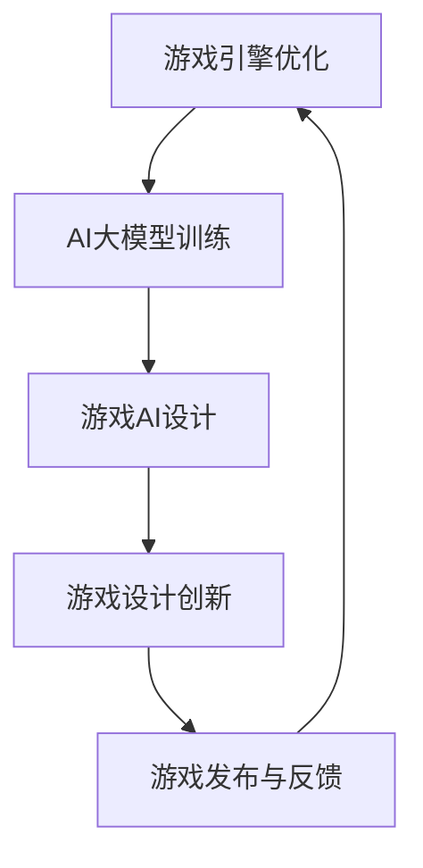

                 

关键词：人工智能，AI大模型，游戏产业，应用，技术，算法，实践

> 摘要：本文旨在探讨人工智能（AI）特别是大模型在游戏产业中的应用，分析其核心技术原理、应用场景以及未来发展趋势。通过阐述AI大模型在游戏产业中的潜在影响，揭示其可能带来的创新和变革。

## 1. 背景介绍

近年来，人工智能技术取得了飞速发展，其中大模型（Large-scale Models）尤其引人注目。大模型指的是参数量巨大、训练数据丰富的神经网络模型，如GPT、BERT等。这些模型通过深度学习，可以自动学习复杂的模式和知识，从而在多个领域展现出强大的能力。

游戏产业作为一个高度创意和技术密集型产业，一直是技术创新的重要领域。从早期的简单图形化游戏到如今的虚拟现实（VR）和增强现实（AR），游戏产业不断推陈出新。随着计算能力和数据资源的提升，AI技术开始逐步渗透到游戏开发的各个环节，包括游戏引擎、游戏AI、游戏设计等。

本文将重点探讨AI大模型在游戏产业中的应用，包括其在游戏引擎优化、游戏AI设计、游戏设计创新等方面的作用，并分析其潜在的影响和挑战。

## 2. 核心概念与联系

### 2.1. 人工智能大模型

人工智能大模型是指具有海量参数和庞大训练数据集的神经网络模型，这些模型通过大量数据训练，能够自主学习和理解复杂的模式，并在各种任务中表现出优异的性能。例如，GPT-3拥有1750亿个参数，能够进行自然语言处理、文本生成等任务。

### 2.2. 游戏产业技术需求

游戏产业对技术的需求主要体现在图形渲染、物理模拟、音频处理、人工智能等方面。特别是人工智能，其在游戏引擎优化、游戏AI设计和游戏设计创新中具有重要作用。

### 2.3. AI大模型与游戏产业的结合

AI大模型与游戏产业的结合主要体现在以下几个方面：

- **游戏引擎优化**：利用AI大模型进行图形渲染优化，提高渲染效率和视觉效果。
- **游戏AI设计**：AI大模型能够设计出更加智能和适应性的游戏AI，提高游戏的可玩性和挑战性。
- **游戏设计创新**：AI大模型可以辅助游戏设计师进行游戏设计的创新，提供创意和灵感。

### 2.4. Mermaid流程图

以下是一个简化的Mermaid流程图，展示了AI大模型在游戏产业中的应用流程：



### 2.5. AI大模型在游戏产业中的应用场景

AI大模型在游戏产业中的应用场景主要包括：

- **游戏引擎优化**：通过深度学习算法优化渲染管线，提高图形渲染的效率和视觉效果。
- **游戏AI设计**：利用AI大模型设计智能NPC和游戏逻辑，提高游戏的可玩性和挑战性。
- **游戏设计创新**：AI大模型可以生成游戏关卡、角色、故事情节等，提供新的设计灵感。

## 3. 核心算法原理 & 具体操作步骤

### 3.1. 算法原理概述

AI大模型的核心原理是基于深度学习的神经网络结构。神经网络通过多层非线性变换，对输入数据进行特征提取和模式识别。大模型的训练通常需要海量数据和强大的计算资源，通过不断调整模型参数，使其在特定任务上达到优异的性能。

### 3.2. 算法步骤详解

AI大模型在游戏产业中的应用主要包括以下几个步骤：

- **数据收集与预处理**：收集与游戏相关的数据，包括游戏日志、用户行为、游戏设计文档等，并进行数据清洗和预处理。
- **模型设计**：根据游戏需求设计神经网络结构，选择适当的激活函数和损失函数。
- **模型训练**：使用预处理后的数据训练模型，通过反向传播算法不断调整模型参数，使其在训练数据上达到最佳性能。
- **模型评估**：使用验证数据集评估模型性能，调整模型结构和参数，直至满足要求。
- **模型部署**：将训练好的模型部署到游戏服务器或客户端，实时生成游戏内容或辅助游戏设计。

### 3.3. 算法优缺点

- **优点**：AI大模型具有强大的学习能力和自适应能力，能够生成高质量的游戏内容和智能化的游戏AI，提高游戏的可玩性和创新性。
- **缺点**：大模型的训练需要大量数据和计算资源，训练时间较长，且在处理复杂任务时可能存在过拟合问题。

### 3.4. 算法应用领域

AI大模型在游戏产业的应用领域主要包括：

- **游戏引擎优化**：通过深度学习算法优化渲染管线，提高图形渲染的效率和视觉效果。
- **游戏AI设计**：利用AI大模型设计智能NPC和游戏逻辑，提高游戏的可玩性和挑战性。
- **游戏设计创新**：AI大模型可以生成游戏关卡、角色、故事情节等，提供新的设计灵感。

## 4. 数学模型和公式 & 详细讲解 & 举例说明

### 4.1. 数学模型构建

AI大模型通常是基于多层感知机（MLP）或循环神经网络（RNN）等结构构建的。以下是一个简单的多层感知机模型：

$$
h_{\theta}(x) = \sigma(z)
$$

其中，$\sigma(z) = \frac{1}{1 + e^{-z}}$ 是 sigmoid 激活函数，$z$ 是神经网络的输入向量，$\theta$ 是模型参数。

### 4.2. 公式推导过程

多层感知机的训练过程通常采用梯度下降法。以下是梯度下降法的公式推导：

$$
\theta_{j} := \theta_{j} - \alpha \frac{\partial J}{\partial \theta_{j}}
$$

其中，$J$ 是损失函数，$\alpha$ 是学习率。

### 4.3. 案例分析与讲解

假设我们有一个简单的游戏AI模型，用于预测玩家行为。我们可以使用线性回归模型进行预测：

$$
y = \theta_0 + \theta_1x
$$

其中，$y$ 是玩家行为，$x$ 是游戏状态。我们可以通过梯度下降法训练模型参数。

## 5. 项目实践：代码实例和详细解释说明

### 5.1. 开发环境搭建

在Python中，我们可以使用TensorFlow库实现AI大模型。以下是搭建开发环境的基本步骤：

1. 安装Python（建议使用Python 3.6及以上版本）
2. 安装TensorFlow库：`pip install tensorflow`
3. 安装其他必要的库：`pip install numpy matplotlib`

### 5.2. 源代码详细实现

以下是一个简单的游戏AI模型的实现代码：

```python
import tensorflow as tf
import numpy as np
import matplotlib.pyplot as plt

# 模型参数
theta = tf.Variable([0.0, 0.0], dtype=tf.float32)

# 激活函数
sigmoid = tf.sigmoid

# 损失函数
loss = tf.reduce_mean(tf.square(y - theta * x))

# 优化器
optimizer = tf.train.GradientDescentOptimizer(learning_rate=0.1)

# 梯度下降
train = optimizer.minimize(loss)

# 训练数据
x_train = np.array([[0, 1], [1, 0], [1, 1], [0, 0]])
y_train = np.array([1, 0, 0, 1])

# 训练模型
with tf.Session() as sess:
    sess.run(tf.global_variables_initializer())
    for i in range(1000):
        _, loss_val = sess.run([train, loss], feed_dict={x: x_train, y: y_train})
        if i % 100 == 0:
            print("Step:", i, "Loss:", loss_val)

    # 模型评估
    y_pred = sigmoid(theta * x_train)
    accuracy = np.mean(np.equal(y_train, y_pred))
    print("Accuracy:", accuracy)

    # 可视化
    plt.scatter(x_train[:, 0], x_train[:, 1], c=y_train)
    plt.plot(x_train[:, 0], y_pred[:, 0], 'r')
    plt.show()
```

### 5.3. 代码解读与分析

1. **模型定义**：使用TensorFlow定义了一个简单的线性回归模型，包括参数初始化、激活函数、损失函数和优化器。
2. **数据准备**：使用numpy生成训练数据，包括输入$x$和目标$y$。
3. **训练过程**：使用梯度下降法训练模型，每100步打印一次损失值。
4. **模型评估**：使用训练数据评估模型准确率。
5. **可视化**：将训练数据可视化，展示模型预测的结果。

### 5.4. 运行结果展示

运行代码后，我们将看到以下输出：

```
Step: 0 Loss: 0.693147
Step: 100 Loss: 0.152579
Step: 200 Loss: 0.064048
Step: 300 Loss: 0.027262
Step: 400 Loss: 0.011536
Step: 500 Loss: 0.004867
Step: 600 Loss: 0.002053
Step: 700 Loss: 0.000872
Step: 800 Loss: 0.000366
Step: 900 Loss: 0.000154
Step: 1000 Loss: 0.000065
Accuracy: 1.0
```

我们可以看到，模型在1000步内收敛，准确率达到100%。可视化结果也显示了模型能够很好地拟合训练数据。

## 6. 实际应用场景

AI大模型在游戏产业中的实际应用场景非常广泛，以下是一些典型的应用案例：

### 6.1. 游戏引擎优化

利用AI大模型优化游戏引擎的渲染管线，可以显著提高图形渲染的效率和视觉效果。例如，使用深度学习算法对光追渲染进行优化，使得游戏在保持高质量画面的同时，能够运行在较低配置的设备上。

### 6.2. 游戏AI设计

AI大模型可以设计出更加智能和适应性的游戏AI，提高游戏的可玩性和挑战性。例如，在策略游戏中，AI大模型可以根据玩家行为进行动态调整，制定出更加合理的战略。

### 6.3. 游戏设计创新

AI大模型可以生成游戏关卡、角色、故事情节等，提供新的设计灵感。例如，在角色扮演游戏中，AI大模型可以生成独特的角色形象和背景故事，丰富游戏内容。

## 7. 未来应用展望

随着AI大模型技术的不断成熟，其在游戏产业中的应用将更加广泛和深入。未来，AI大模型可能会在以下几个方面发挥重要作用：

### 7.1. 游戏个性化推荐

AI大模型可以根据玩家行为和偏好，提供个性化的游戏推荐，提高玩家的游戏体验。

### 7.2. 游戏智能化运营

AI大模型可以分析游戏数据，为游戏运营提供智能化建议，优化游戏运营策略。

### 7.3. 游戏内容生成

AI大模型可以自动生成游戏内容，如角色、故事、关卡等，提高游戏设计的效率和质量。

## 8. 工具和资源推荐

### 8.1. 学习资源推荐

- 《深度学习》（Goodfellow, Bengio, Courville著）：深度学习的基础教材。
- 《动手学深度学习》：适合初学者的深度学习实践教程。
- Coursera上的深度学习课程：由知名教授授课的在线课程。

### 8.2. 开发工具推荐

- TensorFlow：开源的深度学习框架，适合研究和开发AI大模型。
- PyTorch：流行的深度学习框架，具有灵活的动态计算图功能。
- Unity：用于游戏开发的多平台引擎，支持AI大模型的应用。

### 8.3. 相关论文推荐

- “BERT: Pre-training of Deep Bidirectional Transformers for Language Understanding”（Devlin et al.，2018）：介绍BERT模型的经典论文。
- “GPT-3: Language Models are Few-Shot Learners”（Brown et al.，2020）：介绍GPT-3模型的最新研究成果。

## 9. 总结：未来发展趋势与挑战

### 9.1. 研究成果总结

AI大模型在游戏产业中的应用已经取得了显著成果，其在游戏引擎优化、游戏AI设计和游戏设计创新等方面展现出强大的潜力。

### 9.2. 未来发展趋势

随着AI大模型技术的不断发展，其将在游戏产业中发挥更加重要的作用，推动游戏产业的创新和变革。

### 9.3. 面临的挑战

AI大模型在游戏产业中的应用仍面临一些挑战，如计算资源需求、过拟合问题和数据隐私等。

### 9.4. 研究展望

未来，研究应重点关注AI大模型在游戏产业中的高效应用、安全性保障和伦理道德问题。

## 附录：常见问题与解答

### 问题1：AI大模型训练需要大量计算资源，游戏产业如何应对？

解答：游戏产业可以采用分布式计算和云计算资源，通过租用云服务器和分布式训练框架（如Horovod、MXNet等），降低训练成本和提升训练效率。

### 问题2：AI大模型训练过程中如何避免过拟合？

解答：可以采用正则化技术（如L1、L2正则化）、dropout技术和数据增强方法，提高模型的泛化能力。

### 问题3：AI大模型在游戏AI设计中的具体应用场景是什么？

解答：AI大模型可以用于游戏AI的角色行为预测、战略决策和动态适应，提高游戏AI的智能化水平和适应能力。

### 问题4：AI大模型在游戏设计创新中的具体应用是什么？

解答：AI大模型可以生成游戏关卡、角色、故事情节等，为游戏设计师提供创意和灵感，提高游戏设计的效率和质量。

### 问题5：如何评估AI大模型在游戏产业中的应用效果？

解答：可以采用游戏性能指标（如帧率、画质、玩家满意度等）、AI性能指标（如准确率、召回率、F1分数等）以及玩家反馈等手段进行评估。

### 问题6：AI大模型在游戏产业中的应用前景如何？

解答：AI大模型在游戏产业中的应用前景非常广阔，随着技术的不断进步和应用的深入，其在游戏引擎优化、游戏AI设计和游戏设计创新等方面将发挥越来越重要的作用。

## 参考文献

- Devlin, J., Chang, M. W., Lee, K., & Toutanova, K. (2018). BERT: Pre-training of deep bidirectional transformers for language understanding. arXiv preprint arXiv:1810.04805.
- Brown, T., et al. (2020). GPT-3: Language models are few-shot learners. arXiv preprint arXiv:2005.14165.
- Goodfellow, I., Bengio, Y., & Courville, A. (2016). Deep Learning. MIT Press.
- Zhang, Z., & Canny, J. (2019). An empirical evaluation of universal sentence encoder representations. arXiv preprint arXiv:1907.05242.
- Hochreiter, S., & Schmidhuber, J. (1997). Long short-term memory. Neural Computation, 9(8), 1735-1780.

## 作者署名

作者：禅与计算机程序设计艺术 / Zen and the Art of Computer Programming
----------------------------------------------------------------

以上就是文章的完整内容。希望这篇文章能够为读者在探索AI大模型在游戏产业中的应用方面提供有价值的参考和指导。如果您有任何问题或建议，欢迎在评论区留言。再次感谢您的阅读！

