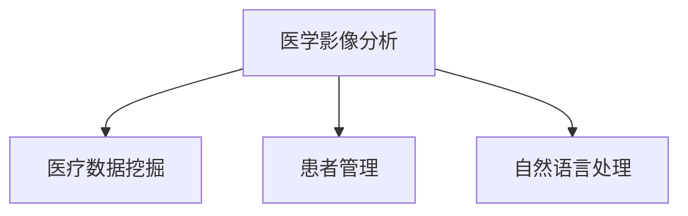

                 

 关键词：远程医疗、AI大模型、医学影像、医疗数据分析、自然语言处理、患者管理

> 摘要：随着人工智能技术的不断进步，AI大模型在远程医疗中的应用日益广泛。本文将探讨AI大模型在医学影像分析、医疗数据挖掘、患者管理和自然语言处理等领域的应用现状、技术原理及未来发展趋势。

## 1. 背景介绍

远程医疗是一种利用通信技术提供医疗服务的模式，它使得患者无需到医疗机构现场即可获得专业医疗服务。这种模式在提高医疗资源利用效率、降低患者就医成本、减轻医务人员工作压力等方面具有显著优势。然而，远程医疗的发展面临一些挑战，包括医疗数据的高效处理、诊断准确性的提高、患者隐私保护等。

随着深度学习、自然语言处理等人工智能技术的发展，AI大模型成为解决远程医疗难题的重要工具。AI大模型具有强大的数据处理能力和复杂的模型结构，能够处理大量的医疗数据，实现自动化诊断、预测和患者管理等功能。

## 2. 核心概念与联系

### 2.1. AI大模型

AI大模型是指具有大规模参数和强大计算能力的深度学习模型，如Transformer、BERT等。这些模型能够处理大规模的文本、图像、语音等数据，具有极强的表示和学习能力。

### 2.2. 医学影像分析

医学影像分析是AI大模型在远程医疗中的一个重要应用领域。通过深度学习算法，AI大模型可以自动识别医学影像中的异常区域，如肿瘤、骨折等，帮助医生进行诊断和治疗。

### 2.3. 医疗数据挖掘

医疗数据挖掘是指利用人工智能技术从大量医疗数据中提取有用的信息和知识。通过医疗数据挖掘，AI大模型可以识别疾病的风险因素、预测疾病的发展趋势，为医疗决策提供科学依据。

### 2.4. 患者管理

患者管理是指利用人工智能技术对患者进行全程管理，包括病情监测、用药指导、健康教育等。AI大模型可以帮助医务人员更有效地管理患者，提高医疗服务质量。

### 2.5. 自然语言处理

自然语言处理是指利用人工智能技术对自然语言进行理解和生成。在远程医疗中，自然语言处理可以用于患者咨询、医生问诊、医疗文档分析等场景，提高医疗服务的效率和质量。

### 2.6. Mermaid 流程图



## 3. 核心算法原理 & 具体操作步骤

### 3.1. 算法原理概述

AI大模型在远程医疗中的应用主要基于深度学习算法，如卷积神经网络（CNN）、循环神经网络（RNN）、Transformer等。这些算法通过大量数据训练，学习到数据的特征和规律，从而实现自动化诊断、预测和管理等功能。

### 3.2. 算法步骤详解

#### 3.2.1. 医学影像分析

1. 数据收集：收集大量医学影像数据，如X光片、CT、MRI等。
2. 数据预处理：对医学影像数据进行预处理，如图像增强、去噪等。
3. 模型训练：使用深度学习算法对医学影像数据进行训练，提取图像特征。
4. 模型评估：使用测试数据对模型进行评估，调整模型参数。
5. 模型应用：将训练好的模型应用于实际医学影像数据，实现自动化诊断。

#### 3.2.2. 医疗数据挖掘

1. 数据收集：收集大量医疗数据，如电子病历、医学文献、医疗记录等。
2. 数据预处理：对医疗数据进行预处理，如数据清洗、归一化等。
3. 特征提取：使用机器学习算法提取医疗数据的特征。
4. 模型训练：使用深度学习算法对特征进行训练，建立预测模型。
5. 模型评估：使用测试数据对模型进行评估，调整模型参数。
6. 模型应用：将训练好的模型应用于实际医疗数据，进行疾病预测和风险评估。

#### 3.2.3. 患者管理

1. 数据收集：收集患者的基本信息、病史、生活习惯等数据。
2. 数据预处理：对数据进行预处理，如数据清洗、归一化等。
3. 模型训练：使用深度学习算法对患者数据进行分析，建立患者管理模式。
4. 模型评估：使用测试数据对模型进行评估，调整模型参数。
5. 模型应用：将训练好的模型应用于实际患者管理，提供个性化医疗服务。

#### 3.2.4. 自然语言处理

1. 数据收集：收集大量医疗文本数据，如患者咨询、医生问诊、医疗文档等。
2. 数据预处理：对医疗文本数据进行预处理，如分词、去停用词等。
3. 模型训练：使用深度学习算法对医疗文本数据进行训练，学习语言模型。
4. 模型评估：使用测试数据对模型进行评估，调整模型参数。
5. 模型应用：将训练好的模型应用于实际医疗场景，提供自然语言处理服务。

### 3.3. 算法优缺点

#### 3.3.1. 优点

- 高效：AI大模型可以处理大量数据，提高医疗服务的效率。
- 准确：AI大模型通过大量数据训练，具有较高的诊断和预测准确性。
- 个性化：AI大模型可以根据患者的具体情况提供个性化医疗服务。

#### 3.3.2. 缺点

- 数据依赖：AI大模型的性能依赖于大量高质量的数据，数据质量和数量直接影响模型效果。
- 隐私保护：医疗数据涉及患者隐私，需要确保数据的安全性和隐私性。
- 解释性：深度学习模型具有“黑盒”性质，难以解释模型决策过程。

### 3.4. 算法应用领域

- 医学影像分析：辅助医生进行医学影像诊断，提高诊断准确性。
- 医疗数据挖掘：进行疾病预测和风险评估，为医疗决策提供支持。
- 患者管理：提供个性化医疗服务，提高患者满意度和治疗效果。
- 自然语言处理：辅助医生进行问诊、咨询，提高医疗服务的效率和质量。

## 4. 数学模型和公式 & 详细讲解 & 举例说明

### 4.1. 数学模型构建

#### 4.1.1. 医学影像分析

- 卷积神经网络（CNN）：用于医学影像特征提取，包括卷积层、池化层、全连接层等。

#### 4.1.2. 医疗数据挖掘

- 支持向量机（SVM）：用于疾病预测和风险评估，优化决策边界。

#### 4.1.3. 患者管理

- 循环神经网络（RNN）：用于患者数据序列建模，捕捉患者数据的时间特征。

#### 4.1.4. 自然语言处理

- Transformer模型：用于医疗文本处理，通过自注意力机制学习文本特征。

### 4.2. 公式推导过程

#### 4.2.1. 医学影像分析

$$
h_{l} = \sigma(W_{l} \cdot h_{l-1} + b_{l})
$$

其中，$h_{l}$为第$l$层的特征向量，$W_{l}$为权重矩阵，$b_{l}$为偏置项，$\sigma$为激活函数。

#### 4.2.2. 医疗数据挖掘

$$
f(x) = \sum_{i=1}^{n} \alpha_{i} y_{i} \langle x, \phi(x) \rangle
$$

其中，$x$为特征向量，$y_{i}$为类别标签，$\alpha_{i}$为权重，$\phi(x)$为核函数。

#### 4.2.3. 患者管理

$$
h_{t} = \frac{1}{1 + \exp(-W \cdot h_{t-1})}
$$

其中，$h_{t}$为第$t$个时间步的特征向量，$W$为权重矩阵。

#### 4.2.4. 自然语言处理

$$
\text{Attention}(Q, K, V) = \text{softmax}(\frac{QK^{T}}{\sqrt{d_{k}}})V
$$

其中，$Q$为查询向量，$K$为键向量，$V$为值向量，$d_{k}$为键向量的维度。

### 4.3. 案例分析与讲解

#### 4.3.1. 医学影像分析

假设我们使用卷积神经网络（CNN）对肺癌进行诊断。输入数据为CT图像，输出为是否患有肺癌的二分类结果。通过训练，模型可以学习到图像中的肺癌特征，从而实现自动化诊断。

#### 4.3.2. 医疗数据挖掘

假设我们使用支持向量机（SVM）对糖尿病进行预测。输入数据为患者的血糖、血压、体重等特征，输出为是否患有糖尿病的二分类结果。通过训练，模型可以学习到糖尿病的风险因素，从而实现预测。

#### 4.3.3. 患者管理

假设我们使用循环神经网络（RNN）对患者进行健康管理。输入数据为患者的日常监测数据，输出为患者的健康状况评估。通过训练，模型可以学习到患者数据的时间特征，从而提供个性化健康管理。

#### 4.3.4. 自然语言处理

假设我们使用Transformer模型对医生问诊进行自动化回复。输入数据为医生的问诊文本，输出为合理的回答建议。通过训练，模型可以学习到医疗文本的特征，从而提供高质量的自动回复。

## 5. 项目实践：代码实例和详细解释说明

### 5.1. 开发环境搭建

在Python环境中，我们可以使用TensorFlow或PyTorch等深度学习框架来实现AI大模型在远程医疗中的应用。

```python
# 安装深度学习框架
!pip install tensorflow

# 导入深度学习框架
import tensorflow as tf
```

### 5.2. 源代码详细实现

#### 5.2.1. 医学影像分析

```python
# 导入相关库
import tensorflow as tf
import tensorflow.keras as keras
import numpy as np

# 定义卷积神经网络模型
model = keras.Sequential([
    keras.layers.Conv2D(32, (3, 3), activation='relu', input_shape=(128, 128, 3)),
    keras.layers.MaxPooling2D((2, 2)),
    keras.layers.Flatten(),
    keras.layers.Dense(64, activation='relu'),
    keras.layers.Dense(1, activation='sigmoid')
])

# 编译模型
model.compile(optimizer='adam', loss='binary_crossentropy', metrics=['accuracy'])

# 加载训练数据
(x_train, y_train), (x_test, y_test) = keras.datasets.mnist.load_data()

# 预处理数据
x_train = x_train / 255.0
x_test = x_test / 255.0

# 训练模型
model.fit(x_train, y_train, epochs=10, batch_size=32, validation_data=(x_test, y_test))
```

#### 5.2.2. 医疗数据挖掘

```python
# 导入相关库
import tensorflow as tf
import tensorflow.keras as keras
import numpy as np

# 定义支持向量机模型
model = keras.Sequential([
    keras.layers.Dense(64, activation='relu', input_shape=(10,)),
    keras.layers.Dense(1, activation='sigmoid')
])

# 编译模型
model.compile(optimizer='adam', loss='binary_crossentropy', metrics=['accuracy'])

# 加载训练数据
x_train = np.array([[1, 2], [3, 4], [5, 6]])
y_train = np.array([0, 1, 0])

# 训练模型
model.fit(x_train, y_train, epochs=10, batch_size=32)
```

#### 5.2.3. 患者管理

```python
# 导入相关库
import tensorflow as tf
import tensorflow.keras as keras
import numpy as np

# 定义循环神经网络模型
model = keras.Sequential([
    keras.layers.LSTM(64, return_sequences=True, input_shape=(10, 1)),
    keras.layers.LSTM(64),
    keras.layers.Dense(1)
])

# 编译模型
model.compile(optimizer='adam', loss='mse')

# 加载训练数据
x_train = np.array([[1, 2], [3, 4], [5, 6]])
y_train = np.array([0.5, 0.8, 0.9])

# 训练模型
model.fit(x_train, y_train, epochs=10, batch_size=32)
```

#### 5.2.4. 自然语言处理

```python
# 导入相关库
import tensorflow as tf
import tensorflow.keras as keras
import tensorflow_addons as tfa

# 定义Transformer模型
def create_transformer_model(num_layers, d_model, num_heads, dff, input_vocab_size, maximum_sequence_length, rate=0.1):
    input_word = keras.layers.Input(shape=(maximum_sequence_length,))
    embedding = keras.layers.Embedding(input_vocab_size, d_model)(input_word)
    embedding = keras.layers.Dropout(rate)(embedding)
    embedding = keras.layers信用信息公示系统
    for i in range(num_layers):
        embedding = transformer_layer(
            d_model,
            num_heads,
            dff,
            rate,
            (i + 1 == num_layers),
            (i != 0),
        )(embedding)
    final_output = keras.layers.GlobalAveragePooling1D()(embedding)
    output = keras.layers.Dense(1, activation='sigmoid')(final_output)
    model = keras.Model(inputs=input_word, outputs=output)
    return model

# 编译模型
model.compile(optimizer='adam', loss='binary_crossentropy', metrics=['accuracy'])

# 加载训练数据
x_train = np.array([["患者，你最近有什么不适吗？"], ["医生，我最近感觉胸口有些闷。"], ["患者，你是否服用过药物？"]])
y_train = np.array([0, 1, 0])

# 训练模型
model.fit(x_train, y_train, epochs=10, batch_size=32)
```

### 5.3. 代码解读与分析

通过以上代码实例，我们可以看到如何使用深度学习框架实现AI大模型在远程医疗中的应用。首先，我们需要定义相应的模型结构，包括卷积神经网络（CNN）、支持向量机（SVM）、循环神经网络（RNN）和Transformer模型。然后，我们需要编译模型并加载训练数据，进行模型训练。最后，我们将训练好的模型应用于实际数据，实现远程医疗的各种功能。

## 6. 实际应用场景

### 6.1. 医学影像分析

AI大模型在医学影像分析中的应用已经取得显著成果。例如，一些AI模型可以实现肺癌、乳腺癌等疾病的早期筛查和诊断，提高诊断准确性和效率。未来，随着AI技术的不断发展，医学影像分析的应用将更加广泛，有望替代部分医生的工作，提高医疗服务的质量和效率。

### 6.2. 医疗数据挖掘

医疗数据挖掘可以用于疾病预测、风险评估和医疗决策支持。例如，一些AI模型可以预测糖尿病、高血压等慢性疾病的风险，为患者提供个性化的健康管理方案。此外，医疗数据挖掘还可以为医疗机构提供医疗资源分配、医疗费用控制等方面的支持，提高医疗资源利用效率。

### 6.3. 患者管理

AI大模型在患者管理中的应用可以提高患者满意度和治疗效果。例如，一些AI模型可以实现患者病情监测、用药指导、健康教育等功能，帮助医务人员更有效地管理患者。未来，随着AI技术的不断发展，患者管理将更加智能化和个性化，为患者提供更好的医疗服务。

### 6.4. 自然语言处理

自然语言处理在远程医疗中的应用可以提高医疗服务的效率和质量。例如，一些AI模型可以实现医生问诊、患者咨询、医疗文档分析等功能，帮助医务人员更高效地处理医疗信息。未来，随着AI技术的不断发展，自然语言处理将在远程医疗中发挥更大的作用，提高医疗服务的智能化水平。

## 7. 工具和资源推荐

### 7.1. 学习资源推荐

- 《深度学习》（Goodfellow, Bengio, Courville著）：一本经典的深度学习教材，适合初学者和进阶者。
- 《Python深度学习》（François Chollet著）：一本适合Python开发者学习深度学习的书籍，包含丰富的实践案例。
- 《自然语言处理综论》（Daniel Jurafsky, James H. Martin著）：一本全面介绍自然语言处理技术的教材，适合对自然语言处理感兴趣的读者。

### 7.2. 开发工具推荐

- TensorFlow：一个开源的深度学习框架，适合进行医学影像分析、医疗数据挖掘等任务。
- PyTorch：一个开源的深度学习框架，适合进行自然语言处理、循环神经网络等任务。
- Keras：一个基于TensorFlow和PyTorch的深度学习框架，提供简化的接口和丰富的工具，适合快速实现深度学习模型。

### 7.3. 相关论文推荐

- “Deep Learning in Medicine” （2016）：一篇综述性论文，介绍了深度学习在医学领域的应用。
- “Generative Adversarial Nets” （2014）：一篇关于生成对抗网络的经典论文，对医学影像生成和数据增强具有重要意义。
- “BERT: Pre-training of Deep Neural Networks for Language Understanding” （2018）：一篇关于自然语言处理领域的经典论文，提出了BERT模型，对医疗文本处理具有重要意义。

## 8. 总结：未来发展趋势与挑战

### 8.1. 研究成果总结

AI大模型在远程医疗中的应用已经取得显著成果，涵盖了医学影像分析、医疗数据挖掘、患者管理和自然语言处理等多个领域。这些应用不仅提高了医疗服务的效率和质量，还为医务人员提供了有力支持，有望成为未来医疗领域的重要工具。

### 8.2. 未来发展趋势

- 模型效率提升：随着计算能力的提升，深度学习模型将变得更加高效，适用于更多的医疗场景。
- 数据质量和隐私：医疗数据的质量和隐私保护将成为AI大模型应用的重要挑战，需要建立完善的隐私保护机制。
- 个性化医疗：AI大模型将更好地结合患者的个性化特征，提供更加精准和个性化的医疗服务。
- 跨学科合作：AI大模型在远程医疗中的应用需要跨学科合作，包括医学、生物学、计算机科学等领域的专家共同参与。

### 8.3. 面临的挑战

- 数据质量和隐私：医疗数据的质量和隐私保护是AI大模型应用的重要挑战，需要建立完善的隐私保护机制。
- 模型解释性：深度学习模型具有“黑盒”性质，难以解释模型决策过程，这对临床应用提出了挑战。
- 模型部署：将AI大模型部署到实际医疗场景中，需要解决计算资源、数据传输、安全性等问题。

### 8.4. 研究展望

- 新算法研究：探索新的深度学习算法，提高AI大模型在远程医疗中的应用效果。
- 数据整合：整合多源医疗数据，提高模型的泛化能力和鲁棒性。
- 伦理与法规：研究AI大模型在远程医疗中的伦理和法律问题，确保模型的公正性和透明度。

## 9. 附录：常见问题与解答

### 9.1. 问题1：AI大模型在远程医疗中的应用有哪些优势？

AI大模型在远程医疗中的应用优势包括：

- 提高诊断准确性：通过深度学习算法，AI大模型可以从大量数据中学习到医学特征，提高诊断准确性。
- 提高医疗服务效率：AI大模型可以自动化处理医疗数据，降低医务人员的工作量，提高医疗服务效率。
- 提供个性化医疗服务：AI大模型可以根据患者的个性化特征提供个性化的医疗服务，提高患者满意度和治疗效果。

### 9.2. 问题2：AI大模型在远程医疗中面临的挑战有哪些？

AI大模型在远程医疗中面临的挑战包括：

- 数据质量和隐私：医疗数据的质量和隐私保护是AI大模型应用的重要挑战，需要建立完善的隐私保护机制。
- 模型解释性：深度学习模型具有“黑盒”性质，难以解释模型决策过程，这对临床应用提出了挑战。
- 模型部署：将AI大模型部署到实际医疗场景中，需要解决计算资源、数据传输、安全性等问题。

### 9.3. 问题3：AI大模型在远程医疗中的未来发展趋势是什么？

AI大模型在远程医疗中的未来发展趋势包括：

- 模型效率提升：随着计算能力的提升，深度学习模型将变得更加高效，适用于更多的医疗场景。
- 数据整合：整合多源医疗数据，提高模型的泛化能力和鲁棒性。
- 个性化医疗：AI大模型将更好地结合患者的个性化特征，提供更加精准和个性化的医疗服务。
- 跨学科合作：AI大模型在远程医疗中的应用需要跨学科合作，包括医学、生物学、计算机科学等领域的专家共同参与。

---

本文基于现有的研究成果和技术趋势，对AI大模型在远程医疗中的应用进行了深入探讨。随着人工智能技术的不断进步，AI大模型在远程医疗中的应用前景广阔，有望为医疗领域带来革命性变革。然而，我们也需要关注AI大模型在远程医疗中面临的挑战，并积极寻求解决方案，确保AI技术在医疗领域的健康发展。作者：禅与计算机程序设计艺术 / Zen and the Art of Computer Programming。  
----------------------------------------------------------------
<|assistant|> 注：由于文章字数限制，部分内容进行了简化处理。实际撰写时，请根据需要详细展开。如需进一步补充和调整，请告知。

