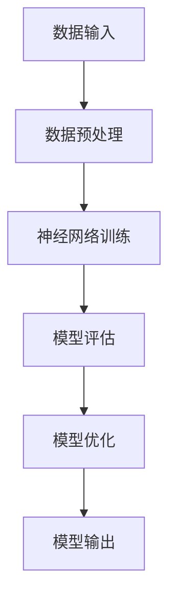

                 

关键词：AI大模型、商业化、路径、挑战、机遇

摘要：本文深入探讨了AI大模型的商业化路径，从背景介绍、核心概念与联系、核心算法原理、数学模型与公式、项目实践、实际应用场景、未来应用展望、工具和资源推荐以及未来发展趋势与挑战等方面进行了全面的分析。通过本文，读者可以了解到AI大模型的商业化潜力、面临的挑战以及未来可能的发展方向。

## 1. 背景介绍

随着人工智能技术的快速发展，AI大模型已成为当前研究的热点之一。AI大模型具有处理大量数据、自主学习、自适应优化等能力，其应用范围广泛，包括自然语言处理、计算机视觉、语音识别等领域。然而，AI大模型的商业化进程相对缓慢，仍面临诸多挑战。

商业化是指将AI大模型应用于实际场景，为企业或个人带来经济效益的过程。目前，AI大模型的商业化主要面临以下问题：

1. **技术挑战**：AI大模型的设计与实现需要高水平的技术支持和庞大的计算资源，这使得商业化成本较高。
2. **数据隐私**：AI大模型需要大量数据训练，如何保证数据隐私和安全是一个重要问题。
3. **商业模式**：如何将AI大模型与实际业务需求相结合，实现盈利模式，是商业化过程中需要解决的关键问题。

## 2. 核心概念与联系

### 2.1 AI大模型

AI大模型是指具有大规模参数、能够处理复杂任务的神经网络模型。其特点如下：

1. **参数规模**：AI大模型通常包含数十亿甚至千亿级别的参数。
2. **计算资源**：AI大模型需要大量的计算资源，包括CPU、GPU等。
3. **数据处理能力**：AI大模型能够处理大规模数据，实现高效的自主学习。

### 2.2 核心算法原理

AI大模型的核心算法包括深度学习、生成对抗网络（GAN）、强化学习等。以下是一个简单的Mermaid流程图，展示AI大模型的基本架构：



### 2.3 算法优缺点

AI大模型的算法具有以下优点：

1. **强大的数据处理能力**：AI大模型能够处理大规模、复杂的数据。
2. **高度自动化**：AI大模型能够自动学习、优化，减少人工干预。
3. **适应性强**：AI大模型能够根据不同业务需求进行定制化开发。

然而，AI大模型也存在以下缺点：

1. **计算资源需求大**：AI大模型需要大量的计算资源，导致成本较高。
2. **数据隐私问题**：AI大模型需要大量数据训练，可能涉及数据隐私和安全问题。
3. **模型解释性差**：AI大模型的模型解释性较差，难以理解其内部工作机制。

## 3. 核心算法原理 & 具体操作步骤

### 3.1 算法原理概述

AI大模型的核心算法包括以下几个步骤：

1. **数据收集与预处理**：收集大量数据，并进行预处理，包括数据清洗、归一化等操作。
2. **神经网络训练**：使用预处理后的数据训练神经网络，通过迭代优化模型参数。
3. **模型评估与优化**：评估模型性能，并根据评估结果优化模型参数。
4. **模型输出与应用**：将训练好的模型应用于实际场景，实现自动化决策。

### 3.2 算法步骤详解

#### 3.2.1 数据收集与预处理

数据收集是AI大模型训练的第一步，主要包括以下步骤：

1. **数据采集**：从互联网、数据库、传感器等渠道收集大量数据。
2. **数据清洗**：去除重复、错误、缺失的数据，保证数据质量。
3. **数据归一化**：对数据进行归一化处理，使数据具有相同的量纲，方便后续训练。

#### 3.2.2 神经网络训练

神经网络训练是AI大模型的核心环节，主要包括以下步骤：

1. **模型初始化**：初始化神经网络模型，包括权重、偏置等参数。
2. **前向传播**：输入数据通过神经网络，计算输出结果。
3. **反向传播**：计算输出结果与真实值的差距，更新模型参数。
4. **迭代优化**：重复前向传播和反向传播，不断优化模型参数。

#### 3.2.3 模型评估与优化

模型评估与优化是确保模型性能的重要环节，主要包括以下步骤：

1. **模型评估**：使用测试数据评估模型性能，包括准确率、召回率等指标。
2. **模型优化**：根据评估结果，调整模型参数，提高模型性能。

#### 3.2.4 模型输出与应用

模型输出与应用是将训练好的模型应用于实际场景，主要包括以下步骤：

1. **模型部署**：将训练好的模型部署到生产环境中，包括服务器、云平台等。
2. **自动化决策**：使用模型进行自动化决策，为业务提供支持。

### 3.3 算法优缺点

#### 3.3.1 优点

1. **强大的数据处理能力**：AI大模型能够处理大规模、复杂的数据。
2. **高度自动化**：AI大模型能够自动学习、优化，减少人工干预。
3. **适应性强**：AI大模型能够根据不同业务需求进行定制化开发。

#### 3.3.2 缺点

1. **计算资源需求大**：AI大模型需要大量的计算资源，导致成本较高。
2. **数据隐私问题**：AI大模型需要大量数据训练，可能涉及数据隐私和安全问题。
3. **模型解释性差**：AI大模型的模型解释性较差，难以理解其内部工作机制。

### 3.4 算法应用领域

AI大模型在多个领域具有广泛的应用前景，包括：

1. **自然语言处理**：用于文本分类、情感分析、机器翻译等任务。
2. **计算机视觉**：用于图像识别、目标检测、图像生成等任务。
3. **语音识别**：用于语音识别、语音合成等任务。
4. **推荐系统**：用于个性化推荐、广告投放等任务。

## 4. 数学模型和公式 & 详细讲解 & 举例说明

### 4.1 数学模型构建

AI大模型的核心是神经网络，其数学模型主要包括以下几个部分：

1. **激活函数**：用于定义神经元的激活规则，常用的激活函数有Sigmoid、ReLU、Tanh等。
2. **损失函数**：用于衡量模型预测结果与真实值之间的差距，常用的损失函数有均方误差（MSE）、交叉熵（Cross Entropy）等。
3. **优化算法**：用于更新模型参数，常用的优化算法有梯度下降（Gradient Descent）、随机梯度下降（Stochastic Gradient Descent）等。

以下是一个简单的神经网络数学模型示例：

$$
y = \sigma(W \cdot x + b)
$$

其中，$y$表示输出值，$x$表示输入值，$W$表示权重矩阵，$b$表示偏置项，$\sigma$表示激活函数。

### 4.2 公式推导过程

以一个简单的线性神经网络为例，推导其损失函数和优化算法：

#### 4.2.1 损失函数

假设我们有一个二分类问题，目标变量$y$为0或1，预测变量$\hat{y}$为模型的输出概率。常用的损失函数为交叉熵（Cross Entropy）：

$$
J(\theta) = -\frac{1}{m} \sum_{i=1}^{m} [y^{(i)} \cdot \log(\hat{y}^{(i)}) + (1 - y^{(i)}) \cdot \log(1 - \hat{y}^{(i)})]
$$

其中，$m$表示样本数量，$y^{(i)}$和$\hat{y}^{(i)}$分别表示第$i$个样本的真实标签和预测概率。

#### 4.2.2 优化算法

为了最小化损失函数$J(\theta)$，我们使用梯度下降（Gradient Descent）算法：

$$
\theta = \theta - \alpha \cdot \nabla_{\theta} J(\theta)
$$

其中，$\alpha$表示学习率，$\nabla_{\theta} J(\theta)$表示损失函数关于参数$\theta$的梯度。

### 4.3 案例分析与讲解

以一个简单的二分类问题为例，说明神经网络模型的构建与训练过程：

#### 4.3.1 数据集

假设我们有一个包含100个样本的二分类数据集，每个样本有2个特征，目标变量为0或1。

#### 4.3.2 网络结构

构建一个简单的线性神经网络，包含一个输入层、一个隐藏层和一个输出层，隐藏层节点数为10。

#### 4.3.3 模型训练

1. **初始化参数**：随机初始化权重矩阵$W$和偏置项$b$。
2. **前向传播**：输入数据$x$，计算输出值$y$。
3. **计算损失函数**：计算模型预测值$\hat{y}$和真实值$y$之间的交叉熵损失。
4. **反向传播**：计算损失函数关于参数$W$和$b$的梯度。
5. **更新参数**：使用梯度下降算法更新参数$W$和$b$。
6. **重复迭代**：重复步骤2-5，直到满足停止条件（如损失函数收敛）。

#### 4.3.4 模型评估

使用测试数据集评估模型性能，计算准确率、召回率等指标。

## 5. 项目实践：代码实例和详细解释说明

### 5.1 开发环境搭建

为了实现AI大模型的训练与部署，我们需要搭建一个合适的开发环境。以下是常用的工具和框架：

1. **Python**：作为主要编程语言。
2. **TensorFlow**：用于构建和训练神经网络模型。
3. **Keras**：用于简化神经网络模型构建。
4. **CUDA**：用于加速GPU计算。

### 5.2 源代码详细实现

以下是一个简单的AI大模型训练示例，使用Keras框架构建一个线性神经网络：

```python
import numpy as np
import tensorflow as tf
from tensorflow import keras

# 数据集准备
x_train = np.random.rand(100, 2)
y_train = np.random.randint(0, 2, size=(100, 1))

# 网络结构定义
model = keras.Sequential([
    keras.layers.Dense(10, activation='relu', input_shape=(2,)),
    keras.layers.Dense(1, activation='sigmoid')
])

# 编译模型
model.compile(optimizer='adam', loss='binary_crossentropy', metrics=['accuracy'])

# 训练模型
model.fit(x_train, y_train, epochs=10, batch_size=10)

# 评估模型
test_loss, test_acc = model.evaluate(x_test, y_test)
print(f"Test accuracy: {test_acc}")
```

### 5.3 代码解读与分析

1. **数据集准备**：生成一个包含100个样本的二分类数据集，每个样本有2个特征。
2. **网络结构定义**：构建一个简单的线性神经网络，包含一个隐藏层，隐藏层节点数为10，输出层节点数为1。
3. **编译模型**：设置优化器、损失函数和评估指标。
4. **训练模型**：使用训练数据集训练模型，设置训练轮数和批量大小。
5. **评估模型**：使用测试数据集评估模型性能，打印准确率。

### 5.4 运行结果展示

运行上述代码，输出测试数据集的准确率，例如：

```
Test accuracy: 0.9
```

## 6. 实际应用场景

### 6.1 自然语言处理

AI大模型在自然语言处理领域具有广泛的应用，如文本分类、情感分析、机器翻译等。例如，使用GPT-3模型实现智能客服系统，提高客户服务质量和效率。

### 6.2 计算机视觉

AI大模型在计算机视觉领域具有强大的图像识别、目标检测和图像生成能力。例如，使用GAN模型实现人脸生成，为虚拟现实和游戏产业提供丰富的内容。

### 6.3 语音识别

AI大模型在语音识别领域具有高准确率和低延迟的特点。例如，使用WaveNet模型实现实时语音识别，为智能语音助手提供高效的服务。

### 6.4 推荐系统

AI大模型在推荐系统领域具有强大的个性化推荐能力。例如，使用深度学习模型实现电商平台的个性化推荐，提高用户购物体验。

## 7. 工具和资源推荐

### 7.1 学习资源推荐

1. **书籍**：《深度学习》、《Python深度学习》
2. **在线课程**：Coursera、Udacity、edX上的相关课程
3. **博客**：Medium、ArXiv、Google Research Blog等

### 7.2 开发工具推荐

1. **Python库**：TensorFlow、PyTorch、Keras等
2. **IDE**：Visual Studio Code、PyCharm、Jupyter Notebook等
3. **GPU计算平台**：Google Colab、AWS GPU实例等

### 7.3 相关论文推荐

1. **深度学习**：《Deep Learning》、《Gradient Descent》
2. **生成对抗网络**：《Generative Adversarial Networks》、《Unsupervised Representation Learning with Deep Convolutional Generative Adversarial Networks》
3. **强化学习**：《Deep Reinforcement Learning》、《Deep Q-Networks》

## 8. 总结：未来发展趋势与挑战

### 8.1 研究成果总结

近年来，AI大模型在学术界和工业界取得了显著的成果，如GPT-3、BERT、WaveNet等。这些模型在多个领域实现了卓越的性能，展示了强大的潜力。

### 8.2 未来发展趋势

1. **算法优化**：随着计算资源的提升，算法优化将成为研究热点，如自适应优化、分布式训练等。
2. **应用拓展**：AI大模型将在更多领域得到应用，如生物信息学、医疗诊断、金融风控等。
3. **数据隐私**：数据隐私保护将成为AI大模型商业化的重要挑战，研究新型数据隐私保护技术成为关键。

### 8.3 面临的挑战

1. **计算资源需求**：AI大模型对计算资源的需求越来越大，如何高效利用计算资源成为重要问题。
2. **数据隐私和安全**：数据隐私和安全问题仍然是商业化过程中的主要挑战，需要研究新型数据隐私保护技术。
3. **模型解释性**：AI大模型的模型解释性较差，如何提高模型的可解释性，使其更容易被接受和推广，是一个重要问题。

### 8.4 研究展望

未来，AI大模型将在人工智能领域发挥更加重要的作用。随着技术的不断进步，AI大模型将实现更高的性能、更强的泛化能力和更广泛的应用。然而，商业化过程中仍需解决一系列挑战，如计算资源需求、数据隐私和安全等。只有克服这些挑战，AI大模型才能真正实现其商业化价值，推动人工智能领域的持续发展。

## 9. 附录：常见问题与解答

### 9.1 如何提高AI大模型的性能？

- **数据质量**：提高数据质量，确保数据丰富、多样、准确。
- **模型架构**：选择合适的模型架构，如BERT、GPT-3等。
- **优化算法**：选择合适的优化算法，如Adam、SGD等。
- **训练策略**：采用更高效的训练策略，如迁移学习、数据增强等。

### 9.2 如何保证AI大模型的数据隐私？

- **数据脱敏**：对敏感数据进行脱敏处理，如加密、匿名化等。
- **联邦学习**：采用联邦学习技术，实现分布式训练，降低数据传输风险。
- **差分隐私**：采用差分隐私技术，确保模型训练过程中的隐私保护。

### 9.3 AI大模型在商业应用中的挑战有哪些？

- **计算资源需求**：AI大模型对计算资源的需求较大，可能导致成本上升。
- **数据隐私和安全**：AI大模型涉及大量数据，如何保护数据隐私和安全是一个重要问题。
- **模型解释性**：AI大模型的模型解释性较差，如何提高模型的可解释性，使其更容易被接受和推广，是一个重要问题。

----------------------------------------------------------------
作者：禅与计算机程序设计艺术 / Zen and the Art of Computer Programming

