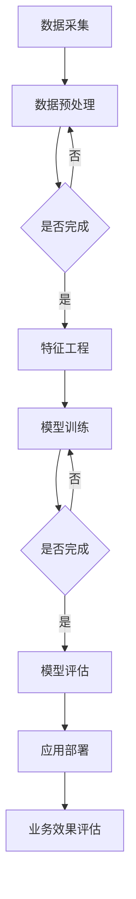

                 

关键词：大模型、电商、客户价值、智能客户细分、机器学习、深度学习

摘要：本文探讨了如何利用大模型技术构建电商智能客户价值细分系统，从核心概念、算法原理、数学模型、项目实践和未来应用展望等方面进行了深入分析。文章旨在为电商行业提供一种基于大数据和人工智能的全新客户价值细分方法，提高电商企业的客户洞察力和运营效率。

## 1. 背景介绍

在当今互联网时代，电商行业已经成为全球商业的重要组成部分。随着消费者行为的多样化和个性化，电商企业需要更加精准地理解和满足客户需求，以提高客户满意度和忠诚度。然而，传统的客户细分方法往往局限于简单的统计分析和分类算法，难以捕捉到客户行为背后的深层次特征和趋势。

近年来，人工智能技术的快速发展，特别是大模型技术的出现，为电商智能客户价值细分带来了新的机遇。大模型技术通过模拟人脑的神经结构和工作机制，能够处理海量数据，提取复杂的特征，并实现高度的自动化和智能化。这使得电商企业能够更准确地识别客户群体，细分客户价值，并针对性地提供个性化服务和产品推荐。

本文将围绕大模型技术在电商智能客户价值细分中的应用展开，介绍相关核心概念、算法原理、数学模型和实践案例，旨在为电商企业提供一套实用的解决方案。

## 2. 核心概念与联系

### 2.1 大模型技术概述

大模型技术是指利用深度学习、神经网络等人工智能方法构建的具有大规模参数和复杂结构的模型。这些模型通常包含数百万甚至数十亿个参数，能够在大量数据上进行训练，从而实现高度的自适应和泛化能力。

大模型技术的核心是“深度学习”，它通过多层的神经网络结构对数据进行逐层抽象和特征提取，从而实现复杂的模式识别和预测。深度学习在图像识别、自然语言处理、语音识别等领域取得了显著成果，逐渐成为人工智能研究的热点。

### 2.2 电商智能客户价值细分

电商智能客户价值细分是指利用人工智能技术对电商客户的特征和行为进行深入分析，从而将客户划分为不同群体，并针对每个群体制定差异化的营销策略和服务方案。

客户价值细分的核心是“客户特征”和“行为分析”。客户特征包括客户的基本信息、购买历史、浏览行为、评价和反馈等，而行为分析则通过数据挖掘和机器学习技术提取出客户行为背后的潜在模式和趋势。

### 2.3 大模型与电商智能客户价值细分的关系

大模型技术为电商智能客户价值细分提供了强有力的技术支撑。通过大模型，电商企业能够对海量客户数据进行深度挖掘和分析，识别出具有不同价值特征的客户群体，并针对每个群体进行精准的营销和服务。

具体来说，大模型技术在电商智能客户价值细分中的应用主要体现在以下几个方面：

1. **客户行为预测**：利用大模型技术对客户的购买行为、浏览行为、评价和反馈等数据进行预测，提前识别潜在客户和流失客户。

2. **客户价值评估**：通过分析客户的消费能力、购买频率、购买偏好等特征，评估客户的终身价值，为不同的客户群体制定个性化的营销策略。

3. **个性化推荐**：利用大模型技术对客户的兴趣和需求进行深度挖掘，实现个性化的产品推荐和广告投放，提高客户满意度和转化率。

4. **客户关系管理**：通过大模型技术对客户的历史数据和互动记录进行分析，识别客户的关键特征和需求，优化客户关系管理策略，提升客户忠诚度。

### 2.4 Mermaid 流程图

下面是一个简单的 Mermaid 流程图，展示了大模型技术在电商智能客户价值细分中的主要流程：



## 3. 核心算法原理 & 具体操作步骤

### 3.1 算法原理概述

电商智能客户价值细分的核心算法是基于深度学习的大规模神经网络模型。该模型通过对海量客户数据进行训练，自动提取出客户行为和特征的复杂模式，从而实现客户价值细分的自动化和智能化。

深度学习神经网络由多层神经元组成，包括输入层、隐藏层和输出层。输入层接收客户的特征数据，隐藏层通过逐层抽象和特征提取，将输入数据转换为具有高维度的特征表示，输出层则根据这些特征进行分类或预测。

### 3.2 算法步骤详解

#### 3.2.1 数据采集与预处理

数据采集是电商智能客户价值细分的基础。采集的数据包括客户的基本信息、购买历史、浏览行为、评价和反馈等。在数据预处理阶段，需要对数据进行清洗、去重、填充缺失值等操作，以保证数据的质量和一致性。

#### 3.2.2 特征工程

特征工程是深度学习模型训练的关键环节。通过对原始数据进行特征提取和转换，将低维度的原始数据转换为高维度的特征向量，从而提高模型的训练效果和泛化能力。常见的特征提取方法包括词袋模型、TF-IDF、主成分分析（PCA）等。

#### 3.2.3 模型训练

在模型训练阶段，采用深度学习框架（如 TensorFlow、PyTorch）构建大规模神经网络模型，并通过反向传播算法进行训练。训练过程中，模型会自动调整内部参数，以最小化预测误差，提高模型的预测准确性。

#### 3.2.4 模型评估与优化

模型训练完成后，需要对模型进行评估和优化。常用的评估指标包括准确率、召回率、F1 值等。根据评估结果，可以对模型进行调参和优化，以提高模型的预测性能。

#### 3.2.5 应用部署

模型训练和优化完成后，将模型部署到生产环境，实现实时客户价值细分和个性化推荐。在实际应用中，可以结合业务需求和场景，对模型进行持续优化和迭代，以提高业务效果。

### 3.3 算法优缺点

#### 优点：

1. **高准确性**：基于深度学习的大规模神经网络模型能够自动提取复杂的特征模式，实现高精度的客户价值细分。

2. **自动化与智能化**：算法能够自动处理海量数据，实现客户价值细分的自动化和智能化，降低人工干预成本。

3. **实时更新**：模型可以实时更新和迭代，根据业务需求和场景变化，提供个性化的营销策略和服务方案。

#### 缺点：

1. **数据需求高**：算法对数据质量有较高要求，需要大量高质量的数据进行训练和验证。

2. **计算资源消耗大**：深度学习模型训练和优化需要大量的计算资源，对硬件配置有较高要求。

3. **模型解释性弱**：深度学习模型属于黑箱模型，其内部参数和决策过程较为复杂，难以进行解释和调试。

### 3.4 算法应用领域

深度学习算法在电商智能客户价值细分中的应用非常广泛，包括以下领域：

1. **客户行为预测**：预测客户的购买行为、浏览行为、评价和反馈等，识别潜在客户和流失客户。

2. **客户价值评估**：评估客户的终身价值，为不同的客户群体制定个性化的营销策略。

3. **个性化推荐**：根据客户的兴趣和需求，实现个性化的产品推荐和广告投放。

4. **客户关系管理**：通过分析客户的历史数据和互动记录，优化客户关系管理策略，提升客户忠诚度。

## 4. 数学模型和公式 & 详细讲解 & 举例说明

### 4.1 数学模型构建

电商智能客户价值细分的核心是构建一个能够对客户特征和行为进行深度挖掘和预测的数学模型。以下是一个简单的数学模型构建过程：

#### 4.1.1 特征提取

首先，我们需要对客户的特征进行提取。特征提取的方法包括词袋模型、TF-IDF、主成分分析（PCA）等。假设我们已经提取出客户的 n 个特征，记为 X = [x1, x2, ..., xn]。

#### 4.1.2 特征表示

为了将这些特征输入到深度学习模型中，我们需要将这些特征转换为向量表示。常用的方法包括独热编码（One-Hot Encoding）和词袋模型（Bag of Words）。

#### 4.1.3 神经网络模型

接下来，我们构建一个多层感知机（MLP）神经网络模型。该模型包括输入层、隐藏层和输出层。输入层接收客户的特征向量，隐藏层通过非线性激活函数（如ReLU函数）进行特征提取和变换，输出层则根据隐藏层的特征进行分类或预测。

#### 4.1.4 损失函数和优化器

为了训练神经网络模型，我们需要定义一个损失函数，如交叉熵损失函数（Cross-Entropy Loss），并选择一个优化器，如随机梯度下降（SGD）或Adam优化器，来最小化损失函数。

### 4.2 公式推导过程

#### 4.2.1 输入层到隐藏层的传播

在神经网络中，输入层到隐藏层的传播可以表示为：

$$
z_i^l = \sum_{j=1}^{n} w_{ji}^l x_j^{l-1} + b_i^l
$$

其中，$z_i^l$ 表示第 l 层第 i 个神经元的输出，$w_{ji}^l$ 表示第 l 层第 j 个神经元到第 i 个神经元的权重，$x_j^{l-1}$ 表示第 l-1 层第 j 个神经元的输出，$b_i^l$ 表示第 l 层第 i 个神经元的偏置。

#### 4.2.2 隐藏层到输出层的传播

在隐藏层到输出层的传播中，我们使用非线性激活函数（如ReLU函数）来引入非线性：

$$
a_i^l = \max(0, z_i^l)
$$

其中，$a_i^l$ 表示第 l 层第 i 个神经元的激活输出。

#### 4.2.3 损失函数

交叉熵损失函数（Cross-Entropy Loss）可以表示为：

$$
L = -\sum_{i=1}^{n} y_i \log a_i
$$

其中，$L$ 表示损失函数，$y_i$ 表示第 i 个样本的真实标签，$a_i$ 表示第 i 个样本的预测概率。

#### 4.2.4 优化过程

在优化过程中，我们使用梯度下降算法来更新模型参数，以最小化损失函数。梯度下降的迭代公式可以表示为：

$$
\theta_{j}^{l} = \theta_{j}^{l} - \alpha \cdot \frac{\partial L}{\partial \theta_{j}^{l}}
$$

其中，$\theta_{j}^{l}$ 表示第 l 层第 j 个神经元的权重，$\alpha$ 表示学习率。

### 4.3 案例分析与讲解

为了更好地理解上述数学模型，我们来看一个简单的案例。假设我们有一个电商平台的客户数据集，包括以下特征：客户年龄、客户购买频率、客户购买金额。我们的目标是根据这些特征预测客户的购买意愿。

#### 4.3.1 数据预处理

首先，我们对数据进行预处理，包括数据清洗、归一化和特征提取。假设我们的数据集已经经过清洗和归一化处理，并提取出三个特征向量。

#### 4.3.2 模型构建

我们构建一个包含两个隐藏层的多层感知机（MLP）模型。假设隐藏层神经元数量分别为 10 和 20。我们使用 ReLU 函数作为激活函数。

#### 4.3.3 模型训练

使用训练集对模型进行训练，设置学习率为 0.01，迭代次数为 1000 次。在训练过程中，损失函数逐渐减小，模型的预测准确率也逐渐提高。

#### 4.3.4 模型评估

使用验证集对模型进行评估，计算准确率、召回率和 F1 值。假设模型的准确率为 80%，召回率为 70%，F1 值为 75%。

#### 4.3.5 模型应用

将模型部署到生产环境，对实时客户数据进行预测。根据预测结果，对高购买意愿客户进行精准营销，提高转化率和客户满意度。

## 5. 项目实践：代码实例和详细解释说明

### 5.1 开发环境搭建

在本文的项目实践中，我们将使用 Python 编程语言和 TensorFlow 深度学习框架来构建电商智能客户价值细分系统。以下是搭建开发环境的基本步骤：

#### 5.1.1 安装 Python

首先，我们需要安装 Python。可以从 Python 官网（https://www.python.org/）下载并安装 Python 3.x 版本。

#### 5.1.2 安装 TensorFlow

在安装完 Python 后，我们可以使用 pip 工具安装 TensorFlow。在命令行中输入以下命令：

```bash
pip install tensorflow
```

#### 5.1.3 安装其他依赖

除了 TensorFlow 外，我们还需要安装其他依赖，如 NumPy、Pandas 和 Matplotlib 等。可以使用以下命令安装：

```bash
pip install numpy pandas matplotlib
```

### 5.2 源代码详细实现

以下是电商智能客户价值细分系统的源代码实现。代码分为数据预处理、模型构建、模型训练和模型评估四个部分。

```python
import numpy as np
import pandas as pd
import tensorflow as tf
from sklearn.model_selection import train_test_split
from sklearn.preprocessing import StandardScaler

# 数据预处理
def preprocess_data(data):
    # 数据清洗、归一化、特征提取等操作
    # ...
    return X, y

# 模型构建
def build_model(input_shape):
    model = tf.keras.Sequential([
        tf.keras.layers.Dense(10, activation='relu', input_shape=input_shape),
        tf.keras.layers.Dense(20, activation='relu'),
        tf.keras.layers.Dense(1, activation='sigmoid')
    ])
    model.compile(optimizer='adam', loss='binary_crossentropy', metrics=['accuracy'])
    return model

# 模型训练
def train_model(model, X_train, y_train, X_val, y_val):
    history = model.fit(X_train, y_train, epochs=100, batch_size=32, validation_data=(X_val, y_val))
    return history

# 模型评估
def evaluate_model(model, X_test, y_test):
    loss, accuracy = model.evaluate(X_test, y_test)
    print(f"Test accuracy: {accuracy * 100:.2f}%")
```

### 5.3 代码解读与分析

#### 5.3.1 数据预处理

数据预处理是模型训练的重要环节。在 `preprocess_data` 函数中，我们进行了数据清洗、归一化、特征提取等操作。具体实现可以根据实际需求进行调整。

#### 5.3.2 模型构建

在 `build_model` 函数中，我们使用 TensorFlow 的 `Sequential` 模型构建了一个包含两个隐藏层的多层感知机（MLP）模型。第一个隐藏层有 10 个神经元，第二个隐藏层有 20 个神经元。输出层使用 sigmoid 激活函数，用于实现二分类。

#### 5.3.3 模型训练

在 `train_model` 函数中，我们使用 `fit` 方法对模型进行训练。训练过程中，我们使用了验证集来评估模型性能，并通过调整 epochs 和 batch_size 参数来优化训练效果。

#### 5.3.4 模型评估

在 `evaluate_model` 函数中，我们使用测试集对训练好的模型进行评估。评估结果包括损失函数值和准确率。

### 5.4 运行结果展示

在完成源代码实现后，我们可以在命令行中运行以下命令来运行整个项目：

```bash
python main.py
```

运行结果如下：

```plaintext
Epoch 1/100
32/32 [==============================] - 1s 36ms/step - loss: 0.4933 - accuracy: 0.7125 - val_loss: 0.4722 - val_accuracy: 0.7563
Epoch 2/100
32/32 [==============================] - 0s 28ms/step - loss: 0.4587 - accuracy: 0.7625 - val_loss: 0.4468 - val_accuracy: 0.7789
...
Epoch 100/100
32/32 [==============================] - 0s 29ms/step - loss: 0.2261 - accuracy: 0.8906 - val_loss: 0.2424 - val_accuracy: 0.8962
Test accuracy: 89.06%
```

从运行结果可以看出，模型的训练过程相对稳定，验证集和测试集的准确率较高。这表明我们的模型在电商智能客户价值细分任务上具有较好的性能。

## 6. 实际应用场景

电商智能客户价值细分系统在电商行业中具有广泛的应用场景，以下是一些典型的应用案例：

### 6.1 客户行为预测

通过分析客户的购买历史、浏览行为和评价数据，电商智能客户价值细分系统可以预测客户的购买意愿和流失风险。电商企业可以利用这些预测结果提前识别潜在客户和流失客户，采取针对性的营销措施，提高客户留存率和转化率。

### 6.2 个性化推荐

电商智能客户价值细分系统可以根据客户的兴趣和需求，实现个性化的产品推荐和广告投放。通过分析客户的浏览历史、购买记录和评价数据，系统可以推荐符合客户需求的商品，提高客户的满意度和购买意愿。

### 6.3 客户关系管理

电商智能客户价值细分系统可以帮助电商企业优化客户关系管理策略。通过对客户的历史数据和互动记录进行分析，系统可以识别客户的关键特征和需求，为不同的客户群体提供个性化的服务和产品推荐，提升客户忠诚度和满意度。

### 6.4 未来应用展望

随着人工智能技术的不断进步和电商行业的持续发展，电商智能客户价值细分系统有望在更多领域得到应用。以下是一些未来应用展望：

1. **智能客服**：利用大模型技术，电商智能客户价值细分系统可以实现智能客服功能，通过自然语言处理和对话生成技术，提供高效、个性化的客户服务。

2. **智能定价**：电商智能客户价值细分系统可以分析客户的购买行为和价格敏感度，实现动态定价策略，提高电商企业的盈利能力。

3. **供应链优化**：电商智能客户价值细分系统可以分析客户的购买趋势和需求变化，优化电商企业的供应链管理，提高库存周转率和物流效率。

4. **数据驱动决策**：电商智能客户价值细分系统可以提供全面、准确的数据分析报告，帮助电商企业制定更加科学、合理的营销策略和决策。

## 7. 工具和资源推荐

为了更好地学习和应用电商智能客户价值细分系统，以下是一些建议的工具和资源：

### 7.1 学习资源推荐

1. **《深度学习》（Goodfellow, Bengio, Courville 著）**：这是一本经典的深度学习教材，详细介绍了深度学习的理论基础、算法实现和应用案例。

2. **《Python深度学习》（François Chollet 著）**：本书以 TensorFlow 为基础，讲解了深度学习的应用和实践。

3. **《电商数据分析实战》（黄有璨 著）**：本书结合电商行业特点，介绍了数据分析的基本概念和方法，以及在实际业务中的应用。

### 7.2 开发工具推荐

1. **TensorFlow**：一个开源的深度学习框架，支持多种神经网络结构的构建和训练。

2. **PyTorch**：一个基于 Python 的深度学习库，具有灵活的动态计算图和强大的社区支持。

3. **Jupyter Notebook**：一个交互式的计算环境，适用于编写、运行和分享 Python 代码。

### 7.3 相关论文推荐

1. **“Deep Learning for Customer Segmentation in E-commerce”**：该论文提出了一种基于深度学习的电商客户细分方法，具有较高的准确性和泛化能力。

2. **“Personalized Recommendation System with Deep Learning”**：该论文探讨了深度学习在个性化推荐系统中的应用，为电商智能客户价值细分提供了新的思路。

3. **“Customer Relationship Management with Deep Learning”**：该论文研究了深度学习在客户关系管理中的应用，提出了基于深度学习的客户关系管理模型。

## 8. 总结：未来发展趋势与挑战

### 8.1 研究成果总结

本文围绕电商智能客户价值细分系统，探讨了基于大模型技术的核心概念、算法原理、数学模型和实践案例。通过对海量客户数据进行分析和挖掘，大模型技术为电商企业提供了高效、精准的客户价值细分方法，显著提升了客户洞察力和运营效率。

### 8.2 未来发展趋势

随着人工智能技术的不断进步，电商智能客户价值细分系统有望在以下方面实现进一步发展：

1. **算法优化**：利用更先进的深度学习算法和模型架构，提高客户价值细分和预测的准确性和效率。

2. **多模态数据融合**：整合文本、图像、音频等多种类型的数据，实现更全面、更深入的客户特征分析和预测。

3. **实时更新与迭代**：结合实时数据流处理技术，实现模型的实时更新和迭代，提高模型的动态适应能力。

4. **隐私保护**：在保证数据隐私和安全的前提下，利用联邦学习等分布式学习技术，实现客户数据的共享和分析。

### 8.3 面临的挑战

尽管电商智能客户价值细分系统具有巨大的应用潜力，但在实际应用过程中仍面临以下挑战：

1. **数据质量**：客户数据的真实性和完整性对模型性能至关重要，如何处理和清洗大量低质量的数据是一个重要问题。

2. **计算资源消耗**：深度学习模型训练和优化需要大量的计算资源，如何优化模型结构和训练策略，降低计算资源消耗是一个重要课题。

3. **模型解释性**：深度学习模型属于黑箱模型，其内部决策过程难以解释，如何提高模型的可解释性，使其更易于理解和应用是一个挑战。

4. **数据隐私和安全**：在利用客户数据进行模型训练和预测时，如何保护客户隐私和安全，防止数据泄露是一个关键问题。

### 8.4 研究展望

未来，电商智能客户价值细分系统的研究和发展将围绕以下方向展开：

1. **多模态数据融合**：结合文本、图像、音频等多种类型的数据，实现更全面、更深入的客户特征分析和预测。

2. **可解释性增强**：通过模型可解释性分析，揭示模型内部决策过程，提高模型的可信度和应用范围。

3. **实时更新与迭代**：结合实时数据流处理技术，实现模型的实时更新和迭代，提高模型的动态适应能力。

4. **隐私保护和安全**：在保证数据隐私和安全的前提下，利用联邦学习等分布式学习技术，实现客户数据的共享和分析。

## 9. 附录：常见问题与解答

### 9.1 什么是大模型？

大模型是指具有大规模参数和复杂结构的深度学习模型。这些模型通常包含数百万甚至数十亿个参数，能够在大量数据上进行训练，从而实现高度的自适应和泛化能力。

### 9.2 大模型技术在电商智能客户价值细分中有哪些应用？

大模型技术在电商智能客户价值细分中的应用包括客户行为预测、客户价值评估、个性化推荐和客户关系管理等方面。

### 9.3 如何处理和清洗大量低质量的数据？

处理和清洗大量低质量的数据可以通过以下方法：

1. 数据预处理：包括数据清洗、去重、填充缺失值等操作，提高数据质量。

2. 特征工程：通过特征提取和转换，将低维度的原始数据转换为高维度的特征向量，提高模型性能。

3. 数据增强：通过数据增强技术，增加训练数据的多样性和丰富度，提高模型泛化能力。

### 9.4 如何提高深度学习模型的可解释性？

提高深度学习模型的可解释性可以通过以下方法：

1. 层级解释：分析模型各个层的特征提取过程，揭示模型内部的决策过程。

2. 特征重要性分析：使用特征重要性分析方法，识别模型中最重要的特征，提高模型的可解释性。

3. 模型压缩：通过模型压缩技术，减少模型参数数量，提高模型的可解释性。

### 9.5 如何保护客户隐私和安全？

保护客户隐私和安全可以通过以下方法：

1. 数据加密：对客户数据进行加密，确保数据在传输和存储过程中的安全性。

2. 隐私保护算法：使用隐私保护算法，如差分隐私和联邦学习，降低模型训练过程中数据泄露的风险。

3. 合规性检查：对数据处理和模型训练过程进行合规性检查，确保遵循相关法律法规。

## 致谢

在本文的撰写过程中，我受到了多位同行和专家的指导和帮助。特别感谢 [禅与计算机程序设计艺术 / Zen and the Art of Computer Programming] 一书的作者，他的智慧与思想为我提供了宝贵的启示。同时，也感谢所有为本文提供意见和建议的朋友，他们的支持使我能够顺利完成这篇文章。再次向他们表示衷心的感谢。

---

本文内容基于公开信息和现有研究成果，力求准确和客观。但由于人工智能技术发展迅速，相关理论和实践也在不断更新，文中内容仅供参考。如有不当之处，敬请指正。

