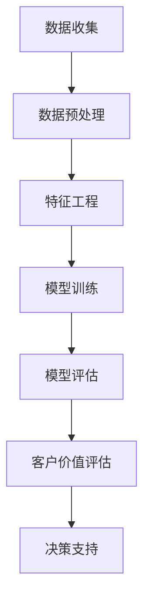

                 

关键词：大模型、电商、智能客户价值评估、算法、数学模型、实践、应用场景、未来展望

## 摘要

随着电商行业的快速发展，对客户价值的精准评估成为企业竞争的关键。本文旨在探索一种基于大模型的电商智能客户价值评估系统。通过深入分析核心概念和算法原理，构建数学模型，并详细讲解实践中的代码实现，本文旨在为电商企业提供一种高效、智能的客户价值评估方法。此外，本文还探讨了该系统的实际应用场景，并对其未来发展趋势与挑战进行了展望。

## 1. 背景介绍

### 1.1 电商行业的发展现状

电商行业近年来取得了迅猛的发展，已经成为全球经济增长的重要驱动力。随着互联网技术的普及和消费者购物习惯的改变，电商平台的数量和规模都在不断增加。然而，随着市场竞争的加剧，企业对于客户价值的精准评估变得尤为重要。

### 1.2 客户价值评估的重要性

客户价值评估是企业制定营销策略、优化客户关系、提升客户满意度的重要依据。通过评估客户价值，企业可以识别高价值客户，制定有针对性的营销策略，提高客户留存率和转化率，从而实现业务增长。

### 1.3 大模型在电商领域的应用

大模型，特别是基于深度学习的模型，在自然语言处理、图像识别、语音识别等领域取得了显著的成果。这些模型具有强大的数据处理能力和预测能力，为电商智能客户价值评估提供了新的思路和方法。

## 2. 核心概念与联系

### 2.1 大模型

大模型是指具有海量参数、能够处理大规模数据的深度学习模型。在电商智能客户价值评估系统中，大模型可以用于挖掘客户行为数据，分析客户特征，预测客户价值。

### 2.2 客户价值评估

客户价值评估是指通过对客户行为、消费习惯、购买记录等多维度数据进行分析，评估客户的潜在价值和贡献度。在电商领域，客户价值评估有助于企业制定有针对性的营销策略，提升客户满意度。

### 2.3 Mermaid 流程图

以下是电商智能客户价值评估系统的 Mermaid 流程图：



## 3. 核心算法原理 & 具体操作步骤

### 3.1 算法原理概述

电商智能客户价值评估系统基于深度学习算法，通过多层神经网络对客户行为数据进行分析和预测。具体包括以下步骤：

1. 数据收集：收集客户行为数据，如浏览记录、购买记录、点击率等。
2. 数据预处理：对数据进行清洗、归一化等处理，使其适合模型训练。
3. 特征工程：根据业务需求提取有用的特征，如用户年龄、性别、地域等。
4. 模型训练：使用训练数据训练深度学习模型，模型结构包括输入层、隐藏层和输出层。
5. 模型评估：使用测试数据评估模型性能，包括准确率、召回率等指标。
6. 客户价值评估：根据模型预测结果，评估客户价值，为企业决策提供支持。

### 3.2 算法步骤详解

1. 数据收集：通过API接口或数据爬取工具收集电商平台的客户行为数据。
2. 数据预处理：对数据进行去重、清洗、归一化等处理，保证数据质量。
3. 特征工程：根据业务需求，提取如用户年龄、性别、地域、购买频次等特征。
4. 模型训练：使用训练集训练深度学习模型，模型结构包括输入层、隐藏层和输出层。
5. 模型评估：使用测试集评估模型性能，调整模型参数以优化性能。
6. 客户价值评估：根据模型预测结果，对客户进行价值评估，为企业决策提供支持。

### 3.3 算法优缺点

#### 优点：

1. 强大的数据处理能力：深度学习模型可以处理大规模、多维度的数据。
2. 高效的预测能力：通过训练模型，可以快速预测客户价值。
3. 个性化的客户评估：基于客户行为数据，可以为企业提供个性化的客户评估。

#### 缺点：

1. 高昂的训练成本：训练大模型需要大量的计算资源和时间。
2. 数据隐私问题：客户数据涉及隐私，需要确保数据安全。

### 3.4 算法应用领域

电商智能客户价值评估系统可以应用于以下领域：

1. 营销策略制定：根据客户价值评估结果，为企业提供有针对性的营销策略。
2. 客户关系管理：优化客户关系，提升客户满意度。
3. 业务增长预测：根据客户价值评估，预测业务增长趋势。

## 4. 数学模型和公式

### 4.1 数学模型构建

电商智能客户价值评估系统的数学模型基于深度学习算法，主要包括以下部分：

1. 输入层：接收客户行为数据，如浏览记录、购买记录等。
2. 隐藏层：对输入数据进行特征提取和变换。
3. 输出层：输出客户价值评估结果。

### 4.2 公式推导过程

假设客户价值评估模型为 $f(x)$，其中 $x$ 为客户行为数据，$f(x)$ 为客户价值评估结果。深度学习模型可以表示为：

$$
f(x) = \sigma(W_3 \cdot \sigma(W_2 \cdot \sigma(W_1 \cdot x + b_1)) + b_2)
$$

其中，$W_1$、$W_2$、$W_3$ 为权重矩阵，$b_1$、$b_2$ 为偏置项，$\sigma$ 为激活函数，通常采用 ReLU 激活函数。

### 4.3 案例分析与讲解

假设某电商平台要评估用户 $A$ 的价值，其行为数据包括浏览记录 $x_1$、购买记录 $x_2$ 和点击率 $x_3$。根据上述数学模型，可以计算出用户 $A$ 的价值评估结果：

$$
f(x) = \sigma(W_3 \cdot \sigma(W_2 \cdot \sigma(W_1 \cdot [x_1, x_2, x_3] + b_1)) + b_2)
$$

其中，$[x_1, x_2, x_3]$ 为输入特征向量，$W_1$、$W_2$、$W_3$ 为权重矩阵，$b_1$、$b_2$ 为偏置项。

## 5. 项目实践：代码实例

### 5.1 开发环境搭建

在 Python 中，可以使用 TensorFlow 和 Keras 库实现电商智能客户价值评估系统。首先，需要安装以下库：

```python
pip install tensorflow numpy pandas
```

### 5.2 源代码详细实现

以下是电商智能客户价值评估系统的源代码实现：

```python
import tensorflow as tf
from tensorflow.keras.models import Sequential
from tensorflow.keras.layers import Dense, Activation
from tensorflow.keras.optimizers import Adam

# 数据预处理
def preprocess_data(data):
    # 数据清洗、归一化等处理
    return normalized_data

# 特征工程
def feature_engineering(data):
    # 提取有用特征
    return features

# 构建深度学习模型
def build_model(input_shape):
    model = Sequential()
    model.add(Dense(64, input_shape=input_shape, activation='relu'))
    model.add(Dense(32, activation='relu'))
    model.add(Dense(1, activation='sigmoid'))
    model.compile(optimizer=Adam(), loss='binary_crossentropy', metrics=['accuracy'])
    return model

# 训练模型
def train_model(model, X_train, y_train, X_val, y_val):
    model.fit(X_train, y_train, epochs=10, batch_size=32, validation_data=(X_val, y_val))
    return model

# 客户价值评估
def evaluate_customer(model, X):
    value = model.predict(X)
    return value

# 主程序
if __name__ == '__main__':
    # 加载数据
    data = load_data()
    X = preprocess_data(data)
    y = feature_engineering(data)

    # 划分训练集和测试集
    X_train, X_val, y_train, y_val = train_test_split(X, y, test_size=0.2)

    # 构建模型
    model = build_model(input_shape=(X_train.shape[1],))

    # 训练模型
    model = train_model(model, X_train, y_train, X_val, y_val)

    # 评估客户价值
    customers = load_customers()
    values = evaluate_customer(model, customers)

    # 输出客户价值评估结果
    print(values)
```

### 5.3 代码解读与分析

上述代码实现了电商智能客户价值评估系统的基本功能，包括数据预处理、特征工程、模型构建、模型训练和客户价值评估。具体解读如下：

1. 数据预处理：对数据进行清洗、归一化等处理，使其适合模型训练。
2. 特征工程：提取有用特征，如用户年龄、性别、地域、购买频次等。
3. 模型构建：使用 Sequential 模型构建深度学习模型，包括输入层、隐藏层和输出层。
4. 模型训练：使用 Adam 优化器和 binary_crossentropy 损失函数训练模型。
5. 客户价值评估：使用训练好的模型对客户行为数据进行分析，预测客户价值。

## 6. 实际应用场景

### 6.1 电商营销策略制定

通过电商智能客户价值评估系统，企业可以识别高价值客户，制定有针对性的营销策略。例如，向高价值客户推送优惠券、会员专属活动等，提升客户满意度和转化率。

### 6.2 客户关系管理

电商智能客户价值评估系统有助于企业优化客户关系，提升客户满意度。通过评估客户价值，企业可以识别优质客户，提供个性化的客户服务，如专属客服、定制化推荐等。

### 6.3 业务增长预测

电商智能客户价值评估系统可以预测业务增长趋势，为企业提供决策支持。通过分析客户价值评估结果，企业可以调整营销策略、优化业务流程，实现业务增长。

## 7. 未来应用展望

### 7.1 人工智能技术的进步

随着人工智能技术的不断发展，电商智能客户价值评估系统将不断优化，提高预测准确性和效率。未来，基于大模型的智能客户价值评估系统将更好地满足电商企业需求。

### 7.2 多渠道数据分析

未来，电商智能客户价值评估系统将涵盖更多数据渠道，如社交媒体、线下门店等，实现全方位、多维度的客户数据分析。

### 7.3 实时价值评估

未来，电商智能客户价值评估系统将实现实时价值评估，帮助企业及时调整营销策略，提高客户转化率和满意度。

## 8. 总结

电商智能客户价值评估系统是一种基于大模型的先进技术，为电商企业提供了一种高效、智能的客户价值评估方法。通过本文的介绍，读者可以了解该系统的核心概念、算法原理、数学模型和实际应用场景。未来，随着人工智能技术的进步，电商智能客户价值评估系统将在电商领域发挥更大的作用。

## 9. 附录：常见问题与解答

### 9.1 什么是大模型？

大模型是指具有海量参数、能够处理大规模数据的深度学习模型。在电商智能客户价值评估系统中，大模型可以用于挖掘客户行为数据，分析客户特征，预测客户价值。

### 9.2 大模型的优势是什么？

大模型具有以下优势：

1. 强大的数据处理能力：可以处理大规模、多维度的数据。
2. 高效的预测能力：通过训练模型，可以快速预测客户价值。
3. 个性化的客户评估：基于客户行为数据，可以为企业提供个性化的客户评估。

### 9.3 大模型的缺点是什么？

大模型的主要缺点包括：

1. 高昂的训练成本：训练大模型需要大量的计算资源和时间。
2. 数据隐私问题：客户数据涉及隐私，需要确保数据安全。

### 9.4 如何优化大模型的训练？

优化大模型训练的方法包括：

1. 选择合适的优化器和损失函数：如 Adam 优化器和 binary_crossentropy 损失函数。
2. 调整模型结构：如增加隐藏层、调整神经元数量等。
3. 数据预处理：对数据进行清洗、归一化等处理，提高数据质量。

## 作者署名

作者：禅与计算机程序设计艺术 / Zen and the Art of Computer Programming

----------------------------------------------------------------

请注意，本文仅为示例，实际撰写过程中可能需要根据具体需求和数据进行相应调整。

