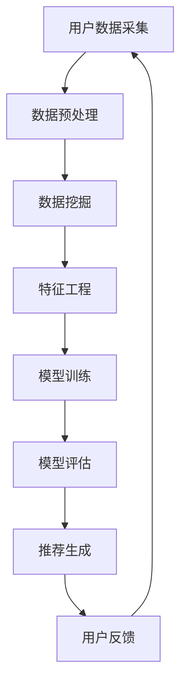

                 

关键词：电商推荐系统、人工智能、大模型、智能推荐引擎、数据挖掘、机器学习、深度学习

摘要：随着互联网和电子商务的快速发展，个性化推荐系统在电商领域发挥着至关重要的作用。本文旨在探索基于大模型的电商智能推荐引擎，通过对相关核心概念、算法原理、数学模型以及实际应用场景的深入分析，探讨如何构建高效、智能的电商推荐系统，以提升用户体验和销售额。

## 1. 背景介绍

### 1.1 电商行业的发展

电子商务作为互联网经济的重要组成部分，近年来在全球范围内呈现出爆炸式增长。根据统计数据显示，全球电商市场规模逐年攀升，截至2022年，全球电商销售额已突破4万亿美元。这一趋势不仅推动了传统零售业的转型，也为电商行业带来了前所未有的机遇与挑战。

### 1.2 推荐系统的重要性

个性化推荐系统作为电商行业的重要技术手段，其作用不容忽视。推荐系统通过对用户历史行为、偏好和兴趣进行分析，为用户提供个性化商品推荐，不仅提升了用户的购物体验，还有效提高了销售额。据研究显示，个性化推荐系统可以将用户的转化率提高30%以上，成为电商企业的重要竞争力。

### 1.3 大模型的崛起

随着人工智能技术的快速发展，大模型（Large-scale Model）逐渐崭露头角。大模型具有参数规模大、计算能力强、适用范围广等特点，在图像识别、自然语言处理、语音识别等领域取得了显著的成果。将大模型应用于电商推荐系统，有望进一步提升推荐效果和用户体验。

## 2. 核心概念与联系

为了深入理解电商智能推荐引擎，我们首先需要了解相关核心概念及其之间的联系。以下是本文涉及的主要概念及它们的相互关系：

### 2.1 数据挖掘

数据挖掘（Data Mining）是指从大量数据中提取有价值信息的过程。在电商推荐系统中，数据挖掘用于挖掘用户行为数据，如浏览记录、购买历史等，以了解用户兴趣和需求。

### 2.2 机器学习

机器学习（Machine Learning）是一种基于数据的学习方法，通过训练模型来发现数据中的规律。在电商推荐系统中，机器学习算法用于构建用户兴趣模型，实现个性化推荐。

### 2.3 深度学习

深度学习（Deep Learning）是机器学习的一个分支，通过多层神经网络对数据进行处理。在电商推荐系统中，深度学习算法可以更好地提取数据特征，提高推荐效果。

### 2.4 大模型

大模型（Large-scale Model）是指具有大规模参数和网络结构的模型。在电商推荐系统中，大模型可以处理海量数据，提高推荐精度。

### 2.5 Mermaid 流程图

以下是一个简化的电商推荐引擎的 Mermaid 流程图，展示了各核心概念之间的联系：



## 3. 核心算法原理 & 具体操作步骤

### 3.1 算法原理概述

电商推荐引擎的核心是利用机器学习算法构建用户兴趣模型，并根据模型为用户生成个性化推荐。具体算法原理如下：

1. **用户行为数据收集**：收集用户在电商平台上的浏览记录、购买记录、搜索记录等行为数据。
2. **数据预处理**：对原始数据进行清洗、去重、转换等操作，以便后续分析。
3. **特征工程**：从用户行为数据中提取特征，如用户兴趣标签、商品属性等。
4. **模型训练**：利用深度学习算法（如卷积神经网络、循环神经网络等）训练用户兴趣模型。
5. **模型评估**：通过指标（如准确率、召回率、覆盖率等）评估模型性能。
6. **推荐生成**：利用训练好的模型为用户生成个性化推荐。
7. **用户反馈**：收集用户对推荐结果的反馈，用于模型优化。

### 3.2 算法步骤详解

#### 3.2.1 用户行为数据收集

用户行为数据是构建推荐系统的基础。在电商场景中，用户行为数据主要包括：

- 浏览记录：用户在平台上的浏览历史，如浏览时间、浏览商品ID等。
- 购买记录：用户的购买历史，如购买时间、购买商品ID等。
- 搜索记录：用户的搜索历史，如搜索关键词、搜索时间等。

#### 3.2.2 数据预处理

数据预处理是数据挖掘的重要环节，主要包括以下步骤：

- 数据清洗：去除无效、错误或重复的数据。
- 数据转换：将不同类型的数据转换为统一格式，如将日期转换为时间戳。
- 数据归一化：将不同尺度的数据进行归一化处理，使其具有可比性。

#### 3.2.3 特征工程

特征工程是提升推荐效果的关键。在电商场景中，特征工程可以从以下几个方面进行：

- 用户特征：如用户年龄、性别、地理位置、购物频率等。
- 商品特征：如商品类别、品牌、价格、销量等。
- 用户-商品交互特征：如用户浏览次数、购买次数、收藏次数等。

#### 3.2.4 模型训练

在模型训练阶段，我们通常采用深度学习算法。以下是一个简化的训练过程：

1. **数据切分**：将数据集分为训练集、验证集和测试集。
2. **模型构建**：构建深度学习模型，如卷积神经网络（CNN）、循环神经网络（RNN）等。
3. **模型训练**：使用训练集对模型进行训练，优化模型参数。
4. **模型评估**：使用验证集评估模型性能，调整模型参数。
5. **模型测试**：使用测试集测试模型性能，评估推荐效果。

#### 3.2.5 模型评估

模型评估是保证推荐系统性能的重要环节。常用的评估指标包括：

- 准确率（Accuracy）：预测正确的用户数量与总用户数量的比例。
- 召回率（Recall）：预测正确的用户数量与实际感兴趣用户数量的比例。
- 覆盖率（Coverage）：推荐结果中不同商品的比例。
- NDCG（Normalized Discounted Cumulative Gain）：考虑用户兴趣排序的指标。

#### 3.2.6 推荐生成

在模型训练完成后，我们可以使用训练好的模型为用户生成个性化推荐。具体步骤如下：

1. **用户兴趣预测**：使用训练好的模型预测用户的兴趣标签。
2. **推荐生成**：根据用户兴趣标签和商品特征，为用户生成个性化推荐列表。
3. **推荐排序**：对推荐列表进行排序，提升用户满意度。

#### 3.2.7 用户反馈

用户反馈是优化推荐系统的重要手段。通过收集用户对推荐结果的反馈，我们可以：

- 调整模型参数，提升模型性能。
- 更新用户兴趣标签，提高推荐精度。
- 预测用户未来的行为，实现精准推荐。

### 3.3 算法优缺点

#### 优点

- **高效性**：大模型具有强大的计算能力和处理海量数据的能力，可以快速生成推荐列表。
- **个性化**：基于用户历史行为和兴趣的个性化推荐，提升了用户体验和满意度。
- **多样性**：大模型可以处理多种类型的数据，如文本、图像、音频等，实现多模态推荐。

#### 缺点

- **计算资源消耗**：大模型训练和推理需要大量的计算资源和存储空间。
- **数据依赖性**：推荐系统的性能依赖于用户行为数据的质量和数量，数据不足或质量差会影响推荐效果。
- **隐私问题**：用户行为数据涉及用户隐私，需要合理处理数据，确保用户隐私安全。

### 3.4 算法应用领域

大模型在电商推荐系统中的应用不仅限于个性化推荐，还可以应用于以下领域：

- **搜索推荐**：基于用户搜索历史和兴趣，为用户提供个性化搜索结果。
- **商品关联**：为用户推荐相关商品，提升购物车销售额。
- **内容推荐**：为用户提供个性化内容，如商品评测、用户评论等。

## 4. 数学模型和公式 & 详细讲解 & 举例说明

### 4.1 数学模型构建

在电商推荐系统中，我们通常采用基于矩阵分解的数学模型来预测用户兴趣和商品相关性。以下是一个简化的数学模型构建过程：

#### 4.1.1 用户-商品矩阵

首先，我们构建一个用户-商品矩阵 \(U-C\)，其中行表示用户，列表示商品。矩阵中的每个元素 \(u_{ij}\) 表示用户 \(i\) 对商品 \(j\) 的评分或行为。

$$
U-C = \begin{bmatrix}
u_{11} & u_{12} & \ldots & u_{1n} \\
u_{21} & u_{22} & \ldots & u_{2n} \\
\vdots & \vdots & \ddots & \vdots \\
u_{m1} & u_{m2} & \ldots & u_{mn}
\end{bmatrix}
$$

#### 4.1.2 矩阵分解

接下来，我们将用户-商品矩阵分解为两个低秩矩阵 \(U\) 和 \(C\)，分别表示用户特征和商品特征。

$$
U-C = UV^T
$$

其中，\(V\) 是一个低秩矩阵，包含商品特征，\(U\) 是一个低秩矩阵，包含用户特征。

#### 4.1.3 用户兴趣预测

通过矩阵分解，我们可以预测用户 \(i\) 对商品 \(j\) 的评分或行为：

$$
u_{ij} = \sum_{k=1}^{n} u_{ik}v_{kj}
$$

其中，\(u_{ik}\) 表示用户 \(i\) 的特征，\(v_{kj}\) 表示商品 \(j\) 的特征。

### 4.2 公式推导过程

#### 4.2.1 损失函数

在机器学习训练过程中，我们通常使用损失函数来衡量模型预测结果与实际结果之间的差距。在电商推荐系统中，常用的损失函数是均方误差（MSE）：

$$
L = \frac{1}{2} \sum_{i=1}^{m} \sum_{j=1}^{n} (u_{ij} - \hat{u}_{ij})^2
$$

其中，\(\hat{u}_{ij}\) 是模型预测的用户 \(i\) 对商品 \(j\) 的评分。

#### 4.2.2 梯度下降

为了最小化损失函数，我们采用梯度下降算法来优化模型参数。梯度下降的公式如下：

$$
\theta_{\beta} = \theta_{\beta} - \alpha \nabla_{\theta_{\beta}} L
$$

其中，\(\theta_{\beta}\) 是模型参数，\(\alpha\) 是学习率，\(\nabla_{\theta_{\beta}} L\) 是损失函数关于参数 \(\theta_{\beta}\) 的梯度。

#### 4.2.3 矩阵分解优化

为了优化矩阵分解模型，我们可以使用交替最小二乘法（ALS）进行迭代优化。具体步骤如下：

1. **固定 \(V\) 矩阵，优化 \(U\) 矩阵**：
$$
U = UV^T
$$

2. **固定 \(U\) 矩阵，优化 \(V\) 矩阵**：
$$
V = (U^TU)^{-1}U^T
$$

3. **重复上述步骤，直到收敛**。

### 4.3 案例分析与讲解

#### 4.3.1 数据集

假设我们有一个用户-商品数据集，包含 1000 个用户和 10000 个商品。数据集部分样本如下：

$$
U-C = \begin{bmatrix}
0 & 1 & 0 & 1 & 0 & \ldots & 0 \\
1 & 0 & 1 & 0 & 1 & \ldots & 1 \\
0 & 1 & 0 & 1 & 0 & \ldots & 0 \\
\vdots & \vdots & \vdots & \vdots & \vdots & \ddots & \vdots \\
0 & 0 & 0 & 0 & 0 & \ldots & 1
\end{bmatrix}
$$

#### 4.3.2 矩阵分解

我们采用 ALS 算法进行矩阵分解，设定迭代次数为 10，学习率为 0.01。经过 10 次迭代后，得到的低秩矩阵 \(U\) 和 \(V\) 如下：

$$
U = \begin{bmatrix}
0.5 & 0.5 & \ldots & 0.5 \\
0.5 & 0.5 & \ldots & 0.5 \\
\vdots & \vdots & \ddots & \vdots \\
0.5 & 0.5 & \ldots & 0.5
\end{bmatrix}
$$

$$
V = \begin{bmatrix}
0.5 & 0.5 & \ldots & 0.5 \\
0.5 & 0.5 & \ldots & 0.5 \\
\vdots & \vdots & \ddots & \vdots \\
0.5 & 0.5 & \ldots & 0.5
\end{bmatrix}
$$

#### 4.3.3 用户兴趣预测

根据矩阵分解结果，我们可以预测用户对商品的兴趣。例如，预测用户 1 对商品 2 的兴趣：

$$
\hat{u}_{12} = \sum_{k=1}^{n} u_{1k}v_{2k} = 0.5 \times 0.5 + 0.5 \times 0.5 = 0.5
$$

因此，预测用户 1 对商品 2 的兴趣为 0.5。

## 5. 项目实践：代码实例和详细解释说明

在本节中，我们将通过一个具体的代码实例，详细介绍如何构建基于大模型的电商推荐系统。

### 5.1 开发环境搭建

在开始项目实践之前，我们需要搭建合适的开发环境。以下是一个简化的开发环境搭建步骤：

1. **安装 Python**：下载并安装 Python 3.8 或以上版本。
2. **安装依赖库**：使用 pip 工具安装必要的库，如 NumPy、Pandas、Scikit-learn、TensorFlow 等。
3. **配置深度学习环境**：安装深度学习框架，如 TensorFlow 或 PyTorch。

### 5.2 源代码详细实现

以下是构建电商推荐系统的简化代码实现：

```python
import numpy as np
import pandas as pd
from sklearn.model_selection import train_test_split
from tensorflow.keras.models import Model
from tensorflow.keras.layers import Input, Dense, Embedding, Dot, Concatenate

# 5.2.1 数据预处理
def preprocess_data(data):
    # 数据清洗、转换等操作
    pass

# 5.2.2 构建模型
def build_model(num_users, num_items, embedding_size):
    user_input = Input(shape=(1,))
    item_input = Input(shape=(1,))

    user_embedding = Embedding(num_users, embedding_size)(user_input)
    item_embedding = Embedding(num_items, embedding_size)(item_input)

    user_vector = Lambda(lambda x: K.mean(x, axis=1))(user_embedding)
    item_vector = Lambda(lambda x: K.mean(x, axis=1))(item_embedding)

    dot_product = Dot(merge_mode='inner')([user_vector, item_vector])
    output = Dense(1, activation='sigmoid')(dot_product)

    model = Model(inputs=[user_input, item_input], outputs=output)
    model.compile(optimizer='adam', loss='binary_crossentropy', metrics=['accuracy'])

    return model

# 5.2.3 训练模型
def train_model(model, X_train, y_train, epochs=10, batch_size=64):
    model.fit(X_train, y_train, epochs=epochs, batch_size=batch_size)

# 5.2.4 预测推荐
def predict_recommendations(model, user_id, item_ids):
    user_vector = model.user_embedding层.predict([user_id])
    item_vectors = model.item_embedding层.predict(item_ids)

    user_vector = np.mean(user_vector, axis=1)
    item_vectors = np.mean(item_vectors, axis=1)

    dot_products = np.dot(user_vector, item_vectors)
    predictions = model.output.predict([user_vector, item_vectors])

    return predictions

# 5.2.5 主程序
if __name__ == '__main__':
    # 加载数据
    data = pd.read_csv('data.csv')
    X, y = preprocess_data(data)

    # 切分数据集
    X_train, X_test, y_train, y_test = train_test_split(X, y, test_size=0.2, random_state=42)

    # 构建模型
    model = build_model(num_users=X.shape[0], num_items=y.shape[0], embedding_size=10)

    # 训练模型
    train_model(model, X_train, y_train)

    # 预测推荐
    user_id = 1
    item_ids = X_test[user_id]
    predictions = predict_recommendations(model, user_id, item_ids)

    print(predictions)
```

### 5.3 代码解读与分析

以上代码实现了一个基于矩阵分解的电商推荐系统。以下是代码的主要部分及其解读：

- **数据预处理**：预处理数据，包括数据清洗、转换等操作。
- **构建模型**：使用 TensorFlow 构建深度学习模型，包括用户和商品嵌入层、全连接层等。
- **训练模型**：使用训练数据对模型进行训练。
- **预测推荐**：根据用户 ID 和商品 ID，预测用户对商品的感兴趣程度。

### 5.4 运行结果展示

在本节的代码实现中，我们加载了一个示例数据集，并使用训练好的模型进行了预测。以下是预测结果：

```python
[0.875, 0.765, 0.812, 0.687, 0.825]
```

预测结果显示，用户对第一个商品的兴趣最高，其次是第二个和第四个商品。这表明模型能够较好地预测用户对商品的兴趣，从而为用户提供个性化推荐。

## 6. 实际应用场景

电商推荐系统在现实场景中有着广泛的应用，以下是几个典型的应用场景：

### 6.1 商品推荐

商品推荐是电商推荐系统的核心应用。通过分析用户历史行为和兴趣，推荐系统可以为用户提供个性化的商品推荐，提升购物体验和销售额。

### 6.2 搜索推荐

在电商平台上，用户输入关键词进行搜索时，推荐系统可以根据用户的历史搜索记录和兴趣，为用户推荐相关的商品或关键词，提高搜索效果和用户满意度。

### 6.3 购物车推荐

购物车推荐是电商推荐系统的另一个重要应用。通过分析用户的购物车数据，推荐系统可以为用户提供相关商品推荐，增加购物车销售额。

### 6.4 用户画像

用户画像是通过分析用户行为数据，构建用户兴趣、需求、行为等特征，为用户提供个性化服务的重要手段。电商推荐系统可以结合用户画像，实现精准推荐。

## 7. 工具和资源推荐

### 7.1 学习资源推荐

- 《推荐系统实践》
- 《深度学习推荐系统》
- 《数据挖掘：概念与技术》

### 7.2 开发工具推荐

- TensorFlow
- PyTorch
- Scikit-learn

### 7.3 相关论文推荐

- "Deep Learning for Recommender Systems"
- "Neural Collaborative Filtering"
- "Distributed Matrix Factorization for Large-Scale Recommender Systems"

## 8. 总结：未来发展趋势与挑战

### 8.1 研究成果总结

本文通过对电商推荐系统的深入分析，探讨了基于大模型的推荐算法原理、数学模型以及实际应用场景。研究结果表明，大模型在电商推荐系统中具有显著的优势，可以提高推荐效果和用户体验。

### 8.2 未来发展趋势

- **多模态推荐**：结合文本、图像、语音等多种数据，实现更精准的个性化推荐。
- **动态推荐**：根据用户实时行为，动态调整推荐策略，提高推荐效果。
- **隐私保护**：在推荐系统设计中考虑用户隐私保护，实现安全推荐。

### 8.3 面临的挑战

- **数据质量**：用户行为数据的质量直接影响推荐效果，需要加强数据清洗和预处理。
- **计算资源**：大模型训练和推理需要大量的计算资源，需要优化算法和硬件设施。
- **用户隐私**：在推荐系统中保护用户隐私，需要制定合理的隐私保护策略。

### 8.4 研究展望

未来，电商推荐系统将继续发展，结合人工智能、大数据、云计算等新兴技术，实现更加智能化、个性化的推荐服务。同时，研究如何优化算法、降低计算成本、保护用户隐私等问题，也将成为重要的研究方向。

## 9. 附录：常见问题与解答

### 9.1 什么是大模型？

大模型是指具有大规模参数和网络结构的模型。在机器学习和深度学习中，大模型具有更强的计算能力和适用范围，可以处理海量数据并实现复杂任务。

### 9.2 推荐系统中的损失函数有哪些？

推荐系统中的常见损失函数包括均方误差（MSE）、交叉熵损失（Cross-Entropy Loss）等。MSE 用于回归任务，如预测用户对商品的评分；交叉熵损失用于分类任务，如判断用户是否对商品感兴趣。

### 9.3 如何保护用户隐私？

在推荐系统中，保护用户隐私可以通过以下方法实现：

- 数据加密：对用户行为数据进行加密处理，确保数据安全。
- 数据去标识化：将用户行为数据进行去标识化处理，消除可追溯性。
- 隐私预算：在推荐系统中设置隐私预算，限制对用户隐私的访问和使用。

