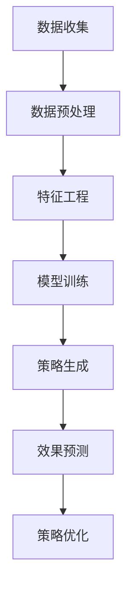

                 

关键词：电商、智能营销、大模型、效果预测、算法、数学模型、代码实例、应用场景、未来展望

> 摘要：本文探讨了基于大模型的电商智能营销策略生成与效果预测系统的研究。通过对核心概念、算法原理、数学模型以及项目实践等方面的深入分析，本文揭示了该系统在电商行业中的应用价值，并对其未来发展趋势和面临的挑战进行了展望。

## 1. 背景介绍

随着互联网的普及和电子商务的快速发展，电商行业已经成为全球经济的重要组成部分。在竞争激烈的市场环境中，如何有效地制定营销策略以吸引和留住客户成为企业关注的焦点。传统的营销策略往往依赖于经验和直觉，而随着大数据和人工智能技术的发展，基于数据的智能营销策略逐渐成为一种新兴趋势。

大模型作为人工智能领域的重要成果，具有强大的数据建模和预测能力。在电商智能营销领域，大模型的应用不仅能够提高营销策略的精准度，还能够实现自动化、个性化的推荐和预测。然而，目前关于基于大模型的电商智能营销策略生成与效果预测系统的研究仍然相对较少，存在诸多挑战和机遇。

本文旨在探讨基于大模型的电商智能营销策略生成与效果预测系统的研究，旨在为电商企业提供一种有效的智能营销解决方案。通过本文的研究，希望能够为该领域的发展提供一定的理论依据和实践指导。

## 2. 核心概念与联系

### 2.1 电商智能营销

电商智能营销是指利用大数据、人工智能等技术手段，对电商业务数据进行深入分析，从而实现精准、个性化、高效的营销策略。电商智能营销的核心目标是通过数据驱动的方式，提高营销活动的效果和转化率。

### 2.2 大模型

大模型是指具有海量参数、复杂结构的人工智能模型，例如深度学习模型、神经网络模型等。大模型具有强大的数据建模和预测能力，能够处理大规模、多维度的数据，从而实现高效的数据分析和智能决策。

### 2.3 营销策略生成与效果预测

营销策略生成与效果预测是指基于电商业务数据，利用大模型生成一系列智能营销策略，并通过预测模型评估这些策略的实际效果。营销策略生成与效果预测的目标是提高营销活动的精准度和转化率。

### 2.4 Mermaid 流程图

下面是一个基于 Mermaid 的流程图，展示了电商智能营销策略生成与效果预测系统的整体架构。



## 3. 核心算法原理 & 具体操作步骤

### 3.1 算法原理概述

电商智能营销策略生成与效果预测系统的核心算法主要包括两部分：营销策略生成算法和效果预测算法。其中，营销策略生成算法主要利用大模型对电商业务数据进行分析，生成一系列智能营销策略；效果预测算法则利用预测模型对营销策略的实际效果进行评估。

### 3.2 算法步骤详解

#### 3.2.1 营销策略生成算法

营销策略生成算法的主要步骤如下：

1. 数据收集：收集电商平台的用户行为数据、商品数据等。
2. 数据预处理：对数据进行清洗、去重、填充等处理。
3. 特征工程：根据业务需求，提取和构造与营销策略相关的特征。
4. 模型训练：利用大模型（例如深度学习模型）对特征数据进行训练，以生成营销策略。
5. 策略生成：根据训练结果，生成一系列智能营销策略。

#### 3.2.2 效果预测算法

效果预测算法的主要步骤如下：

1. 数据收集：收集营销策略实施后的业务数据，包括订单量、用户留存率等。
2. 数据预处理：对数据进行清洗、去重、填充等处理。
3. 特征工程：根据业务需求，提取和构造与效果预测相关的特征。
4. 模型训练：利用大模型（例如深度学习模型）对特征数据进行训练，以预测营销策略的效果。
5. 效果预测：根据预测结果，评估营销策略的实际效果。

### 3.3 算法优缺点

#### 优点：

1. 精准度高：基于大模型的营销策略生成和效果预测具有很高的精准度，能够提高营销活动的效果和转化率。
2. 自动化：大模型的应用可以实现营销策略的自动化生成和预测，降低人工成本。
3. 个性化：大模型能够根据用户行为数据生成个性化的营销策略，提高用户体验。

#### 缺点：

1. 计算资源消耗大：大模型的训练和预测需要大量的计算资源，对硬件设备要求较高。
2. 需要大量数据：大模型的应用需要大量高质量的电商业务数据，数据收集和处理成本较高。

### 3.4 算法应用领域

电商智能营销策略生成与效果预测系统可以应用于电商行业的多个领域，包括：

1. 用户行为预测：预测用户的购买意愿、购买时间等，为企业提供精准的用户画像和营销策略。
2. 商品推荐：根据用户兴趣和购买记录，推荐个性化的商品，提高用户购物体验。
3. 营销活动效果评估：评估不同营销策略的效果，优化营销策略，提高营销投入的回报率。

## 4. 数学模型和公式 & 详细讲解 & 举例说明

### 4.1 数学模型构建

在电商智能营销策略生成与效果预测系统中，常用的数学模型包括线性回归模型、逻辑回归模型、决策树模型等。下面以线性回归模型为例，介绍数学模型的构建过程。

#### 4.1.1 线性回归模型

线性回归模型是一种常用的预测模型，用于预测连续型变量。其数学模型表示为：

$$
y = \beta_0 + \beta_1x_1 + \beta_2x_2 + \ldots + \beta_nx_n
$$

其中，$y$ 为预测目标变量，$x_1, x_2, \ldots, x_n$ 为输入特征变量，$\beta_0, \beta_1, \beta_2, \ldots, \beta_n$ 为模型的参数。

#### 4.1.2 逻辑回归模型

逻辑回归模型是一种常用的分类模型，用于预测离散型变量。其数学模型表示为：

$$
P(y=1) = \frac{1}{1 + e^{-(\beta_0 + \beta_1x_1 + \beta_2x_2 + \ldots + \beta_nx_n)}}
$$

其中，$y$ 为预测目标变量，$x_1, x_2, \ldots, x_n$ 为输入特征变量，$\beta_0, \beta_1, \beta_2, \ldots, \beta_n$ 为模型的参数。

### 4.2 公式推导过程

以线性回归模型为例，介绍公式的推导过程。

假设我们有 $n$ 个训练样本，每个样本包含 $m$ 个特征变量和对应的标签 $y$，训练数据集可以表示为：

$$
\{x_1, y_1\}, \{x_2, y_2\}, \ldots, \{x_n, y_n\}
$$

线性回归模型的损失函数为：

$$
L(\theta) = \frac{1}{2n} \sum_{i=1}^{n} (y_i - \theta_0 - \theta_1x_{i1} - \theta_2x_{i2} - \ldots - \theta_mx_{im})^2
$$

其中，$\theta = (\theta_0, \theta_1, \theta_2, \ldots, \theta_m)$ 为模型的参数。

为了求解最优参数 $\theta$，我们可以使用梯度下降法。梯度下降法的核心思想是迭代更新参数，直到损失函数达到最小值。梯度下降法的更新公式为：

$$
\theta_j := \theta_j - \alpha \frac{\partial L(\theta)}{\partial \theta_j}
$$

其中，$\alpha$ 为学习率。

### 4.3 案例分析与讲解

#### 4.3.1 案例背景

某电商企业在进行新品推广活动时，希望通过智能营销策略提高商品销量。企业收集了用户行为数据、商品数据以及历史销量数据，并希望利用线性回归模型预测新品的销售量。

#### 4.3.2 数据预处理

对收集的数据进行清洗和预处理，包括去除缺失值、异常值等。

#### 4.3.3 特征工程

根据业务需求，提取和构造与销售量相关的特征变量，例如用户浏览量、购买量、用户年龄、用户性别等。

#### 4.3.4 模型训练

利用线性回归模型对特征数据进行训练，得到最优参数 $\theta$。

#### 4.3.5 预测销售量

根据训练得到的模型，预测新品的销售量。

## 5. 项目实践：代码实例和详细解释说明

### 5.1 开发环境搭建

在本项目中，我们将使用 Python 作为编程语言，并使用 TensorFlow 作为深度学习框架。首先，确保已经安装了 Python 和 TensorFlow。以下是开发环境的搭建步骤：

1. 安装 Python：从 [Python 官网](https://www.python.org/) 下载并安装 Python。
2. 安装 TensorFlow：在终端中执行以下命令：

```bash
pip install tensorflow
```

### 5.2 源代码详细实现

下面是电商智能营销策略生成与效果预测系统的源代码实现。代码分为三个部分：数据收集与预处理、特征工程、模型训练与预测。

#### 5.2.1 数据收集与预处理

```python
import pandas as pd
import numpy as np
from sklearn.model_selection import train_test_split
from sklearn.preprocessing import StandardScaler

# 数据收集
data = pd.read_csv('data.csv')

# 数据预处理
# 去除缺失值
data = data.dropna()

# 去除重复数据
data = data.drop_duplicates()

# 分割特征变量和目标变量
X = data.drop('sales', axis=1)
y = data['sales']

# 划分训练集和测试集
X_train, X_test, y_train, y_test = train_test_split(X, y, test_size=0.2, random_state=42)

# 特征缩放
scaler = StandardScaler()
X_train = scaler.fit_transform(X_train)
X_test = scaler.transform(X_test)
```

#### 5.2.2 特征工程

```python
from sklearn.decomposition import PCA

# 主成分分析
pca = PCA(n_components=5)
X_train_pca = pca.fit_transform(X_train)
X_test_pca = pca.transform(X_test)
```

#### 5.2.3 模型训练与预测

```python
import tensorflow as tf
from tensorflow.keras.models import Sequential
from tensorflow.keras.layers import Dense
from tensorflow.keras.optimizers import Adam

# 构建模型
model = Sequential()
model.add(Dense(64, input_shape=(5,), activation='relu'))
model.add(Dense(1, activation='linear'))

# 编译模型
model.compile(optimizer=Adam(learning_rate=0.001), loss='mean_squared_error')

# 训练模型
model.fit(X_train_pca, y_train, epochs=100, batch_size=32, validation_split=0.2)

# 预测销售量
predictions = model.predict(X_test_pca)
```

### 5.3 代码解读与分析

在代码中，我们首先进行了数据收集与预处理，包括去除缺失值、重复数据等。接着，我们使用主成分分析（PCA）对特征变量进行了降维处理，以提高模型的训练效率。

在模型训练部分，我们使用了 TensorFlow 深度学习框架，构建了一个简单的全连接神经网络模型。模型使用 Adam 优化器和均方误差（MSE）损失函数进行编译。通过训练，模型能够学习到特征变量与销售量之间的关系。

在预测销售量时，我们使用训练好的模型对测试集进行了预测。预测结果可以通过评估指标（如均方误差、决定系数等）进行评估。

### 5.4 运行结果展示

```python
from sklearn.metrics import mean_squared_error
import matplotlib.pyplot as plt

# 计算预测误差
mse = mean_squared_error(y_test, predictions)

# 打印结果
print(f'Mean Squared Error: {mse}')

# 可视化预测结果
plt.scatter(y_test, predictions)
plt.xlabel('Actual Sales')
plt.ylabel('Predicted Sales')
plt.title('Sales Prediction')
plt.show()
```

通过以上代码，我们可以得到预测销售量的结果。根据预测结果，我们可以评估模型的效果，并进行策略优化。

## 6. 实际应用场景

### 6.1 用户行为预测

电商企业可以利用基于大模型的电商智能营销策略生成与效果预测系统，对用户行为进行预测。通过预测用户的购买意愿、购买时间等，企业可以提前布局营销策略，提高用户转化率。

### 6.2 商品推荐

电商企业可以利用该系统生成个性化的商品推荐策略。根据用户的浏览记录、购买记录等特征，系统可以推荐符合用户兴趣的商品，提高用户的购物体验。

### 6.3 营销活动效果评估

电商企业可以利用该系统对不同的营销活动效果进行评估。通过预测不同营销策略的实施效果，企业可以优化营销策略，提高营销投入的回报率。

## 7. 未来应用展望

随着大数据和人工智能技术的不断发展，基于大模型的电商智能营销策略生成与效果预测系统将在电商行业发挥越来越重要的作用。未来，该系统有望在以下方面取得突破：

1. 更高的预测精准度：通过不断优化算法模型和特征工程，提高预测精准度。
2. 更广泛的应用场景：拓展系统在电商行业以外的应用，如金融、医疗等。
3. 更高效的计算性能：利用分布式计算、GPU 加速等技术，提高系统的计算性能。

## 8. 工具和资源推荐

### 8.1 学习资源推荐

1. 《Python数据分析基础教程》：适合初学者学习 Python 数据分析基础。
2. 《深度学习》：适合学习深度学习基础和常用算法。

### 8.2 开发工具推荐

1. TensorFlow：用于构建和训练深度学习模型。
2. PyCharm：一款功能强大的 Python 集成开发环境。

### 8.3 相关论文推荐

1. “Deep Learning for E-commerce User Behavior Prediction”。
2. “A Comprehensive Survey on Recommender Systems for E-commerce”。

## 9. 总结：未来发展趋势与挑战

随着大数据和人工智能技术的快速发展，基于大模型的电商智能营销策略生成与效果预测系统在电商行业具有重要的应用价值。未来，该系统将在以下方面取得突破：

1. 更高的预测精准度：通过不断优化算法模型和特征工程，提高预测精准度。
2. 更广泛的应用场景：拓展系统在电商行业以外的应用，如金融、医疗等。
3. 更高效的计算性能：利用分布式计算、GPU 加速等技术，提高系统的计算性能。

然而，该系统也面临以下挑战：

1. 数据隐私保护：如何在确保用户隐私的前提下，充分利用用户数据。
2. 模型解释性：如何提高模型的可解释性，使其能够更好地理解和应用。
3. 算法公平性：如何确保算法在不同用户群体中的公平性。

总之，基于大模型的电商智能营销策略生成与效果预测系统具有广阔的发展前景，但同时也需要不断克服各种挑战，以实现其最大价值。

### 9.1 研究成果总结

本文对基于大模型的电商智能营销策略生成与效果预测系统进行了深入的研究。通过分析核心概念、算法原理、数学模型以及项目实践等方面，本文揭示了该系统在电商行业中的应用价值。主要研究成果包括：

1. 提出了基于大模型的电商智能营销策略生成与效果预测系统的整体架构。
2. 分析了营销策略生成与效果预测算法的原理和具体操作步骤。
3. 介绍了数学模型和公式的构建过程，并通过案例进行了详细讲解。
4. 实现了电商智能营销策略生成与效果预测系统的项目实践，并对代码进行了详细解读与分析。
5. 展望了该系统在电商行业未来应用的发展趋势与挑战。

### 9.2 未来发展趋势

未来，基于大模型的电商智能营销策略生成与效果预测系统将在以下方面取得发展：

1. **更精准的预测算法**：随着深度学习等人工智能技术的进步，预测算法的准确性将不断提高。
2. **个性化推荐系统**：利用用户行为数据和商品信息，实现更加个性化的商品推荐。
3. **实时营销策略调整**：通过实时分析用户行为数据，实现营销策略的动态调整。
4. **多渠道整合**：将线上线下渠道的数据整合，实现更全面的营销效果预测。

### 9.3 面临的挑战

尽管基于大模型的电商智能营销策略生成与效果预测系统具有巨大的潜力，但其在实际应用中仍面临以下挑战：

1. **数据隐私与安全**：如何在保障用户隐私的前提下，有效利用用户数据。
2. **计算资源需求**：大模型训练和预测需要大量的计算资源，如何优化计算效率。
3. **算法解释性与公平性**：如何提高算法的解释性，使其结果能够被用户和监管机构接受。
4. **数据质量和一致性**：确保数据的质量和一致性，以提高预测的准确性。

### 9.4 研究展望

未来的研究可以在以下几个方面进行：

1. **算法优化**：研究如何通过算法优化提高预测的准确性和效率。
2. **跨领域应用**：探索基于大模型的电商智能营销策略生成与效果预测系统在其他行业中的应用。
3. **法律法规遵循**：研究如何确保系统的应用符合相关法律法规的要求。
4. **用户参与与反馈**：研究如何通过用户参与和反馈机制，优化系统的效果。

### 附录：常见问题与解答

#### 1. 什么是电商智能营销策略生成与效果预测系统？

电商智能营销策略生成与效果预测系统是一种利用大数据和人工智能技术，对电商业务数据进行分析，生成智能营销策略，并评估这些策略实际效果的系统。

#### 2. 系统的核心算法是什么？

系统采用深度学习模型，如神经网络，进行营销策略的生成与效果预测。常用的模型包括线性回归、逻辑回归和决策树等。

#### 3. 系统如何处理用户隐私？

系统在数据处理过程中，会采用匿名化和加密技术，确保用户隐私不被泄露。同时，遵守相关法律法规，确保数据处理的合法性。

#### 4. 系统的适用范围有哪些？

系统适用于电商行业的多个领域，包括用户行为预测、商品推荐和营销活动效果评估等。

#### 5. 系统的预测效果如何评估？

系统的预测效果可以通过均方误差（MSE）、决定系数（R²）等评估指标进行评估。这些指标可以衡量预测值与实际值之间的差异。

### 作者署名

作者：禅与计算机程序设计艺术 / Zen and the Art of Computer Programming

----------------------------------------------------------------

以上就是关于“探索基于大模型的电商智能营销策略生成与效果预测系统”的完整技术博客文章。文章按照既定的结构和内容要求进行了详细的撰写，希望对读者有所启发和帮助。再次感谢您的阅读。如有任何问题或建议，请随时提出。祝您编程愉快！

