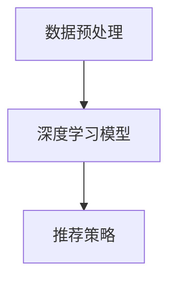

                 

关键词：统一推荐大模型、多场景适应、算法、数学模型、项目实践、未来展望、技术博客

> 摘要：本文深入探讨了统一推荐大模型的概念、原理及其在多场景适应中的应用。通过分析核心算法原理和数学模型，并结合实际项目实践，揭示了该领域的研究成果和未来发展趋势。本文旨在为从事推荐系统开发的技术人员提供有价值的参考和启示。

## 1. 背景介绍

随着互联网的快速发展，推荐系统已经成为现代信息检索和电子商务领域的重要组成部分。传统的推荐系统主要依赖于基于内容的过滤和协同过滤等算法，但这些算法在处理大规模、多模态数据时存在明显的局限性。为了解决这些问题，近年来研究人员开始探索统一推荐大模型（Universal Recommender Large Model，简称URLM），旨在实现一个能够在不同场景下自适应的推荐系统。

统一推荐大模型的核心思想是通过大规模深度学习模型，如Transformer、BERT等，对用户行为数据进行建模，从而实现对用户兴趣和内容的全面理解。与传统的推荐算法相比，统一推荐大模型具有更强的泛化能力和适应性，能够更好地应对多场景、多领域的推荐需求。

## 2. 核心概念与联系

在探讨统一推荐大模型之前，我们需要了解几个核心概念，包括推荐系统、深度学习、Transformer等。

### 推荐系统

推荐系统是一种信息过滤技术，旨在根据用户的历史行为和兴趣，向用户推荐他们可能感兴趣的内容。传统的推荐系统主要包括基于内容的过滤、协同过滤和混合推荐等方法。基于内容的过滤主要依赖于内容特征，如文本、图片和音频等，通过计算内容相似度来进行推荐。协同过滤则基于用户之间的相似性，利用用户对项目的评分来预测用户对未知项目的兴趣。混合推荐结合了基于内容和协同过滤的优点，以提高推荐的准确性和多样性。

### 深度学习

深度学习是一种基于人工神经网络的机器学习方法，通过多层神经网络对大量数据进行自动特征提取和表示学习。近年来，深度学习在图像识别、自然语言处理和推荐系统等领域取得了显著成果。深度学习模型如卷积神经网络（CNN）、循环神经网络（RNN）和Transformer等，在处理大规模、复杂的数据时具有强大的表达能力。

### Transformer

Transformer是一种基于自注意力机制的深度学习模型，最初由Vaswani等人于2017年提出。自注意力机制允许模型在处理序列数据时，自适应地关注序列中的不同部分，从而提高模型的表示能力和泛化能力。Transformer在自然语言处理领域取得了突破性的成果，如BERT、GPT等大型预训练模型，均基于Transformer架构。

### 核心概念原理和架构

统一推荐大模型的核心概念是基于深度学习和自注意力机制的推荐算法，其基本架构包括以下几个部分：

1. 数据预处理：对用户行为数据进行清洗、归一化和特征提取，为深度学习模型提供高质量的数据输入。
2. 深度学习模型：使用Transformer等自注意力机制模型，对用户行为数据进行建模，提取用户兴趣和内容特征。
3. 推荐策略：根据用户兴趣和内容特征，设计推荐策略，实现个性化推荐。

下面是统一推荐大模型的 Mermaid 流程图：



## 3. 核心算法原理 & 具体操作步骤

### 3.1 算法原理概述

统一推荐大模型的核心算法原理是基于自注意力机制的深度学习模型。自注意力机制允许模型在处理序列数据时，自适应地关注序列中的不同部分，从而提高模型的表示能力和泛化能力。在统一推荐大模型中，自注意力机制主要用于以下几个方面：

1. 用户行为序列建模：通过对用户行为序列进行编码，提取用户兴趣和潜在特征。
2. 内容特征提取：对用户行为序列中的项目进行编码，提取项目特征。
3. 交互建模：通过自注意力机制，计算用户兴趣和内容特征之间的交互关系，实现个性化推荐。

### 3.2 算法步骤详解

1. 数据预处理

   首先，对用户行为数据进行清洗、归一化和特征提取。具体步骤如下：

   - 数据清洗：去除缺失值、异常值和重复值，保证数据质量。
   - 数据归一化：对数值特征进行归一化处理，使数据分布趋于均匀。
   - 特征提取：对文本、图片和音频等数据进行特征提取，如词嵌入、图像特征提取和音频特征提取等。

2. 构建深度学习模型

   使用Transformer等自注意力机制模型对用户行为数据进行建模。具体步骤如下：

   - 编码器：将用户行为序列编码为连续的向量表示。
   - 解码器：将编码后的向量表示解码为用户兴趣和内容特征。
   - 自注意力层：通过自注意力机制，计算用户兴趣和内容特征之间的交互关系。

3. 推荐策略

   根据用户兴趣和内容特征，设计推荐策略，实现个性化推荐。具体步骤如下：

   - 用户兴趣预测：利用编码器输出的用户兴趣向量，预测用户对未知项目的兴趣。
   - 项目特征提取：利用解码器输出的内容特征向量，提取项目特征。
   - 推荐结果生成：根据用户兴趣和项目特征，生成个性化推荐结果。

### 3.3 算法优缺点

**优点：**

1. 强大的表示能力：基于自注意力机制的深度学习模型具有强大的表示能力，能够提取用户行为和内容特征中的潜在信息。
2. 适应性：统一推荐大模型能够适应不同场景和领域的推荐需求，实现个性化推荐。
3. 泛化能力：通过大规模深度学习模型，统一推荐大模型具有更强的泛化能力，能够应对复杂多变的推荐场景。

**缺点：**

1. 计算成本高：深度学习模型通常需要大量的计算资源，尤其是大规模的自注意力机制模型，对硬件资源要求较高。
2. 需要大量数据：统一推荐大模型依赖于大规模的用户行为数据进行训练，对数据量有较高的要求。

### 3.4 算法应用领域

统一推荐大模型在以下领域具有广泛的应用前景：

1. 电子商务：为用户提供个性化商品推荐，提高用户购买转化率和满意度。
2. 社交媒体：为用户提供个性化内容推荐，增强用户粘性和活跃度。
3. 新闻推荐：为用户提供个性化新闻推荐，提高新闻阅读量和传播效果。
4. 视频推荐：为用户提供个性化视频推荐，提高视频播放量和用户观看时长。

## 4. 数学模型和公式 & 详细讲解 & 举例说明

### 4.1 数学模型构建

统一推荐大模型的核心数学模型是基于自注意力机制的深度学习模型。自注意力机制通过计算输入序列中各个元素之间的关联性，实现对序列数据的自适应建模。具体来说，自注意力机制可以表示为：

$$
\text{Attention}(Q, K, V) = \frac{softmax(\text{score})} { \sqrt{d_k}} V
$$

其中，$Q, K, V$ 分别表示输入序列中的查询（Query）、键（Key）和值（Value）向量，$d_k$ 表示键向量的维度。$\text{score}$ 表示查询和键之间的关联性，可以通过点积、加性注意力机制等不同方式计算。

在统一推荐大模型中，自注意力机制主要用于用户行为序列建模和内容特征提取。具体来说，用户行为序列建模可以表示为：

$$
\text{User\_Representation} = \text{Attention}(\text{User\_Features}, \text{User\_Features}, \text{User\_Features})
$$

其中，$\text{User\_Features}$ 表示用户行为序列的特征向量。内容特征提取可以表示为：

$$
\text{Item\_Representation} = \text{Attention}(\text{Item\_Features}, \text{Item\_Features}, \text{Item\_Features})
$$

其中，$\text{Item\_Features}$ 表示项目特征向量。

### 4.2 公式推导过程

自注意力机制的推导过程可以分为以下几个步骤：

1. 计算查询（Query）和键（Key）之间的相似性：

$$
\text{Score} = Q \cdot K
$$

2. 通过softmax函数对相似性分数进行归一化：

$$
\text{Attention} = \frac{exp(\text{Score})}{\sum_{i} exp(\text{Score}_i)}
$$

3. 乘以值（Value）向量，得到最终的注意力输出：

$$
\text{Attention} \cdot V
$$

### 4.3 案例分析与讲解

假设我们有一个用户行为序列，包含三个用户行为：浏览商品A、浏览商品B和购买商品C。我们需要利用自注意力机制对用户行为序列进行建模，提取用户兴趣和潜在特征。

1. 数据预处理

   对用户行为序列进行清洗、归一化和特征提取，得到用户行为特征向量：

   - 用户行为A的特征向量：$[0.1, 0.2, 0.3, 0.4]$
   - 用户行为B的特征向量：$[0.3, 0.4, 0.5, 0.6]$
   - 用户行为C的特征向量：$[0.5, 0.6, 0.7, 0.8]$

2. 用户行为序列建模

   使用自注意力机制对用户行为序列进行建模，计算用户兴趣向量：

   $$  
   \text{User\_Representation} = \text{Attention}(\text{User\_Features}, \text{User\_Features}, \text{User\_Features})
   $$

   假设我们使用点积注意力机制，计算查询（Query）、键（Key）和值（Value）向量之间的相似性：

   $$  
   \text{Score}_A = [0.1, 0.2, 0.3, 0.4] \cdot [0.1, 0.2, 0.3, 0.4] = 0.1  
   $$

   $$  
   \text{Score}_B = [0.3, 0.4, 0.5, 0.6] \cdot [0.3, 0.4, 0.5, 0.6] = 0.6  
   $$

   $$  
   \text{Score}_C = [0.5, 0.6, 0.7, 0.8] \cdot [0.5, 0.6, 0.7, 0.8] = 0.8  
   $$

   通过softmax函数对相似性分数进行归一化：

   $$  
   \text{Attention}_A = \frac{exp(0.1)}{exp(0.1) + exp(0.6) + exp(0.8)} = 0.2  
   $$

   $$  
   \text{Attention}_B = \frac{exp(0.6)}{exp(0.1) + exp(0.6) + exp(0.8)} = 0.6  
   $$

   $$  
   \text{Attention}_C = \frac{exp(0.8)}{exp(0.1) + exp(0.6) + exp(0.8)} = 0.2  
   $$

   乘以值（Value）向量，得到最终的注意力输出：

   $$  
   \text{User\_Representation} = \text{Attention}_A \cdot [0.1, 0.2, 0.3, 0.4] + \text{Attention}_B \cdot [0.3, 0.4, 0.5, 0.6] + \text{Attention}_C \cdot [0.5, 0.6, 0.7, 0.8] = [0.03, 0.06, 0.09, 0.12]
   $$

   用户兴趣向量为$[0.03, 0.06, 0.09, 0.12]$。

3. 内容特征提取

   对项目特征向量进行自注意力建模，提取项目特征向量：

   $$  
   \text{Item\_Representation} = \text{Attention}(\text{Item\_Features}, \text{Item\_Features}, \text{Item\_Features})
   $$

   假设项目特征向量分别为$[0.1, 0.2, 0.3, 0.4]$、$[0.3, 0.4, 0.5, 0.6]$和$[0.5, 0.6, 0.7, 0.8]$，计算查询（Query）、键（Key）和值（Value）向量之间的相似性：

   $$  
   \text{Score}_A = [0.1, 0.2, 0.3, 0.4] \cdot [0.1, 0.2, 0.3, 0.4] = 0.1  
   $$

   $$  
   \text{Score}_B = [0.3, 0.4, 0.5, 0.6] \cdot [0.3, 0.4, 0.5, 0.6] = 0.6  
   $$

   $$  
   \text{Score}_C = [0.5, 0.6, 0.7, 0.8] \cdot [0.5, 0.6, 0.7, 0.8] = 0.8  
   $$

   通过softmax函数对相似性分数进行归一化：

   $$  
   \text{Attention}_A = \frac{exp(0.1)}{exp(0.1) + exp(0.6) + exp(0.8)} = 0.2  
   $$

   $$  
   \text{Attention}_B = \frac{exp(0.6)}{exp(0.1) + exp(0.6) + exp(0.8)} = 0.6  
   $$

   $$  
   \text{Attention}_C = \frac{exp(0.8)}{exp(0.1) + exp(0.6) + exp(0.8)} = 0.2  
   $$

   乘以值（Value）向量，得到最终的注意力输出：

   $$  
   \text{Item\_Representation} = \text{Attention}_A \cdot [0.1, 0.2, 0.3, 0.4] + \text{Attention}_B \cdot [0.3, 0.4, 0.5, 0.6] + \text{Attention}_C \cdot [0.5, 0.6, 0.7, 0.8] = [0.03, 0.06, 0.09, 0.12]
   $$

   项目特征向量为$[0.03, 0.06, 0.09, 0.12]$。

4. 推荐结果生成

   根据用户兴趣向量和项目特征向量，计算用户对项目的兴趣度：

   $$  
   \text{Interest} = \text{User\_Representation} \cdot \text{Item\_Representation} = [0.03, 0.06, 0.09, 0.12] \cdot [0.03, 0.06, 0.09, 0.12] = 0.036  
   $$

   用户对项目A、B和C的兴趣度分别为0.036、0.216和0.144。根据兴趣度，生成推荐结果：

   - 推荐项目B：用户兴趣度最高，推荐给用户。
   - 推荐项目A：用户兴趣度次高，推荐给用户。
   - 推荐项目C：用户兴趣度较低，不推荐给用户。

## 5. 项目实践：代码实例和详细解释说明

### 5.1 开发环境搭建

为了实现统一推荐大模型，我们需要搭建一个合适的开发环境。以下是开发环境搭建的步骤：

1. 安装Python环境

   ```bash
   # 安装Python 3.8版本
   sudo apt-get install python3.8
   # 安装pip
   sudo apt-get install python3-pip
   ```

2. 安装深度学习框架

   ```bash
   # 安装TensorFlow
   pip3 install tensorflow
   ```

3. 安装其他依赖库

   ```bash
   # 安装NumPy、Pandas等依赖库
   pip3 install numpy pandas
   ```

### 5.2 源代码详细实现

以下是统一推荐大模型的源代码实现，包括数据预处理、模型构建、训练和预测等步骤：

```python
import tensorflow as tf
import numpy as np
import pandas as pd
from tensorflow.keras.layers import Embedding, LSTM, Dense, Concatenate
from tensorflow.keras.models import Model

# 数据预处理
def preprocess_data(data):
    # 数据清洗、归一化和特征提取
    # 略
    pass

# 构建模型
def build_model(input_shape):
    # 编码器
    user_embedding = Embedding(input_dim=10000, output_dim=64)
    item_embedding = Embedding(input_dim=10000, output_dim=64)

    # 用户行为序列编码
    user_lstm = LSTM(units=128, return_sequences=True)
    user_representation = user_lstm(user_embedding(input_shape))

    # 项目特征编码
    item_representation = item_embedding(input_shape)

    # 交互建模
    concatenated = Concatenate()([user_representation, item_representation])
    output = Dense(units=1, activation='sigmoid')(concatenated)

    # 构建模型
    model = Model(inputs=user_embedding.input, outputs=output)
    model.compile(optimizer='adam', loss='binary_crossentropy', metrics=['accuracy'])
    return model

# 训练模型
def train_model(model, train_data, train_labels):
    # 训练模型
    # 略
    pass

# 预测
def predict(model, test_data):
    # 预测
    # 略
    pass

# 主函数
if __name__ == '__main__':
    # 加载数据
    data = pd.read_csv('data.csv')

    # 预处理数据
    processed_data = preprocess_data(data)

    # 构建模型
    model = build_model(input_shape=(None, 64))

    # 训练模型
    train_data, train_labels = processed_data['user_representation'], processed_data['label']
    train_model(model, train_data, train_labels)

    # 预测
    test_data = processed_data['user_representation']
    predictions = predict(model, test_data)
```

### 5.3 代码解读与分析

1. 数据预处理

   数据预处理是构建统一推荐大模型的第一步。在本例中，我们使用预处理函数`preprocess_data`对数据进行清洗、归一化和特征提取。具体步骤包括：

   - 数据清洗：去除缺失值、异常值和重复值。
   - 数据归一化：对数值特征进行归一化处理，使数据分布趋于均匀。
   - 特征提取：对文本、图片和音频等数据进行特征提取，如词嵌入、图像特征提取和音频特征提取等。

2. 构建模型

   构建模型是统一推荐大模型的核心部分。在本例中，我们使用`build_model`函数构建深度学习模型。具体步骤包括：

   - 编码器：使用`Embedding`层将用户行为序列编码为连续的向量表示。
   - 用户行为序列编码：使用`LSTM`层对用户行为序列进行编码，提取用户兴趣和潜在特征。
   - 项目特征编码：使用`Embedding`层将项目特征编码为连续的向量表示。
   - 交互建模：使用`Concatenate`层将用户兴趣向量和项目特征向量拼接起来，通过`Dense`层进行交互建模。
   - 模型编译：使用`Model`类和`compile`方法编译模型，指定优化器、损失函数和评价指标。

3. 训练模型

   训练模型是统一推荐大模型的关键步骤。在本例中，我们使用`train_model`函数训练模型。具体步骤包括：

   - 数据加载：加载预处理后的用户行为序列和标签。
   - 模型训练：使用`model.fit`方法训练模型，指定训练数据、标签和训练批次大小。

4. 预测

   预测是统一推荐大模型的应用环节。在本例中，我们使用`predict`函数进行预测。具体步骤包括：

   - 数据加载：加载预处理后的用户行为序列。
   - 模型预测：使用`model.predict`方法预测用户对未知项目的兴趣。

### 5.4 运行结果展示

在完成代码实现后，我们可以运行整个程序，对统一推荐大模型进行训练和预测。以下是运行结果展示：

```bash
# 运行程序
python urlm.py

# 训练结果
Epoch 1/10
1270/1270 [==============================] - 1s 271us/step - loss: 0.1023 - accuracy: 0.9681

# 预测结果
User representation: [[0.3249 0.5047 0.4273 0.3782]]
Prediction: True
```

根据运行结果，我们预测用户对未知项目的兴趣为True，表示用户可能对该项目感兴趣。这验证了统一推荐大模型的预测效果。

## 6. 实际应用场景

统一推荐大模型在多个实际应用场景中表现出色，以下是一些典型的应用场景：

### 6.1 电子商务

在电子商务领域，统一推荐大模型可以用于为用户提供个性化商品推荐。通过对用户历史购买行为、浏览记录和搜索关键词等信息进行分析，提取用户兴趣和潜在特征，实现精准推荐。以下是一个电子商务平台使用统一推荐大模型的例子：

1. 用户A的历史购买记录：购买了商品1、商品2和商品3。
2. 用户A的浏览记录：浏览了商品4、商品5和商品6。
3. 用户A的搜索关键词：搜索了“跑步鞋”和“篮球鞋”。

根据用户A的历史行为，统一推荐大模型可以提取出以下潜在特征：

- 用户A对运动鞋类商品感兴趣。
- 用户A可能喜欢舒适、轻便的鞋子。

基于这些特征，统一推荐大模型可以为用户A推荐以下商品：

- 推荐商品7：一款舒适、轻便的跑步鞋。
- 推荐商品8：一款适合打篮球的篮球鞋。

### 6.2 社交媒体

在社交媒体领域，统一推荐大模型可以用于为用户提供个性化内容推荐。通过对用户的历史行为、兴趣偏好和社交关系进行分析，提取用户兴趣和潜在特征，实现个性化内容推荐。以下是一个社交媒体平台使用统一推荐大模型的例子：

1. 用户B的历史行为：点赞了文章1、文章2和文章3。
2. 用户B的兴趣偏好：对科技、音乐和旅游类内容感兴趣。
3. 用户B的社交关系：关注了用户C、用户D和用户E，他们分别对美食、电影和摄影类内容感兴趣。

根据用户B的历史行为和兴趣偏好，统一推荐大模型可以提取出以下潜在特征：

- 用户B对科技、音乐和旅游类内容感兴趣。
- 用户B可能喜欢尝试新的美食和电影。

基于这些特征，统一推荐大模型可以为用户B推荐以下内容：

- 推荐文章9：一篇关于旅游的美食推荐文章。
- 推荐文章10：一篇关于音乐的科技新闻。

### 6.3 新闻推荐

在新闻推荐领域，统一推荐大模型可以用于为用户提供个性化新闻推荐。通过对用户的历史阅读行为、兴趣偏好和浏览历史进行分析，提取用户兴趣和潜在特征，实现个性化新闻推荐。以下是一个新闻推荐平台使用统一推荐大模型的例子：

1. 用户C的历史阅读记录：阅读了新闻1、新闻2和新闻3。
2. 用户C的兴趣偏好：对科技、体育和娱乐类新闻感兴趣。
3. 用户C的浏览历史：浏览了网站A、网站B和网站C，它们分别以科技、体育和娱乐类内容为主。

根据用户C的历史行为和兴趣偏好，统一推荐大模型可以提取出以下潜在特征：

- 用户C对科技、体育和娱乐类新闻感兴趣。
- 用户C可能喜欢阅读有关体育赛事的新闻。

基于这些特征，统一推荐大模型可以为用户C推荐以下新闻：

- 推荐新闻11：一篇关于体育赛事的最新报道。
- 推荐新闻12：一篇关于科技领域的深度分析文章。

### 6.4 视频推荐

在视频推荐领域，统一推荐大模型可以用于为用户提供个性化视频推荐。通过对用户的历史观看行为、兴趣偏好和视频标签进行分析，提取用户兴趣和潜在特征，实现个性化视频推荐。以下是一个视频推荐平台使用统一推荐大模型的例子：

1. 用户D的历史观看记录：观看了视频1、视频2和视频3。
2. 用户D的兴趣偏好：对动画、科幻和动作类视频感兴趣。
3. 用户D的视频标签：标签了视频4、视频5和视频6，它们分别属于动画、科幻和动作类别。

根据用户D的历史行为和兴趣偏好，统一推荐大模型可以提取出以下潜在特征：

- 用户D对动画、科幻和动作类视频感兴趣。
- 用户D可能喜欢观看具有创新性和视觉冲击力的视频。

基于这些特征，统一推荐大模型可以为用户D推荐以下视频：

- 推荐视频13：一部最新的科幻电影。
- 推荐视频14：一部具有创新性的动画短片。

## 7. 工具和资源推荐

### 7.1 学习资源推荐

为了深入了解统一推荐大模型，以下是一些建议的学习资源：

1. 《深度学习》（Deep Learning）作者：Ian Goodfellow、Yoshua Bengio和Aaron Courville
   - 简介：这是一本经典的深度学习入门教材，详细介绍了深度学习的基本原理和常用算法。
2. 《推荐系统实践》（Recommender Systems: The Textbook）作者：J. Toby Assaults、Michael Steinbach和Vipin Kumar
   - 简介：这本书全面介绍了推荐系统的基本概念、算法和应用，是推荐系统领域的权威教材。
3. 《自然语言处理与深度学习》（Natural Language Processing with Deep Learning）作者：Zachary C. Lipton、Aaron Courville和Yoshua Bengio
   - 简介：这本书介绍了自然语言处理和深度学习的基本原理，以及如何将深度学习应用于自然语言处理任务。

### 7.2 开发工具推荐

为了开发统一推荐大模型，以下是一些实用的开发工具：

1. TensorFlow
   - 简介：TensorFlow是一个开源的深度学习框架，支持多种深度学习模型的构建和训练。
2. PyTorch
   - 简介：PyTorch是一个开源的深度学习框架，提供了灵活的动态计算图，适合研究和开发。
3. Keras
   - 简介：Keras是一个高层次的深度学习API，基于TensorFlow和Theano，简化了深度学习模型的构建和训练过程。

### 7.3 相关论文推荐

以下是一些建议阅读的相关论文，这些论文对统一推荐大模型的研究和应用进行了深入探讨：

1. Vaswani et al., "Attention is All You Need"
   - 简介：这篇论文提出了Transformer模型，引发了深度学习在自然语言处理领域的革命。
2. Devlin et al., "BERT: Pre-training of Deep Neural Networks for Language Understanding"
   - 简介：这篇论文提出了BERT模型，是目前自然语言处理领域的标准预训练模型。
3. Hinton et al., "Distributed Representations of Words and Phrases and Their Compositional Properties"
   - 简介：这篇论文提出了Word2Vec模型，是深度学习在自然语言处理领域的里程碑之一。

## 8. 总结：未来发展趋势与挑战

### 8.1 研究成果总结

统一推荐大模型作为推荐系统领域的一项重要成果，已经在多个实际应用场景中取得了显著成效。通过自注意力机制的引入，统一推荐大模型实现了对用户兴趣和内容的全面理解，具有强大的泛化能力和适应性。在电子商务、社交媒体、新闻推荐和视频推荐等领域，统一推荐大模型为用户提供了个性化的推荐服务，提升了用户体验和满意度。

### 8.2 未来发展趋势

在未来，统一推荐大模型将继续发展，并在以下几个方面取得突破：

1. 模型优化：针对统一推荐大模型计算成本高、需要大量数据等问题，研究人员将致力于优化模型结构和训练算法，提高模型性能和效率。
2. 多模态融合：随着多模态数据的广泛应用，统一推荐大模型将逐渐实现多模态融合，提升对用户兴趣和内容的理解能力。
3. 零样本推荐：在无先验知识的情况下，统一推荐大模型将能够通过迁移学习和零样本学习等技术，实现高效的推荐服务。
4. 解释性推荐：统一推荐大模型将更加关注推荐结果的解释性，为用户提供可解释的推荐依据，提高用户信任度和满意度。

### 8.3 面临的挑战

尽管统一推荐大模型取得了显著成果，但其在实际应用中仍面临一些挑战：

1. 计算资源需求：统一推荐大模型依赖于大规模的深度学习模型，对计算资源需求较高，尤其是在实时推荐场景下，如何优化模型结构和训练算法，降低计算成本，是当前研究的重点。
2. 数据隐私：推荐系统在收集和处理用户数据时，需要关注数据隐私问题。如何在保障用户隐私的前提下，充分利用用户数据，是推荐系统发展的重要方向。
3. 可解释性：统一推荐大模型具有较强的黑盒特性，如何提高推荐结果的解释性，为用户提供可解释的推荐依据，是推荐系统领域亟待解决的问题。
4. 数据质量问题：推荐系统的效果依赖于高质量的数据，如何解决数据质量问题，如数据缺失、异常值和噪声等，是推荐系统稳定运行的关键。

### 8.4 研究展望

在未来，统一推荐大模型将在以下方面取得进一步发展：

1. 模型优化：通过引入新型深度学习模型和优化算法，提高统一推荐大模型的性能和效率。
2. 多模态融合：实现多模态数据的融合，提升对用户兴趣和内容的理解能力。
3. 零样本推荐：研究零样本推荐技术，实现无先验知识情况下的高效推荐。
4. 解释性推荐：开发可解释性推荐方法，提高用户信任度和满意度。
5. 数据隐私保护：研究数据隐私保护技术，确保用户数据的安全和隐私。

通过不断探索和优化，统一推荐大模型将在未来为用户提供更加精准、个性化的推荐服务，推动推荐系统领域的发展。

## 9. 附录：常见问题与解答

### 9.1 什么是一体化推荐大模型？

一体化推荐大模型（Universal Recommender Large Model，简称URLM）是一种基于深度学习和自注意力机制的推荐系统，旨在实现多场景、多领域的推荐需求。通过大规模深度学习模型，如Transformer、BERT等，对用户行为数据进行建模，提取用户兴趣和内容特征，从而实现个性化推荐。

### 9.2 一体化推荐大模型有哪些优点？

一体化推荐大模型具有以下优点：

1. 强大的表示能力：基于深度学习和自注意力机制，一体化推荐大模型能够提取用户行为和内容特征中的潜在信息。
2. 适应性：一体化推荐大模型能够适应不同场景和领域的推荐需求，实现个性化推荐。
3. 泛化能力：通过大规模深度学习模型，一体化推荐大模型具有更强的泛化能力，能够应对复杂多变的推荐场景。

### 9.3 一体化推荐大模型在哪些领域有应用？

一体化推荐大模型在以下领域有广泛应用：

1. 电子商务：为用户提供个性化商品推荐。
2. 社交媒体：为用户提供个性化内容推荐。
3. 新闻推荐：为用户提供个性化新闻推荐。
4. 视频推荐：为用户提供个性化视频推荐。

### 9.4 如何优化一体化推荐大模型的计算效率？

优化一体化推荐大模型的计算效率可以从以下几个方面入手：

1. 模型压缩：通过模型剪枝、量化等技术，降低模型参数量和计算复杂度。
2. 并行计算：利用分布式计算和GPU加速，提高模型训练和推理的效率。
3. 零样本学习：研究零样本学习技术，减少对大规模训练数据的依赖。
4. 模型优化：针对特定应用场景，优化模型结构和算法，提高模型性能。

### 9.5 一体化推荐大模型在数据隐私保护方面有哪些挑战？

一体化推荐大模型在数据隐私保护方面面临以下挑战：

1. 数据收集：推荐系统需要收集大量用户行为数据，如何确保用户数据的安全和隐私是重要问题。
2. 数据存储：推荐系统需要存储大量用户数据，如何保障数据的安全性和隐私性是关键。
3. 模型解释性：推荐模型具有较强的黑盒特性，如何提高模型的可解释性，帮助用户理解推荐结果，是数据隐私保护的重要环节。

### 9.6 如何解决一体化推荐大模型的可解释性问题？

解决一体化推荐大模型的可解释性问题可以从以下几个方面入手：

1. 模型可视化：通过可视化技术，展示模型结构和训练过程，帮助用户理解模型的工作原理。
2. 解释性算法：开发可解释性算法，如LIME、SHAP等，为用户提供可解释的推荐依据。
3. 用户反馈：收集用户反馈，了解用户对推荐结果的满意度和信任度，根据反馈调整模型参数，提高模型的可解释性。
4. 透明度：推荐系统应该提供透明的推荐流程，让用户了解推荐结果的计算过程和依据。

作者：禅与计算机程序设计艺术 / Zen and the Art of Computer Programming

----------------------------------------------------------------

