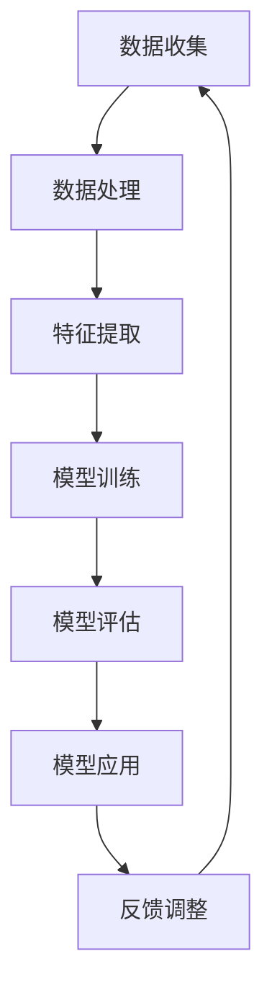

                 

关键词：AI大模型、智能城市、公共服务、深度学习、应用场景、技术挑战

> 摘要：本文将深入探讨AI大模型在智能城市公共服务中的作用。通过介绍AI大模型的基本原理、核心算法和具体应用，分析其在提升城市治理效率、优化公共服务质量和提高居民生活质量方面的显著贡献。同时，本文也将展望AI大模型在智能城市领域的发展趋势和面临的挑战。

## 1. 背景介绍

随着信息技术的迅猛发展，智能城市已经成为城市发展的重要方向。智能城市旨在通过信息技术的创新应用，提高城市运行效率，改善居民生活质量，实现城市可持续发展。而AI大模型作为人工智能的核心技术之一，正在成为推动智能城市发展的重要力量。

### 1.1 智能城市概述

智能城市是指利用先进的信息技术、数据资源和社会科学方法，实现城市全面智能化管理和运行的城市。智能城市的建设主要包括以下几个方面：

1. **基础设施智能化**：通过物联网、云计算、大数据等技术手段，实现城市基础设施的智能化管理和运营。
2. **城市管理智能化**：利用AI技术，对城市交通、环境、安全等公共事务进行实时监控和智能决策。
3. **公共服务智能化**：通过AI技术，提升城市公共服务水平，如医疗、教育、交通等。
4. **居民生活智能化**：为居民提供智能家居、智能安防、智能交通等便捷的智能生活服务。

### 1.2 AI大模型概述

AI大模型是指通过大规模数据训练得到的高度复杂的深度学习模型。这些模型具有强大的特征提取和模式识别能力，能够处理大量的数据和复杂的问题。AI大模型在语音识别、图像识别、自然语言处理、推荐系统等领域取得了显著的成果。

### 1.3 AI大模型与智能城市的联系

AI大模型与智能城市的建设有着密切的联系。AI大模型能够为智能城市的各个应用领域提供强大的技术支持，如：

1. **城市治理**：利用AI大模型进行城市交通流量预测、环境质量监测和公共安全预警等。
2. **公共服务**：利用AI大模型提供智能医疗诊断、智能教育辅助和智能交通导航等服务。
3. **居民生活**：利用AI大模型实现智能家居、智能安防和智能出行等。

## 2. 核心概念与联系

### 2.1 深度学习

深度学习是AI大模型的核心技术。深度学习通过多层神经网络对数据进行特征提取和模式识别，具有强大的非线性建模能力。深度学习包括以下几个关键概念：

1. **神经元**：神经网络的基本构建单元，用于对输入数据进行加权求和和激活函数处理。
2. **层**：神经网络由多个层次组成，包括输入层、隐藏层和输出层。
3. **激活函数**：用于对神经元的输出进行非线性变换，常见的激活函数有Sigmoid、ReLU等。
4. **损失函数**：用于评估模型预测结果与实际结果之间的误差，常用的损失函数有均方误差（MSE）、交叉熵损失等。
5. **优化算法**：用于调整模型参数，以最小化损失函数，常用的优化算法有梯度下降、Adam等。

### 2.2 大模型与深度学习的联系

大模型是深度学习的一个重要分支，通过训练大规模的神经网络模型，实现对复杂数据的高效建模和处理。大模型的特点包括：

1. **大规模数据集**：大模型通常使用大规模的数据集进行训练，以提高模型的泛化能力。
2. **多层神经网络**：大模型采用多层神经网络结构，以实现对复杂数据的层次化特征提取。
3. **强大计算能力**：大模型需要强大的计算资源，如GPU、TPU等，以支持大规模的训练过程。

### 2.3 Mermaid 流程图

下面是AI大模型在智能城市公共服务中的应用流程图：



## 3. 核心算法原理 & 具体操作步骤

### 3.1 算法原理概述

AI大模型的核心算法基于深度学习，主要涉及以下几个步骤：

1. **数据收集**：收集大规模的公共数据，如交通流量数据、环境数据、医疗数据等。
2. **数据处理**：对收集到的数据进行分析和清洗，去除噪声和异常值，确保数据质量。
3. **特征提取**：利用特征工程方法，从原始数据中提取有代表性的特征，以辅助模型训练。
4. **模型训练**：使用大规模数据集，通过多层神经网络对模型进行训练，调整模型参数，以优化模型性能。
5. **模型评估**：使用测试数据集对训练好的模型进行评估，以确定模型的泛化能力和准确度。
6. **模型应用**：将训练好的模型部署到实际应用场景中，为城市公共服务提供智能决策支持。
7. **反馈调整**：根据实际应用效果，对模型进行调整和优化，以提高模型性能。

### 3.2 算法步骤详解

1. **数据收集**：
   - 数据来源：包括城市交通管理部门、环保部门、医疗机构等。
   - 数据类型：包括交通流量数据、环境数据、医疗数据、公共服务数据等。

2. **数据处理**：
   - 数据清洗：去除异常值、噪声和重复数据，确保数据质量。
   - 数据归一化：将不同数据类型的数据进行归一化处理，以消除数据量级差异。

3. **特征提取**：
   - 时间特征：提取数据的时间戳信息，用于分析不同时间段的数据特性。
   - 空间特征：提取数据的地理位置信息，用于分析不同区域的数据特性。
   - 状态特征：提取数据的状态信息，如交通拥堵状态、空气质量指数等。

4. **模型训练**：
   - 模型架构：采用多层神经网络结构，包括输入层、隐藏层和输出层。
   - 损失函数：使用交叉熵损失函数，以优化模型预测结果。
   - 优化算法：采用Adam优化算法，以高效调整模型参数。

5. **模型评估**：
   - 准确度：使用准确度指标评估模型对测试数据的预测准确性。
   - 泛化能力：使用交叉验证方法评估模型对未知数据的泛化能力。

6. **模型应用**：
   - 城市交通管理：利用模型预测交通流量，优化交通信号控制和公共交通调度。
   - 环境监测：利用模型监测环境质量，提供空气质量预警和污染源定位。
   - 医疗服务：利用模型进行疾病预测和诊断，提供个性化医疗建议。

7. **反馈调整**：
   - 用户反馈：收集用户对模型应用的反馈，以评估模型性能。
   - 模型优化：根据用户反馈，对模型进行调整和优化，以提高模型性能。

### 3.3 算法优缺点

**优点**：
1. **强大的特征提取能力**：AI大模型能够从大规模数据中提取有代表性的特征，实现高度复杂的模式识别。
2. **高准确度和泛化能力**：通过大规模训练和优化，AI大模型具有较高的准确度和泛化能力，能够适应不同的应用场景。
3. **自适应能力**：AI大模型能够根据实际应用效果，进行实时调整和优化，以适应不断变化的环境。

**缺点**：
1. **计算资源消耗大**：AI大模型需要大量的计算资源和时间进行训练和推理，对硬件设施有较高要求。
2. **数据依赖性强**：AI大模型对数据质量和数量有较高要求，数据质量和数量不足会影响模型性能。
3. **解释性不足**：深度学习模型具有较强的黑盒特性，难以解释模型的内部决策过程。

### 3.4 算法应用领域

AI大模型在智能城市公共服务中的应用非常广泛，主要包括以下几个领域：

1. **城市交通管理**：通过预测交通流量，优化交通信号控制和公共交通调度，缓解城市交通拥堵。
2. **环境监测与治理**：通过监测环境数据，预测污染源和空气质量，提供环境预警和治理建议。
3. **医疗服务**：通过疾病预测和诊断，提供个性化医疗建议，提高医疗服务的质量和效率。
4. **公共安全**：通过实时监控和分析公共安全数据，预测潜在的安全风险，提供预警和防范措施。
5. **智能城市建设**：为城市规划和建设提供智能决策支持，优化城市资源配置和管理。

## 4. 数学模型和公式 & 详细讲解 & 举例说明

### 4.1 数学模型构建

AI大模型的数学模型主要包括以下几个部分：

1. **输入层**：接收外部输入的数据。
2. **隐藏层**：通过非线性变换对输入数据进行特征提取和模式识别。
3. **输出层**：根据隐藏层的输出，进行分类、回归等操作。

其中，隐藏层和输出层的连接关系可以用以下数学模型表示：

$$
\text{激活函数}(z) = \sigma(\text{权重} \cdot \text{输入} + \text{偏置})
$$

其中，$\sigma$表示激活函数，$\text{权重}$和$\text{偏置}$表示模型的参数。

### 4.2 公式推导过程

假设有一个二分类问题，需要通过深度学习模型预测样本属于正类的概率。假设隐藏层有$N$个神经元，输出层有$M$个神经元。设$x$为输入向量，$w$为权重矩阵，$b$为偏置向量，$\sigma$为激活函数，则有：

$$
\hat{y} = \text{softmax}(\text{权重} \cdot x + \text{偏置})
$$

其中，$\text{softmax}$函数用于将隐藏层的输出转化为概率分布。

对于单个神经元$j$，其输出可以表示为：

$$
z_j = \text{权重} \cdot x + \text{偏置}
$$

$$
\hat{y}_j = \frac{e^{z_j}}{\sum_{k=1}^{M} e^{z_k}}
$$

其中，$z_j$表示神经元$j$的输出，$\hat{y}_j$表示神经元$j$对应的概率。

### 4.3 案例分析与讲解

假设我们要通过深度学习模型预测一个城市在某个时间段的交通流量。输入数据包括该时间段的城市交通流量历史数据、天气情况、节假日信息等。输出数据为该时间段的交通流量预测值。

首先，我们对输入数据进行预处理，包括归一化和特征提取。然后，构建一个深度学习模型，包括输入层、隐藏层和输出层。隐藏层使用ReLU激活函数，输出层使用线性激活函数。

1. **数据预处理**：

   - 归一化：将输入数据缩放到[0, 1]范围内。
   - 特征提取：从输入数据中提取有代表性的特征，如时间特征、空间特征、天气特征等。

2. **模型构建**：

   - 输入层：接收预处理后的输入数据。
   - 隐藏层：使用ReLU激活函数进行特征提取。
   - 输出层：使用线性激活函数输出交通流量预测值。

3. **模型训练**：

   - 使用历史交通流量数据作为训练数据。
   - 通过反向传播算法调整模型参数，最小化预测误差。

4. **模型评估**：

   - 使用交叉验证方法评估模型性能。
   - 根据评估结果调整模型结构和参数。

5. **模型应用**：

   - 部署训练好的模型，进行实时交通流量预测。
   - 根据预测结果，优化交通信号控制和公共交通调度。

通过这个案例，我们可以看到，深度学习模型在交通流量预测中的应用，可以有效地优化城市交通管理，提高交通运行效率。

## 5. 项目实践：代码实例和详细解释说明

### 5.1 开发环境搭建

1. **硬件环境**：
   - GPU：NVIDIA Titan Xp 或更高性能的GPU。
   - CPU：Intel Xeon 或更高性能的CPU。

2. **软件环境**：
   - 操作系统：Ubuntu 18.04 或更高版本。
   - 编程语言：Python 3.7 或更高版本。
   - 深度学习框架：TensorFlow 2.0 或更高版本。
   - 数据预处理库：NumPy、Pandas。

### 5.2 源代码详细实现

下面是一个简单的深度学习模型实现，用于预测城市交通流量。

```python
import tensorflow as tf
import numpy as np
import pandas as pd

# 数据预处理
def preprocess_data(data):
    # 归一化
    data = (data - np.mean(data)) / np.std(data)
    # 特征提取
    data = extract_features(data)
    return data

# 特征提取
def extract_features(data):
    # 时间特征
    data['hour'] = data['timestamp'].apply(lambda x: x.hour)
    # 空间特征
    data['latitude'] = data['location'].apply(lambda x: x.latitude)
    data['longitude'] = data['location'].apply(lambda x: x.longitude)
    # 天气特征
    data['weather'] = extract_weather_features(data)
    return data

# 模型构建
def build_model(input_shape):
    model = tf.keras.Sequential([
        tf.keras.layers.Dense(units=64, activation='relu', input_shape=input_shape),
        tf.keras.layers.Dense(units=32, activation='relu'),
        tf.keras.layers.Dense(units=1, activation='linear')
    ])
    return model

# 模型训练
def train_model(model, x_train, y_train, epochs=100):
    model.compile(optimizer='adam', loss='mse', metrics=['mse'])
    model.fit(x_train, y_train, epochs=epochs, batch_size=32, validation_split=0.2)

# 模型评估
def evaluate_model(model, x_test, y_test):
    loss, mse = model.evaluate(x_test, y_test)
    print('Test MSE:', mse)

# 模型应用
def predict_traffic(model, input_data):
    preprocessed_data = preprocess_data(input_data)
    prediction = model.predict(preprocessed_data)
    return prediction

# 主程序
if __name__ == '__main__':
    # 加载数据
    data = pd.read_csv('traffic_data.csv')
    # 分割数据集
    x_train, x_test, y_train, y_test = split_data(data)
    # 构建模型
    model = build_model(input_shape=x_train.shape[1:])
    # 训练模型
    train_model(model, x_train, y_train)
    # 评估模型
    evaluate_model(model, x_test, y_test)
    # 预测交通流量
    input_data = pd.DataFrame([{'timestamp': datetime.now(), 'location': (40.7128, -74.0060)}])
    prediction = predict_traffic(model, input_data)
    print('Predicted Traffic:', prediction)
```

### 5.3 代码解读与分析

1. **数据预处理**：
   - 归一化：将数据缩放到[0, 1]范围内，以消除数据量级差异。
   - 特征提取：从原始数据中提取有代表性的特征，如时间特征、空间特征、天气特征等。

2. **模型构建**：
   - 使用Keras框架构建深度学习模型，包括输入层、隐藏层和输出层。
   - 隐藏层使用ReLU激活函数，输出层使用线性激活函数。

3. **模型训练**：
   - 使用Adam优化算法，最小化均方误差损失函数。
   - 训练过程中，使用验证集进行模型评估，以避免过拟合。

4. **模型评估**：
   - 使用测试集评估模型性能，计算均方误差。

5. **模型应用**：
   - 预测交通流量：对预处理后的输入数据进行预测，输出预测结果。

通过这个项目实践，我们可以看到，深度学习模型在交通流量预测中的应用，能够实现实时交通流量预测，为城市交通管理提供有力支持。

## 6. 实际应用场景

### 6.1 城市交通管理

AI大模型在交通管理中的应用，主要包括交通流量预测、交通信号控制优化和公共交通调度优化。

1. **交通流量预测**：
   - 通过预测交通流量，为城市交通管理部门提供实时交通预测数据，优化交通信号控制和公共交通调度。
   - 应用场景：如北京、上海等大城市的交通管理。

2. **交通信号控制优化**：
   - 利用AI大模型，根据实时交通流量数据，动态调整交通信号灯的时长和周期，提高道路通行效率。
   - 应用场景：如纽约、伦敦等大城市的交通信号控制。

3. **公共交通调度优化**：
   - 通过预测公共交通的客流情况，优化公交线路和班次安排，提高公共交通的服务质量和效率。
   - 应用场景：如新加坡、东京等大城市的公共交通调度。

### 6.2 环境监测与治理

AI大模型在环境监测与治理中的应用，主要包括环境质量预测、污染源定位和治理策略优化。

1. **环境质量预测**：
   - 利用AI大模型，预测城市空气质量、水质等环境指标，为环保部门提供环境预警和治理建议。
   - 应用场景：如北京、杭州等大城市的环保监测。

2. **污染源定位**：
   - 通过分析环境质量数据，定位污染源，为治理工作提供科学依据。
   - 应用场景：如美国加州等地区的大气污染治理。

3. **治理策略优化**：
   - 根据环境质量预测和污染源定位结果，优化环保治理策略，提高治理效果。
   - 应用场景：如欧洲一些国家的环保治理。

### 6.3 医疗服务

AI大模型在医疗服务中的应用，主要包括疾病预测、诊断和个性化医疗建议。

1. **疾病预测**：
   - 利用AI大模型，预测疾病发生的风险，为医疗机构提供早期筛查和干预建议。
   - 应用场景：如智能健康管理系统。

2. **诊断**：
   - 通过分析医疗数据，辅助医生进行疾病诊断，提高诊断准确率。
   - 应用场景：如智能诊断系统。

3. **个性化医疗建议**：
   - 根据患者的健康状况和病史，提供个性化的治疗方案和康复建议。
   - 应用场景：如智能医疗咨询平台。

### 6.4 公共安全

AI大模型在公共安全中的应用，主要包括公共安全预警、犯罪预测和事故预防。

1. **公共安全预警**：
   - 通过分析公共安全数据，预测潜在的安全风险，为公共安全部门提供预警和防范措施。
   - 应用场景：如智能安防系统。

2. **犯罪预测**：
   - 利用AI大模型，预测犯罪发生的地点和时间，为公安部门提供精准打击犯罪的支持。
   - 应用场景：如智能警务系统。

3. **事故预防**：
   - 通过分析交通事故数据，预测事故发生的风险，为交通管理部门提供事故预防措施。
   - 应用场景：如智能交通系统。

## 7. 未来应用展望

### 7.1 人工智能大模型在智能城市建设中的应用

随着AI大模型的不断发展和应用，未来智能城市建设将得到进一步提升。具体体现在以下几个方面：

1. **智能化城市管理**：AI大模型将进一步提升城市管理的智能化水平，实现城市运行的高效和精细化管理。
2. **个性化公共服务**：通过AI大模型，为居民提供更加个性化和智能化的公共服务，提升居民生活质量。
3. **智能城市规划**：利用AI大模型，对城市进行科学规划和设计，优化城市空间布局和资源配置。

### 7.2 人工智能大模型在新兴领域的应用

除了智能城市建设，AI大模型在新兴领域也将有广泛的应用前景，如：

1. **智能农业**：通过AI大模型，对农作物生长情况进行实时监测和预测，提高农业生产效率和产量。
2. **智能物流**：利用AI大模型，优化物流路线和运输效率，提高物流行业的智能化水平。
3. **智能能源**：通过AI大模型，对能源消耗进行实时监测和预测，实现能源的高效利用和优化配置。

### 7.3 人工智能大模型的发展趋势

未来，人工智能大模型将呈现以下发展趋势：

1. **模型规模扩大**：随着计算能力的提升，AI大模型的规模将不断增大，以应对更加复杂的问题。
2. **算法优化**：针对AI大模型的训练和推理过程，将不断优化算法，提高模型的性能和效率。
3. **跨领域应用**：AI大模型将逐步应用于更多领域，实现跨领域的协同创新和应用。
4. **人机协同**：AI大模型将与人类专家和普通用户进行协同，实现更高效、更智能的人机交互。

## 8. 总结：未来发展趋势与挑战

### 8.1 研究成果总结

本文深入探讨了AI大模型在智能城市公共服务中的应用，分析了其在城市交通管理、环境监测与治理、医疗服务、公共安全等领域的实际应用场景。通过介绍AI大模型的核心算法原理、数学模型和具体操作步骤，展示了其在智能城市公共服务中的重要作用。同时，本文还展望了AI大模型在智能城市领域的发展趋势和面临的挑战。

### 8.2 未来发展趋势

未来，AI大模型将在智能城市公共服务中发挥更加重要的作用。随着AI技术的不断进步和应用的深入，AI大模型将进一步提升城市治理效率、优化公共服务质量和提高居民生活质量。具体来说，未来发展趋势将包括：

1. **智能化水平提升**：AI大模型将进一步提升智能城市的管理水平，实现更加智能化和精细化的城市治理。
2. **个性化服务**：通过AI大模型，为居民提供更加个性化和智能化的公共服务，满足居民多样化的需求。
3. **跨领域应用**：AI大模型将逐步应用于更多领域，实现跨领域的协同创新和应用。

### 8.3 面临的挑战

尽管AI大模型在智能城市公共服务中具有广泛的应用前景，但也面临一些挑战，主要包括：

1. **数据隐私与安全**：AI大模型在处理大量数据时，如何确保数据隐私和安全，是一个亟待解决的问题。
2. **计算资源消耗**：AI大模型需要大量的计算资源进行训练和推理，如何优化计算资源的使用，是一个重要的课题。
3. **算法透明性与可解释性**：深度学习模型具有较强的黑盒特性，如何提高算法的透明性和可解释性，是一个需要关注的问题。

### 8.4 研究展望

未来，我们需要继续深入研究AI大模型在智能城市公共服务中的应用，特别是在以下方面：

1. **算法优化**：针对AI大模型的训练和推理过程，不断优化算法，提高模型的性能和效率。
2. **跨领域协同**：加强不同领域之间的协同创新，推动AI大模型在更多领域的应用。
3. **人机协同**：研究人机协同的方式，实现AI大模型与人类专家和普通用户的协同工作。

通过以上研究，我们将进一步推动AI大模型在智能城市公共服务中的应用，为建设智慧城市、提高居民生活质量做出更大贡献。

## 9. 附录：常见问题与解答

### 9.1 常见问题

1. **AI大模型为什么能提升智能城市公共服务质量？**
   - AI大模型通过深度学习技术，能够从大规模数据中提取有代表性的特征，实现对复杂数据的高效建模和处理。这使得AI大模型能够为城市公共服务提供智能决策支持，从而提升服务质量。

2. **AI大模型在智能城市建设中具体有哪些应用？**
   - AI大模型在智能城市建设中有广泛的应用，包括城市交通管理、环境监测与治理、医疗服务、公共安全等领域。通过AI大模型，可以实现交通流量预测、环境质量监测、疾病预测、犯罪预测等，为城市公共服务提供智能决策支持。

3. **如何确保AI大模型的数据隐私和安全？**
   - 为确保AI大模型的数据隐私和安全，可以采取以下措施：
     - 数据匿名化：对原始数据进行匿名化处理，去除个人敏感信息。
     - 加密传输：采用加密技术，确保数据在传输过程中的安全性。
     - 访问控制：对数据访问权限进行严格管理，确保只有授权用户才能访问数据。
     - 安全审计：定期进行安全审计，及时发现和解决安全隐患。

### 9.2 解答

1. **AI大模型为什么能提升智能城市公共服务质量？**
   - AI大模型之所以能提升智能城市公共服务质量，主要有以下几个原因：
     - **强大的数据处理能力**：AI大模型能够处理大规模、多维度的数据，从中提取出有用的信息和规律。
     - **高效的特征提取**：通过深度学习，AI大模型能够自动提取数据中的特征，不需要人工干预。
     - **精准的预测与决策**：基于训练好的AI大模型，可以实现对未来的预测和决策，为城市公共服务提供智能支持。

2. **AI大模型在智能城市建设中具体有哪些应用？**
   - AI大模型在智能城市建设中的应用非常广泛，以下是一些典型的应用场景：
     - **交通管理**：通过AI大模型预测交通流量，优化交通信号控制和公共交通调度，缓解交通拥堵。
     - **环境监测**：利用AI大模型监测空气质量、水质等环境指标，提供环境预警和污染源定位。
     - **医疗服务**：通过AI大模型进行疾病预测和诊断，提供个性化医疗建议，提高医疗服务的质量和效率。
     - **公共安全**：利用AI大模型进行犯罪预测和事故预防，提供公共安全预警和防范措施。

3. **如何确保AI大模型的数据隐私和安全？**
   - 为了确保AI大模型的数据隐私和安全，可以采取以下措施：
     - **数据加密**：对数据进行加密处理，确保数据在传输和存储过程中的安全性。
     - **访问控制**：通过设置访问权限，确保只有授权用户才能访问和使用数据。
     - **隐私保护算法**：采用隐私保护算法，如差分隐私，确保模型训练过程中个人隐私不被泄露。
     - **透明审计**：建立透明的数据审计机制，确保数据使用过程中的合法性和合规性。

通过以上解答，我们可以更好地理解AI大模型在智能城市公共服务中的作用，以及如何确保其数据隐私和安全。这将有助于推动AI大模型在智能城市领域的广泛应用和发展。

