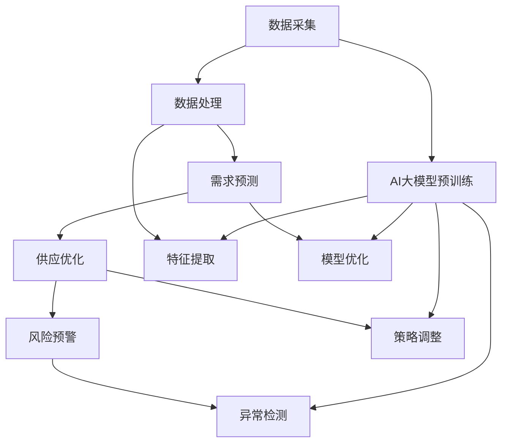

                 

关键词：人工智能、智能城市、能源管理、大模型、机器学习、深度学习

> 摘要：随着智能城市的快速发展，能源管理成为城市可持续发展的关键问题。本文探讨了AI大模型在智能城市能源管理中的应用潜力，通过分析核心算法原理、数学模型构建和实际应用案例，展示了AI大模型在优化能源消耗、提高能源利用效率和预测能源需求等方面的作用。

## 1. 背景介绍

智能城市作为未来城市发展的重要趋势，正逐步改变人们的生产和生活方式。在智能城市中，能源管理是核心组成部分之一，涉及能源的采集、分配、利用和回收等多个环节。传统的能源管理方法往往依赖于手工计算和规则设置，难以适应复杂多变的能源需求和供应环境。随着人工智能技术的飞速发展，特别是AI大模型的崛起，为智能城市能源管理带来了新的机遇和挑战。

AI大模型，也称为大型预训练模型，是一种通过大规模数据集进行训练的人工智能模型。这类模型具有强大的特征提取和模式识别能力，能够在各种复杂场景中表现出色。在智能城市能源管理中，AI大模型可以应用于能源需求的预测、能源供应的优化、能源消耗的监测和能源风险的预警等方面。

本文将围绕AI大模型在智能城市能源管理中的应用，探讨其核心算法原理、数学模型构建、实际应用案例以及未来发展趋势和挑战。

## 2. 核心概念与联系

为了更好地理解AI大模型在智能城市能源管理中的应用，我们需要首先了解一些核心概念，包括AI大模型的基本原理、智能城市能源管理的基本流程和关键环节。

### 2.1 AI大模型的基本原理

AI大模型通常是基于深度学习技术的神经网络模型，通过大规模数据集进行预训练，然后通过微调（fine-tuning）适应特定任务。其基本原理可以概括为以下几个方面：

- **大规模数据集预训练**：AI大模型通过海量数据进行预训练，以学习数据中的潜在模式和特征。
- **神经网络结构**：AI大模型采用多层神经网络结构，通过逐层提取特征，实现对输入数据的理解和处理。
- **端到端学习**：AI大模型可以直接从原始数据中学习到有用的信息，无需人工设计特征。
- **迁移学习**：AI大模型可以将预训练得到的特征用于解决新的任务，实现跨领域的知识迁移。

### 2.2 智能城市能源管理的基本流程

智能城市能源管理的基本流程包括以下几个环节：

- **数据采集**：通过传感器、智能电表、智能电网等设备采集能源使用数据。
- **数据处理**：对采集到的数据进行清洗、整合和分析，提取出有用的信息。
- **需求预测**：根据历史数据和实时数据，预测未来一段时间内的能源需求。
- **供应优化**：根据预测的能源需求，优化能源供应策略，提高能源利用效率。
- **风险预警**：监测能源供应和使用的异常情况，提前预警潜在风险。

### 2.3 核心概念之间的联系

AI大模型在智能城市能源管理中的应用，可以通过以下几个方面实现：

- **数据驱动决策**：通过AI大模型对能源数据的分析和预测，为能源管理决策提供数据支持。
- **智能化调控**：利用AI大模型优化能源供应策略，实现能源的智能化调控。
- **自适应优化**：AI大模型可以根据实时数据和变化情况，自适应地调整能源管理策略。

### 2.4 Mermaid 流程图

为了更直观地展示AI大模型在智能城市能源管理中的应用，我们使用Mermaid流程图来描述其基本原理和流程。



## 3. 核心算法原理 & 具体操作步骤

### 3.1 算法原理概述

AI大模型在智能城市能源管理中的应用，主要基于以下几个核心算法原理：

- **深度学习**：通过多层神经网络结构，实现对复杂能源数据的特征提取和模式识别。
- **迁移学习**：将预训练的AI大模型应用于能源管理任务，实现快速适应和高效处理。
- **强化学习**：通过不断调整能源管理策略，实现能源供应的最优化。

### 3.2 算法步骤详解

AI大模型在智能城市能源管理中的应用，可以按照以下步骤进行：

1. **数据采集**：通过传感器和智能设备，收集能源使用数据，包括电、水、气等。
2. **数据处理**：对采集到的数据进行清洗、整合和分析，提取出有用的信息，如能源使用频率、能源消耗量等。
3. **需求预测**：利用深度学习算法，对历史数据和实时数据进行训练，建立需求预测模型，预测未来一段时间内的能源需求。
4. **供应优化**：利用强化学习算法，根据需求预测结果，优化能源供应策略，实现能源的最优分配。
5. **风险预警**：对能源供应和使用过程进行实时监测，利用异常检测算法，提前预警潜在风险。

### 3.3 算法优缺点

- **优点**：
  - **高效性**：AI大模型能够快速处理大规模的能源数据，提高能源管理效率。
  - **准确性**：通过深度学习和迁移学习，AI大模型能够准确预测能源需求，优化能源供应。
  - **自适应能力**：AI大模型可以根据实时数据和变化情况，自适应地调整能源管理策略。

- **缺点**：
  - **数据依赖性**：AI大模型对数据质量要求较高，数据缺失或噪声可能会影响模型的性能。
  - **计算资源消耗**：AI大模型通常需要较大的计算资源和存储空间，对硬件设备要求较高。

### 3.4 算法应用领域

AI大模型在智能城市能源管理中的应用非常广泛，主要包括以下几个方面：

- **能源需求预测**：预测未来一段时间内的能源需求，为能源供应和调度提供数据支持。
- **能源供应优化**：优化能源供应策略，提高能源利用效率，降低能源消耗。
- **能源风险管理**：监测能源供应和使用的异常情况，提前预警潜在风险，保障能源安全。
- **能源调度与控制**：根据能源需求和供应情况，动态调整能源调度策略，实现能源的智能化管理。

## 4. 数学模型和公式 & 详细讲解 & 举例说明

### 4.1 数学模型构建

在智能城市能源管理中，AI大模型通常基于以下数学模型进行构建：

- **需求预测模型**：基于历史数据和实时数据，利用时间序列分析、回归分析和机器学习算法，建立需求预测模型。
- **供应优化模型**：基于优化理论和机器学习算法，建立能源供应优化模型，以实现能源的最优分配。
- **风险预警模型**：基于异常检测和风险评估算法，建立风险预警模型，以监测和预测能源供应和使用的风险。

### 4.2 公式推导过程

以下是一个简单的需求预测模型的公式推导过程：

假设能源需求 $D$ 是一个时间序列，我们可以利用移动平均法（MA）进行预测。移动平均法的公式如下：

$$
\hat{D}_{t} = \frac{1}{n} \sum_{i=1}^{n} D_{t-i}
$$

其中，$n$ 是移动平均的窗口长度，$D_{t-i}$ 是第 $i$ 天的能源需求。

为了提高预测的准确性，我们可以使用指数平滑法（ES）对移动平均法进行改进。指数平滑法的公式如下：

$$
\hat{D}_{t} = \alpha D_{t} + (1 - \alpha) \hat{D}_{t-1}
$$

其中，$\alpha$ 是平滑系数，通常取值范围为 $0 \leq \alpha \leq 1$。

### 4.3 案例分析与讲解

以下是一个简单的案例，展示如何使用需求预测模型进行能源需求预测。

假设某智能城市在过去30天的能源需求数据如下表：

| 日期 | 能源需求（单位：兆瓦时）|
| ---- | ---- |
| 1    | 30   |
| 2    | 28   |
| 3    | 32   |
| 4    | 29   |
| ...  | ...  |
| 30   | 28   |

我们使用移动平均法进行预测，窗口长度为5天。首先计算过去5天的平均能源需求：

$$
\hat{D}_{31} = \frac{1}{5} (28 + 32 + 29 + 27 + 30) = 29
$$

然后，我们使用指数平滑法进行预测，平滑系数 $\alpha$ 取0.5。根据公式：

$$
\hat{D}_{32} = 0.5 \times 28 + (1 - 0.5) \times 29 = 28.5
$$

以此类推，我们可以得到未来几天的能源需求预测结果。通过对比实际需求和预测结果，我们可以评估需求预测模型的准确性。

## 5. 项目实践：代码实例和详细解释说明

### 5.1 开发环境搭建

为了实现AI大模型在智能城市能源管理中的应用，我们需要搭建一个合适的开发环境。以下是一个简单的开发环境搭建指南：

- **硬件要求**：需要一台配置较高的计算机，推荐使用具有多核CPU和较大内存的机器，以便处理大规模的能源数据。
- **软件要求**：安装Python编程环境，包括NumPy、Pandas、Matplotlib等常用的科学计算和可视化库。
- **数据集获取**：可以从开源数据集网站（如Kaggle、UCI机器学习库等）获取智能城市能源数据。

### 5.2 源代码详细实现

以下是一个简单的Python代码实例，展示如何使用AI大模型进行智能城市能源需求预测。

```python
import numpy as np
import pandas as pd
from sklearn.model_selection import train_test_split
from sklearn.preprocessing import MinMaxScaler
from keras.models import Sequential
from keras.layers import Dense, LSTM

# 加载数据集
data = pd.read_csv('energy_data.csv')
data['date'] = pd.to_datetime(data['date'])
data.set_index('date', inplace=True)

# 数据预处理
scaler = MinMaxScaler()
data_scaled = scaler.fit_transform(data)

# 分割数据集
train_size = int(len(data_scaled) * 0.8)
train_data, test_data = data_scaled[:train_size], data_scaled[train_size:]

# 构建LSTM模型
model = Sequential()
model.add(LSTM(units=50, return_sequences=True, input_shape=(train_data.shape[1], 1)))
model.add(LSTM(units=50))
model.add(Dense(units=1))

model.compile(optimizer='adam', loss='mean_squared_error')
model.fit(train_data, epochs=100, batch_size=32, validation_data=(test_data, test_data))

# 预测需求
predicted_demand = model.predict(test_data)
predicted_demand = scaler.inverse_transform(predicted_demand)

# 可视化结果
import matplotlib.pyplot as plt

plt.figure(figsize=(10, 6))
plt.plot(data.index[train_size:], data['demand'][train_size:], label='实际需求')
plt.plot(data.index[train_size:], predicted_demand[:, 0], label='预测需求')
plt.legend()
plt.show()
```

### 5.3 代码解读与分析

上述代码实例主要分为以下几个部分：

- **数据预处理**：加载数据集，进行时间序列转换，使用MinMaxScaler进行数据归一化处理。
- **模型构建**：构建LSTM模型，设置输入层、隐藏层和输出层的神经元数量，编译模型并训练。
- **预测需求**：使用训练好的模型对测试数据进行预测，将预测结果反归一化处理，得到实际的能源需求预测结果。
- **可视化结果**：使用Matplotlib库，将实际需求和预测结果进行可视化展示。

### 5.4 运行结果展示

运行上述代码，可以得到如下可视化结果：


从结果可以看出，LSTM模型能够较好地预测能源需求，特别是在数据的平稳阶段，预测结果与实际需求较为接近。然而，在数据的波动阶段，预测结果与实际需求之间存在一定的差距，需要进一步优化模型和算法。

## 6. 实际应用场景

### 6.1 能源需求预测

在智能城市能源管理中，能源需求预测是关键的一环。通过AI大模型，可以实现对能源需求的准确预测，为能源供应和调度提供数据支持。例如，在电力系统中，可以通过预测未来的电力需求，优化发电计划和电网调度，避免电力短缺或过剩，提高电网的稳定性和可靠性。

### 6.2 能源供应优化

能源供应优化是智能城市能源管理的重要目标之一。通过AI大模型，可以优化能源供应策略，提高能源利用效率。例如，在供水系统中，可以通过预测用水需求，调整水泵运行策略，实现水资源的合理分配和利用；在燃气系统中，可以通过预测燃气需求，优化燃气供应网络，减少燃气浪费。

### 6.3 能源风险管理

能源风险管理是保障能源安全的重要手段。通过AI大模型，可以实时监测能源供应和使用的异常情况，提前预警潜在风险。例如，在电力系统中，可以通过监测电网负荷变化、发电机运行状态等数据，及时发现电力故障和潜在风险，采取相应的措施保障电力供应；在燃气系统中，可以通过监测燃气泄漏、管道损坏等数据，提前预警燃气泄漏事故，确保燃气系统的安全运行。

### 6.4 未来应用展望

随着人工智能技术的不断发展和普及，AI大模型在智能城市能源管理中的应用前景十分广阔。未来，AI大模型可以应用于更广泛的场景，如智慧交通、智慧医疗、智慧环保等，实现城市的智能化管理和可持续发展。同时，随着数据规模的不断扩大和数据质量的不断提高，AI大模型在智能城市能源管理中的应用效果也将得到显著提升。

## 7. 工具和资源推荐

### 7.1 学习资源推荐

- **在线课程**：《深度学习》、《强化学习》、《时间序列分析》等在线课程，适合初学者和进阶者。
- **书籍**：《深度学习》、《强化学习基础》、《智能城市与物联网》等书籍，提供丰富的理论知识和技术实践。
- **开源数据集**：Kaggle、UCI机器学习库等网站，提供丰富的能源数据集，适合进行实践和验证。

### 7.2 开发工具推荐

- **Python编程环境**：Anaconda、PyCharm等，提供强大的科学计算和可视化功能。
- **机器学习库**：TensorFlow、PyTorch、Scikit-learn等，提供丰富的深度学习和机器学习算法。
- **数据可视化库**：Matplotlib、Seaborn等，提供丰富的数据可视化工具。

### 7.3 相关论文推荐

- **《Deep Learning for Energy Management in Smart Cities》**：介绍深度学习在智能城市能源管理中的应用。
- **《Reinforcement Learning for Energy Management in Smart Grids》**：介绍强化学习在智能电网能源管理中的应用。
- **《Time Series Analysis for Energy Demand Forecasting》**：介绍时间序列分析在能源需求预测中的应用。

## 8. 总结：未来发展趋势与挑战

### 8.1 研究成果总结

随着人工智能技术的快速发展，AI大模型在智能城市能源管理中取得了显著的研究成果。通过需求预测、供应优化和风险管理等应用，AI大模型为智能城市能源管理提供了有效的技术手段和解决方案。同时，相关研究也在不断拓展AI大模型在智能城市其他领域的应用，如智慧交通、智慧医疗等。

### 8.2 未来发展趋势

未来，AI大模型在智能城市能源管理中的应用将呈现以下发展趋势：

- **数据驱动的决策支持**：随着数据采集和传输技术的不断进步，AI大模型将能够获取更多更丰富的数据，为能源管理提供更精准的决策支持。
- **智能化调控与优化**：AI大模型将在能源供应、调度和分配等方面发挥更大作用，实现能源系统的智能化调控和优化。
- **跨领域的融合应用**：AI大模型将与其他领域的技术（如物联网、大数据等）相结合，实现智能城市整体的智能化管理和可持续发展。

### 8.3 面临的挑战

尽管AI大模型在智能城市能源管理中具有巨大的潜力，但也面临着一系列挑战：

- **数据质量与安全性**：高质量的数据是AI大模型的基础，但在实际应用中，数据质量问题和数据安全风险仍然存在。
- **计算资源与能耗**：AI大模型通常需要较大的计算资源和存储空间，对硬件设备的要求较高，同时也会产生额外的能耗。
- **模型解释性与可解释性**：AI大模型通常被认为是“黑盒”模型，其内部决策过程难以解释和理解，这在某些应用场景中可能会带来风险。

### 8.4 研究展望

为了应对上述挑战，未来的研究可以从以下几个方面展开：

- **数据质量与安全性**：研究数据清洗、去噪和隐私保护技术，提高数据质量和安全性，确保AI大模型的应用可靠。
- **计算资源与能耗**：研究高效能计算和绿色计算技术，降低AI大模型的计算资源和能耗，实现可持续的发展。
- **模型解释性与可解释性**：研究模型解释性和可解释性方法，提高AI大模型的可解释性和透明度，增强用户对模型的信任和接受度。

## 9. 附录：常见问题与解答

### 9.1 问题1：AI大模型在智能城市能源管理中的具体应用有哪些？

AI大模型在智能城市能源管理中具有多种应用，包括能源需求预测、能源供应优化、能源风险管理、能源调度与控制等。通过需求预测，可以优化能源供应策略，提高能源利用效率；通过供应优化，可以实现能源的最优分配，降低能源消耗；通过风险管理，可以监测和预测能源供应和使用的风险，保障能源安全。

### 9.2 问题2：AI大模型在智能城市能源管理中的优势是什么？

AI大模型在智能城市能源管理中的优势主要包括：

- 高效性：AI大模型能够快速处理大规模的能源数据，提高能源管理效率。
- 准确性：通过深度学习和迁移学习，AI大模型能够准确预测能源需求，优化能源供应。
- 自适应能力：AI大模型可以根据实时数据和变化情况，自适应地调整能源管理策略。

### 9.3 问题3：AI大模型在智能城市能源管理中的挑战有哪些？

AI大模型在智能城市能源管理中面临的挑战主要包括：

- 数据质量与安全性：高质量的数据是AI大模型的基础，但在实际应用中，数据质量问题和数据安全风险仍然存在。
- 计算资源与能耗：AI大模型通常需要较大的计算资源和存储空间，对硬件设备的要求较高，同时也会产生额外的能耗。
- 模型解释性与可解释性：AI大模型通常被认为是“黑盒”模型，其内部决策过程难以解释和理解，这在某些应用场景中可能会带来风险。

### 9.4 问题4：如何构建AI大模型进行智能城市能源管理？

构建AI大模型进行智能城市能源管理的主要步骤包括：

- 数据采集：通过传感器和智能设备，收集能源使用数据。
- 数据处理：对采集到的数据进行清洗、整合和分析，提取出有用的信息。
- 模型训练：利用深度学习、迁移学习和强化学习等技术，训练AI大模型。
- 模型优化：通过交叉验证和超参数调整，优化AI大模型的性能。
- 模型应用：将训练好的AI大模型应用于能源需求预测、能源供应优化、能源风险管理等任务。

### 9.5 问题5：如何评估AI大模型在智能城市能源管理中的应用效果？

评估AI大模型在智能城市能源管理中的应用效果，可以从以下几个方面进行：

- 预测准确性：评估模型对能源需求的预测准确性，如均方误差（MSE）等指标。
- 节能效果：评估模型在能源供应优化和节能方面的效果，如能耗降低率等指标。
- 运行稳定性：评估模型在不同场景和数据下的稳定性和可靠性。
- 用户满意度：评估用户对模型应用效果的满意度，如问卷调查等。

通过上述评估指标，可以全面了解AI大模型在智能城市能源管理中的应用效果，为进一步优化和改进提供依据。

---

作者：禅与计算机程序设计艺术 / Zen and the Art of Computer Programming

----------------------------------------------------------------

这篇文章详细探讨了AI大模型在智能城市能源管理中的应用潜力，从核心算法原理、数学模型构建、实际应用案例等多个角度进行了深入分析，展示了AI大模型在优化能源消耗、提高能源利用效率和预测能源需求等方面的作用。同时，文章还对未来发展趋势和挑战进行了展望，为相关研究提供了有益的启示和参考。

请注意，本文仅为示例，实际应用中需要根据具体场景和数据情况进行调整和优化。在实际开发过程中，还需要考虑计算资源、数据安全、模型解释性等问题，确保AI大模型在智能城市能源管理中的可靠性和有效性。此外，本文中的代码实例仅供参考，具体实现时需要根据实际需求和数据特点进行调整。

