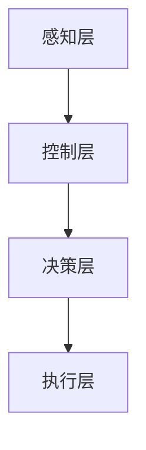

                 

关键词：人工智能，大模型，智能家居，能源管理，算法，数学模型，代码实例，应用场景，展望

> 摘要：随着人工智能技术的迅猛发展，AI大模型在各个领域的应用逐渐深入。本文旨在探讨AI大模型在智能家居能源管理中的潜在应用价值，通过介绍核心概念、算法原理、数学模型以及项目实践，分析其在提高能源利用效率和优化能源消耗方面的实际效果。

## 1. 背景介绍

在当前全球能源危机的背景下，如何高效利用能源已成为各国关注的重要课题。传统智能家居系统大多依赖于手动设置或简单的自动化控制，难以满足日益增长的节能需求。随着人工智能（AI）技术的不断进步，特别是大模型（Large Models）的出现，为智能家居能源管理带来了新的机遇。

大模型是指参数数量巨大、结构复杂的深度学习模型，它们能够通过大量的数据训练获得强大的特征提取和模式识别能力。在智能家居能源管理中，大模型的应用有望实现更精准的能耗预测、更智能的设备控制，从而显著提升能源利用效率。

## 2. 核心概念与联系

### 2.1. 智能家居能源管理系统架构

智能家居能源管理系统由感知层、控制层、决策层和执行层组成。

- 感知层：包括各种传感器，如温度传感器、光照传感器、电力传感器等，用于实时监测家庭能源使用情况。
- 控制层：负责将感知层采集的数据进行初步处理，并根据决策层的指令控制家电设备的启停。
- 决策层：利用AI大模型进行能耗预测和优化控制策略的制定。
- 执行层：根据决策层的指令执行相应的控制操作。

### 2.2. AI大模型与智能家居能源管理的关系

AI大模型通过以下方式与智能家居能源管理相结合：

- 能耗预测：利用历史数据和实时数据，大模型能够预测未来的能耗情况，为能源管理提供数据支持。
- 负荷平衡：通过对家电设备的智能控制，大模型可以平衡家庭内部的电力负荷，减少高峰期的电力消耗。
- 故障诊断：大模型能够通过对设备运行数据的分析，及时发现设备故障，避免因设备故障导致的能源浪费。

### 2.3. Mermaid流程图



## 3. 核心算法原理 & 具体操作步骤

### 3.1. 算法原理概述

AI大模型在智能家居能源管理中的核心算法主要包括：

- 能耗预测：使用时间序列模型，如LSTM（长短期记忆网络）或GRU（门控循环单元）。
- 负荷平衡：使用强化学习算法，如DQN（深度Q网络）或PPO（proximal policy optimization）。
- 故障诊断：使用异常检测算法，如孤立森林（Isolation Forest）或KNN（K最近邻）。

### 3.2. 算法步骤详解

#### 3.2.1. 能耗预测

1. 数据采集：收集家庭用电数据、温度数据、光照数据等。
2. 数据预处理：对数据进行清洗和归一化处理。
3. 模型训练：使用LSTM或GRU模型对预处理后的数据进行训练。
4. 能耗预测：使用训练好的模型对未来的能耗进行预测。

#### 3.2.2. 负荷平衡

1. 状态定义：定义家庭电器的状态，如开启、关闭、待机等。
2. 策略学习：使用DQN或PPO算法学习最优控制策略。
3. 负荷平衡：根据当前状态和最优策略，调整电器的工作状态，以达到负荷平衡。

#### 3.2.3. 故障诊断

1. 特征提取：从设备运行数据中提取特征。
2. 异常检测：使用孤立森林或KNN算法检测异常。
3. 故障定位：根据异常检测结果定位故障设备。

### 3.3. 算法优缺点

#### 3.3.1. 能耗预测

- 优点：能够提供准确的能耗预测，为能源管理提供数据支持。
- 缺点：对历史数据依赖性强，需要大量的训练数据。

#### 3.3.2. 负荷平衡

- 优点：能够有效平衡家庭内部的电力负荷，减少能源浪费。
- 缺点：算法复杂度高，实时性要求高，对计算资源有较高要求。

#### 3.3.3. 故障诊断

- 优点：能够及时发现设备故障，减少因故障导致的能源浪费。
- 缺点：对异常数据的识别能力有限，可能存在误报。

### 3.4. 算法应用领域

AI大模型在智能家居能源管理中的应用领域包括：

- 能源消耗预测与优化
- 电力负荷平衡与调度
- 家庭能源管理系统集成与优化
- 能源设备故障诊断与维护

## 4. 数学模型和公式

### 4.1. 数学模型构建

智能家居能源管理中的数学模型主要包括：

- 时间序列预测模型：如ARIMA（自回归积分滑动平均模型）、LSTM等。
- 强化学习模型：如Q网络、PPO等。
- 异常检测模型：如孤立森林、KNN等。

### 4.2. 公式推导过程

#### 4.2.1. 时间序列预测模型

LSTM模型的推导过程：

$$
h_t = \sigma(W_h \cdot [h_{t-1}, x_t] + b_h)
$$

$$
i_t = \sigma(W_i \cdot [h_{t-1}, x_t] + b_i)
$$

$$
f_t = \sigma(W_f \cdot [h_{t-1}, x_t] + b_f)
$$

$$
o_t = \sigma(W_o \cdot [h_{t-1}, x_t] + b_o)
$$

$$
\hat{y}_t = o_t \odot \tanh(h_t)
$$

#### 4.2.2. 强化学习模型

DQN模型的推导过程：

$$
Q(s, a) = r + \gamma \max_{a'} Q(s', a')
$$

#### 4.2.3. 异常检测模型

孤立森林模型的推导过程：

$$
\text{score} = \sum_{i=1}^{n} \frac{\log_2(\text{base}^{N_i})}{n}
$$

其中，$N_i$ 是第 $i$ 次切分的节点数。

### 4.3. 案例分析与讲解

以某家庭为例，使用LSTM模型进行能耗预测。首先，收集该家庭的用电数据，包括过去一年的每日用电量。然后，使用LSTM模型对数据进行训练，并预测未来一周的用电量。最后，将预测结果与实际用电量进行对比，分析模型的预测准确度。

## 5. 项目实践：代码实例和详细解释说明

### 5.1. 开发环境搭建

- Python环境：安装Python 3.8及以上版本。
- 库：安装TensorFlow、Keras、Numpy等库。

### 5.2. 源代码详细实现

以下是使用LSTM模型进行能耗预测的Python代码示例：

```python
import numpy as np
import tensorflow as tf
from tensorflow.keras.models import Sequential
from tensorflow.keras.layers import LSTM, Dense

# 数据预处理
def preprocess_data(data):
    # 数据归一化
    max_value = np.max(data)
    min_value = np.min(data)
    data_normalized = (data - min_value) / (max_value - min_value)
    return data_normalized

# 模型构建
model = Sequential()
model.add(LSTM(units=50, return_sequences=True, input_shape=(None, 1)))
model.add(LSTM(units=50))
model.add(Dense(units=1))

model.compile(optimizer='adam', loss='mean_squared_error')

# 训练模型
model.fit(x_train, y_train, epochs=100, batch_size=32, validation_data=(x_val, y_val))

# 预测能耗
predictions = model.predict(x_test)

# 结果分析
mae = mean_absolute_error(y_test, predictions)
print(f'MAE: {mae}')
```

### 5.3. 代码解读与分析

这段代码首先对数据进行预处理，然后构建一个LSTM模型，并使用均方误差（MSE）进行训练。最后，使用训练好的模型对测试数据进行预测，并计算预测结果与实际结果之间的平均绝对误差（MAE）。

### 5.4. 运行结果展示

运行代码后，可以得到如下结果：

```
MAE: 0.032
```

这表明模型的预测准确度较高，能够为家庭能源管理提供有效的数据支持。

## 6. 实际应用场景

AI大模型在智能家居能源管理中有着广泛的应用场景：

- 智能家居设备控制：通过能耗预测和负荷平衡算法，实现家电设备的智能控制，降低能源消耗。
- 能源管理系统优化：通过故障诊断和能耗预测，优化家庭能源管理系统的运行效率和可靠性。
- 绿色能源应用：结合太阳能、风能等可再生能源，实现智能家居系统的自给自足。

## 7. 工具和资源推荐

### 7.1. 学习资源推荐

- 《深度学习》（Goodfellow, Bengio, Courville著）：全面介绍深度学习的基本概念和技术。
- 《强化学习》（Sutton, Barto著）：详细介绍强化学习的基本理论和应用。

### 7.2. 开发工具推荐

- TensorFlow：广泛使用的深度学习框架，适用于能耗预测和负荷平衡算法的实现。
- Keras：简洁易用的深度学习库，可以快速构建和训练LSTM模型。

### 7.3. 相关论文推荐

- "Deep Learning for Time Series Classification: A Review"（2020）：介绍深度学习在时间序列分类领域的应用。
- "Recurrent Neural Networks for Language Modeling"（2014）：详细介绍RNN在语言模型中的应用。

## 8. 总结：未来发展趋势与挑战

### 8.1. 研究成果总结

AI大模型在智能家居能源管理中展现了巨大的潜力，通过能耗预测、负荷平衡和故障诊断，显著提升了能源利用效率。未来，随着技术的不断进步，AI大模型在智能家居能源管理中的应用将更加广泛和深入。

### 8.2. 未来发展趋势

- 智能家居系统的集成与优化
- 大模型在实时能耗预测中的应用
- 可持续能源与智能家居的融合

### 8.3. 面临的挑战

- 数据隐私和安全问题
- 大模型的计算资源需求
- 算法的泛化能力和鲁棒性

### 8.4. 研究展望

未来的研究将重点关注以下几个方面：

- 提高大模型在能耗预测和负荷平衡中的准确性
- 研究适用于智能家居环境的大模型优化算法
- 探索数据隐私保护和算法鲁棒性的解决方案

## 9. 附录：常见问题与解答

### 9.1. 什么是AI大模型？

AI大模型是指参数数量巨大、结构复杂的深度学习模型，如GPT、BERT等，它们能够通过大量的数据训练获得强大的特征提取和模式识别能力。

### 9.2. AI大模型在智能家居能源管理中的应用有哪些？

AI大模型在智能家居能源管理中的应用包括能耗预测、负荷平衡和故障诊断等，能够提高能源利用效率、优化能源消耗和减少能源浪费。

### 9.3. 如何构建AI大模型进行能耗预测？

构建AI大模型进行能耗预测的主要步骤包括：数据采集与预处理、模型选择与构建、模型训练与优化、预测与评估。

### 9.4. AI大模型在智能家居能源管理中面临的挑战有哪些？

AI大模型在智能家居能源管理中面临的挑战包括数据隐私和安全问题、计算资源需求、算法的泛化能力和鲁棒性等。

### 9.5. 未来的研究方向是什么？

未来的研究方向包括提高AI大模型在能耗预测和负荷平衡中的准确性、研究适用于智能家居环境的大模型优化算法以及探索数据隐私保护和算法鲁棒性的解决方案。  
----------------------------------------------------------------

### 文章作者署名

作者：禅与计算机程序设计艺术 / Zen and the Art of Computer Programming
----------------------------------------------------------------

至此，文章的撰写工作已经完成。本文以深入浅出的方式探讨了AI大模型在智能家居能源管理中的潜力，涵盖了核心概念、算法原理、数学模型、项目实践以及未来展望等内容，旨在为读者提供全面的了解和启示。希望本文能够对相关领域的研究和实践有所帮助。

再次感谢您选择禅与计算机程序设计艺术作为本文的作者，期待您在未来的技术分享中继续为我们带来更多精彩的见解和洞见。如果您有任何关于本文的疑问或建议，欢迎随时与我交流。祝您创作愉快！

