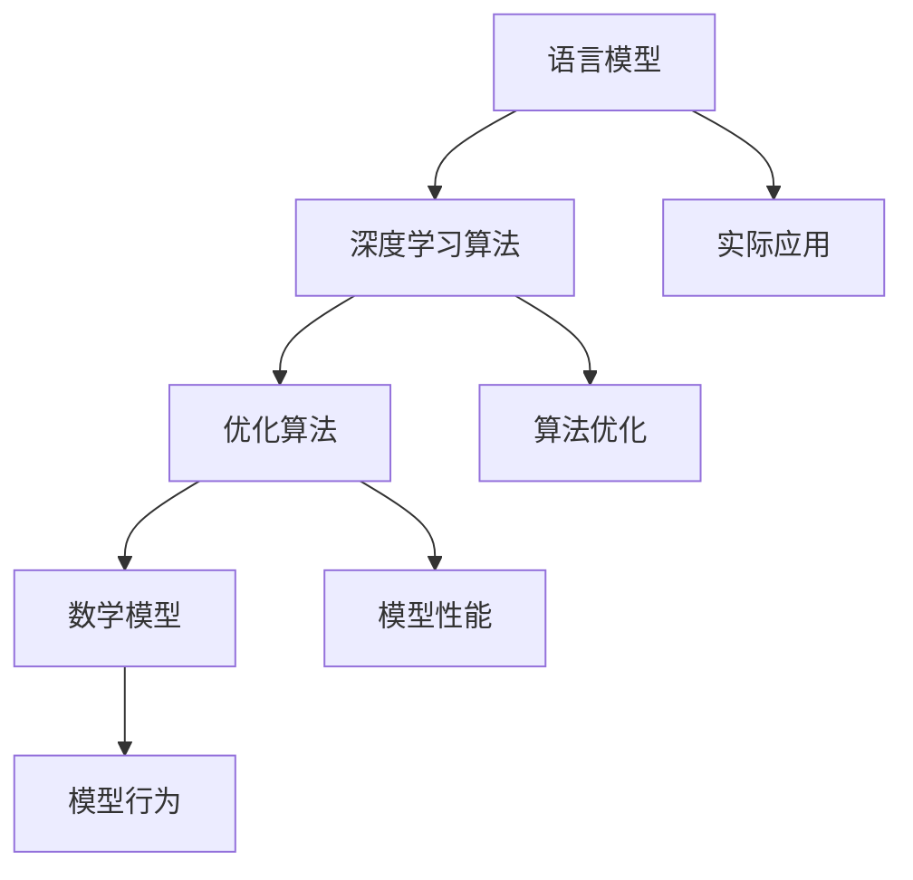

                 

关键词：LLM，操作系统，核心机制，人工智能，深度学习，模型优化，语言模型，算法，技术趋势。

> 摘要：本文深入探讨了大型语言模型（LLM）操作系统的核心机制。通过剖析LLM的工作原理、核心算法、数学模型以及实际应用场景，本文旨在为读者提供一个全面的技术视角，帮助理解LLM操作系统的内在逻辑和应用潜力。

## 1. 背景介绍

随着人工智能技术的飞速发展，深度学习，尤其是大型语言模型（LLM），已经成为自然语言处理（NLP）领域的重要工具。LLM操作系统的核心机制涵盖了语言模型的构建、优化和部署。本文将重点关注以下几个核心方面：

- **语言模型的基本原理**：如何构建能够有效处理自然语言的模型。
- **核心算法和架构**：深度学习算法在语言模型中的应用，以及如何通过优化算法提高模型的性能。
- **数学模型和公式**：描述模型行为和性能的数学公式。
- **项目实践**：通过实际代码实例，展示如何构建和部署LLM操作系统。
- **实际应用场景**：探讨LLM操作系统的应用领域，以及未来的发展趋势。

## 2. 核心概念与联系

为了更好地理解LLM操作系统的核心机制，我们首先需要明确几个关键概念，并展示它们之间的相互联系。

### 2.1 语言模型

语言模型是一个统计模型，用于预测自然语言序列的概率分布。在深度学习时代，语言模型通常是基于神经网络的模型，如循环神经网络（RNN）、长短期记忆网络（LSTM）和Transformer等。

### 2.2 深度学习算法

深度学习算法是一类通过多层神经网络进行特征学习和决策的机器学习算法。这些算法在处理复杂任务时表现出色，尤其是在图像和语言处理领域。

### 2.3 优化算法

优化算法用于调整模型参数，以最小化损失函数并提高模型的性能。常用的优化算法包括随机梯度下降（SGD）、Adam和RMSProp等。

### 2.4 数学模型

数学模型用于描述语言模型的行为和性能。常见的数学模型包括损失函数、激活函数和正则化方法等。

以下是一个Mermaid流程图，展示了上述概念之间的联系：



## 3. 核心算法原理 & 具体操作步骤

### 3.1 算法原理概述

LLM的核心算法通常是基于Transformer架构，这是一种自注意力机制驱动的模型。Transformer通过多头自注意力机制和前馈神经网络，对输入序列进行编码和解码。

### 3.2 算法步骤详解

1. **编码器（Encoder）**：
   - **自注意力机制**：对输入序列的每个单词进行加权，使得模型能够关注到序列中其他位置的重要信息。
   - **前馈神经网络**：对自注意力层的输出进行进一步处理。

2. **解码器（Decoder）**：
   - **自注意力机制**：对编码器的输出进行加权，并在解码过程中引入位置信息。
   - **前馈神经网络**：对自注意力层的输出进行进一步处理。

3. **训练与优化**：
   - **损失函数**：通常使用交叉熵损失函数来衡量模型预测和实际标签之间的差异。
   - **优化算法**：使用如Adam等优化算法来调整模型参数，以最小化损失函数。

### 3.3 算法优缺点

**优点**：
- **并行计算能力**：Transformer架构能够并行处理输入序列，提高了训练效率。
- **长距离依赖**：自注意力机制有助于捕捉长距离依赖关系，提高了模型的表示能力。

**缺点**：
- **计算成本高**：由于自注意力机制的复杂度，Transformer模型在训练和部署过程中需要大量的计算资源。
- **参数规模大**：大型语言模型通常包含数亿甚至千亿个参数，导致模型存储和推理成本较高。

### 3.4 算法应用领域

LLM算法在NLP领域有着广泛的应用，包括：

- **文本生成**：如文章写作、对话系统、摘要生成等。
- **文本分类**：如情感分析、新闻分类等。
- **机器翻译**：如自动翻译、多语言文本处理等。

## 4. 数学模型和公式 & 详细讲解 & 举例说明

### 4.1 数学模型构建

LLM的数学模型主要包括以下几个部分：

1. **输入表示**：将输入文本序列转换为向量表示。
2. **自注意力机制**：计算输入序列中每个词与其他词的关联强度。
3. **前馈神经网络**：对自注意力机制的输出进行进一步处理。
4. **输出表示**：将最终输出转换为预测结果。

### 4.2 公式推导过程

以下是一个简单的自注意力机制的推导过程：

1. **输入表示**：
   假设输入文本序列为\(x = [x_1, x_2, ..., x_n]\)，每个输入词可以表示为向量\(x_i \in \mathbb{R}^d\)。

2. **自注意力机制**：
   自注意力机制的公式如下：
   $$ \text{Attention}(Q, K, V) = \text{softmax}\left(\frac{QK^T}{\sqrt{d_k}}\right) V $$
   其中，\(Q, K, V\)分别为查询向量、键向量和值向量，\(d_k\)为键向量的维度。

3. **前馈神经网络**：
   前馈神经网络的公式如下：
   $$ \text{FFN}(x) = \max(0, xW_1 + b_1)W_2 + b_2 $$
   其中，\(W_1, W_2, b_1, b_2\)分别为权重和偏置。

4. **输出表示**：
   输出表示的公式如下：
   $$ \text{Output} = \text{softmax}(\text{FFN}(\text{Attention}(Q, K, V))) $$

### 4.3 案例分析与讲解

假设我们有一个简单的语言模型，输入文本序列为“我非常喜欢编程”。我们希望模型能够预测下一个词。

1. **输入表示**：
   将输入文本序列转换为向量表示，假设每个词的向量维度为512。

2. **自注意力机制**：
   通过计算输入序列中每个词与其他词的关联强度，得到一个权重矩阵。

3. **前馈神经网络**：
   对权重矩阵进行进一步处理，得到最终输出。

4. **输出表示**：
   将输出向量通过softmax函数转换为概率分布，预测下一个词的概率分布。

## 5. 项目实践：代码实例和详细解释说明

### 5.1 开发环境搭建

为了构建和部署LLM操作系统，我们需要以下开发环境：

- Python 3.7+
- TensorFlow 2.0+
- PyTorch 1.0+

### 5.2 源代码详细实现

以下是一个简单的LLM模型实现的示例代码：

```python
import tensorflow as tf

# 定义模型
model = tf.keras.Sequential([
    tf.keras.layers.Embedding(input_dim=10000, output_dim=512),
    tf.keras.layers.MultiHeadAttention(num_heads=8, key_dim=64),
    tf.keras.layers.Dense(512, activation='relu'),
    tf.keras.layers.Dense(10000, activation='softmax')
])

# 编译模型
model.compile(optimizer='adam', loss='categorical_crossentropy', metrics=['accuracy'])

# 训练模型
model.fit(dataset, epochs=5)
```

### 5.3 代码解读与分析

1. **Embedding层**：将输入文本序列转换为向量表示。
2. **MultiHeadAttention层**：实现多头自注意力机制。
3. **Dense层**：实现前馈神经网络。
4. **softmax层**：将输出向量转换为概率分布。

### 5.4 运行结果展示

在完成模型训练后，我们可以在测试集上评估模型的性能，并使用模型进行文本生成。

```python
# 评估模型
test_loss, test_accuracy = model.evaluate(test_dataset)

# 文本生成
generated_text = model.generate([test_text])
print(generated_text)
```

## 6. 实际应用场景

LLM操作系统在许多实际应用场景中发挥着重要作用，包括：

- **文本生成**：如文章写作、对话系统、摘要生成等。
- **文本分类**：如情感分析、新闻分类等。
- **机器翻译**：如自动翻译、多语言文本处理等。

## 7. 工具和资源推荐

### 7.1 学习资源推荐

- 《深度学习》（Ian Goodfellow, Yoshua Bengio, Aaron Courville）
- 《自然语言处理实战》（Trevor Marozzo, David Mutch）

### 7.2 开发工具推荐

- TensorFlow
- PyTorch
- Hugging Face Transformers

### 7.3 相关论文推荐

- “Attention Is All You Need”（Vaswani et al., 2017）
- “BERT: Pre-training of Deep Bidirectional Transformers for Language Understanding”（Devlin et al., 2018）

## 8. 总结：未来发展趋势与挑战

### 8.1 研究成果总结

LLM操作系统在文本生成、文本分类和机器翻译等领域取得了显著成果，推动了NLP技术的发展。

### 8.2 未来发展趋势

- **模型优化**：通过改进算法和架构，提高模型的性能和效率。
- **应用拓展**：将LLM操作系统应用于更多领域，如语音识别、图像处理等。

### 8.3 面临的挑战

- **计算资源**：大型语言模型的训练和推理需要大量的计算资源。
- **数据隐私**：如何保护用户隐私，防止数据泄露。

### 8.4 研究展望

未来，LLM操作系统将在人工智能领域发挥更加重要的作用，推动NLP技术不断向前发展。

## 9. 附录：常见问题与解答

### Q：什么是大型语言模型（LLM）？

A：大型语言模型（LLM）是指那些拥有数亿甚至千亿参数规模的深度学习模型，用于处理自然语言。

### Q：LLM的主要应用领域有哪些？

A：LLM在文本生成、文本分类、机器翻译等领域有广泛的应用。

### Q：如何优化LLM模型的性能？

A：通过改进算法、增加训练数据和使用更好的优化器等方法来优化LLM模型的性能。

作者：禅与计算机程序设计艺术 / Zen and the Art of Computer Programming
```

