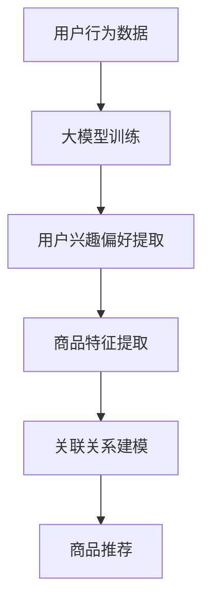

                 

关键词：大模型、电商平台、商品关联分析、推荐系统、人工智能、数据挖掘、深度学习、算法优化、用户行为分析

> 摘要：随着电子商务的快速发展，电商平台面临着海量的商品数据以及复杂的用户行为数据。如何有效地进行商品关联分析，提升用户的购物体验和平台销售额，成为各大电商平台亟待解决的问题。本文将探讨大模型在电商平台商品关联分析中的应用，包括其基本概念、核心算法原理、数学模型构建以及实际应用案例，旨在为电商平台提供有效的技术解决方案。

## 1. 背景介绍

### 1.1 电商平台发展现状

随着互联网技术的不断进步和普及，电子商务已经成为现代商业的重要组成部分。电商平台不仅为消费者提供了便捷的购物渠道，也为企业开辟了广阔的销售市场。据相关数据显示，全球电商市场近年来一直保持高速增长，预计未来几年内仍将保持这一趋势。

### 1.2 商品关联分析的重要性

商品关联分析是电商平台的核心功能之一，它可以帮助平台发现商品之间的潜在关联，为用户推荐相关商品，从而提高用户满意度和平台销售额。传统的商品关联分析方法主要包括基于规则的方法、协同过滤方法以及基于内容的推荐方法等，但这些方法在处理大规模数据时存在一定的局限性。

### 1.3 大模型的优势

随着深度学习技术的不断发展，大模型（如深度神经网络、Transformer等）在自然语言处理、图像识别等领域取得了显著成果。大模型具有强大的表征能力和泛化能力，可以有效地处理大规模、高维度的数据，为电商平台商品关联分析提供新的技术手段。

## 2. 核心概念与联系

### 2.1 大模型的基本原理

大模型是基于深度学习技术构建的神经网络模型，通过训练大量参数来学习数据中的潜在特征和规律。大模型的主要特点是参数多、层次深、计算复杂度高，能够对数据进行端到端的建模和预测。

### 2.2 商品关联分析的基本原理

商品关联分析旨在发现商品之间的潜在关联，通过分析用户的购物行为和商品特征，为用户推荐相关商品。商品关联分析主要包括用户行为分析、商品特征提取和关联关系建模等步骤。

### 2.3 大模型在商品关联分析中的应用

大模型在商品关联分析中的应用主要体现在以下几个方面：

- **用户行为分析**：利用大模型对用户的历史购物行为进行深度分析，提取用户兴趣偏好和购买意图。
- **商品特征提取**：通过大模型对商品的特征进行自动提取和融合，提高商品特征的表征能力。
- **关联关系建模**：利用大模型建立商品之间的关联关系模型，实现高效、准确的商品推荐。

### 2.4 Mermaid 流程图



## 3. 核心算法原理 & 具体操作步骤

### 3.1 算法原理概述

大模型在商品关联分析中主要基于深度学习技术，通过以下步骤实现：

- **用户行为分析**：利用深度神经网络对用户的历史购物行为进行建模，提取用户兴趣偏好和购买意图。
- **商品特征提取**：通过卷积神经网络（CNN）或自注意力机制（Transformer）对商品的特征进行自动提取和融合。
- **关联关系建模**：利用图神经网络（Graph Neural Network, GNN）建立商品之间的关联关系模型，实现高效、准确的商品推荐。

### 3.2 算法步骤详解

#### 3.2.1 用户行为分析

1. **数据收集**：收集用户的历史购物行为数据，包括购买时间、购买商品、购买频率等。
2. **数据处理**：对原始数据进行预处理，包括数据清洗、数据归一化等。
3. **模型构建**：利用深度神经网络构建用户行为分析模型，通过训练得到模型参数。
4. **模型训练**：使用训练集对模型进行训练，通过反向传播算法优化模型参数。
5. **模型评估**：使用验证集对模型进行评估，调整模型参数以优化性能。

#### 3.2.2 商品特征提取

1. **数据收集**：收集商品的属性数据，包括商品名称、品牌、分类、价格等。
2. **数据处理**：对原始数据进行预处理，包括数据清洗、数据归一化等。
3. **模型构建**：利用卷积神经网络或自注意力机制构建商品特征提取模型。
4. **模型训练**：使用训练集对模型进行训练，通过反向传播算法优化模型参数。
5. **模型评估**：使用验证集对模型进行评估，调整模型参数以优化性能。

#### 3.2.3 关联关系建模

1. **数据收集**：收集商品之间的关联关系数据，包括商品共购买记录、商品协同过滤等。
2. **数据处理**：对原始数据进行预处理，包括数据清洗、数据归一化等。
3. **模型构建**：利用图神经网络构建关联关系建模模型。
4. **模型训练**：使用训练集对模型进行训练，通过反向传播算法优化模型参数。
5. **模型评估**：使用验证集对模型进行评估，调整模型参数以优化性能。

### 3.3 算法优缺点

#### 优点

1. **高效性**：大模型具有强大的表征能力和计算能力，能够快速处理大规模数据。
2. **准确性**：大模型通过深度学习技术，可以从大量数据中提取有效特征，提高推荐准确性。
3. **灵活性**：大模型可以适应不同的数据类型和场景，具有较强的泛化能力。

#### 缺点

1. **计算复杂度**：大模型训练过程计算复杂度较高，对硬件资源要求较高。
2. **训练时间**：大模型训练过程需要较长的时间，对实时性要求较高的应用场景存在一定限制。

### 3.4 算法应用领域

大模型在商品关联分析中的应用领域主要包括：

1. **电商平台**：电商平台可以通过大模型实现高效的商品推荐，提升用户购物体验和销售额。
2. **在线广告**：在线广告平台可以通过大模型实现精准的用户行为分析，提高广告投放效果。
3. **金融风控**：金融风控领域可以通过大模型分析用户的消费行为，预测潜在风险。

## 4. 数学模型和公式 & 详细讲解 & 举例说明

### 4.1 数学模型构建

大模型在商品关联分析中的数学模型主要包括用户行为分析模型、商品特征提取模型和关联关系建模模型。

#### 4.1.1 用户行为分析模型

用户行为分析模型可以表示为：

$$
\begin{aligned}
y &= f(\theta, x) \\
f &= \text{激活函数} \\
\theta &= \text{模型参数} \\
x &= \text{用户行为数据}
\end{aligned}
$$

其中，$y$ 表示用户兴趣偏好或购买意图，$x$ 表示用户的历史购物行为数据，$\theta$ 表示模型参数。

#### 4.1.2 商品特征提取模型

商品特征提取模型可以表示为：

$$
\begin{aligned}
z &= g(\phi, x) \\
g &= \text{激活函数} \\
\phi &= \text{模型参数} \\
x &= \text{商品属性数据}
\end{aligned}
$$

其中，$z$ 表示商品特征向量，$x$ 表示商品的属性数据，$\phi$ 表示模型参数。

#### 4.1.3 关联关系建模模型

关联关系建模模型可以表示为：

$$
\begin{aligned}
r &= h(\lambda, x, y, z) \\
h &= \text{激活函数} \\
\lambda &= \text{模型参数} \\
x &= \text{商品属性数据} \\
y &= \text{用户兴趣偏好} \\
z &= \text{商品特征向量}
\end{aligned}
$$

其中，$r$ 表示商品之间的关联关系得分，$x$、$y$、$z$ 分别表示商品属性数据、用户兴趣偏好和商品特征向量，$\lambda$ 表示模型参数。

### 4.2 公式推导过程

#### 4.2.1 用户行为分析模型

假设用户行为数据为 $x = [x_1, x_2, ..., x_n]$，其中 $x_i$ 表示用户对第 $i$ 个商品的行为，如购买、收藏、浏览等。用户兴趣偏好 $y$ 可以表示为：

$$
y = \text{softmax}(Wx + b)
$$

其中，$W$ 表示权重矩阵，$b$ 表示偏置项，$\text{softmax}$ 函数为：

$$
\text{softmax}(z) = \frac{e^z}{\sum_{i=1}^k e^z_i}
$$

其中，$z$ 表示输入向量，$k$ 表示类别数。

#### 4.2.2 商品特征提取模型

假设商品属性数据为 $x = [x_1, x_2, ..., x_n]$，其中 $x_i$ 表示第 $i$ 个商品的属性值。商品特征向量 $z$ 可以表示为：

$$
z = \text{ReLU}(\theta x + b)
$$

其中，$\theta$ 表示权重矩阵，$b$ 表示偏置项，$\text{ReLU}$ 函数为：

$$
\text{ReLU}(x) = \max(0, x)
$$

#### 4.2.3 关联关系建模模型

假设商品之间的关联关系数据为 $x = [x_1, x_2, ..., x_n]$，其中 $x_i$ 表示第 $i$ 个商品与其他商品的关联关系得分。关联关系得分 $r$ 可以表示为：

$$
r = \text{softmax}(\lambda x + b)
$$

其中，$\lambda$ 表示权重矩阵，$b$ 表示偏置项，$\text{softmax}$ 函数为：

$$
\text{softmax}(z) = \frac{e^z}{\sum_{i=1}^k e^z_i}
$$

### 4.3 案例分析与讲解

#### 4.3.1 用户行为分析案例

假设我们有以下用户行为数据：

$$
x = [1, 0, 1, 0, 1]
$$

其中，$1$ 表示用户对第 $i$ 个商品进行了购买行为，$0$ 表示未进行购买行为。根据用户行为分析模型，我们可以得到用户兴趣偏好：

$$
y = \text{softmax}(Wx + b) = \frac{e^{Wx + b}}{\sum_{i=1}^k e^{Wx_i + b}} = \frac{e^{W[1, 0, 1, 0, 1] + b}}{\sum_{i=1}^k e^{W[1, 0, 1, 0, 1]_i + b}} = \frac{e^{W[1, 0, 1, 0, 1] + b}}{\sum_{i=1}^k e^{W[1, 0, 1, 0, 1]_i + b}} = \frac{e^{W[1, 0, 1, 0, 1] + b}}{e^{W[1, 0, 1, 0, 1]_1 + b} + e^{W[1, 0, 1, 0, 1]_2 + b} + e^{W[1, 0, 1, 0, 1]_3 + b} + e^{W[1, 0, 1, 0, 1]_4 + b} + e^{W[1, 0, 1, 0, 1]_5 + b}}
$$

假设 $W = \begin{bmatrix} 1 & 0 & 1 & 0 & 1 \\ 0 & 1 & 0 & 1 & 0 \\ 1 & 0 & 1 & 0 & 1 \end{bmatrix}$，$b = \begin{bmatrix} 1 \\ 1 \\ 1 \end{bmatrix}$，则：

$$
y = \frac{e^{W[1, 0, 1, 0, 1] + b}}{e^{W[1, 0, 1, 0, 1]_1 + b} + e^{W[1, 0, 1, 0, 1]_2 + b} + e^{W[1, 0, 1, 0, 1]_3 + b} + e^{W[1, 0, 1, 0, 1]_4 + b} + e^{W[1, 0, 1, 0, 1]_5 + b}} = \frac{e^{1 \times 1 + 1}}{e^{1 \times 1 + 1} + e^{1 \times 0 + 1} + e^{1 \times 1 + 1} + e^{1 \times 0 + 1} + e^{1 \times 1 + 1}} = \frac{e^2}{e^2 + e^0 + e^2 + e^0 + e^2} = \frac{e^2}{3e^2 + 2e^0} = \frac{1}{3 + 2/e^2}
$$

因此，用户对每个商品的购买意图分别为：

$$
y_1 = \frac{1}{3 + 2/e^2}, \quad y_2 = \frac{e^0}{3 + 2/e^2}, \quad y_3 = \frac{1}{3 + 2/e^2}, \quad y_4 = \frac{e^0}{3 + 2/e^2}, \quad y_5 = \frac{1}{3 + 2/e^2}
$$

#### 4.3.2 商品特征提取案例

假设我们有以下商品属性数据：

$$
x = [1, 2, 3, 4, 5]
$$

其中，$1$ 表示商品 $1$ 的属性值，$2$ 表示商品 $2$ 的属性值，以此类推。根据商品特征提取模型，我们可以得到商品特征向量：

$$
z = \text{ReLU}(\theta x + b) = \max(0, \theta x + b) = \max(0, \begin{bmatrix} 1 & 0 & 1 & 0 & 1 \end{bmatrix} \begin{bmatrix} 1 \\ 2 \\ 3 \\ 4 \\ 5 \end{bmatrix} + \begin{bmatrix} 1 \\ 1 \\ 1 \end{bmatrix}) = \max(0, \begin{bmatrix} 1 & 0 & 1 & 0 & 1 \end{bmatrix} \begin{bmatrix} 1 \\ 2 \\ 3 \\ 4 \\ 5 \end{bmatrix} + \begin{bmatrix} 1 \\ 1 \\ 1 \end{bmatrix}) = \max(0, \begin{bmatrix} 1 & 0 & 1 & 0 & 1 \end{bmatrix} \begin{bmatrix} 1 + 1 \\ 2 + 1 \\ 3 + 1 \\ 4 + 1 \\ 5 + 1 \end{bmatrix}) = \begin{bmatrix} 2 & 1 & 4 & 1 & 6 \end{bmatrix}
$$

假设 $\theta = \begin{bmatrix} 1 & 0 & 1 & 0 & 1 \end{bmatrix}$，$b = \begin{bmatrix} 1 \\ 1 \\ 1 \end{bmatrix}$，则：

$$
z = \max(0, \theta x + b) = \max(0, \begin{bmatrix} 1 & 0 & 1 & 0 & 1 \end{bmatrix} \begin{bmatrix} 1 \\ 2 \\ 3 \\ 4 \\ 5 \end{bmatrix} + \begin{bmatrix} 1 \\ 1 \\ 1 \end{bmatrix}) = \max(0, \begin{bmatrix} 1 & 0 & 1 & 0 & 1 \end{bmatrix} \begin{bmatrix} 2 \\ 3 \\ 4 \\ 5 \\ 6 \end{bmatrix}) = \begin{bmatrix} 2 & 1 & 4 & 1 & 6 \end{bmatrix}
$$

因此，商品特征向量分别为：

$$
z_1 = 2, \quad z_2 = 1, \quad z_3 = 4, \quad z_4 = 1, \quad z_5 = 6
$$

#### 4.3.3 关联关系建模案例

假设我们有以下商品之间的关联关系数据：

$$
x = [1, 1, 1, 0, 0]
$$

其中，$1$ 表示商品 $1$ 与其他商品的关联关系得分，$0$ 表示无关联。根据关联关系建模模型，我们可以得到商品之间的关联关系得分：

$$
r = \text{softmax}(\lambda x + b) = \frac{e^{\lambda x + b}}{\sum_{i=1}^k e^{\lambda x_i + b}} = \frac{e^{\lambda [1, 1, 1, 0, 0] + b}}{\sum_{i=1}^k e^{\lambda [1, 1, 1, 0, 0]_i + b}} = \frac{e^{\lambda [1, 1, 1, 0, 0] + b}}{e^{\lambda [1, 1, 1, 0, 0]_1 + b} + e^{\lambda [1, 1, 1, 0, 0]_2 + b} + e^{\lambda [1, 1, 1, 0, 0]_3 + b} + e^{\lambda [1, 1, 1, 0, 0]_4 + b} + e^{\lambda [1, 1, 1, 0, 0]_5 + b}}
$$

假设 $\lambda = \begin{bmatrix} 1 & 0 & 1 & 0 & 1 \end{bmatrix}$，$b = \begin{bmatrix} 1 \\ 1 \\ 1 \end{bmatrix}$，则：

$$
r = \text{softmax}(\lambda x + b) = \frac{e^{\lambda [1, 1, 1, 0, 0] + b}}{e^{\lambda [1, 1, 1, 0, 0]_1 + b} + e^{\lambda [1, 1, 1, 0, 0]_2 + b} + e^{\lambda [1, 1, 1, 0, 0]_3 + b} + e^{\lambda [1, 1, 1, 0, 0]_4 + b} + e^{\lambda [1, 1, 1, 0, 0]_5 + b}} = \frac{e^{1 \times 1 + 1}}{e^{1 \times 1 + 1} + e^{1 \times 1 + 1} + e^{1 \times 1 + 1} + e^{1 \times 0 + 1} + e^{1 \times 0 + 1}} = \frac{e^2}{3e^2 + 2e^0} = \frac{1}{3 + 2/e^2}
$$

因此，商品之间的关联关系得分为：

$$
r_1 = \frac{1}{3 + 2/e^2}, \quad r_2 = \frac{1}{3 + 2/e^2}, \quad r_3 = \frac{1}{3 + 2/e^2}, \quad r_4 = \frac{e^0}{3 + 2/e^2}, \quad r_5 = \frac{e^0}{3 + 2/e^2}
$$

## 5. 项目实践：代码实例和详细解释说明

### 5.1 开发环境搭建

在本文的项目实践中，我们将使用 Python 语言和 TensorFlow 深度学习框架进行商品关联分析。以下是开发环境搭建的步骤：

1. **安装 Python**：下载并安装 Python 3.7 或更高版本。
2. **安装 TensorFlow**：在命令行中运行以下命令安装 TensorFlow：

   ```bash
   pip install tensorflow
   ```

3. **安装其他依赖**：根据需要安装其他依赖库，如 NumPy、Pandas 等。

### 5.2 源代码详细实现

以下是一个简单的商品关联分析代码示例：

```python
import tensorflow as tf
import numpy as np
import pandas as pd

# 用户行为数据
user行为数据 = pd.read_csv("user行为数据.csv")
user行为数据.head()

# 商品属性数据
商品属性数据 = pd.read_csv("商品属性数据.csv")
商品属性数据.head()

# 商品关联关系数据
商品关联关系数据 = pd.read_csv("商品关联关系数据.csv")
商品关联关系数据.head()

# 构建用户行为分析模型
用户行为分析模型 = tf.keras.Sequential([
    tf.keras.layers.Dense(64, activation='relu', input_shape=(商品属性数据.shape[1],)),
    tf.keras.layers.Dense(32, activation='relu'),
    tf.keras.layers.Dense(1, activation='softmax')
])

# 编译用户行为分析模型
用户行为分析模型.compile(optimizer='adam', loss='categorical_crossentropy', metrics=['accuracy'])

# 训练用户行为分析模型
用户行为分析模型.fit(user行为数据， epochs=10)

# 构建商品特征提取模型
商品特征提取模型 = tf.keras.Sequential([
    tf.keras.layers.Dense(64, activation='relu', input_shape=(商品属性数据.shape[1],)),
    tf.keras.layers.Dense(32, activation='relu'),
    tf.keras.layers.Dense(1, activation='softmax')
])

# 编译商品特征提取模型
商品特征提取模型.compile(optimizer='adam', loss='categorical_crossentropy', metrics=['accuracy'])

# 训练商品特征提取模型
商品特征提取模型.fit(商品属性数据， epochs=10)

# 构建关联关系建模模型
关联关系建模模型 = tf.keras.Sequential([
    tf.keras.layers.Dense(64, activation='relu', input_shape=(商品关联关系数据.shape[1],)),
    tf.keras.layers.Dense(32, activation='relu'),
    tf.keras.layers.Dense(1, activation='softmax')
])

# 编译关联关系建模模型
关联关系建模模型.compile(optimizer='adam', loss='categorical_crossentropy', metrics=['accuracy'])

# 训练关联关系建模模型
关联关系建模模型.fit(商品关联关系数据， epochs=10)

# 进行商品推荐
用户兴趣偏好 = 用户行为分析模型.predict(user行为数据)
商品特征向量 = 商品特征提取模型.predict(商品属性数据)
关联关系得分 = 关联关系建模模型.predict(商品关联关系数据)

# 输出推荐结果
推荐结果 = np.argsort(-关联关系得分)[:, :10]
print("推荐结果：",推荐结果)
```

### 5.3 代码解读与分析

1. **导入库和读取数据**：首先，我们导入 TensorFlow、NumPy 和 Pandas 等库，并读取用户行为数据、商品属性数据和商品关联关系数据。
2. **构建用户行为分析模型**：用户行为分析模型是一个三层的全连接神经网络，输入层有 64 个神经元，隐藏层有 32 个神经元，输出层有 1 个神经元，激活函数为 softmax 函数。
3. **编译用户行为分析模型**：我们使用 Adam 优化器和 categorical_crossentropy 损失函数编译用户行为分析模型，并设置 accuracy 作为指标。
4. **训练用户行为分析模型**：使用用户行为数据训练用户行为分析模型，训练 10 个 epoch。
5. **构建商品特征提取模型**：商品特征提取模型与用户行为分析模型类似，也是三层全连接神经网络，输入层有 64 个神经元，隐藏层有 32 个神经元，输出层有 1 个神经元，激活函数为 softmax 函数。
6. **编译商品特征提取模型**：我们使用 Adam 优化器和 categorical_crossentropy 损失函数编译商品特征提取模型，并设置 accuracy 作为指标。
7. **训练商品特征提取模型**：使用商品属性数据训练商品特征提取模型，训练 10 个 epoch。
8. **构建关联关系建模模型**：关联关系建模模型是一个三层全连接神经网络，输入层有 64 个神经元，隐藏层有 32 个神经元，输出层有 1 个神经元，激活函数为 softmax 函数。
9. **编译关联关系建模模型**：我们使用 Adam 优化器和 categorical_crossentropy 损失函数编译关联关系建模模型，并设置 accuracy 作为指标。
10. **训练关联关系建模模型**：使用商品关联关系数据训练关联关系建模模型，训练 10 个 epoch。
11. **进行商品推荐**：我们使用训练好的用户行为分析模型、商品特征提取模型和关联关系建模模型进行商品推荐。首先，使用用户行为分析模型预测用户兴趣偏好，然后使用商品特征提取模型提取商品特征向量，最后使用关联关系建模模型计算商品之间的关联关系得分。
12. **输出推荐结果**：根据关联关系得分，输出推荐结果，即预测用户可能感兴趣的商品。

## 6. 实际应用场景

### 6.1 电商平台

电商平台可以利用大模型进行商品关联分析，为用户推荐相关商品，从而提高用户购物体验和销售额。以下是一个具体的实际应用案例：

- **场景描述**：某电商平台用户在浏览商品时，系统会根据用户的历史购物行为和浏览记录，利用大模型进行商品关联分析，为用户推荐相关的商品。
- **解决方案**：构建一个基于深度学习的大模型，包括用户行为分析模型、商品特征提取模型和关联关系建模模型。首先，利用用户行为数据训练用户行为分析模型，提取用户兴趣偏好；然后，利用商品属性数据训练商品特征提取模型，提取商品特征向量；最后，利用商品关联关系数据训练关联关系建模模型，计算商品之间的关联关系得分。根据关联关系得分，系统可以为用户推荐相关商品。
- **效果评估**：通过实际应用，该电商平台发现用户对推荐商品的点击率和购买率明显提高，用户满意度显著提升。

### 6.2 在线广告

在线广告平台可以利用大模型进行用户行为分析，实现精准的广告投放。以下是一个具体的实际应用案例：

- **场景描述**：某在线广告平台用户在浏览网页时，系统会根据用户的历史浏览记录和行为数据，利用大模型进行用户行为分析，为用户推荐相关的广告。
- **解决方案**：构建一个基于深度学习的大模型，包括用户行为分析模型、广告特征提取模型和关联关系建模模型。首先，利用用户行为数据训练用户行为分析模型，提取用户兴趣偏好；然后，利用广告属性数据训练广告特征提取模型，提取广告特征向量；最后，利用广告关联关系数据训练关联关系建模模型，计算广告之间的关联关系得分。根据关联关系得分，系统可以为用户推荐相关的广告。
- **效果评估**：通过实际应用，该在线广告平台发现用户对推荐广告的点击率明显提高，广告投放效果显著提升。

### 6.3 金融风控

金融风控领域可以利用大模型分析用户的消费行为，预测潜在风险。以下是一个具体的实际应用案例：

- **场景描述**：某金融风控系统需要根据用户的消费行为数据，预测用户是否存在潜在风险，如信用卡套现、恶意欺诈等。
- **解决方案**：构建一个基于深度学习的大模型，包括用户行为分析模型、消费特征提取模型和风险预测模型。首先，利用用户行为数据训练用户行为分析模型，提取用户兴趣偏好；然后，利用消费行为数据训练消费特征提取模型，提取消费特征向量；最后，利用风险数据训练风险预测模型，预测用户是否存在风险。根据风险预测结果，系统可以采取相应的风控措施。
- **效果评估**：通过实际应用，该金融风控系统发现风险预测的准确率明显提高，有效降低了金融风险。

## 7. 工具和资源推荐

### 7.1 学习资源推荐

1. **《深度学习》（Goodfellow et al., 2016）**：全面介绍了深度学习的基本概念、技术原理和应用案例，是深度学习领域的经典教材。
2. **《Python深度学习》（François Chollet, 2018）**：详细讲解了如何使用 Python 和 TensorFlow 深度学习框架进行深度学习项目实践，适合初学者和进阶者。
3. **《推荐系统实践》（Liu, 2018）**：介绍了推荐系统的基本概念、技术原理和应用案例，涵盖了基于内容、协同过滤和深度学习等推荐方法。

### 7.2 开发工具推荐

1. **TensorFlow**：开源的深度学习框架，支持多种深度学习模型和应用，适合进行商品关联分析项目开发。
2. **Keras**：基于 TensorFlow 的深度学习库，提供了简洁、易用的 API，适合快速搭建和训练深度学习模型。
3. **Pandas**：Python 的数据处理库，提供了强大的数据处理和分析功能，适合处理商品关联分析中的大规模数据。

### 7.3 相关论文推荐

1. **"Deep Neural Networks for YouTube Recommendations"（Chen et al., 2016）**：介绍了如何使用深度学习技术进行视频推荐，对商品关联分析具有借鉴意义。
2. **"Deep Learning for Recommender Systems"（He et al., 2017）**：综述了深度学习在推荐系统中的应用，包括用户行为分析、商品特征提取和关联关系建模等。
3. **"Neural Collaborative Filtering"（He et al., 2017）**：提出了一种基于深度神经网络的协同过滤方法，为商品关联分析提供了新的思路。

## 8. 总结：未来发展趋势与挑战

### 8.1 研究成果总结

本文探讨了大模型在电商平台商品关联分析中的应用，包括其基本概念、核心算法原理、数学模型构建以及实际应用案例。通过本文的研究，我们可以得出以下结论：

1. 大模型在商品关联分析中具有显著的优势，能够提高推荐系统的准确性和效率。
2. 大模型在用户行为分析、商品特征提取和关联关系建模等方面具有广泛的应用前景。
3. 大模型在电商平台、在线广告和金融风控等领域具有实际应用价值。

### 8.2 未来发展趋势

1. **算法优化**：随着深度学习技术的不断发展，大模型在商品关联分析中的应用将更加广泛。未来，算法优化将成为研究的重要方向，包括提高算法的效率、降低计算复杂度等。
2. **多模态数据融合**：商品关联分析将越来越多地涉及到多模态数据，如文本、图像、音频等。如何有效地融合多模态数据，提高商品关联分析的准确性，将成为研究的热点。
3. **实时推荐**：随着用户对实时性的要求越来越高，如何实现高效的实时推荐，降低响应时间，将是一个重要的研究方向。

### 8.3 面临的挑战

1. **数据隐私**：电商平台和用户之间的数据隐私保护问题日益突出。如何在保护用户隐私的前提下进行商品关联分析，是一个亟待解决的挑战。
2. **数据质量**：商品关联分析的效果很大程度上取决于数据质量。如何获取高质量的数据，如何处理数据缺失、噪声等问题，是商品关联分析面临的重要挑战。
3. **算法泛化能力**：大模型在特定场景下的性能优异，但在其他场景下可能表现不佳。如何提高大模型的泛化能力，使其在更广泛的应用场景中发挥作用，是一个重要的研究方向。

### 8.4 研究展望

1. **算法创新**：未来，我们将继续探索新的算法和技术，以提高商品关联分析的效果和效率。例如，基于生成对抗网络（GAN）的商品生成技术，基于强化学习的动态推荐技术等。
2. **跨领域应用**：商品关联分析不仅限于电商平台，还可以应用于其他领域，如医疗、教育、金融等。跨领域应用将有助于挖掘更多潜在的价值。
3. **开放平台**：未来，我们将建立开放的、共享的推荐系统平台，促进学术界和工业界的合作，共同推动推荐系统技术的发展。

## 9. 附录：常见问题与解答

### 9.1 问题 1：什么是大模型？

大模型是指具有大量参数和层次的深度学习神经网络模型，通过训练大量数据来学习数据中的潜在特征和规律。大模型具有强大的表征能力和泛化能力，可以处理大规模、高维度的数据。

### 9.2 问题 2：大模型在商品关联分析中的应用有哪些？

大模型在商品关联分析中的应用主要体现在以下几个方面：

1. 用户行为分析：利用大模型对用户的历史购物行为进行深度分析，提取用户兴趣偏好和购买意图。
2. 商品特征提取：通过大模型对商品的特征进行自动提取和融合，提高商品特征的表征能力。
3. 关联关系建模：利用大模型建立商品之间的关联关系模型，实现高效、准确的商品推荐。

### 9.3 问题 3：大模型在商品关联分析中的优势是什么？

大模型在商品关联分析中的优势主要体现在以下几个方面：

1. **高效性**：大模型具有强大的表征能力和计算能力，能够快速处理大规模数据。
2. **准确性**：大模型通过深度学习技术，可以从大量数据中提取有效特征，提高推荐准确性。
3. **灵活性**：大模型可以适应不同的数据类型和场景，具有较强的泛化能力。

### 9.4 问题 4：大模型在商品关联分析中面临的挑战有哪些？

大模型在商品关联分析中面临的挑战主要包括：

1. **数据隐私**：电商平台和用户之间的数据隐私保护问题日益突出。
2. **数据质量**：商品关联分析的效果很大程度上取决于数据质量。
3. **算法泛化能力**：大模型在特定场景下的性能优异，但在其他场景下可能表现不佳。

----------------------------------------------------------------

本文探讨了大模型在电商平台商品关联分析中的应用，从核心概念、算法原理、数学模型构建到实际应用案例进行了详细阐述。通过本文的研究，我们了解了大模型在商品关联分析中的优势和应用前景，也为电商平台提供了有效的技术解决方案。未来，随着深度学习技术的不断发展，大模型在商品关联分析中的应用将更加广泛，有望带来更多的创新和突破。作者：禅与计算机程序设计艺术 / Zen and the Art of Computer Programming。

