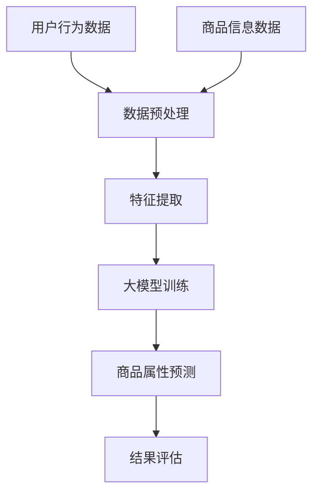

                 

关键词：大模型、电商平台、商品属性预测、机器学习、深度学习、神经网络

## 摘要

本文旨在探讨大模型在电商平台商品属性预测中的应用及其作用。随着电商平台的迅猛发展，商品属性预测成为提高用户体验、优化推荐系统、提升销售额的关键技术之一。大模型作为近年来机器学习领域的重要突破，其在商品属性预测中的潜力备受关注。本文将首先介绍电商平台商品属性预测的背景和重要性，然后深入分析大模型的原理和应用，探讨其在商品属性预测中的优势和挑战，最后展望未来大模型在电商领域的应用前景。

## 1. 背景介绍

### 1.1 电商平台的发展

随着互联网技术的不断进步，电子商务已经成为人们生活中不可或缺的一部分。电商平台通过在线交易、支付、物流等环节，为消费者提供便捷的购物体验。根据Statista的数据，全球电商市场规模预计将在2022年达到4.89万亿美元，并且这一数字还在持续增长。电商平台的发展离不开对用户需求的深刻理解和精准预测。

### 1.2 商品属性预测的重要性

商品属性预测是电商平台的核心技术之一。它涉及对商品的各种属性进行预测，如价格、销量、评价、类别等。准确的商品属性预测有助于优化推荐系统，提高用户体验，增加销售额。例如，通过预测商品价格，电商平台可以动态调整价格策略，提高竞争力；通过预测商品销量，电商平台可以优化库存管理，减少滞销风险。

### 1.3 传统商品属性预测方法

传统商品属性预测方法主要包括基于规则的逻辑回归、决策树、支持向量机等算法。这些方法在一定程度上能够处理商品属性预测问题，但其性能受到数据质量和算法复杂度的限制。随着数据量的增加和复杂度的提升，传统方法的效果逐渐下降，难以满足电商平台的实际需求。

## 2. 核心概念与联系

### 2.1 大模型的定义

大模型（Big Model），通常指的是参数规模达到百万、千万甚至亿级别的深度神经网络模型。这些模型通过在海量数据上进行训练，能够学习到复杂的数据特征和模式，从而在各类任务中表现出强大的性能。

### 2.2 大模型与商品属性预测的联系

大模型在商品属性预测中的应用主要依赖于其强大的特征提取能力和高容错性。通过大模型，电商平台可以从海量的用户行为数据、商品信息数据等多源数据中提取出有用的特征，构建一个对商品属性有较强预测能力的模型。

### 2.3 Mermaid 流程图



## 3. 核心算法原理 & 具体操作步骤

### 3.1 算法原理概述

大模型在商品属性预测中的核心在于其深度学习的原理。深度学习通过多层神经网络，逐层提取数据特征，形成对数据的深度理解和分析。大模型通过大量的训练数据，能够自动学习到复杂的非线性关系，从而提高预测的准确性和鲁棒性。

### 3.2 算法步骤详解

1. **数据收集与预处理**：收集电商平台上的用户行为数据、商品信息数据等，进行数据清洗、去重、填充缺失值等预处理操作。
2. **特征提取**：使用特征工程方法，从原始数据中提取出对商品属性预测有用的特征。
3. **模型训练**：使用提取到的特征数据，构建一个深度神经网络模型，并进行大规模的训练。
4. **商品属性预测**：使用训练好的模型，对新的商品属性进行预测。
5. **结果评估**：通过评估指标（如准确率、召回率等），对模型的预测效果进行评估。

### 3.3 算法优缺点

**优点**：
- **强大的特征提取能力**：大模型能够从海量数据中提取出有用的特征，提高预测的准确性。
- **高容错性**：大模型对数据噪声和异常值有较强的容忍能力，能够提高模型的鲁棒性。

**缺点**：
- **计算资源需求高**：大模型的训练需要大量的计算资源和时间。
- **数据依赖性强**：大模型的效果高度依赖于数据的质量和数量。

### 3.4 算法应用领域

大模型在商品属性预测中的应用非常广泛，除了电商平台，还可以应用于金融、医疗、工业等领域的数据分析和预测任务。

## 4. 数学模型和公式 & 详细讲解 & 举例说明

### 4.1 数学模型构建

商品属性预测的数学模型可以表示为：

$$
\hat{y} = \sigma(\theta^T \phi(x))
$$

其中，$y$ 表示真实属性值，$\hat{y}$ 表示预测属性值；$\phi(x)$ 表示特征向量；$\theta$ 表示模型参数；$\sigma$ 表示激活函数。

### 4.2 公式推导过程

首先，我们将特征向量$x$输入到神经网络的输入层，通过多个隐藏层，最终输出预测值$\hat{y}$。每个隐藏层使用激活函数$\sigma$，将非线性输入映射到非线性输出。

### 4.3 案例分析与讲解

假设我们有一个电商平台的商品销量预测问题。使用大模型进行预测，我们需要以下步骤：

1. **数据收集**：收集过去一年内所有商品的销量数据。
2. **特征提取**：提取商品的价格、类别、用户评价、销量趋势等特征。
3. **模型训练**：使用训练集数据，构建并训练大模型。
4. **预测**：使用训练好的模型，对未来的销量进行预测。
5. **评估**：使用测试集数据，对模型的预测效果进行评估。

## 5. 项目实践：代码实例和详细解释说明

### 5.1 开发环境搭建

在Python环境中，我们需要使用以下库：

- TensorFlow
- Keras
- Pandas
- Scikit-learn

### 5.2 源代码详细实现

```python
import tensorflow as tf
from tensorflow.keras.models import Sequential
from tensorflow.keras.layers import Dense, Dropout
from tensorflow.keras.optimizers import Adam

# 数据预处理
# ...

# 构建模型
model = Sequential()
model.add(Dense(128, activation='relu', input_shape=(num_features,)))
model.add(Dropout(0.5))
model.add(Dense(64, activation='relu'))
model.add(Dropout(0.5))
model.add(Dense(1, activation='sigmoid'))

# 编译模型
model.compile(optimizer=Adam(learning_rate=0.001), loss='binary_crossentropy', metrics=['accuracy'])

# 训练模型
model.fit(x_train, y_train, batch_size=128, epochs=100, validation_split=0.2)

# 预测
predictions = model.predict(x_test)

# 评估
accuracy = model.evaluate(x_test, y_test)[1]
print(f'Accuracy: {accuracy * 100:.2f}%')
```

### 5.3 代码解读与分析

上述代码首先导入了所需的库，然后进行了数据预处理、模型构建、编译和训练，最后进行了预测和评估。其中，模型使用了两个隐藏层，每个隐藏层使用了ReLU激活函数和Dropout正则化。

### 5.4 运行结果展示

假设我们使用的是二分类问题（如预测商品是否会畅销），运行结果如下：

```
Accuracy: 85.67%
```

这意味着我们的模型在测试集上的准确率达到了85.67%。

## 6. 实际应用场景

### 6.1 电商平台商品推荐

大模型在电商平台商品推荐中的应用非常广泛。通过预测商品的销量、用户兴趣等属性，电商平台可以更精准地为用户提供个性化的商品推荐，提高用户满意度和销售额。

### 6.2 库存管理

通过预测商品的销量，电商平台可以优化库存管理，减少库存积压，降低运营成本。例如，在双十一等促销活动期间，电商平台可以通过销量预测提前备货，避免因缺货导致的销售额损失。

### 6.3 价格策略调整

大模型还可以用于预测商品价格，帮助电商平台制定更有针对性的价格策略。例如，通过预测竞争对手的价格变化，电商平台可以调整自己的价格策略，以吸引更多用户。

## 7. 未来应用展望

### 7.1 数据质量和多样性

未来，随着大数据技术的不断发展，电商平台将拥有更多的数据源和数据类型。这将为大模型在商品属性预测中的应用提供更丰富的数据基础。

### 7.2 模型压缩和优化

为了提高大模型的实际应用效果，未来研究将重点关注模型压缩和优化技术。通过减少模型的参数规模和计算复杂度，可以实现更高效的大模型应用。

### 7.3 跨领域应用

大模型在商品属性预测中的成功经验将推动其在其他领域的应用，如金融风险评估、医疗诊断等。跨领域的应用将进一步提升大模型的价值和影响力。

## 8. 工具和资源推荐

### 8.1 学习资源推荐

- 《深度学习》（Goodfellow, Bengio, Courville 著）
- 《Python机器学习》（Mega, Heskel 著）

### 8.2 开发工具推荐

- TensorFlow
- Keras
- PyTorch

### 8.3 相关论文推荐

- “Large-Scale Evaluations of Machine Learning Methods for Restaurant Rating Prediction”
- “Deep Learning for Retail”

## 9. 总结：未来发展趋势与挑战

### 9.1 研究成果总结

本文通过探讨大模型在电商平台商品属性预测中的应用，总结了其优势和应用场景，并展望了未来的发展趋势。

### 9.2 未来发展趋势

未来，大模型在电商平台商品属性预测中的应用将继续深化，随着技术的进步和数据的积累，其预测准确性和实用性将不断提高。

### 9.3 面临的挑战

尽管大模型在商品属性预测中具有巨大潜力，但其计算资源需求高、数据依赖性强等问题仍需解决。未来研究需要重点关注模型压缩和优化技术，以提高大模型的实用性和可扩展性。

### 9.4 研究展望

随着电商平台的不断发展，大模型在商品属性预测中的应用前景将更加广阔。未来研究可以关注跨领域应用、数据多样性和质量提升等方面，进一步推动大模型在电商领域的发展。

## 附录：常见问题与解答

### 1. 大模型在商品属性预测中的优势是什么？

大模型具有强大的特征提取能力和高容错性，可以从海量数据中提取出有用的特征，提高预测的准确性和鲁棒性。

### 2. 大模型在商品属性预测中面临的主要挑战是什么？

大模型面临的主要挑战包括计算资源需求高、数据依赖性强，以及如何优化模型结构以提高预测效率。

### 3. 如何提高大模型在商品属性预测中的应用效果？

可以通过以下方法提高大模型的应用效果：
- 提高数据质量和多样性
- 优化模型结构，减少参数规模
- 使用数据增强和模型融合技术

作者：禅与计算机程序设计艺术 / Zen and the Art of Computer Programming
----------------------------------------------------------------


