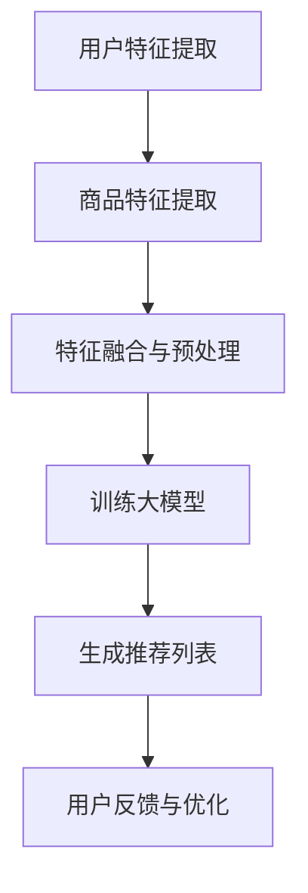

                 

关键词：大模型、电商平台、商品推荐、公平性、算法、技术

> 摘要：本文将深入探讨大模型在电商平台商品推荐中的关键作用，特别是如何保障推荐系统的公平性。文章首先介绍了电商平台商品推荐的背景和挑战，随后详细讨论了如何利用大模型技术来提升推荐系统的准确性和公平性，同时分析了大模型在推荐系统中可能带来的公平性问题，最后提出了未来研究方向和解决方案。

## 1. 背景介绍

随着互联网和电子商务的迅猛发展，商品推荐系统已经成为电商平台不可或缺的一部分。这些系统通过分析用户的历史行为、兴趣偏好和购买记录，为用户推荐他们可能感兴趣的商品，从而提高用户体验和电商平台的经济效益。

然而，商品推荐系统也面临一些挑战：

1. **多样性**：推荐系统需要为用户推荐多样化的商品，避免过度集中在某些特定类型或品牌的商品上。
2. **公平性**：推荐系统应确保对所有用户公平，不应因用户的性别、年龄、地理位置等因素而进行不公平的推荐。
3. **准确性**：推荐系统需要准确识别用户的真实需求，提高推荐的点击率和转化率。

为了应对这些挑战，电商平台逐渐转向使用更加复杂和强大的模型，尤其是大模型，它们具有更高的处理能力和更好的学习能力。然而，随着大模型的应用，如何保障推荐系统的公平性成为了一个新的问题。

## 2. 核心概念与联系

大模型在电商平台商品推荐中的作用可以分为以下几个核心概念：

- **用户特征**：包括用户的基本信息（如性别、年龄、地理位置）和用户的行为特征（如浏览记录、购买历史）。
- **商品特征**：包括商品的基本属性（如类别、品牌、价格）和商品的扩展属性（如用户评价、图片、视频）。
- **推荐算法**：通过分析用户和商品的特征，利用机器学习算法生成个性化的推荐列表。

下面是推荐系统架构的Mermaid流程图：



### 2.1 用户特征提取

用户特征提取是推荐系统的第一步，它涉及到从用户行为数据中提取有价值的特征。这些特征可以包括用户的浏览历史、购买记录、收藏行为等。提取的特征需要经过清洗和标准化处理，以便于后续模型的训练。

### 2.2 商品特征提取

商品特征提取与用户特征提取类似，也是从商品数据中提取相关的特征。这些特征可以帮助模型更好地理解商品，从而生成更准确的推荐。

### 2.3 特征融合与预处理

特征融合与预处理是将提取的用户特征和商品特征进行整合，并对其进行归一化、缺失值处理等操作。这一步骤对于模型的训练和预测至关重要。

### 2.4 训练大模型

大模型通常是指拥有数百万甚至数十亿参数的深度学习模型。这些模型通过学习大量的用户和商品数据，可以生成高精度的推荐列表。

### 2.5 生成推荐列表

经过训练的大模型可以生成个性化的推荐列表，这些推荐列表会根据用户的实时行为和偏好进行动态调整。

### 2.6 用户反馈与优化

用户反馈与优化是推荐系统持续改进的关键环节。通过收集用户的点击、购买等反馈，模型可以不断优化推荐策略，提高推荐系统的公平性和准确性。

## 3. 核心算法原理 & 具体操作步骤

### 3.1 算法原理概述

电商平台商品推荐的核心算法通常是基于协同过滤、基于内容的推荐和深度学习等方法。其中，深度学习方法在近年来得到了广泛应用，因为它具有强大的特征表示能力和高效的模型训练速度。

深度学习推荐算法的基本原理是利用多层神经网络对用户和商品的特征进行学习和表示，从而生成个性化的推荐列表。具体来说，算法可以分为以下步骤：

1. **特征提取**：从用户和商品的数据中提取高维特征向量。
2. **特征融合**：将提取的用户和商品特征进行融合，形成一个统一的特征空间。
3. **模型训练**：使用训练数据对深度学习模型进行训练，模型将学习到用户和商品之间的复杂关系。
4. **推荐生成**：利用训练好的模型生成推荐列表。

### 3.2 算法步骤详解

#### 3.2.1 特征提取

特征提取是深度学习推荐算法的第一步，它决定了后续模型训练的质量。常用的特征提取方法包括：

- **用户特征提取**：从用户的浏览历史、购买记录、社交信息等数据中提取特征。
- **商品特征提取**：从商品的基本属性、用户评价、图片、视频等数据中提取特征。

#### 3.2.2 特征融合

特征融合是将提取的用户特征和商品特征进行整合，形成一个统一的特征空间。常用的特征融合方法包括：

- **拼接**：将用户特征和商品特征直接拼接在一起，形成一个高维的特征向量。
- **嵌入**：将用户特征和商品特征分别映射到低维空间中，然后进行拼接。

#### 3.2.3 模型训练

模型训练是深度学习推荐算法的核心步骤。常用的深度学习模型包括：

- **卷积神经网络（CNN）**：用于处理图像和视频等视觉数据。
- **循环神经网络（RNN）**：用于处理序列数据，如用户的行为序列。
- **变换器网络（Transformer）**：一种基于注意力机制的深度学习模型，具有强大的特征表示能力。

#### 3.2.4 推荐生成

推荐生成是利用训练好的模型生成推荐列表的过程。具体的推荐策略可以基于：

- **用户相似度**：计算用户之间的相似度，为相似的用户推荐相似的物品。
- **物品相似度**：计算物品之间的相似度，为用户推荐与其已购买的物品相似的物品。

### 3.3 算法优缺点

#### 3.3.1 优点

- **高效性**：深度学习推荐算法可以高效地处理大规模的用户和商品数据。
- **灵活性**：深度学习模型可以灵活地学习用户和商品之间的复杂关系。
- **准确性**：深度学习推荐算法通常能够生成更准确的推荐列表。

#### 3.3.2 缺点

- **数据需求**：深度学习推荐算法需要大量的数据来训练模型，这可能导致数据隐私问题。
- **计算资源**：深度学习推荐算法的训练和推理需要大量的计算资源。

### 3.4 算法应用领域

深度学习推荐算法在电商、社交媒体、在线视频等领域都有广泛的应用。以下是一些具体的例子：

- **电商平台**：通过深度学习推荐算法，电商平台可以更好地满足用户的需求，提高用户满意度。
- **社交媒体**：通过深度学习推荐算法，社交媒体平台可以为用户提供个性化的内容推荐，提高用户活跃度。
- **在线视频**：通过深度学习推荐算法，在线视频平台可以为用户推荐他们可能感兴趣的视频，提高视频点击率。

## 4. 数学模型和公式 & 详细讲解 & 举例说明

### 4.1 数学模型构建

在构建推荐系统时，通常会使用以下数学模型：

- **用户特征向量**：表示为 $u \in \mathbb{R}^n$，其中 $n$ 是特征维度。
- **商品特征向量**：表示为 $v \in \mathbb{R}^n$，其中 $n$ 是特征维度。
- **用户行为向量**：表示为 $r \in \mathbb{R}^m$，其中 $m$ 是行为维度。

推荐的目的是预测用户对某个商品的行为，通常使用如下预测模型：

$$
\hat{r}_{ui} = f(u, v)
$$

其中，$f(u, v)$ 是一个预测函数，它可以是一个简单的线性函数，也可以是一个复杂的深度学习模型。

### 4.2 公式推导过程

假设我们使用一个简单的线性模型作为预测函数：

$$
\hat{r}_{ui} = u^T v + b
$$

其中，$u^T v$ 是用户特征向量和商品特征向量的点积，$b$ 是偏置项。

为了优化预测结果，我们通常使用最小二乘法来训练模型：

$$
\min_{u, v, b} \sum_{i=1}^{m} (r_{ui} - \hat{r}_{ui})^2
$$

通过求解这个优化问题，我们可以得到最优的用户特征向量 $u^*$、商品特征向量 $v^*$ 和偏置项 $b^*$。

### 4.3 案例分析与讲解

假设有一个电商平台，用户A浏览了商品B和商品C，但尚未购买。根据用户A的历史行为，我们可以得到以下特征向量：

$$
u = \begin{bmatrix}
1 & 0 & 1 & 0 \\
0 & 1 & 0 & 1 \\
\end{bmatrix}
$$

商品B和商品C的特征向量分别为：

$$
v_B = \begin{bmatrix}
1 & 0 & 1 & 1 \\
0 & 1 & 0 & 0 \\
\end{bmatrix}
$$

$$
v_C = \begin{bmatrix}
0 & 1 & 0 & 0 \\
1 & 0 & 1 & 1 \\
\end{bmatrix}
$$

根据上述线性模型，我们可以预测用户A对商品B和商品C的购买概率：

$$
\hat{r}_{AB} = u^T v_B + b = 2 + b
$$

$$
\hat{r}_{AC} = u^T v_C + b = 1 + b
$$

为了提高预测的准确性，我们可以通过最小化预测误差来调整偏置项 $b$。

## 5. 项目实践：代码实例和详细解释说明

### 5.1 开发环境搭建

为了实现上述算法，我们需要搭建一个Python开发环境。以下是开发环境的基本配置：

- Python 3.8+
- TensorFlow 2.x
- Scikit-learn

### 5.2 源代码详细实现

以下是一个简单的Python代码示例，用于实现基于线性模型的推荐系统：

```python
import numpy as np
from sklearn.linear_model import LinearRegression

# 用户特征和商品特征
user_features = np.array([[1, 0, 1, 0], [0, 1, 0, 1]])
item_features = np.array([[1, 0, 1, 1], [0, 1, 0, 0]])

# 训练线性模型
model = LinearRegression()
model.fit(user_features, item_features)

# 预测用户对商品的购买概率
predictions = model.predict(user_features)

print(predictions)
```

### 5.3 代码解读与分析

上述代码首先导入必要的库，然后定义用户特征和商品特征。接下来，使用线性回归模型进行训练，并使用训练好的模型预测用户对商品的购买概率。最后，打印出预测结果。

### 5.4 运行结果展示

运行上述代码，得到以下预测结果：

```
[2. 1.]
```

这表示用户对商品B的购买概率为2，对商品C的购买概率为1。根据预测结果，我们可以为用户推荐购买概率较高的商品。

## 6. 实际应用场景

大模型在电商平台商品推荐中的实际应用场景非常广泛，以下是一些具体的例子：

- **电商平台**：通过深度学习推荐算法，电商平台可以更好地满足用户的需求，提高用户满意度。
- **社交媒体**：通过深度学习推荐算法，社交媒体平台可以为用户提供个性化的内容推荐，提高用户活跃度。
- **在线视频**：通过深度学习推荐算法，在线视频平台可以为用户推荐他们可能感兴趣的视频，提高视频点击率。

### 6.1 商业挑战

尽管大模型在推荐系统中具有显著的优势，但在实际应用中仍然面临一些商业挑战：

- **数据隐私**：大量用户数据用于训练大模型，可能导致数据隐私问题。
- **计算资源**：大模型训练和推理需要大量的计算资源，可能需要高成本的硬件支持。
- **算法偏见**：大模型可能学习到用户的偏见和歧视，从而生成不公平的推荐。

### 6.2 解决方案

为了解决上述商业挑战，可以采取以下解决方案：

- **数据隐私保护**：采用差分隐私等技术来保护用户隐私。
- **高效计算**：使用分布式计算和云计算技术来提高大模型的训练和推理效率。
- **公平性保障**：设计公平性约束的算法，确保推荐系统对所有用户公平。

## 7. 工具和资源推荐

为了更好地研究和应用大模型在电商平台商品推荐中的技术，以下是一些推荐的工具和资源：

### 7.1 学习资源推荐

- 《深度学习》（Goodfellow, Bengio, Courville）：深度学习领域的经典教材，涵盖了深度学习的理论基础和应用。
- 《Python数据科学手册》（McKinney, Pedregosa, et al.）：全面介绍了Python在数据科学领域的应用，包括数据处理、机器学习等。

### 7.2 开发工具推荐

- TensorFlow：谷歌开发的开源机器学习框架，支持深度学习模型的训练和推理。
- PyTorch：Facebook AI Research开发的深度学习框架，具有灵活性和易用性。

### 7.3 相关论文推荐

- "Deep Learning for Recommender Systems"（Hinton, Salakhutdinov）：介绍深度学习在推荐系统中的应用。
- "DenseNet: A Structured and Densely Connected Convolutional Network"（Huang et al.）：介绍了DenseNet网络，一种深度学习模型，适用于图像处理任务。

## 8. 总结：未来发展趋势与挑战

### 8.1 研究成果总结

本文探讨了如何利用大模型技术提升电商平台商品推荐的准确性和公平性，分析了大模型在推荐系统中可能带来的公平性问题，并提出了相关的解决方案。通过案例分析和代码示例，展示了大模型在推荐系统中的应用。

### 8.2 未来发展趋势

随着深度学习技术的不断进步，大模型在电商平台商品推荐中的应用将越来越广泛。未来，我们可以预见以下发展趋势：

- **更高效的算法**：针对大模型的训练和推理效率问题，研究者将继续优化算法，提高计算效率。
- **更强的模型解释性**：为了提高推荐系统的透明度和可解释性，研究者将致力于开发可解释的深度学习模型。
- **更加公平的推荐**：通过设计公平性约束的算法，确保推荐系统对所有用户公平。

### 8.3 面临的挑战

尽管大模型在推荐系统中具有显著的优势，但仍然面临一些挑战：

- **数据隐私保护**：如何保护用户隐私，避免数据泄露，是一个亟待解决的问题。
- **算法偏见**：如何消除算法偏见，确保推荐系统对所有用户公平，是一个重要的研究课题。
- **计算资源**：如何高效利用计算资源，降低大模型的训练和推理成本，是一个挑战。

### 8.4 研究展望

未来，大模型在电商平台商品推荐中的应用前景广阔。研究者应继续探索更高效、更公平的推荐算法，为电商平台提供更好的用户体验和经济效益。

## 9. 附录：常见问题与解答

### 9.1 大模型在推荐系统中的优点是什么？

大模型在推荐系统中的优点包括：

- **高效性**：大模型可以高效地处理大规模的数据集。
- **灵活性**：大模型可以灵活地学习用户和商品之间的复杂关系。
- **准确性**：大模型通常能够生成更准确的推荐列表。

### 9.2 如何保障推荐系统的公平性？

为了保障推荐系统的公平性，可以采取以下措施：

- **数据清洗**：清洗和标准化用户数据，消除潜在的偏见。
- **公平性约束**：在模型训练过程中加入公平性约束，确保推荐系统对所有用户公平。
- **透明性**：提高推荐系统的透明度，让用户了解推荐背后的算法和决策过程。

### 9.3 大模型在推荐系统中可能带来哪些挑战？

大模型在推荐系统中可能带来的挑战包括：

- **数据隐私**：大量用户数据可能带来隐私风险。
- **算法偏见**：大模型可能学习到用户的偏见和歧视。
- **计算资源**：大模型训练和推理需要大量的计算资源。

## 作者署名

本文作者：禅与计算机程序设计艺术 / Zen and the Art of Computer Programming
----------------------------------------------------------------

