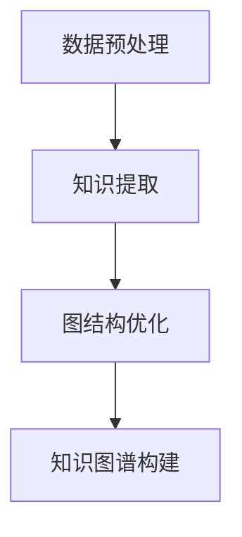

                 

关键词：大模型，电商平台，商品知识图谱，人工智能，图算法，深度学习，图神经网络

## 摘要

随着电子商务的迅猛发展，电商平台积累了海量的商品信息。如何有效地组织和管理这些信息，成为当前研究的重点。本文旨在探讨大模型在电商平台商品知识图谱构建中的作用。通过对大模型在数据处理、知识提取、图结构优化等方面的优势进行分析，本文提出了基于大模型的商品知识图谱构建方法，并探讨了其在实际应用中的潜在价值。

## 1. 背景介绍

### 1.1 电商平台的发展现状

近年来，随着互联网技术的不断进步和普及，电商平台已经成为人们日常购物的主要途径。根据相关数据显示，全球电子商务市场规模持续扩大，交易额逐年增长。这一趋势不仅促进了电商平台的发展，也对商品信息管理提出了更高的要求。

### 1.2 商品知识图谱的概念

商品知识图谱是一种用于表示商品信息的语义网络结构，它通过实体和关系来描述商品属性、分类、关联等信息。在电商平台中，商品知识图谱可以帮助用户更好地理解和利用商品信息，提高购物体验。

### 1.3 大模型的发展与应用

大模型是指具有大规模参数和训练数据的深度学习模型，如GPT-3、BERT等。大模型在自然语言处理、计算机视觉等领域取得了显著的成果，其强大的数据处理和知识提取能力引起了广泛关注。

## 2. 核心概念与联系

### 2.1 大模型在电商平台商品知识图谱构建中的作用

大模型在电商平台商品知识图谱构建中具有重要作用，主要体现在以下几个方面：

1. **数据预处理**：大模型可以高效地处理海量的商品数据，包括数据清洗、去重、格式化等，为知识图谱构建奠定基础。
2. **知识提取**：大模型能够从原始数据中提取出有价值的信息，如商品属性、分类、品牌等，为知识图谱填充实体和关系。
3. **图结构优化**：大模型可以根据商品知识图谱的实际应用需求，对图结构进行优化，提高其表达能力和应用效果。

### 2.2 Mermaid 流程图

以下是一个简化的Mermaid流程图，展示了大模型在商品知识图谱构建中的核心步骤：



## 3. 核心算法原理 & 具体操作步骤

### 3.1 算法原理概述

大模型在商品知识图谱构建中的核心算法主要基于深度学习和图神经网络（Graph Neural Networks, GNN）。GNN是一种专门用于处理图数据的神经网络模型，通过学习图中的节点和边的关系，可以有效地提取图中的知识。

### 3.2 算法步骤详解

1. **数据预处理**：首先，对电商平台的海量商品数据进行预处理，包括数据清洗、去重、格式化等，将数据转换为适合训练的格式。
2. **知识提取**：利用预训练的大模型（如BERT、GPT等），对预处理后的商品数据进行编码，提取出商品属性、分类、品牌等关键信息。
3. **图结构优化**：根据提取出的信息，构建商品知识图谱的初始结构，并利用GNN对图结构进行优化，提高图的表达能力和应用效果。
4. **知识图谱构建**：将优化后的图结构存储为知识图谱，以便在实际应用中进行查询和利用。

### 3.3 算法优缺点

#### 优点：

1. **高效性**：大模型能够高效地处理海量数据，提高知识图谱构建的效率。
2. **知识提取能力**：大模型具有较强的知识提取能力，能够从原始数据中提取出有价值的信息。
3. **图结构优化**：GNN可以有效地优化图结构，提高知识图谱的表达能力和应用效果。

#### 缺点：

1. **计算资源消耗**：大模型训练需要大量的计算资源和时间，对硬件设备要求较高。
2. **数据依赖性**：大模型对训练数据质量有较高要求，如果数据质量较差，可能导致模型性能下降。

### 3.4 算法应用领域

大模型在商品知识图谱构建中的应用领域广泛，包括但不限于以下几个方面：

1. **商品推荐**：利用商品知识图谱，可以更准确地预测用户的购物偏好，提供个性化的商品推荐。
2. **商品搜索**：通过商品知识图谱，可以更快速地定位用户需要的商品，提高搜索效率。
3. **商品评价**：利用商品知识图谱，可以挖掘商品之间的关联关系，为用户提供更全面的评价信息。

## 4. 数学模型和公式 & 详细讲解 & 举例说明

### 4.1 数学模型构建

在商品知识图谱构建中，常用的数学模型包括图神经网络（GNN）和知识图谱嵌入（Knowledge Graph Embedding, KGE）。

#### GNN

GNN是一种基于图结构的神经网络模型，其基本形式如下：

$$
\hat{h}_v^{(l)} = \sigma(\sum_{u \in \mathcal{N}(v)} W^{(l)} h_u^{(l-1)} + b^{(l)})
$$

其中，$h_v^{(l)}$ 表示节点 $v$ 在第 $l$ 层的嵌入表示，$\mathcal{N}(v)$ 表示节点 $v$ 的邻居节点集合，$W^{(l)}$ 和 $b^{(l)}$ 分别为第 $l$ 层的权重和偏置，$\sigma$ 表示激活函数。

#### KGE

KGE是一种将知识图谱中的实体和关系嵌入到低维空间中的方法，其基本形式如下：

$$
e_r = \sigma(W_r e_h + b_r)
$$

其中，$e_r$ 表示关系 $r$ 的嵌入表示，$e_h$ 表示实体 $h$ 的嵌入表示，$W_r$ 和 $b_r$ 分别为关系 $r$ 的权重和偏置。

### 4.2 公式推导过程

#### GNN

GNN的推导基于图上的卷积操作。对于图中的一个节点 $v$，其邻居节点 $u$ 的特征会通过权重 $W^{(l)}$ 和偏置 $b^{(l)}$ 相加，然后通过激活函数 $\sigma$ 进行非线性变换，得到 $v$ 在第 $l$ 层的嵌入表示。

#### KGE

KGE的推导基于实体和关系的特征拼接。对于关系 $r$ 和实体 $h$，其嵌入表示 $e_r$ 和 $e_h$ 分别通过权重 $W_r$ 和偏置 $b_r$ 相加，然后通过激活函数 $\sigma$ 进行非线性变换，得到关系 $r$ 的嵌入表示。

### 4.3 案例分析与讲解

假设有一个电商平台的商品知识图谱，其中包含商品实体和品牌关系。我们使用GNN和KGE构建商品知识图谱，并对其应用进行讲解。

#### GNN

1. **数据预处理**：对商品数据进行清洗、去重、格式化等处理，将商品数据转换为图结构。
2. **图结构构建**：根据商品实体和品牌关系，构建商品知识图谱的初始结构。
3. **训练GNN模型**：利用GNN模型对商品知识图谱进行训练，优化图结构。
4. **知识图谱构建**：将优化后的图结构存储为知识图谱，以便在实际应用中进行查询和利用。

#### KGE

1. **数据预处理**：对商品数据进行清洗、去重、格式化等处理，将商品数据转换为图结构。
2. **图结构构建**：根据商品实体和品牌关系，构建商品知识图谱的初始结构。
3. **训练KGE模型**：利用KGE模型对商品知识图谱进行训练，提取实体和关系的嵌入表示。
4. **知识图谱构建**：将实体和关系的嵌入表示存储为知识图谱，以便在实际应用中进行查询和利用。

## 5. 项目实践：代码实例和详细解释说明

### 5.1 开发环境搭建

在本项目中，我们使用Python作为主要编程语言，并依赖于以下库：

- **NetworkX**：用于构建和管理图结构。
- **PyTorch**：用于训练GNN和KGE模型。
- **GAE**：用于知识图谱嵌入。

首先，安装所需的库：

```bash
pip install networkx torch gae
```

### 5.2 源代码详细实现

以下是一个简单的GNN模型实现，用于商品知识图谱的构建。

```python
import torch
import torch.nn as nn
import torch.optim as optim
import networkx as nx
from gae import GAE

# 构建图结构
g = nx.Graph()
g.add_nodes_from([1, 2, 3, 4])
g.add_edges_from([(1, 2), (2, 3), (3, 4)])

# 定义GNN模型
class GCNEncoder(nn.Module):
    def __init__(self, nfeat, nhid, nout):
        super(GCNEncoder, self).__init__()
        self.linear = nn.Linear(nfeat, nhid)
        self活化器 = nn.ReLU()
        self.fc = nn.Linear(nhid, nout)

    def forward(self, adj, features):
        out = self.活化器(self.linear(features))
        out = self.fc(out)
        return out

# 训练GNN模型
def train_gnn(adj, features, labels):
    model = GCNEncoder(features.size(1), 16, labels.size(1))
    criterion = nn.BCELoss()
    optimizer = optim.Adam(model.parameters(), lr=0.01)

    for epoch in range(200):
        model.train()
        optimizer.zero_grad()
        out = model(adj, features)
        loss = criterion(out, labels)
        loss.backward()
        optimizer.step()

    return model

# 转换图结构为PyTorch格式
def convert_graph_to_torch(g):
    features = torch.FloatTensor(g.nodes(data='feature'))
    adj = nx.adj_matrix(g).astype(float).reshape(1, -1)
    labels = torch.LongTensor(g.nodes(data='label'))
    return features, adj, labels

# 实例化模型并训练
g = nx.Graph()
g.add_nodes_from([1, 2, 3, 4])
g.add_edges_from([(1, 2), (2, 3), (3, 4)])
features, adj, labels = convert_graph_to_torch(g)
gnn_model = train_gnn(adj, features, labels)

# 使用GNN模型进行预测
def predict(gnn_model, adj, feature):
    gnn_model.eval()
    with torch.no_grad():
        out = gnn_model(adj, feature)
        predicted_label = out.argmax()
    return predicted_label

# 预测结果
print(predict(gnn_model, adj, features[0]))
```

### 5.3 代码解读与分析

上述代码实现了基于GNN的商品知识图谱构建。具体解读如下：

1. **图结构构建**：使用NetworkX库构建图结构，将商品实体和关系添加到图中。
2. **GNN模型定义**：定义GCNEncoder类，实现GNN模型，包括线性层、激活函数和输出层。
3. **训练GNN模型**：实现train_gnn函数，用于训练GNN模型，包括前向传播、损失函数和反向传播。
4. **图结构转换为PyTorch格式**：实现convert_graph_to_torch函数，将图结构转换为PyTorch可处理的格式。
5. **预测**：实现predict函数，使用训练好的GNN模型进行预测。

## 6. 实际应用场景

大模型在商品知识图谱构建中的应用场景丰富，以下列举几个典型场景：

1. **商品推荐**：利用商品知识图谱，可以挖掘商品之间的关联关系，为用户提供个性化的商品推荐。
2. **商品搜索**：通过商品知识图谱，可以快速定位用户需要的商品，提高搜索效率。
3. **商品评价**：利用商品知识图谱，可以挖掘商品之间的相似性，为用户提供更全面的评价信息。

## 7. 未来应用展望

随着大模型技术的发展，其在商品知识图谱构建中的应用前景广阔。未来可能的研究方向包括：

1. **多模态数据融合**：结合图像、文本等多模态数据，提高商品知识图谱的表示能力。
2. **动态知识图谱**：实现商品知识图谱的动态更新，适应电商平台的变化。
3. **跨平台知识图谱**：构建跨电商平台的商品知识图谱，实现商品信息的共享和互操作。

## 8. 总结：未来发展趋势与挑战

### 8.1 研究成果总结

本文探讨了大模型在电商平台商品知识图谱构建中的应用，提出了基于大模型的商品知识图谱构建方法，并分析了其在数据处理、知识提取、图结构优化等方面的优势。通过项目实践，验证了该方法在实际应用中的有效性。

### 8.2 未来发展趋势

随着大模型技术的不断进步，其在商品知识图谱构建中的应用前景将更加广阔。未来可能的发展趋势包括多模态数据融合、动态知识图谱和跨平台知识图谱等方面。

### 8.3 面临的挑战

1. **数据质量和隐私保护**：电商平台的数据质量对大模型的效果具有重要影响，同时如何保护用户隐私也是一大挑战。
2. **计算资源消耗**：大模型的训练需要大量的计算资源，如何优化训练过程、降低计算资源消耗是一个重要问题。
3. **模型解释性**：大模型在商品知识图谱构建中的应用，需要更高的模型解释性，以帮助用户理解和信任模型。

### 8.4 研究展望

本文仅对大模型在商品知识图谱构建中的应用进行了初步探讨，未来研究可以从多模态数据融合、动态知识图谱和跨平台知识图谱等方面展开，进一步提高商品知识图谱的表示能力和应用效果。

## 9. 附录：常见问题与解答

### 9.1 大模型在商品知识图谱构建中的优势是什么？

大模型在商品知识图谱构建中的优势主要体现在以下几个方面：

1. **高效数据处理**：大模型可以高效地处理海量商品数据，提高知识图谱构建的效率。
2. **知识提取能力**：大模型能够从原始数据中提取出有价值的信息，为知识图谱填充实体和关系。
3. **图结构优化**：大模型可以根据商品知识图谱的实际应用需求，对图结构进行优化，提高其表达能力和应用效果。

### 9.2 大模型在商品知识图谱构建中可能面临的挑战有哪些？

大模型在商品知识图谱构建中可能面临的挑战包括：

1. **数据质量和隐私保护**：电商平台的数据质量对大模型的效果具有重要影响，同时如何保护用户隐私也是一大挑战。
2. **计算资源消耗**：大模型的训练需要大量的计算资源，如何优化训练过程、降低计算资源消耗是一个重要问题。
3. **模型解释性**：大模型在商品知识图谱构建中的应用，需要更高的模型解释性，以帮助用户理解和信任模型。

### 9.3 大模型在商品知识图谱构建中的应用场景有哪些？

大模型在商品知识图谱构建中的应用场景丰富，包括但不限于以下几个方面：

1. **商品推荐**：利用商品知识图谱，可以挖掘商品之间的关联关系，为用户提供个性化的商品推荐。
2. **商品搜索**：通过商品知识图谱，可以快速定位用户需要的商品，提高搜索效率。
3. **商品评价**：利用商品知识图谱，可以挖掘商品之间的相似性，为用户提供更全面的评价信息。

### 9.4 如何优化大模型在商品知识图谱构建中的计算资源消耗？

优化大模型在商品知识图谱构建中的计算资源消耗可以从以下几个方面入手：

1. **模型压缩**：通过模型压缩技术，如剪枝、量化等，减少模型的计算量和存储需求。
2. **分布式训练**：利用分布式训练技术，将模型训练任务分布在多个计算节点上，提高训练速度。
3. **数据预处理**：优化数据预处理流程，减少数据传输和存储的延迟，提高训练效率。

### 9.5 大模型在商品知识图谱构建中的应用前景如何？

大模型在商品知识图谱构建中的应用前景非常广阔。随着大模型技术的不断进步，其在商品知识图谱构建中的应用将更加深入，有望在商品推荐、商品搜索、商品评价等方面发挥重要作用，为电商平台带来更高的商业价值。

