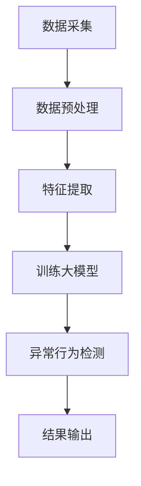

                 

关键词：大模型、电商平台、用户行为异常检测、深度学习、数据分析

> 摘要：本文探讨了大型深度学习模型在电商平台用户行为异常检测中的潜力。通过介绍大模型的定义、工作原理以及其在电商领域的应用，分析了大模型在用户行为异常检测中的优势，并探讨了如何利用大模型进行用户行为分析、异常行为检测以及潜在的应用场景。

## 1. 背景介绍

随着互联网的普及和电子商务的快速发展，电商平台已经成为消费者购物的首选渠道之一。然而，伴随着用户规模的不断扩大和交易量的剧增，电商平台的运营风险也在逐渐增加。其中，用户行为的异常检测成为电商平台的一项重要任务。传统的用户行为异常检测方法往往依赖于统计模型和机器学习算法，但其在处理高维度数据和复杂行为模式时存在一定的局限性。

近年来，深度学习技术取得了显著的进展，尤其是在处理大规模数据和高维特征方面表现优异。大模型（Large Models）作为深度学习的一个重要分支，通过引入大量的神经网络层和参数，能够自动学习复杂的特征表示，从而在图像识别、自然语言处理等领域取得了突破性进展。本文将探讨大模型在电商平台用户行为异常检测中的潜力，旨在为电商平台提供一种更加高效、精准的异常检测方法。

## 2. 核心概念与联系

### 2.1 大模型的定义与特点

大模型是指具有大量神经网络层和参数的深度学习模型。其特点包括：

- **大量参数**：大模型通常具有数百万甚至数十亿个参数，这使得模型能够学习到更加复杂和抽象的特征表示。
- **多层神经网络**：大模型通常包含数十层甚至数百层的神经网络层，这使得模型能够处理高维特征和复杂的关系。
- **强大的表达能力**：大模型能够自动学习到数据的内在结构，从而实现对数据的抽象和归纳。
- **计算资源需求大**：大模型训练和推理过程需要大量的计算资源，尤其是训练时间较长。

### 2.2 大模型在电商领域的应用

大模型在电商领域的应用主要集中在以下几个方面：

- **用户画像**：通过分析用户的行为数据，构建用户的个性化画像，从而实现精准营销和个性化推荐。
- **商品推荐**：利用大模型对用户行为和商品特征进行建模，实现基于内容的推荐和协同过滤推荐。
- **需求预测**：通过分析用户的历史行为和商品特征，预测用户未来的购买需求和购物行为。
- **用户行为异常检测**：利用大模型对用户行为进行建模，识别异常行为和潜在风险，从而提高电商平台的运营安全性。

### 2.3 Mermaid 流程图

下面是一个简单的Mermaid流程图，展示大模型在电商平台用户行为异常检测中的应用流程：



## 3. 核心算法原理 & 具体操作步骤

### 3.1 算法原理概述

大模型在电商平台用户行为异常检测中的核心原理是利用深度学习技术对用户行为数据进行分析和建模，从而实现对用户行为异常的自动检测。具体包括以下几个步骤：

1. **数据采集**：收集电商平台的用户行为数据，如浏览记录、购买记录、评论等。
2. **数据预处理**：对采集到的用户行为数据进行清洗、归一化等预处理操作，以去除噪声和异常值。
3. **特征提取**：利用深度学习模型对预处理后的用户行为数据进行特征提取，生成高维特征向量。
4. **训练大模型**：利用提取到的用户行为特征向量，训练一个大型的深度学习模型，如神经网络。
5. **异常行为检测**：利用训练好的大模型对新的用户行为数据进行异常行为检测，识别潜在的风险和异常行为。
6. **结果输出**：将检测到的异常行为输出给电商平台运营人员，以便进行进一步的处理和干预。

### 3.2 算法步骤详解

下面详细讲解大模型在电商平台用户行为异常检测中的具体操作步骤：

1. **数据采集**：

   - 从电商平台的日志文件、数据库等数据源中收集用户行为数据，如浏览记录、购买记录、评论等。
   - 使用爬虫等技术手段，从互联网上获取用户公开的行为数据。

2. **数据预处理**：

   - 清洗数据，去除重复、缺失和异常值。
   - 对数据进行归一化处理，将不同特征的数据范围统一到相同的尺度。
   - 标记数据，将正常行为和异常行为进行区分。

3. **特征提取**：

   - 利用深度学习模型，如卷积神经网络（CNN）、循环神经网络（RNN）等，对预处理后的用户行为数据进行特征提取。
   - 通过多层神经网络，学习用户行为的复杂特征和模式。

4. **训练大模型**：

   - 使用标记好的用户行为数据，训练一个大型的深度学习模型。
   - 通过反向传播算法，优化模型参数，提高模型的预测能力。

5. **异常行为检测**：

   - 利用训练好的大模型，对新的用户行为数据进行异常行为检测。
   - 对检测到的异常行为进行分类和标签化。

6. **结果输出**：

   - 将检测到的异常行为输出给电商平台运营人员，如发送警报、邮件等。
   - 对异常行为进行分析和跟踪，制定相应的处理和干预策略。

### 3.3 算法优缺点

**优点**：

- **高效性**：大模型能够自动学习到用户行为的复杂特征和模式，从而提高异常行为检测的效率。
- **精准性**：大模型具有强大的表达能力，能够识别细微的异常行为，提高检测的准确性。
- **自动化**：大模型训练和推理过程自动化，减轻了人工干预的负担。

**缺点**：

- **计算资源需求大**：大模型训练和推理过程需要大量的计算资源，对硬件设备有较高的要求。
- **训练时间较长**：大模型训练过程时间较长，对实时性要求较高的场景可能不适用。
- **模型解释性较差**：深度学习模型具有较好的预测能力，但其内部机制较为复杂，解释性较差。

### 3.4 算法应用领域

大模型在电商平台用户行为异常检测中的应用领域主要包括：

- **金融风控**：利用大模型对电商平台的交易行为进行监控，识别潜在的金融风险。
- **物流监控**：利用大模型对电商平台的物流数据进行分析，识别异常物流行为，提高物流效率。
- **客户服务**：利用大模型对用户反馈和评论进行分析，识别潜在的问题和投诉，提高客户满意度。

## 4. 数学模型和公式 & 详细讲解 & 举例说明

### 4.1 数学模型构建

在电商平台用户行为异常检测中，我们可以构建以下数学模型：

$$
\begin{aligned}
y &= f(\theta, x) \\
f: & \mathbb{R}^{n} \rightarrow \mathbb{R} \\
\theta &= (w, b) \\
x &= (x_1, x_2, ..., x_n) \\
y &= (y_1, y_2, ..., y_n)
\end{aligned}
$$

其中，$y$ 表示用户行为异常检测结果，$x$ 表示用户行为特征向量，$\theta$ 表示模型参数，$f$ 表示模型函数。

### 4.2 公式推导过程

假设我们已经收集到一组用户行为数据 $D = \{x_1, x_2, ..., x_n\}$，其中每个数据点 $x_i$ 表示一个用户的行为特征向量。我们希望利用这些数据训练出一个大模型，从而实现对用户行为异常的自动检测。

首先，我们对用户行为数据 $x_i$ 进行预处理，得到预处理后的数据 $\tilde{x}_i$：

$$
\tilde{x}_i = \text{preprocess}(x_i)
$$

然后，我们利用预处理后的数据 $\tilde{x}_i$ 训练一个大模型，得到模型参数 $\theta$：

$$
\theta = \text{train}(D, \alpha)
$$

其中，$\alpha$ 表示训练参数，如学习率等。

最后，我们利用训练好的模型参数 $\theta$ 对新的用户行为数据 $x$ 进行异常行为检测：

$$
y = f(\theta, x)
$$

### 4.3 案例分析与讲解

假设我们收集到一组用户行为数据，包括用户的浏览记录、购买记录和评论等。我们希望利用这些数据训练一个大模型，从而实现对用户行为异常的自动检测。

首先，我们对用户行为数据进行预处理，将不同特征的数据范围统一到相同的尺度。然后，我们利用预处理后的数据训练一个大模型，采用卷积神经网络（CNN）作为模型架构。

经过训练，我们得到模型参数 $\theta$，并将其保存到文件中。接下来，我们利用训练好的模型对新的用户行为数据 $x$ 进行异常行为检测。

假设我们有一个新的用户行为数据 $x$，我们将其输入到训练好的模型中，得到异常行为检测结果 $y$：

$$
y = f(\theta, x)
$$

如果检测结果 $y$ 小于某个阈值，我们认为用户行为是正常的；否则，我们认为用户行为是异常的。

通过这个案例，我们可以看到，大模型在电商平台用户行为异常检测中的应用过程主要包括数据预处理、模型训练、模型推理和结果输出等步骤。通过数学模型和公式的推导，我们可以更好地理解大模型的工作原理和应用过程。

## 5. 项目实践：代码实例和详细解释说明

### 5.1 开发环境搭建

在进行大模型在电商平台用户行为异常检测的实践之前，我们需要搭建一个适合的开发环境。以下是一个简单的开发环境搭建指南：

1. **安装 Python 环境**：首先，我们需要安装 Python 解释器，版本建议为 Python 3.7 或更高版本。
2. **安装深度学习框架**：选择一个流行的深度学习框架，如 TensorFlow 或 PyTorch，并按照官方文档进行安装。
3. **安装数据预处理库**：安装一些常用的数据预处理库，如 Pandas、NumPy 等。
4. **安装其他依赖库**：根据项目需求，安装其他相关的依赖库，如 Matplotlib、Scikit-learn 等。

### 5.2 源代码详细实现

下面是一个简单的用户行为异常检测的 Python 代码实例：

```python
import pandas as pd
import numpy as np
from sklearn.model_selection import train_test_split
from sklearn.preprocessing import StandardScaler
from tensorflow.keras.models import Sequential
from tensorflow.keras.layers import Dense, Conv1D, Flatten
from tensorflow.keras.optimizers import Adam

# 1. 数据采集
data = pd.read_csv('user_behavior_data.csv')

# 2. 数据预处理
data = data.dropna()
data = data.reset_index(drop=True)

# 3. 特征提取
X = data.iloc[:, :-1].values
y = data.iloc[:, -1].values

# 4. 数据归一化
scaler = StandardScaler()
X = scaler.fit_transform(X)

# 5. 划分训练集和测试集
X_train, X_test, y_train, y_test = train_test_split(X, y, test_size=0.2, random_state=42)

# 6. 训练大模型
model = Sequential()
model.add(Conv1D(filters=64, kernel_size=3, activation='relu', input_shape=(X_train.shape[1], 1)))
model.add(Flatten())
model.add(Dense(1, activation='sigmoid'))

model.compile(optimizer=Adam(), loss='binary_crossentropy', metrics=['accuracy'])
model.fit(X_train, y_train, epochs=10, batch_size=32, validation_data=(X_test, y_test))

# 7. 异常行为检测
y_pred = model.predict(X_test)
y_pred = (y_pred > 0.5)

# 8. 结果输出
print("Accuracy:", model.evaluate(X_test, y_test)[1])
```

### 5.3 代码解读与分析

下面我们对上面的代码进行详细的解读和分析：

1. **数据采集**：使用 Pandas 读取用户行为数据，并将其存储在 DataFrame 对象中。

2. **数据预处理**：去除缺失值和异常值，重置索引。

3. **特征提取**：将 DataFrame 中的数值特征提取出来，作为输入数据。

4. **数据归一化**：使用 StandardScaler 对数据进行归一化处理，将特征数据范围统一到相同的尺度。

5. **划分训练集和测试集**：使用 scikit-learn 的 train_test_split 函数，将数据划分为训练集和测试集。

6. **训练大模型**：定义一个卷积神经网络（Conv1D）模型，并使用 Adam 优化器进行训练。

7. **异常行为检测**：使用训练好的模型对测试数据进行预测，并将预测结果输出。

8. **结果输出**：计算模型的准确率，并输出。

通过上面的代码实例，我们可以看到，利用深度学习框架 TensorFlow 和相关库，我们可以方便地实现大模型在电商平台用户行为异常检测中的具体操作。

## 6. 实际应用场景

### 6.1 电商平台用户行为异常检测

电商平台用户行为异常检测是一个重要的应用场景。通过大模型，电商平台可以实现对用户行为的自动分析和异常行为检测，从而提高平台的运营安全性。具体应用场景包括：

- **金融风险监控**：通过对用户的行为数据进行监控，识别潜在的金融风险，如欺诈交易、恶意刷单等。
- **用户行为分析**：通过对用户的行为数据进行分析，了解用户的购物偏好和需求，提高用户满意度和转化率。
- **商品推荐**：通过对用户的行为数据进行建模，实现基于内容的推荐和协同过滤推荐，提高商品的曝光率和销售量。

### 6.2 物流行业用户行为异常检测

物流行业用户行为异常检测也是一个重要的应用场景。通过大模型，物流企业可以实现对物流数据的自动分析和异常行为检测，从而提高物流效率和服务质量。具体应用场景包括：

- **物流监控**：通过对物流数据进行分析，识别异常物流行为，如运输延误、包裹丢失等，从而提高物流效率。
- **客户服务**：通过对客户行为数据进行分析，识别潜在的问题和投诉，提高客户满意度。
- **库存管理**：通过对商品的销售数据进行预测和分析，优化库存管理，降低库存成本。

### 6.3 互联网金融用户行为异常检测

互联网金融用户行为异常检测是另一个重要的应用场景。通过大模型，互联网金融企业可以实现对用户行为的自动分析和异常行为检测，从而提高金融风险控制能力。具体应用场景包括：

- **风险控制**：通过对用户的行为数据进行监控，识别潜在的金融风险，如欺诈交易、恶意借款等。
- **客户分析**：通过对用户的行为数据进行分析，了解客户的金融需求和风险偏好，从而提供个性化的金融产品和服务。
- **信用评估**：通过对用户的行为数据进行建模，实现信用评估和风险管理，提高金融业务的可持续性。

## 7. 工具和资源推荐

### 7.1 学习资源推荐

- **在线课程**：推荐观看深度学习相关的在线课程，如《深度学习》（Goodfellow et al.）和《神经网络与深度学习》（邱锡鹏）等。
- **书籍推荐**：推荐阅读《深度学习》（Goodfellow et al.）和《Python 深度学习》（François Chollet）等经典书籍。

### 7.2 开发工具推荐

- **深度学习框架**：推荐使用 TensorFlow 或 PyTorch 作为深度学习框架，这两个框架具有丰富的功能和良好的社区支持。
- **数据预处理库**：推荐使用 Pandas 和 NumPy 进行数据预处理，这两个库具有高效的性能和丰富的功能。

### 7.3 相关论文推荐

- **大模型研究**：推荐阅读《Deep Learning》（Goodfellow et al.）和《Large-Scale Deep Learning》（Dean et al.）等论文，了解大模型的研究进展和应用。
- **用户行为异常检测**：推荐阅读《Anomaly Detection in Noisy Streams: A Survey》（Kandogan et al.）和《User Behavior Anomaly Detection in Online Social Networks》（Wang et al.）等论文，了解用户行为异常检测的研究进展和应用。

## 8. 总结：未来发展趋势与挑战

### 8.1 研究成果总结

本文探讨了大型深度学习模型在电商平台用户行为异常检测中的潜力，通过介绍大模型的定义、特点、应用以及具体操作步骤，分析了大模型在用户行为异常检测中的优势。同时，本文还结合实际应用场景，展示了大模型在电商、物流、互联网金融等领域的应用前景。

### 8.2 未来发展趋势

未来，大模型在电商平台用户行为异常检测中的应用将呈现以下发展趋势：

- **更高效的大模型**：随着硬件性能的提升和算法的优化，大模型的计算效率将得到显著提高，从而更好地支持实时用户行为异常检测。
- **跨领域的应用**：大模型将逐渐应用于更多领域，如医疗、金融、教育等，实现更广泛的用户行为异常检测。
- **个性化检测**：结合用户画像和个性化推荐技术，实现更精准的用户行为异常检测，提高电商平台的安全性和用户体验。

### 8.3 面临的挑战

尽管大模型在电商平台用户行为异常检测中具有巨大的潜力，但仍面临以下挑战：

- **计算资源需求**：大模型训练和推理过程需要大量的计算资源，对硬件设备有较高的要求，如何在有限的资源下实现高效的大模型应用仍是一个挑战。
- **数据隐私保护**：用户行为数据涉及用户的隐私信息，如何确保数据的安全和隐私保护是一个重要的挑战。
- **模型解释性**：深度学习模型具有较强的预测能力，但其内部机制较为复杂，解释性较差，如何提高模型的解释性，使其更易于理解和应用仍是一个挑战。

### 8.4 研究展望

未来，大模型在电商平台用户行为异常检测领域的研究可以从以下几个方面展开：

- **算法优化**：进一步优化大模型的结构和算法，提高其计算效率和预测准确性。
- **数据隐私保护**：研究数据隐私保护技术，如差分隐私、同态加密等，确保用户行为数据的安全和隐私保护。
- **跨领域应用**：探索大模型在其他领域的应用，如医疗、金融、教育等，实现更广泛的用户行为异常检测。

通过不断的研究和创新，大模型在电商平台用户行为异常检测中的应用将得到进一步的发展和完善，为电商平台提供更安全、更高效的运营保障。

## 9. 附录：常见问题与解答

### 9.1 什么是大模型？

大模型是指具有大量神经网络层和参数的深度学习模型。其特点是能够自动学习到复杂的数据特征和模式，从而实现高效的数据分析和预测。

### 9.2 大模型在电商平台用户行为异常检测中的应用有哪些？

大模型在电商平台用户行为异常检测中的应用主要包括用户画像、商品推荐、需求预测和异常行为检测等方面。

### 9.3 如何训练大模型？

训练大模型通常包括以下步骤：

1. 数据采集：收集电商平台的用户行为数据。
2. 数据预处理：对数据清洗、归一化等预处理操作。
3. 特征提取：利用深度学习模型对预处理后的数据提取特征。
4. 模型训练：使用提取到的特征训练一个大型的深度学习模型。
5. 模型评估：评估模型的效果，并进行优化。

### 9.4 大模型在电商平台用户行为异常检测中的优势是什么？

大模型在电商平台用户行为异常检测中的优势包括：

1. **高效性**：能够自动学习到用户行为的复杂特征和模式，提高异常行为检测的效率。
2. **精准性**：具有强大的表达能力，能够识别细微的异常行为，提高检测的准确性。
3. **自动化**：训练和推理过程自动化，减轻了人工干预的负担。

### 9.5 大模型在电商平台用户行为异常检测中面临的挑战是什么？

大模型在电商平台用户行为异常检测中面临的挑战包括：

1. **计算资源需求大**：训练和推理过程需要大量的计算资源，对硬件设备有较高的要求。
2. **数据隐私保护**：用户行为数据涉及用户的隐私信息，如何确保数据的安全和隐私保护是一个重要的挑战。
3. **模型解释性**：深度学习模型具有较强的预测能力，但其内部机制较为复杂，解释性较差。

