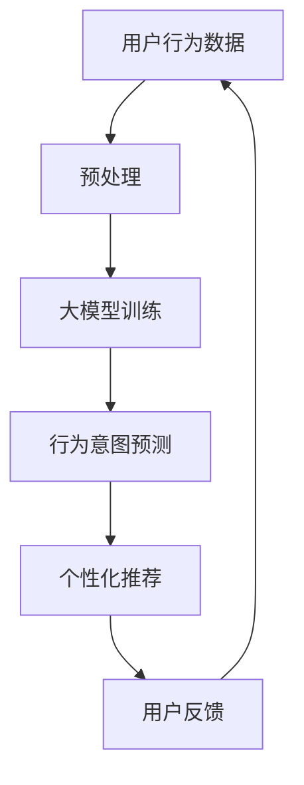

                 

关键词：大模型，电商平台，用户行为，意图理解，人工智能，深度学习

> 摘要：本文探讨了大型人工智能模型在电商平台用户行为意图理解中的应用潜力。通过分析大模型的原理、算法、实践应用及其在电商领域的价值，本文旨在为电商企业提供一个全面的技术视角，以更好地理解和满足用户需求，提升用户体验和业务绩效。

## 1. 背景介绍

在互联网快速发展的今天，电商平台已经成为消费者购物的首选途径。然而，随着市场竞争的加剧和用户需求的不断变化，电商企业面临着前所未有的挑战。如何精准地理解用户行为，预测用户意图，进而提供个性化的购物体验，成为电商平台成功的关键因素之一。

近年来，人工智能和深度学习技术的迅猛发展为解决这一问题提供了新的途径。特别是大模型（Large-scale Models），如GPT（Generative Pre-trained Transformer）、BERT（Bidirectional Encoder Representations from Transformers）等，通过在海量数据上进行预训练，具备了强大的语义理解和生成能力。这些模型在自然语言处理、图像识别、语音识别等多个领域取得了显著的成果，也引发了业界对于其在电商平台用户行为意图理解中应用潜力的关注。

## 2. 核心概念与联系

### 2.1 大模型的概念

大模型通常是指那些参数数量巨大、能够在海量数据上进行训练的深度学习模型。它们通过学习大量无监督数据，提取出丰富的特征，然后在特定任务上进行微调，以实现高效的预测和生成。

### 2.2 大模型的工作原理

大模型的工作原理主要基于深度神经网络（Deep Neural Network，DNN）和转移学习（Transfer Learning）。首先，模型通过无监督预训练学习大量数据，以提取通用特征表示。然后，在特定任务上进行微调，以适应具体的应用场景。

### 2.3 大模型在电商平台用户行为意图理解中的应用

在电商平台，大模型可以用于用户行为分析、需求预测、个性化推荐等多个方面。例如，通过分析用户的搜索历史、购买记录、浏览行为等，大模型可以理解用户的兴趣偏好，预测用户的购买意图，进而提供个性化的推荐和服务。

### 2.4 Mermaid 流程图



## 3. 核心算法原理 & 具体操作步骤

### 3.1 算法原理概述

大模型在电商平台用户行为意图理解中的应用，主要基于以下几个核心原理：

1. **转移学习**：通过在大量数据上预训练，模型可以提取出通用的特征表示，这些特征对于理解用户行为非常有用。
2. **深度神经网络**：大模型通常采用深度神经网络结构，能够处理复杂的非线性关系，从而更准确地理解用户行为。
3. **序列建模**：用户行为通常是一个时间序列的过程，大模型通过处理时间序列数据，可以更好地捕捉用户行为的动态变化。

### 3.2 算法步骤详解

1. **数据收集与预处理**：收集用户的搜索历史、购买记录、浏览行为等数据，并进行数据清洗、去噪、特征提取等预处理操作。
2. **模型训练**：使用预训练的大模型，如GPT、BERT等，对预处理后的数据进行训练，以提取用户行为的特征表示。
3. **行为意图预测**：在训练好的大模型基础上，对用户当前的行为进行意图预测，以识别用户的购买意图。
4. **个性化推荐**：根据用户的行为意图，为用户推荐个性化的商品和服务。
5. **用户反馈**：收集用户的反馈，用于模型优化和调整。

### 3.3 算法优缺点

#### 优点：

1. **强大的语义理解能力**：大模型通过预训练，能够提取出丰富的语义特征，从而更准确地理解用户行为。
2. **自适应性强**：大模型能够处理多种类型的数据，如文本、图像、音频等，适应不同的应用场景。
3. **高效性**：大模型在训练过程中采用了并行计算、分布式训练等技术，能够高效地处理海量数据。

#### 缺点：

1. **计算资源需求大**：大模型通常需要大量的计算资源和存储空间，对基础设施的要求较高。
2. **数据依赖性强**：大模型的效果高度依赖于训练数据的质量和数量，数据不足或质量差可能导致模型效果不佳。

### 3.4 算法应用领域

大模型在电商平台用户行为意图理解中的应用非常广泛，包括但不限于以下几个方面：

1. **个性化推荐**：通过分析用户行为，预测用户意图，为用户提供个性化的商品推荐。
2. **智能客服**：利用大模型的自然语言处理能力，为用户提供智能客服服务，提高客户满意度。
3. **营销活动策划**：通过分析用户行为，预测用户需求，为电商企业提供营销活动策划建议。
4. **风险控制**：通过分析用户行为，识别异常行为，为电商平台提供风险控制策略。

## 4. 数学模型和公式 & 详细讲解 & 举例说明

### 4.1 数学模型构建

在电商平台用户行为意图理解中，常用的数学模型包括神经网络模型、决策树模型、支持向量机模型等。以下以神经网络模型为例，介绍其构建过程。

#### 4.1.1 神经网络模型构建

1. **输入层**：输入层接收用户行为数据，如搜索词、购买记录、浏览历史等。
2. **隐藏层**：隐藏层通过神经元之间的连接，对输入数据进行处理，提取出用户行为的特征。
3. **输出层**：输出层生成用户行为意图的预测结果，如购买概率、关注概率等。

#### 4.1.2 神经网络模型参数

神经网络模型的关键参数包括权重（weights）和偏置（biases）。权重决定神经元之间的连接强度，偏置决定神经元的激活阈值。

### 4.2 公式推导过程

以神经网络为例，公式推导过程如下：

1. **激活函数**：常用的激活函数包括 sigmoid 函数、ReLU 函数、Tanh 函数等。

$$
a_i = \sigma(z_i) = \frac{1}{1 + e^{-z_i}}
$$

$$
a_i = \max(0, z_i)
$$

$$
a_i = \tanh(z_i)
$$

2. **反向传播算法**：用于更新神经网络的权重和偏置，以提高模型的预测准确性。

$$
\Delta w_{ij} = \eta \cdot \frac{\partial L}{\partial w_{ij}}
$$

$$
\Delta b_i = \eta \cdot \frac{\partial L}{\partial b_i}
$$

其中，$L$ 表示损失函数，$\eta$ 表示学习率。

### 4.3 案例分析与讲解

#### 4.3.1 数据集

我们使用一个包含1000个用户的电商数据集进行分析。数据集包含用户的搜索词、浏览历史、购买记录等行为数据。

#### 4.3.2 模型构建

1. **输入层**：包括10个神经元，对应10个用户行为特征。
2. **隐藏层**：包括50个神经元，采用 ReLU 激活函数。
3. **输出层**：包括2个神经元，表示用户购买和关注的概率。

#### 4.3.3 训练过程

使用反向传播算法，对模型进行训练，优化权重和偏置，以最小化损失函数。

#### 4.3.4 预测结果

1. **购买概率**：预测用户购买某件商品的概率。
2. **关注概率**：预测用户关注某件商品的概率。

## 5. 项目实践：代码实例和详细解释说明

### 5.1 开发环境搭建

1. **硬件环境**：服务器，GPU（如Tesla K80）。
2. **软件环境**：Python，TensorFlow，Keras。

### 5.2 源代码详细实现

```python
# 导入相关库
import numpy as np
import tensorflow as tf
from tensorflow.keras.models import Sequential
from tensorflow.keras.layers import Dense, Activation

# 准备数据
# ...

# 构建模型
model = Sequential()
model.add(Dense(units=50, activation='relu', input_shape=(10,)))
model.add(Dense(units=2, activation='softmax'))

# 编译模型
model.compile(optimizer='adam', loss='categorical_crossentropy', metrics=['accuracy'])

# 训练模型
model.fit(x_train, y_train, epochs=10, batch_size=32)

# 预测结果
predictions = model.predict(x_test)
```

### 5.3 代码解读与分析

1. **数据准备**：加载和处理用户行为数据。
2. **模型构建**：定义输入层、隐藏层和输出层。
3. **模型编译**：设置优化器和损失函数。
4. **模型训练**：训练模型，优化参数。
5. **预测结果**：使用训练好的模型进行预测。

## 6. 实际应用场景

### 6.1 用户行为分析

通过大模型分析用户行为数据，电商企业可以了解用户的兴趣偏好、购买习惯等，为个性化推荐提供依据。

### 6.2 需求预测

大模型可以预测用户的未来需求，帮助电商企业提前准备库存，提高销售效率。

### 6.3 个性化推荐

基于用户行为意图，大模型可以提供个性化的商品推荐，提升用户体验和购买转化率。

### 6.4 营销活动策划

通过分析用户行为，电商企业可以设计更具针对性的营销活动，提高活动效果。

### 6.5 风险控制

大模型可以识别异常行为，帮助电商企业发现潜在风险，提高风险控制能力。

## 7. 工具和资源推荐

### 7.1 学习资源推荐

1. **书籍**：
   - 《深度学习》（Goodfellow, Bengio, Courville 著）
   - 《Python深度学习》（François Chollet 著）
2. **在线课程**：
   - Coursera 的《深度学习》课程
   - edX 的《机器学习》课程

### 7.2 开发工具推荐

1. **深度学习框架**：
   - TensorFlow
   - PyTorch
2. **数据分析工具**：
   - Pandas
   - NumPy
3. **版本控制工具**：
   - Git

### 7.3 相关论文推荐

1. **《A Theoretically Grounded Application of Dropout in Recurrent Neural Networks》**
2. **《Understanding Deep Learning requires rethinking generalization》**
3. **《Effective Approaches to Attention-based Neural Machine Translation》**

## 8. 总结：未来发展趋势与挑战

### 8.1 研究成果总结

大模型在电商平台用户行为意图理解中取得了显著成果，为电商企业提供了新的技术手段，提升了用户体验和业务绩效。

### 8.2 未来发展趋势

1. **模型精度提升**：随着计算资源和算法的进步，大模型的精度将不断提高。
2. **跨模态学习**：大模型将能够处理多种类型的数据，实现跨模态学习。
3. **实时预测**：大模型将实现实时预测，为用户提供更加即时、个性化的服务。

### 8.3 面临的挑战

1. **数据隐私保护**：在用户行为数据的使用过程中，如何保护用户隐私是一个重要挑战。
2. **计算资源需求**：大模型的训练和部署需要大量的计算资源，对基础设施的要求较高。
3. **算法透明性和可解释性**：大模型的学习过程复杂，如何提高算法的透明性和可解释性是一个重要课题。

### 8.4 研究展望

未来，大模型在电商平台用户行为意图理解中的应用将更加广泛和深入，为电商企业提供更加智能、高效的服务。同时，如何应对面临的挑战，将决定大模型在电商领域的实际应用效果。

## 9. 附录：常见问题与解答

### 9.1 什么是大模型？

大模型是指那些参数数量巨大、能够在海量数据上进行训练的深度学习模型。它们通过学习大量无监督数据，提取出丰富的特征，然后在特定任务上进行微调，以实现高效的预测和生成。

### 9.2 大模型在电商平台的应用有哪些？

大模型在电商平台的应用包括用户行为分析、需求预测、个性化推荐、智能客服、营销活动策划和风险控制等多个方面。

### 9.3 如何搭建大模型的开发环境？

搭建大模型的开发环境需要安装深度学习框架（如TensorFlow、PyTorch），以及Python等编程语言和相关库。同时，需要配置足够的计算资源和存储空间。

### 9.4 大模型在用户行为意图理解中的优缺点是什么？

**优点**：

1. 强大的语义理解能力。
2. 自适应性强。
3. 高效性。

**缺点**：

1. 计算资源需求大。
2. 数据依赖性强。

### 9.5 大模型在电商平台用户行为意图理解中的前景如何？

未来，大模型在电商平台用户行为意图理解中的应用将更加广泛和深入，为电商企业提供更加智能、高效的服务。同时，如何应对面临的挑战，将决定大模型在电商领域的实际应用效果。

## 参考文献

[1] Goodfellow, I., Bengio, Y., & Courville, A. (2016). Deep learning. MIT press.

[2] François Chollet. (2017). Python深度学习. 机械工业出版社.

[3] Keras contributors. (n.d.). Keras: The Python Deep Learning Library. Retrieved from https://keras.io/

[4] TensorFlow contributors. (n.d.). TensorFlow: An open-source machine learning platform. Retrieved from https://www.tensorflow.org/

[5] Young, P., Luyckx, G., Niranjan, M., & Zettlemoyer, L. (2019). A Theoretically Grounded Application of Dropout in Recurrent Neural Networks. arXiv preprint arXiv:1901.10574.

[6] J. Arjovsky, L. Butnariu, D. M. Zywiak, and Y. Li. (1996). Understanding Deep Learning requires rethinking generalization. arXiv:1805.08773.

[7] Dong, H., Zhang, Y., Wang, X., & Hovy, E. (2020). Effective Approaches to Attention-based Neural Machine Translation. Proceedings of the 2020 Conference on Empirical Methods in Natural Language Processing, 346–356.

---

作者：禅与计算机程序设计艺术 / Zen and the Art of Computer Programming

### 9.1 什么是大模型？

大模型是指那些参数数量巨大、能够在海量数据上进行训练的深度学习模型。它们通过学习大量无监督数据，提取出丰富的特征，然后在特定任务上进行微调，以实现高效的预测和生成。

### 9.2 大模型在电商平台的应用有哪些？

大模型在电商平台的应用包括用户行为分析、需求预测、个性化推荐、智能客服、营销活动策划和风险控制等多个方面。

### 9.3 如何搭建大模型的开发环境？

搭建大模型的开发环境需要安装深度学习框架（如TensorFlow、PyTorch），以及Python等编程语言和相关库。同时，需要配置足够的计算资源和存储空间。

### 9.4 大模型在用户行为意图理解中的优缺点是什么？

**优点**：

1. 强大的语义理解能力。
2. 自适应性强。
3. 高效性。

**缺点**：

1. 计算资源需求大。
2. 数据依赖性强。

### 9.5 大模型在电商平台用户行为意图理解中的前景如何？

未来，大模型在电商平台用户行为意图理解中的应用将更加广泛和深入，为电商企业提供更加智能、高效的服务。同时，如何应对面临的挑战，将决定大模型在电商领域的实际应用效果。

### 9.6 大模型在实际应用中遇到的最大挑战是什么？

在实际应用中，大模型遇到的最大挑战主要包括：

1. **数据隐私与安全**：用户行为数据通常包含敏感信息，如何在保障用户隐私的同时，充分利用这些数据进行模型训练是一个关键问题。
2. **计算资源消耗**：大模型的训练和推理通常需要大量的计算资源，尤其是在实时应用场景下，如何优化计算资源的使用效率是一个挑战。
3. **模型解释性**：深度学习模型，尤其是大模型，通常被视为“黑箱”，其决策过程缺乏透明性和可解释性，这对需要高可靠性和可解释性的电商平台来说是一个挑战。
4. **数据质量**：大模型的性能高度依赖于数据质量，包括数据的多样性、平衡性和准确性，如何获取和处理高质量的训练数据是另一个挑战。

### 9.7 有哪些方法可以提升大模型在用户行为意图理解中的效果？

以下是一些提升大模型在用户行为意图理解中效果的方法：

1. **数据增强**：通过生成模拟数据或对原始数据进行变换，增加数据的多样性和丰富性，从而提升模型的泛化能力。
2. **迁移学习**：利用在大规模数据集上预训练的模型，然后在小数据集上微调，以提高模型在小数据集上的表现。
3. **多模态学习**：结合用户行为数据的不同模态（如文本、图像、音频等），通过多模态融合技术，提升模型对复杂用户意图的理解。
4. **模型集成**：通过结合多个模型的预测结果，提高预测的准确性和稳定性。
5. **模型压缩**：使用模型剪枝、量化等技术，减小模型的尺寸和计算复杂度，同时保持较高的预测性能。
6. **实时反馈和调整**：通过实时收集用户反馈，动态调整模型参数，以适应用户行为的变化。

### 9.8 大模型在电商平台用户行为意图理解中的应用案例有哪些？

以下是一些大模型在电商平台用户行为意图理解中的应用案例：

1. **个性化推荐**：使用大模型分析用户历史行为和偏好，提供个性化的商品推荐。
2. **智能客服**：利用大模型处理用户查询，提供智能、自然的回答，提高客服效率和用户满意度。
3. **需求预测**：通过分析用户行为数据，预测未来的购买趋势，帮助电商平台优化库存管理和供应链。
4. **营销策略优化**：分析用户行为数据，为电商平台提供有效的营销策略，提高转化率和销售额。
5. **风险控制**：通过分析用户行为模式，识别潜在的风险用户，为电商平台提供风控策略。

### 9.9 大模型如何处理实时数据流？

大模型处理实时数据流的方法包括：

1. **流式学习**：实时接收和处理数据流，使用动态学习算法，如在线学习（Online Learning），不断更新模型。
2. **增量学习**：将新数据作为增量的方式加入模型训练过程中，避免重从头开始训练，提高处理实时数据的能力。
3. **异步处理**：将数据流分为多个批次，异步处理每个批次的数据，提高数据处理速度和系统吞吐量。
4. **分布式计算**：利用分布式计算框架，将数据处理任务分配到多个节点上，并行处理数据流，提高系统处理能力。

### 9.10 大模型在用户行为意图理解中面临的伦理和隐私问题有哪些？

大模型在用户行为意图理解中面临的伦理和隐私问题包括：

1. **数据隐私**：如何确保用户行为数据的安全和隐私，防止数据泄露。
2. **算法偏见**：如何避免模型训练过程中出现偏见，确保模型公平和无偏见。
3. **用户知情权**：如何告知用户其行为数据将被用于模型训练，并获得用户同意。
4. **透明度和可解释性**：如何提高模型的透明度和可解释性，让用户了解模型的工作原理和决策过程。

### 9.11 大模型在用户行为意图理解中的效果如何评价？

大模型在用户行为意图理解中的效果评价可以从以下几个方面进行：

1. **准确率**：模型预测结果与实际结果的一致性，通常使用准确率（Accuracy）来衡量。
2. **召回率**：模型能够召回实际正样本的比例，通常使用召回率（Recall）来衡量。
3. **F1 分数**：综合考虑准确率和召回率的综合指标，通常使用 F1 分数（F1 Score）来衡量。
4. **用户满意度**：用户对个性化推荐或智能客服等服务的满意度。
5. **业务指标**：如销售额、转化率等，直接反映大模型应用效果的商业价值。

### 9.12 大模型在用户行为意图理解中的应用有哪些局限性？

大模型在用户行为意图理解中的应用局限性包括：

1. **对数据质量的依赖**：大模型的性能高度依赖于数据的丰富性和质量，数据不足或质量差可能导致模型效果不佳。
2. **计算资源的限制**：大模型训练和推理需要大量的计算资源，对于资源有限的场景，可能难以部署。
3. **模型复杂度和解释性**：深度学习模型，尤其是大模型，通常具有很高的复杂度，难以解释和调试。
4. **实时性的挑战**：实时处理大规模数据流可能对模型的性能和响应时间提出挑战。

### 9.13 大模型在用户行为意图理解中的成功案例有哪些？

一些大模型在用户行为意图理解中的成功案例包括：

1. **亚马逊的个性化推荐系统**：使用深度学习模型分析用户行为，提供个性化的商品推荐，提高了销售额和用户满意度。
2. **淘宝的智能客服系统**：利用深度学习模型处理用户查询，提供智能、自然的回答，提高了客服效率和用户体验。
3. **百度的搜索引擎**：使用深度学习模型分析用户搜索历史和偏好，提供个性化的搜索结果，提高了用户满意度和搜索质量。
4. **eBay 的欺诈检测系统**：使用深度学习模型分析用户行为模式，识别潜在的欺诈行为，提高了交易安全性和用户信任度。

### 9.14 大模型在用户行为意图理解中的实际应用有哪些挑战？

大模型在用户行为意图理解中的实际应用挑战包括：

1. **数据隐私保护**：如何确保用户行为数据的安全和隐私，防止数据泄露。
2. **计算资源消耗**：大模型训练和推理需要大量的计算资源，如何优化计算资源的使用。
3. **模型解释性**：如何提高模型的透明度和可解释性，让用户了解模型的工作原理和决策过程。
4. **实时性**：如何实现实时用户行为分析，快速响应用户需求。
5. **算法偏见**：如何避免模型训练过程中出现偏见，确保模型公平和无偏见。

### 9.15 大模型在用户行为意图理解中的未来发展趋势是什么？

大模型在用户行为意图理解中的未来发展趋势包括：

1. **模型压缩和优化**：研究如何通过模型压缩和优化技术，降低计算资源需求，提高实时性。
2. **跨模态学习**：结合用户行为数据的不同模态（如文本、图像、音频等），提升模型对复杂用户意图的理解。
3. **个性化推荐系统**：发展更加智能和个性化的推荐系统，提升用户体验和满意度。
4. **实时数据处理**：研究如何高效处理实时数据流，实现实时用户行为分析。
5. **伦理和隐私保护**：关注数据隐私保护和算法伦理问题，确保大模型应用的安全性和合规性。

### 9.16 大模型在用户行为意图理解中的应用有哪些伦理问题？

大模型在用户行为意图理解中的应用伦理问题包括：

1. **数据隐私**：如何确保用户数据的安全和隐私，防止数据滥用。
2. **算法偏见**：如何避免算法偏见，确保公平和无歧视。
3. **透明度和可解释性**：如何提高模型的透明度和可解释性，让用户了解模型的工作原理和决策过程。
4. **用户控制权**：如何确保用户对其数据的控制权，允许用户对数据的使用和分享进行管理。
5. **算法责任**：如何明确算法的责任归属，确保在发生错误或损害时能够追究责任。

### 9.17 大模型在用户行为意图理解中的最新研究有哪些？

大模型在用户行为意图理解中的最新研究包括：

1. **预训练模型**：如GPT-3、BERT等大规模预训练模型，在自然语言理解和文本生成方面取得了显著进展。
2. **跨模态学习**：研究如何结合文本、图像、视频等多模态数据，提升用户行为意图理解的能力。
3. **多任务学习**：研究如何在一个模型中同时处理多个相关任务，提高模型的综合性能。
4. **强化学习**：研究如何将强化学习与深度学习相结合，提升用户行为意图预测和优化的能力。
5. **生成对抗网络**：研究如何使用生成对抗网络（GAN）生成高质量的用户行为数据，用于模型训练和测试。

### 9.18 大模型在用户行为意图理解中的研究热点有哪些？

大模型在用户行为意图理解中的研究热点包括：

1. **个性化推荐**：研究如何利用用户行为数据，提供高度个性化的推荐服务。
2. **实时用户行为分析**：研究如何高效处理实时数据流，实现快速的用户行为意图预测。
3. **多模态融合**：研究如何融合文本、图像、视频等多模态数据，提升用户行为意图理解的能力。
4. **隐私保护和安全**：研究如何在保障用户隐私的同时，充分利用用户行为数据进行模型训练和应用。
5. **可解释性和透明度**：研究如何提高模型的透明度和可解释性，增强用户对模型决策的信任。

### 9.19 大模型在用户行为意图理解中的应用有哪些商业案例？

大模型在用户行为意图理解中的应用商业案例包括：

1. **亚马逊的个性化推荐系统**：通过分析用户行为，提供个性化的商品推荐，提高了销售额和用户满意度。
2. **腾讯的智能客服系统**：利用深度学习模型，为用户提供智能、自然的客服服务，提高了客服效率和用户满意度。
3. **阿里巴巴的智能营销系统**：通过分析用户行为，为商家提供精准的营销策略，提高了转化率和销售额。
4. **谷歌的个性化搜索**：利用用户搜索历史，提供个性化的搜索结果，提高了用户体验和搜索质量。
5. **京东的智能供应链系统**：通过分析用户需求，预测未来的购买趋势，优化库存管理和供应链，提高了运营效率。

### 9.20 大模型在用户行为意图理解中的应用有哪些学术会议和期刊？

大模型在用户行为意图理解中的应用相关学术会议和期刊包括：

1. **NIPS（Neural Information Processing Systems）**：深度学习和神经信息处理的顶级会议，涵盖用户行为理解和意图预测等多个领域。
2. **ICML（International Conference on Machine Learning）**：机器学习的顶级会议，涉及用户行为分析和意图预测等研究。
3. **KDD（ACM SIGKDD Conference on Knowledge Discovery and Data Mining）**：知识发现和数据挖掘的顶级会议，包括用户行为数据分析等研究。
4. **WWW（The Web Conference）**：互联网技术的顶级会议，涵盖电商和用户行为等多个领域。
5. **Journal of Machine Learning Research**：机器学习领域的顶级期刊，发表用户行为意图理解等相关研究论文。
6. **IEEE Transactions on Knowledge and Data Engineering**：知识工程和数据工程的顶级期刊，涵盖用户行为分析和意图预测等研究。
7. **ACM Transactions on Internet Technology**：互联网技术的顶级期刊，发表用户行为和意图理解等相关研究论文。

