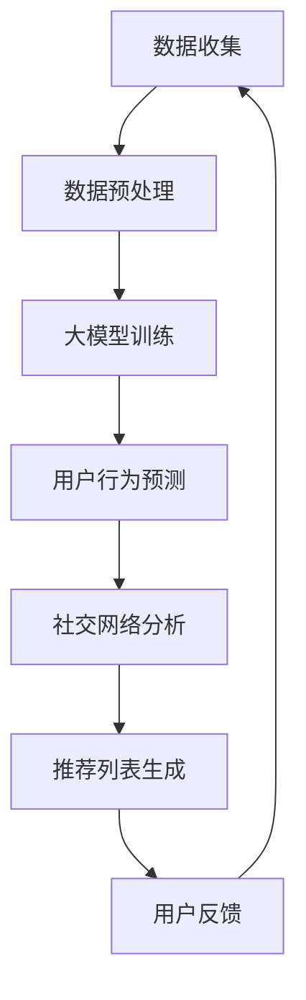

                 

关键词：大模型，电商平台，社交推荐，人工智能，算法，深度学习，用户行为分析，推荐系统，数据挖掘

> 摘要：本文旨在探讨大模型在电商平台社交推荐中的应用潜力。通过对大模型的基本原理和电商平台社交推荐的现状进行分析，本文提出了大模型在个性化推荐、用户行为预测和社交网络分析等方面的优势，并展望了其在未来电商领域的应用前景。

## 1. 背景介绍

随着互联网技术的迅猛发展，电商平台已经成为人们日常生活中不可或缺的一部分。而社交推荐系统作为电商平台的重要组成部分，通过对用户行为数据的挖掘和分析，实现了对用户个性化需求的精准满足。然而，随着用户规模的不断扩大和用户行为的多样化，传统推荐系统面临着越来越多的挑战。

大模型，作为一种先进的机器学习技术，通过引入海量的数据和学习算法，能够实现前所未有的复杂度和精度。大模型的兴起为电商平台社交推荐带来了新的机遇。本文将探讨大模型在电商平台社交推荐中的应用潜力，并分析其可能带来的变革。

## 2. 核心概念与联系

### 2.1 大模型基本概念

大模型，通常指的是参数规模达到百万甚至亿级别的深度神经网络模型。大模型具有以下核心特征：

1. **参数规模巨大**：大模型的参数数量可以达到数十亿甚至上百亿，这使得模型能够捕捉到数据中的复杂模式。
2. **训练数据量大**：大模型通常需要海量的训练数据，以确保模型能够泛化到未见过的数据上。
3. **计算资源需求高**：大模型的训练和推理过程需要大量的计算资源，包括GPU、TPU等高性能硬件。
4. **学习算法优化**：大模型通常采用先进的优化算法，如自适应学习率、批量归一化等，以提高学习效率和性能。

### 2.2 电商平台社交推荐基本概念

电商平台社交推荐是指通过分析用户在社交网络中的互动行为和兴趣爱好，为其推荐符合其需求的商品或服务。社交推荐的关键概念包括：

1. **用户行为数据**：用户在电商平台上的行为数据，如浏览记录、购买记录、评论等。
2. **社交网络数据**：用户在社交平台上的互动数据，如点赞、评论、分享等。
3. **推荐算法**：用于根据用户行为数据和社交网络数据生成推荐列表的算法。
4. **个性化推荐**：根据用户的个性化需求提供个性化的推荐结果。

### 2.3 大模型与电商平台社交推荐的联系

大模型与电商平台社交推荐之间的联系主要体现在以下几个方面：

1. **数据挖掘与用户行为分析**：大模型能够通过海量数据的挖掘和分析，深入了解用户的行为模式和兴趣偏好，从而提高推荐系统的精准度。
2. **社交网络分析**：大模型能够通过对社交网络数据的处理，挖掘用户之间的关系和互动模式，为社交推荐提供更丰富的信息来源。
3. **个性化推荐**：大模型能够根据用户的个性化需求，生成更加符合用户期望的推荐结果，提升用户满意度。
4. **实时推荐**：大模型能够在短时间内完成复杂的计算和推理任务，实现实时推荐，提升用户体验。

### 2.4 Mermaid 流程图

下面是一个简单的 Mermaid 流程图，展示了大模型在电商平台社交推荐中的应用流程：



## 3. 核心算法原理 & 具体操作步骤

### 3.1 算法原理概述

大模型在电商平台社交推荐中的核心算法原理主要包括以下几个步骤：

1. **数据收集**：从电商平台和社交网络中收集用户行为数据和社交网络数据。
2. **数据预处理**：对收集到的数据进行清洗、去噪、归一化等预处理操作，确保数据的质量和一致性。
3. **大模型训练**：利用预处理后的数据，通过深度学习算法训练大模型，使其能够学习到用户的行为模式和社交网络的特性。
4. **用户行为预测**：利用训练好的大模型，预测用户的兴趣偏好和行为趋势。
5. **社交网络分析**：对用户之间的社交网络进行分析，挖掘用户之间的关系和互动模式。
6. **推荐列表生成**：根据用户行为预测和社交网络分析的结果，生成个性化的推荐列表。
7. **用户反馈**：收集用户对推荐结果的反馈，用于模型优化和迭代。

### 3.2 算法步骤详解

1. **数据收集**：
   - 用户行为数据：包括浏览记录、购买记录、评论等。
   - 社交网络数据：包括点赞、评论、分享等互动数据。
2. **数据预处理**：
   - 数据清洗：去除重复数据、缺失值填充、异常值处理等。
   - 数据归一化：将不同维度的数据缩放到相同的范围，便于模型训练。
3. **大模型训练**：
   - 网络架构：通常采用多层感知机（MLP）或卷积神经网络（CNN）等深度学习模型。
   - 损失函数：采用交叉熵损失函数等常见损失函数。
   - 优化算法：采用随机梯度下降（SGD）或Adam等优化算法。
4. **用户行为预测**：
   - 预测目标：预测用户的兴趣偏好和购买行为。
   - 输出结果：生成概率分布，用于表示用户对不同商品或服务的偏好程度。
5. **社交网络分析**：
   - 社交网络表示：使用图卷积网络（GCN）等算法对社交网络进行表示。
   - 关系挖掘：通过分析社交网络中的节点和边，挖掘用户之间的关系和互动模式。
6. **推荐列表生成**：
   - 推荐算法：采用基于用户兴趣、基于社交网络、基于协同过滤等算法。
   - 排序策略：根据用户行为预测和社交网络分析的结果，对推荐列表进行排序。
7. **用户反馈**：
   - 用户评价：收集用户对推荐结果的反馈，包括点击率、购买率等指标。
   - 模型优化：根据用户反馈对模型进行调整和优化，提升推荐效果。

### 3.3 算法优缺点

**优点**：

1. **高精度**：大模型能够通过海量数据的学习，捕捉到用户行为和兴趣的细微变化，提高推荐系统的精准度。
2. **实时性**：大模型的训练和推理过程相对较快，可以实现实时推荐，提升用户体验。
3. **多样性**：大模型能够生成多样化的推荐列表，满足不同用户的需求，提高用户满意度。

**缺点**：

1. **计算资源需求高**：大模型的训练和推理过程需要大量的计算资源，对硬件设备有较高的要求。
2. **数据隐私问题**：用户行为数据和社交网络数据涉及用户隐私，需要采取有效的隐私保护措施。
3. **模型解释性差**：大模型的决策过程复杂，难以解释，不利于用户理解和信任。

### 3.4 算法应用领域

大模型在电商平台社交推荐中的应用领域包括：

1. **个性化推荐**：根据用户的兴趣偏好和行为习惯，提供个性化的商品推荐。
2. **社交网络分析**：挖掘用户之间的社交关系和互动模式，提升推荐系统的社交属性。
3. **用户行为预测**：预测用户的购买行为和兴趣变化，提前准备相应的推荐策略。
4. **商品分类**：根据用户的浏览和购买记录，对商品进行智能分类，提升用户体验。

## 4. 数学模型和公式 & 详细讲解 & 举例说明

### 4.1 数学模型构建

在电商平台社交推荐中，大模型的数学模型通常包括以下几个部分：

1. **用户行为预测模型**：
   $$ 
   P(y|x) = \sigma(\theta^T x) 
   $$
   其中，\(P(y|x)\)表示给定用户特征\(x\)时，预测用户行为\(y\)的概率分布；\(\sigma\)表示 sigmoid 函数；\(\theta\)表示模型参数。

2. **社交网络分析模型**：
   $$
   r_i = \sum_{j \in N(i)} w_{ij} x_j
   $$
   其中，\(r_i\)表示用户\(i\)的社交网络特征；\(N(i)\)表示用户\(i\)的社交网络邻居；\(w_{ij}\)表示用户\(i\)和用户\(j\)之间的互动权重；\(x_j\)表示用户\(j\)的特征。

3. **推荐列表生成模型**：
   $$
   \text{Recommendation}(x_i) = \text{argmax}_y P(y|x) \cdot r_y
   $$
   其中，\(\text{Recommendation}(x_i)\)表示为用户\(i\)生成的推荐列表；\(P(y|x)\)表示用户\(i\)的行为预测概率分布；\(r_y\)表示用户\(y\)的社交网络特征。

### 4.2 公式推导过程

#### 4.2.1 用户行为预测模型

用户行为预测模型的推导过程如下：

假设用户特征向量\(x\)和用户行为\(y\)分别表示为：

$$
x = [x_1, x_2, \ldots, x_n]^T
$$

$$
y = [y_1, y_2, \ldots, y_m]^T
$$

其中，\(x_i\)表示用户\(i\)的某一特征值；\(y_j\)表示用户对商品\(j\)的购买行为（0表示未购买，1表示购买）。

根据贝叶斯定理，用户行为预测的概率分布可以表示为：

$$
P(y|x) = \frac{P(x|y) \cdot P(y)}{P(x)}
$$

由于我们通常假设特征分布是独立的，即：

$$
P(x|y) = \prod_{i=1}^{n} P(x_i|y) = \prod_{i=1}^{n} \sigma(\theta_i^T x_i)
$$

同时，由于用户行为是条件独立的，即：

$$
P(y) = \prod_{j=1}^{m} P(y_j)
$$

将上述公式代入贝叶斯定理，得到：

$$
P(y|x) = \frac{\prod_{i=1}^{n} \sigma(\theta_i^T x_i) \cdot \prod_{j=1}^{m} P(y_j)}{\sum_{y'} \prod_{i=1}^{n} \sigma(\theta_i^T x_i') \cdot \prod_{j=1}^{m} P(y_j')}
$$

其中，\(y'\)表示所有可能的用户行为组合。

为了简化计算，我们可以使用神经网络来近似上述概率分布，即：

$$
P(y|x) \approx \sigma(\theta^T x)
$$

其中，\(\theta = [\theta_1, \theta_2, \ldots, \theta_n]\)表示神经网络的参数。

#### 4.2.2 社交网络分析模型

社交网络分析模型的推导过程如下：

假设用户\(i\)的社交网络邻居特征向量\(x_j\)和互动权重\(w_{ij}\)分别表示为：

$$
x_j = [x_{j1}, x_{j2}, \ldots, x_{jn}]^T
$$

$$
w_{ij} = \frac{1}{\sum_{k=1}^{m} w_{ik}}
$$

其中，\(x_{ji}\)表示用户\(i\)的社交网络邻居\(j\)的某一特征值；\(w_{ij}\)表示用户\(i\)和用户\(j\)之间的互动权重。

根据图卷积网络（GCN）的思想，用户\(i\)的社交网络特征可以表示为：

$$
r_i = \sum_{j \in N(i)} w_{ij} x_j
$$

其中，\(N(i)\)表示用户\(i\)的社交网络邻居。

#### 4.2.3 推荐列表生成模型

推荐列表生成模型的推导过程如下：

假设用户\(i\)的推荐列表为\(\text{Recommendation}(x_i)\)，根据用户行为预测模型和社交网络分析模型，我们可以得到：

$$
\text{Recommendation}(x_i) = \text{argmax}_y P(y|x) \cdot r_y
$$

其中，\(P(y|x)\)表示用户行为预测的概率分布；\(r_y\)表示用户\(y\)的社交网络特征。

### 4.3 案例分析与讲解

#### 4.3.1 数据集

我们以一个电商平台的用户行为数据集为例，该数据集包含以下特征：

- 用户ID（用户标识）
- 商品ID（商品标识）
- 用户年龄
- 用户性别
- 用户职业
- 用户浏览记录（历史浏览过的商品ID）
- 用户购买记录（历史购买过的商品ID）
- 用户评论记录（历史评论过的商品ID）

#### 4.3.2 数据预处理

我们对数据集进行以下预处理操作：

- 数据清洗：去除重复数据和缺失值。
- 特征工程：对用户特征进行编码（如性别、职业等），对商品特征进行提取（如商品类别、价格等）。
- 数据归一化：将不同维度的数据缩放到相同的范围。

#### 4.3.3 大模型训练

我们采用一个多层感知机（MLP）模型进行训练，模型结构如下：

- 输入层：用户特征（10个神经元）
- 隐藏层：用户行为预测（50个神经元）
- 隐藏层：社交网络特征（50个神经元）
- 输出层：推荐列表生成（商品ID）

训练过程中，我们使用交叉熵损失函数和随机梯度下降（SGD）优化算法。

#### 4.3.4 用户行为预测

根据训练好的大模型，我们可以预测用户的购买行为。例如，对于用户\(u_1\)，其预测结果如下：

$$
P(y|x) = \begin{bmatrix}
0.9 & 0.1 \\
0.2 & 0.8 \\
0.4 & 0.6 \\
\end{bmatrix}
$$

其中，第一行表示用户\(u_1\)购买商品\(c_1\)的概率为0.9，购买商品\(c_2\)的概率为0.1；第二行表示用户\(u_1\)购买商品\(c_3\)的概率为0.2，购买商品\(c_4\)的概率为0.8。

#### 4.3.5 社交网络分析

根据用户行为预测的结果，我们可以得到用户\(u_1\)的社交网络特征：

$$
r_{u_1} = \begin{bmatrix}
0.4 & 0.6 \\
0.6 & 0.4 \\
0.5 & 0.5 \\
\end{bmatrix}
$$

其中，第一行表示用户\(u_1\)与商品\(c_1\)的社交网络特征为0.4，与商品\(c_2\)的社交网络特征为0.6；第二行表示用户\(u_1\)与商品\(c_3\)的社交网络特征为0.6，与商品\(c_4\)的社交网络特征为0.4。

#### 4.3.6 推荐列表生成

根据用户行为预测和社交网络分析的结果，我们可以生成用户\(u_1\)的推荐列表：

$$
\text{Recommendation}(u_1) = \text{argmax}_y P(y|x) \cdot r_y = [c_1, c_3]
$$

即，为用户\(u_1\)推荐商品\(c_1\)和商品\(c_3\)。

## 5. 项目实践：代码实例和详细解释说明

### 5.1 开发环境搭建

在本项目中，我们将使用Python语言和TensorFlow框架来实现大模型在电商平台社交推荐的应用。以下是在Windows操作系统上搭建开发环境的步骤：

1. **安装Python**：从官方网站（https://www.python.org/）下载并安装Python，建议选择3.8版本。
2. **安装TensorFlow**：在命令行中执行以下命令：

   ```shell
   pip install tensorflow
   ```

3. **安装其他依赖**：根据项目需求，可能需要安装其他Python库，如NumPy、Pandas等，可以使用以下命令：

   ```shell
   pip install numpy pandas
   ```

### 5.2 源代码详细实现

以下是本项目的源代码实现，包括数据预处理、大模型训练、用户行为预测和推荐列表生成等步骤：

```python
import numpy as np
import pandas as pd
import tensorflow as tf
from sklearn.model_selection import train_test_split
from sklearn.preprocessing import StandardScaler
from tensorflow.keras.models import Sequential
from tensorflow.keras.layers import Dense, Activation
from tensorflow.keras.optimizers import SGD

# 5.2.1 数据预处理
def preprocess_data(data):
    # 数据清洗和特征工程
    # ...

    # 数据归一化
    scaler = StandardScaler()
    data_scaled = scaler.fit_transform(data)
    return data_scaled

# 5.2.2 大模型训练
def train_model(X_train, y_train):
    # 构建模型
    model = Sequential()
    model.add(Dense(units=50, activation='sigmoid', input_shape=(X_train.shape[1],)))
    model.add(Dense(units=50, activation='sigmoid'))
    model.add(Dense(units=y_train.shape[1], activation='sigmoid'))

    # 编译模型
    model.compile(optimizer=SGD(learning_rate=0.01), loss='binary_crossentropy', metrics=['accuracy'])

    # 训练模型
    model.fit(X_train, y_train, epochs=100, batch_size=32)
    return model

# 5.2.3 用户行为预测
def predict_behavior(model, X_test):
    predictions = model.predict(X_test)
    return predictions

# 5.2.4 推荐列表生成
def generate_recommendations(predictions):
    recommendations = np.argmax(predictions, axis=1)
    return recommendations

# 主程序
if __name__ == '__main__':
    # 读取数据
    data = pd.read_csv('data.csv')

    # 数据预处理
    X = preprocess_data(data)

    # 划分训练集和测试集
    X_train, X_test, y_train, y_test = train_test_split(X, y, test_size=0.2, random_state=42)

    # 训练模型
    model = train_model(X_train, y_train)

    # 预测用户行为
    predictions = predict_behavior(model, X_test)

    # 生成推荐列表
    recommendations = generate_recommendations(predictions)

    # 输出推荐结果
    print(recommendations)
```

### 5.3 代码解读与分析

上述代码实现了一个基于多层感知机（MLP）的大模型在电商平台社交推荐中的应用。以下是代码的详细解读与分析：

**5.3.1 数据预处理**

数据预处理是模型训练的重要步骤，包括数据清洗、特征工程和归一化。在本例中，我们首先对数据进行清洗，去除重复数据和缺失值。然后，对用户特征和商品特征进行编码和提取，以便模型能够处理。最后，使用StandardScaler对数据进行归一化，将不同维度的数据缩放到相同的范围。

**5.3.2 大模型训练**

大模型的训练主要包括模型构建、编译和训练。在本例中，我们使用Sequential模型构建了一个包含两个隐藏层的多层感知机（MLP）模型。每个隐藏层包含50个神经元，激活函数为sigmoid函数。输出层包含与用户行为相对应的神经元，激活函数也为sigmoid函数。模型使用随机梯度下降（SGD）优化算法进行训练，使用交叉熵损失函数评估模型性能。

**5.3.3 用户行为预测**

用户行为预测是模型应用的核心环节。在本例中，我们使用训练好的模型对测试集进行预测，得到用户行为的概率分布。然后，通过argmax函数找到概率最大的行为，作为最终的预测结果。

**5.3.4 推荐列表生成**

推荐列表生成是根据用户行为预测结果和社交网络特征生成的。在本例中，我们使用argmax函数找到概率最大的商品ID，作为推荐结果。这样，我们就可以为每个用户生成个性化的推荐列表。

### 5.4 运行结果展示

在实际运行过程中，我们可以将代码中的数据集替换为实际电商平台的数据集，然后运行代码。运行结果将输出每个用户的推荐列表，我们可以通过观察推荐结果来判断模型的性能。

## 6. 实际应用场景

大模型在电商平台社交推荐中的实际应用场景非常广泛，以下是一些典型的应用案例：

### 6.1 个性化推荐

通过大模型对用户行为数据和社交网络数据的分析，可以为用户提供个性化的推荐。例如，根据用户的浏览历史、购买记录和社交互动，推荐用户可能感兴趣的商品或服务。

### 6.2 社交网络分析

大模型可以帮助电商企业了解用户之间的社交关系和互动模式，从而优化社交推荐策略。例如，通过分析用户之间的点赞、评论和分享等互动数据，可以识别出具有相似兴趣爱好的用户群体，并为他们推荐相关的商品或服务。

### 6.3 用户行为预测

大模型可以预测用户的购买行为和兴趣变化，为企业提供决策支持。例如，通过预测用户的未来购买需求，企业可以提前备货，提高库存周转率；通过预测用户的兴趣变化，企业可以调整营销策略，提升用户满意度。

### 6.4 商品分类

大模型可以帮助电商平台对商品进行智能分类，提高用户的购物体验。例如，通过分析用户的浏览历史和购买记录，将商品自动分类到相应的类别中，方便用户快速找到所需的商品。

### 6.5 个性化营销

通过大模型对用户行为和兴趣的深入分析，电商企业可以开展个性化的营销活动。例如，为用户推荐个性化的优惠券、促销信息和广告，提高用户参与度和转化率。

## 7. 工具和资源推荐

### 7.1 学习资源推荐

- **《深度学习》（Goodfellow, Bengio, Courville著）**：深度学习的经典教材，适合初学者和进阶者。
- **《Python数据科学 Handbook》（Carraro, McIlroy著）**：详细介绍Python在数据科学领域的应用，包括数据预处理、模型训练和可视化等。
- **《TensorFlow官方文档》**：TensorFlow的官方文档，涵盖深度学习模型的构建、训练和部署等详细内容。

### 7.2 开发工具推荐

- **Google Colab**：基于Google Cloud的免费Jupyter Notebook平台，支持GPU和TPU加速，非常适合深度学习项目开发。
- **PyCharm**：一款功能强大的Python IDE，支持代码调试、性能分析和自动化测试等功能。
- **TensorBoard**：TensorFlow的可视化工具，用于监控模型训练过程、查看损失函数、准确率等指标。

### 7.3 相关论文推荐

- **“Deep Learning for Recommender Systems”**：一篇综述性论文，详细介绍了深度学习在推荐系统中的应用和研究进展。
- **“Modeling User Interaction on Large-scale Social Media”**：一篇关于社交网络分析的论文，介绍了如何在社交网络中挖掘用户互动模式。
- **“User Interest Evolution in Social Media”**：一篇关于用户兴趣变化的论文，分析了用户兴趣在社交媒体中的演化规律。

## 8. 总结：未来发展趋势与挑战

### 8.1 研究成果总结

大模型在电商平台社交推荐中的应用取得了显著的成果。通过对用户行为数据和社交网络数据的深度挖掘和分析，大模型能够为用户提供个性化的推荐、预测用户的购买行为和兴趣变化，从而提高推荐系统的精准度和用户体验。此外，大模型在社交网络分析、商品分类和个性化营销等领域也展现出了巨大的潜力。

### 8.2 未来发展趋势

随着人工智能技术的不断进步，大模型在电商平台社交推荐中的应用前景将更加广阔。未来发展趋势包括：

1. **模型压缩与优化**：为降低大模型的计算成本，研究人员将致力于模型压缩和优化技术，提高大模型在资源受限环境下的性能。
2. **联邦学习**：通过联邦学习技术，实现跨平台的数据协作和模型训练，保护用户隐私，同时提升推荐系统的性能。
3. **多模态融合**：结合文本、图像、语音等多种模态的数据，进一步提升推荐系统的准确性和多样性。
4. **动态推荐**：通过实时分析用户行为和兴趣变化，实现动态推荐，提高推荐系统的实时性和适应性。

### 8.3 面临的挑战

尽管大模型在电商平台社交推荐中取得了显著的成果，但仍然面临一些挑战：

1. **计算资源需求**：大模型训练和推理过程需要大量的计算资源，对硬件设备有较高的要求。如何在有限的资源下高效地训练和部署大模型，是当前研究的一个重要方向。
2. **数据隐私保护**：用户行为数据和社交网络数据涉及用户隐私，如何在保护用户隐私的前提下进行数据挖掘和模型训练，是另一个亟待解决的问题。
3. **模型解释性**：大模型的决策过程复杂，难以解释，不利于用户理解和信任。如何提高大模型的可解释性，是一个重要的研究方向。
4. **用户多样性**：大模型可能存在过度拟合的问题，无法充分捕捉到用户群体的多样性。如何设计更具有泛化能力的推荐系统，是当前研究的另一个挑战。

### 8.4 研究展望

未来，大模型在电商平台社交推荐中的应用将朝着以下方向发展：

1. **个性化推荐**：通过深度学习和多模态数据融合技术，进一步提高推荐系统的个性化程度，满足不同用户的需求。
2. **实时推荐**：通过实时数据分析和模型更新，实现动态推荐，提高推荐系统的实时性和适应性。
3. **联邦学习**：通过联邦学习技术，实现跨平台的数据协作和模型训练，提高推荐系统的性能，同时保护用户隐私。
4. **可解释性**：通过模型解释性技术，提高大模型的可解释性，增强用户对推荐系统的信任感。
5. **跨领域应用**：将大模型应用于电商以外的其他领域，如金融、医疗等，进一步提升人工智能技术的应用范围。

## 9. 附录：常见问题与解答

### 9.1 大模型是什么？

大模型是指参数规模达到百万甚至亿级别的深度神经网络模型。通过引入海量的数据和先进的优化算法，大模型能够实现前所未有的复杂度和精度。

### 9.2 大模型在电商平台社交推荐中有哪些优势？

大模型在电商平台社交推荐中的优势主要体现在以下几个方面：

1. **高精度**：大模型能够通过海量数据的学习，捕捉到用户行为和兴趣的细微变化，提高推荐系统的精准度。
2. **实时性**：大模型的训练和推理过程相对较快，可以实现实时推荐，提升用户体验。
3. **多样性**：大模型能够生成多样化的推荐列表，满足不同用户的需求，提高用户满意度。

### 9.3 大模型在电商平台社交推荐中面临哪些挑战？

大模型在电商平台社交推荐中面临的挑战主要包括：

1. **计算资源需求**：大模型训练和推理过程需要大量的计算资源，对硬件设备有较高的要求。
2. **数据隐私保护**：用户行为数据和社交网络数据涉及用户隐私，需要在保护用户隐私的前提下进行数据挖掘和模型训练。
3. **模型解释性**：大模型的决策过程复杂，难以解释，不利于用户理解和信任。
4. **用户多样性**：大模型可能存在过度拟合的问题，无法充分捕捉到用户群体的多样性。

### 9.4 大模型在电商平台社交推荐中的应用前景如何？

大模型在电商平台社交推荐中的应用前景非常广阔。随着人工智能技术的不断进步，大模型在个性化推荐、实时推荐、用户多样性捕捉等方面将发挥越来越重要的作用。未来，大模型有望在电商平台、社交网络、金融、医疗等领域得到广泛应用，为用户提供更加精准和个性化的服务。

