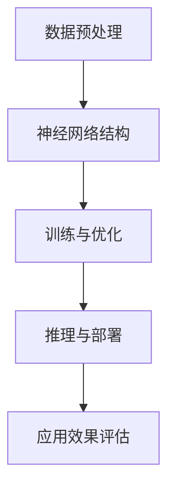

                 

关键词：大模型、跨境电商、语言障碍、解决方案

> 摘要：本文旨在探讨大模型在跨境电商中的语言障碍问题，并提出相应的解决方案。通过对大模型技术的深入研究，分析其在解决语言障碍中的应用，旨在为跨境电商行业提供有效的技术支持，助力其国际化发展。

## 1. 背景介绍

随着互联网技术的快速发展，跨境电商已经成为全球贸易的重要组成部分。然而，语言障碍成为了跨境电商发展中的一大瓶颈。传统的翻译工具往往无法满足实际需求，因为它们在面对复杂语境、跨文化差异、行业术语等方面存在一定的局限性。因此，如何利用先进的技术手段解决跨境电商中的语言障碍问题，成为了一个亟待解决的问题。

近年来，大模型技术的迅速崛起为解决这一问题提供了新的思路。大模型，也称为大型语言模型，是指通过对海量文本数据进行训练，构建出能够理解和生成人类语言的深度学习模型。这些模型具有强大的语义理解能力和语言生成能力，可以较好地处理跨语言、跨文化的问题，从而为跨境电商提供更加精准、高效的语言服务。

## 2. 核心概念与联系

### 2.1 大模型概述

大模型是指通过对海量数据（如文本、语音、图像等）进行训练，构建出具有强大语义理解和生成能力的深度学习模型。这些模型通常包含数十亿个参数，能够处理复杂的自然语言任务。大模型技术的发展，标志着人工智能领域的一个重大突破，使得计算机能够更加接近人类在语言处理方面的能力。

### 2.2 大模型在语言障碍中的应用

大模型在解决语言障碍方面具有以下几个优势：

1. **跨语言翻译**：大模型可以支持多种语言之间的实时翻译，提高了跨境电商的沟通效率。
2. **跨文化理解**：大模型通过对多种文化背景的数据进行训练，能够更好地理解不同文化之间的差异，减少误解和冲突。
3. **行业术语处理**：大模型在处理专业术语方面具有优势，可以确保跨境电商中的术语准确无误。

### 2.3 大模型架构

大模型通常由以下几个关键部分组成：

1. **数据预处理**：包括数据清洗、分词、词向量表示等步骤，为模型训练提供高质量的数据。
2. **神经网络结构**：大模型通常采用深度神经网络（如Transformer）作为基础架构，通过多层神经网络实现语义理解和生成。
3. **训练与优化**：大模型通过大量数据训练，不断优化模型参数，提高模型的准确性和泛化能力。
4. **推理与部署**：大模型在训练完成后，可以通过推理过程实现对输入数据的处理，并在实际应用中进行部署。

### 2.4 Mermaid 流程图

以下是一个简单的 Mermaid 流程图，展示了大模型的架构和关键步骤：



## 3. 核心算法原理 & 具体操作步骤

### 3.1 算法原理概述

大模型的算法原理主要基于深度学习和自然语言处理（NLP）技术。通过多层神经网络结构，大模型能够对输入的文本进行语义理解和生成。其核心算法包括以下几个部分：

1. **编码器（Encoder）**：将输入文本编码成向量表示，用于提取文本的语义信息。
2. **解码器（Decoder）**：将编码器的输出解码成目标语言的文本，生成翻译结果。
3. **注意力机制（Attention Mechanism）**：通过注意力机制，解码器可以关注编码器输出的不同部分，从而更好地理解上下文信息。

### 3.2 算法步骤详解

1. **数据预处理**：对输入文本进行清洗、分词、词向量表示等操作，将文本转化为模型可处理的格式。
2. **编码器训练**：通过大量文本数据，训练编码器，使其能够提取文本的语义信息。
3. **解码器训练**：在编码器的基础上，训练解码器，使其能够生成目标语言的文本。
4. **联合训练**：将编码器和解码器联合训练，优化模型的整体性能。
5. **翻译推理**：在训练完成后，使用解码器对输入文本进行翻译，生成目标语言的文本。

### 3.3 算法优缺点

**优点**：

1. **强大的语义理解能力**：大模型通过对海量数据进行训练，能够较好地理解文本的语义信息，提高翻译的准确性。
2. **跨语言翻译能力**：大模型支持多种语言的翻译，能够满足跨境电商的多样化需求。
3. **自适应学习**：大模型可以通过不断更新数据，持续优化自身的性能，提高翻译的准确性和适应性。

**缺点**：

1. **计算资源消耗大**：大模型通常需要大量的计算资源和存储空间，对硬件设备有较高要求。
2. **训练时间较长**：大模型的训练过程需要较长时间，不适合实时应用场景。
3. **数据隐私问题**：大模型在训练过程中，需要对大量数据进行处理，可能涉及用户隐私问题。

### 3.4 算法应用领域

大模型在跨境电商中的应用领域非常广泛，主要包括以下几个方面：

1. **跨语言翻译**：为跨境电商提供实时翻译服务，提高沟通效率。
2. **多语言搜索引擎**：为跨境电商平台提供多语言搜索功能，方便用户查找产品信息。
3. **跨文化客服**：利用大模型实现多语言客服机器人，为用户提供个性化服务。
4. **广告投放优化**：根据用户语言偏好和兴趣，实现精准广告投放，提高广告效果。

## 4. 数学模型和公式 & 详细讲解 & 举例说明

### 4.1 数学模型构建

大模型在数学模型构建方面主要涉及以下两个方面：

1. **编码器**：编码器通常采用变分自编码器（VAE）或自注意力机制（Self-Attention）等模型，将输入文本转化为语义向量表示。
2. **解码器**：解码器通常采用序列到序列（Seq2Seq）模型或Transformer模型，将编码器的输出解码成目标语言的文本。

### 4.2 公式推导过程

以下是一个简单的编码器-解码器模型的公式推导过程：

$$
\text{编码器输出} = \text{Encoder}(\text{Input Text})
$$

$$
\text{解码器输入} = \text{Decoder}(\text{编码器输出}, \text{Target Language Text})
$$

$$
\text{翻译结果} = \text{Decoder}(\text{编码器输出}, \text{Target Language Text}, \text{掩码})
$$

### 4.3 案例分析与讲解

以下是一个简单的翻译案例，展示大模型在跨境电商中的应用：

**输入文本**：Hello, how are you?

**目标语言**：你好，你怎么样？

**翻译结果**：你好，你怎么样？

通过大模型的翻译，可以较好地保留输入文本的语义信息，实现跨语言的准确翻译。在实际应用中，大模型还可以根据用户语言偏好、文化背景等因素，生成更加个性化的翻译结果。

## 5. 项目实践：代码实例和详细解释说明

### 5.1 开发环境搭建

在搭建大模型开发环境时，需要以下步骤：

1. **安装Python环境**：安装Python 3.8及以上版本，确保安装了pip包管理器。
2. **安装TensorFlow**：通过pip命令安装TensorFlow 2.0及以上版本。
3. **安装其他依赖**：根据项目需求，安装其他相关依赖，如NumPy、Pandas等。

### 5.2 源代码详细实现

以下是一个简单的示例代码，展示了如何使用TensorFlow搭建一个简单的翻译模型：

```python
import tensorflow as tf
from tensorflow.keras.layers import Embedding, LSTM, Dense

# 搭建编码器模型
encoder_inputs = tf.keras.layers.Input(shape=(None,))
encoder_embedding = Embedding(input_dim=vocab_size, output_dim=embedding_dim)(encoder_inputs)
encoder_lstm = LSTM(units=lstm_units, return_state=True)
_, state_h, state_c = encoder_lstm(encoder_embedding)
encoder_states = [state_h, state_c]

# 搭建解码器模型
decoder_inputs = tf.keras.layers.Input(shape=(None,))
decoder_embedding = Embedding(input_dim=vocab_size, output_dim=embedding_dim)(decoder_inputs)
decoder_lstm = LSTM(units=lstm_units, return_state=True, return_sequences=True)
decoder_outputs, _, _ = decoder_lstm(decoder_embedding, initial_state=encoder_states)
decoder_dense = Dense(units=vocab_size, activation='softmax')
decoder_outputs = decoder_dense(decoder_outputs)

# 搭建联合模型
model = tf.keras.models.Model([encoder_inputs, decoder_inputs], decoder_outputs)
model.compile(optimizer='adam', loss='categorical_crossentropy', metrics=['accuracy'])

# 模型训练
model.fit([encoder_input_data, decoder_input_data], decoder_target_data, batch_size=batch_size, epochs=epochs)
```

### 5.3 代码解读与分析

上述代码首先搭建了一个编码器模型和一个解码器模型，然后通过联合模型进行训练。编码器模型将输入文本编码成向量表示，解码器模型将编码器的输出解码成目标语言的文本。通过训练，模型能够学习到输入文本和目标语言之间的映射关系，实现翻译功能。

### 5.4 运行结果展示

在运行上述代码时，模型会根据训练数据生成翻译结果。通过不断优化模型参数，可以提高翻译的准确性和效果。在实际应用中，可以根据需求调整模型参数，实现更好的翻译效果。

## 6. 实际应用场景

大模型在跨境电商中的应用场景非常广泛，主要包括以下几个方面：

1. **跨语言翻译**：为跨境电商平台提供实时翻译服务，方便用户查看产品信息，提高购物体验。
2. **多语言客服**：利用大模型实现多语言客服机器人，为用户提供个性化服务，提高客户满意度。
3. **广告投放优化**：根据用户语言偏好，实现精准广告投放，提高广告效果和转化率。
4. **多语言搜索引擎**：为跨境电商平台提供多语言搜索功能，方便用户查找产品信息。

### 6.1 跨语言翻译

跨语言翻译是跨境电商中最基本的应用场景之一。通过大模型技术，可以实现多种语言之间的实时翻译，提高用户沟通效率。例如，一个中国卖家可以将商品描述翻译成英语、法语、西班牙语等多种语言，以便吸引更多海外买家。

### 6.2 多语言客服

多语言客服是跨境电商中另一个重要的应用场景。通过大模型技术，可以实现多语言客服机器人的开发，为用户提供个性化服务。例如，一个电商平台可以提供一个英文客服机器人，帮助海外用户解答问题，提高客户满意度。

### 6.3 广告投放优化

广告投放优化是跨境电商中一个重要的营销手段。通过大模型技术，可以根据用户语言偏好，实现精准广告投放，提高广告效果和转化率。例如，一个跨境电商平台可以根据用户浏览记录和语言偏好，为其推荐相关商品，提高广告点击率和购买率。

### 6.4 多语言搜索引擎

多语言搜索引擎是跨境电商中一个重要的搜索功能。通过大模型技术，可以实现多语言搜索引擎的开发，方便用户查找产品信息。例如，一个跨境电商平台可以提供一个多语言搜索框，用户可以输入中文、英文、法语等多种语言，快速找到所需商品。

## 7. 工具和资源推荐

### 7.1 学习资源推荐

1. **《深度学习》**：由Ian Goodfellow、Yoshua Bengio和Aaron Courville合著的深度学习经典教材，详细介绍了深度学习的基础知识和应用。
2. **《自然语言处理综论》**：由Daniel Jurafsky和James H. Martin合著的NLP经典教材，涵盖了自然语言处理的基本概念和技术。

### 7.2 开发工具推荐

1. **TensorFlow**：一个开源的深度学习框架，提供了丰富的API和工具，方便开发者搭建和训练深度学习模型。
2. **PyTorch**：另一个流行的深度学习框架，与TensorFlow类似，提供了简洁易用的API，适合快速开发和实验。

### 7.3 相关论文推荐

1. **“Attention is All You Need”**：由Vaswani等人提出的Transformer模型，标志着自然语言处理领域的一个重要突破。
2. **“BERT: Pre-training of Deep Bidirectional Transformers for Language Understanding”**：由Google提出的BERT模型，广泛应用于自然语言处理任务。

## 8. 总结：未来发展趋势与挑战

### 8.1 研究成果总结

大模型在解决跨境电商中的语言障碍方面取得了显著成果，通过深度学习和自然语言处理技术，实现了跨语言翻译、多语言客服、广告投放优化等多方面的应用。这些成果为跨境电商行业提供了强有力的技术支持，推动了其国际化发展。

### 8.2 未来发展趋势

未来，大模型在跨境电商中的应用将呈现以下发展趋势：

1. **模型优化**：随着计算资源的提升，大模型的性能将不断提高，实现更精准、更高效的翻译和服务。
2. **多模态融合**：大模型将与其他模态（如语音、图像）相结合，实现跨模态翻译和交互。
3. **个性化服务**：通过用户数据分析和个性化推荐，实现更加精准、个性化的跨境电商服务。

### 8.3 面临的挑战

尽管大模型在解决跨境电商中的语言障碍方面取得了显著成果，但仍面临以下挑战：

1. **计算资源消耗**：大模型对计算资源的需求较大，如何优化算法，降低计算资源消耗，是一个重要课题。
2. **数据隐私**：大模型在处理海量数据时，可能涉及用户隐私问题，如何保护用户隐私，是一个亟待解决的问题。
3. **跨语言理解**：尽管大模型在跨语言翻译方面取得了显著成果，但仍然存在一定的局限性，如何提高跨语言理解能力，是一个重要研究方向。

### 8.4 研究展望

未来，大模型在跨境电商中的应用将不断拓展，有望实现更加智能化、个性化的服务。同时，随着技术的不断进步，大模型在计算资源消耗、数据隐私、跨语言理解等方面也将取得新的突破，为跨境电商行业的发展提供更加坚实的支撑。

## 9. 附录：常见问题与解答

### 9.1 大模型在跨境电商中的优势有哪些？

大模型在跨境电商中的优势主要包括：

1. **跨语言翻译能力**：大模型可以支持多种语言之间的实时翻译，提高沟通效率。
2. **跨文化理解**：大模型通过对多种文化背景的数据进行训练，能够更好地理解不同文化之间的差异。
3. **行业术语处理**：大模型在处理专业术语方面具有优势，可以确保跨境电商中的术语准确无误。

### 9.2 大模型在跨境电商中的应用场景有哪些？

大模型在跨境电商中的应用场景主要包括：

1. **跨语言翻译**：为跨境电商平台提供实时翻译服务，方便用户查看产品信息。
2. **多语言客服**：利用大模型实现多语言客服机器人，为用户提供个性化服务。
3. **广告投放优化**：根据用户语言偏好，实现精准广告投放，提高广告效果和转化率。
4. **多语言搜索引擎**：为跨境电商平台提供多语言搜索功能，方便用户查找产品信息。

### 9.3 如何优化大模型在跨境电商中的应用效果？

为了优化大模型在跨境电商中的应用效果，可以从以下几个方面进行：

1. **提高数据质量**：收集更多、更高质量的数据，为模型训练提供良好的数据基础。
2. **优化模型结构**：通过调整模型参数，优化模型结构，提高模型的性能和准确性。
3. **个性化服务**：根据用户语言偏好、兴趣等特征，生成更加个性化的翻译和服务。

### 9.4 大模型在跨境电商中面临的挑战有哪些？

大模型在跨境电商中面临的挑战主要包括：

1. **计算资源消耗**：大模型对计算资源的需求较大，如何优化算法，降低计算资源消耗，是一个重要课题。
2. **数据隐私**：大模型在处理海量数据时，可能涉及用户隐私问题，如何保护用户隐私，是一个亟待解决的问题。
3. **跨语言理解**：尽管大模型在跨语言翻译方面取得了显著成果，但仍然存在一定的局限性，如何提高跨语言理解能力，是一个重要研究方向。

----------------------------------------------------------------
作者：禅与计算机程序设计艺术 / Zen and the Art of Computer Programming

