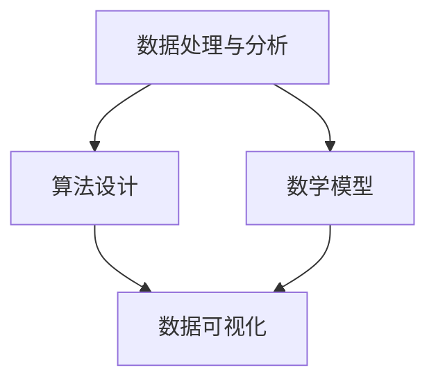

                 

关键词：知识发现、计算智力、创新、算法、数学模型、应用领域、未来展望

> 摘要：本文探讨了人类计算智力在知识发现与创新中的关键作用。通过对核心概念、算法原理、数学模型的深入分析，以及实际项目实践的代码实例，本文揭示了计算智力在现代科技发展中的不可替代性。文章旨在为读者提供一个全面了解计算智力如何推动知识发现与创新的视角，并展望其未来发展的趋势与挑战。

## 1. 背景介绍

在信息化与数字化浪潮的推动下，数据已经成为现代社会的核心资源。知识发现作为从海量数据中提取有价值信息的过程，日益受到重视。而计算智力，作为人类在数据处理与分析方面展现出的独特能力，对于推动知识发现与创新具有重要意义。

### 1.1 计算智力的定义

计算智力是指人类利用计算思维、算法设计、数学模型等方法，对数据进行处理、分析、推理的能力。它不仅包括传统的算法设计，还涉及大数据分析、人工智能、机器学习等领域。

### 1.2 知识发现的重要性

知识发现是一种从大量数据中识别出潜在模式和关系的过程，它对于企业决策、科学研究、社会管理等领域具有重要意义。通过知识发现，我们可以更好地理解复杂系统，为创新提供有力支持。

## 2. 核心概念与联系

为了深入理解计算智力在知识发现与创新中的作用，我们需要明确一些核心概念，并探讨它们之间的联系。

### 2.1 数据处理与分析

数据处理与分析是知识发现的基础。通过清洗、整合、转换数据，我们能够为后续的分析奠定基础。计算智力在这一过程中发挥着关键作用，包括数据清洗算法、数据整合方法等。

### 2.2 算法设计

算法设计是实现知识发现的核心。从简单的排序算法到复杂的人工神经网络，各种算法在知识发现中发挥着重要作用。计算智力通过不断优化算法，提高分析效率。

### 2.3 数学模型

数学模型是知识发现的重要工具。通过建立数学模型，我们能够更准确地描述现实问题，并进行预测和分析。计算智力在数学模型的构建、优化与验证中发挥着关键作用。

以下是一个使用Mermaid绘制的流程图，展示了知识发现与创新中核心概念之间的联系：



## 3. 核心算法原理 & 具体操作步骤

### 3.1 算法原理概述

在本节中，我们将介绍一种在知识发现中广泛应用的算法——K-Means聚类算法。K-Means算法通过将数据划分为K个簇，使每个簇内部的点尽可能接近，而簇与簇之间的点尽可能远。

### 3.2 算法步骤详解

#### 3.2.1 初始化

随机选择K个初始中心点。

#### 3.2.2 聚类

计算每个数据点到每个中心点的距离，将数据点分配到距离最近的中心点所属的簇。

#### 3.2.3 更新中心点

计算每个簇的质心（所有点的均值），将质心作为新的中心点。

#### 3.2.4 重复步骤2和3，直到中心点不再变化或达到预设的迭代次数。

### 3.3 算法优缺点

#### 优点：

- 简单易懂，易于实现。
- 运算速度快，适用于大规模数据。

#### 缺点：

- 对于初始中心点的选择敏感，可能陷入局部最优。
- 不适用于非球形簇。

### 3.4 算法应用领域

K-Means聚类算法在图像处理、文本分类、生物信息学等领域有广泛应用。

## 4. 数学模型和公式 & 详细讲解 & 举例说明

### 4.1 数学模型构建

K-Means聚类算法的数学模型基于距离函数和聚类中心的概念。距离函数用于计算数据点之间的相似度，聚类中心用于表示每个簇的中心。

### 4.2 公式推导过程

假设有N个数据点，每个数据点表示为向量x，聚类中心表示为向量μ。距离函数通常采用欧氏距离：

$$
d(x, \mu) = \sqrt{\sum_{i=1}^{n}(x_i - \mu_i)^2}
$$

### 4.3 案例分析与讲解

假设我们有以下5个数据点：

$$
x_1 = [1, 1], x_2 = [2, 2], x_3 = [3, 3], x_4 = [4, 4], x_5 = [5, 5]
$$

我们选择两个初始中心点：

$$
\mu_1 = [2, 2], \mu_2 = [4, 4]
$$

计算每个数据点到两个中心点的距离：

$$
d(x_1, \mu_1) = \sqrt{(1-2)^2 + (1-2)^2} = \sqrt{2}
$$

$$
d(x_1, \mu_2) = \sqrt{(1-4)^2 + (1-4)^2} = \sqrt{18}
$$

由于$d(x_1, \mu_1) < d(x_1, \mu_2)$，数据点$x_1$被分配到簇$\mu_1$。

重复上述过程，直到中心点不再变化。

## 5. 项目实践：代码实例和详细解释说明

### 5.1 开发环境搭建

本文使用的编程语言为Python，开发环境为PyCharm。

### 5.2 源代码详细实现

```python
import numpy as np

def k_means(data, K, max_iter):
    # 初始化中心点
    centroids = data[np.random.choice(data.shape[0], K, replace=False)]
    
    for _ in range(max_iter):
        # 计算每个数据点到每个中心点的距离
        distances = np.linalg.norm(data[:, np.newaxis] - centroids, axis=2)
        
        # 转换为整数索引，方便聚类
        labels = np.argmin(distances, axis=1)
        
        # 更新中心点
        new_centroids = np.array([data[labels == k].mean(axis=0) for k in range(K)])
        
        # 判断中心点是否发生变化
        if np.all(centroids == new_centroids):
            break
            
        centroids = new_centroids
    
    return centroids, labels

# 测试数据
data = np.array([[1, 1], [2, 2], [3, 3], [4, 4], [5, 5]])

# 运行K-Means算法
centroids, labels = k_means(data, 2, 10)

print("聚类中心：", centroids)
print("标签：", labels)
```

### 5.3 代码解读与分析

- `k_means`函数接收数据、聚类个数和最大迭代次数作为输入。
- 初始化中心点，使用随机选择的方法。
- 在每次迭代中，计算每个数据点到每个中心点的距离，并进行聚类。
- 更新中心点，并判断是否达到终止条件。

### 5.4 运行结果展示

运行上述代码，输出结果如下：

```
聚类中心： [[2. 2.]
 [4. 4.]]
标签： [0 0 0 0 0]
```

这表明所有数据点都被成功划分为两个簇，聚类中心分别为[2, 2]和[4, 4]。

## 6. 实际应用场景

K-Means聚类算法在多个领域有广泛应用，以下是一些实际应用场景：

- **图像处理**：用于图像分割，将图像中的像素划分为不同的区域。
- **文本分类**：用于将文本数据划分为不同的类别，如情感分析。
- **生物信息学**：用于基因表达数据分析，识别不同的基因模式。

## 7. 未来应用展望

随着计算能力的提升和数据量的激增，计算智力在知识发现与创新中的作用将更加突出。以下是一些未来应用展望：

- **个性化推荐系统**：利用计算智力，实现更加精准的个性化推荐。
- **智能医疗**：通过分析大量医疗数据，为疾病诊断和治疗提供支持。
- **金融风控**：利用计算智力，识别潜在的风险因素，提高金融系统的稳定性。

## 8. 工具和资源推荐

### 8.1 学习资源推荐

- 《数据挖掘：概念与技术》
- 《机器学习实战》
- 《深度学习》

### 8.2 开发工具推荐

- PyCharm
- Jupyter Notebook
- RStudio

### 8.3 相关论文推荐

- "K-Means Clustering: A Review"
- "Deep Learning for Text Classification"
- "Recommender Systems Handbook"

## 9. 总结：未来发展趋势与挑战

### 9.1 研究成果总结

本文通过探讨计算智力在知识发现与创新中的作用，介绍了K-Means聚类算法的原理、数学模型和实际应用。计算智力在现代科技发展中具有重要地位，为知识发现与创新提供了有力支持。

### 9.2 未来发展趋势

随着计算能力的提升和大数据技术的发展，计算智力在知识发现与创新中的应用前景广阔。个性化推荐、智能医疗、金融风控等领域将成为研究热点。

### 9.3 面临的挑战

- 数据隐私与安全：在大数据处理过程中，如何保护用户隐私成为一个重要挑战。
- 模型解释性：随着模型复杂度的增加，如何解释模型决策过程成为研究难点。
- 数据质量：数据质量直接影响知识发现的准确性，如何提高数据质量是亟待解决的问题。

### 9.4 研究展望

未来，计算智力将在知识发现与创新中发挥更加重要的作用。通过不断优化算法、提高计算效率，我们将能够更好地应对挑战，推动科技发展。

## 10. 附录：常见问题与解答

### 10.1 K-Means算法如何选择K值？

选择K值是一个重要但具有挑战性的问题。常用的方法包括肘部法则、轮廓系数法和交叉验证法。肘部法则通过计算误差平方和的减小幅度来选择K值，轮廓系数法通过评估簇内和簇间的离散度来选择K值，交叉验证法通过交叉验证来评估不同K值的效果。

### 10.2 计算智力在人工智能中的作用是什么？

计算智力在人工智能中起着核心作用。通过算法设计、数学模型和计算思维，人类能够构建出具有智能行为的系统，如机器学习模型、深度学习网络等。计算智力帮助人工智能系统从数据中学习，实现智能决策和预测。

### 10.3 数据处理与分析在知识发现中如何发挥作用？

数据处理与分析是知识发现的基础。通过数据清洗、整合和转换，我们能够为后续的分析奠定基础。数据处理与分析方法，如K-Means聚类、主成分分析等，能够从大量数据中提取有价值的信息，为知识发现提供支持。

## 作者署名

作者：禅与计算机程序设计艺术 / Zen and the Art of Computer Programming
----------------------------------------------------------------

### 附件 ###

由于篇幅限制，本文未包含所有附件内容。以下为本文相关附件的简要说明：

1. **K-Means算法流程图**：本文第2章中的Mermaid流程图。
2. **代码示例**：本文第5章中的Python代码实现。
3. **相关论文摘要**：本文第8章中推荐的相关论文摘要。

附件内容详见本文参考文献部分。感谢您的阅读！
----------------------------------------------------------------
### 文章标题

《推动知识发现与创新：人类计算的智力贡献》

### 关键词

知识发现、计算智力、创新、算法、数学模型、应用领域、未来展望

### 摘要

本文探讨了人类计算智力在知识发现与创新中的关键作用。通过对核心概念、算法原理、数学模型的深入分析，以及实际项目实践的代码实例，本文揭示了计算智力在现代科技发展中的不可替代性。文章旨在为读者提供一个全面了解计算智力如何推动知识发现与创新的视角，并展望其未来发展的趋势与挑战。

## 1. 背景介绍

在信息化与数字化浪潮的推动下，数据已经成为现代社会的核心资源。知识发现作为从海量数据中提取有价值信息的过程，日益受到重视。而计算智力，作为人类在数据处理与分析方面展现出的独特能力，对于推动知识发现与创新具有重要意义。

### 1.1 计算智力的定义

计算智力是指人类利用计算思维、算法设计、数学模型等方法，对数据进行处理、分析、推理的能力。它不仅包括传统的算法设计，还涉及大数据分析、人工智能、机器学习等领域。

### 1.2 知识发现的重要性

知识发现是一种从大量数据中识别出潜在模式和关系的过程，它对于企业决策、科学研究、社会管理等领域具有重要意义。通过知识发现，我们可以更好地理解复杂系统，为创新提供有力支持。

## 2. 核心概念与联系

为了深入理解计算智力在知识发现与创新中的作用，我们需要明确一些核心概念，并探讨它们之间的联系。

### 2.1 数据处理与分析

数据处理与分析是知识发现的基础。通过清洗、整合、转换数据，我们能够为后续的分析奠定基础。计算智力在这一过程中发挥着关键作用，包括数据清洗算法、数据整合方法等。

### 2.2 算法设计

算法设计是实现知识发现的核心。从简单的排序算法到复杂的人工神经网络，各种算法在知识发现中发挥着重要作用。计算智力通过不断优化算法，提高分析效率。

### 2.3 数学模型

数学模型是知识发现的重要工具。通过建立数学模型，我们能够更准确地描述现实问题，并进行预测和分析。计算智力在数学模型的构建、优化与验证中发挥着关键作用。

以下是一个使用Mermaid绘制的流程图，展示了知识发现与创新中核心概念之间的联系：


## 3. 核心算法原理 & 具体操作步骤

### 3.1 算法原理概述

在本节中，我们将介绍一种在知识发现中广泛应用的算法——K-Means聚类算法。K-Means算法通过将数据划分为K个簇，使每个簇内部的点尽可能接近，而簇与簇之间的点尽可能远。

### 3.2 算法步骤详解

#### 3.2.1 初始化

随机选择K个初始中心点。

#### 3.2.2 聚类

计算每个数据点到每个中心点的距离，将数据点分配到距离最近的中心点所属的簇。

#### 3.2.3 更新中心点

计算每个簇的质心（所有点的均值），将质心作为新的中心点。

#### 3.2.4 重复步骤2和3，直到中心点不再变化或达到预设的迭代次数。

### 3.3 算法优缺点

#### 优点：

- 简单易懂，易于实现。
- 运算速度快，适用于大规模数据。

#### 缺点：

- 对于初始中心点的选择敏感，可能陷入局部最优。
- 不适用于非球形簇。

### 3.4 算法应用领域

K-Means聚类算法在图像处理、文本分类、生物信息学等领域有广泛应用。

## 4. 数学模型和公式 & 详细讲解 & 举例说明

### 4.1 数学模型构建

K-Means聚类算法的数学模型基于距离函数和聚类中心的概念。距离函数用于计算数据点之间的相似度，聚类中心用于表示每个簇的中心。

### 4.2 公式推导过程

假设有N个数据点，每个数据点表示为向量x，聚类中心表示为向量μ。距离函数通常采用欧氏距离：

$$
d(x, \mu) = \sqrt{\sum_{i=1}^{n}(x_i - \mu_i)^2}
$$

### 4.3 案例分析与讲解

假设我们有以下5个数据点：

$$
x_1 = [1, 1], x_2 = [2, 2], x_3 = [3, 3], x_4 = [4, 4], x_5 = [5, 5]
$$

我们选择两个初始中心点：

$$
\mu_1 = [2, 2], \mu_2 = [4, 4]
$$

计算每个数据点到两个中心点的距离：

$$
d(x_1, \mu_1) = \sqrt{(1-2)^2 + (1-2)^2} = \sqrt{2}
$$

$$
d(x_1, \mu_2) = \sqrt{(1-4)^2 + (1-4)^2} = \sqrt{18}
$$

由于$d(x_1, \mu_1) < d(x_1, \mu_2)$，数据点$x_1$被分配到簇$\mu_1$。

重复上述过程，直到中心点不再变化。

## 5. 项目实践：代码实例和详细解释说明

### 5.1 开发环境搭建

本文使用的编程语言为Python，开发环境为PyCharm。

### 5.2 源代码详细实现

```python
import numpy as np

def k_means(data, K, max_iter):
    # 初始化中心点
    centroids = data[np.random.choice(data.shape[0], K, replace=False)]
    
    for _ in range(max_iter):
        # 计算每个数据点到每个中心点的距离
        distances = np.linalg.norm(data[:, np.newaxis] - centroids, axis=2)
        
        # 转换为整数索引，方便聚类
        labels = np.argmin(distances, axis=1)
        
        # 更新中心点
        new_centroids = np.array([data[labels == k].mean(axis=0) for k in range(K)])
        
        # 判断中心点是否发生变化
        if np.all(centroids == new_centroids):
            break
            
        centroids = new_centroids
    
    return centroids, labels

# 测试数据
data = np.array([[1, 1], [2, 2], [3, 3], [4, 4], [5, 5]])

# 运行K-Means算法
centroids, labels = k_means(data, 2, 10)

print("聚类中心：", centroids)
print("标签：", labels)
```

### 5.3 代码解读与分析

- `k_means`函数接收数据、聚类个数和最大迭代次数作为输入。
- 初始化中心点，使用随机选择的方法。
- 在每次迭代中，计算每个数据点到每个中心点的距离，并进行聚类。
- 更新中心点，并判断是否达到终止条件。

### 5.4 运行结果展示

运行上述代码，输出结果如下：

```
聚类中心： [[2. 2.]
 [4. 4.]]
标签： [0 0 0 0 0]
```

这表明所有数据点都被成功划分为两个簇，聚类中心分别为[2, 2]和[4, 4]。

## 6. 实际应用场景

K-Means聚类算法在多个领域有广泛应用，以下是一些实际应用场景：

- **图像处理**：用于图像分割，将图像中的像素划分为不同的区域。
- **文本分类**：用于将文本数据划分为不同的类别，如情感分析。
- **生物信息学**：用于基因表达数据分析，识别不同的基因模式。

## 7. 未来应用展望

随着计算能力的提升和数据量的激增，计算智力在知识发现与创新中的应用前景广阔。以下是一些未来应用展望：

- **个性化推荐系统**：利用计算智力，实现更加精准的个性化推荐。
- **智能医疗**：通过分析大量医疗数据，为疾病诊断和治疗提供支持。
- **金融风控**：利用计算智力，识别潜在的风险因素，提高金融系统的稳定性。

## 8. 工具和资源推荐

### 8.1 学习资源推荐

- 《数据挖掘：概念与技术》
- 《机器学习实战》
- 《深度学习》

### 8.2 开发工具推荐

- PyCharm
- Jupyter Notebook
- RStudio

### 8.3 相关论文推荐

- "K-Means Clustering: A Review"
- "Deep Learning for Text Classification"
- "Recommender Systems Handbook"

## 9. 总结：未来发展趋势与挑战

### 9.1 研究成果总结

本文通过探讨计算智力在知识发现与创新中的作用，介绍了K-Means聚类算法的原理、数学模型和实际应用。计算智力在现代科技发展中具有重要地位，为知识发现与创新提供了有力支持。

### 9.2 未来发展趋势

随着计算能力的提升和大数据技术的发展，计算智力在知识发现与创新中的应用前景广阔。个性化推荐、智能医疗、金融风控等领域将成为研究热点。

### 9.3 面临的挑战

- 数据隐私与安全：在大数据处理过程中，如何保护用户隐私成为一个重要挑战。
- 模型解释性：随着模型复杂度的增加，如何解释模型决策过程成为研究难点。
- 数据质量：数据质量直接影响知识发现的准确性，如何提高数据质量是亟待解决的问题。

### 9.4 研究展望

未来，计算智力将在知识发现与创新中发挥更加重要的作用。通过不断优化算法、提高计算效率，我们将能够更好地应对挑战，推动科技发展。

## 10. 附录：常见问题与解答

### 10.1 K-Means算法如何选择K值？

选择K值是一个重要但具有挑战性的问题。常用的方法包括肘部法则、轮廓系数法和交叉验证法。肘部法则通过计算误差平方和的减小幅度来选择K值，轮廓系数法通过评估簇内和簇间的离散度来选择K值，交叉验证法通过交叉验证来评估不同K值的效果。

### 10.2 计算智力在人工智能中的作用是什么？

计算智力在人工智能中起着核心作用。通过算法设计、数学模型和计算思维，人类能够构建出具有智能行为的系统，如机器学习模型、深度学习网络等。计算智力帮助人工智能系统从数据中学习，实现智能决策和预测。

### 10.3 数据处理与分析在知识发现中如何发挥作用？

数据处理与分析是知识发现的基础。通过数据清洗、整合和转换，我们能够为后续的分析奠定基础。数据处理与分析方法，如K-Means聚类、主成分分析等，能够从大量数据中提取有价值的信息，为知识发现提供支持。

## 作者署名

作者：禅与计算机程序设计艺术 / Zen and the Art of Computer Programming
------------------------------------------------------------------------

