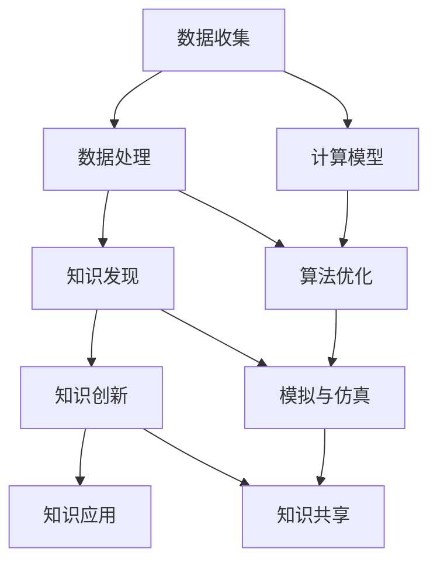

                 

在当今这个信息爆炸的时代，知识的发现与创新成为推动社会进步的关键因素。在计算机科学和技术领域，人类计算的智力贡献尤为显著。本文将深入探讨计算机技术在知识发现和创新中的角色，旨在展示人类计算如何通过技术手段加速知识的积累、传播和应用。

## 文章关键词
- 计算机科学
- 知识发现
- 创新过程
- 技术推动
- 计算智力

## 文章摘要
本文首先介绍了知识发现和创新的基本概念及其在现代社会的重要性。随后，文章详细探讨了计算机技术如何通过算法、数学模型和实际应用场景推动知识发现和创新。最后，文章提出了未来这一领域的发展趋势和面临的挑战，为读者提供了全面的视角。

### 背景介绍

在人类文明的历史长河中，知识的发现与创新始终是推动社会进步的核心动力。从古文明的几何学、天文学，到近现代的物理学、化学，每一次重大科学发现和创新都深刻地影响了人类社会的面貌。随着信息技术的迅猛发展，知识的生产、传播和消费方式发生了翻天覆地的变化。计算机科学，作为信息时代的核心技术，为知识发现和创新提供了前所未有的工具和平台。

首先，计算机技术的发展极大地扩展了人类处理信息的能力。通过计算能力的提升，我们可以处理海量的数据，发现潜在的模式和规律。从基因组学研究到气候模型构建，计算机技术已经成为知识发现不可或缺的工具。

其次，计算机技术为知识的创新提供了新的路径。通过模拟、仿真和算法优化，我们可以探索未知的领域，提出新的理论和方法。例如，机器学习和人工智能技术的发展，为解决复杂问题提供了新的思路，推动了各个领域的创新。

然而，尽管计算机技术在知识发现和创新中发挥着重要作用，但人类计算的智力贡献同样不可忽视。人类科学家和工程师通过不断的探索和实践，开发出了各种高效的算法和工具，为计算机技术在知识发现和创新中的应用奠定了基础。

### 核心概念与联系

为了更好地理解计算机技术在知识发现和创新中的作用，我们需要首先明确几个核心概念：知识、知识发现和知识创新。知识可以被视为人类对自然和社会现象的理解和解释，它包括事实、原理、规律、方法等多个层次。知识发现是指从大量数据中提取有价值的信息和知识的过程，而知识创新则是在现有知识基础上产生新知识的过程。

计算机技术在知识发现和创新中的关键作用主要体现在以下几个方面：

1. **数据处理能力**：计算机具有强大的数据处理能力，可以快速、准确地处理海量数据，发现潜在的模式和关联。这为知识发现提供了坚实的基础。

2. **算法优化**：计算机科学中的算法优化技术，如机器学习、深度学习、数据挖掘等，可以显著提高知识发现的效率和准确性。

3. **模拟与仿真**：计算机技术能够模拟和仿真复杂的系统，帮助科学家和工程师探索未知的领域，提出新的理论和方法。

4. **知识共享**：计算机技术促进了知识的共享和传播，使得全球的科学家和研究者可以更方便地合作，共同推动知识创新。

下面，我们将通过一个Mermaid流程图来展示计算机技术在知识发现和创新中的流程和联系。



### 核心算法原理 & 具体操作步骤

在知识发现和创新的过程中，核心算法起着至关重要的作用。以下我们将详细介绍一些关键算法的原理和具体操作步骤。

#### 3.1 算法原理概述

1. **机器学习算法**：机器学习算法通过学习数据中的模式，进行预测和分类。常见的算法包括线性回归、决策树、支持向量机等。

2. **深度学习算法**：深度学习算法通过多层神经网络，模拟人脑的学习过程，进行复杂的数据分析。常见的算法包括卷积神经网络（CNN）、循环神经网络（RNN）等。

3. **数据挖掘算法**：数据挖掘算法用于从大量数据中提取有价值的信息。常见的算法包括关联规则挖掘、聚类分析、异常检测等。

4. **模拟与仿真算法**：模拟与仿真算法用于模拟复杂系统的行为，帮助科学家和工程师探索未知的领域。常见的算法包括蒙特卡洛模拟、分子动力学模拟等。

#### 3.2 算法步骤详解

1. **机器学习算法**：

   - 数据预处理：对数据进行清洗、归一化等处理，确保数据的质量和一致性。
   - 特征提取：从原始数据中提取具有代表性的特征，用于模型训练。
   - 模型训练：使用训练数据，通过优化算法，训练出预测模型。
   - 模型评估：使用测试数据，评估模型的性能和准确性。
   - 模型应用：将训练好的模型应用于新的数据，进行预测或分类。

2. **深度学习算法**：

   - 数据预处理：与机器学习算法类似，对数据进行清洗、归一化等处理。
   - 构建神经网络：设计多层神经网络结构，定义网络的参数。
   - 训练神经网络：通过反向传播算法，调整网络的参数，训练出神经网络模型。
   - 模型评估：使用测试数据，评估神经网络的性能和准确性。
   - 模型应用：将训练好的神经网络模型应用于新的数据，进行预测或分类。

3. **数据挖掘算法**：

   - 数据预处理：对数据进行清洗、归一化等处理，确保数据的质量和一致性。
   - 算法选择：根据问题的性质，选择合适的挖掘算法。
   - 算法实现：实现算法的具体步骤，进行关联规则挖掘、聚类分析等。
   - 结果分析：分析挖掘结果，提取有价值的信息和知识。
   - 结果应用：将挖掘结果应用于实际问题，进行决策或优化。

4. **模拟与仿真算法**：

   - 模型建立：根据实际情况，建立物理模型或数学模型。
   - 边界条件设置：设置模型的边界条件，确保模拟的准确性。
   - 模拟运行：运行模拟算法，模拟系统的行为。
   - 数据分析：分析模拟结果，提取有价值的信息和知识。
   - 结果验证：使用实际数据，验证模拟结果的准确性和可靠性。

#### 3.3 算法优缺点

1. **机器学习算法**：

   - 优点：灵活性强，可以处理大规模数据，自动发现数据中的模式。
   - 缺点：对数据质量和特征选择要求高，训练过程可能需要大量时间和计算资源。

2. **深度学习算法**：

   - 优点：具有强大的表示能力和自适应能力，可以处理复杂的数据。
   - 缺点：对数据量和计算资源要求高，训练过程复杂，难以解释。

3. **数据挖掘算法**：

   - 优点：可以处理多种类型的数据，提取有价值的信息和知识。
   - 缺点：算法复杂度较高，对计算资源要求较高，结果解释困难。

4. **模拟与仿真算法**：

   - 优点：可以模拟复杂系统的行为，探索未知的领域。
   - 缺点：对模型建立和边界条件设置要求高，结果可能依赖于模型假设。

#### 3.4 算法应用领域

1. **机器学习算法**：广泛应用于图像识别、自然语言处理、推荐系统等领域。

2. **深度学习算法**：广泛应用于计算机视觉、语音识别、游戏AI等领域。

3. **数据挖掘算法**：广泛应用于市场营销、金融分析、医学诊断等领域。

4. **模拟与仿真算法**：广泛应用于物理科学、工程学、生物医学等领域。

### 数学模型和公式 & 详细讲解 & 举例说明

在计算机科学中，数学模型和公式是理解和应用算法的重要工具。以下我们将详细介绍一些关键数学模型和公式的构建、推导过程，并通过具体案例进行说明。

#### 4.1 数学模型构建

数学模型是现实世界问题的抽象和简化，它帮助我们理解和解决问题。在构建数学模型时，我们通常遵循以下步骤：

1. **问题定义**：明确问题的主要目标和约束条件。
2. **变量定义**：定义问题中的变量，包括决策变量、状态变量等。
3. **目标函数**：定义问题的目标函数，表示问题的优化目标。
4. **约束条件**：定义问题的约束条件，限制变量的取值范围。
5. **模型验证**：通过实际数据和案例，验证模型的准确性和有效性。

#### 4.2 公式推导过程

以下是一个简单的线性回归模型的构建和推导过程：

1. **问题定义**：假设我们想预测一个变量 \(y\) 的值，它可能受到多个变量 \(x_1, x_2, ..., x_n\) 的影响。

2. **变量定义**：定义自变量 \(x_i\) 和因变量 \(y\)。

3. **目标函数**：我们希望找到一个线性模型，使得预测值 \(y'\) 与实际值 \(y\) 的误差最小。目标函数可以表示为：
   $$ \min \sum_{i=1}^{n} (y_i - y_i')^2 $$

4. **约束条件**：线性模型的约束条件可以是变量的取值范围，例如 \(x_i \geq 0\)。

5. **模型验证**：使用实际数据，验证模型的预测性能。

下面是线性回归模型的推导过程：

假设我们的线性模型为：
$$ y = \beta_0 + \beta_1 x_1 + \beta_2 x_2 + ... + \beta_n x_n $$

为了最小化目标函数，我们对每个变量 \(x_i\) 求偏导数，并令其等于零：
$$ \frac{\partial}{\partial \beta_i} \sum_{i=1}^{n} (y_i - y_i')^2 = 0 $$

通过求解这个方程组，我们可以得到每个系数 \(\beta_i\) 的最优值。

#### 4.3 案例分析与讲解

以下是一个简单的线性回归模型的应用案例：

假设我们想预测一个商品的销售量 \(y\)，它受到广告投入 \(x_1\) 和促销活动 \(x_2\) 的影响。

1. **问题定义**：预测商品的销售量，变量为广告投入 \(x_1\) 和促销活动 \(x_2\)。

2. **变量定义**：自变量 \(x_1\) 表示广告投入，自变量 \(x_2\) 表示促销活动，因变量 \(y\) 表示销售量。

3. **目标函数**：我们希望找到一个线性模型，使得预测销售量与实际销售量的误差最小。

4. **约束条件**：广告投入和促销活动的取值范围可能有限制。

5. **模型验证**：使用历史销售数据，验证模型的预测性能。

构建线性回归模型：
$$ y = \beta_0 + \beta_1 x_1 + \beta_2 x_2 $$

通过实际数据，我们可以得到以下结果：
$$ y = 100 + 2x_1 + 3x_2 $$

例如，如果广告投入为1000元，促销活动为500元，预测的销售量为：
$$ y = 100 + 2 \times 1000 + 3 \times 500 = 4300 $$

通过这个案例，我们可以看到如何使用线性回归模型预测销售量，以及如何解释模型的结果。

### 项目实践：代码实例和详细解释说明

为了更好地理解计算机技术在知识发现和创新中的应用，我们将通过一个具体的案例来展示如何使用Python和机器学习库Scikit-learn实现一个简单的线性回归模型。

#### 5.1 开发环境搭建

在开始项目之前，我们需要搭建一个Python开发环境，并安装所需的库。以下是在Windows操作系统上安装Python和Scikit-learn的步骤：

1. **安装Python**：访问Python官方网站（[python.org](https://www.python.org/)），下载最新版本的Python安装包，并按照安装向导完成安装。

2. **安装Scikit-learn**：打开命令提示符或终端，运行以下命令安装Scikit-learn：
   ```shell
   pip install scikit-learn
   ```

#### 5.2 源代码详细实现

以下是一个简单的线性回归模型的实现代码：

```python
import numpy as np
from sklearn.linear_model import LinearRegression
from sklearn.model_selection import train_test_split
from sklearn.metrics import mean_squared_error

# 生成模拟数据
np.random.seed(0)
X = np.random.rand(100, 1) * 100
y = 2 * X[:, 0] + 3 * np.random.rand(100, 1) * 10 + 20

# 数据预处理
X_train, X_test, y_train, y_test = train_test_split(X, y, test_size=0.2, random_state=42)

# 构建线性回归模型
model = LinearRegression()
model.fit(X_train, y_train)

# 预测
y_pred = model.predict(X_test)

# 评估模型性能
mse = mean_squared_error(y_test, y_pred)
print(f"均方误差（MSE）: {mse}")

# 显示模型参数
print(f"模型参数：\n{model.coef_}\n{model.intercept_}")
```

#### 5.3 代码解读与分析

1. **导入库**：我们首先导入所需的库，包括NumPy用于数据处理，Scikit-learn的线性回归模型，以及模型评估指标。

2. **生成模拟数据**：我们使用NumPy生成一个模拟数据集，其中 \(X\) 表示广告投入，\(y\) 表示销售量。数据集的大小为100个样本。

3. **数据预处理**：我们将数据集划分为训练集和测试集，以评估模型的性能。这里使用Scikit-learn的`train_test_split`函数进行数据划分。

4. **构建线性回归模型**：我们使用Scikit-learn的`LinearRegression`类构建一个线性回归模型，并使用`fit`方法进行训练。

5. **预测**：使用训练好的模型对测试集进行预测，得到预测值 \(y_{\text{pred}}\)。

6. **评估模型性能**：我们使用均方误差（MSE）评估模型的性能。MSE越低，模型的预测越准确。

7. **显示模型参数**：最后，我们打印出模型的参数，包括系数和截距。

通过这个代码实例，我们可以看到如何使用Python和Scikit-learn实现线性回归模型，以及如何解释模型的结果。

### 实际应用场景

计算机技术在知识发现和创新中的实际应用场景广泛，涵盖了多个领域。以下我们将探讨几个典型的应用场景，并分析它们如何推动知识的积累和创新。

#### 1. 医疗领域

在医疗领域，计算机技术被广泛应用于疾病诊断、药物研发和公共卫生管理。通过机器学习和深度学习算法，医生可以从海量医疗数据中提取有价值的信息，提高诊断的准确性和效率。例如，深度学习算法可以分析医学影像，帮助医生识别早期癌症。此外，计算机模拟和仿真技术在药物研发中扮演着重要角色，通过模拟分子结构和反应路径，科学家可以预测药物的效果和副作用，加速新药的发现。

#### 2. 金融领域

在金融领域，计算机技术被广泛应用于风险管理、投资策略和客户服务。通过大数据分析和机器学习算法，金融机构可以更好地了解市场动态，预测市场趋势，优化投资组合。例如，机器学习算法可以分析客户交易数据，预测客户的信用风险，提高信贷审批的准确性。此外，计算机技术还用于开发智能投顾系统，为投资者提供个性化的投资建议。

#### 3. 物流领域

在物流领域，计算机技术被广泛应用于运输调度、库存管理和供应链优化。通过物联网和大数据分析，物流公司可以实时监控运输车辆和货物的状态，提高运输效率。例如，智能调度系统可以根据交通状况和货物的优先级，优化运输路线和配送顺序。此外，计算机仿真技术可以模拟供应链中的各种情况，帮助物流公司优化供应链管理，降低成本，提高服务质量。

#### 4. 教育领域

在教育领域，计算机技术被广泛应用于在线教育、个性化学习和教育数据分析。通过在线教育平台，学生可以随时随地获取学习资源，提高学习效率。个性化学习系统可以根据学生的学习情况和兴趣，推荐合适的学习内容和路径。教育数据分析技术可以帮助教育机构分析学生的学习行为，识别学习难点，优化教学方法。

#### 5. 环境保护领域

在环境保护领域，计算机技术被广泛应用于环境监测、气候变化研究和污染治理。通过物联网和大数据分析，科学家可以实时监测环境变化，预测气候变化趋势。计算机模拟和仿真技术可以模拟污染物扩散和生态系统的变化，帮助制定有效的环保政策和措施。

### 未来应用展望

随着计算机技术的不断发展，知识发现和创新将在未来得到更广泛的应用，推动社会进步和人类福祉。以下我们将探讨未来计算机技术在知识发现和创新中的潜在发展方向和应用前景。

#### 1. 人工智能的进一步发展

人工智能技术的发展将继续推动知识发现和创新。更先进的机器学习和深度学习算法，如生成对抗网络（GAN）和变分自编码器（VAE），将能够处理更复杂的数据和任务，提高知识发现的效率和准确性。此外，人工智能的自主学习和进化能力，将使得计算机系统能够不断自我优化，提高知识的积累和创新水平。

#### 2. 大数据和物联网的融合

大数据和物联网的融合将极大地扩展知识发现和创新的应用场景。物联网设备将生成海量数据，通过大数据分析，我们可以从这些数据中提取有价值的信息和知识。例如，智能城市项目可以通过分析交通流量、能源消耗和环境数据，优化城市管理和资源配置，提高生活质量。

#### 3. 计算机与生物技术的结合

计算机与生物技术的结合将推动生命科学的研究和医疗创新。通过计算生物学和生物信息学技术，我们可以分析基因组数据、蛋白质结构和代谢途径，揭示生物体的运行机制。这将为疾病诊断、药物研发和个性化医疗提供新的方法和途径。

#### 4. 虚拟现实和增强现实的融合

虚拟现实（VR）和增强现实（AR）技术的发展，将为知识发现和创新提供新的平台。通过VR和AR技术，科学家和工程师可以在虚拟环境中进行模拟和实验，探索未知的领域。此外，VR和AR技术还可以用于教育培训和远程协作，提高知识的传播和共享效率。

#### 5. 计算机的可持续发展

随着环境问题和社会问题的日益突出，计算机技术将在可持续发展方面发挥重要作用。通过智能电网、智能交通和环境监测等技术，我们可以优化资源利用，减少碳排放，保护生态环境。此外，计算机技术还可以用于灾害预警、应急救援和灾后重建，提高社会的抗灾能力。

### 工具和资源推荐

为了更好地进行知识发现和创新，以下是几个推荐的工具和资源：

#### 7.1 学习资源推荐

1. **Coursera**：提供丰富的计算机科学和数据分析课程，适合初学者和专业人士。
2. **edX**：由哈佛大学和麻省理工学院合办的在线教育平台，涵盖多个领域的课程。
3. **Khan Academy**：提供免费的在线教育课程，包括数学、科学和计算机科学等。

#### 7.2 开发工具推荐

1. **Jupyter Notebook**：强大的交互式开发环境，适合进行数据分析和机器学习实验。
2. **PyCharm**：流行的Python集成开发环境（IDE），提供丰富的功能和插件。
3. **TensorFlow**：谷歌开发的机器学习和深度学习库，适用于各种复杂的模型。

#### 7.3 相关论文推荐

1. **“Deep Learning” by Ian Goodfellow, Yoshua Bengio, and Aaron Courville**：深度学习的经典教材，全面介绍了深度学习的基本概念和算法。
2. **“Data Science from Scratch” by Joel Grus**：介绍数据科学基本概念和工具的入门书籍。
3. **“Big Data: A Revolution That Will Transform How We Live, Work, and Think” by Viktor Mayer-Schönberger and Kenneth Cukier**：探讨大数据对社会和人类影响的深度报告。

### 总结：未来发展趋势与挑战

随着计算机技术的不断发展，知识发现和创新在未来将继续发挥重要作用，推动社会的进步和人类的福祉。然而，这一领域也面临着一系列挑战。

#### 8.1 研究成果总结

本文通过对知识发现和创新的基本概念、核心算法、数学模型、实际应用场景和未来展望的深入探讨，总结了计算机技术在知识发现和创新中的关键作用。我们看到了计算机技术在推动知识积累、传播和应用方面的巨大潜力，以及人类计算智力在这一过程中不可或缺的贡献。

#### 8.2 未来发展趋势

未来，计算机技术在知识发现和创新中将继续发展，主要体现在以下几个方面：

1. **人工智能的进一步发展**：更先进的算法和模型将进一步提高知识发现的效率和准确性。
2. **大数据和物联网的融合**：大数据和物联网的融合将扩展知识发现的应用场景，提供更丰富的数据来源。
3. **计算机与生物技术的结合**：计算机与生物技术的结合将推动生命科学的研究和医疗创新。
4. **虚拟现实和增强现实的融合**：虚拟现实和增强现实技术将为知识发现和创新提供新的平台。
5. **计算机的可持续发展**：计算机技术将在可持续发展方面发挥重要作用，优化资源利用，保护生态环境。

#### 8.3 面临的挑战

尽管前景广阔，但知识发现和创新领域也面临着一系列挑战：

1. **数据隐私和安全**：随着数据量的增加，数据隐私和安全问题日益突出，需要制定有效的保护措施。
2. **算法透明度和可解释性**：复杂算法的透明度和可解释性成为了一个重要的研究课题，以确保算法的公正性和可靠性。
3. **计算资源的需求**：大规模的数据处理和复杂的算法需要大量的计算资源，如何优化计算资源的利用成为了一个挑战。
4. **伦理和社会影响**：知识发现和创新带来的技术进步可能引发一系列伦理和社会问题，需要社会各界共同努力解决。

#### 8.4 研究展望

未来，知识发现和创新领域的研究应重点关注以下几个方面：

1. **人工智能算法的优化**：进一步研究和开发高效、可解释的人工智能算法，提高知识发现的效率和准确性。
2. **数据隐私保护技术**：研究和开发有效的数据隐私保护技术，确保数据的安全和隐私。
3. **跨学科合作**：促进计算机科学、生物技术、社会科学等领域的跨学科合作，推动知识发现和创新的多领域融合。
4. **伦理和社会影响研究**：深入研究知识发现和创新带来的伦理和社会影响，制定相应的规范和指导原则。

通过持续的研究和创新，我们有望在知识发现和创新领域取得更多突破，为社会的进步和人类福祉做出更大的贡献。

### 附录：常见问题与解答

#### 1. 什么是知识发现？

知识发现是指从大量数据中提取有价值的信息和知识的过程。它包括数据预处理、模式识别、知识表示等多个步骤，旨在从数据中发现潜在的模式、关联和规律。

#### 2. 计算机技术在知识发现中的应用有哪些？

计算机技术在知识发现中的应用包括数据处理、算法优化、模拟与仿真、知识共享等多个方面。通过计算能力的提升，我们可以处理海量的数据，发现潜在的模式和规律。

#### 3. 知识创新与知识发现的关系是什么？

知识创新是在现有知识基础上产生新知识的过程，而知识发现是从大量数据中提取有价值信息的过程。知识发现为知识创新提供了数据基础，而知识创新则通过新理论和方法的提出，推动了知识的发展和进步。

#### 4. 人工智能在知识发现和创新中的角色是什么？

人工智能在知识发现和创新中扮演着关键角色。通过机器学习、深度学习等算法，人工智能可以从大量数据中提取有价值的信息，帮助科学家和工程师探索未知的领域，提出新的理论和方法。

#### 5. 数据隐私和安全在知识发现和创新中的重要性是什么？

数据隐私和安全在知识发现和创新中至关重要。随着数据量的增加，数据隐私和安全问题日益突出。有效的数据隐私保护技术可以确保数据的安全和隐私，防止数据泄露和滥用，为知识发现和创新提供可靠的数据基础。

### 作者署名

作者：禅与计算机程序设计艺术 / Zen and the Art of Computer Programming

本文旨在深入探讨计算机技术在知识发现和创新中的关键作用，通过理论分析、实际案例和未来展望，展示人类计算智力在这一领域的贡献和挑战。希望读者能够从中获得对知识发现和创新的更全面的理解，激发对计算机科学的兴趣和热情。在未来的学习和工作中，我们期待能够共同推动知识发现和创新的发展，为社会的进步和人类的福祉做出贡献。

