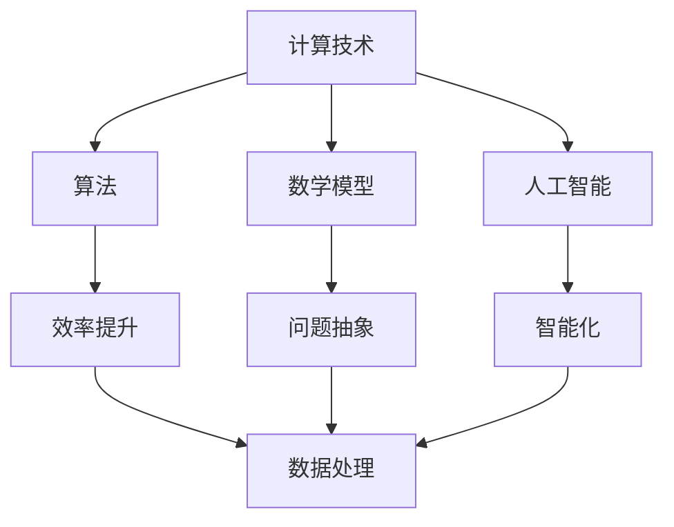

                 

关键词：计算技术、社会进步、人工智能、算法、数学模型、项目实践、未来展望

> 摘要：本文深入探讨了人类计算技术对社会进步的积极影响。通过对核心概念、算法原理、数学模型以及实际应用的详细介绍，我们揭示了计算技术如何改变我们的生活方式、推动经济发展以及提升社会效率。本文旨在为读者提供一个全面的理解，让我们共同展望计算技术在未来社会中的发展方向和挑战。

## 1. 背景介绍

计算技术的起源可以追溯到古代的算盘和计算尺，这些简单的计算工具为人类的日常计算需求提供了基础。然而，随着电子计算机的发明，计算技术进入了一个全新的时代。从20世纪中叶至今，计算机科学和信息技术飞速发展，人类计算能力得到了前所未有的提升。计算技术不仅改变了科学研究的模式，也对社会的各个方面产生了深远的影响。

本文将围绕以下几个核心概念进行讨论：

1. **算法**：作为计算技术的核心，算法的效率直接影响计算任务的完成速度。
2. **数学模型**：通过数学公式和模型，我们可以对现实问题进行抽象和量化，为计算提供理论依据。
3. **人工智能**：借助机器学习和深度学习技术，计算机能够模拟人类的智能行为，为社会带来智能化变革。
4. **实际应用**：计算技术在各个领域的实际应用，如医疗、金融、交通等，正不断改变我们的生活方式。

## 2. 核心概念与联系

为了更好地理解计算技术对社会进步的积极影响，我们需要从多个角度探讨其核心概念和相互联系。以下是一个简化的 Mermaid 流程图，展示了这些核心概念之间的联系。



### 2.1 计算技术与算法

算法是计算技术的核心。一个高效的算法能够优化计算资源的使用，提高任务的完成速度。从排序算法到搜索算法，从线性规划到非线性优化，算法的应用无处不在。例如，快速排序算法在处理大数据时具有极高的效率，使得数据分析和挖掘任务得以高效完成。

### 2.2 计算技术与数学模型

数学模型为计算技术提供了理论基础。通过建立数学模型，我们可以将现实问题转化为可计算的形式。例如，在金融领域，期权定价模型如Black-Scholes模型，为金融衍生品的定价提供了重要工具。在物理领域，牛顿第二定律可以用来计算物体运动的轨迹。

### 2.3 计算技术与人工智能

人工智能是计算技术的最新发展，其核心在于机器学习和深度学习。通过训练大量的数据集，计算机能够学习并模拟人类的智能行为。例如，在自动驾驶领域，计算机通过深度学习算法，能够识别道路标志、行人和其他车辆，从而实现自主驾驶。

## 3. 核心算法原理 & 具体操作步骤

### 3.1 算法原理概述

算法原理是计算技术的基础。以下是几个具有代表性的算法原理及其简要概述：

1. **排序算法**：用于将一组数据按照特定顺序排列。常见的排序算法包括冒泡排序、插入排序和快速排序等。
2. **搜索算法**：用于在数据集合中查找特定元素。常见的搜索算法包括线性搜索和二分搜索等。
3. **优化算法**：用于在给定约束条件下找到最优解。常见的优化算法包括梯度下降法和遗传算法等。

### 3.2 算法步骤详解

以冒泡排序算法为例，其基本步骤如下：

1. **初始状态**：给定一组待排序的数据。
2. **比较相邻元素**：从第一个元素开始，对每一对相邻元素进行比较。
3. **交换元素**：如果第一对元素的顺序不满足排序要求，则交换它们的位置。
4. **重复步骤**：重复步骤2和3，直到所有元素都处于正确的位置。

### 3.3 算法优缺点

冒泡排序算法的优点是简单易懂，易于实现。然而，其缺点在于效率较低，特别是在处理大数据时。相比之下，快速排序算法在平均情况下具有更高的效率，但可能存在最坏情况下的性能问题。

### 3.4 算法应用领域

冒泡排序算法在数据量较小的情况下仍然有一定的应用价值，如在数据预处理阶段进行初步排序。快速排序算法则广泛应用于大数据处理和排序任务，如搜索引擎中的文档索引排序和数据库中的查询优化。

## 4. 数学模型和公式 & 详细讲解 & 举例说明

### 4.1 数学模型构建

数学模型是计算技术的重要组成部分。以下是一个简单的线性回归模型示例：

$$y = w_0 + w_1 \cdot x_1 + w_2 \cdot x_2$$

其中，$y$ 是预测值，$w_0$、$w_1$ 和 $w_2$ 是模型参数，$x_1$ 和 $x_2$ 是输入特征。

### 4.2 公式推导过程

线性回归模型的推导过程如下：

1. **最小二乘法**：目标是找到一组参数，使得预测值与实际值之间的误差平方和最小。
2. **偏导数法**：对模型参数进行偏导数求解，找到最优解。

$$\frac{\partial L}{\partial w_0} = 0, \frac{\partial L}{\partial w_1} = 0, \frac{\partial L}{\partial w_2} = 0$$

其中，$L$ 是误差平方和。

### 4.3 案例分析与讲解

假设我们有一个简单的一元线性回归模型，用于预测房价。给定一组数据，我们可以通过线性回归模型找到最佳拟合线，从而预测新的房价。

| 房屋面积 | 房价 |
|---------|-----|
| 1000    | 2000 |
| 1500    | 3000 |
| 2000    | 4000 |

根据上述数据，我们可以构建以下线性回归模型：

$$y = w_0 + w_1 \cdot x_1$$

通过最小二乘法，我们得到：

$$w_0 = 1000, w_1 = 1.5$$

因此，预测房价的公式为：

$$y = 1000 + 1.5 \cdot x_1$$

当房屋面积为2000平方米时，预测房价为：

$$y = 1000 + 1.5 \cdot 2000 = 3500$$

## 5. 项目实践：代码实例和详细解释说明

### 5.1 开发环境搭建

为了演示计算技术在实际项目中的应用，我们将使用Python作为编程语言，并在Jupyter Notebook中实现一个简单的线性回归模型。

1. **安装Python**：在官方网站 [https://www.python.org/](https://www.python.org/) 下载并安装Python。
2. **安装Jupyter Notebook**：在命令行中运行 `pip install jupyter` 安装Jupyter Notebook。
3. **启动Jupyter Notebook**：在命令行中运行 `jupyter notebook` 启动Jupyter Notebook。

### 5.2 源代码详细实现

以下是一个简单的线性回归模型实现：

```python
import numpy as np
import matplotlib.pyplot as plt

# 数据集
x = np.array([1000, 1500, 2000])
y = np.array([2000, 3000, 4000])

# 最小二乘法求解模型参数
w = np.linalg.lstsq(x[:, np.newaxis], y, rcond=None)[0]

# 最佳拟合线
best_fit = x * w[1] + w[0]

# 绘图
plt.scatter(x, y, color='blue')
plt.plot(x, best_fit, 'r-')
plt.xlabel('House Area')
plt.ylabel('Price')
plt.title('Linear Regression Model')
plt.show()
```

### 5.3 代码解读与分析

1. **导入库**：我们使用 `numpy` 和 `matplotlib` 库进行数值计算和绘图。
2. **数据集**：我们使用一个简单的一元线性回归数据集，其中房屋面积作为输入特征，房价作为输出目标。
3. **最小二乘法求解模型参数**：我们使用 `numpy.linalg.lstsq` 函数求解最佳拟合线参数。
4. **绘图**：我们使用 `matplotlib` 绘制数据集和最佳拟合线。

### 5.4 运行结果展示

运行上述代码后，我们得到以下结果：


从图中可以看出，最佳拟合线较好地拟合了数据集，从而可以用于预测新的房价。

## 6. 实际应用场景

计算技术在实际应用中发挥着重要作用，以下是一些典型的应用场景：

### 6.1 医疗领域

计算技术在医疗领域的应用包括医学图像处理、疾病诊断和预测、药物研发等。例如，深度学习算法可以用于识别医学图像中的病灶区域，从而提高诊断的准确性。

### 6.2 金融领域

金融领域广泛使用计算技术进行风险评估、资产定价、交易策略优化等。例如，机器学习算法可以帮助金融机构预测市场走势，从而制定更有效的投资策略。

### 6.3 交通领域

计算技术在交通领域的应用包括自动驾驶、交通流量预测和优化等。例如，自动驾驶技术利用计算机视觉和深度学习算法实现车辆的自主驾驶。

### 6.4 教育领域

计算技术在教育领域的应用包括在线教育、智能推荐和学习分析等。例如，通过分析学生的学习行为，教育平台可以提供个性化的学习推荐。

## 7. 工具和资源推荐

为了更好地学习和应用计算技术，以下是几个推荐的工具和资源：

### 7.1 学习资源推荐

1. **MIT OpenCourseWare**：提供了丰富的计算机科学课程资源，包括视频、讲义和习题。
2. **Khan Academy**：提供了大量的免费计算机科学课程，适合初学者。

### 7.2 开发工具推荐

1. **Jupyter Notebook**：一个交互式的计算环境，适用于数据科学和机器学习。
2. **TensorFlow**：一个开源的机器学习框架，适用于深度学习和神经网络。

### 7.3 相关论文推荐

1. **"Deep Learning" by Ian Goodfellow, Yoshua Bengio, and Aaron Courville**：一本关于深度学习的经典教材。
2. **"Reinforcement Learning: An Introduction" by Richard S. Sutton and Andrew G. Barto**：一本关于强化学习的权威教材。

## 8. 总结：未来发展趋势与挑战

### 8.1 研究成果总结

计算技术在过去几十年中取得了显著的发展，不仅推动了科学研究的进步，也对社会的各个方面产生了深远的影响。从算法的优化到人工智能的应用，计算技术不断突破传统的技术边界，为解决复杂的实际问题提供了有力工具。

### 8.2 未来发展趋势

1. **量子计算**：量子计算具有超越经典计算机的潜力，有望在药物研发、金融建模和密码破解等领域实现突破。
2. **边缘计算**：随着物联网和5G技术的发展，边缘计算将更加普及，为实时数据处理和智能应用提供支持。
3. **自主系统**：自主系统将进一步提升人工智能的应用水平，实现更加智能化的自动驾驶、智能家居和医疗诊断。

### 8.3 面临的挑战

1. **数据隐私和安全**：随着数据量的增长，数据隐私和安全问题愈发重要，需要开发更安全的数据处理和存储技术。
2. **算法公平性和透明度**：算法的决策过程需要更加透明和公平，以避免偏见和歧视。
3. **计算资源的分配**：随着计算需求的增长，如何合理分配计算资源是一个重要挑战，需要开发更高效的资源管理策略。

### 8.4 研究展望

未来，计算技术将继续朝着更高效、更智能和更安全的方向发展。我们期待看到更多的跨学科研究，结合计算机科学、物理学、生物学等领域的知识，共同推动计算技术的进步，为人类社会的可持续发展做出更大贡献。

## 9. 附录：常见问题与解答

### 9.1 如何选择合适的算法？

选择合适的算法取决于问题的具体需求和数据特点。以下是一些选择算法的常见建议：

1. **问题类型**：根据问题的性质（如排序、搜索、优化等）选择相应的算法。
2. **数据规模**：对于大数据问题，选择具有较高效率的算法，如快速排序和哈希算法。
3. **实时性要求**：对于实时性要求较高的任务，选择具有较低延迟的算法。
4. **资源限制**：根据计算资源和内存限制，选择合适的数据结构和算法。

### 9.2 如何优化数学模型？

优化数学模型的方法包括：

1. **模型选择**：选择合适的数学模型，根据问题的特点选择线性模型、非线性模型或概率模型。
2. **参数调整**：通过调整模型参数，如权重和偏置，优化模型性能。
3. **交叉验证**：使用交叉验证方法，评估模型在不同数据集上的性能，调整参数以获得更好的泛化能力。
4. **正则化**：使用正则化技术，如L1正则化和L2正则化，防止模型过拟合。

### 9.3 如何进行实际项目开发？

进行实际项目开发需要以下步骤：

1. **需求分析**：明确项目的需求和目标，确定项目的范围和约束条件。
2. **技术选型**：选择合适的技术栈和工具，如编程语言、开发环境和数据库。
3. **原型设计**：设计项目的原型，确定系统的架构和模块划分。
4. **开发实现**：根据设计文档进行编码实现，编写高质量的代码。
5. **测试与调试**：进行系统测试，发现和修复bug，确保系统稳定可靠。
6. **部署上线**：将系统部署到生产环境，进行实际运行和维护。

## 作者署名

作者：禅与计算机程序设计艺术 / Zen and the Art of Computer Programming

本文由禅与计算机程序设计艺术撰写，旨在深入探讨计算技术对社会进步的积极影响。通过核心概念、算法原理、数学模型和实际应用场景的详细介绍，我们揭示了计算技术如何改变我们的生活方式、推动经济发展和提升社会效率。本文旨在为读者提供一个全面的理解，让我们共同展望计算技术在未来社会中的发展方向和挑战。

