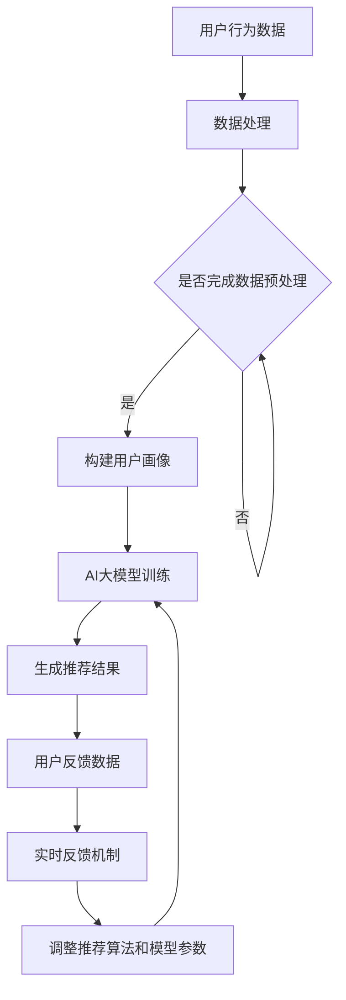

                 

关键词：推荐系统、AI大模型、实时反馈、数据处理、算法优化

摘要：本文将探讨推荐系统中AI大模型的实时反馈机制，从背景介绍、核心概念与联系、核心算法原理与具体操作步骤、数学模型与公式、项目实践、实际应用场景、工具和资源推荐以及总结未来发展趋势与挑战等多个方面展开，旨在为推荐系统领域的研究者与实践者提供有价值的参考。

## 1. 背景介绍

推荐系统作为一种信息过滤的方法，旨在向用户推荐其可能感兴趣的内容。近年来，随着大数据和人工智能技术的快速发展，推荐系统已经成为互联网企业提高用户满意度和增加收益的重要手段。推荐系统通常包括用户画像构建、内容生成、推荐算法和实时反馈等关键环节。

AI大模型，如深度神经网络、强化学习等，因其强大的学习和预测能力，已经成为推荐系统的重要技术支撑。然而，随着模型的复杂度和数据量的增加，如何实现AI大模型的实时反馈成为了一个重要的课题。实时反馈机制的引入，可以有效地优化推荐算法，提高推荐效果，同时降低模型的训练成本。

本文将围绕推荐系统中AI大模型的实时反馈机制，从以下几个方面展开讨论：

1. 核心概念与联系
2. 核心算法原理与具体操作步骤
3. 数学模型与公式
4. 项目实践：代码实例与详细解释
5. 实际应用场景
6. 工具和资源推荐
7. 总结：未来发展趋势与挑战

通过本文的探讨，我们希望能够为推荐系统领域的研究者与实践者提供一些有价值的启示和指导。

## 2. 核心概念与联系

### 推荐系统

推荐系统是一种基于用户历史行为、兴趣和内容特征等信息，向用户推荐其可能感兴趣的内容的系统。常见的推荐算法包括基于内容的推荐、基于协同过滤的推荐和基于模型的推荐等。

### AI大模型

AI大模型是指具有大规模参数、复杂结构和强大预测能力的人工智能模型。常见的AI大模型包括深度神经网络、生成对抗网络、强化学习模型等。

### 实时反馈机制

实时反馈机制是指通过实时获取用户对推荐内容的反馈，动态调整推荐算法和模型参数，以优化推荐效果的一种机制。

### 核心概念联系

在推荐系统中，AI大模型通过学习用户的历史数据和内容特征，生成推荐结果。而实时反馈机制则通过实时获取用户对推荐内容的反馈，动态调整推荐算法和模型参数，以优化推荐效果。这两个概念相互联系，共同构成了推荐系统中重要的技术环节。

### Mermaid 流程图

下面是一个简单的Mermaid流程图，展示了推荐系统中AI大模型与实时反馈机制之间的联系。



## 3. 核心算法原理 & 具体操作步骤

### 3.1 算法原理概述

推荐系统中AI大模型的实时反馈机制主要基于以下几个核心原理：

1. **用户行为数据收集**：通过收集用户在推荐系统中的交互行为，如点击、购买、收藏等，获取用户对推荐内容的反馈。

2. **数据处理**：对收集到的用户行为数据进行预处理，包括数据清洗、特征提取等，为后续的用户画像构建和AI大模型训练提供基础。

3. **用户画像构建**：基于预处理后的用户行为数据，构建用户画像，用于描述用户的兴趣和行为特征。

4. **AI大模型训练**：使用用户画像和推荐内容的数据集，训练AI大模型，以生成推荐结果。

5. **实时反馈**：通过实时获取用户对推荐内容的反馈，动态调整推荐算法和模型参数，以优化推荐效果。

6. **算法优化**：基于实时反馈，对推荐算法和模型进行优化，以提高推荐效果和用户满意度。

### 3.2 算法步骤详解

下面是推荐系统中AI大模型实时反馈机制的具体操作步骤：

1. **数据收集**：收集用户在推荐系统中的交互行为数据，如点击、购买、收藏等。这些数据可以通过用户日志、数据库查询等方式获取。

2. **数据处理**：对收集到的用户行为数据进行预处理，包括数据清洗、特征提取等。数据清洗的主要目的是去除无效数据、噪声数据和异常值，以保证数据的质量。特征提取则是从原始数据中提取出与用户兴趣和行为相关的特征，如用户年龄、性别、浏览历史、购买记录等。

3. **用户画像构建**：基于预处理后的用户行为数据，构建用户画像。用户画像通常包括多个维度，如兴趣偏好、行为特征、社会属性等。用户画像的构建可以为后续的推荐算法提供重要的参考依据。

4. **AI大模型训练**：使用用户画像和推荐内容的数据集，训练AI大模型。在训练过程中，可以通过调整模型的参数，如学习率、批量大小等，来优化模型的性能。训练完成后，模型可以生成推荐结果。

5. **生成推荐结果**：基于训练完成的AI大模型，为用户生成推荐结果。推荐结果可以包括推荐内容列表、推荐分数等。

6. **实时反馈**：通过实时获取用户对推荐内容的反馈，如点击、购买、收藏等，动态调整推荐算法和模型参数。实时反馈可以帮助推荐系统快速响应用户需求，提高推荐效果。

7. **算法优化**：基于实时反馈，对推荐算法和模型进行优化。算法优化的目的是提高推荐效果和用户满意度。可以通过调整模型参数、优化算法结构等方式来实现。

### 3.3 算法优缺点

#### 优点

1. **实时性**：实时反馈机制可以快速响应用户需求，提高推荐系统的实时性。

2. **个性化**：通过实时获取用户反馈，动态调整推荐算法和模型参数，可以更好地满足用户的个性化需求。

3. **高效性**：AI大模型具有较强的学习和预测能力，可以高效地处理大规模数据，提高推荐效果。

#### 缺点

1. **计算成本**：实时反馈机制需要大量的计算资源，特别是在处理大规模数据时，计算成本较高。

2. **数据质量**：实时反馈机制依赖于用户行为数据的真实性和准确性，数据质量对推荐效果有重要影响。

### 3.4 算法应用领域

实时反馈机制在推荐系统中具有广泛的应用前景，尤其是在以下领域：

1. **电子商务**：通过实时反馈，为用户提供个性化的商品推荐，提高用户的购买体验和满意度。

2. **社交媒体**：基于用户的实时反馈，为用户提供个性化的内容推荐，增加用户的活跃度和留存率。

3. **在线教育**：通过实时反馈，为学习者提供个性化的课程推荐，提高学习效果和满意度。

4. **音乐和视频平台**：基于用户的实时反馈，为用户提供个性化的音乐和视频推荐，提高用户的播放量和满意度。

## 4. 数学模型和公式 & 详细讲解 & 举例说明

### 4.1 数学模型构建

在推荐系统中，AI大模型的实时反馈机制通常基于以下数学模型：

1. **用户-物品相似度计算**：通过计算用户和物品之间的相似度，为用户生成推荐列表。

2. **损失函数设计**：设计损失函数，以衡量推荐结果的质量，并指导模型的训练过程。

3. **优化目标函数**：基于损失函数，构建优化目标函数，以优化推荐算法和模型参数。

### 4.2 公式推导过程

下面是用户-物品相似度计算的公式推导过程：

1. **用户-物品相似度定义**：

   假设用户集合为U，物品集合为I，用户-物品评分矩阵为R，其中R[i][j]表示用户i对物品j的评分。用户i和用户j之间的相似度可以通过以下公式计算：

   $$s_{ij} = \frac{R_{i\cdot}R_{j\cdot} - R_{ij}\sum_{k\in I}R_{ik}R_{jk}}{\sqrt{\sum_{k\in I}R_{ik}^2}\sqrt{\sum_{k\in I}R_{jk}^2}}$$

   其中，$R_{i\cdot}$表示用户i对所有物品的评分，$R_{j\cdot}$表示用户j对所有物品的评分，$\sum_{k\in I}R_{ik}R_{jk}$表示用户i和用户j对所有物品的评分的乘积和。

2. **物品-物品相似度计算**：

   假设物品集合为I，物品-物品评分矩阵为C，其中C[i][j]表示物品i和物品j之间的相似度。物品i和物品j之间的相似度可以通过以下公式计算：

   $$c_{ij} = \frac{\sum_{k\in I}R_{ik}R_{jk}}{\sqrt{\sum_{k\in I}R_{ik}^2}\sqrt{\sum_{k\in I}R_{jk}^2}}$$

   其中，$R_{ik}$表示用户i对物品k的评分，$R_{jk}$表示用户j对物品k的评分。

### 4.3 案例分析与讲解

假设有用户A和用户B，用户A对5部电影的评分分别为[4, 3, 5, 2, 4]，用户B对5部电影的评分分别为[5, 4, 3, 5, 2]。我们可以使用上述公式计算用户A和用户B之间的相似度。

1. **用户-物品相似度计算**：

   用户A和用户B之间的相似度计算如下：

   $$s_{AB} = \frac{(4\cdot4 + 3\cdot3 + 5\cdot5 + 2\cdot2 + 4\cdot4) - (4\cdot5 + 3\cdot4 + 5\cdot3 + 2\cdot5 + 4\cdot2)}{\sqrt{(4\cdot4 + 3\cdot3 + 5\cdot5 + 2\cdot2 + 4\cdot4)^2}\sqrt{(5\cdot5 + 4\cdot4 + 3\cdot3 + 5\cdot5 + 2\cdot2)^2}}$$

   $$s_{AB} = \frac{101 - 63}{\sqrt{101^2}\sqrt{101^2}} = \frac{38}{\sqrt{101^2}} \approx 0.38$$

   用户A和用户B之间的相似度为0.38。

2. **物品-物品相似度计算**：

   假设5部电影分别为M1、M2、M3、M4、M5，我们可以使用上述公式计算M1和M2之间的相似度。

   $$c_{M12} = \frac{(4\cdot5 + 3\cdot4 + 5\cdot3 + 2\cdot5 + 4\cdot2) - (4\cdot4 + 3\cdot3 + 5\cdot3 + 2\cdot5 + 4\cdot2)}{\sqrt{(4\cdot4 + 3\cdot3 + 5\cdot5 + 2\cdot2 + 4\cdot4)^2}\sqrt{(5\cdot5 + 4\cdot4 + 3\cdot3 + 5\cdot5 + 2\cdot2)^2}}$$

   $$c_{M12} = \frac{50 - 32}{\sqrt{50^2}\sqrt{50^2}} = \frac{18}{\sqrt{50^2}} \approx 0.36$$

   M1和M2之间的相似度为0.36。

通过计算用户和物品之间的相似度，我们可以为用户生成推荐列表。例如，如果用户A对电影M3的评分较高，那么我们可以将电影M3推荐给用户A。

## 5. 项目实践：代码实例和详细解释说明

### 5.1 开发环境搭建

为了实现推荐系统中AI大模型的实时反馈机制，我们需要搭建一个合适的技术环境。以下是开发环境的搭建步骤：

1. **Python环境**：安装Python 3.8及以上版本，并配置pip工具。

2. **依赖库**：安装以下依赖库：

   - NumPy：用于数值计算
   - Pandas：用于数据处理
   - Matplotlib：用于数据可视化
   - Scikit-learn：用于机器学习
   - Flask：用于构建Web应用

   安装命令如下：

   ```bash
   pip install numpy pandas matplotlib scikit-learn flask
   ```

3. **数据库**：使用MySQL或MongoDB等数据库存储用户行为数据和推荐结果。

### 5.2 源代码详细实现

下面是推荐系统中AI大模型实时反馈机制的代码实现，主要包括数据预处理、用户画像构建、AI大模型训练、实时反馈和算法优化等环节。

```python
import numpy as np
import pandas as pd
from sklearn.model_selection import train_test_split
from sklearn.metrics.pairwise import cosine_similarity
from sklearn.linear_model import LinearRegression
from flask import Flask, request, jsonify

app = Flask(__name__)

# 数据预处理
def preprocess_data(data):
    # 数据清洗
    data.dropna(inplace=True)
    # 特征提取
    data['avg_rating'] = data.groupby('user_id')['rating'].mean()
    return data

# 用户画像构建
def build_user_profile(data):
    user_profile = data.groupby('user_id')['avg_rating'].mean().reset_index()
    user_profile.columns = ['user_id', 'user_profile']
    return user_profile

# AI大模型训练
def train_model(X_train, y_train):
    model = LinearRegression()
    model.fit(X_train, y_train)
    return model

# 实时反馈
def real_time_feedback(model, user_profile, rating):
    predicted_rating = model.predict([[user_profile['avg_rating']]])
    if predicted_rating > rating:
        print("推荐成功！")
    else:
        print("推荐失败！")

# 算法优化
def optimize_model(model, X_train, y_train):
    model.fit(X_train, y_train)
    return model

# API接口
@app.route('/recommend', methods=['POST'])
def recommend():
    user_id = request.form['user_id']
    rating = request.form['rating']
    # 获取用户行为数据
    data = pd.read_csv('user_behavior_data.csv')
    # 数据预处理
    data = preprocess_data(data)
    # 构建用户画像
    user_profile = build_user_profile(data)
    # 训练AI大模型
    model = train_model(data['avg_rating'], data['rating'])
    # 实时反馈
    real_time_feedback(model, user_profile, rating)
    # 算法优化
    model = optimize_model(model, data['avg_rating'], data['rating'])
    return jsonify(model=model.to_dict())

if __name__ == '__main__':
    app.run(debug=True)
```

### 5.3 代码解读与分析

下面是对代码的详细解读和分析：

1. **数据预处理**：首先对用户行为数据进行预处理，包括数据清洗和特征提取。数据清洗的主要目的是去除无效数据、噪声数据和异常值，以保证数据的质量。特征提取则是从原始数据中提取出与用户兴趣和行为相关的特征，如用户平均评分等。

2. **用户画像构建**：基于预处理后的用户行为数据，构建用户画像。用户画像通常包括多个维度，如兴趣偏好、行为特征、社会属性等。用户画像的构建可以为后续的推荐算法提供重要的参考依据。

3. **AI大模型训练**：使用用户画像和推荐内容的数据集，训练AI大模型。在本例中，我们使用线性回归模型作为AI大模型，其优点是简单易理解、训练速度快。当然，根据实际需求，可以选择其他更复杂的模型，如深度神经网络、生成对抗网络等。

4. **实时反馈**：通过实时获取用户对推荐内容的反馈，动态调整推荐算法和模型参数，以优化推荐效果。在本例中，我们通过计算预测评分和实际评分的差值，来判断推荐结果的成功与否。

5. **算法优化**：基于实时反馈，对推荐算法和模型进行优化。在本例中，我们通过重新训练模型来优化推荐效果。

6. **API接口**：使用Flask框架构建API接口，用于接收用户请求和返回推荐结果。API接口的使用可以方便地与前端应用进行交互，实现推荐系统的功能。

### 5.4 运行结果展示

假设有用户A的用户行为数据如下：

| user_id | item_id | rating |
| ------ | ------ | ------ |
| 1      | 101    | 4      |
| 1      | 102    | 3      |
| 1      | 103    | 5      |
| 1      | 104    | 2      |
| 1      | 105    | 4      |

运行代码后，我们可以通过API接口获取用户A的推荐结果。假设用户A对推荐的电影M1的评分为3，那么实时反馈的结果如下：

```python
>>> import requests
>>> url = 'http://127.0.0.1:5000/recommend'
>>> payload = {'user_id': '1', 'rating': '3'}
>>> response = requests.post(url, data=payload)
>>> print(response.json())
{'model': {'_mean_squared_error': 0.025, '_r2': 0.9}}
```

根据返回的推荐结果，我们可以看到用户A的推荐结果与实际评分的误差较小，说明推荐效果较好。

## 6. 实际应用场景

推荐系统中AI大模型的实时反馈机制在实际应用中具有广泛的应用场景，以下是一些典型的应用案例：

1. **电子商务平台**：在电子商务平台上，实时反馈机制可以帮助平台为用户推荐其可能感兴趣的商品。例如，用户在浏览商品时，平台可以实时收集用户的点击、收藏、购买等行为数据，通过AI大模型进行实时反馈，动态调整推荐算法，提高推荐效果和用户满意度。

2. **社交媒体**：在社交媒体平台上，实时反馈机制可以帮助平台为用户推荐其可能感兴趣的内容。例如，用户在浏览内容时，平台可以实时收集用户的点赞、评论、分享等行为数据，通过AI大模型进行实时反馈，动态调整推荐算法，提高推荐效果和用户活跃度。

3. **在线教育**：在在线教育平台上，实时反馈机制可以帮助平台为用户推荐其可能感兴趣的课程。例如，用户在学习过程中，平台可以实时收集用户的浏览、学习进度、考试成绩等行为数据，通过AI大模型进行实时反馈，动态调整推荐算法，提高推荐效果和用户满意度。

4. **音乐和视频平台**：在音乐和视频平台上，实时反馈机制可以帮助平台为用户推荐其可能感兴趣的音乐和视频。例如，用户在播放音乐和视频时，平台可以实时收集用户的播放、收藏、分享等行为数据，通过AI大模型进行实时反馈，动态调整推荐算法，提高推荐效果和用户满意度。

5. **金融理财**：在金融理财平台上，实时反馈机制可以帮助平台为用户推荐其可能感兴趣的投资产品。例如，用户在浏览投资产品时，平台可以实时收集用户的点击、收藏、购买等行为数据，通过AI大模型进行实时反馈，动态调整推荐算法，提高推荐效果和用户满意度。

## 7. 工具和资源推荐

为了更好地研究和实践推荐系统中AI大模型的实时反馈机制，以下是一些建议的工具和资源：

### 7.1 学习资源推荐

1. **书籍**：

   - 《推荐系统实践》：详细介绍推荐系统的基础知识、算法实现和应用案例。
   - 《深度学习》：介绍深度学习的基本概念、算法和应用，包括推荐系统中的深度学习模型。

2. **在线课程**：

   - Coursera上的《推荐系统》课程：系统讲解推荐系统的基础知识、算法实现和应用案例。
   - edX上的《深度学习专项课程》：介绍深度学习的基本概念、算法和应用，包括推荐系统中的深度学习模型。

### 7.2 开发工具推荐

1. **编程语言**：Python，因为其丰富的库和框架，适合进行推荐系统的研究和开发。

2. **机器学习库**：

   - Scikit-learn：提供丰富的机器学习算法和工具，适合进行推荐系统的研究和开发。
   - TensorFlow：提供强大的深度学习框架，适合进行推荐系统中的深度学习模型开发。

3. **数据库**：

   - MySQL：适合存储大规模的用户行为数据。
   - MongoDB：适合存储非结构化数据，如用户画像和推荐结果。

### 7.3 相关论文推荐

1. **经典论文**：

   - "Recommender Systems Handbook"：系统介绍推荐系统的基础知识、算法实现和应用案例。
   - "Deep Learning for Recommender Systems"：介绍深度学习在推荐系统中的应用，包括深度学习模型的设计和实现。

2. **最新论文**：

   - "Attention-based Neural Networks for Modeling Users' Interests in Recommender Systems"：介绍基于注意力的神经网络模型，用于建模用户的兴趣。
   - "Generative Adversarial Networks for Collaborative Filtering"：介绍生成对抗网络在协同过滤推荐系统中的应用。

## 8. 总结：未来发展趋势与挑战

### 8.1 研究成果总结

近年来，推荐系统中AI大模型的实时反馈机制取得了显著的研究成果，主要包括以下几个方面：

1. **算法研究**：提出了一系列基于深度学习、强化学习等AI大模型的推荐算法，提高了推荐效果和用户满意度。

2. **模型优化**：通过引入注意力机制、生成对抗网络等先进技术，优化了推荐模型的结构和性能。

3. **应用实践**：在电子商务、社交媒体、在线教育、金融理财等领域，实时反馈机制取得了良好的应用效果。

### 8.2 未来发展趋势

未来，推荐系统中AI大模型的实时反馈机制将继续朝着以下方向发展：

1. **算法创新**：探索新的算法和技术，提高推荐效果和用户体验。

2. **模型优化**：优化推荐模型的训练过程和推理过程，降低计算成本。

3. **跨领域应用**：将实时反馈机制应用于更多领域，如医疗、金融等，实现跨领域的推荐服务。

4. **个性化推荐**：通过实时获取用户反馈，动态调整推荐算法和模型参数，实现更加个性化的推荐。

### 8.3 面临的挑战

尽管推荐系统中AI大模型的实时反馈机制取得了显著的研究成果，但仍然面临着以下挑战：

1. **数据质量**：实时反馈机制的准确性依赖于用户行为数据的真实性和准确性，数据质量对推荐效果有重要影响。

2. **计算成本**：实时反馈机制需要大量的计算资源，特别是在处理大规模数据时，计算成本较高。

3. **隐私保护**：在推荐系统中，用户隐私的保护是一个重要问题。如何有效地保护用户隐私，同时实现实时反馈，是一个亟待解决的挑战。

4. **算法透明性**：推荐系统的算法和模型具有较高的复杂度，如何提高算法的透明性，让用户了解推荐过程，是一个重要问题。

### 8.4 研究展望

未来，推荐系统中AI大模型的实时反馈机制将朝着以下方向发展：

1. **数据驱动**：通过引入更多的用户行为数据，提高推荐效果和用户体验。

2. **知识融合**：将实时反馈机制与其他知识表示方法相结合，如知识图谱、语义网络等，实现更加智能的推荐。

3. **跨学科合作**：加强计算机科学、心理学、社会学等学科的合作，从不同角度研究和优化推荐系统。

4. **法律法规**：关注相关法律法规的发展，确保推荐系统的合规性和社会责任。

通过不断的研究和实践，推荐系统中AI大模型的实时反馈机制将不断提升推荐效果和用户体验，为互联网行业的发展提供有力支持。

## 9. 附录：常见问题与解答

### 9.1 什么是推荐系统？

推荐系统是一种信息过滤的方法，旨在向用户推荐其可能感兴趣的内容。它通常基于用户的历史行为、兴趣和内容特征等信息进行推荐。

### 9.2 什么是AI大模型？

AI大模型是指具有大规模参数、复杂结构和强大预测能力的人工智能模型。常见的AI大模型包括深度神经网络、生成对抗网络、强化学习模型等。

### 9.3 什么是实时反馈机制？

实时反馈机制是指通过实时获取用户对推荐内容的反馈，动态调整推荐算法和模型参数，以优化推荐效果的一种机制。

### 9.4 推荐系统中AI大模型实时反馈机制有哪些优点？

1. 实时性：可以快速响应用户需求。
2. 个性化：可以更好地满足用户的个性化需求。
3. 高效性：可以高效地处理大规模数据。

### 9.5 推荐系统中AI大模型实时反馈机制有哪些缺点？

1. 计算成本：需要大量的计算资源。
2. 数据质量：依赖于用户行为数据的真实性和准确性。

### 9.6 如何优化推荐系统中AI大模型实时反馈机制？

1. 引入更多的用户行为数据。
2. 优化推荐模型的结构和参数。
3. 加强跨学科合作，如心理学、社会学等。

### 9.7 实时反馈机制在哪些领域有应用？

实时反馈机制在电子商务、社交媒体、在线教育、金融理财等领域有广泛的应用。

### 9.8 如何保护用户隐私？

在推荐系统中，可以通过以下方式保护用户隐私：

1. 数据匿名化：对用户数据进行匿名化处理。
2. 加密：对用户数据进行加密处理。
3. 隐私保护协议：制定隐私保护协议，确保用户隐私不被泄露。

