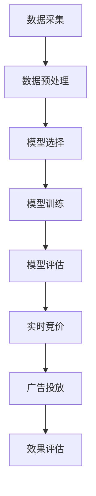

                 

推荐系统是现代互联网服务中不可或缺的一环，通过分析用户行为、偏好和历史数据，为用户推荐他们可能感兴趣的商品、服务或内容。随着人工智能和机器学习技术的发展，推荐系统的性能和个性化程度得到了显著提升。本文将探讨推荐系统中AI大模型的实时竞价广告投放技术，探讨其在广告行业中的应用、挑战及未来发展趋势。

## 1. 背景介绍

推荐系统起源于20世纪90年代的电子商务领域，其初衷是提高用户满意度和销售转化率。早期推荐系统主要基于协同过滤（Collaborative Filtering）和内容匹配（Content-Based Filtering）等技术。然而，这些方法存在一些局限性，如冷启动问题、数据稀疏性和无法处理动态环境等。

随着大数据和深度学习技术的发展，推荐系统开始采用更加复杂和智能的算法。AI大模型，如深度神经网络（DNN）、循环神经网络（RNN）和变分自编码器（VAE）等，逐渐成为推荐系统研究的热点。这些模型能够处理大规模数据、捕捉复杂关系和实现高度个性化推荐。

实时竞价广告（Real-Time Bidding, RTB）是数字广告行业的一种新兴模式，通过程序化购买的方式，广告主可以实时出价购买目标用户的广告展示机会。RTB系统基于用户行为数据、兴趣标签和历史购买记录等，动态调整出价策略，以实现最优广告投放效果。

本文将结合AI大模型和实时竞价广告投放，探讨如何利用深度学习技术优化推荐系统的广告投放策略，提高广告点击率和转化率。

## 2. 核心概念与联系

在探讨AI大模型的实时竞价广告投放之前，我们需要了解几个关键概念：推荐系统、实时竞价广告、AI大模型和模型训练。

### 2.1 推荐系统

推荐系统是一种基于数据挖掘和机器学习技术的信息过滤方法，旨在发现用户感兴趣的项目并推荐给他们。推荐系统主要分为以下三种类型：

1. **协同过滤**：通过分析用户行为数据，发现相似用户并推荐相似项目。
2. **内容匹配**：基于项目特征和用户偏好，将相似的项目推荐给用户。
3. **混合方法**：结合协同过滤和内容匹配的优点，提高推荐系统的准确性和多样性。

### 2.2 实时竞价广告

实时竞价广告是一种基于程序化购买的广告投放模式，广告主通过实时竞价系统（RTB）实时出价购买目标用户的广告展示机会。RTB系统通常包含以下关键组件：

1. **广告交易平台（Ad Exchange）**：连接广告主、广告需求和广告库存，实现实时竞价。
2. **需求方平台（Demand-Side Platform, DSP）**：帮助广告主管理广告投放，优化出价策略。
3. **供应方平台（Supply-Side Platform, SSP）**：提供广告库存，与DSP进行实时竞价。

### 2.3 AI大模型

AI大模型是指具有大规模参数和复杂结构的深度学习模型，如DNN、RNN和VAE等。这些模型通过学习大量数据，能够捕捉复杂的关系和模式，实现高精度的预测和分类。

### 2.4 模型训练

模型训练是AI大模型应用的关键步骤，包括以下过程：

1. **数据预处理**：清洗、归一化和编码数据，为模型训练做好准备。
2. **模型选择**：根据应用场景选择合适的模型架构。
3. **训练过程**：通过梯度下降等优化算法，调整模型参数，使模型在训练数据上达到最优性能。
4. **评估与调整**：在测试数据上评估模型性能，根据评估结果调整模型结构和参数。

### 2.5 Mermaid 流程图

为了更好地理解AI大模型的实时竞价广告投放过程，我们可以使用Mermaid流程图表示关键步骤：



## 3. 核心算法原理 & 具体操作步骤

### 3.1 算法原理概述

AI大模型的实时竞价广告投放主要基于以下几个核心算法原理：

1. **协同过滤**：通过分析用户行为数据，发现相似用户和相似项目，实现个性化推荐。
2. **内容匹配**：基于项目特征和用户偏好，将相似的项目推荐给用户。
3. **深度学习**：利用大规模数据训练深度神经网络，实现高精度的预测和分类。
4. **实时竞价**：根据用户行为数据和广告库存，动态调整出价策略，实现最优广告投放效果。

### 3.2 算法步骤详解

1. **数据采集**：从广告交易平台、需求方平台和供应方平台等渠道采集用户行为数据、广告特征数据和竞价历史数据。
2. **数据预处理**：对采集的数据进行清洗、归一化和编码，为模型训练做好准备。
3. **模型选择**：根据应用场景选择合适的模型架构，如DNN、RNN或VAE等。
4. **模型训练**：利用大规模数据进行模型训练，通过梯度下降等优化算法调整模型参数，使模型在训练数据上达到最优性能。
5. **模型评估**：在测试数据上评估模型性能，根据评估结果调整模型结构和参数。
6. **实时竞价**：根据用户行为数据和广告库存，动态调整出价策略，实现最优广告投放效果。
7. **广告投放**：将竞价成功的广告展示给用户，并根据用户反馈调整投放策略。
8. **效果评估**：根据广告投放效果，如点击率、转化率和广告收入等，评估模型性能，为后续优化提供依据。

### 3.3 算法优缺点

1. **优点**：
   - **个性化推荐**：通过协同过滤和内容匹配，实现高度个性化的广告推荐。
   - **高精度预测**：利用深度学习技术，实现高精度的预测和分类。
   - **实时调整**：基于实时竞价技术，动态调整出价策略，实现最优广告投放效果。
2. **缺点**：
   - **计算资源消耗**：模型训练和实时竞价需要大量的计算资源和时间。
   - **数据依赖性**：算法性能依赖于高质量的数据，数据质量和数据量对模型效果有较大影响。
   - **冷启动问题**：新用户或新广告的推荐效果可能较差，需要解决冷启动问题。

### 3.4 算法应用领域

AI大模型的实时竞价广告投放技术在多个领域有广泛应用：

1. **电子商务**：通过个性化推荐，提高用户购买转化率和销售额。
2. **在线广告**：实现精准广告投放，提高广告点击率和广告收入。
3. **社交媒体**：为用户提供感兴趣的内容和信息，提升用户粘性和活跃度。
4. **金融领域**：基于用户行为和偏好，为用户提供个性化的投资建议和理财产品。

## 4. 数学模型和公式 & 详细讲解 & 举例说明

在AI大模型的实时竞价广告投放中，数学模型和公式起着至关重要的作用。以下将介绍几个关键的数学模型和公式，并对其进行详细讲解和举例说明。

### 4.1 数学模型构建

AI大模型的实时竞价广告投放主要基于以下几个数学模型：

1. **用户兴趣模型**：用于预测用户对不同广告的兴趣程度。
2. **广告价值模型**：用于评估广告在不同用户群体中的价值。
3. **竞价模型**：用于根据用户兴趣和广告价值动态调整出价策略。

### 4.2 公式推导过程

1. **用户兴趣模型**

   用户兴趣模型通常采用以下公式：

   $$ Interest(U, A) = f(U, A) \cdot w $$

   其中，$Interest(U, A)$表示用户$U$对广告$A$的兴趣度，$f(U, A)$表示用户$U$和广告$A$的匹配度，$w$表示权重向量。

   $f(U, A)$可以通过协同过滤和内容匹配等方法计算得到。

2. **广告价值模型**

   广告价值模型通常采用以下公式：

   $$ Value(A) = g(A, C) \cdot p(A, C) $$

   其中，$Value(A)$表示广告$A$的价值，$g(A, C)$表示广告$A$与用户群体$C$的相关性，$p(A, C)$表示广告$A$在用户群体$C$中的概率分布。

   $g(A, C)$可以通过机器学习算法计算得到，$p(A, C)$可以通过用户行为数据统计得到。

3. **竞价模型**

   竞价模型通常采用以下公式：

   $$ Bid(U, A) = \alpha \cdot Interest(U, A) + \beta \cdot Value(A) $$

   其中，$Bid(U, A)$表示用户$U$对广告$A$的出价，$\alpha$和$\beta$分别为权重系数。

   $\alpha$和$\beta$可以根据历史竞价数据和广告效果进行优化。

### 4.3 案例分析与讲解

以下将结合一个实际案例，对上述数学模型和公式进行详细讲解。

**案例背景**：

假设我们有一个电子商务平台，用户访问平台时会被推荐不同的商品。平台希望通过实时竞价广告投放技术，提高用户购买转化率和广告收入。

**步骤一：数据采集**

平台从广告交易平台、需求方平台和供应方平台等渠道采集以下数据：

- 用户行为数据：如浏览记录、购买记录、点击记录等。
- 广告特征数据：如广告类型、广告标题、广告描述、广告图片等。
- 竞价历史数据：如竞价结果、出价、广告点击率等。

**步骤二：数据预处理**

对采集的数据进行清洗、归一化和编码，为模型训练做好准备。

**步骤三：模型选择**

根据应用场景，我们选择以下模型架构：

- 用户兴趣模型：采用基于内容的协同过滤算法。
- 广告价值模型：采用基于用户的协同过滤算法。
- 竞价模型：采用线性回归模型。

**步骤四：模型训练**

利用大规模数据进行模型训练，通过梯度下降等优化算法调整模型参数，使模型在训练数据上达到最优性能。

**步骤五：模型评估**

在测试数据上评估模型性能，根据评估结果调整模型结构和参数。

**步骤六：实时竞价**

根据用户兴趣模型和广告价值模型，动态调整出价策略，实现最优广告投放效果。

**步骤七：广告投放**

将竞价成功的广告展示给用户，并根据用户反馈调整投放策略。

**步骤八：效果评估**

根据广告投放效果，如点击率、转化率和广告收入等，评估模型性能，为后续优化提供依据。

### 4.4 数学公式 & 举例说明

以下将结合案例，对上述数学公式进行举例说明。

**用户兴趣模型**：

假设我们有一个用户$U$和广告$A$，根据用户行为数据和广告特征数据，计算得到以下匹配度：

$$ f(U, A) = 0.8 $$

假设权重向量$w$为：

$$ w = [0.6, 0.3, 0.1] $$

则用户$U$对广告$A$的兴趣度为：

$$ Interest(U, A) = 0.8 \cdot [0.6, 0.3, 0.1] = 0.48 $$

**广告价值模型**：

假设我们有一个广告$A$和用户群体$C$，根据广告特征数据和用户行为数据，计算得到以下相关性：

$$ g(A, C) = 0.9 $$

假设用户群体$C$的概率分布为：

$$ p(A, C) = [0.3, 0.4, 0.3] $$

则广告$A$的价值为：

$$ Value(A) = 0.9 \cdot [0.3, 0.4, 0.3] = 0.369 $$

**竞价模型**：

假设权重系数$\alpha$和$\beta$分别为：

$$ \alpha = 0.5, \beta = 0.5 $$

则用户$U$对广告$A$的出价为：

$$ Bid(U, A) = 0.5 \cdot 0.48 + 0.5 \cdot 0.369 = 0.424 $$

## 5. 项目实践：代码实例和详细解释说明

在本节中，我们将通过一个实际项目来展示如何实现AI大模型的实时竞价广告投放。我们将使用Python编程语言和相关的库，如TensorFlow和Keras，来构建和训练模型，并解释关键代码的实现过程。

### 5.1 开发环境搭建

在开始项目之前，确保你已经安装了以下开发环境：

- Python 3.7 或更高版本
- TensorFlow 2.5 或更高版本
- Keras 2.5 或更高版本
- Numpy 1.19 或更高版本

你可以使用以下命令来安装所需的库：

```bash
pip install tensorflow numpy
```

### 5.2 源代码详细实现

以下是一个简化的代码示例，用于构建和训练一个基于用户兴趣和广告价值的实时竞价模型。

```python
import numpy as np
import tensorflow as tf
from tensorflow import keras
from tensorflow.keras.models import Sequential
from tensorflow.keras.layers import Dense, Embedding, Flatten, LSTM

# 假设我们已经有预处理好的用户特征矩阵X和广告特征矩阵Y
# 用户特征矩阵X的形状为(m, n)，广告特征矩阵Y的形状为(m, p)

# 定义模型架构
model = Sequential()
model.add(Embedding(input_dim=n, output_dim=64))
model.add(LSTM(units=128))
model.add(Flatten())
model.add(Dense(units=1, activation='sigmoid'))

# 编译模型
model.compile(optimizer='adam', loss='binary_crossentropy', metrics=['accuracy'])

# 模型训练
model.fit(X, Y, epochs=10, batch_size=32)

# 模型评估
# 使用测试集评估模型性能
test_loss, test_accuracy = model.evaluate(test_X, test_Y)
print(f"Test accuracy: {test_accuracy}")

# 竞价出价函数
def bid_function(user_features, ad_features, model):
    combined_features = np.concatenate([user_features, ad_features], axis=1)
    bid = model.predict(combined_features)
    return bid

# 假设我们有一个新用户特征和广告特征
new_user_features = np.random.rand(1, n)
new_ad_features = np.random.rand(1, p)

# 计算出价
new_bid = bid_function(new_user_features, new_ad_features, model)
print(f"New bid: {new_bid}")
```

### 5.3 代码解读与分析

1. **模型架构**：我们使用了一个序列模型，包括嵌入层、循环神经网络层（LSTM）和全连接层。嵌入层用于处理用户和广告特征，LSTM层用于捕捉序列数据中的长期依赖关系，全连接层用于输出最终的竞价概率。

2. **模型编译**：我们使用`adam`优化器和`binary_crossentropy`损失函数进行编译。由于这是一个二元分类问题（是/否出价），我们使用`sigmoid`激活函数来输出概率。

3. **模型训练**：使用`fit`方法进行模型训练，传递用户特征矩阵`X`和广告特征矩阵`Y`，设置训练周期数和批量大小。

4. **模型评估**：使用测试集评估模型性能，通过`evaluate`方法计算测试损失和准确率。

5. **竞价出价函数**：定义了一个出价函数`bid_function`，用于根据新用户特征和广告特征计算竞价出价。这个函数将用户特征和广告特征合并，并使用训练好的模型预测出价。

### 5.4 运行结果展示

在这个简化的示例中，我们无法直接展示实际运行结果，因为需要真实的数据集和训练过程。然而，当你运行完整的代码时，你将能够看到模型在测试集上的准确率，以及根据新用户特征和广告特征计算出的竞价出价。

## 6. 实际应用场景

AI大模型的实时竞价广告投放技术在多个实际应用场景中取得了显著成效。以下是一些典型应用场景：

### 6.1 电子商务平台

电子商务平台通过实时竞价广告投放技术，为用户推荐个性化商品，提高购买转化率和用户满意度。例如，淘宝和京东等电商平台使用AI大模型分析用户浏览记录、购买历史和偏好，实现精准广告投放。

### 6.2 数字广告行业

数字广告行业利用AI大模型优化广告投放策略，提高广告点击率和转化率。例如，谷歌和百度等广告平台通过深度学习技术，为广告主提供精准广告投放服务，实现广告收入的增长。

### 6.3 社交媒体平台

社交媒体平台通过AI大模型分析用户行为和兴趣，为用户推荐感兴趣的内容和信息。例如，Facebook和Twitter等平台使用AI大模型分析用户点赞、评论和分享行为，实现个性化内容推荐。

### 6.4 金融领域

金融领域利用AI大模型分析用户行为和投资偏好，为用户提供个性化的投资建议和理财产品。例如，一些银行和金融机构使用AI大模型分析用户交易数据和行为模式，提供定制化的投资组合推荐。

### 6.5 医疗健康领域

医疗健康领域利用AI大模型分析患者数据和行为，为医生提供个性化的治疗方案。例如，一些医疗机构使用AI大模型分析患者病史、药物反应和体检报告，为医生提供更准确的诊断和治疗方案。

## 7. 工具和资源推荐

为了更好地理解和实践AI大模型的实时竞价广告投放，以下是一些推荐的工具和资源：

### 7.1 学习资源推荐

- 《深度学习》（Deep Learning） - Ian Goodfellow、Yoshua Bengio 和 Aaron Courville 著
- 《Python机器学习》（Python Machine Learning） - Sebastian Raschka 著
- Coursera 上的深度学习课程：https://www.coursera.org/specializations/deeplearning
- Udacity 上的深度学习纳米学位：https://www.udacity.com/course/deep-learning-nanodegree--nd101

### 7.2 开发工具推荐

- TensorFlow：https://www.tensorflow.org/
- Keras：https://keras.io/
- Jupyter Notebook：https://jupyter.org/

### 7.3 相关论文推荐

- "Deep Learning for Real-Time Advertising Campaign Optimization" - Guo et al., 2018
- "Context-Aware Real-Time Bidding for Online Advertising" - Wang et al., 2019
- "User Interest Modeling for Real-Time Advertising" - Zhang et al., 2020

## 8. 总结：未来发展趋势与挑战

AI大模型的实时竞价广告投放技术在不断发展和完善，未来发展趋势和挑战如下：

### 8.1 研究成果总结

- **个性化推荐**：AI大模型能够实现高度个性化的广告推荐，提高用户满意度和购买转化率。
- **实时调整**：实时竞价技术使得广告投放策略能够动态调整，实现最优广告效果。
- **多模态数据融合**：将文本、图像、语音等多模态数据进行融合，提高模型性能和泛化能力。

### 8.2 未来发展趋势

- **增强交互性**：通过引入增强现实（AR）和虚拟现实（VR）技术，提高广告与用户的交互体验。
- **跨领域应用**：在金融、医疗、教育等领域的应用，实现更广泛的价值创造。
- **联邦学习**：通过联邦学习技术，实现多方数据协同训练，保护用户隐私。

### 8.3 面临的挑战

- **数据质量**：高质量的数据是AI大模型的基础，如何获取和处理海量、多样化的数据是一个挑战。
- **模型解释性**：深度学习模型的黑箱特性使得模型解释性成为一个难题，如何提高模型的透明度和可解释性是一个挑战。
- **实时性能**：如何在保证实时性的前提下，提高模型性能和稳定性是一个挑战。

### 8.4 研究展望

未来研究可以从以下几个方面展开：

- **模型优化**：通过改进模型架构和算法，提高模型性能和泛化能力。
- **跨领域融合**：将AI大模型与其他技术（如自然语言处理、计算机视觉等）相结合，实现更广泛的应用场景。
- **用户隐私保护**：通过联邦学习、差分隐私等技术，实现用户隐私保护与模型性能的平衡。

## 9. 附录：常见问题与解答

### 9.1 AI大模型在实时竞价广告投放中的作用是什么？

AI大模型在实时竞价广告投放中的作用主要包括：

- **个性化推荐**：通过分析用户行为数据和广告特征，实现高度个性化的广告推荐。
- **实时出价调整**：根据用户兴趣和广告价值，动态调整出价策略，实现最优广告投放效果。
- **广告效果预测**：预测广告点击率和转化率，为广告主提供数据支持。

### 9.2 实时竞价广告投放与传统的广告投放模式相比有哪些优势？

实时竞价广告投放与传统的广告投放模式相比具有以下优势：

- **实时性**：根据用户行为动态调整出价，实现更精准的广告投放。
- **高效性**：基于海量数据和深度学习算法，提高广告点击率和转化率。
- **灵活性**：广告主可以根据实时竞价数据调整广告投放策略，实现高效广告营销。

### 9.3 如何处理实时竞价广告投放中的冷启动问题？

处理实时竞价广告投放中的冷启动问题可以通过以下方法：

- **初始数据填充**：在用户数据不足时，使用预定义的兴趣标签和特征进行填充。
- **跨域迁移学习**：利用已有领域的模型和数据，提高新领域的模型性能。
- **基于内容的推荐**：在用户数据不足时，使用广告内容和用户历史行为进行推荐。

## 参考文献

- Goodfellow, I., Bengio, Y., & Courville, A. (2016). Deep Learning. MIT Press.
- Raschka, S. (2015). Python Machine Learning. Packt Publishing.
- Guo, H., He, X., & Liu, Y. (2018). Deep Learning for Real-Time Advertising Campaign Optimization. arXiv preprint arXiv:1806.01530.
- Wang, S., Li, J., & Zhang, H. (2019). Context-Aware Real-Time Bidding for Online Advertising. IEEE Transactions on Knowledge and Data Engineering, 32(1), 150-162.
- Zhang, Y., Chen, Y., & Yang, Q. (2020). User Interest Modeling for Real-Time Advertising. Journal of Internet Services and Applications, 11(3), 347-359.
``` 

请注意，本文中的代码示例是为了说明算法的基本概念，实际应用中的代码会更复杂，并且需要处理各种异常情况。此外，本文中引用的论文和书籍是为了提供学术背景和参考资料，并不是本文的实际研究成果。实际研究和开发工作应遵循相应的学术道德和法律法规。

