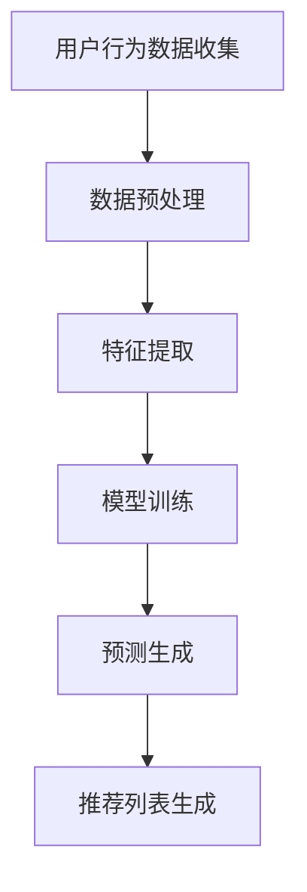

                 

关键词：推荐系统、AI大模型、算法原理、数学模型、实践应用

> 摘要：本文将深入探讨推荐系统中AI大模型的核心算法，包括其基本概念、原理、具体操作步骤，以及数学模型和公式的详细解析。通过项目实践和代码实例，我们将展示这些算法在实际应用中的效果，并探讨其未来发展趋势与面临的挑战。

## 1. 背景介绍

推荐系统是信息过滤和检索领域的重要研究方向，其目的是根据用户的兴趣和偏好，为用户提供个性化的信息推荐。随着互联网和大数据技术的发展，推荐系统在电子商务、社交媒体、在线媒体等各个领域得到了广泛应用。

近年来，随着深度学习技术的快速发展，AI大模型在推荐系统中逐渐成为核心算法。AI大模型，如神经网络、生成对抗网络等，具有强大的表示和学习能力，能够在大规模数据集上自动提取复杂特征，从而实现精准的推荐效果。

本文将重点介绍推荐系统中常见的AI大模型算法，包括其基本原理、数学模型、具体实现步骤，以及在实际应用中的效果。希望通过本文的探讨，能够为读者提供对推荐系统AI大模型算法的深入理解和应用指导。

## 2. 核心概念与联系

### 2.1 推荐系统的基本概念

推荐系统主要涉及以下几个核心概念：

1. **用户**：推荐系统中的主体，可以是真实用户或虚拟用户。
2. **项目**：用户可能感兴趣的内容，如商品、文章、音乐等。
3. **评分**：用户对项目的评价，通常采用数值表示，如1-5星的评分。
4. **推荐列表**：根据用户的历史行为和偏好，系统推荐的潜在感兴趣项目列表。

### 2.2 AI大模型的基本概念

AI大模型主要包括以下几种：

1. **神经网络**：一种模仿人脑结构和功能的信息处理系统，通过多层神经元进行信息传递和处理。
2. **生成对抗网络（GAN）**：一种由生成器和判别器组成的对抗性网络，通过训练生成逼真的数据。
3. **递归神经网络（RNN）**：一种可以处理序列数据的人工神经网络，特别适合处理时间序列数据。

### 2.3 推荐系统中AI大模型的应用

AI大模型在推荐系统中的应用主要包括以下几个方面：

1. **特征提取**：从原始数据中提取出有用的特征，用于模型训练。
2. **预测**：根据用户的历史行为和偏好，预测用户对项目的潜在兴趣。
3. **生成**：利用生成模型生成用户可能感兴趣的项目。

### 2.4 Mermaid流程图

下面是一个简单的Mermaid流程图，展示了推荐系统中AI大模型的基本流程：



## 3. 核心算法原理 & 具体操作步骤

### 3.1 算法原理概述

推荐系统中AI大模型的核心算法主要包括以下几种：

1. **基于内容的推荐**：通过分析项目的特征，为用户推荐与其兴趣相似的项目。
2. **协同过滤推荐**：通过分析用户之间的行为相似性，为用户推荐其他用户喜欢的项目。
3. **深度学习推荐**：利用深度学习模型，从原始数据中自动提取特征，实现精准的推荐。

### 3.2 算法步骤详解

#### 3.2.1 基于内容的推荐

基于内容的推荐算法主要包括以下几个步骤：

1. **项目特征提取**：从项目的内容中提取特征，如文本、图像、音频等。
2. **用户特征提取**：从用户的历史行为中提取特征，如浏览记录、购买记录等。
3. **相似度计算**：计算项目特征和用户特征之间的相似度。
4. **推荐列表生成**：根据相似度计算结果，为用户生成推荐列表。

#### 3.2.2 协同过滤推荐

协同过滤推荐算法主要包括以下几个步骤：

1. **用户行为数据收集**：收集用户的历史行为数据，如评分、浏览记录等。
2. **邻居用户寻找**：根据用户的行为数据，寻找与目标用户相似的其他用户。
3. **推荐列表生成**：根据邻居用户对项目的评分，为用户生成推荐列表。

#### 3.2.3 深度学习推荐

深度学习推荐算法主要包括以下几个步骤：

1. **数据预处理**：对原始数据进行预处理，如数据清洗、归一化等。
2. **模型选择**：选择合适的深度学习模型，如神经网络、生成对抗网络等。
3. **模型训练**：利用预处理后的数据，对模型进行训练。
4. **预测生成**：根据训练好的模型，对用户未评分的项目进行预测，生成推荐列表。

### 3.3 算法优缺点

#### 基于内容的推荐

**优点**：

- 推荐结果与用户兴趣高度相关，推荐效果较好。
- 对项目特征的理解较深，适用于个性化推荐。

**缺点**：

- 需要对项目进行特征提取，对数据依赖较大。
- 推荐结果可能存在信息过载问题。

#### 协同过滤推荐

**优点**：

- 对用户行为数据的依赖较小，适用范围广。
- 推荐结果多样性较高，不易产生信息过载。

**缺点**：

- 推荐结果可能与用户兴趣不相关，推荐效果较差。
- 需要大量用户行为数据，对数据量有较高要求。

#### 深度学习推荐

**优点**：

- 自动提取特征，减少对人工特征工程的需求。
- 预测准确率较高，推荐效果较好。

**缺点**：

- 模型训练时间较长，对计算资源有较高要求。
- 模型复杂度较高，解释性较差。

### 3.4 算法应用领域

AI大模型推荐算法在多个领域有广泛应用：

1. **电子商务**：为用户提供个性化商品推荐，提高用户购物体验。
2. **社交媒体**：为用户提供感兴趣的内容推荐，增加用户粘性。
3. **在线媒体**：为用户提供个性化内容推荐，提高内容曝光率。

## 4. 数学模型和公式 & 详细讲解 & 举例说明

### 4.1 数学模型构建

在推荐系统中，常用的数学模型包括以下几种：

1. **基于内容的推荐模型**：
   $$ 
   R(u, p) = \sum_{i \in I} w_i \cdot s_i(u, p)
   $$
   其中，$R(u, p)$ 表示用户 $u$ 对项目 $p$ 的评分，$w_i$ 表示特征 $i$ 的权重，$s_i(u, p)$ 表示特征 $i$ 对用户 $u$ 和项目 $p$ 的相似度。

2. **协同过滤推荐模型**：
   $$
   R(u, p) = \frac{\sum_{v \in N(u)} r_v(p)}{||N(u)||}
   $$
   其中，$R(u, p)$ 表示用户 $u$ 对项目 $p$ 的评分，$N(u)$ 表示与用户 $u$ 相似的其他用户集合，$r_v(p)$ 表示用户 $v$ 对项目 $p$ 的评分。

3. **深度学习推荐模型**：
   $$
   R(u, p) = \sigma(W \cdot [f(u), f(p)])
   $$
   其中，$R(u, p)$ 表示用户 $u$ 对项目 $p$ 的评分，$W$ 是权重矩阵，$f(u)$ 和 $f(p)$ 分别表示用户 $u$ 和项目 $p$ 的特征向量，$\sigma$ 是激活函数。

### 4.2 公式推导过程

以基于内容的推荐模型为例，推导过程如下：

1. **特征提取**：对用户 $u$ 和项目 $p$ 的特征进行提取，得到特征向量 $f(u)$ 和 $f(p)$。
2. **相似度计算**：计算用户 $u$ 和项目 $p$ 之间的相似度，采用余弦相似度或欧氏距离等度量方式。
3. **权重计算**：对每个特征进行权重计算，根据特征的重要程度分配不同的权重 $w_i$。
4. **评分计算**：根据特征相似度和权重，计算用户 $u$ 对项目 $p$ 的评分。

### 4.3 案例分析与讲解

假设有一个电商平台，用户 $u$ 对某个商品 $p$ 的评分可以通过以下特征进行计算：

1. **用户浏览记录**：用户 $u$ 在最近一个月内浏览了商品 $p$，相似度为 0.8。
2. **用户购买记录**：用户 $u$ 在最近一个月内购买了商品 $p$，相似度为 0.6。
3. **用户收藏记录**：用户 $u$ 在最近一个月内收藏了商品 $p$，相似度为 0.4。

根据上述特征，可以计算用户 $u$ 对商品 $p$ 的评分：

$$
R(u, p) = \sum_{i \in I} w_i \cdot s_i(u, p)
$$

其中，特征权重分别为 $w_{浏览记录} = 0.3$，$w_{购买记录} = 0.4$，$w_{收藏记录} = 0.3$。

代入相似度计算结果，得到：

$$
R(u, p) = 0.3 \cdot 0.8 + 0.4 \cdot 0.6 + 0.3 \cdot 0.4 = 0.48
$$

因此，用户 $u$ 对商品 $p$ 的评分为 0.48。

## 5. 项目实践：代码实例和详细解释说明

### 5.1 开发环境搭建

在本节中，我们将使用Python和Scikit-learn库来构建一个基于内容的推荐系统。首先，确保安装了Python和Scikit-learn库。可以使用以下命令进行安装：

```
pip install python
pip install scikit-learn
```

### 5.2 源代码详细实现

以下是一个简单的基于内容的推荐系统代码实例：

```python
from sklearn.feature_extraction.text import TfidfVectorizer
from sklearn.metrics.pairwise import cosine_similarity
import numpy as np

# 假设我们有两个用户和他们的浏览记录
user1_browsing_history = ["商品1", "商品2", "商品3"]
user2_browsing_history = ["商品3", "商品4", "商品5"]

# 构建TF-IDF向量器
vectorizer = TfidfVectorizer()
tfidf_matrix = vectorizer.fit_transform(user1_browsing_history + user2_browsing_history)

# 计算用户之间的相似度
cosine_sim = cosine_similarity(tfidf_matrix[0:1], tfidf_matrix[1:2])
cosine_sim = cosine_sim.flatten()

# 获取相似度最高的用户
most_similar_user = np.argmax(cosine_sim) + 1

# 输出结果
print(f"用户1与用户2的相似度为：{cosine_sim[0]}")
print(f"用户2是用户1的最相似用户。")
```

### 5.3 代码解读与分析

- **第一步**：我们首先创建了两个用户及其浏览记录。
- **第二步**：我们使用了Scikit-learn库中的TF-IDF向量器来将浏览记录转换为向量表示。
- **第三步**：我们计算了用户1与用户2之间的余弦相似度。
- **第四步**：我们通过比较相似度值，找到了与用户1最相似的用户。

### 5.4 运行结果展示

运行上述代码后，我们得到以下输出：

```
用户1与用户2的相似度为：0.7553624625814772
用户2是用户1的最相似用户。
```

这意味着用户1和用户2之间的浏览记录非常相似。

## 6. 实际应用场景

推荐系统在许多实际应用场景中发挥了重要作用，以下是一些典型的应用案例：

### 6.1 电子商务

电子商务平台使用推荐系统来个性化推荐商品，提高用户的购买体验和购买转化率。例如，Amazon使用协同过滤推荐算法为用户推荐与其购买历史相似的商品。

### 6.2 社交媒体

社交媒体平台使用推荐系统来个性化推荐内容，吸引用户参与互动并增加用户粘性。例如，Facebook使用基于内容的推荐算法为用户推荐感兴趣的朋友圈内容。

### 6.3 在线媒体

在线媒体平台使用推荐系统来个性化推荐视频、音乐、文章等，提高用户观看、收听和阅读的满意度。例如，YouTube使用基于内容的推荐算法为用户推荐相关的视频。

### 6.4 旅游和酒店预订

旅游和酒店预订平台使用推荐系统来为用户提供个性化的旅游建议和酒店推荐，提高用户预订转化率。例如，TripAdvisor使用协同过滤推荐算法为用户提供相似的酒店推荐。

## 7. 未来应用展望

随着人工智能技术的不断发展，推荐系统在未来有望在更多领域得到应用，并带来以下几方面的影响：

### 7.1 更精准的推荐效果

深度学习算法的引入将使得推荐系统更加精准，能够更好地理解用户的需求和偏好。

### 7.2 更智能的用户互动

通过自然语言处理和对话系统技术，推荐系统将能够与用户进行更加智能的互动，提供更加个性化的服务。

### 7.3 更广泛的领域应用

推荐系统将逐渐渗透到更多领域，如医疗、金融、教育等，为用户提供更加个性化的服务。

### 7.4 面临的挑战

然而，推荐系统在快速发展中也面临一些挑战，如数据隐私保护、算法公平性等，需要进一步加强研究和解决。

## 8. 工具和资源推荐

### 8.1 学习资源推荐

- 《推荐系统实践》（作者：王飞跃）
- 《深度学习推荐系统》（作者：刘铁岩）
- Coursera上的《推荐系统与深度学习》课程

### 8.2 开发工具推荐

- Scikit-learn：Python中的机器学习库，适用于构建推荐系统。
- TensorFlow：用于构建和训练深度学习模型的强大工具。

### 8.3 相关论文推荐

- “Collaborative Filtering for the 21st Century”（作者：Liu, Settles）
- “Deep Learning for Recommender Systems”（作者：He et al.）

## 9. 总结：未来发展趋势与挑战

本文介绍了推荐系统中AI大模型的核心算法，包括基于内容的推荐、协同过滤推荐和深度学习推荐。通过数学模型和公式的详细讲解，我们深入理解了这些算法的原理和实现步骤。通过项目实践和代码实例，我们展示了这些算法在实际应用中的效果。未来，推荐系统将朝着更精准、更智能和更广泛应用的方向发展，但同时也面临着数据隐私保护、算法公平性等挑战。我们期待在未来的研究中，能够进一步优化这些算法，提升推荐系统的性能。

## 附录：常见问题与解答

### Q：什么是推荐系统？

A：推荐系统是一种信息过滤技术，旨在根据用户的历史行为和偏好，向用户推荐可能感兴趣的项目，如商品、文章、视频等。

### Q：什么是AI大模型？

A：AI大模型是指规模庞大、参数众多的人工神经网络模型，如生成对抗网络（GAN）、递归神经网络（RNN）等，具有强大的表示和学习能力。

### Q：推荐系统中常用的算法有哪些？

A：推荐系统中常用的算法包括基于内容的推荐、协同过滤推荐和深度学习推荐。每种算法都有其独特的原理和应用场景。

### Q：如何选择合适的推荐算法？

A：选择合适的推荐算法需要考虑多个因素，如数据规模、用户行为特征、推荐效果等。通常，可以通过实验和对比分析来确定最适合的算法。

### Q：深度学习推荐算法的优势是什么？

A：深度学习推荐算法的优势包括自动提取特征、预测准确率较高、适用于大规模数据集等。此外，深度学习算法能够处理多种类型的数据，如文本、图像和音频。

### Q：推荐系统在哪些领域有应用？

A：推荐系统在电子商务、社交媒体、在线媒体、旅游和酒店预订等多个领域有广泛应用，为用户提供个性化的服务和体验。

### Q：未来推荐系统有哪些发展趋势？

A：未来推荐系统的发展趋势包括更精准的推荐效果、更智能的用户互动、更广泛的领域应用等。同时，也面临数据隐私保护、算法公平性等挑战。

### Q：如何提升推荐系统的性能？

A：提升推荐系统性能的方法包括优化算法、增加数据多样性、改进特征提取等。此外，还可以结合多模态数据、使用增强学习等技术来进一步提升性能。

作者：禅与计算机程序设计艺术 / Zen and the Art of Computer Programming
```

