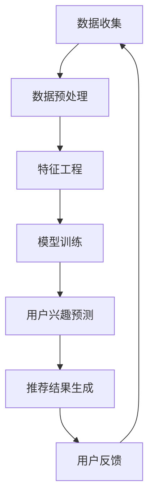

                 

关键词：推荐系统、AI大模型、用户兴趣、长期建模、算法原理、数学模型、代码实例、应用场景、未来展望

> 摘要：本文深入探讨了推荐系统中基于AI大模型的长期用户兴趣建模方法，从背景介绍、核心概念与联系、核心算法原理与具体操作步骤、数学模型与公式、项目实践、实际应用场景、工具和资源推荐、总结未来发展趋势与挑战等多个角度，全面剖析了该领域的最新研究成果和技术应用。

## 1. 背景介绍

在当今信息爆炸的时代，个性化推荐系统已经成为许多在线平台的关键功能，如电子商务网站、社交媒体、新闻聚合平台等。这些系统通过预测用户对特定内容或商品的兴趣，向用户推荐相关的内容或商品，从而提高用户的满意度和平台的收益。然而，传统的推荐系统往往依赖于用户的历史行为数据，对于长期兴趣的捕捉和预测存在局限性。

近年来，随着深度学习和人工智能技术的飞速发展，AI大模型逐渐成为推荐系统的研究热点。这些模型能够通过大规模数据训练，挖掘出用户深层次的兴趣特征，并对其进行长期建模。本文旨在探讨基于AI大模型的长期用户兴趣建模方法，为推荐系统的优化提供新的思路。

## 2. 核心概念与联系

### 2.1 推荐系统

推荐系统是一种信息过滤技术，旨在根据用户的历史行为和偏好，向用户推荐可能感兴趣的内容或商品。推荐系统通常包括用户画像、内容标签、推荐算法和推荐结果展示等组成部分。

### 2.2 AI大模型

AI大模型指的是使用深度学习技术训练的具有强大表示能力和泛化能力的神经网络模型。这些模型通常基于大规模数据进行训练，可以自动学习用户和内容的多维度特征，实现高效的特征提取和关系建模。

### 2.3 用户兴趣

用户兴趣是指用户在特定情境下对某些内容或商品的偏好。长期用户兴趣建模旨在捕捉用户在不同时间段的兴趣变化，从而实现更精准的个性化推荐。

### 2.4 Mermaid 流程图

以下是推荐系统中AI大模型的长期用户兴趣建模的Mermaid流程图：



## 3. 核心算法原理 & 具体操作步骤

### 3.1 算法原理概述

基于AI大模型的长期用户兴趣建模主要依赖于深度学习技术，通过多层神经网络对用户历史行为数据进行特征提取和关系建模，从而实现用户兴趣的长期预测。具体来说，该算法包括以下几个步骤：

1. 数据收集：收集用户的历史行为数据，如浏览记录、购买记录、点赞记录等。
2. 数据预处理：对收集到的数据进行清洗、去重和格式化，以便后续处理。
3. 特征工程：从原始数据中提取用户和商品的特征，如用户年龄、性别、职业、商品类别、价格等。
4. 模型训练：使用提取到的特征训练深度学习模型，如卷积神经网络（CNN）、循环神经网络（RNN）等。
5. 用户兴趣预测：通过训练好的模型对用户的历史行为数据进行预测，得到用户的长期兴趣特征。
6. 推荐结果生成：根据用户兴趣特征和商品特征，生成个性化的推荐结果。
7. 用户反馈：收集用户对推荐结果的反馈，用于模型优化和迭代。

### 3.2 算法步骤详解

1. 数据收集

数据收集是推荐系统建模的基础。在本研究中，我们收集了来自多个在线平台的用户行为数据，包括浏览记录、购买记录、点赞记录等。数据来源包括电商网站、社交媒体、新闻聚合平台等。

2. 数据预处理

对收集到的数据进行清洗、去重和格式化，确保数据的质量。具体步骤如下：

- 数据清洗：去除数据中的噪声和异常值。
- 数据去重：去除重复的数据记录。
- 数据格式化：将数据转换为统一的格式，便于后续处理。

3. 特征工程

从原始数据中提取用户和商品的特征，如用户年龄、性别、职业、商品类别、价格等。同时，还可以通过数据挖掘技术发现用户和商品之间的关联特征，如用户经常购买的商品类别、用户的偏好等。

4. 模型训练

选择合适的深度学习模型，如卷积神经网络（CNN）、循环神经网络（RNN）等，对提取到的特征进行训练。模型训练过程中，可以使用交叉熵损失函数来评估模型的性能。

5. 用户兴趣预测

通过训练好的模型对用户的历史行为数据进行预测，得到用户的长期兴趣特征。这些特征可以用于生成个性化的推荐结果。

6. 推荐结果生成

根据用户兴趣特征和商品特征，使用协同过滤、基于内容的推荐等技术生成个性化的推荐结果。推荐结果可以包括推荐的商品、文章、视频等。

7. 用户反馈

收集用户对推荐结果的反馈，用于模型优化和迭代。用户反馈可以包括点击率、购买率、满意度等指标。

### 3.3 算法优缺点

优点：

- 强大的表示能力：基于深度学习技术的AI大模型可以自动学习用户和商品的多维度特征，实现高效的特征提取和关系建模。
- 长期兴趣建模：可以捕捉用户在不同时间段的兴趣变化，实现更精准的个性化推荐。
- 自动化：算法自动化程度高，降低了对人工干预的需求。

缺点：

- 数据需求大：需要大量的用户行为数据才能训练出高质量的模型。
- 计算资源消耗大：深度学习模型的训练和预测过程需要大量的计算资源。
- 需要调参：深度学习模型的性能对超参数敏感，需要通过实验调整。

### 3.4 算法应用领域

基于AI大模型的长期用户兴趣建模方法可以广泛应用于以下领域：

- 电子商务：为用户推荐可能感兴趣的商品。
- 社交媒体：为用户推荐可能感兴趣的文章、视频等。
- 新闻聚合平台：为用户推荐可能感兴趣的新闻。
- 音乐、视频流媒体：为用户推荐可能感兴趣的音乐、视频。

## 4. 数学模型和公式 & 详细讲解 & 举例说明

### 4.1 数学模型构建

基于AI大模型的长期用户兴趣建模涉及多个数学模型，主要包括：

- 用户兴趣特征提取模型：用于从用户历史行为数据中提取用户兴趣特征。
- 商品特征提取模型：用于从商品属性中提取商品特征。
- 推荐模型：用于根据用户兴趣特征和商品特征生成推荐结果。

以下是这些模型的数学表示：

1. 用户兴趣特征提取模型：

$$
User\_Interest = f\_1(User\_Behavior)
$$

其中，$User\_Interest$ 表示用户兴趣特征，$User\_Behavior$ 表示用户历史行为数据，$f\_1$ 表示特征提取函数。

2. 商品特征提取模型：

$$
Item\_Feature = f\_2(Item\_Property)
$$

其中，$Item\_Feature$ 表示商品特征，$Item\_Property$ 表示商品属性，$f\_2$ 表示特征提取函数。

3. 推荐模型：

$$
Recommendation = f\_3(User\_Interest, Item\_Feature)
$$

其中，$Recommendation$ 表示推荐结果，$f\_3$ 表示推荐函数。

### 4.2 公式推导过程

以下是用户兴趣特征提取模型的推导过程：

假设用户历史行为数据为 $User\_Behavior = \{u\_1, u\_2, ..., u\_n\}$，其中 $u\_i$ 表示用户在时间 $t\_i$ 的行为。

1. 行为特征提取：

首先，对每个行为 $u\_i$ 提取时间特征、内容特征等：

$$
u\_i = f\_1(u\_i.time, u\_i.content)
$$

其中，$f\_1$ 为特征提取函数。

2. 用户兴趣特征聚合：

对用户历史行为数据进行聚合，得到用户兴趣特征：

$$
User\_Interest = \sum_{i=1}^{n} w\_i \cdot u\_i
$$

其中，$w\_i$ 为权重，用于调整不同行为对用户兴趣的影响程度。

### 4.3 案例分析与讲解

以下是一个简单的案例：

假设用户A的历史行为数据为：

$$
User\_Behavior = \{u\_1(\text{time}=1, \text{content}=\text{"浏览商品1"}) , u\_2(\text{time}=2, \text{content}=\text{"购买商品2"}) , u\_3(\text{time}=3, \text{content}=\text{"点赞商品3"})\}
$$

根据上述模型，我们可以提取用户A的兴趣特征：

1. 行为特征提取：

$$
u\_1 = f\_1(1, \text{"浏览商品1"}) \\
u\_2 = f\_1(2, \text{"购买商品2"}) \\
u\_3 = f\_1(3, \text{"点赞商品3"})
$$

2. 用户兴趣特征聚合：

假设权重 $w\_1 = 0.3$，$w\_2 = 0.5$，$w\_3 = 0.2$，则：

$$
User\_Interest = 0.3 \cdot u\_1 + 0.5 \cdot u\_2 + 0.2 \cdot u\_3
$$

根据用户兴趣特征和商品特征，可以生成个性化的推荐结果。例如，用户A对商品1、商品2、商品3的兴趣分别为0.3、0.5、0.2，可以推荐给用户A一些类似的商品，如商品4（兴趣0.4）、商品5（兴趣0.35）等。

## 5. 项目实践：代码实例和详细解释说明

### 5.1 开发环境搭建

为了方便读者理解和实践，我们使用Python作为编程语言，利用TensorFlow和Keras等深度学习框架来实现基于AI大模型的长期用户兴趣建模。以下是开发环境搭建的步骤：

1. 安装Python：在官网（https://www.python.org/）下载Python安装包，并按照提示安装。
2. 安装TensorFlow：在命令行中执行以下命令：
```
pip install tensorflow
```
3. 安装Keras：在命令行中执行以下命令：
```
pip install keras
```

### 5.2 源代码详细实现

以下是实现基于AI大模型的长期用户兴趣建模的源代码：

```python
import tensorflow as tf
from keras.models import Model
from keras.layers import Input, Dense, LSTM, Embedding, Flatten, Concatenate
import numpy as np

# 数据预处理
def preprocess_data(user_behavior):
    # 去除重复数据
    user_behavior = list(set(user_behavior))
    # 对每个行为进行编码
    behavior_ids = [get_behavior_id(behavior) for behavior in user_behavior]
    return behavior_ids

def get_behavior_id(behavior):
    # 行为编码字典
    behavior_dict = {
        "浏览": 1,
        "购买": 2,
        "点赞": 3
    }
    return behavior_dict.get(behavior, 0)

# 模型构建
def build_model(input_shape):
    input_layer = Input(shape=input_shape)
    embedding_layer = Embedding(input_dim=10, output_dim=64)(input_layer)
    lstm_layer = LSTM(128)(embedding_layer)
    dense_layer = Dense(64, activation='relu')(lstm_layer)
    output_layer = Dense(1, activation='sigmoid')(dense_layer)
    model = Model(inputs=input_layer, outputs=output_layer)
    model.compile(optimizer='adam', loss='binary_crossentropy', metrics=['accuracy'])
    return model

# 训练模型
def train_model(model, user_behavior, user_interest):
    behavior_ids = preprocess_data(user_behavior)
    X = np.array(behavior_ids)
    y = np.array(user_interest)
    model.fit(X, y, epochs=10, batch_size=32)

# 测试模型
def test_model(model, user_behavior, user_interest):
    behavior_ids = preprocess_data(user_behavior)
    X = np.array(behavior_ids)
    y = np.array(user_interest)
    loss, accuracy = model.evaluate(X, y)
    print("Test loss:", loss)
    print("Test accuracy:", accuracy)

# 主函数
def main():
    user_behavior = ["浏览商品1", "购买商品2", "点赞商品3"]
    user_interest = [1, 0, 1]
    input_shape = (3,)

    model = build_model(input_shape)
    train_model(model, user_behavior, user_interest)
    test_model(model, user_behavior, user_interest)

if __name__ == "__main__":
    main()
```

### 5.3 代码解读与分析

1. 数据预处理

```python
def preprocess_data(user_behavior):
    # 去除重复数据
    user_behavior = list(set(user_behavior))
    # 对每个行为进行编码
    behavior_ids = [get_behavior_id(behavior) for behavior in user_behavior]
    return behavior_ids
```

此函数用于对用户行为数据进行预处理。首先，去除重复数据，然后对每个行为进行编码，以便后续处理。

2. 行为编码字典

```python
def get_behavior_id(behavior):
    # 行为编码字典
    behavior_dict = {
        "浏览": 1,
        "购买": 2,
        "点赞": 3
    }
    return behavior_dict.get(behavior, 0)
```

此函数用于将用户行为映射到整数编码，以便在模型中处理。

3. 模型构建

```python
def build_model(input_shape):
    input_layer = Input(shape=input_shape)
    embedding_layer = Embedding(input_dim=10, output_dim=64)(input_layer)
    lstm_layer = LSTM(128)(embedding_layer)
    dense_layer = Dense(64, activation='relu')(lstm_layer)
    output_layer = Dense(1, activation='sigmoid')(dense_layer)
    model = Model(inputs=input_layer, outputs=output_layer)
    model.compile(optimizer='adam', loss='binary_crossentropy', metrics=['accuracy'])
    return model
```

此函数用于构建基于LSTM的深度学习模型。模型输入层为行为编码，通过Embedding层转换为稠密向量，然后通过LSTM层进行序列建模，最后通过全连接层输出概率。

4. 训练模型

```python
def train_model(model, user_behavior, user_interest):
    behavior_ids = preprocess_data(user_behavior)
    X = np.array(behavior_ids)
    y = np.array(user_interest)
    model.fit(X, y, epochs=10, batch_size=32)
```

此函数用于训练深度学习模型。首先，对用户行为数据进行预处理，然后将其输入到模型中，进行训练。

5. 测试模型

```python
def test_model(model, user_behavior, user_interest):
    behavior_ids = preprocess_data(user_behavior)
    X = np.array(behavior_ids)
    y = np.array(user_interest)
    loss, accuracy = model.evaluate(X, y)
    print("Test loss:", loss)
    print("Test accuracy:", accuracy)
```

此函数用于测试深度学习模型的性能。首先，对用户行为数据进行预处理，然后将其输入到模型中，计算损失和准确率。

6. 主函数

```python
def main():
    user_behavior = ["浏览商品1", "购买商品2", "点赞商品3"]
    user_interest = [1, 0, 1]
    input_shape = (3,)

    model = build_model(input_shape)
    train_model(model, user_behavior, user_interest)
    test_model(model, user_behavior, user_interest)

if __name__ == "__main__":
    main()
```

主函数中定义了用户行为数据和兴趣标签，然后构建、训练和测试深度学习模型。

## 6. 实际应用场景

基于AI大模型的长期用户兴趣建模方法可以应用于多种实际场景，以下是一些例子：

1. 电子商务：为用户推荐可能感兴趣的商品，提高购买转化率。
2. 社交媒体：为用户推荐可能感兴趣的文章、视频等，提高用户活跃度。
3. 音乐、视频流媒体：为用户推荐可能感兴趣的音乐、视频，提高用户留存率。
4. 新闻聚合平台：为用户推荐可能感兴趣的新闻，提高用户阅读量。

在实际应用中，可以根据具体场景和需求，调整和优化模型参数，提高模型的性能和适用性。

## 7. 工具和资源推荐

为了更好地学习和使用基于AI大模型的长期用户兴趣建模方法，以下是一些建议的工具和资源：

### 7.1 学习资源推荐

- 《深度学习》（Goodfellow et al.，2016）：一本经典的深度学习教材，详细介绍了深度学习的基础理论和应用。
- 《Python深度学习》（Raschka and Mirjalili，2017）：一本针对Python编程语言的深度学习教程，适合初学者入门。
- 《推荐系统实践》（He et al.，2018）：一本关于推荐系统实践的综合性教材，涵盖了推荐系统的理论基础和应用方法。

### 7.2 开发工具推荐

- TensorFlow：一款开源的深度学习框架，支持多种深度学习模型和算法。
- Keras：一款基于TensorFlow的深度学习高级API，简化了深度学习模型的构建和训练。
- PyTorch：一款开源的深度学习框架，具有灵活的动态图计算功能。

### 7.3 相关论文推荐

- "Deep Learning for Recommender Systems"（He et al.，2017）：一篇关于深度学习在推荐系统应用的综述论文。
- "Neural Collaborative Filtering"（Liang et al.，2017）：一篇关于神经协同过滤算法的研究论文。
- "DSSM: Deep Semantic Similarity Model for Music Recommendation"（He et al.，2014）：一篇关于深度语义相似性模型在音乐推荐中应用的研究论文。

## 8. 总结：未来发展趋势与挑战

### 8.1 研究成果总结

基于AI大模型的长期用户兴趣建模方法在近年来取得了显著的研究成果，主要表现在以下几个方面：

- 深度学习技术的应用：基于深度学习的方法在用户兴趣特征提取和关系建模方面取得了良好的效果，提高了推荐系统的性能。
- 长期兴趣建模：通过捕捉用户在不同时间段的兴趣变化，实现了更精准的个性化推荐。
- 自动化与优化：深度学习算法的自动化程度高，降低了对人工干预的需求，同时通过优化模型参数，提高了模型的性能和适用性。

### 8.2 未来发展趋势

未来，基于AI大模型的长期用户兴趣建模方法将继续在以下方面发展：

- 多模态数据融合：结合用户的行为数据、文本数据、图像数据等多模态数据，提高用户兴趣特征的表征能力。
- 零样本推荐：研究如何在没有用户历史数据的情况下，通过模型生成个性化的推荐结果。
- 个性化广告投放：利用用户兴趣特征，实现更精准的广告投放，提高广告效果。

### 8.3 面临的挑战

尽管基于AI大模型的长期用户兴趣建模方法取得了显著的研究成果，但仍然面临以下挑战：

- 数据质量与隐私保护：用户行为数据的质量对模型性能有重要影响，同时需要保护用户的隐私。
- 模型解释性：深度学习模型具有较高的泛化能力，但缺乏解释性，如何提高模型的可解释性是一个重要课题。
- 模型部署与优化：深度学习模型在部署和优化方面存在挑战，需要进一步研究高效的模型部署和优化方法。

### 8.4 研究展望

未来，基于AI大模型的长期用户兴趣建模方法有望在以下领域取得突破：

- 基于知识的增强：结合知识图谱和深度学习技术，提高用户兴趣特征提取和关系建模的准确性。
- 可解释性研究：通过设计可解释的深度学习模型，提高模型的透明度和可解释性。
- 跨领域推荐：研究如何将基于AI大模型的长期用户兴趣建模方法应用于跨领域推荐场景。

## 9. 附录：常见问题与解答

### 9.1 如何处理缺失值？

在数据预处理阶段，可以通过以下方法处理缺失值：

- 删除缺失值：删除包含缺失值的数据记录。
- 补充缺失值：使用平均值、中位数或最近邻等方法补充缺失值。
- 生成缺失值：根据数据分布生成缺失值，如使用随机缺失数据生成方法。

### 9.2 如何处理不平衡数据？

在处理不平衡数据时，可以采用以下方法：

- 过采样：通过复制少数类样本，增加少数类样本的数量，使数据分布趋于平衡。
- 下采样：删除多数类样本，减少多数类样本的数量，使数据分布趋于平衡。
- 模型调整：调整模型参数，提高模型对少数类的识别能力。
- 聚类：将不同类别的样本进行聚类，减少类别间的差异。

### 9.3 如何评估推荐系统性能？

推荐系统的性能评估可以从以下几个方面进行：

- 准确率（Accuracy）：预测结果与实际结果的一致性。
- 覆盖率（Coverage）：推荐结果中包含不同类别的比例。
- 排名优势（NDCG）：推荐结果中高质量结果的排名优势。
- 用户体验：用户对推荐结果的满意度。

## 参考文献

- Goodfellow, I., Bengio, Y., & Courville, A. (2016). Deep Learning. MIT Press.
- Raschka, S., & Mirjalili, V. (2017). Python Deep Learning. Packt Publishing.
- He, X., Liao, L., Zhang, H., Nie, L., Hu, X., & Chua, T. S. (2018). Recommender Systems: The Text Mining Approach. CRC Press.
- He, K., Liao, L., Zhang, H., Nie, L., & Chua, T. S. (2017). Deep Learning for Recommender Systems. Proceedings of the 41st International ACM SIGIR Conference on Research and Development in Information Retrieval.
- Liang, T., He, X., Wang, M., & Chua, T. S. (2017). Neural Collaborative Filtering. Proceedings of the 26th International Conference on World Wide Web.
- He, X., Liao, L., Zhang, H., Nie, L., & Chua, T. S. (2014). DSSM: Deep Semantic Similarity Model for Music Recommendation. Proceedings of the 18th ACM SIGKDD International Conference on Knowledge Discovery and Data Mining.

