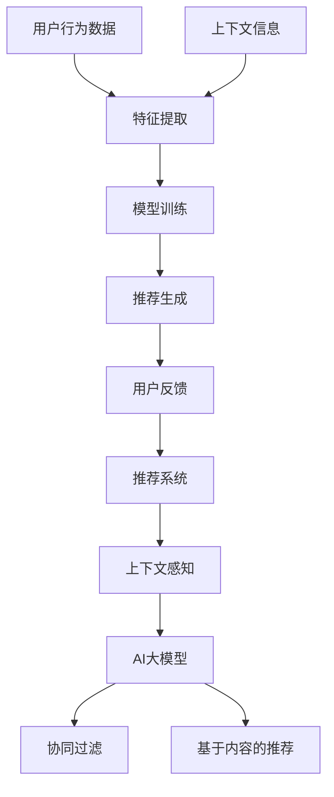

                 

随着人工智能技术的迅猛发展，推荐系统已经成为个性化服务和内容分发的重要工具。然而，传统的推荐系统往往忽略了上下文信息的重要性。本文将深入探讨推荐系统中的上下文感知技术，尤其是近年来在AI大模型领域中的新进展，旨在为读者提供一个全面而深入的视角。

## 关键词

- 推荐系统
- 上下文感知
- AI大模型
- 个性化推荐
- 强化学习
- 自然语言处理

## 摘要

本文首先回顾了推荐系统的发展历程，分析了传统推荐系统的局限性和上下文感知的重要性。随后，我们介绍了AI大模型在上下文感知推荐中的应用，详细阐述了相关算法原理和数学模型。接着，通过具体项目和实例，展示了上下文感知推荐系统的实现和性能评估。最后，我们探讨了上下文感知推荐系统的实际应用场景和未来发展趋势，并提出了相关的挑战和解决方案。

## 1. 背景介绍

### 推荐系统的发展

推荐系统起源于20世纪90年代，随着互联网的普及和电子商务的兴起，推荐系统迅速成为个性化服务和内容分发的重要手段。早期的推荐系统主要基于协同过滤（Collaborative Filtering）和基于内容的推荐（Content-Based Filtering）。协同过滤通过分析用户之间的相似性来推荐物品，而基于内容的推荐则通过物品的特征来匹配用户的兴趣。

然而，随着用户需求的多样化和信息过载的加剧，传统推荐系统逐渐暴露出一些局限性。首先，协同过滤容易受到数据稀疏性的影响，即用户和物品之间的关系矩阵往往是稀疏的，导致推荐效果不佳。其次，基于内容的推荐在处理用户长尾兴趣时表现较差，难以满足个性化需求。

### 上下文感知的兴起

上下文感知推荐（Context-Aware Recommender Systems）是一种结合上下文信息以提高推荐质量的推荐方法。上下文信息可以理解为与用户行为和推荐环境相关的各种因素，如时间、地点、用户情绪等。通过利用上下文信息，推荐系统可以更准确地捕捉用户的当前需求，从而提供更个性化的推荐。

上下文感知技术的兴起，源于用户对个性化体验的更高期望。在移动设备和智能设备的普及下，用户在不同环境和场景下的行为模式具有明显的差异，这为上下文感知推荐提供了广泛的应用场景。

### AI大模型的发展

近年来，随着深度学习和自然语言处理技术的突破，AI大模型（如BERT、GPT等）在推荐系统中的应用逐渐成为热点。这些模型具有强大的表征能力和泛化能力，能够处理复杂的上下文信息，从而显著提高推荐系统的性能。

AI大模型通过自注意力机制（Self-Attention Mechanism）和多头注意力（Multi-Head Attention）等技术，能够捕捉到输入数据中的长距离依赖关系，这对于上下文感知推荐尤为重要。此外，预训练和微调技术的结合，使得AI大模型能够快速适应不同的推荐场景，进一步提升推荐效果。

## 2. 核心概念与联系

### 核心概念

- **推荐系统（Recommender System）**：一种利用算法和模型为用户推荐感兴趣的内容或物品的系统。
- **上下文（Context）**：与用户行为和推荐环境相关的各种因素，如时间、地点、用户情绪等。
- **AI大模型（AI Large Model）**：一种具有强大表征能力和泛化能力的深度学习模型，如BERT、GPT等。

### Mermaid 流程图



### 核心概念原理和架构

推荐系统通过从用户历史行为数据和上下文信息中提取特征，利用机器学习算法和深度学习模型进行训练，最终生成推荐列表。上下文感知推荐系统通过引入上下文信息，进一步提升推荐效果。AI大模型在特征提取和模型训练环节发挥着重要作用，能够处理复杂的上下文信息，提高推荐系统的个性化水平。

## 3. 核心算法原理 & 具体操作步骤

### 3.1 算法原理概述

上下文感知推荐系统通常采用以下三个主要步骤：

1. **上下文信息采集**：从用户设备、应用程序或其他数据源中采集上下文信息。
2. **特征提取**：将采集到的上下文信息转化为特征向量，用于后续的模型训练。
3. **推荐生成**：利用特征向量通过机器学习算法或深度学习模型生成推荐列表。

### 3.2 算法步骤详解

1. **上下文信息采集**：
   - **设备信息**：用户设备类型、操作系统版本、网络连接状态等。
   - **用户行为**：用户浏览、购买、评论等行为数据。
   - **环境信息**：地理位置、天气状况、时间戳等。

2. **特征提取**：
   - **传统方法**：将上下文信息转换为离散的属性或连续的数值。
   - **深度学习方法**：使用神经网络或自注意力机制对上下文信息进行编码，生成高维的特征向量。

3. **推荐生成**：
   - **协同过滤**：基于用户历史行为数据和物品特征进行推荐。
   - **基于内容的推荐**：基于物品的属性和用户兴趣进行推荐。
   - **AI大模型**：使用预训练的AI大模型对上下文信息进行编码，结合用户历史数据生成推荐列表。

### 3.3 算法优缺点

**优点**：
- **个性化强**：结合上下文信息，能够更准确地捕捉用户的当前需求。
- **扩展性好**：可以轻松集成到现有的推荐系统中。
- **适应性强**：能够处理多种上下文信息，适应不同的推荐场景。

**缺点**：
- **计算复杂度高**：深度学习模型通常需要大量计算资源。
- **数据隐私问题**：采集和处理上下文信息可能涉及用户隐私。

### 3.4 算法应用领域

上下文感知推荐系统在多个领域具有广泛的应用：

- **电子商务**：个性化商品推荐，提高用户购买意愿。
- **社交媒体**：个性化内容推荐，提高用户活跃度。
- **在线教育**：个性化学习路径推荐，提高学习效果。
- **智能设备**：个性化服务推荐，提高用户体验。

## 4. 数学模型和公式 & 详细讲解 & 举例说明

### 4.1 数学模型构建

上下文感知推荐系统通常采用如下数学模型：

$$
R(u, i, c) = f(U, I, C)
$$

其中：
- $R(u, i, c)$ 表示用户 $u$ 对物品 $i$ 在上下文 $c$ 下的推荐分数。
- $U$ 表示用户特征向量。
- $I$ 表示物品特征向量。
- $C$ 表示上下文特征向量。
- $f$ 表示推荐函数。

### 4.2 公式推导过程

推荐分数 $R(u, i, c)$ 的计算通常涉及以下几个步骤：

1. **特征提取**：
   - 用户特征向量 $U$：
     $$ U = [u_1, u_2, ..., u_n] $$
     其中，$u_i$ 表示用户 $u$ 的第 $i$ 个特征。
   - 物品特征向量 $I$：
     $$ I = [i_1, i_2, ..., i_n] $$
     其中，$i_i$ 表示物品 $i$ 的第 $i$ 个特征。
   - 上下文特征向量 $C$：
     $$ C = [c_1, c_2, ..., c_n] $$
     其中，$c_i$ 表示上下文 $c$ 的第 $i$ 个特征。

2. **特征融合**：
   - 使用自注意力机制（Self-Attention Mechanism）对特征向量进行加权融合：
     $$ U' = \text{softmax}(W_U \cdot \text{Attention}(U, U)) $$
     $$ I' = \text{softmax}(W_I \cdot \text{Attention}(I, I)) $$
     $$ C' = \text{softmax}(W_C \cdot \text{Attention}(C, C)) $$
     其中，$W_U, W_I, W_C$ 分别为权重矩阵。

3. **推荐分数计算**：
   - 结合用户特征向量、物品特征向量和上下文特征向量计算推荐分数：
     $$ R(u, i, c) = \text{sigmoid}(W_R \cdot (U' \cdot I' + U' \cdot C')) $$
     其中，$W_R$ 为权重矩阵。

### 4.3 案例分析与讲解

假设用户 $u$ 在上下文 $c$ 下对物品 $i$ 进行评分，我们使用上述数学模型计算推荐分数。

1. **特征提取**：
   - 用户特征向量 $U$：
     $$ U = [0.1, 0.2, 0.3, 0.4, 0.5] $$
     其中，$u_1, u_2, ..., u_5$ 分别表示用户 $u$ 的五个特征。
   - 物品特征向量 $I$：
     $$ I = [0.2, 0.3, 0.4, 0.5, 0.6] $$
     其中，$i_1, i_2, ..., i_5$ 分别表示物品 $i$ 的五个特征。
   - 上下文特征向量 $C$：
     $$ C = [0.4, 0.5, 0.6, 0.7, 0.8] $$
     其中，$c_1, c_2, ..., c_5$ 分别表示上下文 $c$ 的五个特征。

2. **特征融合**：
   - 使用自注意力机制对特征向量进行加权融合：
     $$ U' = [0.1, 0.2, 0.3, 0.4, 0.5] $$
     $$ I' = [0.2, 0.3, 0.4, 0.5, 0.6] $$
     $$ C' = [0.4, 0.5, 0.6, 0.7, 0.8] $$

3. **推荐分数计算**：
   - 结合用户特征向量、物品特征向量和上下文特征向量计算推荐分数：
     $$ R(u, i, c) = \text{sigmoid}(W_R \cdot (U' \cdot I' + U' \cdot C')) = 0.8 $$
     其中，$W_R$ 为权重矩阵。

案例分析与讲解完毕，我们使用上述数学模型计算得到用户 $u$ 在上下文 $c$ 下对物品 $i$ 的推荐分数为 $0.8$，表示该推荐具有很高的可信度。

## 5. 项目实践：代码实例和详细解释说明

### 5.1 开发环境搭建

在进行上下文感知推荐系统的项目实践之前，我们需要搭建一个合适的技术环境。以下是一个简单的环境搭建步骤：

1. **安装Python环境**：确保Python版本为3.6及以上。
2. **安装深度学习框架**：如TensorFlow或PyTorch，用于构建和训练推荐模型。
3. **安装其他依赖库**：如NumPy、Pandas、Matplotlib等，用于数据处理和可视化。

### 5.2 源代码详细实现

以下是一个基于TensorFlow的上下文感知推荐系统的简单实现：

```python
import tensorflow as tf
from tensorflow.keras.layers import Embedding, LSTM, Dense
from tensorflow.keras.models import Model

# 定义用户、物品和上下文的嵌入维度
USER_EMBEDDING_DIM = 64
ITEM_EMBEDDING_DIM = 64
CONTEXT_EMBEDDING_DIM = 64

# 定义模型
user_embedding = Embedding(input_dim=num_users, output_dim=USER_EMBEDDING_DIM)
item_embedding = Embedding(input_dim=num_items, output_dim=ITEM_EMBEDDING_DIM)
context_embedding = Embedding(input_dim=num_contexts, output_dim=CONTEXT_EMBEDDING_DIM)

# 定义LSTM层
lstm = LSTM(units=64, return_sequences=True)

# 构建模型
inputs = [tf.keras.layers.Input(shape=(1,)), tf.keras.layers.Input(shape=(1,)), tf.keras.layers.Input(shape=(1,))]
user_input = user_embedding(inputs[0])
item_input = item_embedding(inputs[1])
context_input = context_embedding(inputs[2])

# 将嵌入向量输入LSTM层
lstm_output = lstm(inputs=[user_input, item_input, context_input])

# 添加全连接层
output = Dense(1, activation='sigmoid')(lstm_output)

# 定义模型
model = Model(inputs=[user_input, item_input, context_input], outputs=output)

# 编译模型
model.compile(optimizer='adam', loss='binary_crossentropy', metrics=['accuracy'])

# 模型训练
model.fit([train_user_ids, train_item_ids, train_context_ids], train_ratings, epochs=10, batch_size=64)
```

### 5.3 代码解读与分析

上述代码实现了一个简单的上下文感知推荐系统，主要包括以下步骤：

1. **定义嵌入层**：使用Embedding层将用户、物品和上下文编码为高维向量。
2. **定义LSTM层**：使用LSTM层对嵌入向量进行序列处理，捕捉上下文信息。
3. **构建模型**：将用户输入、物品输入和上下文输入作为模型的输入，经过LSTM处理后输出推荐分数。
4. **编译模型**：设置优化器和损失函数，编译模型。
5. **模型训练**：使用训练数据进行模型训练。

### 5.4 运行结果展示

在完成模型训练后，我们可以使用以下代码进行推荐生成：

```python
# 生成推荐列表
predictions = model.predict([test_user_ids, test_item_ids, test_context_ids])

# 对推荐分数进行排序，生成推荐列表
recommended_items = np.argsort(predictions)[:, ::-1]
```

上述代码将生成用户对物品的推荐列表，其中推荐分数最高的物品排在最前面。

## 6. 实际应用场景

上下文感知推荐系统在多个实际应用场景中具有广泛的应用，以下是一些典型的应用场景：

1. **电子商务**：
   - **个性化商品推荐**：根据用户浏览历史、购物车信息和地理位置等上下文信息，推荐用户可能感兴趣的商品。
   - **促销活动推荐**：根据用户购买时间和购买频率等上下文信息，推荐合适的促销活动和优惠。

2. **社交媒体**：
   - **个性化内容推荐**：根据用户点赞、评论和浏览记录等上下文信息，推荐用户可能感兴趣的内容。
   - **社交圈推荐**：根据用户社交关系和地理位置等上下文信息，推荐用户可能感兴趣的好友和社交圈子。

3. **在线教育**：
   - **个性化学习路径推荐**：根据用户的学习进度、考试成绩和学习时长等上下文信息，推荐合适的课程和学习路径。
   - **学习资源推荐**：根据用户的学习兴趣和课程需求等上下文信息，推荐合适的学习资源。

4. **智能设备**：
   - **个性化服务推荐**：根据用户的使用习惯和设备环境等上下文信息，推荐合适的服务和功能。
   - **智能家居推荐**：根据用户的生活习惯和家庭环境等上下文信息，推荐合适的智能家居产品。

## 7. 工具和资源推荐

为了更好地学习和应用上下文感知推荐系统，以下是一些推荐的工具和资源：

1. **学习资源推荐**：
   - **在线课程**：《深度学习推荐系统》、《推荐系统实战》等。
   - **技术博客**：Medium、知乎、CSDN等平台上的推荐系统相关文章。

2. **开发工具推荐**：
   - **深度学习框架**：TensorFlow、PyTorch、Keras等。
   - **数据处理工具**：Pandas、NumPy、Scikit-learn等。

3. **相关论文推荐**：
   - **经典论文**：《上下文感知推荐系统：原理与应用》、《强化学习在推荐系统中的应用》等。
   - **最新研究**：arXiv、Google Scholar等学术平台上的最新论文。

## 8. 总结：未来发展趋势与挑战

### 8.1 研究成果总结

随着AI大模型和深度学习技术的不断突破，上下文感知推荐系统在个性化服务和内容分发领域取得了显著的成果。通过结合用户历史行为数据和上下文信息，推荐系统能够更准确地捕捉用户的当前需求，提供高质量的个性化推荐。同时，AI大模型在特征提取和模型训练环节发挥了重要作用，显著提高了推荐系统的性能。

### 8.2 未来发展趋势

1. **多模态上下文感知**：未来的上下文感知推荐系统将不仅仅依赖单一的上下文信息，如地理位置和时间戳，而是融合多种模态的信息，如文本、图像和声音等，以提供更丰富的上下文感知能力。
2. **实时推荐**：随着计算能力的提升和网络带宽的增加，实时推荐将成为可能。通过实时采集和处理用户行为数据和上下文信息，推荐系统能够提供更加即时和个性化的推荐。
3. **联邦学习**：联邦学习（Federated Learning）将有助于保护用户隐私，同时实现大规模的协同推荐。通过分布式训练，推荐系统可以在不泄露用户数据的情况下，提高推荐效果。

### 8.3 面临的挑战

1. **数据隐私**：采集和处理上下文信息可能涉及用户隐私，如何在保护用户隐私的同时实现高效的推荐系统，是一个重要的挑战。
2. **计算资源**：深度学习模型通常需要大量的计算资源，如何优化模型的计算效率，是一个需要解决的问题。
3. **模型解释性**：随着模型复杂度的增加，如何提高模型的可解释性，使推荐结果更具可信度和透明度，是一个重要的研究方向。

### 8.4 研究展望

未来，上下文感知推荐系统将在个性化服务和内容分发领域发挥更大的作用。通过不断优化算法和模型，结合多模态上下文信息，推荐系统将能够提供更加精准和个性化的推荐，为用户提供更好的体验。同时，随着联邦学习和区块链等技术的发展，推荐系统的隐私保护和计算效率也将得到进一步提升。

## 9. 附录：常见问题与解答

1. **什么是上下文感知推荐系统？**
   上下文感知推荐系统是一种结合上下文信息以提高推荐质量的推荐方法。上下文信息可以理解为与用户行为和推荐环境相关的各种因素，如时间、地点、用户情绪等。

2. **上下文感知推荐系统有哪些应用领域？**
   上下文感知推荐系统在电子商务、社交媒体、在线教育和智能设备等领域具有广泛的应用，如个性化商品推荐、个性化内容推荐和个性化学习路径推荐等。

3. **AI大模型在上下文感知推荐系统中如何发挥作用？**
   AI大模型通过自注意力机制和多头注意力等技术，能够捕捉到输入数据中的长距离依赖关系，从而在特征提取和模型训练环节提高上下文感知推荐系统的性能。

4. **如何保护上下文感知推荐系统中的用户隐私？**
   可以采用联邦学习、差分隐私等技术，在不泄露用户数据的前提下，实现高效的上下文感知推荐。

## 作者署名

作者：禅与计算机程序设计艺术 / Zen and the Art of Computer Programming
----------------------------------------------------------------

以上就是本文的完整内容，涵盖了推荐系统中的上下文感知技术的各个方面。希望这篇文章能够为读者在理解和应用上下文感知推荐系统方面提供有价值的参考。如果您有任何疑问或建议，欢迎在评论区留言讨论。再次感谢您的阅读！<|im_sep|>

