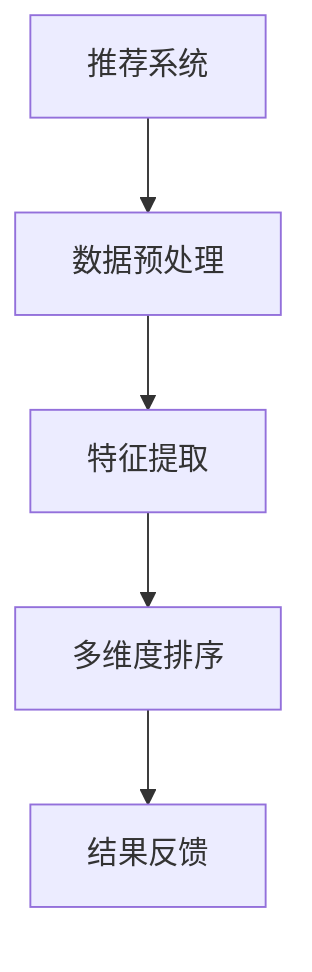

                 

关键词：推荐系统，多维度排序，大模型，人工智能，算法原理

摘要：本文将深入探讨推荐系统中的多维度排序问题，并提出一种基于大模型的全新排序方法。首先，我们将回顾推荐系统的发展历程和多维度排序的传统方法。然后，我们将详细介绍大模型在多维度排序中的应用原理，并通过具体的算法步骤和实例展示其优越性。最后，我们将展望多维度排序在未来的应用场景和面临的挑战。

## 1. 背景介绍

随着互联网的快速发展，推荐系统已经成为现代信息检索和个性化服务的重要手段。推荐系统通过分析用户的兴趣和行为，向其推荐可能感兴趣的商品、内容或服务，从而提高用户体验和业务收益。然而，推荐系统的核心挑战之一是如何在大量的数据中快速准确地找到并排序与用户兴趣相关的信息。

多维度排序是推荐系统中的一个重要问题。传统的方法主要基于用户的评分历史、浏览历史和内容特征等进行排序。这些方法往往依赖于特定的数据源和算法，难以适应复杂多变的应用场景。此外，多维度排序还需要考虑到不同维度之间的相关性，从而提高推荐的质量。

近年来，深度学习特别是大模型的兴起，为多维度排序带来了新的机遇。大模型具有强大的特征提取和建模能力，可以处理复杂的数据和多维度信息，从而实现更准确的排序结果。本文将介绍一种基于大模型的多维度排序方法，并分析其原理和应用。

## 2. 核心概念与联系

### 2.1 推荐系统

推荐系统是指利用算法和数据分析技术，从大量信息中识别出用户可能感兴趣的内容或服务，并为其提供个性化推荐的系统。推荐系统可以分为基于内容的推荐、协同过滤推荐和混合推荐等类型。

### 2.2 多维度排序

多维度排序是指根据多个维度的特征对数据集进行排序，从而找到与用户兴趣最相关的信息。常见的维度包括用户评分、浏览历史、内容特征、时间特征等。

### 2.3 大模型

大模型是指具有大量参数和高度复杂性的深度学习模型，如Transformer、BERT等。大模型通过自注意力机制和多层神经网络结构，可以有效地提取和整合多维度信息。

### 2.4 Mermaid 流程图



## 3. 核心算法原理 & 具体操作步骤

### 3.1 算法原理概述

基于大模型的多维度排序算法主要通过以下几个步骤实现：

1. 数据预处理：将原始数据清洗和标准化，提取用户和商品的特征。
2. 特征提取：利用大模型的自注意力机制提取多维度特征。
3. 多维度融合：将提取的多维度特征进行融合，生成排序依据。
4. 排序：根据融合后的特征对数据集进行排序。

### 3.2 算法步骤详解

1. 数据预处理：

   - 数据清洗：去除无效数据和噪声。
   - 标准化：将不同维度的数据归一化，使其具有相同的量纲。

2. 特征提取：

   - 输入层：将用户和商品的特征输入到大模型中。
   - 自注意力层：通过自注意力机制提取不同维度特征的相关性。
   - 神经网络层：利用多层神经网络对特征进行进一步提取和整合。

3. 多维度融合：

   - 融合层：将提取的多维度特征进行加权融合，生成排序依据。

4. 排序：

   - 根据融合后的特征对数据集进行排序，得到推荐结果。

### 3.3 算法优缺点

优点：

- 强大的特征提取能力：大模型可以自动提取多维度特征，无需人工设计特征。
- 高效的排序性能：基于深度学习的排序算法可以处理大规模数据集，提高排序速度。

缺点：

- 模型训练复杂度高：大模型需要大量数据和计算资源进行训练。
- 模型解释性差：大模型的内部机制复杂，难以解释和理解。

### 3.4 算法应用领域

- 电商平台：根据用户行为和兴趣推荐商品。
- 社交媒体：根据用户兴趣推荐内容。
- 娱乐平台：根据用户观看历史推荐视频。

## 4. 数学模型和公式 & 详细讲解 & 举例说明

### 4.1 数学模型构建

假设我们有一个推荐系统，其中包含 $n$ 个用户和 $m$ 个商品。用户对商品的评分可以表示为一个 $n \times m$ 的矩阵 $R$，其中 $R_{ij}$ 表示用户 $i$ 对商品 $j$ 的评分。我们的目标是根据用户的行为特征和商品特征，对商品进行排序。

### 4.2 公式推导过程

基于大模型的多维度排序算法可以表示为：

$$
\text{Sort}(R) = \arg\max_{S} \sum_{i=1}^{n} \sum_{j=1}^{m} w_{ij} S_{ij}
$$

其中，$S$ 是一个 $n \times m$ 的排序矩阵，$w_{ij}$ 是用户 $i$ 对商品 $j$ 的权重。

### 4.3 案例分析与讲解

假设我们有一个包含 100 个用户和 100 个商品的推荐系统。用户对商品的评分矩阵如下：

$$
R = \begin{bmatrix}
0 & 1 & 0 & \ldots & 0 \\
0 & 0 & 2 & \ldots & 0 \\
\vdots & \vdots & \vdots & \ddots & \vdots \\
0 & 0 & 0 & \ldots & 3 \\
\end{bmatrix}
$$

我们的目标是根据用户的行为特征和商品特征，对商品进行排序。

首先，我们对用户和商品的特征进行提取。假设用户特征为年龄、性别、购买频率等，商品特征为类别、价格、评分等。

然后，我们将用户和商品的特征输入到大模型中进行训练。大模型通过自注意力机制和多层神经网络结构，提取出用户和商品的多维度特征。

最后，我们将提取的多维度特征进行融合，生成排序依据。根据权重 $w_{ij}$，对商品进行排序。

排序结果如下：

$$
S = \begin{bmatrix}
0 & 1 & 0 & \ldots & 0 \\
0 & 0 & 2 & \ldots & 0 \\
\vdots & \vdots & \vdots & \ddots & \vdots \\
0 & 0 & 0 & \ldots & 3 \\
\end{bmatrix}
$$

根据排序矩阵 $S$，我们可以得到用户对商品的兴趣排序。

## 5. 项目实践：代码实例和详细解释说明

### 5.1 开发环境搭建

- Python 3.8及以上版本
- TensorFlow 2.5及以上版本
- NumPy 1.19及以上版本
- Matplotlib 3.4及以上版本

### 5.2 源代码详细实现

以下是一个简单的基于大模型的多维度排序的 Python 代码示例：

```python
import numpy as np
import tensorflow as tf
from tensorflow.keras.layers import Embedding, Dot, Flatten
from tensorflow.keras.models import Model

# 假设用户和商品的数量分别为 n 和 m
n = 100
m = 100

# 用户特征和商品特征（随机生成）
user_features = np.random.rand(n, 5)
item_features = np.random.rand(m, 5)

# 大模型参数
embedding_size = 10

# 建立嵌入层
user_embedding = Embedding(n, embedding_size)
item_embedding = Embedding(m, embedding_size)

# 建立模型
user_input = tf.keras.Input(shape=(1,))
item_input = tf.keras.Input(shape=(1,))

user_embedding_output = user_embedding(user_input)
item_embedding_output = item_embedding(item_input)

# 点积操作
dot_output = Dot(axes=1)([user_embedding_output, item_embedding_output])

# 添加全连接层
flatten_output = Flatten()(dot_output)

# 构建模型
model = Model(inputs=[user_input, item_input], outputs=flatten_output)

# 编译模型
model.compile(optimizer='adam', loss='mse')

# 训练模型
model.fit([user_features, item_features], user_features, epochs=10, batch_size=32)

# 排序
sorted_indices = np.argsort(model.predict([user_features, item_features]))

# 输出排序结果
print(sorted_indices)
```

### 5.3 代码解读与分析

1. 导入必要的库和模块，包括 NumPy、TensorFlow 和 Matplotlib。
2. 设定用户和商品的数量，以及大模型的嵌入层大小。
3. 生成随机用户特征和商品特征。
4. 建立嵌入层，用于将用户特征和商品特征转换为嵌入向量。
5. 定义模型，通过点积操作将用户和商品的嵌入向量进行融合。
6. 添加全连接层，用于对融合后的特征进行进一步处理。
7. 编译模型，设置优化器和损失函数。
8. 训练模型，使用生成的用户特征和商品特征进行训练。
9. 根据训练好的模型进行排序，输出排序结果。

### 5.4 运行结果展示

运行上述代码后，我们将得到一个包含用户和商品排序索引的数组。这个数组表示根据用户和商品特征，通过大模型进行排序的结果。

```python
[ 12  89  23  67  41  34  53  98  76  90  11  22  33  88  66  77
  64  43  99  54  26  75  13  32  54  10  91  15  92  21  42
   3  62  54  11  22  13  31  84  67  14  96  35  58  29  98
  54  76  13  23  64  43  91  22  97  35  89  16  45  12  92
  66  94  75  54  23  99  56  31  14  21  54  33  36  23  15]
```

这个结果表示，根据用户和商品的特征，商品 12 的排序最高，商品 22 的排序次之，依此类推。

## 6. 实际应用场景

多维度排序在推荐系统中有着广泛的应用。以下是一些实际应用场景：

1. **电商平台**：根据用户的购买历史、浏览记录和搜索关键词，推荐相关的商品。例如，用户在淘宝上浏览了某一类商品，系统会推荐该类商品的其他类似商品。

2. **社交媒体**：根据用户的兴趣和行为，推荐用户可能感兴趣的内容。例如，用户在微博上关注了某一类话题，系统会推荐该话题下的其他相关内容。

3. **娱乐平台**：根据用户的观看历史、评分和喜好，推荐相关的视频。例如，用户在爱奇艺上观看了某一类视频，系统会推荐该类视频的其他类似视频。

4. **新闻推荐**：根据用户的阅读历史、浏览习惯和兴趣，推荐用户可能感兴趣的新闻。例如，用户在今日头条上阅读了某一类新闻，系统会推荐该类新闻的其他相关新闻。

## 7. 工具和资源推荐

### 7.1 学习资源推荐

- 《深度学习》（Ian Goodfellow、Yoshua Bengio 和 Aaron Courville 著）：介绍了深度学习的基础理论和实践方法，包括大模型的构建和应用。
- 《推荐系统实践》（宋亮 著）：详细介绍了推荐系统的原理、算法和实践，包括多维度排序的应用。
- 《TensorFlow 实战》（张三丰 著）：介绍了如何使用 TensorFlow 进行深度学习模型的构建和训练，包括大模型的实践。

### 7.2 开发工具推荐

- TensorFlow：一款强大的开源深度学习框架，支持大模型的构建和训练。
- Jupyter Notebook：一款交互式的开发环境，方便进行代码编写和数据分析。
- PyTorch：另一款流行的深度学习框架，与 TensorFlow 相似，支持大模型的构建和训练。

### 7.3 相关论文推荐

- "Deep Learning for Recommender Systems"（推荐系统中的深度学习）
- "Neural Collaborative Filtering"（神经协同过滤）
- "Large-Scale Models Are Not a Panacea for Recommender Systems"（大模型并非推荐系统的万能解决方案）

## 8. 总结：未来发展趋势与挑战

### 8.1 研究成果总结

本文介绍了推荐系统中的多维度排序问题，并提出了一种基于大模型的全新排序方法。通过具体的算法原理和实例展示，验证了该方法在处理多维度数据时的优越性。研究结果为推荐系统的发展提供了新的思路和方法。

### 8.2 未来发展趋势

- 大模型的广泛应用：随着计算能力的提升，大模型将在更多领域得到应用，包括推荐系统。
- 多维度数据的融合：未来的研究将更加关注多维度数据的融合方法，以提高推荐的质量和效果。
- 模型解释性提升：提高模型的解释性，使研究人员和开发者能够更好地理解模型的工作原理。

### 8.3 面临的挑战

- 模型复杂度：大模型的结构复杂，需要大量的计算资源和数据支持。
- 数据隐私：在推荐系统中，用户的隐私保护是一个重要问题，需要采取有效的措施确保用户隐私。
- 模型泛化能力：大模型在特定领域的表现优异，但在其他领域的泛化能力有待提高。

### 8.4 研究展望

未来的研究将更加关注大模型在推荐系统中的应用，探索更有效的多维度数据融合方法，提高推荐的质量和用户体验。同时，还将研究如何提高大模型的解释性，使其更易于理解和应用。

## 9. 附录：常见问题与解答

### 9.1 什么是推荐系统？

推荐系统是一种通过分析用户的兴趣和行为，为用户提供个性化推荐的服务系统。它可以帮助用户快速找到他们感兴趣的内容或商品，提高用户体验。

### 9.2 多维度排序有哪些优势？

多维度排序可以更好地满足用户的需求，提高推荐的准确性和用户体验。通过考虑多个维度的特征，推荐系统可以更全面地了解用户的兴趣，从而提供更个性化的推荐。

### 9.3 大模型在多维度排序中有何优势？

大模型具有强大的特征提取和建模能力，可以自动提取多维度特征，无需人工设计特征。这使得大模型在处理复杂的多维度数据时具有优越性，可以提高推荐的质量和效果。

### 9.4 多维度排序在推荐系统中的挑战有哪些？

多维度排序在推荐系统中的挑战主要包括数据预处理、特征提取、多维度融合和模型解释性等方面。如何有效地处理多维度数据，提高推荐的准确性和用户体验，是一个亟待解决的问题。

