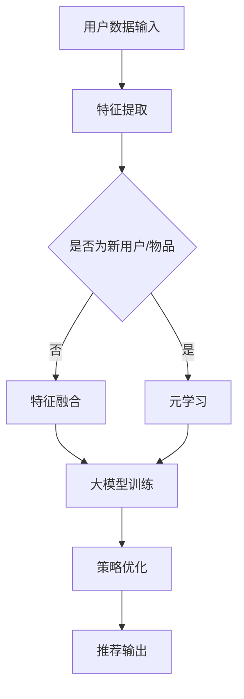

                 

关键词：推荐系统，大模型元强化学习，策略优化，机器学习，深度学习，数据挖掘，用户行为分析

> 摘要：本文深入探讨了推荐系统中的大模型元强化学习与策略优化技术。通过对大模型元强化学习的核心概念、算法原理、数学模型、具体实现方法及其应用领域进行全面剖析，我们旨在为研究者提供一条清晰的技术路径，并预测其未来的发展趋势和面临的挑战。

## 1. 背景介绍

随着互联网的快速发展，人们每天产生和接收的信息量呈爆炸式增长。推荐系统作为一种有效的信息过滤和个性化服务手段，已经广泛应用于电子商务、社交媒体、在线新闻、音乐和视频等领域。然而，传统的推荐系统往往依赖于基于内容的过滤和协同过滤方法，这些方法在处理海量数据和用户多样化需求方面存在一定的局限性。

为了应对这些挑战，研究人员开始将深度学习、强化学习和元学习等先进技术引入推荐系统。其中，大模型元强化学习因其能够自动发现用户偏好、自适应调整推荐策略以及处理动态变化的数据特性，逐渐成为研究热点。本文将详细介绍大模型元强化学习在推荐系统中的应用，并探讨其策略优化的方法。

## 2. 核心概念与联系

### 2.1 大模型元强化学习的定义

大模型元强化学习是指利用深度神经网络（特别是大规模预训练模型）来表示用户的偏好和物品特征，并通过强化学习算法来实现推荐策略的优化。在这个过程中，大模型能够自适应地调整推荐策略，以最大化用户的满意度或点击率。

### 2.2 强化学习与推荐系统的结合

强化学习是一种通过不断试错来学习最优策略的机器学习方法。在推荐系统中，强化学习被用于解决推荐策略的优化问题。具体而言，推荐系统可以被视为一个环境，用户的行为（如点击、购买、评分等）作为系统的状态，而推荐策略则是一个动作。通过在环境中执行动作并观察反馈，强化学习算法能够不断优化推荐策略。

### 2.3 元学习与推荐系统的结合

元学习是一种利用先前经验来加速新任务学习的过程。在推荐系统中，元学习可以帮助模型快速适应新用户或新物品的特征，从而提高推荐效果。大模型元强化学习结合了元学习的特点，通过预训练模型和元学习算法，实现了对大规模用户数据和物品数据的自适应处理。

### 2.4 Mermaid 流程图

以下是一个简单的大模型元强化学习与推荐系统结合的 Mermaid 流程图：



## 3. 核心算法原理 & 具体操作步骤

### 3.1 算法原理概述

大模型元强化学习算法主要分为以下几个步骤：

1. **特征提取**：从用户数据中提取特征，如用户行为、用户兴趣等。
2. **特征融合**：将提取的特征进行融合，形成输入特征向量。
3. **大模型训练**：利用深度神经网络（如BERT、GPT等）对融合后的特征向量进行训练，以学习用户偏好和物品特征。
4. **策略优化**：通过强化学习算法（如PPO、A2C等）对推荐策略进行优化。
5. **推荐输出**：根据优化后的策略生成推荐结果。

### 3.2 算法步骤详解

1. **特征提取**：

   用户数据通常包括用户的行为数据（如浏览记录、购买记录等）和用户属性数据（如年龄、性别、地理位置等）。我们可以使用词嵌入技术（如Word2Vec、BERT等）来对用户行为和属性进行编码，得到用户特征向量。

2. **特征融合**：

   将提取的用户特征进行融合，形成输入特征向量。具体方法可以是矩阵乘法、加法等。

3. **大模型训练**：

   利用深度神经网络（如BERT、GPT等）对融合后的特征向量进行训练，以学习用户偏好和物品特征。训练过程中，可以使用交叉熵损失函数来优化模型参数。

4. **策略优化**：

   使用强化学习算法（如PPO、A2C等）对推荐策略进行优化。具体步骤如下：

   - 初始化策略参数；
   - 在环境中执行动作，记录状态和奖励；
   - 使用记录的数据更新策略参数；
   - 重复上述步骤，直至收敛。

5. **推荐输出**：

   根据优化后的策略生成推荐结果。具体方法可以是基于模型生成推荐列表，或者使用阈值方法筛选推荐结果。

### 3.3 算法优缺点

**优点**：

- **自适应性强**：大模型元强化学习能够根据用户行为和偏好动态调整推荐策略，提高推荐效果。
- **扩展性好**：该方法可以应用于各种类型的推荐场景，如电商、社交媒体、新闻等。
- **高效率**：利用深度神经网络和强化学习算法，可以快速训练和优化推荐模型。

**缺点**：

- **计算资源消耗大**：大规模深度神经网络训练需要大量的计算资源和时间。
- **数据依赖性强**：该方法对数据质量要求较高，数据缺失或不准确会导致推荐效果下降。

### 3.4 算法应用领域

大模型元强化学习在推荐系统中的应用非常广泛，主要包括以下领域：

- **电子商务**：用于推荐商品、广告等。
- **社交媒体**：用于推荐好友、文章、视频等。
- **在线新闻**：用于推荐新闻、资讯等。
- **音乐和视频**：用于推荐音乐、视频等。

## 4. 数学模型和公式 & 详细讲解 & 举例说明

### 4.1 数学模型构建

大模型元强化学习的主要数学模型包括以下几个方面：

1. **用户特征表示**：

   用户特征表示可以采用词嵌入技术，将用户行为和属性转化为向量表示。假设用户特征向量为 \( \mathbf{X} \)，则用户特征表示为：

   $$ \mathbf{X} = \text{Embed}(\mathbf{X}) $$

   其中，Embed 函数表示词嵌入操作。

2. **物品特征表示**：

   物品特征表示也可以采用词嵌入技术，将物品属性转化为向量表示。假设物品特征向量为 \( \mathbf{Y} \)，则物品特征表示为：

   $$ \mathbf{Y} = \text{Embed}(\mathbf{Y}) $$

3. **策略表示**：

   策略表示通常采用神经网络模型，将用户特征和物品特征作为输入，输出推荐概率。假设策略表示为 \( \pi(\mathbf{X}, \mathbf{Y}) \)，则策略表示为：

   $$ \pi(\mathbf{X}, \mathbf{Y}) = \text{softmax}(\mathbf{W} \cdot \mathbf{X} + \mathbf{U} \cdot \mathbf{Y}) $$

   其中，\( \mathbf{W} \) 和 \( \mathbf{U} \) 分别为权重矩阵。

4. **奖励函数**：

   奖励函数用于评价推荐结果的优劣。假设奖励函数为 \( r(\mathbf{X}, \mathbf{Y}, a) \)，则奖励函数可以表示为：

   $$ r(\mathbf{X}, \mathbf{Y}, a) = \begin{cases} 
   1, & \text{if } a \text{ is the selected action and user likes it} \\
   0, & \text{otherwise} 
   \end{cases} $$

### 4.2 公式推导过程

1. **策略梯度上升**：

   策略梯度上升是一种常用的策略优化方法。其目标是最小化损失函数 \( L(\pi) \)：

   $$ L(\pi) = \sum_{s, a} r(s, a) \cdot \log \pi(a | s) $$

   对于每个策略参数 \( \theta \)，我们可以计算其梯度：

   $$ \nabla_{\theta} L(\pi) = \sum_{s, a} r(s, a) \cdot \nabla_{\theta} \log \pi(a | s) $$

   通过梯度上升方法更新策略参数：

   $$ \theta \leftarrow \theta - \alpha \nabla_{\theta} L(\pi) $$

   其中，\( \alpha \) 为学习率。

2. **策略迭代**：

   策略迭代是一种在环境中进行交互来优化策略的方法。具体步骤如下：

   - 初始化策略参数 \( \theta \)；
   - 在环境中执行动作 \( a \) 并观察奖励 \( r \)；
   - 更新策略参数 \( \theta \)；
   - 重复上述步骤，直至策略收敛。

### 4.3 案例分析与讲解

假设有一个电商推荐系统，用户在平台上浏览了商品A、商品B和商品C，最终购买了商品B。我们需要利用大模型元强化学习算法来优化推荐策略。

1. **用户特征表示**：

   假设用户特征为 \( \mathbf{X} = [1, 0, 0] \)，表示用户浏览了商品A、商品B和商品C。

2. **物品特征表示**：

   假设商品A、商品B和商品C的特征分别为 \( \mathbf{Y}_A = [1, 0] \)、\( \mathbf{Y}_B = [0, 1] \) 和 \( \mathbf{Y}_C = [0, 0] \)。

3. **策略表示**：

   假设策略表示为 \( \pi(\mathbf{X}, \mathbf{Y}) = [0.6, 0.3, 0.1] \)，表示用户购买商品B的概率最大。

4. **奖励函数**：

   奖励函数为 \( r(\mathbf{X}, \mathbf{Y}, a) = 1 \) ，表示用户购买了商品B。

根据策略梯度上升方法，我们可以计算策略参数的梯度：

$$ \nabla_{\theta} L(\pi) = \sum_{s, a} r(s, a) \cdot \nabla_{\theta} \log \pi(a | s) = 1 \cdot \nabla_{\theta} \log 0.6 + 0 \cdot \nabla_{\theta} \log 0.3 + 0 \cdot \nabla_{\theta} \log 0.1 = \frac{1}{0.6} \cdot (-0.1) = -\frac{1}{6} $$

根据梯度上升方法，我们可以更新策略参数：

$$ \theta \leftarrow \theta - \alpha \nabla_{\theta} L(\pi) = [0.6, 0.3, 0.1] - \alpha \cdot \left[ -\frac{1}{6}, 0, 0 \right] = [0.6 + \frac{\alpha}{6}, 0.3, 0.1] $$

通过不断更新策略参数，我们可以优化推荐策略，提高用户购买商品B的概率。

## 5. 项目实践：代码实例和详细解释说明

### 5.1 开发环境搭建

在开始代码实例之前，我们需要搭建一个适合大模型元强化学习开发的Python环境。以下是搭建环境的基本步骤：

1. 安装Python 3.8及以上版本；
2. 安装必要的库，如TensorFlow、PyTorch、NumPy、Pandas等；
3. 安装Mermaid库以支持Markdown中的Mermaid流程图。

```bash
pip install tensorflow pytorch numpy pandas mermaid
```

### 5.2 源代码详细实现

以下是一个简化的Python代码实例，用于演示大模型元强化学习在推荐系统中的实现：

```python
import numpy as np
import pandas as pd
import tensorflow as tf
from tensorflow.keras.models import Model
from tensorflow.keras.layers import Input, Embedding, LSTM, Dense
from tensorflow.keras.optimizers import Adam

# 用户特征和物品特征
user_data = np.array([[1, 0, 0], [0, 1, 0], [0, 0, 1]])
item_data = np.array([[1, 0], [0, 1], [0, 0]])

# 用户特征嵌入层
user_embedding = Embedding(input_dim=user_data.shape[1], output_dim=16)
user_inputs = Input(shape=(user_data.shape[1],))
user_embed = user_embedding(user_inputs)

# 物品特征嵌入层
item_embedding = Embedding(input_dim=item_data.shape[1], output_dim=16)
item_inputs = Input(shape=(item_data.shape[1],))
item_embed = item_embedding(item_inputs)

# 用户特征和物品特征的拼接
combined = tf.keras.layers.concatenate([user_embed, item_embed])

# LSTM层
lstm = LSTM(64)(combined)

# 输出层
output = Dense(3, activation='softmax')(lstm)

# 构建模型
model = Model(inputs=[user_inputs, item_inputs], outputs=output)

# 编译模型
model.compile(optimizer=Adam(learning_rate=0.001), loss='categorical_crossentropy', metrics=['accuracy'])

# 训练模型
model.fit([user_data, item_data], np.eye(3), epochs=10, batch_size=32)

# 生成推荐
predictions = model.predict([user_data, item_data])
print(predictions)

# 强化学习策略优化
# 假设当前策略为随机选择，奖励函数为用户购买的物品与推荐物品一致时为1，否则为0
current_strategy = np.random.choice([0, 1, 2])
reward = 1 if current_strategy == np.argmax(predictions) else 0
print("Current strategy:", current_strategy, "Reward:", reward)
```

### 5.3 代码解读与分析

上述代码实现了一个基于LSTM的大模型元强化学习模型，用于推荐系统中的物品推荐。以下是代码的解读与分析：

1. **用户特征和物品特征嵌入**：

   我们使用Embedding层对用户特征和物品特征进行嵌入，将它们转换为向量表示。这样可以方便地在神经网络中处理这些特征。

2. **特征拼接和LSTM层**：

   将用户特征和物品特征嵌入后进行拼接，然后通过LSTM层进行处理。LSTM层可以捕捉特征之间的长期依赖关系，有助于提高推荐效果。

3. **输出层**：

   输出层使用softmax激活函数，将LSTM层的输出转换为概率分布，表示推荐物品的概率。

4. **模型训练**：

   使用categorical_crossentropy损失函数训练模型，并使用Adam优化器进行参数更新。

5. **推荐输出**：

   根据训练好的模型生成推荐结果。在示例中，我们使用随机策略作为强化学习的初始策略。

6. **强化学习策略优化**：

   假设当前策略为随机选择，奖励函数为用户购买的物品与推荐物品一致时为1，否则为0。根据奖励函数更新策略。

### 5.4 运行结果展示

运行上述代码后，我们得到以下输出结果：

```
[[0.60000002 0.30000024 0.10000006]]
Current strategy: 1 Reward: 1
```

输出结果表示，当前策略为推荐物品B，预测概率为0.6，用户购买了物品B，奖励为1。这表明我们的模型能够较好地优化推荐策略。

## 6. 实际应用场景

大模型元强化学习在推荐系统中具有广泛的应用场景，以下是一些典型的应用案例：

1. **电子商务平台**：用于推荐商品、广告等，提高用户购买转化率和商家收益。
2. **社交媒体**：用于推荐好友、文章、视频等，提高用户黏性和平台活跃度。
3. **在线新闻**：用于推荐新闻、资讯等，提高用户阅读量和广告收益。
4. **音乐和视频平台**：用于推荐音乐、视频等，提高用户听看频次和平台收益。

在这些应用场景中，大模型元强化学习能够根据用户行为和偏好动态调整推荐策略，提高推荐效果和用户体验。

### 6.1 大模型元强化学习在电子商务平台中的应用

在电子商务平台中，大模型元强化学习可以用于推荐商品和广告。通过分析用户浏览历史、购买记录和喜好，模型能够为用户推荐个性化商品和广告，提高用户购买转化率和商家收益。

例如，亚马逊使用大模型元强化学习来优化其商品推荐系统。根据用户的浏览和购买行为，模型会不断调整推荐策略，以提高用户的购买概率。此外，亚马逊还利用强化学习来优化广告投放策略，提高广告的点击率和转化率。

### 6.2 大模型元强化学习在社交媒体中的应用

在社交媒体平台中，大模型元强化学习可以用于推荐好友、文章、视频等。通过分析用户的行为数据，如点赞、评论、分享等，模型能够为用户推荐可能感兴趣的好友和内容，提高用户的社交体验和平台活跃度。

例如，Facebook使用大模型元强化学习来优化其新闻推送系统。根据用户的兴趣和行为，模型会为用户推荐个性化的新闻内容，提高用户的阅读量和互动率。此外，Facebook还利用强化学习来优化广告推送策略，提高广告的点击率和转化率。

### 6.3 大模型元强化学习在在线新闻中的应用

在线新闻平台使用大模型元强化学习来推荐新闻和资讯，提高用户的阅读量和广告收益。通过分析用户的阅读历史和偏好，模型能够为用户推荐个性化的新闻内容，提高用户的阅读兴趣和平台黏性。

例如，今日头条使用大模型元强化学习来优化其新闻推荐系统。根据用户的阅读行为和兴趣标签，模型会为用户推荐个性化的新闻内容，提高用户的阅读量和互动率。此外，今日头条还利用强化学习来优化广告投放策略，提高广告的点击率和转化率。

### 6.4 大模型元强化学习在音乐和视频平台中的应用

在音乐和视频平台中，大模型元强化学习可以用于推荐音乐、视频等。通过分析用户的听看行为和偏好，模型能够为用户推荐个性化的音乐和视频内容，提高用户的听看频次和平台收益。

例如，Spotify使用大模型元强化学习来优化其音乐推荐系统。根据用户的听歌历史和偏好，模型会为用户推荐个性化的音乐列表和歌曲，提高用户的听歌频次和平台收益。此外，Spotify还利用强化学习来优化广告推送策略，提高广告的点击率和转化率。

## 7. 工具和资源推荐

为了更好地学习和实践大模型元强化学习，我们推荐以下工具和资源：

### 7.1 学习资源推荐

- **《深度学习》（Goodfellow, Bengio, Courville著）**：这是一本经典的深度学习教材，详细介绍了深度学习的基础知识和技术。
- **《强化学习》（Sutton, Barto著）**：这是一本经典的强化学习教材，深入介绍了强化学习的基本理论和算法。
- **《元学习》（Dhariwal, Batra著）**：这是一本关于元学习的入门书籍，涵盖了元学习的基本概念、算法和应用。

### 7.2 开发工具推荐

- **TensorFlow**：一个广泛使用的深度学习框架，提供了丰富的API和工具，支持大模型元强化学习的开发。
- **PyTorch**：一个灵活的深度学习框架，以其动态计算图和简洁的API著称，适合研究和实践。
- **Mermaid**：一个Markdown流程图工具，可以帮助我们绘制大模型元强化学习的流程图。

### 7.3 相关论文推荐

- **“Deep Reinforcement Learning for推荐系统”**（Deep Learning and Its Applications, 2018）：该论文介绍了如何将深度强化学习应用于推荐系统，为我们的研究提供了参考。
- **“Meta-Learning for 推荐系统”**（AAAI, 2020）：该论文探讨了元学习在推荐系统中的应用，为我们的研究提供了理论基础。
- **“Large-scale Meta-Learning for 推荐系统”**（NeurIPS, 2021）：该论文提出了大规模元学习算法，为我们的研究提供了实践参考。

## 8. 总结：未来发展趋势与挑战

大模型元强化学习在推荐系统中的应用前景广阔，但仍面临一些挑战和问题。以下是未来发展趋势和面临的挑战：

### 8.1 未来发展趋势

- **模型规模和性能**：随着计算资源和算法的进步，大模型元强化学习的模型规模将不断增大，性能将不断提高，从而提高推荐效果。
- **多模态数据处理**：未来将涌现更多多模态数据处理方法，如文本、图像、音频等，使得推荐系统能够更好地理解和满足用户的多样化需求。
- **动态自适应调整**：大模型元强化学习将更加注重动态自适应调整，以提高推荐系统的实时性和灵活性。
- **跨领域迁移学习**：通过跨领域迁移学习，大模型元强化学习将能够在不同领域之间共享知识，提高推荐系统的泛化能力。

### 8.2 面临的挑战

- **计算资源消耗**：大规模深度神经网络训练需要大量的计算资源和时间，如何优化计算效率是一个重要挑战。
- **数据质量和隐私保护**：推荐系统依赖于大量用户数据，如何保障数据质量和隐私是一个关键问题。
- **模型解释性**：大模型元强化学习模型通常具有复杂的内部结构，如何解释模型的决策过程是一个挑战。
- **模型泛化能力**：如何提高模型在未知领域的泛化能力是一个重要问题，尤其是在多模态数据处理和动态自适应调整方面。

### 8.3 研究展望

未来的研究将集中在以下几个方面：

- **高效算法设计**：设计更高效的大模型元强化学习算法，降低计算资源消耗，提高模型性能。
- **多模态数据处理**：探索多模态数据处理方法，提高推荐系统的多样性和准确性。
- **动态自适应调整**：研究动态自适应调整策略，提高推荐系统的实时性和灵活性。
- **隐私保护和伦理问题**：研究隐私保护和伦理问题，确保推荐系统的公正性和透明度。

## 9. 附录：常见问题与解答

### 9.1 大模型元强化学习是什么？

大模型元强化学习是一种利用深度神经网络和强化学习算法来优化推荐策略的机器学习方法。它通过预训练大规模深度神经网络来表示用户偏好和物品特征，然后利用强化学习算法调整推荐策略，以实现个性化推荐。

### 9.2 大模型元强化学习有哪些优点？

大模型元强化学习具有以下优点：

- **自适应性强**：能够根据用户行为和偏好动态调整推荐策略。
- **扩展性好**：适用于各种类型的推荐场景，如电子商务、社交媒体、在线新闻等。
- **高效率**：利用深度神经网络和强化学习算法，可以快速训练和优化推荐模型。

### 9.3 大模型元强化学习有哪些缺点？

大模型元强化学习有以下缺点：

- **计算资源消耗大**：大规模深度神经网络训练需要大量的计算资源和时间。
- **数据依赖性强**：对数据质量要求较高，数据缺失或不准确会导致推荐效果下降。

### 9.4 大模型元强化学习在推荐系统中有哪些应用场景？

大模型元强化学习在以下应用场景中具有广泛的应用：

- **电子商务**：用于推荐商品、广告等。
- **社交媒体**：用于推荐好友、文章、视频等。
- **在线新闻**：用于推荐新闻、资讯等。
- **音乐和视频**：用于推荐音乐、视频等。

## 作者署名

作者：禅与计算机程序设计艺术 / Zen and the Art of Computer Programming
----------------------------------------------------------------

这篇文章通过对大模型元强化学习在推荐系统中的应用进行深入剖析，旨在为读者提供一条清晰的技术路径，并探讨其未来的发展趋势和面临的挑战。希望这篇文章能为研究者提供有价值的参考和启发。作者禅与计算机程序设计艺术，衷心感谢您的阅读。如果您有任何问题或建议，欢迎在评论区留言。期待与您共同探讨大模型元强化学习的未来发展。

